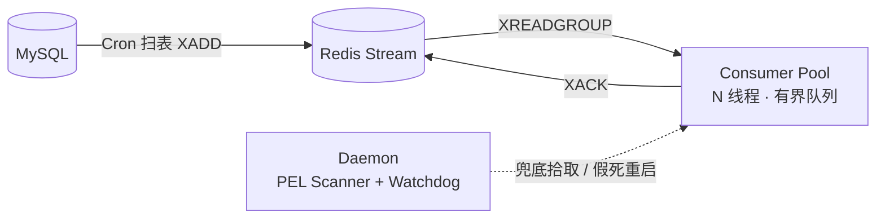

# MOCASA 催收系统升级 — Phase 1 基础设施交互规范

> **版本**: Phase 1 · 仅覆盖菲律宾市场  
> **日期**: 2026-07-01  
<<<<<<< HEAD
> **关联文档**: [产品需求文档 (PRD)](./MOCASA催收系统升级_Phase1_产品需求文档_PRD.md)、[架构设计文档](./MOCASA催收系统升级_Phase1_架构设计文档.md)、[核心引擎规格](./MOCASA催收系统升级_Phase1_核心引擎规格.md)、[数据接入规格](./MOCASA催收系统升级_Phase1_数据接入规格.md)
=======
> **关联文档**: [产品需求文档 (PRD)](./MOCASA催收系统升级_Phase1_产品需求文档_PRD.md)、[架构设计文档](./MOCASA催收系统升级_Phase1_架构设计文档.md)、[核心引擎规格](./MOCASA催收系统升级_Phase1_核心引擎规格.md)、[领域模型与数据定义](./MOCASA催收系统升级_Phase1_领域模型与数据定义.md)、[数据接入规格](./MOCASA催收系统升级_Phase1_数据接入规格.md)
>>>>>>> origin/ca_branch

---

## 目录

- [1. 消费线程模型](#1-消费线程模型)
- [2. 事件总线（Redis Stream）](#2-事件总线redis-stream)
- [3. 运行时状态（Redis KV）](#3-运行时状态redis-kv)
- [4. 定时调度（XXL-Job）](#4-定时调度xxl-job)
- [5. 持久层（Repository）](#5-持久层repository)
- [6. 配置管理与可观测性](#6-配置管理与可观测性)
- [附录：运行配置与环境](#附录运行配置与环境)
  - [A.1 配置来源与热更](#a1-配置来源与热更)
  - [A.2 引擎与事件总线](#a2-引擎与事件总线)
<<<<<<< HEAD
=======
    - [A.2.1 Phase 1 生效（缺省即可）](#a21-phase-1-生效缺省即可)
    - [A.2.2 Redis / 生产切换预留](#a22-redis-生产切换预留)
>>>>>>> origin/ca_branch
  - [A.3 接入与 PubSub](#a3-接入与-pubsub)
  - [A.4 迁移与触达](#a4-迁移与触达)
  - [A.5 接入层 Redis 键](#a5-接入层-redis-键)
  - [A.6 上线前联调签字（接入）](#a6-上线前联调签字接入)

---

## 1. 消费线程模型

[核心引擎规格 §3.1](./MOCASA催收系统升级_Phase1_核心引擎规格.md#31-线程隔离trigger-to-event) 定义了线程隔离的架构决策（Consumer Pool 与 Cron Thread 分离），本节给出具体规格参数和安全约束。

### 线程池架构



Consumer / Cron / Daemon **三组线程互不共享线程池**，任何一组阻塞不影响其他组。参数与背压策略见下表。

### Consumer 线程池规格

| 参数 | 值 | 说明 |
|---|---|---|
| 类型 | `ThreadPoolExecutor` | 非 `ScheduledThreadPool`，调度由消费循环自驱 |
| corePoolSize | `engine.consumer.thread_pool_size`（默认 8） | 等于消费并发度 |
| maximumPoolSize | = corePoolSize | 固定大小，不动态扩缩；突发流量由队列缓冲 |
| workQueue | `LinkedBlockingQueue(engine.consumer.queue_capacity)`（默认 256） | 有界队列 |
| rejectedExecutionHandler | `CallerRunsPolicy` | 队列满时阻塞消费循环线程，XREADGROUP 暂停拉取，Redis Stream 自然积压但不丢消息 |
| threadFactory | `NamedThreadFactory("engine-consumer-%d")` | 线程命名便于日志 / thread dump 定位 |
| keepAliveTime | 0（core 不回收） | 固定池大小 |

> 拒绝策略选择 `CallerRunsPolicy` 而非 `AbortPolicy`（丢任务抛异常）或 `DiscardPolicy`（静默丢弃）：队列满 → Caller 阻塞 → XREADGROUP 停拉 → Stream 积压 → 上游感知背压。不丢消息、不 OOM、无需额外流控。

### 降级日志防刷

`CallerRunsPolicy` 触发时须输出 WARN 日志，但高负载下可能每秒触发数百次。**约束**：背压日志必须使用 `RateLimiter` 压制（每 5 秒最多一条），内容包含当前队列深度和 Stream 积压量：

```
WARN [engine-consumer-loop] BackpressureTriggered — queue_depth=256, stream_pending=1832
```

> Watchdog 检测心跳时须排除"Caller 线程正在执行被拒绝任务"的场景（通过原子标志位 `callerRunning` 区分），防止将背压误判为假死。

### Daemon 线程组规格

| 守护任务 | 线程模型 | 执行频率 | 安全约束 |
|---|---|---|---|
| PEL Scanner | `ScheduledThreadPoolExecutor(1)`，命名 `engine-pel-scanner` | 每 5 分钟（`engine.consumer.pel_scan_interval_minutes`） | 每次 XPENDING 必须携带 `COUNT`（`engine.consumer.pel_batch_size`，默认 100），防止崩溃重启后一次性捞出海量积压导致 OOM |
| Watchdog | `ScheduledThreadPoolExecutor(1)`，命名 `engine-watchdog` | 每 `engine.watchdog.heartbeat_interval_seconds`（默认 10s）检测一次 | 必须 catch **`Throwable`**（非仅 `Exception`），防止偶发 Redis 连接超时的 `Error` 导致看门狗线程退出 |

> PEL 扫描是低频兜底机制（处理崩溃后遗留消息），5 分钟间隔足够。扫描频率不应高于看门狗超时阈值（60s），避免 PEL 消息在 idle 阈值（10min）内被误判为活跃。

### 背压告警联动

Consumer 线程池必须注册 Micrometer `ExecutorServiceMetrics`，确保 [运维与协作](./MOCASA催收系统升级_Phase1_运维与协作.md) §1.2.2 定义的 `collection.event.consumer.thread.utilization` 和 `collection.event.stream.lag` 指标有数据来源。

---

## 2. 事件总线（Redis Stream）

**接口**：`CollectionEventBus`（`collection-common`），业务模块只依赖接口，不感知底层实现。

<<<<<<< HEAD
=======
| 实现 | 何时用 | 切换键 |
|---|---|---|
| `InMemoryEventBus` | Phase 1 默认，本地/CI 链路验证 | `collection.eventbus=memory`（缺省） |
| `RedisStreamEventBusImpl` | 生产环境（HANDOFF D1，待实现） | `collection.eventbus=redis` |

> **本节范围**：§2～§2.2 描述 **Redis Stream 生产语义**（XACK、PEL、DLQ、看门狗等）。Phase 1 内存版仅覆盖异步消费 + 背压，**不含**上述 Redis 能力（handler 异常仅 log，无 NACK/重投）；Phase 1 须配键见 [附录 A.2.1](#a21-phase-1-生效缺省即可)。

>>>>>>> origin/ca_branch
**实现选型** ✅：技术栈为 Spring Boot 2.7.18，采用 Spring Data Redis 内置的 **`StreamMessageListenerContainer`**（Consumer Group 模式）承载消费循环，无需手写 Lettuce 轮询。容器负责订阅、反序列化分发与基础错误重启；PEL 拾取与看门狗作为崩溃/连接假死的兜底补充（下述）：

```java
public interface CollectionEventBus {
    void publish(CollectionEvent event);
    void subscribe(EventType eventType, EventHandler handler); // 实际用枚举增强类型安全
}
```

| 实现细节 | 说明 |
|---|---|
| 发布端 | `XADD` 写入 Redis Stream，事件序列化为 JSON，包含事件信封（eventId、eventType、timestamp、payload） |
| 消费端 | `XREADGROUP` 消费组模式，Consumer Group 保证同一事件仅被组内一个消费者处理 |
<<<<<<< HEAD
| ACK 机制 | 业务处理成功后显式 `XACK`；处理失败不 ACK → pending list → 重投递；不可重试（如反序列化失败）→ 直接 DLQ；retryable 但重投递次数达上限（`engine.consumer.max_delivery_count`，默认 5）→ DLQ + 告警（毒消息防护，避免无限重投占满 Consumer） |
=======
| ACK 机制 | 业务处理成功后显式 `XACK`；处理失败不 ACK → 滞留 PEL → 超时后重投递；不可重试（如反序列化失败）→ 直接 DLQ |
| 事件重投上限 | 跨消费重投次数达 `engine.consumer.max_delivery_count`（默认 5）→ XACK 移出 PEL + 写 DLQ + 告警（毒消息防护） |
| 渠道发送重试 | 单次消费内，渠道 dispatch 失败由 `StepExecutionOrchestrator` 按 `engine.step.max_retry_count`（默认 3）退避重试；**与事件重投计数无关** |
>>>>>>> origin/ca_branch

**PEL 拾取机制**

<<<<<<< HEAD
```
1. XPENDING <stream> <group> - + COUNT  （返回每条消息的投递次数 delivery_count）
2. 对 idle > pel_idle_minutes 的消息执行 XAUTOCLAIM（或 XCLAIM），转移至当前消费者
3. delivery_count > max_delivery_count 的消息判定为毒消息 → XACK 移出 PEL + 写 DLQ + 告警（不再重投）
4. 其余重新投入消费管线处理（幂等保护保证安全重试）
```
=======
消费者 `XREADGROUP` 后、`XACK` 前崩溃或假死 → 消息滞留 PEL，读 `>` 无法触达，须主动拾取。启动时扫一次，PEL Scanner 定期扫（频率见 [§1](#1-消费线程模型)）。
>>>>>>> origin/ca_branch

| 步骤 | 动作 | 判定 / 处置 |
|---|---|---|
| 1. 发现 | `XPENDING … COUNT` | 列出 PEL 中各消息的 idle 时长与 `delivery_count` |
| 2. 认领 | `XAUTOCLAIM`（或 `XCLAIM`） | 仅对 idle > `pel_idle_minutes`（默认 10min）的消息转移给当前消费者；阈值须大于单条最长处理时间，避免误抢正在处理的消息 |
| 3. 毒消息 | `delivery_count > max_delivery_count` | XACK 移出 PEL → 写 DLQ → 告警，不再重投 |
| 4. 正常重投 | 其余已认领消息 | 重新进入消费管线；引擎步骤幂等锁（`lock:plan:`）保证安全重试 |

**看门狗机制**：`StreamMessageListenerContainer` 的轮询线程在连接假死（Lettuce 连接断开但无异常退出，容器 ErrorHandler 不触发）时可能静默停摆。线程规格见 [§1](#1-消费线程模型)，核心逻辑：

| 组件 | 行为 |
|---|---|
| 容器投递 | `MessageListener` 在每次投递（含空轮询回调）后更新心跳时间戳（Redis `SET` 或内存变量） |
<<<<<<< HEAD
| 守护线程 | 心跳超时（`watchdog.timeout_seconds`，默认 60s）时：① 先 `container.stop()` 优雅停止旧订阅（等待终止）；② 重建 Lettuce 连接并 `container.start()` 重启订阅；③ 触发告警（[运维与协作](./MOCASA催收系统升级_Phase1_运维与协作.md)） |
=======
| 守护线程 | 心跳超时（`engine.watchdog.timeout_seconds`，默认 60s）时：① 先 `container.stop()` 优雅停止旧订阅（等待终止）；② 重建 Lettuce 连接并 `container.start()` 重启订阅；③ 触发告警（[运维与协作](./MOCASA催收系统升级_Phase1_运维与协作.md)） |
>>>>>>> origin/ca_branch

> 重启前必须先停止旧订阅，防止旧连接（网络卡顿非真死）与新连接并存导致双重消费。

### 2.1 DLQ 重放（redrive）

> 上文 ACK / PEL 机制定义消息**进入** DLQ 的条件（不可重试、重投递次数达上限）。本节定义消息**移出** DLQ 的重放路径，是 DLQ 三级恢复中"自动重放"一环的运行时唯一归属（架构 §1.6 附：基础设施实现索引登记此处）。

| 项 | 约定 |
|---|---|
| 持久化 | DLQ 消息落 MySQL（含原始信封 + 入队原因 + 投递次数 + 首次/末次失败时间），不仅留在 Redis，避免实例重启丢失 |
| 自动重放 | 定时任务扫描可重放消息（排除反序列化失败等不可恢复毒消息），重投回原 Stream 消费管线；重放计数独立，二次失败仍达上限 → 标记为"需人工" |
| 幂等保障 | 重放复用既有事件消费去重（`processed:{event_id}`，[§3](#3-运行时状态redis-kv)），保证重复投递安全 |
| 人工兜底 | 不可恢复 / 重放仍失败的消息保留待人工处理，并告警（[运维与协作](./MOCASA催收系统升级_Phase1_运维与协作.md)，规划中） |
<<<<<<< HEAD
| 接入 PubSub DLQ → ops 队列 | 接入层毒丸 / 校验 poison 写 DLQ 时，**同步**写 `t_ops_exception`（`INGESTION_FAILURE`）；字段映射与责任方见 [数据接入规格 §2.3](./MOCASA催收系统升级_Phase1_数据接入规格.md#23-消费可靠性) |
=======
>>>>>>> origin/ca_branch

### 2.2 重放前合规时段校验

> 重放可能发生在原触达时点之后较久，若直接重投会产生"业务时间毒丸"——在合规禁止时段（如夜间）触发触达。

- 自动重放前必须校验当前是否处于合规可触达时段；落在禁止时段的触达类事件**延迟到下一个合规窗口**再重投，而非立即消费。
- 合规时段判定复用 `ExecutionGuard` 的时段规则口径（[核心引擎规格 §7.3 L1 基础设施异常](./MOCASA催收系统升级_Phase1_核心引擎规格.md#73-l1-基础设施异常)、[渠道编排规格](./channel/MOCASA催收系统升级_Phase1_渠道编排规格.md)），本节只约束"重放调度时机"，不重复定义合规规则。

---

## 3. 运行时状态（Redis KV）

核心引擎涉及的 Redis 数据遵循统一的 key 设计和生命周期管理。

### Key 前缀约定

| 前缀 | 用途 | 数据类型 | 示例 |
|---|---|---|---|
| `compliance:` | 合规计数器（每日/每周触达次数） | String（计数） | `compliance:daily:{user_id}:{channel}:{date}` |
| `processed:` | 事件消费去重标记 | String（标记） | `processed:{event_id}` |
| `lock:plan:` | 分布式幂等锁（步骤级） | String（SETNX） | `lock:plan:{step_idempotency_key}` |
| `idempotency:` | 渠道层二次去重 | String（SETNX） | `idempotency:channel:{idempotency_key}` |
<<<<<<< HEAD
| `ingestion:` | 接入层 PubSub 幂等 / 日切 dedup（Phase 1 可内存实现） | String | 见 [附录 A.5](#a5-接入层-redis-键) |

> 接入层 key 须与旧催收 Redis **物理或前缀隔离**（新系统 `ingestion:*` / `ai:*`）。语义与 TTL → [数据接入 §3.3](./MOCASA催收系统升级_Phase1_数据接入规格.md#33-接入幂等键)。
=======
| `ingestion:` | 接入层 PubSub 幂等 / 日切 dedup（Phase 1 可内存实现） | String | 见 [数据接入 §3.3](./MOCASA催收系统升级_Phase1_数据接入规格.md#33-接入幂等键)（[A.5](#a5-接入层-redis-键) 索引） |

> 接入层 key 须与旧催收 Redis **物理或前缀隔离**（新系统 `ingestion:*` / `ai:*`）。
>>>>>>> origin/ca_branch

### TTL 策略

| Key 类型 | TTL | 理由 |
|---|---|---|
| 合规计数器（daily） | 当日 23:59:59 过期 | 自然日重置 |
| 合规计数器（weekly） | 7 天 | 自然周重置 |
| 幂等锁 | 15 分钟（`engine.step.idempotency_ttl_minutes`） | 覆盖事件重复消费窗口，过期自动释放 |
| 渠道层去重 | 24 小时 | 覆盖供应商回调延迟窗口 |
| 事件消费去重 | 24 小时 | At-least-once 消费去重 |
| 看门狗心跳 | 无 TTL（持续覆写） | 守护线程主动检查，无需自动过期 |

### 内存淘汰策略

Redis 实例配置 ✅ `maxmemory-policy = volatile-lru`：仅淘汰设有 TTL 的 key，保护无 TTL 的 Stream 数据不被误驱逐。

### 合规计数器实现约束

`ExecutionGuard` 的硬超时为 20ms（[核心引擎规格 §6.1](./MOCASA催收系统升级_Phase1_核心引擎规格.md#61-接口总览)）。合规计数的读取 + 增加 + 设 TTL 必须在**单次 Redis 交互**内完成，使用 Lua 脚本或 Pipeline，目标延迟 < 5ms：

```lua
local current = redis.call('INCR', KEYS[1])
if current == 1 then
    redis.call('EXPIREAT', KEYS[1], ARGV[1])
end
return current
```

---

## 4. 定时调度（XXL-Job）

核心引擎通过 XXL-Job 实现 Trigger-to-Event 模式（[核心引擎规格 §3.1](./MOCASA催收系统升级_Phase1_核心引擎规格.md#31-线程隔离trigger-to-event)）。本节明确 Job Handler 定义及伪代码中 `register_job()` / `cancel_scheduled_jobs()` 的底层语义。

### Job Handler 定义

<<<<<<< HEAD
| Handler | Cron | 扫描逻辑 | 发布事件 |
|---|---|---|---|
| `planStepDueHandler` | `0 * * * * ?`（每分钟） | `t_contact_plan_step WHERE trigger_time <= NOW()` 且步骤状态为待触发、关联计划为非终态 | `PLAN_STEP_DUE` |
| `callbackTimeoutHandler` | `0 * * * * ?`（每分钟） | `t_contact_plan_step WHERE timeout_time <= NOW() AND status = 'EXECUTING'` 且关联计划为非终态 | `CALLBACK_TIMEOUT`（[核心引擎规格 §4.3.4](./MOCASA催收系统升级_Phase1_核心引擎规格.md#434-callback_timeout)） |
| `dailyRoll`（`DpdStageRollHandler`） | `0 5 0 * * ?`（每日 0:05 PHT） | 读旧库在催名单 + bill DPD，hybrid 重算 Max DPD | `STAGE_CHANGED` / `CASE_CEASED`（[数据接入 §4](./MOCASA催收系统升级_Phase1_数据接入规格.md#4-阶段变更与-dpd-日切)） |
| `ptpExpiredHandler`（**Phase 2 预留，Phase 1 不启用**） | — | — | `PTP_EXPIRED`（Phase 1 引擎不消费，见 [核心引擎规格 §4.6](./MOCASA催收系统升级_Phase1_核心引擎规格.md#46-ptp-到期处理)） |
=======
调度侧只扫表/扫旧库并发事件；业务在引擎 Consumer 执行。Phase 1 共 3 个 Handler（`ptpExpiredHandler` Phase 2 预留，不注册）。
>>>>>>> origin/ca_branch

| Handler | 类 · 模块 | Cron | 扫描条件 → 事件 | 引擎入口 |
|---|---|---|---|---|
| `planStepDueHandler` | `TriggerScanner` · admin | 每分钟 | `trigger_time≤NOW`，步骤待触发，计划非终态 → `PLAN_STEP_DUE` | `prepareStepDue` → `executeStep` |
| `callbackTimeoutHandler` | 同上 | 每分钟 | `timeout_time≤NOW`，`EXECUTING`，计划非终态 → `CALLBACK_TIMEOUT` | `onCallbackTimeout`（[§4.3.4](./MOCASA催收系统升级_Phase1_核心引擎规格.md#434-callback_timeout)） |
| `dailyRoll` | `DpdStageRollHandler` · ingestion | 0:05 PHT | 旧库 DPD 重算 → `STAGE_CHANGED` / `CASE_CEASED` | `onStageChanged` / `onCaseCeased`（[接入 §4](./MOCASA催收系统升级_Phase1_数据接入规格.md#4-阶段变更与-dpd-日切)） |

> **Phase 1 实现**：前两个 Handler 由 admin `TriggerScanner` 的 `@Scheduled`（`collection.scan.interval-ms`，默认 5s）驱动，逻辑同上；生产改 XXL-Job 按 Cron 触发。`dailyRoll` 独立在 ingestion，占位待接 Job。触达精度 ±1min 可接受。

**扫描分页**：每批 `LIMIT N`（默认 1000，`engine.consumer.scan_limit`）；`count==LIMIT` 告警、等下轮 Cron，禁止单 Job 内递归扫完（[运维与协作](./MOCASA催收系统升级_Phase1_运维与协作.md)）。

### 伪代码 → DB 调度（`register_job` / `cancel_scheduled_jobs`）

<<<<<<< HEAD
[核心引擎规格 §4 / §5](./MOCASA催收系统升级_Phase1_核心引擎规格.md#4-计划生命周期与状态机) 伪代码中的 `register_job()` 和 `cancel_scheduled_jobs()` 是逻辑抽象，底层实现基于"写 DB + Cron 扫描"模式：
=======
引擎伪代码中的调度注册**不建独立 Job**，而是写 DB 字段，由上表 Cron 到期扫表拾取（[引擎 §4/§5](./MOCASA催收系统升级_Phase1_核心引擎规格.md#4-计划生命周期与状态机)）：
>>>>>>> origin/ca_branch

| 伪代码 | 写库 | 由谁扫 |
|---|---|---|
| `register_job(PLAN_STEP_DUE, t)` | `trigger_time=t`，步骤待触发 | `planStepDueHandler` |
| `register_job(CALLBACK_TIMEOUT, min)` | `timeout_time=NOW()+min`（§5 ⑤ dispatch 后） | `callbackTimeoutHandler` |
| `cancel_scheduled_jobs(plan)` | 计划置终态；扫描 SQL 过滤非终态计划，自动跳过 | — |

<<<<<<< HEAD
Cron 线程仅做"扫表 → 发事件 → 返回"，**严禁 I/O 阻塞**（[核心引擎规格 §3.1](./MOCASA催收系统升级_Phase1_核心引擎规格.md#31-线程隔离trigger-to-event)），所有业务处理由 Consumer 线程池完成。

> **投诉解冻恢复**：被实时冻结"停住"的计划仍为非终态（[核心引擎规格 §5 ②](./MOCASA催收系统升级_Phase1_核心引擎规格.md#5-步骤执行管线)）。解冻时 admin 清除案件级实时冻结标记，并对该计划当前步骤重新 `register_job(PLAN_STEP_DUE, NOW())`（即重设 `trigger_time`）让 Cron 重新拾取、从停住步骤恢复——复用既有事件，不新增事件/状态。冻结标记为**实时案件状态字段**，由 PreFlightChecker 实时读取，不写入 snapshot、不走合规计数器（[运行时状态 §3 合规计数器](#3-运行时状态redis-kv) 仅服务 ExecutionGuard）。若解冻发生在原步骤幂等锁 TTL（默认 15 分钟）内，重注入可能被 §5 ① 吸收；admin 恢复实现须等待幂等窗口过期，或显式清理/更换该步骤幂等键后再重注入。（可选：若不依赖 admin 重注入，infra 也可在冻结时注册短延迟 `PLAN_STEP_DUE` 自轮询，解冻后下一次重扫自动通过；Phase 1 默认走 admin 重注入，避免冻结期 Job 轮询开销。）
=======
Cron 线程只做扫表→发事件→返回，**禁止业务 I/O**（[§3.1](./MOCASA催收系统升级_Phase1_核心引擎规格.md#31-线程隔离trigger-to-event)）。

### Cron 重复扫描与去重

Cron **不改步骤状态**，迁出扫描集前每轮会重发同一 `(planId, stepId)`，且每次 `eventId` 新生成——**不靠** `processed:{event_id}` 去重，靠步骤幂等锁 `lock:plan:`（[引擎 §5 ①](./MOCASA催收系统升级_Phase1_核心引擎规格.md#5-步骤执行管线)）在管线入口吸收；幂等锁在合规计数（§5 ③）之前，故重复 Cron 不会重复 INCR。

| 事件 | 迁出扫描集 | 重复发布收敛 |
|---|---|---|
| `PLAN_STEP_DUE` | Consumer 消费后步骤离开「待触发」 | 幂等锁 |
| `CALLBACK_TIMEOUT` | Consumer 消费后步骤离开 `EXECUTING`/超时态 | 步骤状态 + 幂等锁 |

> **投诉解冻**：admin 清冻结标记 + 对当前步骤 `register_job(PLAN_STEP_DUE, NOW())` 重设 `trigger_time`；若仍在幂等锁 TTL（15min）内，须等 TTL 过期或显式清锁后再重注入（[引擎 §5 ②](./MOCASA催收系统升级_Phase1_核心引擎规格.md#5-步骤执行管线)）。
>>>>>>> origin/ca_branch

---

## 5. 持久层（Repository）

<<<<<<< HEAD
核心引擎通过 Repository 接口访问持久层。**本节只定义 Repository 方法语义与事务要求**；表结构见 [领域模型与数据定义](./MOCASA催收系统升级_Phase1_领域模型与数据定义.md)。MyBatis Mapper 实现位于 `collection-service`，不对引擎暴露。
=======
引擎与 admin Cron 经 `collection-common` 契约访问 MySQL。**方法全集** → 接口 Javadoc + [领域模型](./MOCASA催收系统升级_Phase1_领域模型与数据定义.md)；**实现** → `collection-service`（MyBatis）。
>>>>>>> origin/ca_branch

### 5.1 场景映射

按**领域事件 / Cron 调度**（§4）聚合 Repository 读写；`Orchestrator` 由 `PLAN_STEP_DUE` 链式触发，不单列。

| 触发 | Repository 访问 |
|---|---|
| `CASE_INGESTED` / `STAGE_CHANGED` | 读 payload→snapshot；升档 carry-forward / 写 `savePlan` |
| `PLAN_STEP_DUE` | **prepareStepDue**（事务）：R 锁计划/查步骤 · W 计划→EXECUTING、`markStarted`、清 trigger（观察期：W 步骤 COMPLETED）→ **executeStep**：R `getContactHistory` · W `updateStepStatus`, `writeTimeline`, `updateStepTimeoutTime`… |
| `CHANNEL_CALLBACK` / `CALLBACK_TIMEOUT` | 写 `updateStepStatus`（不写 timeline，见 [引擎 §4.3.3](./MOCASA催收系统升级_Phase1_核心引擎规格.md#433-channel_callback)） |
| `STEP_COMPLETED` | 读 `getNextStep` / 写 `updateStepTriggerTime`, `updatePlanStatus`, `updateCurrentStep` |
| `REPAYMENT_RECEIVED` / `CASE_CEASED` / 升档取消 | 读 `findActivePlansByCase` / 写 `updatePlanStatus`→CANCELLED |
| `PLAN_EXHAUSTED` | 读 `plan.context_snapshot` / 写 `savePlan` |
| Cron（§4） | 读 `findDueSteps`, `findTimeoutSteps` |

`CaseService` 不参与上表（建计划用 payload；守卫/兜底读库，见 §5.2）。`PTP_EXPIRED` Phase 2。

### 5.2 契约分工

| 接口 | 调用方 | 读写 | 职责 |
|---|---|---|---|
<<<<<<< HEAD
| 计划创建 | `CASE_INGESTED` / `STAGE_CHANGED` | payload 组装 snapshot（决策 B，不读旧库）；`STAGE_CHANGED` carry-forward 旧 plan.context_snapshot | savePlan(plan+steps) |
| 步骤到期 | `PLAN_STEP_DUE` | — | updatePlanStatus(STEP_EXECUTING) |
| 步骤执行（发送路径） | （Orchestrator 内部） | getContactHistory | updateStepStatus, writeTimeline |
| 渠道回调/超时 | `CHANNEL_CALLBACK` / `CALLBACK_TIMEOUT` | — | updateStepStatus（**不写** timeline；admin Webhook/对账路径落库，见 [引擎 §4.3.3/4.3.4](./MOCASA催收系统升级_Phase1_核心引擎规格.md#433-channel_callback)） |
| 步骤完成推进 | `STEP_COMPLETED` | getNextStep | updateStepTriggerTime |
| 中断取消 | `REPAYMENT_RECEIVED` / `STAGE_CHANGED` / `CASE_CEASED` | findActivePlans | updatePlanStatus(CANCELLED) |
| 穷尽续建 | `PLAN_EXHAUSTED` | deserialize plan.context_snapshot（决策 B，不回读旧库） | savePlan |
| PTP到期（**Phase 2 预留**） | `PTP_EXPIRED`（Phase 1 不消费） | — | — |

> **`getCaseInfo` / `getContextSnapshot` 使用边界**（非计划创建主路径）：`isRepaid`/`getCaseInfo` 供 `PreFlightChecker`（[引擎 §5 ②](./MOCASA催收系统升级_Phase1_核心引擎规格.md#5-步骤执行管线)）实时守卫；`getContextSnapshot` 供对账/运维兜底；`CASE_INGESTED` 建计划**不走**上述读路径。
=======
| `ContactPlanRepository` | 引擎、`TriggerScanner` | 读写 | 计划/步骤、行锁、Cron 扫表 |
| `TimelineRepository` | Orchestrator、ContextAssembler | 读写 | 触达时间线 |
| `DecisionLogRepository` | 引擎决策日志 | 只写 | `t_decision_log` |
| `CaseService` | 守卫 / payload 兜底 | 只读 | 建计划→payload；守卫→旧库；兜底→`getContextSnapshot` |
>>>>>>> origin/ca_branch

### 5.3 事务与行锁

<<<<<<< HEAD
| 方法 | 语义 | 事务要求 | 对应表 |
|---|---|---|---|
| findPlanWithLock(planId) | SELECT FOR UPDATE 获取单计划行锁 | 必须在事务内 | t_contact_plan |
| findPlansWithLock(List\<Long\> planIds) | 批量 SELECT FOR UPDATE；**实现内部必须按 planId 升序排列后再加锁**，防止死锁 | 必须在事务内 | t_contact_plan |
| findActivePlansByUser(userId) | 用户所有非终态计划 | 只读 | t_contact_plan |
| findActivePlansByCase(caseId) | 案件所有非终态计划 | 只读 | t_contact_plan |
| savePlan(plan) | 持久化计划 + 步骤序列 | 事务 | t_contact_plan + t_contact_plan_step |
| updatePlanStatus(planId, status, reason) | 计划状态写入 | 事务 | t_contact_plan |
| updateStepStatus(stepId, status, result) | 步骤执行结果 | 事务 | t_contact_plan_step |
| updateStepTriggerTime(stepId, time) | 注册下一步到期 | 事务 | t_contact_plan_step |
| updateStepTimeoutTime(stepId, time) | 注册回调超时 | 事务 | t_contact_plan_step |
| writeTimeline(entry) | 写触达时间线 | 事务 | t_contact_timeline |
| getCaseInfo(caseId) | 案件基本信息 | 只读 | t_collection_case |
| getContextSnapshot(caseId) | 不可变快照 | 只读 | t_contact_plan.context_snapshot |
| getContactHistory(userId, limit) | 近期触达历史 | 只读 | t_contact_timeline |
| isRepaid(caseId) | 实时还款状态 | 只读 | t_collection_case |
| getPtpRecord(ptpId) | PTP 记录（**Phase 2 预留**，Phase 1 不实现） | 只读 | t_collection_ptp_info（Phase 2） |
| updatePtpStatus(ptpId, status) | PTP 状态更新（**Phase 2 预留**，Phase 1 不实现） | 事务 | t_collection_ptp_info（Phase 2） |
| getNextStep(planId, currentStepOrder) | 计划中的下一步 | 只读 | t_contact_plan_step |
| getLastCompletedPlan(caseId) | 最近完成/穷尽的计划 | 只读 | t_contact_plan |
=======
| 约束 | 要求 | 典型 |
|---|---|---|
| 行锁 | `@Transactional` 内调用；`FOR UPDATE` 持至 COMMIT | `findPlanWithLock` |
| 写事务 | 多行/多表写同一事务，失败整笔回滚 | `savePlan`, `updateStepStatus`, `writeTimeline` |
| 只读 | 无写锁要求 | 查询、Cron 扫表 |
| 批量加锁 | `findPlansWithLock` 按 planId **升序**（规格预留） | 防死锁 |

短事务（`PlanLifecycleManager`）与 Orchestrator 非事务 I/O 见 [引擎 §3.1](./MOCASA催收系统升级_Phase1_核心引擎规格.md#31-线程隔离trigger-to-event)。
>>>>>>> origin/ca_branch

---

## 6. 配置管理与可观测性

### 6.1 配置刷新机制

<<<<<<< HEAD
运行时连接、模块参数由 **Nacos** / 环境变量下发（见 [操作说明_Nacos本地启动.md](./操作说明_Nacos本地启动.md)）。**键名 SSOT 见 [附录 A.2～A.4](#附录运行配置与环境)**；行为与默认值见各模块正文（引擎 / [数据接入](./MOCASA催收系统升级_Phase1_数据接入规格.md)）。

| 项 | 规格 |
|---|---|
| Phase 1 主路径 | Nacos YAML + `@RefreshScope`（`engine.*`、`collection.*`、渠道密钥） |
| Phase 2 可选 | `t_system_property`（MySQL）定时轮询热更 |

**参数热更分类**（附录 A.2～A.4「热更」列）：

| 分类 | 特征 | 代码行为 |
=======
运行时参数由 **Nacos YAML**（DataId 如 `intelligent-collection-common.yml`）+ Spring **`@RefreshScope`** 热更；GCP 凭证等走环境变量（[操作说明_Nacos本地启动.md](./操作说明_Nacos本地启动.md)）。**键名与默认值 SSOT** → [附录 A.2～A.4](#附录运行配置与环境)；Phase 2 可选 `t_system_property` DB 轮询。

| 前缀 | 配什么 | 举例（非完整清单） |
>>>>>>> origin/ca_branch
|---|---|---|
| `engine.*` | 引擎行为：重试/幂等 TTL、SPI 超时、Consumer 池、scan_limit、合规时段 | `engine.step.idempotency_ttl_minutes`、`engine.consumer.scan_limit` |
| `collection.*` | 接入开关、eventbus/idempotency 切换、Cron 间隔、迁移双写 | `collection.ingestion.enabled`、`collection.eventbus`、`collection.scan.interval-ms` |
| `channel.*` | 渠道 API 密钥、endpoint、模板/号段（**同 Nacos YAML**，运维下发，不入 Git） | `channel.notification.app-key`、SendGrid API key → [渠道开发执行指南 §6](./channel/MOCASA催收系统升级_Phase1_collection-channel开发执行指南.md) |

完整键表与热更列 → [附录 A.1～A.4](#附录运行配置与环境)；**写代码绑配置**以 `EngineProperties` / `@ConfigurationProperties` 为准。

### 6.2 可观测性接入约束

本节约束引擎/基础设施的 **Metrics 埋点 + MDC 日志**（→ Prometheus / 日志平台），**不是**后台单案查询（[架构 §1.2.2](./MOCASA催收系统升级_Phase1_架构设计文档.md#122-应用入站)）或 DB 业务表（[§5](#5-持久层repository)）。Phase 1：**Metrics + Logging 做**，Tracing 不做（MDC `eventId`/`caseId` 串联排障）。原则 → [架构 §1.6.8](./MOCASA催收系统升级_Phase1_架构设计文档.md#168-可观测性守卫)；告警/Dashboard → 《运维与协作》（待建）。

#### 6.2.1 指标（Metrics）

经 Actuator `/actuator/prometheus` 暴露：

| 分类 | 埋点位置 | 指标 | 类型 |
|---|---|---|---|
| 系统 | Actuator | JVM / HTTP / health | 自动装配，免埋点 |
| 基础设施 | 事件总线 | `event.published`, `event.consumed`, `event.consume.duration` | Counter / Timer |
| 基础设施 | Consumer 线程池 | `event.consumer.thread.utilization` | Gauge |
| 基础设施 | Stream / PEL | `event.stream.lag`, `event.pending` | Gauge |
| 基础设施 | DLQ / Watchdog | `event.dlq.size`, `event.watchdog.restart` | Counter |
| 引擎 | `StepExecutionOrchestrator` | `touch.total`, `step.duration` | Counter / Timer |
| 引擎 | 守卫 fail-close | `step.skipped` | Counter |
| 引擎 | `SpiInvoker` | `spi.timeout` | Counter（SPI tag） |
| 引擎 | reaper / 回查补发 | `reconcile.resend` | Counter |

> 引擎侧指标对应架构 §1.6.8 静默路径须可观测；总线类以生产实现为准，Phase 1 内存版可省略。

#### 6.2.2 结构化日志（MDC）

引擎关键路径日志必须通过 SLF4J MDC 携带以下字段（logback pattern 输出 `%X{caseId}` 等）：

| MDC Key | 来源 | 生命周期 |
|---|---|---|
| `caseId` | 事件 payload | 消费入口 set → 处理完成 clear |
| `planId` | Plan 实体 | PlanLifecycleManager 入口 set |
| `stepId` | Step 实体 | StepExecutionOrchestrator 入口 set |
| `eventType` / `eventId` | 事件信封 | 消费入口 set |
| `consumerId` | 本实例 consumer name | 启动时 set，线程级别 |

**跨线程 MDC 传递（研发红线）**：MDC 基于 `ThreadLocal`，跨线程丢上下文；引擎 Consumer 池（消费循环 → 工作线程）即跨线程场景。

- 禁止原生 `new Thread()` 或未包装的 `ExecutorService` 执行异步任务
- 自建线程池必须用 `MdcTaskDecorator` 包装（提交 `getCopyOfContextMap()` → 执行 `setContextMap(copy)` → 结束 `clear()`）
- Spring `@Async` 的 `AsyncConfigurer` 必须返回包装后的 `Executor`

---

<a id="附录运行配置与环境"></a>

## 附录：运行配置与环境

运维 / 联调检索 **键名、默认值、热更、签字** 的 SSOT。各键**行为语义**见对应模块正文；**未闭合项**见 [数据接入规格 附录 C](./MOCASA催收系统升级_Phase1_数据接入规格.md#附录-c联调与实现跟踪台账)。

| 分册 | 内容 |
|---|---|
| **A.1** | 配置来源与热更分类 |
<<<<<<< HEAD
| **A.2** | 引擎与 Redis Stream（`engine.*`） |
| **A.3** | 接入与 PubSub（`collection.ingestion.*`、GCP 环境变量） |
| **A.4** | 迁移与触达（`collection.notification.owner`） |
| **A.5** | 接入层 Redis 键（`ingestion:*`） |
=======
| **A.2** | Phase 1 生效键 + Redis 切换索引（`engine.*` / `collection.eventbus`） |
| **A.3** | 接入与 PubSub（`collection.ingestion.*`、GCP 环境变量） |
| **A.4** | 迁移与触达（`collection.notification.owner`） |
| **A.5** | 接入 dedup 键索引（SSOT → [数据接入 §3.3](./MOCASA催收系统升级_Phase1_数据接入规格.md#33-接入幂等键)） |
>>>>>>> origin/ca_branch
| **A.6** | 上线前联调签字索引（接入域） |

> 渠道编排参数见 [渠道编排规格](./channel/MOCASA催收系统升级_Phase1_渠道编排规格.md)。**凭证与连接串不入 Git 仓库**。

<a id="a1-配置来源与热更"></a>

### A.1 配置来源与热更

| 来源 | 适用 | 说明 |
|---|---|---|
| **Nacos** | Phase 1 主路径 | `intelligent-collection-common.yml` / 环境 profile |
| **环境变量** | GCP 凭证、本地联调 | 见 A.3「GCP 环境变量」 |
| **`t_system_property`** | Phase 2 可选 | DB 轮询热更；见 [§6.1](#61-配置刷新机制) |

<<<<<<< HEAD
热更列含义：**Y** 下次执行生效 · **Y-注意** 窗口类有交替期 · **N** 需重启 · **—** 环境变量/部署时设定
=======
**热更列含义**（A.2～A.4 各键「热更」列 SSOT）：

| 分类 | 特征 | 代码行为 |
|---|---|---|
| **Y** | 仅影响下一次执行的决策值，不涉及运行时结构 | Nacos 变更后立即生效 |
| **Y-注意** | TTL/超时等窗口类参数 | 生效；改小 TTL 存在「新老交替期」（已写入 key 不追溯，最长=旧 TTL） |
| **N** | 线程池结构、Redis 连接等 | 检测到变更仅 log WARN，**不生效**，须重启 |
| **—** | 环境变量 / 部署时设定 | 非 Nacos 热更路径 |

> **Y-注意 示例**：`idempotency_ttl_minutes` 从 60min 改 10min → 新 key 用 10min，旧 key 仍按写入时 TTL 过期。

**变更审计**（Phase 2）：参数变更写入 `t_system_property_audit`（old/new/operator/timestamp）。
>>>>>>> origin/ca_branch

<a id="a2-引擎与事件总线"></a>

### A.2 引擎与事件总线

<<<<<<< HEAD
=======
**写代码 / 配 Nacos 时只看 [A.2.1](#a21-phase-1-生效缺省即可)**。Redis Stream、PEL、合规计数等生产切换项 Phase 1 未接线；键名与行为语义见正文 [§1～§2](#1-消费线程模型)、[§3](#3-运行时状态redis-kv)、[引擎 §7.4](./MOCASA催收系统升级_Phase1_核心引擎规格.md#74-跨存储一致性修复)（实现切换 HANDOFF D1/D2）。

<a id="a21-phase-1-生效缺省即可"></a>

#### A.2.1 Phase 1 生效（缺省即可）

已绑定 `EngineProperties` / `@ConfigurationProperties`；Nacos 未覆盖时使用下列默认值。

>>>>>>> origin/ca_branch
| 参数 Key | 默认值 | 热更 | 说明 | 规格 |
|---|---|---|---|---|
| `engine.step.idempotency_ttl_minutes` | `15` | Y-注意 | 步骤幂等锁 TTL（分钟） | [引擎 §5](./MOCASA催收系统升级_Phase1_核心引擎规格.md#5-步骤执行管线) |
| `engine.step.max_retry_count` | `3` | Y | 步骤渠道发送最大重试次数 | 引擎 §5 |
| `engine.step.retry_base_interval_seconds` | `30` | Y | 首次重试退避基准（秒） | 引擎 §5 |
| `engine.step.retry_max_interval_seconds` | `300` | Y | 退避上限（秒） | 引擎 §5 |
| `engine.step.retry_backoff_factor` | `2` | Y | 退避倍数 | 引擎 §5 |
<<<<<<< HEAD
| `engine.step.executing_reaper_minutes` | `30` | Y | EXECUTING 滞留 reaper 阈值（分钟） | [引擎 §7.4](./MOCASA催收系统升级_Phase1_核心引擎规格.md#74-跨存储一致性修复) |
| `engine.plan.max_rebuild_count` | `2` | Y | 单案件单阶段最大续建次数 | [引擎 §4.5](./MOCASA催收系统升级_Phase1_核心引擎规格.md#45-穷尽续建) |
| `engine.spi.plan_factory.timeout_ms` | `50` | Y | PlanFactory 硬超时 | [引擎 §6.1](./MOCASA催收系统升级_Phase1_核心引擎规格.md#61-接口总览) |
| `engine.spi.execution_guard.timeout_ms` | `20` | Y | ExecutionGuard 硬超时 | [引擎 §6.1](./MOCASA催收系统升级_Phase1_核心引擎规格.md#61-接口总览) |
| `engine.spi.step_resolver.timeout_ms` | `50` | Y | StepResolver 硬超时 | [引擎 §6.1](./MOCASA催收系统升级_Phase1_核心引擎规格.md#61-接口总览) |
| `engine.spi.advancement_policy.timeout_ms` | `10` | Y | AdvancementPolicy 硬超时 | [引擎 §6.1](./MOCASA催收系统升级_Phase1_核心引擎规格.md#61-接口总览) |
| `engine.spi.exhaustion_policy.timeout_ms` | `50` | Y | ExhaustionPolicy 硬超时 | [引擎 §6.1](./MOCASA催收系统升级_Phase1_核心引擎规格.md#61-接口总览) |
| `engine.consumer.thread_pool_size` | `8` | N | Consumer 线程池大小 | [§1](#1-消费线程模型) |
| `engine.consumer.queue_capacity` | `256` | N | Consumer 有界队列 | §1 |
| `engine.consumer.poll_timeout_ms` | `2000` | Y | XREADGROUP 阻塞超时（ms） | [§2](#2-事件总线redis-stream) |
| `engine.consumer.batch_size` | `10` | Y | XREADGROUP 批大小 | §2 |
| `engine.consumer.pel_scan_interval_minutes` | `5` | Y | PEL 扫描间隔（分钟） | §1 |
| `engine.consumer.pel_idle_minutes` | `10` | Y-注意 | PEL idle 阈值（分钟） | §2 |
| `engine.consumer.pel_batch_size` | `100` | Y | PEL 单次 COUNT 上限 | §1 |
| `engine.consumer.max_delivery_count` | `5` | Y | 最大重投次数；超限 DLQ | §2 |
| `engine.watchdog.heartbeat_interval_seconds` | `10` | N | 心跳上报间隔（秒） | §2 |
| `engine.watchdog.timeout_seconds` | `60` | Y | 看门狗假死阈值（秒） | §2 |
| `engine.redis.key_prefix` | `collection:` | N | Redis 全局前缀 | [§3](#3-运行时状态redis-kv) |
| `engine.compliance.daily_limit` | 按渠道 | Y | 每日触达上限 | [引擎 §5 ③](./MOCASA催收系统升级_Phase1_核心引擎规格.md#5-步骤执行管线) |
| `engine.compliance.weekly_limit` | 按渠道 | Y | 每周触达上限 | [引擎 §5 ③](./MOCASA催收系统升级_Phase1_核心引擎规格.md#5-步骤执行管线) |
| `engine.compliance.quiet_hours_start` | `21:00` | Y | 禁呼开始（PHT） | [引擎 §5 ③](./MOCASA催收系统升级_Phase1_核心引擎规格.md#5-步骤执行管线) |
| `engine.compliance.quiet_hours_end` | `08:00` | Y | 禁呼结束（PHT） | [引擎 §5 ③](./MOCASA催收系统升级_Phase1_核心引擎规格.md#5-步骤执行管线) |
| `engine.consumer.group_name` | `collection-engine` | N | Stream Consumer Group | §2 |
| `engine.consumer.stream_key` | `collection:event_stream` | N | Stream key | §2 |
| `engine.step.callback_timeout_minutes` | `60` | Y-注意 | 异步回调超时（分钟） | [引擎 §4.3.4](./MOCASA催收系统升级_Phase1_核心引擎规格.md#434-callback_timeout) |
| `engine.context.history_max_records` | `50` | Y | contactHistory 最大条数 | 引擎 §6.2 |

=======
| `engine.step.callback_timeout_minutes` | `60` | Y-注意 | 异步回调超时（分钟） | [引擎 §4.3.4](./MOCASA催收系统升级_Phase1_核心引擎规格.md#434-callback_timeout) |
| `engine.plan.max_rebuild_count` | `2` | Y | 单案件单阶段最大续建次数 | [引擎 §4.5](./MOCASA催收系统升级_Phase1_核心引擎规格.md#45-穷尽续建) |
| `engine.spi.plan_factory.timeout_ms` | `50` | Y | PlanFactory 硬超时 | [引擎 §6.1](./MOCASA催收系统升级_Phase1_核心引擎规格.md#61-接口总览) |
| `engine.spi.execution_guard.timeout_ms` | `20` | Y | ExecutionGuard 硬超时 | 引擎 §6.1 |
| `engine.spi.step_resolver.timeout_ms` | `50` | Y | StepResolver 硬超时 | 引擎 §6.1 |
| `engine.spi.advancement_policy.timeout_ms` | `10` | Y | AdvancementPolicy 硬超时 | 引擎 §6.1 |
| `engine.spi.exhaustion_policy.timeout_ms` | `50` | Y | ExhaustionPolicy 硬超时 | 引擎 §6.1 |
| `engine.consumer.thread_pool_size` | `8` | N | Consumer 线程池大小 | [§1](#1-消费线程模型) |
| `engine.consumer.queue_capacity` | `256` | N | Consumer 有界队列 | §1 |
| `engine.consumer.scan_limit` | `1000` | Y | Cron 扫描单批上限；`count==limit` 触发积压告警 | [§4](#4-定时调度xxl-job) |
| `engine.context.history_max_records` | `50` | Y | contactHistory 最大条数 | 引擎 §6.2 |
| `collection.eventbus` | `memory` | N | `memory` = `InMemoryEventBus` / `redis` = `RedisStreamEventBusImpl` | [§2](#2-事件总线redis-stream)、HANDOFF D1 |
| `collection.idempotency` | `memory` | N | `memory` = 内存幂等 / `redis` = SETNX+TTL | [§3](#3-运行时状态redis-kv)、HANDOFF D2 |
| `collection.scan.interval-ms` | `5000` | Y | Phase 1 `@Scheduled` 扫描间隔（ms）；生产改 XXL-Job 每分钟 | [§4](#4-定时调度xxl-job) |

<a id="a22-redis-生产切换预留"></a>

#### A.2.2 Redis / 生产切换预留（Phase 1 不必配 Nacos）

`collection.eventbus=redis` / `collection.idempotency=redis` 切换后生效。**L4b 联调保持缺省 `memory` 即可**；完整默认值与热更列见正文，附录只索引键名。

| 参数 Key | 默认值 | 热更 | 规格 |
|---|---|---|---|
| `engine.consumer.poll_timeout_ms` | `2000` | Y | [§2](#2-事件总线redis-stream) |
| `engine.consumer.batch_size` | `10` | Y | §2 |
| `engine.consumer.pel_scan_interval_minutes` | `5` | Y | [§1](#1-消费线程模型) |
| `engine.consumer.pel_idle_minutes` | `10` | Y-注意 | §2 |
| `engine.consumer.pel_batch_size` | `100` | Y | §1 |
| `engine.consumer.max_delivery_count` | `5` | Y | §2 |
| `engine.watchdog.heartbeat_interval_seconds` | `10` | N | §2 |
| `engine.watchdog.timeout_seconds` | `60` | Y | §2 |
| `engine.redis.key_prefix` | `collection:` | N | [§3](#3-运行时状态redis-kv) |
| `engine.consumer.group_name` | `collection-engine` | N | §2 |
| `engine.consumer.stream_key` | `collection:event_stream` | N | §2 |
| `engine.step.executing_reaper_minutes` | `30` | Y | [引擎 §7.4](./MOCASA催收系统升级_Phase1_核心引擎规格.md#74-跨存储一致性修复) |
| `engine.compliance.daily_limit` | 按渠道 | Y | [引擎 §5 ③](./MOCASA催收系统升级_Phase1_核心引擎规格.md#5-步骤执行管线) |
| `engine.compliance.weekly_limit` | 按渠道 | Y | 引擎 §5 ③ |
| `engine.compliance.quiet_hours_start` | `21:00` | Y | 引擎 §5 ③ |
| `engine.compliance.quiet_hours_end` | `08:00` | Y | 引擎 §5 ③ |

>>>>>>> origin/ca_branch
<a id="a3-接入与-pubsub"></a>

### A.3 接入与 PubSub

行为 SSOT：[数据接入 §2.1～§3、§6.0](./MOCASA催收系统升级_Phase1_数据接入规格.md)。

**GCP 环境变量**（不入仓）

| 键 | 说明 | 待闭合 |
|---|---|---|
| `GCP_PUBSUB_PROJECT` | GCP 项目 ID | [C-P-01](./MOCASA催收系统升级_Phase1_数据接入规格.md#c-p-基础设施与可靠性) |
| `GCP_PUBSUB_SUBSCRIPTION` | 独立订阅，目标 **`collection-cases-ai-v1-sub`** | C-P-01 |
| `GOOGLE_APPLICATION_CREDENTIALS` | 服务账号 JSON 路径 | C-P-01 |

**Nacos / 应用配置**

| 参数 Key | 默认值 | 热更 | 说明 | 规格 |
|---|---|---|---|---|
| `collection.ingestion.enabled` | `false`（本地/CI）；联调/生产 `true` | Y | 是否启动 PubSub Consumer | 接入 §2.1 |
| `collection.ingestion.ack-deadline-seconds` | `60` | Y | PubSub ack 期限（秒） | 接入 §2.1 |
| `collection.ingestion.max-concurrency` | `4` | N | 拉取并发度；改需重启 | 接入 §2.1 |
| `collection.ingestion.loan-id-whitelist` | 空（全量） | Y | 非空时仅处理名单内 `loan_id` | [接入 §6.0](./MOCASA催收系统升级_Phase1_数据接入规格.md#60-联调隔离)、C-P-08 |
| `collection.ingestion.case-push.field-map` | — | Y | PubSub JSON key → 语义字段 JSON | C-I-01 |
| `collection.ingestion.enrich-jpush-token` | `false` | Y | 消息缺 token 时读新库补全（**主路径**：`case_push` 已带 token，2026-07 确认；仅异常消息开启） | C-I-10、接入 §3.1 |

<a id="a4-迁移与触达"></a>

### A.4 迁移与触达

| 参数 Key | 取值 | 热更 | 说明 | 规格 |
|---|---|---|---|---|
| `collection.notification.owner` | `LEGACY` / `PARALLEL`（= MIGRATING）/ `NEW` | Y | D-3~D0 触达职责归属 | [接入 §6.0～§6.1](./MOCASA催收系统升级_Phase1_数据接入规格.md#6-迁移与双写) |

<a id="a5-接入层-redis-键"></a>

### A.5 接入层 Redis 键

<<<<<<< HEAD
Phase 1 可为内存实现；切 Redis 后前缀 `ingestion:`，与引擎 `processed:` / `lock:plan:` **禁止混用**。

| Key 模式 | TTL | 用途 |
|---|---|---|
| `ingestion:dedup:case_push:{message_id}` | 7d | `case_push` 同 message 重投 |
| `ingestion:last_seen:{loan_id}` | 90d | 乱序 `publish_time` |
| `ingestion:ingested:{loan_id}` | 90d | 本周期已 `CASE_INGESTED` |
| `ingestion:dedup:repayment:{user_id}:{message_id}` | 7d | 还款 message 重投 |
| `ingestion:dedup:stage:{loan_id}:{target_stage}:{yyyyMMdd}` | 2d | 日切 stage dedup |
| `ingestion:dedup:ceased:{loan_id}` | 90d | 日切 `CASE_CEASED` dedup |

语义与处置 → [数据接入 §3.3](./MOCASA催收系统升级_Phase1_数据接入规格.md#33-接入幂等键)。
=======
Phase 1：`IngestionDedupStore` **内存实现**；**L4b 不必配 Redis**，亦不必在 Nacos 写本节键。

切 Redis 后：前缀 `ingestion:`，与引擎 `processed:` / `lock:plan:` **禁止混用**；须与旧催收 Redis **物理或前缀隔离**（`ingestion:*` / `ai:*`）。

**键名、TTL、命中处置 SSOT** → [数据接入 §3.3](./MOCASA催收系统升级_Phase1_数据接入规格.md#33-接入幂等键)（本节仅索引，不重复 TTL 表）。前缀约定见 [§3 Key 前缀](#key-前缀约定)。
>>>>>>> origin/ca_branch

<a id="a6-上线前联调签字接入"></a>

### A.6 上线前联调签字（接入）

明细与验收条件 → [数据接入 附录 C](./MOCASA催收系统升级_Phase1_数据接入规格.md#附录-c联调与实现跟踪台账)。签字后在 C 改 ✅ 并同步下表。

| # | 主题 | 跟踪 ID | 签字方 | 状态 |
|---|---|---|---|---|
| 1 | PubSub JSON 字段名 / `field-map` | C-I-01 | 信贷 | ⬜ |
| 2 | `case_push` 频率与 `message_id` 稳定性 | C-I-12 | 信贷 | ⬜ |
| 3 | 还款字段与全额结清判定 | C-I-13 | 信贷 | ⬜ |
| 4 | `NEW` 态信贷停发 D-3~D0 与灰度切片 | C-M-01 | 信贷 + 产品 | ⬜ |
| 5 | 存量 replay 名单与批次 | C-M-02 | 信贷 + 产品 | ⬜ |
| 6 | Topic project / 权限 / 跨 project | C-P-01 | 运维 + 信贷 | ⬜ |
| 7 | 独立订阅；`dataType` 码值稳定 | C-P-01, C-I-15 | 运维 + 信贷 | ⬜ |
| 8 | `case_push` 快照相关字段完整性 | C-I-02～C-I-11 | 信贷 | ⬜ |
| 9 | 旧系统下线后 topic 是否续发 | C-P-02 | 信贷 + 架构 | ⬜ |
| 10 | 数仓同步 jpush token 表（**可选降级**） | C-I-10 | 数仓 + DBA | ⬜ 主路径已改消息体，可逐步停用 |
