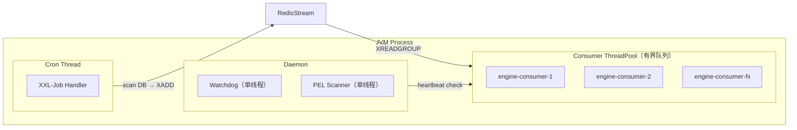

# MOCASA 催收系统升级 — Phase 1 基础设施交互规范

> **版本**: Phase 1  
> **日期**: 2026-06-01  
> **范围**: 仅覆盖菲律宾市场  
> **模块**: —  
> **关联文档**: [产品需求文档 (PRD)](./MOCASA催收系统升级_Phase1_产品需求文档_PRD.md)、[架构设计文档](./MOCASA催收系统升级_Phase1_架构设计文档.md)、[核心引擎规格](./MOCASA催收系统升级_Phase1_核心引擎规格.md)、[数据接入规格](./MOCASA催收系统升级_Phase1_数据接入规格.md)（PubSub / 日切行为见接入正文；**配置键 SSOT 见本文附录**）

---

## 目录

- [1. 消费线程模型](#1-消费线程模型)
- [2. 事件总线（Redis Stream）](#2-事件总线redis-stream)
- [3. 运行时状态（Redis KV）](#3-运行时状态redis-kv)
- [4. 定时调度（XXL-Job）](#4-定时调度xxl-job)
- [5. 持久层（Repository）](#5-持久层repository)
- [6. 配置管理与可观测性](#6-配置管理与可观测性)
- [附录：运行配置与环境](#附录运行配置与环境)
  - [A.1 配置来源与热更](#a1-配置来源与热更)
  - [A.2 引擎与事件总线](#a2-引擎与事件总线)
  - [A.3 接入与 PubSub](#a3-接入与-pubsub)
  - [A.4 迁移与触达](#a4-迁移与触达)
  - [A.5 接入层 Redis 键](#a5-接入层-redis-键)
  - [A.6 上线前联调签字（接入）](#a6-上线前联调签字接入)

---

## 1. 消费线程模型

[核心引擎规格 §1.2](./MOCASA催收系统升级_Phase1_核心引擎规格.md#12-trigger-to-event-线程隔离) 定义了线程隔离的架构决策（Consumer Pool 与 Cron Thread 分离），本节给出具体规格参数和安全约束。

### 线程池架构



三组线程互不共享线程池，任何一组阻塞不影响其他组。

### Consumer 线程池规格

| 参数 | 值 | 说明 |
|---|---|---|
| 类型 | `ThreadPoolExecutor` | 非 `ScheduledThreadPool`，调度由消费循环自驱 |
| corePoolSize | `engine.consumer.thread_pool_size`（默认 8） | 等于消费并发度 |
| maximumPoolSize | = corePoolSize | 固定大小，不动态扩缩；突发流量由队列缓冲 |
| workQueue | `LinkedBlockingQueue(engine.consumer.queue_capacity)`（默认 256） | 有界队列 |
| rejectedExecutionHandler | `CallerRunsPolicy` | 队列满时阻塞消费循环线程，XREADGROUP 暂停拉取，Redis Stream 自然积压但不丢消息 |
| threadFactory | `NamedThreadFactory("engine-consumer-%d")` | 线程命名便于日志 / thread dump 定位 |
| keepAliveTime | 0（core 不回收） | 固定池大小 |

> 拒绝策略选择 `CallerRunsPolicy` 而非 `AbortPolicy`（丢任务抛异常）或 `DiscardPolicy`（静默丢弃）：队列满 → Caller 阻塞 → XREADGROUP 停拉 → Stream 积压 → 上游感知背压。不丢消息、不 OOM、无需额外流控。

### 降级日志防刷

`CallerRunsPolicy` 触发时须输出 WARN 日志，但高负载下可能每秒触发数百次。**约束**：背压日志必须使用 `RateLimiter` 压制（每 5 秒最多一条），内容包含当前队列深度和 Stream 积压量：

```
WARN [engine-consumer-loop] BackpressureTriggered — queue_depth=256, stream_pending=1832
```

> Watchdog 检测心跳时须排除"Caller 线程正在执行被拒绝任务"的场景（通过原子标志位 `callerRunning` 区分），防止将背压误判为假死。

### Daemon 线程组规格

| 守护任务 | 线程模型 | 执行频率 | 安全约束 |
|---|---|---|---|
| PEL Scanner | `ScheduledThreadPoolExecutor(1)`，命名 `engine-pel-scanner` | 每 5 分钟（`engine.consumer.pel_scan_interval_minutes`） | 每次 XPENDING 必须携带 `COUNT`（`engine.consumer.pel_batch_size`，默认 100），防止崩溃重启后一次性捞出海量积压导致 OOM |
| Watchdog | `ScheduledThreadPoolExecutor(1)`，命名 `engine-watchdog` | 每 `watchdog.heartbeat_interval_seconds`（默认 10s）检测一次 | 必须 catch **`Throwable`**（非仅 `Exception`），防止偶发 Redis 连接超时的 `Error` 导致看门狗线程退出 |

> PEL 扫描是低频兜底机制（处理崩溃后遗留消息），5 分钟间隔足够。扫描频率不应高于看门狗超时阈值（60s），避免 PEL 消息在 idle 阈值（10min）内被误判为活跃。

### 背压告警联动

Consumer 线程池必须注册 Micrometer `ExecutorServiceMetrics`，确保 [运维与协作](./MOCASA催收系统升级_Phase1_运维与协作.md) §1.2.2 定义的 `collection.event.consumer.thread.utilization` 和 `collection.event.stream.lag` 指标有数据来源。

---

## 2. 事件总线（Redis Stream）

`CollectionEventBus` 接口定义于 `collection-common`，Phase 1 由 `RedisStreamEventBusImpl` 实现。接口抽象使未来替换消息中间件（Kafka、RabbitMQ）时业务代码零改动。

**实现选型** ✅：技术栈为 Spring Boot 2.7.18，采用 Spring Data Redis 内置的 **`StreamMessageListenerContainer`**（Consumer Group 模式）承载消费循环，无需手写 Lettuce 轮询。容器负责订阅、反序列化分发与基础错误重启；PEL 拾取与看门狗作为崩溃/连接假死的兜底补充（下述）：

```java
public interface CollectionEventBus {
    void publish(CollectionEvent event);
    void subscribe(String eventType, EventHandler handler);
}
```

| 实现细节 | 说明 |
|---|---|
| 发布端 | `XADD` 写入 Redis Stream，事件序列化为 JSON，包含事件信封（eventId、eventType、timestamp、payload） |
| 消费端 | `XREADGROUP` 消费组模式，Consumer Group 保证同一事件仅被组内一个消费者处理 |
| ACK 机制 | 业务处理成功后显式 `XACK`；处理失败不 ACK → pending list → 重投递；不可重试（如反序列化失败）→ 直接 DLQ；retryable 但重投递次数达上限（`engine.consumer.max_delivery_count`，默认 5）→ DLQ + 告警（毒消息防护，避免无限重投占满 Consumer） |

**PEL 拾取机制**：进程在 `XACK` 前崩溃时，消息滞留 PEL，新实例仅读 `>` 会永久漏触达。消费者启动时及 PEL Scanner 定期执行（频率与规格见 [§1](#1-消费线程模型)）：

```
1. XPENDING <stream> <group> - + COUNT  （返回每条消息的投递次数 delivery_count）
2. 对 idle > pel_idle_minutes 的消息执行 XAUTOCLAIM（或 XCLAIM），转移至当前消费者
3. delivery_count > max_delivery_count 的消息判定为毒消息 → XACK 移出 PEL + 写 DLQ + 告警（不再重投）
4. 其余重新投入消费管线处理（幂等保护保证安全重试）
```

> PEL idle 阈值默认 10 分钟（`engine.consumer.pel_idle_minutes`），须大于单条消息最长处理时间，防止误抢活跃消息。

**看门狗机制**：`StreamMessageListenerContainer` 的轮询线程在连接假死（Lettuce 连接断开但无异常退出，容器 ErrorHandler 不触发）时可能静默停摆。线程规格见 [§1](#1-消费线程模型)，核心逻辑：

| 组件 | 行为 |
|---|---|
| 容器投递 | `MessageListener` 在每次投递（含空轮询回调）后更新心跳时间戳（Redis `SET` 或内存变量） |
| 守护线程 | 心跳超时（`watchdog.timeout_seconds`，默认 60s）时：① 先 `container.stop()` 优雅停止旧订阅（等待终止）；② 重建 Lettuce 连接并 `container.start()` 重启订阅；③ 触发告警（[运维与协作](./MOCASA催收系统升级_Phase1_运维与协作.md)） |

> 重启前必须先停止旧订阅，防止旧连接（网络卡顿非真死）与新连接并存导致双重消费。

### 2.1 DLQ 重放（redrive）

> 上文 ACK / PEL 机制定义消息**进入** DLQ 的条件（不可重试、重投递次数达上限）。本节定义消息**移出** DLQ 的重放路径，是 DLQ 三级恢复中"自动重放"一环的运行时唯一归属（架构 附录B 索引此处）。

| 项 | 约定 |
|---|---|
| 持久化 | DLQ 消息落 MySQL（含原始信封 + 入队原因 + 投递次数 + 首次/末次失败时间），不仅留在 Redis，避免实例重启丢失 |
| 自动重放 | 定时任务扫描可重放消息（排除反序列化失败等不可恢复毒消息），重投回原 Stream 消费管线；重放计数独立，二次失败仍达上限 → 标记为"需人工" |
| 幂等保障 | 重放复用既有事件消费去重（`processed:{event_id}`，[§3](#3-运行时状态redis-kv)），保证重复投递安全 |
| 人工兜底 | 不可恢复 / 重放仍失败的消息保留待人工处理，并告警（[运维与协作](./MOCASA催收系统升级_Phase1_运维与协作.md)，规划中） |

### 2.2 重放前合规时段校验

> 重放可能发生在原触达时点之后较久，若直接重投会产生"业务时间毒丸"——在合规禁止时段（如夜间）触发触达。

- 自动重放前必须校验当前是否处于合规可触达时段；落在禁止时段的触达类事件**延迟到下一个合规窗口**再重投，而非立即消费。
- 合规时段判定复用 `ExecutionGuard` 的时段规则口径（[核心引擎规格 §5.1 L1 基础设施异常](./MOCASA催收系统升级_Phase1_核心引擎规格.md#51-l1-基础设施异常)、[渠道编排规格](./channel/MOCASA催收系统升级_Phase1_渠道编排规格.md)），本节只约束"重放调度时机"，不重复定义合规规则。

---

## 3. 运行时状态（Redis KV）

核心引擎涉及的 Redis 数据遵循统一的 key 设计和生命周期管理。

### Key 前缀约定

| 前缀 | 用途 | 数据类型 | 示例 |
|---|---|---|---|
| `compliance:` | 合规计数器（每日/每周触达次数） | String（计数） | `compliance:daily:{user_id}:{channel}:{date}` |
| `processed:` | 事件消费去重标记 | String（标记） | `processed:{event_id}` |
| `lock:plan:` | 分布式幂等锁（步骤级） | String（SETNX） | `lock:plan:{step_idempotency_key}` |
| `idempotency:` | 渠道层二次去重 | String（SETNX） | `idempotency:channel:{idempotency_key}` |
| `ingestion:` | 接入层 PubSub 幂等 / 日切 dedup（Phase 1 可内存实现） | String | 见 [附录 A.5](#a5-接入层-redis-键) |

> 接入层 key 须与旧催收 Redis **物理或前缀隔离**（新系统 `ingestion:*` / `ai:*`）。语义与 TTL → [数据接入 §3.3](./MOCASA催收系统升级_Phase1_数据接入规格.md#33-接入幂等键)。

### TTL 策略

| Key 类型 | TTL | 理由 |
|---|---|---|
| 合规计数器（daily） | 当日 23:59:59 过期 | 自然日重置 |
| 合规计数器（weekly） | 7 天 | 自然周重置 |
| 幂等锁 | 15 分钟（`step.idempotency_ttl_minutes`） | 覆盖事件重复消费窗口，过期自动释放 |
| 渠道层去重 | 24 小时 | 覆盖供应商回调延迟窗口 |
| 事件消费去重 | 24 小时 | At-least-once 消费去重 |
| 看门狗心跳 | 无 TTL（持续覆写） | 守护线程主动检查，无需自动过期 |

### 内存淘汰策略

Redis 实例配置 ✅ `maxmemory-policy = volatile-lru`：仅淘汰设有 TTL 的 key，保护无 TTL 的 Stream 数据不被误驱逐。

### 合规计数器实现约束

`ExecutionGuard` 的硬超时为 20ms（[核心引擎规格 §4.1](./MOCASA催收系统升级_Phase1_核心引擎规格.md#41-接口总览)）。合规计数的读取 + 增加 + 设 TTL 必须在**单次 Redis 交互**内完成，使用 Lua 脚本或 Pipeline，目标延迟 < 5ms：

```lua
local current = redis.call('INCR', KEYS[1])
if current == 1 then
    redis.call('EXPIREAT', KEYS[1], ARGV[1])
end
return current
```

---

## 4. 定时调度（XXL-Job）

核心引擎通过 XXL-Job 实现 Trigger-to-Event 模式（[核心引擎规格 §1.2](./MOCASA催收系统升级_Phase1_核心引擎规格.md#12-trigger-to-event-线程隔离)）。本节明确 Job Handler 定义及伪代码中 `register_job()` / `cancel_scheduled_jobs()` 的底层语义。

### Job Handler 定义

| Handler | Cron | 扫描逻辑 | 发布事件 |
|---|---|---|---|
| `planStepDueHandler` | `0 * * * * ?`（每分钟） | `t_contact_plan_step WHERE trigger_time <= NOW()` 且步骤状态为待触发、关联计划为非终态 | `PLAN_STEP_DUE` |
| `callbackTimeoutHandler` | `0 * * * * ?`（每分钟） | `t_contact_plan_step WHERE timeout_time <= NOW() AND status = 'EXECUTING'` 且关联计划为非终态 | `CALLBACK_TIMEOUT`（[核心引擎规格 §4.3.4](./MOCASA催收系统升级_Phase1_核心引擎规格.md#434-异步回调超时兜底)） |
| `dailyRoll`（`DpdStageRollHandler`） | `0 5 0 * * ?`（每日 0:05 PHT） | 读旧库在催名单 + bill DPD，hybrid 重算 Max DPD | `STAGE_CHANGED` / `CASE_CEASED`（[数据接入 §4](./MOCASA催收系统升级_Phase1_数据接入规格.md#4-阶段变更与-dpd-日切)） |
| `ptpExpiredHandler`（**Phase 2 预留，Phase 1 不启用**） | — | — | `PTP_EXPIRED`（Phase 1 引擎不消费，见 [核心引擎规格 §2.6](./MOCASA催收系统升级_Phase1_核心引擎规格.md#26-ptp-到期处理)） |

> 触达对时间精度要求低（±1min 可接受），Cron 扫描粒度足够。Phase 2 可评估延迟消息替代。

**扫描分页约束**：每次 Cron 执行必须携带 `LIMIT N`（Phase 1 默认 1000）防止单次全表扫描拖垮 DB。若 `count(result) == LIMIT`，说明存在积压，应**触发告警**（[运维与协作](./MOCASA催收系统升级_Phase1_运维与协作.md)）而非多轮递归消费——剩余消息等下一轮 Cron 处理，避免单次 Job 执行超时。

> Phase 2 扩展建议：数据量增大后可开启 XXL-Job **分片广播**（`ShardingUtil.getShardingVo()`），按 `plan_id % sharding_total == sharding_index` 切分扫描范围，水平扩展 Cron 处理能力。Phase 1 暂不启用，待压测后评估。

### 伪代码中 register_job / cancel_scheduled_jobs 的语义

[核心引擎规格 §2-§3](./MOCASA催收系统升级_Phase1_核心引擎规格.md#2-计划生命周期与状态机) 伪代码中的 `register_job()` 和 `cancel_scheduled_jobs()` 是逻辑抽象，底层实现基于"写 DB + Cron 扫描"模式：

| 伪代码 | 实际操作 |
|---|---|
| `register_job(PLAN_STEP_DUE, trigger_time)` | 设置 `t_contact_plan_step.trigger_time` 为目标时间，步骤状态置为待触发；Cron 到期后扫描拾取并发布事件 |
| `register_job(CALLBACK_TIMEOUT, timeout_minutes)` | 设置 `t_contact_plan_step.timeout_time = NOW() + timeout_minutes`；Cron 到期后扫描拾取 |
| `cancel_scheduled_jobs(plan)` | 计划状态已置为终态（`PLAN_CANCELLED`），Cron 扫描时通过关联计划状态过滤，自动跳过 |

Cron 线程仅做"扫表 → 发事件 → 返回"，**严禁 I/O 阻塞**（[核心引擎规格 §1.2](./MOCASA催收系统升级_Phase1_核心引擎规格.md#12-trigger-to-event-线程隔离)），所有业务处理由 Consumer 线程池完成。

> **投诉解冻恢复**：被实时冻结"停住"的计划仍为非终态（[核心引擎规格 §5.1 ②](./MOCASA催收系统升级_Phase1_核心引擎规格.md#51-execute_step-七步管线)）。解冻时 admin 清除案件级实时冻结标记，并对该计划当前步骤重新 `register_job(PLAN_STEP_DUE, NOW())`（即重设 `trigger_time`）让 Cron 重新拾取、从停住步骤恢复——复用既有事件，不新增事件/状态。冻结标记为**实时案件状态字段**，由 PreFlightChecker 实时读取，不写入 snapshot、不走合规计数器（[运行时状态 §3 合规计数器](#3-运行时状态redis-kv) 仅服务 ExecutionGuard）。若解冻发生在原步骤幂等锁 TTL（默认 15 分钟）内，重注入可能被 §5.1 ① 吸收；admin 恢复实现须等待幂等窗口过期，或显式清理/更换该步骤幂等键后再重注入。（可选：若不依赖 admin 重注入，infra 也可在冻结时注册短延迟 `PLAN_STEP_DUE` 自轮询，解冻后下一次重扫自动通过；Phase 1 默认走 admin 重注入，避免冻结期 Job 轮询开销。）

---

## 5. 持久层（Repository）

核心引擎通过 Repository 接口访问持久层。表结构见 [领域模型与数据定义](./MOCASA催收系统升级_Phase1_领域模型与数据定义.md)。

### 生命周期阶段 × 数据操作映射

| 生命周期阶段 | 触发事件 | 数据读取 | 数据写入 |
|---|---|---|---|
| 计划创建 | CASE_INGESTED / STAGE_CHANGED | getCaseInfo, getSnapshot | savePlan(plan+steps) |
| 步骤到期 | PLAN_STEP_DUE | — | updatePlanStatus(STEP_EXECUTING) |
| 步骤执行 | （Orchestrator 内部） | getContactHistory | updateStepStatus, writeTimeline |
| 步骤完成推进 | STEP_COMPLETED | getNextStep | updateStepTriggerTime |
| 中断取消 | REPAYMENT_RECEIVED / STAGE_CHANGED | findActivePlans | updatePlanStatus(CANCELLED) |
| 穷尽续建 | PLAN_EXHAUSTED | getCaseInfo, getSnapshot, getLastPlan | savePlan |
| PTP到期（**Phase 2 预留**） | PTP_EXPIRED（Phase 1 不消费） | — | — |

### Repository 接口清单

| 方法 | 语义 | 事务要求 | 对应表 |
|---|---|---|---|
| findPlanWithLock(planId) | SELECT FOR UPDATE 获取单计划行锁 | 必须在事务内 | t_contact_plan |
| findPlansWithLock(List\<Long\> planIds) | 批量 SELECT FOR UPDATE；**实现内部必须按 planId 升序排列后再加锁**，防止死锁 | 必须在事务内 | t_contact_plan |
| findActivePlansByUser(userId) | 用户所有非终态计划 | 只读 | t_contact_plan |
| findActivePlansByCase(caseId) | 案件所有非终态计划 | 只读 | t_contact_plan |
| savePlan(plan) | 持久化计划 + 步骤序列 | 事务 | t_contact_plan + t_contact_plan_step |
| updatePlanStatus(planId, status, reason) | 计划状态写入 | 事务 | t_contact_plan |
| updateStepStatus(stepId, status, result) | 步骤执行结果 | 事务 | t_contact_plan_step |
| updateStepTriggerTime(stepId, time) | 注册下一步到期 | 事务 | t_contact_plan_step |
| updateStepTimeoutTime(stepId, time) | 注册回调超时 | 事务 | t_contact_plan_step |
| writeTimeline(entry) | 写触达时间线 | 事务 | t_contact_timeline |
| getCaseInfo(caseId) | 案件基本信息 | 只读 | t_collection_case |
| getContextSnapshot(caseId) | 不可变快照 | 只读 | t_contact_plan.context_snapshot |
| getContactHistory(userId, limit) | 近期触达历史 | 只读 | t_contact_timeline |
| isRepaid(caseId) | 实时还款状态 | 只读 | t_collection_case |
| getPtpRecord(ptpId) | PTP 记录（**Phase 2 预留**，Phase 1 不实现） | 只读 | t_collection_ptp_info（Phase 2） |
| updatePtpStatus(ptpId, status) | PTP 状态更新（**Phase 2 预留**，Phase 1 不实现） | 事务 | t_collection_ptp_info（Phase 2） |
| getNextStep(planId, currentStepOrder) | 计划中的下一步 | 只读 | t_contact_plan_step |
| getLastCompletedPlan(caseId) | 最近完成/穷尽的计划 | 只读 | t_contact_plan |

---

## 6. 配置管理与可观测性

### 6.1 配置刷新机制

运行时连接、模块参数由 **Nacos** / 环境变量下发（见 [操作说明_Nacos本地启动.md](./操作说明_Nacos本地启动.md)）。**键名 SSOT 见 [附录 A.2～A.4](#附录运行配置与环境)**；行为与默认值见各模块正文（引擎 / [数据接入](./MOCASA催收系统升级_Phase1_数据接入规格.md)）。

| 项 | 规格 |
|---|---|
| Phase 1 主路径 | Nacos YAML + `@RefreshScope`（`engine.*`、`collection.*`、渠道密钥） |
| Phase 2 可选 | `t_system_property`（MySQL）定时轮询热更 |

**参数热更分类**（附录 A.2～A.4「热更」列）：

| 分类 | 特征 | 代码行为 |
|---|---|---|
| **Y**（热更安全） | 仅影响下一次执行的决策值，不涉及运行时结构 | 轮询后立即生效 |
| **Y-注意**（窗口类） | TTL/超时窗口参数，改小可能导致新老不一致 | 生效但有新老交替期风险（见下方） |
| **N**（需重启） | 涉及线程池结构、Redis 连接参数 | `PropertyRefreshService` 检测到变更后仅 log WARN，**不生效** |

**窗口类参数"新老交替期"风险**：对于 `idempotency_ttl_minutes` 等窗口类参数，代码在写入 Redis key 时动态读取最新配置值设置 TTL。若将 TTL 从 60 分钟改小到 10 分钟，系统不会追溯修改已存在的 key，但新 key 立即应用 10 分钟。改小后存在一个"新老交替期"（最长等于旧 TTL 值），期间幂等窗口表现不一致。改大则无此风险。

**变更审计**：每次参数变更写入 `t_system_property_audit`（old_value / new_value / operator / timestamp），便于排查"改参数后行为异常"。

### 6.2 可观测性接入约束

指标定义和告警规则见 [运维与协作](./MOCASA催收系统升级_Phase1_运维与协作.md) §1-§2。本节约束引擎代码的埋点位置，确保运维指标有数据来源。

**指标注册点**（对应运维文档 §1.2）：

| 注册位置 | 指标 | 实现方式 |
|---|---|---|
| `RedisStreamEventBusImpl` | `event.published`, `event.consumed`, `event.consume.duration` | `Counter` / `Timer` |
| Consumer 线程池初始化 | `event.consumer.thread.utilization` | `ExecutorServiceMetrics.monitor()` |
| PEL Scanner | `event.pending` | `Gauge`（每次扫描后更新） |
| DLQ 写入 | `event.dlq.size` | `Counter` |
| Watchdog 重建 | `event.watchdog.restart` | `Counter` |
| `StepExecutionOrchestrator` | `touch.total`、步骤耗时 | `Counter` / `Timer` |

**结构化日志字段（MDC）**：引擎关键路径日志必须通过 SLF4J MDC 携带以下字段：

| MDC Key | 来源 | 生命周期 |
|---|---|---|
| `caseId` | 事件 payload | 消费入口 set → 处理完成 clear |
| `planId` | Plan 实体 | PlanLifecycleManager 入口 set |
| `stepId` | Step 实体 | StepExecutionOrchestrator 入口 set |
| `eventType` | 事件信封 | 消费入口 set |
| `eventId` | 事件信封 | 消费入口 set |
| `consumerId` | 本实例 consumer name | 启动时 set，线程级别 |

**跨线程 MDC 传递约束（研发红线）**：MDC 基于 `ThreadLocal`，跨线程时上下文丢失。引擎的 Consumer 线程池本身即为跨线程场景（消费循环 → 工作线程）。

- 严禁直接使用原生 `new Thread()` 或未包装的 `ExecutorService` 执行异步任务
- 所有自建线程池必须使用 `MdcTaskDecorator` 包装（提交时 `MDC.getCopyOfContextMap()`，执行时 `MDC.setContextMap(copy)`，结束时 `MDC.clear()`）
- 若使用 Spring `@Async`，`AsyncConfigurer` 必须返回包装后的 `Executor`

> Phase 1 通过 Code Review checklist 落地，Phase 2 通过 ArchUnit 规则自动检测。

---

<a id="附录运行配置与环境"></a>

## 附录：运行配置与环境

运维 / 联调检索 **键名、默认值、热更、签字** 的 SSOT。各键**行为语义**见对应模块正文；**未闭合项**见 [数据接入规格 附录 C](./MOCASA催收系统升级_Phase1_数据接入规格.md#附录-c联调与实现跟踪台账)。

| 分册 | 内容 |
|---|---|
| **A.1** | 配置来源与热更分类 |
| **A.2** | 引擎与 Redis Stream（`engine.*`） |
| **A.3** | 接入与 PubSub（`collection.ingestion.*`、GCP 环境变量） |
| **A.4** | 迁移与触达（`collection.notification.owner`） |
| **A.5** | 接入层 Redis 键（`ingestion:*`） |
| **A.6** | 上线前联调签字索引（接入域） |

> 渠道编排参数见 [渠道编排规格](./channel/MOCASA催收系统升级_Phase1_渠道编排规格.md)。**凭证与连接串不入 Git 仓库**。

<a id="a1-配置来源与热更"></a>

### A.1 配置来源与热更

| 来源 | 适用 | 说明 |
|---|---|---|
| **Nacos** | Phase 1 主路径 | `intelligent-collection-common.yml` / 环境 profile |
| **环境变量** | GCP 凭证、本地联调 | 见 A.3「GCP 环境变量」 |
| **`t_system_property`** | Phase 2 可选 | DB 轮询热更；见 [§6.1](#61-配置刷新机制) |

热更列含义：**Y** 下次执行生效 · **Y-注意** 窗口类有交替期 · **N** 需重启 · **—** 环境变量/部署时设定

<a id="a2-引擎与事件总线"></a>

### A.2 引擎与事件总线

| 参数 Key | 默认值 | 热更 | 说明 | 规格 |
|---|---|---|---|---|
| `engine.step.idempotency_ttl_minutes` | `15` | Y-注意 | 步骤幂等锁 TTL（分钟） | [引擎 §5.1](./MOCASA催收系统升级_Phase1_核心引擎规格.md#51-execute_step-七步管线) |
| `engine.step.max_retry_count` | `3` | Y | 步骤渠道发送最大重试次数 | 引擎 §5.1 |
| `engine.step.retry_base_interval_seconds` | `30` | Y | 首次重试退避基准（秒） | 引擎 §5.1 |
| `engine.step.retry_max_interval_seconds` | `300` | Y | 退避上限（秒） | 引擎 §5.1 |
| `engine.step.retry_backoff_factor` | `2` | Y | 退避倍数 | 引擎 §5.1 |
| `engine.step.executing_reaper_minutes` | `30` | Y | EXECUTING 滞留 reaper 阈值（分钟） | [引擎 §7.4](./MOCASA催收系统升级_Phase1_核心引擎规格.md#74-跨存储一致性修复) |
| `engine.plan.max_rebuild_count` | `2` | Y | 单案件单阶段最大续建次数 | 引擎 §4.1 |
| `engine.spi.plan_factory.timeout_ms` | `50` | Y | PlanFactory 硬超时 | 引擎 §4.1 |
| `engine.spi.execution_guard.timeout_ms` | `20` | Y | ExecutionGuard 硬超时 | 引擎 §4.1 |
| `engine.spi.step_resolver.timeout_ms` | `50` | Y | StepResolver 硬超时 | 引擎 §4.1 |
| `engine.spi.advancement_policy.timeout_ms` | `10` | Y | AdvancementPolicy 硬超时 | 引擎 §4.1 |
| `engine.spi.exhaustion_policy.timeout_ms` | `50` | Y | ExhaustionPolicy 硬超时 | 引擎 §4.1 |
| `engine.consumer.thread_pool_size` | `8` | N | Consumer 线程池大小 | [§1](#1-消费线程模型) |
| `engine.consumer.queue_capacity` | `256` | N | Consumer 有界队列 | §1 |
| `engine.consumer.poll_timeout_ms` | `2000` | Y | XREADGROUP 阻塞超时（ms） | [§2](#2-事件总线redis-stream) |
| `engine.consumer.batch_size` | `10` | Y | XREADGROUP 批大小 | §2 |
| `engine.consumer.pel_scan_interval_minutes` | `5` | Y | PEL 扫描间隔（分钟） | §1 |
| `engine.consumer.pel_idle_minutes` | `10` | Y-注意 | PEL idle 阈值（分钟） | §2 |
| `engine.consumer.pel_batch_size` | `100` | Y | PEL 单次 COUNT 上限 | §1 |
| `engine.consumer.max_delivery_count` | `5` | Y | 最大重投次数；超限 DLQ | §2 |
| `engine.watchdog.heartbeat_interval_seconds` | `10` | N | 心跳上报间隔（秒） | §2 |
| `engine.watchdog.timeout_seconds` | `60` | Y | 看门狗假死阈值（秒） | §2 |
| `engine.redis.key_prefix` | `collection:` | N | Redis 全局前缀 | [§3](#3-运行时状态redis-kv) |
| `engine.compliance.daily_limit` | 按渠道 | Y | 每日触达上限 | 引擎 §4.1 |
| `engine.compliance.weekly_limit` | 按渠道 | Y | 每周触达上限 | 引擎 §4.1 |
| `engine.compliance.quiet_hours_start` | `21:00` | Y | 禁呼开始（PHT） | 引擎 §4.1 |
| `engine.compliance.quiet_hours_end` | `08:00` | Y | 禁呼结束（PHT） | 引擎 §4.1 |
| `engine.consumer.group_name` | `collection-engine` | N | Stream Consumer Group | §2 |
| `engine.consumer.stream_key` | `collection:event_stream` | N | Stream key | §2 |
| `engine.step.callback_timeout_minutes` | `60` | Y-注意 | 异步回调超时（分钟） | [引擎 §4.3.4](./MOCASA催收系统升级_Phase1_核心引擎规格.md#434-异步回调超时兜底) |
| `engine.context.history_max_records` | `50` | Y | contactHistory 最大条数 | 引擎 §6.2 |

<a id="a3-接入与-pubsub"></a>

### A.3 接入与 PubSub

行为 SSOT：[数据接入 §2.1～§3、§6.0](./MOCASA催收系统升级_Phase1_数据接入规格.md)。

**GCP 环境变量**（不入仓）

| 键 | 说明 | 待闭合 |
|---|---|---|
| `GCP_PUBSUB_PROJECT` | GCP 项目 ID | [C-P-01](./MOCASA催收系统升级_Phase1_数据接入规格.md#c-p-基础设施与可靠性) |
| `GCP_PUBSUB_SUBSCRIPTION` | 独立订阅，目标 **`collection-cases-ai-v1-sub`** | C-P-01 |
| `GOOGLE_APPLICATION_CREDENTIALS` | 服务账号 JSON 路径 | C-P-01 |

**Nacos / 应用配置**

| 参数 Key | 默认值 | 热更 | 说明 | 规格 |
|---|---|---|---|---|
| `collection.ingestion.enabled` | `false`（本地/CI）；联调/生产 `true` | Y | 是否启动 PubSub Consumer | 接入 §2.1 |
| `collection.ingestion.ack-deadline-seconds` | `60` | Y | PubSub ack 期限（秒） | 接入 §2.1 |
| `collection.ingestion.max-concurrency` | `4` | N | 拉取并发度；改需重启 | 接入 §2.1 |
| `collection.ingestion.loan-id-whitelist` | 空（全量） | Y | 非空时仅处理名单内 `loan_id` | [接入 §6.0](./MOCASA催收系统升级_Phase1_数据接入规格.md#60-联调隔离)、C-P-08 |
| `collection.ingestion.case-push.field-map` | — | Y | PubSub JSON key → 语义字段 JSON | C-I-01 |
| `collection.ingestion.enrich-jpush-token` | `true` | Y | 消息无 token 时读新库补全 | C-I-10、接入 §3.1 |

<a id="a4-迁移与触达"></a>

### A.4 迁移与触达

| 参数 Key | 取值 | 热更 | 说明 | 规格 |
|---|---|---|---|---|
| `collection.notification.owner` | `LEGACY` / `PARALLEL`（= MIGRATING）/ `NEW` | Y | D-3~D0 触达职责归属 | [接入 §6.0～§6.1](./MOCASA催收系统升级_Phase1_数据接入规格.md#6-迁移与双写) |

<a id="a5-接入层-redis-键"></a>

### A.5 接入层 Redis 键

Phase 1 可为内存实现；切 Redis 后前缀 `ingestion:`，与引擎 `processed:` / `lock:plan:` **禁止混用**。

| Key 模式 | TTL | 用途 |
|---|---|---|
| `ingestion:dedup:case_push:{message_id}` | 7d | `case_push` 同 message 重投 |
| `ingestion:last_seen:{loan_id}` | 90d | 乱序 `publish_time` |
| `ingestion:ingested:{loan_id}` | 90d | 本周期已 `CASE_INGESTED` |
| `ingestion:dedup:repayment:{user_id}:{message_id}` | 7d | 还款 message 重投 |
| `ingestion:dedup:stage:{loan_id}:{target_stage}:{yyyyMMdd}` | 2d | 日切 stage dedup |
| `ingestion:dedup:ceased:{loan_id}` | 90d | 日切 `CASE_CEASED` dedup |

语义与处置 → [数据接入 §3.3](./MOCASA催收系统升级_Phase1_数据接入规格.md#33-接入幂等键)。

<a id="a6-上线前联调签字接入"></a>

### A.6 上线前联调签字（接入）

明细与验收条件 → [数据接入 附录 C](./MOCASA催收系统升级_Phase1_数据接入规格.md#附录-c联调与实现跟踪台账)。签字后在 C 改 ✅ 并同步下表。

| # | 主题 | 跟踪 ID | 签字方 | 状态 |
|---|---|---|---|---|
| 1 | PubSub JSON 字段名 / `field-map` | C-I-01 | 信贷 | ⬜ |
| 2 | `case_push` 频率与 `message_id` 稳定性 | C-I-12 | 信贷 | ⬜ |
| 3 | 还款字段与全额结清判定 | C-I-13 | 信贷 | ⬜ |
| 4 | `NEW` 态信贷停发 D-3~D0 与灰度切片 | C-M-01 | 信贷 + 产品 | ⬜ |
| 5 | 存量 replay 名单与批次 | C-M-02 | 信贷 + 产品 | ⬜ |
| 6 | Topic project / 权限 / 跨 project | C-P-01 | 运维 + 信贷 | ⬜ |
| 7 | 独立订阅；`dataType` 码值稳定 | C-P-01, C-I-15 | 运维 + 信贷 | ⬜ |
| 8 | `case_push` 快照相关字段完整性 | C-I-02～C-I-11 | 信贷 | ⬜ |
| 9 | 旧系统下线后 topic 是否续发 | C-P-02 | 信贷 + 架构 | ⬜ |
| 10 | 数仓同步 jpush token 表 | C-I-10 | 数仓 + DBA | ⬜ |
