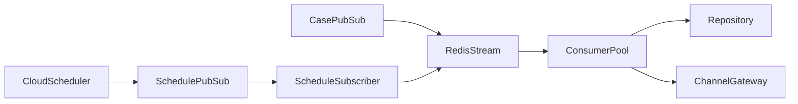
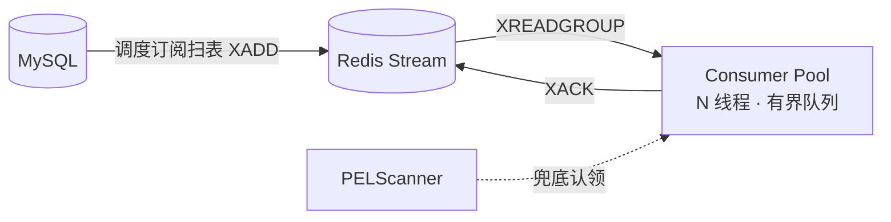
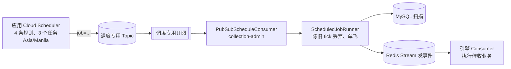

# MOCASA 催收系统升级 — Phase 1 基础设施交互规范

> **版本**: Phase 1 · 仅覆盖菲律宾市场  
> **日期**: 2026-08-13
> **关联文档**: [产品需求文档 (PRD)](./MOCASA催收系统升级_Phase1_产品需求文档_PRD.md)、[架构设计文档](./MOCASA催收系统升级_Phase1_架构设计文档.md)、[核心引擎规格](./MOCASA催收系统升级_Phase1_核心引擎规格.md)、[领域模型与数据定义](./MOCASA催收系统升级_Phase1_领域模型与数据定义.md)、[数据接入规格](./MOCASA催收系统升级_Phase1_数据接入规格.md)

---

## 目录

- [1. 文档定位与生产边界](#1-文档定位与生产边界)
  - [1.1 文档定位与覆盖范围](#11-文档定位与覆盖范围)
  - [1.2 生产运行不变量](#12-生产运行不变量)
- [2. 事件消费与运行模型](#2-事件消费与运行模型)
  - [2.1 生产拓扑与组件职责](#21-生产拓扑与组件职责)
  - [2.2 生产消费拓扑、线程职责与背压](#22-生产消费拓扑线程职责与背压)
  - [2.3 PEL 恢复边界](#23-pel-恢复边界)
- [3. 事件总线：Redis Stream](#3-事件总线redis-stream)
  - [3.1 Stream、Consumer Group 与事件信封](#31-streamconsumer-group-与事件信封)
  - [3.2 核心消费协议](#32-核心消费协议)
  - [3.3 异常恢复与死信](#33-异常恢复与死信)
  - [3.4 重放前合规时段校验](#34-重放前合规时段校验)
- [4. 运行时状态：Redis KV](#4-运行时状态redis-kv)
  - [4.1 生产约束](#41-生产约束)
  - [4.2 Key 与生命周期规格](#42-key-与生命周期规格)
  - [4.3 原子操作与内存保护](#43-原子操作与内存保护)
- [5. 定时调度：Cloud Scheduler → Pub/Sub → 应用订阅](#5-定时调度cloud-scheduler--pubsub--应用订阅)
  - [5.1 拓扑与职责](#51-拓扑与职责)
  - [5.2 任务与扫描目标](#52-任务与扫描目标)
  - [5.3 消费、恢复与幂等](#53-消费恢复与幂等)
  - [5.4 分页与数据库调度模型](#54-分页与数据库调度模型)
  - [5.5 运维 / GCP 交付清单](#55-运维--gcp-交付清单)
- [6. 持久层与跨存储一致性](#6-持久层与跨存储一致性)
  - [6.1 事件与调度场景映射](#61-事件与调度场景映射)
  - [6.2 契约分工](#62-契约分工)
  - [6.3 事务、行锁与并发约束](#63-事务行锁与并发约束)
- [7. 配置管理与可观测性](#7-配置管理与可观测性)
  - [7.1 配置职责与来源](#71-配置职责与来源)
  - [7.2 配置热更新与静态参数](#72-配置热更新与静态参数)
  - [7.3 指标与日志](#73-指标与日志)
  - [7.4 告警最低要求](#74-告警最低要求)
- [附录 A：生产配置键索引](#附录-a生产配置键索引)
  - [A.2 引擎与事件总线](#a2-引擎与事件总线)
  - [A.3 接入与 PubSub](#a3-接入与-pubsub)
  - [A.4 迁移与触达](#a4-迁移与触达)
  - [A.5 接入层 Redis Key 索引](#a5-接入层-redis-key-索引)
- [附录 B：容量基线与生产技术准入](#附录-b容量基线与生产技术准入)
  - [B.1 上线前容量校准清单](#b1-上线前容量校准清单)
  - [B.2 生产切换门槛](#b2-生产切换门槛)
- [附录 C：生产就绪差集登记](#附录-c生产就绪差集登记)

---

## 1. 文档定位与生产边界

### 1.1 文档定位与覆盖范围

本文定义 Phase 1 的**生产基础设施契约**：Redis Stream、Redis KV、定时调度、Repository 访问、配置、可观测性与容量约束；仅定义各模块在生产运行时必须满足的基础设施边界。

### 1.2 生产运行不变量


```mermaid
flowchart LR
  PubSub[CasePubSub] --> EventBus[RedisStream]
  Scheduler[CloudScheduler] --> SchedPubSub[SchedulePubSub]
  SchedPubSub --> Cron[ScheduleSubscriber]
  Cron --> EventBus
  EventBus --> Consumer[ConsumerPool]
  Consumer --> Repository[Repository]
  Consumer --> Channel[ChannelGateway]
```

- 事件采用至少一次投递；只有业务处理成功后才确认，失败事件可恢复、可隔离、可审计。
- 调度线程只扫描和发布事件；渠道 I/O 只能在 Consumer 工作线程执行。
- 幂等与合规频控必须跨实例共享且原子；Redis 不可用时，合规相关路径 fail-close。
- Stream、DLQ、计划状态和触达审计必须具备明确持久化、恢复与告警边界。
- 所有静默退出、背压、积压和恢复路径都必须可观测。

> 内存实现仅为非生产替身，不提供本文定义的可靠投递、跨实例幂等或原子合规频控保证。

---

## 2. 事件消费与运行模型

本节定义可靠投递、并发处理、背压和 PEL 恢复边界。

### 2.1 生产拓扑与组件职责

生产部署采用 Redis Stream Consumer Group、Redis KV、MySQL、Cloud Scheduler → Pub/Sub 调度通道和渠道网关。首期可采用单活跃实例；Redis 使后续横向扩容不改变业务处理语义。实例数、Consumer 并发和 Redis 容量必须按[附录 B.1](#b1-上线前容量校准清单)定版，并满足[附录 B.2](#b2-生产切换门槛)。

### 2.2 生产消费拓扑、线程职责与背压

生产目标拓扑如下：


```mermaid
flowchart LR
  DB[(MySQL)] -->|调度订阅扫表 XADD| Stream[(Redis Stream)]
  Stream -->|XREADGROUP| Consumer[Consumer Pool\nN 线程 · 有界队列]
  Consumer -->|XACK| Stream
  PelScanner[PELScanner] -.->|兜底认领| Consumer
```

| 线程组 | 职责 | 禁止事项 |
|---|---|---|
| Cron（调度订阅消费线程） | 扫描到期步骤或日切分页，发布事件后返回 | 执行渠道调用、等待业务 I/O、与 Consumer 共用线程池 |
| Consumer | 经 `XREADGROUP` 获取事件，提交 Consumer Pool 执行业务管线并在成功后 `XACK` | 与 Cron 或 PEL Scanner 共用线程池 |
| PEL Scanner | 扫描 PEL、认领超过 idle 阈值的消息并重新进入消费管线 | 执行业务管线或长期占用 Consumer 线程 |

Consumer、Cron 与 PEL Scanner 三组线程互不共享线程池；任一组阻塞不得影响其他两组。Redis Stream 的 `XREADGROUP`、`XACK`、PEL 和 DLQ 语义见 [§3](#3-事件总线redis-stream)。

#### Consumer 线程池与背压

| 参数 | 值 | 说明 |
|---|---|---|
| 类型 | `ThreadPoolExecutor` | 非 `ScheduledThreadPool`，调度由消费循环自驱 |
| corePoolSize | `engine.consumer.thread_pool_size`（初始值 8） | 等于消费并发度；上线前按容量校准结果确定 |
| maximumPoolSize | = corePoolSize | 固定大小，不动态扩缩；突发流量由队列缓冲 |
| workQueue | `LinkedBlockingQueue(engine.consumer.queue_capacity)`（初始值 256） | 有界队列；上线前按可接受排队时延和单任务内存确定 |
| rejectedExecutionHandler | `CallerRunsPolicy` | 队列满时阻塞消费循环线程，XREADGROUP 暂停拉取，Redis Stream 自然积压但不丢消息 |
| threadFactory | `NamedThreadFactory("engine-consumer-%d")` | 线程命名便于日志 / thread dump 定位 |
| keepAliveTime | 0（core 不回收） | 固定池大小 |

> `8` 线程与队列 `256` 是生产初始值，不是容量结论。须按[附录 B.1](#b1-上线前容量校准清单)的事件量、时效、渠道限流和实例资源校准。

> 拒绝策略选择 `CallerRunsPolicy` 而非 `AbortPolicy`（丢任务抛异常）或 `DiscardPolicy`（静默丢弃）：队列满 → Caller 阻塞 → XREADGROUP 停拉 → Stream 积压 → 上游感知背压。不丢消息、不 OOM、无需额外流控。

#### 降级日志防刷

`CallerRunsPolicy` 触发时须输出 WARN 日志，但高负载下可能每秒触发数百次。**约束**：背压日志必须使用 `RateLimiter` 压制（每 5 秒最多一条），内容包含当前队列深度和 Stream 积压量：

```
WARN [engine-consumer-loop] BackpressureTriggered — queue_depth=256, stream_pending=1832
```

### 2.3 PEL 恢复边界

| 守护任务 | 线程模型 | 执行频率 | 安全约束 |
|---|---|---|---|
| PEL Scanner | 由独立 `@Scheduled` 任务驱动 | `collection.redis.pel-scan-interval-ms`（初始值 30s） | 每次 `XPENDING` 必须携带 `COUNT`（`collection.redis.pel-batch-size`，初始值 50），防止崩溃重启后一次性捞出海量积压导致 OOM |
| Outbox Publisher | 引擎内独立 `@Scheduled` 任务 | `engine.outbox.poll-interval-ms`（初始值 2s） | 单批 `engine.outbox.batch-size`（初始值 200）；`PENDING` 到期或 `PROCESSING` 租约到期时，先原子认领 `engine.outbox.lease-seconds`（初始值 60s）再发布，避免多实例重复投递。入箱 `next_retry_at = now + grace-seconds`（初始值 30s），使正常链路的即时发布先完成销账、轮询扫不到行 |
| Stuck Plan Reaper | 引擎内独立 `@Scheduled` 任务 | `engine.reaper.interval-ms`（初始值 5min） | 只读检测 + 计数告警，**不得写库、不得重发触达**；仅纳入 `updated_at` 静默超过 `engine.reaper.idle-minutes`（初始值 75min）、无 due/timeout 步骤且无活跃 Outbox（`PENDING` / `PROCESSING`）的计划，避免 Outbox 自愈期间误报 |

> PEL Scanner 仅认领 idle 超过 `collection.redis.pel-min-idle-seconds`（初始值 120s）的消息。该值必须覆盖一次同步处理的最长时长（渠道 HTTP 重试、DB 写入和调度抖动）并保留安全裕量；恢复时间约为 `minIdle + 一个扫描周期`，而非固定秒数。

> 这三个都是**引擎内部可靠性守护进程**，不是业务 Cron：不经 Cloud Scheduler，调度链路自身故障时也能推进，因此不受 [§5.2](#52-任务与扫描目标) 的调度入口唯一性约束（`SchedulerEntrypointValidator` 只管业务扫描入口）。Outbox 与 Reaper 的语义见 [核心引擎规格 §7.4](./MOCASA催收系统升级_Phase1_核心引擎规格.md#74-跨存储一致性修复)。

---

## 3. 事件总线：Redis Stream

事件总线负责事件可靠传递，不负责业务幂等、步骤状态机或渠道重试。业务模块仅依赖 `collection-common` 的 `CollectionEventBus` 接口，不感知底层实现。

### 3.1 Stream、Consumer Group 与事件信封

生产配置必须启用 `collection.eventbus=redis`。每个应用实例使用独立 consumer name 加入同一 Consumer Group；Redis 在组内分配未消费消息，PEL 记录已投递但尚未确认的消息。

事件以 JSON 写入 Stream，包含事件信封 `eventId`、`eventType`、`timestamp` 和 `payload`。Stream key、group 和 consumer name 属于静态配置，修改后必须重启实例。

### 3.2 核心消费协议

**实现选型**：消费循环由 `@Scheduled` 定时调用 `XREADGROUP`（阻塞读）驱动；PEL Scanner 定期调用 `XCLAIM` 认领超时消息。轮询调用独立失败、下轮自动继续，不采用 `StreamMessageListenerContainer` 或独立 Watchdog。

```java
public interface CollectionEventBus {
    void publish(CollectionEvent event);
    void subscribe(EventType eventType, EventHandler handler); // 实际用枚举增强类型安全
}
```

| 实现细节 | 说明 |
|---|---|
| 发布端 | `XADD` 写入 Redis Stream，事件序列化为 JSON，包含事件信封（eventId、eventType、timestamp、payload） |
| 消费端 | `XREADGROUP` 消费组模式，Consumer Group 保证同一事件仅被组内一个消费者处理 |
| ACK 机制 | 业务处理成功后显式 `XACK`；处理失败不 ACK → 滞留 PEL → 超时后重投递；不可重试（如反序列化失败）→ 直接 DLQ |
| 事件重投上限 | 跨消费重投次数达 `collection.redis.max-delivery-count`（默认 5）→ XACK 移出 PEL + 写 DLQ + 告警（毒消息防护） |
| 渠道发送重试 | 单次消费内，渠道 dispatch 失败由 `StepExecutionOrchestrator` 按 `engine.step.max_retry_count`（默认 3）退避重试；**与事件重投计数无关** |

### 3.3 异常恢复与死信

#### PEL 拾取机制

消费者 `XREADGROUP` 后、`XACK` 前崩溃 → 消息滞留 PEL，读 `>` 无法触达，须主动拾取。启动时扫一次，PEL Scanner 定期扫（频率见 [§2.3](#23-pel-恢复边界)）。

| 步骤 | 动作 | 判定 / 处置 |
|---|---|---|
| 1. 发现 | `XPENDING … COUNT` | 列出 PEL 中各消息的 idle 时长与 `delivery_count` |
| 2. 认领 | `XCLAIM` | 仅对 idle > `collection.redis.pel-min-idle-seconds`（初始值 120s）的消息转移给当前消费者；阈值须大于单条最长处理时间，避免误抢仍在执行的消息 |
| 3. 毒消息 | `delivery_count > max_delivery_count` | XACK 移出 PEL → 写 DLQ → 告警，不再重投 |
| 4. 正常重投 | 其余已认领消息 | 重新进入消费管线；引擎步骤幂等锁（`lock:plan:`）保证安全重试 |

#### DLQ 重放（redrive）

> PEL 中达到重投上限或不可重试的消息进入 DLQ；DLQ 仅重放确认可恢复的消息。

| 项 | 约定 |
|---|---|
| 持久化 | DLQ 同时写 Redis `{stream}:dlq` 与 MySQL `t_event_dlq`：Redis 即时隔离，MySQL 是审计与处置 SSOT。记录原始信封、失败原因、投递次数、首次/末次失败时间、重放次数与处置时间；表结构以 [`db/schema.sql`](../db/schema.sql) 为准（既有环境由同文件的迁移过程补列）。 |
| 可重放范围 | 仅 `failure_reason = MAX_DELIVERY_EXCEEDED` 可重放；`DESERIALIZATION_FAILURE` / `NO_HANDLER` 直接置 `TERMINATED`，不重投。 |
| 触发方式 | 受控接口 `POST /ops/dlq/redrive`，入参为显式 `eventIds` 与 `reason`；无自动定时重放，避免故障期自我放大。鉴权走管理后台 `/ops/**` 登录拦截。 |
| 状态机 | `PENDING → REDRIVING → REDRIVEN`；超过 3 次重放、发布失败或不可恢复原因 → `TERMINATED` 并告警。 |
| 幂等保障 | 重放沿用原事件信封（`eventId` 不变），复用事件消费去重（`collection:processed:{event_id}`，[§4](#4-运行时状态redis-kv)）；已成功处理过的事件重放时被跳过并直接 ACK。 |

### 3.4 重放前合规时段校验

> 重放可能发生在原触达时点之后较久，若直接重投会产生"业务时间毒丸"——在合规禁止时段（如夜间）触发触达。

- 重放前必须校验当前是否处于合规可触达时段。直接驱动渠道发送的 `PLAN_STEP_DUE` 落在窗口外时**不发布**、保持 `PENDING`，由响应中的 `deferred` 计数提示操作者在窗口内重试；非触达型事件（如 `STEP_COMPLETED`）不受窗口限制。
- 窗口口径取 `channel.compliance.touch-window-start/end` 与 `timezone`，与 `ExecutionGuard` 同源（[核心引擎规格 §7.3 L1 基础设施异常](./MOCASA催收系统升级_Phase1_核心引擎规格.md#73-l1-基础设施异常)、[渠道编排规格](./channel/MOCASA催收系统升级_Phase1_渠道编排规格.md)），本节只约束"重放调度时机"，不重复定义合规规则。

---

## 4. 运行时状态：Redis KV

Redis KV 负责幂等、步骤锁、频控和接入去重；Redis Stream 负责消息可靠传递，二者职责不可混用。

### 4.1 生产约束

生产环境必须使用 Redis SETNX + TTL 幂等与 Redis 原子频控，并满足与旧系统物理隔离、跨实例原子操作和明确淘汰边界的约束。

### 4.2 Key 与生命周期规格

所有 key 统一挂在 `collection:` 根命名空间下，便于与旧催收 Redis 隔离、按前缀巡检和清理；代码里只有 `RedisIdempotencyService` 补根前缀，语义段由调用方给出。

| 前缀 | 用途 | 数据类型 | 示例 |
|---|---|---|---|
| `collection:compliance:` | 合规计数器（每日/每周触达次数） | String（计数） | `collection:compliance:daily:{user_id}:{channel}:{date}` |
| `collection:processed:` | 事件消费去重标记 | String（标记） | `collection:processed:{event_id}` |
| `collection:lock:plan:` | 分布式幂等锁（步骤级） | String（SETNX） | `collection:lock:plan:{step_idempotency_key}` |
| `collection:idempotency:` | 渠道层二次去重 | String（SETNX） | `collection:idempotency:channel:{idempotency_key}` |
| `collection:ingestion:` | 接入层 PubSub 幂等 / 日切 dedup | String | 见 [数据接入 §3.3](./MOCASA催收系统升级_Phase1_数据接入规格.md#33-接入幂等键)（[A.5](#a5-接入层-redis-key-索引) 索引） |

> 接入层 key 须与旧催收 Redis **物理或前缀隔离**（新系统 `collection:*` / `ai:*`）。

#### 事件消费去重的写入时机

`collection:processed:{event_id}` 只在该事件的全部 Handler 成功返回后写入，随后才 `XACK`。Handler 抛异常时不写标记，消息留在 PEL 等待认领重投；因此去重只吸收"已成功处理过的重复投递"（PEL 重投、DLQ 重放同一信封），不会吞掉真正需要重试的失败。Redis 读写该标记失败时按"未处理"放行，由步骤幂等锁与渠道幂等兜底，避免去重故障阻断消费。

#### TTL 策略

| Key 类型 | TTL | 理由 |
|---|---|---|
| 合规计数器（daily） | 当日 23:59:59 过期 | 自然日重置 |
| 合规计数器（weekly） | 下一个 PHT 自然周结束时过期 | 自然周重置，不能按首次写入后固定 7 天过期 |
| 步骤幂等锁 | `max(engine.step.idempotency_ttl_minutes, engine.step.callback_timeout_minutes)`；默认 60 分钟 | 覆盖异步回调窗口；代码不得仅按 15 分钟配置值解释 |
| 渠道层去重 | 24 小时 | 覆盖供应商回调延迟窗口 |
| 事件消费去重 | 24 小时 | At-least-once 消费去重 |

### 4.3 原子操作与内存保护

#### 内存淘汰策略

Redis 实例必须配置 `maxmemory-policy = noeviction`，并通过容量余量与内存告警防止写入被拒绝。不得淘汰幂等或合规计数 key：前者会扩大重复触达风险，后者可能使计数归零并突破触达上限。Stream、幂等和合规频控使用独立 Redis 实例。

#### 合规计数器实现约束

`ExecutionGuard` 的硬超时为 50ms（[核心引擎规格 §6.1](./MOCASA催收系统升级_Phase1_核心引擎规格.md#61-接口总览)）。合规计数的读取 + 增加 + 设 TTL 必须在**单次 Redis 交互**内完成，使用 Lua 脚本或 Pipeline，目标 p99 < 10ms。

延迟上界由 `SpiInvoker` 的 50ms 硬超时兜底，**不靠客户端命令超时收紧**：同一个 Lettuce 连接工厂也服务 `XREADGROUP BLOCK 1s`，命令超时若小于 BLOCK 时长会让消费轮询每次都抛 `RedisCommandTimeoutException`。Pilot 取 `timeout=2s`、`connect-timeout=200ms`（见 [T5 Pilot 手册 §4.1](./testing/MOCASA催收系统升级_Phase1_T5Pilot准备与演练手册.md#41-连接信息落位与变更方式)）。

```lua
local current = redis.call('INCR', KEYS[1])
if current == 1 then
    redis.call('EXPIREAT', KEYS[1], ARGV[1])
end
return current
```

---

## 5. 定时调度：Cloud Scheduler → Pub/Sub → 应用订阅

本节定义新系统的**调度订阅**：Cloud Scheduler 只发定时 tick，应用收到后扫描运行时表并发布内部事件。它不定义数仓 Publisher 的 Cloud Scheduler、案件 Topic 或案件接入订阅；这些属于[数仓 Pub/Sub 交付契约](./数仓_PubSub交付契约.md)与[数据接入规格](./MOCASA催收系统升级_Phase1_数据接入规格.md)。

调度侧只扫描和发布事件，**不做渠道 I/O**；业务由 Redis Stream Consumer 执行。本文是调度拓扑、运行语义、GCP 资源与验收的 SSOT。

### 5.1 拓扑与职责

生产入口是 **Cloud Scheduler → 调度专用 Topic → 专用订阅**，不是应用内 `@Scheduled`（`local`/`test` 例外见 [§5.2](#52-任务与扫描目标)）。tick 不含案件快照，只带消息属性 `job`。


```mermaid
flowchart LR
  scheduler["应用 Cloud Scheduler\n4 条规则、3 个任务\nAsia/Manila"] -->|"job=..."| topic[(调度专用 Topic)]
  topic --> subscription[[调度专用订阅]]
  subscription --> consumer["PubSubScheduleConsumer\ncollection-admin"]
  consumer --> runner["ScheduledJobRunner\n陈旧 tick 丢弃、单飞"]
  runner --> mysql[(MySQL 扫描)]
  runner --> stream[(Redis Stream 发事件)]
  stream --> engine["引擎 Consumer\n执行催收业务"]
```

各组件职责如下：

| 组件 | 职责 | 不负责 |
| --- | --- | --- |
| Cloud Scheduler | 按 cron 向调度 Topic 发布 tick | 扫库、执行业务、调用渠道 |
| 调度 Topic / 订阅 | 暂存与投递 tick；应用服务账号拉取订阅 | 承载案件/还款消息 |
| `PubSubScheduleConsumer` | 按 `job` 路由 tick，确认后交给 runner | 业务扫描、渠道 I/O |
| `ScheduledJobRunner` | 单飞运行扫描任务，记录指标 | 直接触达客户 |
| 扫描器 | 查询到期步骤或案件投影，发布 Redis Stream 事件 | 在调度线程中执行引擎或渠道逻辑 |

**必须满足的拓扑约束**：

- 调度 Topic / 订阅必须与案件 `collection-ai-events-v1` / `collection-ai-events-v1-sub` **物理隔离**；`collection.scheduler.enabled` 独立于 `collection.ingestion.enabled`。
- 三个应用任务共用一个调度订阅，按 `job` 路由；不为每个任务创建订阅。
- 主系统是常驻内网服务：不注册调度执行器、不暴露 HTTP 调度端点。认证和授权由 Scheduler SA 的发布权限、应用 SA 的订阅权限承担。
- 数仓也使用 Cloud Scheduler，但只触发 Publisher 往**案件 Topic** 发 `caseEvent` / `repaymentEvent`。两套 Topic、SA、IAM 和告警分别配置。

### 5.2 任务与扫描目标

Phase 1 有 **3 个应用任务、4 条 Cloud Scheduler 规则**。时区统一 `Asia/Manila`；Cloud Scheduler 使用五段 cron（`分 时 日 月 周`）。Pilot 与生产使用同一实现，只允许配置值不同。

| `job` 属性 | Scheduler 规则（PHT） | 扫描表与条件 | 发布事件 |
|---|---|---|---|
| `planStepDue` | `* * * * *` | `t_contact_plan_step.trigger_time <= NOW`，步骤待触发，关联计划非终态 | `PLAN_STEP_DUE` |
| `callbackTimeout` | `* * * * *` | `t_contact_plan_step.timeout_time <= NOW`，步骤为 `EXECUTING`，关联计划非终态 | `CALLBACK_TIMEOUT` |
| `dailyRoll` | `35,40,45,50,55 3 * * *` | `t_ai_collection` 按 `case_id` keyset 分页，只读 DPD、stage、`collection_status` | `STAGE_CHANGED`、`CASE_CEASED`、复活 `CASE_INGESTED` |
| `dailyRoll`（续跑） | `*/5 4-5 * * *` | 同上；Redis 游标记录已处理页，当日完成后跳过 | 同上 |

`planStepDue` / `callbackTimeout` 的触达精度为 ±1 分钟；`dailyRoll` 每 5 分钟推进一页，不适用该 SLA。`dailyRoll` 不重算 DPD、不轮询还款；还款由案件 Pub/Sub 驱动，触达前仍由 `PreFlightChecker` 核验投影。

> **为什么日切是两条规则**：窗口为 03:35–05:55 PHT、每 5 分钟一次。五段 cron 无法用单条表达式精确表示该跨小时窗口；两条规则都发布 `job=dailyRoll`，应用侧视为同一个任务。03:35 固定窗口只是当前数仓 03:00 批次的消费缓冲；真实门控仍是该批案件消息已消费完毕，迟到则推迟并告警（[数仓契约 §6](./数仓_PubSub交付契约.md#6-日切门控)）。

生产 / Pilot 经 `PubSubScheduleConsumer → ScheduledJobRunner` 触发；`local`/`test` 的 `TriggerScanner` 只触发到期与超时扫描，本地日切通过 `POST /mock/daily-roll` 显式触发。`SchedulerEntrypointValidator` 强制生产入口与本地入口不同时启用。

### 5.3 消费、恢复与幂等

Cloud Scheduler 与 Pub/Sub 是至少一次投递：停机后订阅会积累 tick。调度消息过期后没有业务价值，不能像案件消息一样无限重投；正确性由陈旧过滤、单飞、步骤幂等和日切游标共同保证。

| 任务 | 触发周期 | 阈值配置键 | 默认值 |
|---|---|---|---|
| `planStepDue` / `callbackTimeout` | 60s | `collection.scheduler.stale-threshold-seconds` | `60` |
| `dailyRoll` | 300s | `collection.scheduler.daily-roll-stale-threshold-seconds` | `300` |

`SchedulerEntrypointValidator` 强制阈值不大于任务周期。超过阈值的 tick 记录 `collection.schedule.stale.discarded` 后 ack；这避免重启后集中重跑数十轮扫描。`dailyRoll` 使用 300 秒而非 60 秒，避免启动/订阅 attach 延迟误丢当轮日切 tick。

| 情况 | 处置 |
|---|---|
| 新鲜 tick | **先 ack 再扫描**；日切页扫描不会撑过 ack deadline，重复投递由单飞与幂等吸收 |
| 陈旧消息 | 丢弃 + 计数 + ack |
| 未知 `job` 取值 | 记录 WARN + 计入 `collection.schedule.skipped{reason=UNKNOWN_JOB}` + ack，**不重投** |
| 扫描失败 | 记录 ERROR、`collection.schedule.failed` 并告警，ack 后不 nack；下一 tick 重试扫描 |

同一个 `job` 的并发 tick 只能运行一轮：`ScheduledJobRunner` 按任务持进程内 CAS 单飞，跳过的 tick 记 `collection.schedule.skipped{reason=IN_FLIGHT}`。不同任务互不阻塞。日切续跑依赖 Redis 游标和当日完成标记，不依赖 Pub/Sub 重投。

调度层不增加第四层去重；重复扫描由既有机制收敛：

| 层 | 机制 |
|---|---|
| 步骤执行 | 步骤幂等锁 `collection:lock:plan:`（[§4.2](#42-key-与生命周期规格)） |
| 事件消费 | `collection:processed:{event_id}`（[§4.2](#42-key-与生命周期规格)） |
| 日切 | Redis keyset 游标 + 当日完成标记 |

> `collection.schedule.triggered` 与 `collection.schedule.failed` 是承重指标：前者证明扫描入口仍在工作，后者是 ack 后扫描失败的唯一告警信号。具体巡检与告警见 [§7.3](#73-指标与日志)、[§7.4](#74-告警最低要求)。

### 5.4 分页与数据库调度模型

每轮扫描有界：`planStepDue` / `callbackTimeout` 使用 `engine.consumer.scan_limit`；`dailyRoll` 使用 `collection.ingestion.daily-roll-batch-size`。日切在 03:35–05:55 PHT 每 5 分钟仅推进一页，满页记录 Redis keyset 游标；空页写当日完成标记。06:00 前未完成必须告警，禁止 `findAll` 或一次 tick 内递归扫完全表。

`register_job(...)` 不创建 Cloud Scheduler Job；它只更新步骤表的到期字段，由固定频率的扫描任务拾取：

| 引擎动作 | 写入 / 终态语义 | 由谁拾取 |
|---|---|---|
| `register_job(PLAN_STEP_DUE, t)` | 写 `t_contact_plan_step.trigger_time=t` | `planStepDue` |
| `register_job(CALLBACK_TIMEOUT, min)` | 写 `t_contact_plan_step.timeout_time=NOW()+min` | `callbackTimeout` |
| `cancel_scheduled_jobs(plan)` | 计划置终态；扫描 SQL 自动过滤 | 无需删除 GCP Job |

### 5.5 运维 / GCP 交付清单

以下资源由运维在 GCP 创建；研发只交付应用代码、配置占位符和 T5 验收模板。推荐以 [T5 手册 §3.2](./testing/MOCASA催收系统升级_Phase1_T5Pilot准备与演练手册.md#32-调度交付清单o1o8) 的 `gcloud` 模板执行并归档证据。

| 顺序 | 交付项 | 运维操作与验收 |
|---|---|---|
| O1 | 调度 Topic | 创建 `collection-schedule-ai-v1`（或环境等价名称）；确认不指向案件 Topic |
| O2 | 专用订阅 | 创建 `collection-schedule-ai-v1-sub`，绑定 O1；不与其他消费者共享 |
| O3 | Scheduler SA 权限 | 仅向 O1 Topic 授予 `roles/pubsub.publisher` |
| O4 | 应用 SA 权限 | 仅向 O2 Subscription 授予 `roles/pubsub.subscriber`；应用日志确认调度消费者已启动 |
| O5 | 订阅参数 | `ack-deadline=60s`、消息保留 `10m`、不配置 DLQ；调度积压由应用侧陈旧过滤处理 |
| O6 | 4 条 Scheduler 规则 | 按 [§5.2](#52-任务与扫描目标) 创建两条每分钟规则和两条 `dailyRoll` 规则；每条携带正确 `job` 属性与 `Asia/Manila` 时区 |
| O7 | Scheduler 发布失败告警 | Cloud Scheduler 任一 Job 发布失败通知值班渠道 |
| O8 | 日切未完成告警 | 06:00 PHT 前没有日切完成标记时通知值班渠道 |

部署应用时必须注入 `GCP_PUBSUB_PROJECT`、`GCP_SCHEDULER_SUBSCRIPTION` 与服务账号凭证，并设置 `collection.scheduler.enabled=true`。完整键名、热更属性与样例见[附录 A.6](#a6-定时调度)；缺订阅配置、阈值非法或同时启用本地与生产入口时，应用拒绝启动。

**验收边界**：Cloud Scheduler 的成功记录只证明 tick 已发布；必须同时确认应用侧 `collection.schedule.triggered` 按周期增长、`collection.schedule.failed=0`、订阅无持续未确认积压。T5 调度专项用例与证据要求见[测试文档 T5-S](./testing/MOCASA催收系统升级_Phase1_测试文档.md#t5-s-调度通道专项用例)。

**产品化边界（非 Phase 1 交付）**：当前生产入口是 GCP 调度订阅。非 GCP 或私有化部署应替换 tick 来源并复用 `ScheduledJobRunner` 与扫描器；不应将业务逻辑迁回调度器。XXL-Job 可作为未来适配器，但不是当前应用依赖。

---

## 6. 持久层与跨存储一致性

引擎与 admin Cron 经 `collection-common` 契约访问 MySQL。本节是 Repository 访问索引，不重复领域模型或接口 Javadoc；**方法全集** → 接口 Javadoc + [领域模型](./MOCASA催收系统升级_Phase1_领域模型与数据定义.md)，**实现** → `collection-service`（MyBatis）。

### 6.1 事件与调度场景映射

按**领域事件 / Cron 调度**（§5）聚合 Repository 读写；`Orchestrator` 由 `PLAN_STEP_DUE` 链式触发，不单列。

| 触发 | Repository 访问 |
|---|---|
| `CASE_INGESTED` | 读 payload 组装 snapshot；写 `savePlan` |
| `STAGE_CHANGED` | 读 `findActivePlansByCase`；锁定并取消旧计划；写 `savePlan` |
| `PLAN_STEP_DUE` | **prepareStepDue**（事务）：读并锁计划/步骤，写计划→EXECUTING、`markStarted`、清 `trigger_time`；**executeStep**：`PreFlightChecker` 经 `CaseService.getCaseInfo` 实时查还款状态，读 `getContactHistory`，写步骤状态、timeline、`timeout_time` |
| `CHANNEL_CALLBACK` / `CALLBACK_TIMEOUT` | 引擎写 `updateStepStatus` + `writeTimeline`；admin/Cron 仅发布事件（见 [引擎 §4.3.3](./MOCASA催收系统升级_Phase1_核心引擎规格.md#433-channel_callback)） |
| `STEP_COMPLETED` | 读 `getNextStep` / 写 `updateStepTriggerTime`, `updatePlanStatus`, `updateCurrentStep` |
| `REPAYMENT_RECEIVED` | 按 `caseId` 读 `findActivePlansByCase`；逐计划加锁并写 `updatePlanStatus`→`CANCELLED(REPAID)`；发布条件见 [数据接入 §2.2.2](./MOCASA催收系统升级_Phase1_数据接入规格.md#222-repaymentevent) |
| `CASE_BALANCE_UPDATED` | 按 case 读并锁活跃计划；仅写回 `context_snapshot.caseContext.totalOutstanding`，不变更计划/步骤/模板/渠道决策字段；发布条件见 [数据接入 §2.2.2](./MOCASA催收系统升级_Phase1_数据接入规格.md#222-repaymentevent) |
| `CASE_CEASED` / 升档取消 | 读 `findActivePlansByCase`；逐计划加锁并写 `updatePlanStatus`→`CANCELLED` |
| `PLAN_EXHAUSTED` | 读 `plan.context_snapshot` / 写 `savePlan` |
| `planStepDueHandler` / `callbackTimeoutHandler` | 分页读 `findDueSteps` / `findTimeoutSteps`，只发布事件 |
| `dailyRoll` | keyset 分页读 `CaseService.findActiveCaseIdsAfter`，逐笔读 `getCaseInfo` 与 `findActivePlansByCase`；Redis 记录日切游标和完成状态 |

> `repaymentEvent` 的结清判定（`isFullCleared`）与事件分流以 [数据接入 §2.2.2](./MOCASA催收系统升级_Phase1_数据接入规格.md#222-repaymentevent) 为 SSOT；本表只定义事件到达后的 Repository 访问。`PTP_EXPIRED` 为 Phase 2。

### 6.2 契约分工

| 接口 | 调用方 | 读写 | 职责 |
|---|---|---|---|
| `ContactPlanRepository` | 引擎、`PlanStepTriggerPublisher` | 读写 | 计划/步骤、行锁、Cron 扫表 |
| `TimelineRepository` | Orchestrator、ContextAssembler | 读写 | 触达时间线 |
| `DecisionLogRepository` | 引擎决策日志 | 只写 | `t_decision_log` |
| `EventOutboxRepository` | `OutboxEventSink`（状态迁移同事务）、`OutboxPublisher` | 读写 | `t_event_outbox`；派生事件与状态迁移同事务落库，投递后销账（[§6.3 跨存储一致性边界](#跨存储一致性边界)） |
| `EventDlqRepository` | `RedisStreamEventBus`（入列）、admin `/ops/dlq`（重放） | 读写 | `t_event_dlq`；死信持久化与受控重放（[§3.3](#33-异常恢复与死信)） |
| `ChannelCallbackAuditRepository` | admin `WebhookController` | 只写 | `t_channel_callback_audit`；供应商原始回调留痕，不计入 timeline 触达次数 |
| `CaseService` | 守卫 / 日切 / payload 兜底 | 只读 | 建计划→payload；守卫→旧库（并带出渲染用日变字段）；兜底→`getContextSnapshot` |
| `ComplianceCounterService` | 渠道 `ExecutionGuard` | 读写（Redis） | 渠道 / 跨渠道日配额原子占用；Redis 异常上抛以 fail-close（[§4](#4-运行时状态redis-kv)） |

### 6.3 事务、行锁与并发约束

| 约束 | 要求 | 典型 |
|---|---|---|
| 行锁 | `@Transactional` 内调用；`FOR UPDATE` 持至 COMMIT | `findPlanWithLock` |
| 写事务 | 多行/多表写同一事务，失败整笔回滚 | `savePlan`, `updateStepStatus`, `writeTimeline` |
| 只读 | 无写锁要求 | 查询、Cron 扫表 |
| 批量加锁 | `findPlansWithLock` 按 planId **升序**（规格预留） | 防死锁 |

短事务（`PlanLifecycleManager`）与 Orchestrator 非事务 I/O 见 [引擎 §3.1](./MOCASA催收系统升级_Phase1_核心引擎规格.md#31-线程隔离trigger-to-event)。

#### 跨存储一致性边界

MySQL 计划状态、Redis Stream 确认和渠道发送不构成单一分布式事务。处理顺序必须遵守：先提交短事务中的状态前置写入，事务外执行渠道 I/O，成功后写入业务结果与派生事件，最后 `XACK`。渠道发送后任一 MySQL 或事件写入失败时，不得假定可安全重复发送；必须依赖步骤幂等、供应商幂等、timeline 审计和后续受控处置收敛。DLQ 持久化要求见 [§3.3](#33-异常恢复与死信)。

---

## 7. 配置管理与可观测性

### 7.1 配置职责与来源

Phase 1 运行时参数由 **Nacos YAML**（DataId 如 `intelligent-collection-common.yml`）+ Spring **`@RefreshScope`** 热更；Redis、GCP（接入与调度）与渠道凭证走部署环境的 Secret 或环境变量。**键名与热更属性** → [附录 A](#附录-a生产配置键索引)；**默认值与行为语义** → 各模块正文（如 [接入 §2.1](./MOCASA催收系统升级_Phase1_数据接入规格.md#21-订阅与并发消费)）。

| 来源 | 适用 | 说明 |
|---|---|---|
| **Nacos** | Phase 1 主路径 | `intelligent-collection-common.yml` / 环境 profile |
| **环境变量 / Secret** | Redis、GCP（接入订阅与调度订阅）、Webhook 凭证 | 仅在部署环境注入 |
| **`t_system_property`** | Phase 2 可选 | DB 轮询热更 |

| 前缀 | 配置内容 |
|---|---|
| `engine.*` | 引擎运行参数：Consumer 线程池与队列、Cron/日切扫描上限、步骤幂等与回调超时、SPI 执行超时、合规日频控与静默时段 |
| `collection.*` | 接入与基础设施开关：PubSub 消费、eventbus/idempotency 实现切换、定时扫描间隔、数据迁移双写 |
| `channel.*` | 渠道凭证与编排参数：API 密钥、endpoint、模板/号段（同 Nacos YAML 运维下发，不入 Git；详见 [渠道开发执行指南 §6](./channel/MOCASA催收系统升级_Phase1_collection-channel开发执行指南.md)） |

**写代码绑配置**以 `EngineProperties` / `@ConfigurationProperties` 为准。

### 7.2 配置热更新与静态参数

<a id="a1-配置来源与热更规则"></a>

Nacos 变更经 `@RefreshScope` 刷新；并非所有键均可热更。[附录 A.2～A.4](#附录-a生产配置键索引) 各键「热更」列取值含义如下：

| 分类 | 特征 | 代码行为 |
|---|---|---|
| **Y** | 仅影响下一次执行的决策值，不涉及运行时结构 | Nacos 变更后立即生效 |
| **Y-注意** | TTL/超时等窗口类参数 | 生效；改小 TTL 存在「新老交替期」（已写入 key 不追溯，最长=旧 TTL） |
| **N** | 线程池结构、Redis 连接等 | 检测到变更仅 log WARN，**不生效**，须重启 |
| **—** | 环境变量 / 部署时设定 | 非 Nacos 热更路径 |

> **Y-注意 示例**：`idempotency_ttl_minutes` 从 60min 改 10min → 新 key 用 10min，旧 key 仍按写入时 TTL 过期。

线程池、Redis 连接等结构性参数为静态参数（热更列 **N**），变更后须重启。

**变更审计**（Phase 2）：参数变更写入 `t_system_property_audit`（old/new/operator/timestamp）。

### 7.3 指标与日志

本节约束引擎/基础设施的 **Metrics 埋点 + MDC 日志**（→ Prometheus / 日志平台），**不是**后台单案查询（[架构 §1.2.2](./MOCASA催收系统升级_Phase1_架构设计文档.md#122-应用入站)）或 DB 业务表（[§6](#6-持久层repository)）。Phase 1：**Metrics + Logging 做**，Tracing 不做（MDC `eventId`/`caseId` 串联排障）。原则 → [架构 §1.6.8](./MOCASA催收系统升级_Phase1_架构设计文档.md#168-可观测性守卫)；告警/Dashboard → 《运维与协作》（待建）。

#### 指标（Metrics）

经 Actuator `/actuator/prometheus` 暴露：

| 分类 | 埋点位置 | 指标（实际名） | 类型 |
|---|---|---|---|
| 系统 | Actuator | JVM / HTTP / health | 自动装配，免埋点 |
| 基础设施 | 事件总线 | `collection.event.published`, `collection.event.consumed`, `collection.event.consume.duration` | Counter（type tag）/ Timer |
| 基础设施 | Consumer 线程池 | `executor.*`（`collection.event.consumer` 前缀，由 `ExecutorServiceMetrics` 绑定：active / queued / pool.size / completed） | Gauge |
| 基础设施 | Stream / PEL | `collection.event.pending`, `collection.event.stream.length` | Gauge（PEL 扫描周期采样） |
| 基础设施 | DLQ | `collection.event.dlq`（入列，reason tag）、`collection.event.dlq.size` | Counter / Gauge |
| 引擎 | `StepExecutionOrchestrator` | `collection.touch.total`, `collection.step.duration` | Counter / Timer（channel tag） |
| 引擎 | 守卫 fail-close | `collection.step.skipped` | Counter（reason tag，`GUARD_ERROR` 为告警信号） |
| 引擎 | `SpiInvoker` | `collection.spi.timeout` | Counter（spi tag） |
| 引擎 | `OutboxPublisher` | `collection.outbox.republished`（兜底重发，type tag）、`collection.outbox.failed`（重发耗尽转人工）、`collection.outbox.pending`（待投递积压） | Counter / Counter / Gauge |
| 引擎 | `StuckPlanReaper` | `collection.plan.stuck` | Counter |
| 调度 | `ScheduledJobRunner` / `PubSubScheduleConsumer` | `collection.schedule.triggered`, `collection.schedule.scan.rows`, `collection.schedule.stale.discarded`, `collection.schedule.failed`, `collection.schedule.skipped` | Counter（job tag；`skipped` 另带 reason tag） |

> 引擎侧指标对应架构 §1.6.8 静默路径须可观测；本节指标均为生产最低要求。

#### 调度指标的人工巡检口径

迁出调度控制台后**没有执行记录页面**可查，Cloud Scheduler 只能证明消息已发出、不能证明扫描跑过。在 Prometheus / Alertmanager 接通前，代偿期内每日手工抓取 `/actuator/prometheus` 并按下表判读（与 [T5 手册 §5.2](./testing/MOCASA催收系统升级_Phase1_T5Pilot准备与演练手册.md#52-启动预检) 的巡检清单同源）：

| 指标（job tag） | 健康口径 | 异常含义 |
|---|---|---|
| `collection.schedule.triggered` | `planStepDue` / `callbackTimeout` 每分钟 +1（每小时约 +60）；`dailyRoll` 仅在 03:35–05:55 PHT 窗口内增长 | 停止增长 = 调度链路断了（Scheduler 未发、订阅权限丢失或消费者未启动），比扫描失败更严重 |
| `collection.schedule.scan.rows` | 随触达量波动；持续等于 `engine.consumer.scan_limit` 说明积压 | 长期为 0 且业务有在催案件 → 扫描 SQL 或数据范围有问题 |
| `collection.schedule.stale.discarded` | 稳态为 0；重启后允许一次尖峰后归零 | 稳态持续增长 = 消费跟不上或消息在订阅里堆积，须查 ack deadline 与消费者存活 |
| `collection.schedule.failed` | 恒为 0 | 任意增长即须处置：调度消息已 ack 不会重投，这是失败的**唯一**信号 |
| `collection.schedule.skipped{reason=IN_FLIGHT}` | 偶发可接受 | 持续增长 = 单次扫描耗时超过触发周期，须查扫描 SQL 与批量大小 |
| `collection.schedule.skipped{reason=UNKNOWN_JOB}` | 恒为 0 | 增长 = Scheduler Job 的 `job` 属性配错或有非预期发布者写入调度主题 |

- 消费者组 lag 需 Redis 7 `XINFO GROUPS` 的 `lag` 字段，Spring Data Redis 2.7 未暴露；Phase 1 用 `collection.event.pending`（PEL 深度）与 `collection.event.stream.length` 替代，精确 lag 由运维侧 redis_exporter 采集。
- 回查补发（`reconcile.resend`）无对应组件，Phase 1 不埋。

#### 结构化日志（MDC）

引擎关键路径日志必须通过 SLF4J MDC 携带以下字段（logback pattern 输出 `%X{caseId}` 等）：

| MDC Key | 来源 | 生命周期 |
|---|---|---|
| `eventId` | 事件信封 | 消费入口 set → 工作线程结束 clear |
| `caseId` / `planId` / `stepId` | 事件 payload（存在才写） | 同上 |

日志 pattern 见 `collection-admin/src/main/resources/logback-spring.xml`：`[event=%X{eventId:-} case=%X{caseId:-} plan=%X{planId:-} step=%X{stepId:-}]`。

**跨线程 MDC 传递（研发红线）**：MDC 基于 `ThreadLocal`，跨线程丢上下文；引擎 Consumer 池（消费循环 → 工作线程）即跨线程场景。

- 禁止原生 `new Thread()` 或未包装的 `ExecutorService` 执行异步任务
- 自建线程池必须用 `MdcTaskDecorator` 包装（提交 `getCopyOfContextMap()` → 执行 `setContextMap(copy)` → 结束 `clear()`）
- Spring `@Async` 的 `AsyncConfigurer` 必须返回包装后的 `Executor`

### 7.4 告警最低要求

| 告警对象 | 触发条件 | 初始处置 |
|---|---|---|
| Stream lag / PEL | 超过容量基线或持续增长 | 暂停切量，检查 Consumer、Redis 和渠道耗时 |
| DLQ | 任意新增或重放失败 | 保全原始事件，按原因分类处置 |
| Redis 内存 / 写入拒绝 | 接近容量上限或出现写入拒绝 | 扩容或限流；不得切换为淘汰安全 key 的策略 |
| Consumer 队列 / 背压 | 队列持续满载或 CallerRuns 频繁触发 | 降低触发批量，检查渠道延迟并按容量结论扩容 |
| 合规 fail-close | Redis 计数器、Guard 或静默时段异常激增 | 停止相关触达，排查 Redis、配置和时区 |
| 调度积压 | 扫描批次连续命中上限 | 检查扫描 SQL、锁等待和事件积压 |
| **发件箱兜底重发** | `collection.outbox.republished` 任意增长 | 正常链路恒为 0。增长即说明提交后的即时发布在失败、事件正靠发件箱救回；查事件总线连通性与 Consumer 存活 |
| **发件箱转人工** | `collection.outbox.failed` 任意增长，或 `collection.outbox.pending` 持续不归零 | 每一条对应一个停摆的计划。按 `t_event_outbox.last_error` 定位后手工重放 |
| **计划停摆** | `collection.plan.stuck` 任意增长 | 计划非终态、无 due/timeout 步骤且无活跃 Outbox。先结合 PEL 深度确认是否仍在 NACK 重投；确认无重投后，须人工决定重建步骤或终结计划 |
| **调度静默** | `collection.schedule.triggered{job=planStepDue}` 连续 5 分钟无增长 | 最高优先级：整条触达链路已停摆。依次查 Cloud Scheduler Job 状态、调度订阅未确认消息数、应用调度消费者存活 |
| **调度扫描失败** | `collection.schedule.failed` 任意增长 | 调度消息已 ack 不会重投，须人工介入；确认失败原因后可等下一 tick 自愈或手工补发调度消息 |
| **陈旧消息堆积** | `collection.schedule.stale.discarded` 在稳态（非重启后）持续增长 | 消费跟不上或订阅积压；查 ack deadline、消费者线程与扫描耗时 |
| **单飞持续跳过** | `collection.schedule.skipped{reason=IN_FLIGHT}` 持续增长 | 单次扫描耗时超过触发周期，须降低批量或优化扫描 SQL |
| **Scheduler Job 失败** | Cloud Scheduler 侧任一 Job 执行失败（运维侧告警，交付项 O7） | 查 Scheduler 服务账号对调度主题的发布权限与主题存在性 |
| **日切未完成** | 当日 06:00 PHT 前未出现 `dailyRoll` 完成标记（交付项 O8） | 查游标推进速率、`daily-roll-batch-size` 与窗口内的丢弃/跳过计数 |

---

## 附录 A：生产配置键索引

<a id="附录运行配置与环境"></a>

生产部署检索**键名与热更属性**的索引；**默认值与行为语义 SSOT 在各模块正文**（接入 §2.1 / §3.3、调度 §5 等）。热更分类语义见 [§7.2](#72-配置热更新与静态参数)。

| 分册 | 内容 |
|---|---|
| **A.2** | 引擎与 Redis（`engine.*` / `collection.redis.*` / `collection.eventbus`） |
| **A.3** | 接入与 PubSub 部署索引（热更属性；行为 SSOT → [接入 §2.1](./MOCASA催收系统升级_Phase1_数据接入规格.md#21-订阅与并发消费)） |
| **A.4** | 迁移与触达（`collection.notification.owner`） |
| **A.5** | 接入 dedup 键索引（SSOT → [数据接入 §3.3](./MOCASA催收系统升级_Phase1_数据接入规格.md#33-接入幂等键)） |
| **A.6** | 定时调度（`collection.scheduler.*`、调度 GCP 环境变量） |

> 渠道编排参数见 [渠道编排规格](./channel/MOCASA催收系统升级_Phase1_渠道编排规格.md)。**凭证与连接串不入 Git 仓库**。

### A.2 引擎与事件总线

生产部署必须配置 `collection.eventbus=redis`、`collection.idempotency=redis`；Redis 行为键以 `collection.redis.*` 为准。

| 参数 Key | 初始值 | 热更 | 说明 |
|---|---|---|---|
| `engine.consumer.thread_pool_size` | `8` | N | Consumer 工作线程数 |
| `engine.consumer.queue_capacity` | `256` | N | Consumer 有界队列容量 |
| `engine.consumer.scan_limit` | `1000` | Y | Cron / 日切单批扫描上限 |
| `engine.step.idempotency_ttl_minutes` | `15` | Y-注意 | 步骤幂等基础值；实际 TTL 取与 callback timeout 的较大值 |
| `engine.step.callback_timeout_minutes` | `60` | Y-注意 | 异步渠道回调等待窗口；默认决定步骤幂等实际 TTL 为 60 分钟 |
| `collection.eventbus` | `redis` | N | 生产事件总线 |
| `collection.idempotency` | `redis` | N | 生产步骤幂等 |
| `collection.redis.stream` | `collection:events` | N | Redis Stream key |
| `collection.redis.consumer-group` | `collection-engine` | N | Consumer Group |
| `collection.redis.consumer-name` | 部署实例名 | N | 同一 Group 内唯一 |
| `collection.redis.poll-interval-ms` | `1000` | Y | 消费循环间隔 |
| `collection.redis.pel-scan-interval-ms` | `30000` | Y | PEL 扫描周期 |
| `collection.redis.pel-min-idle-seconds` | `120` | Y-注意 | 可认领消息的最小 idle；须大于最长同步处理时长 |
| `collection.redis.pel-batch-size` | `50` | Y | 单次 PEL 扫描上限 |
| `collection.redis.max-delivery-count` | `5` | Y | 达上限进入 DLQ |
| `collection.redis.processed-ttl-hours` | `24` | Y | `collection:processed:{event_id}` 消费去重标记 TTL |
| `engine.spi.execution-guard-timeout-ms` | `50` | Y-注意 | Guard 硬超时；Redis 客户端命令超时必须更短 |
| `engine.outbox.enabled` | `true` | N | 关闭即退回"提交后发布"语义，派生事件可能因发布失败而丢失；仅供本地调试 |
| `engine.outbox.poll-interval-ms` | `2000` | Y | 发件箱兜底重发轮询间隔 |
| `engine.outbox.grace-seconds` | `30` | Y-注意 | 入箱到可兜底重发的宽限期。过短会把正常事件重发一遍，过长则拉长故障恢复时间；须大于一次提交后发布的最长耗时 |
| `engine.outbox.batch-size` | `200` | Y | 单轮兜底重发上限 |
| `engine.outbox.lease-seconds` | `60` | Y-注意 | 多实例认领一条 Outbox 行的短租约；须覆盖一次 Redis publish 的最长合理耗时，实例崩溃后租约到期才允许重新认领 |
| `engine.outbox.max-retry-count` | `8` | Y | 超过即置 `FAILED` 转人工（告警信号） |
| `engine.reaper.enabled` | `true` | N | 停摆巡检开关 |
| `engine.reaper.interval-ms` | `300000` | Y | 停摆巡检周期 |
| `engine.reaper.idle-minutes` | `75` | Y-注意 | 计划静默多久才判定停摆；须覆盖 Outbox 默认约 65min 的自动重试窗口，且 Reaper 会排除有活跃 Outbox 的计划 |
| `engine.compliance.daily_limit` | 每渠道 `1`，跨渠道合计 `3` | Y | 日频控上限 |
| `engine.compliance.quiet_hours_start` / `end` | `21:00` / `08:00` | Y | PHT 静默时段 |

<a id="a3-接入与-pubsub"></a>

### A.3 接入与 PubSub

**部署索引**：运维查表写 Nacos/Secret/GCP；**默认值与语义 SSOT** → [数据接入 §2.1](./MOCASA催收系统升级_Phase1_数据接入规格.md#21-订阅与并发消费)（消费参数）、[§3.3](./MOCASA催收系统升级_Phase1_数据接入规格.md#33-接入幂等键)（dedup）、[§4](./MOCASA催收系统升级_Phase1_数据接入规格.md#4-阶段变更与-dpd-日切)（日切扫描）、[§6.1](./MOCASA催收系统升级_Phase1_数据接入规格.md#61-联调隔离)（白名单）。

**GCP 环境变量**（不入仓；默认值见接入 §2.1）

| 键 | 热更 | 规格 |
|---|---|---|
| `GCP_PUBSUB_PROJECT` | N | [接入 §2.1](./MOCASA催收系统升级_Phase1_数据接入规格.md#21-订阅与并发消费) · [C-P-01](./MOCASA催收系统升级_Phase1_数据接入规格.md#c-p-基础设施与可靠性) |
| `GCP_PUBSUB_SUBSCRIPTION` | N | 同上 |
| `GOOGLE_APPLICATION_CREDENTIALS` | N | 同上 |

**Nacos / 应用配置**

| 参数 Key | 热更 | 规格 |
|---|---|---|
| `collection.ingestion.enabled` | Y | [接入 §2.1](./MOCASA催收系统升级_Phase1_数据接入规格.md#21-订阅与并发消费) |
| `collection.ingestion.ack-deadline-seconds` | Y | 同上；运维建 Subscription 时 `--ack-deadline` 须与此一致 |
| `collection.ingestion.max-concurrency` | N | 同上；改值需重启 |
| `collection.ingestion.loan-id-whitelist` | Y | [接入 §6.1](./MOCASA催收系统升级_Phase1_数据接入规格.md#61-联调隔离) |
| `collection.ingestion.daily-roll-full-scan-enabled` | N | [接入 §4.2](./MOCASA催收系统升级_Phase1_数据接入规格.md#42-读库与扫描) |
| `collection.ingestion.daily-roll-batch-size` | N | [接入 §4.3](./MOCASA催收系统升级_Phase1_数据接入规格.md#43-日切流程) |

<a id="a4-迁移与触达"></a>

### A.4 迁移与触达

| 参数 Key | 取值 | 热更 | 说明 | 规格 |
|---|---|---|---|---|
| `collection.notification.owner` | `LEGACY` / `PARALLEL`（= MIGRATING）/ `NEW` | Y | D-3~D0 触达职责归属 | [接入 §6.1～§6.2](./MOCASA催收系统升级_Phase1_数据接入规格.md#6-迁移与双写) |

### A.5 接入层 Redis Key 索引

前缀 `collection:ingestion:`，与引擎 `collection:processed:` / `collection:lock:plan:` **禁止混用**；须与旧催收 Redis **物理隔离**。

**键名、TTL、命中处置 SSOT** → [数据接入 §3.3](./MOCASA催收系统升级_Phase1_数据接入规格.md#33-接入幂等键)（本节仅索引，不重复 TTL 表）。前缀约定见 [§4.2](#42-key-与生命周期规格)。

<a id="a6-定时调度"></a>

### A.6 定时调度

行为 SSOT：[§5](#5-定时调度cloud-scheduler--pubsub--应用订阅)。

**GCP 环境变量**（不入仓）

| 键 | 说明 |
|---|---|
| `GCP_PUBSUB_PROJECT` | GCP 项目 ID，与接入共用 |
| `GCP_SCHEDULER_SUBSCRIPTION` | **调度专用**订阅，建议 `collection-schedule-ai-v1-sub`；不得复用 `GCP_PUBSUB_SUBSCRIPTION` |
| `GOOGLE_APPLICATION_CREDENTIALS` | 服务账号 JSON 路径，与接入共用同一 SA |

**Nacos / 应用配置**

| 参数 Key | 默认值 | 热更 | 说明 |
|---|---|---|---|
| `collection.scheduler.enabled` | `false`（Pilot / 生产 `true`） | N | 是否启动调度订阅消费；独立于 `collection.ingestion.enabled` |
| `collection.scheduler.project-id` | — | N | 映射 `GCP_PUBSUB_PROJECT`；启用调度时缺失即启动失败 |
| `collection.scheduler.subscription` | — | N | 映射 `GCP_SCHEDULER_SUBSCRIPTION`；启用调度时缺失即启动失败 |
| `collection.scheduler.stale-threshold-seconds` | `60` | N | 每分钟任务的陈旧消息阈值；**必须 ≤ 60**，启动校验强制 |
| `collection.scheduler.daily-roll-stale-threshold-seconds` | `300` | N | `dailyRoll` 的陈旧消息阈值；**必须 ≤ 300**，启动校验强制 |
| `collection.scheduler.max-concurrency` | `1` | N | 调度订阅拉取并发；调度消息量极小，配合单飞保护无需调大 |

> 阈值为非敏感参数，仓库内即给默认值；项目 ID 与凭证走环境变量占位符，真值不入仓。

---

## 附录 B：容量基线与生产技术准入

### B.1 上线前容量校准清单

下表是研发、业务和运维讨论后的容量回填位置。完成回填后据此调整 Nacos 参数、告警阈值和生产资源配置。

| 校准项 | 待确认信息 | 用于确定 | 讨论结论 / 来源 / 观测区间 |
|---|---|---|---|
| 事件量 | 平均 QPS / 峰值 QPS / 峰值持续时间 / 日总量 | Consumer 线程数、队列容量、Stream 积压阈值 | 待研发讨论后回填 |
| 时效 | 普通触达从事件入队到开始处理的目标时长；故障消息最大恢复时长 | 队列容量、PEL idle、PEL 扫描周期 | 待研发讨论后回填 |
| 渠道 | SMS、Push、Email、AI Call 的 QPS/并发上限及超时 | Consumer 并发、每渠道限流、步骤超时与重试参数 | 待研发讨论后回填 |
| 资源 | 每实例 CPU 核数 / 内存 / JVM 堆 / 首期实例数 | 线程池上限、队列内存预算、实例扩容阈值 | 待研发讨论后回填 |
| Redis | 单机、主从或 Cluster；是否与旧系统共用；maxmemory 与持久化策略 | Consumer Group 部署、Key 隔离、容量与故障恢复设计 | 待研发讨论后回填 |
| 观测证据 | 旧系统日志/监控入口、PubSub 速率与 lag、Redis 指标、渠道发送日志 | 容量基线、告警阈值与上线验收 | 待研发讨论后回填 |

### B.2 生产切换门槛

- Consumer Pool 已接入 Redis Stream 消费路径，具备有界队列、背压和 MDC 透传。
- Redis SETNX + TTL 幂等已覆盖步骤执行；key 前缀与隔离策略已统一。
- Redis 原子频控已覆盖单渠道日上限与跨渠道日总上限，Redis 不可用时 fail-close。
- DLQ 已同时落 Redis 与 MySQL，具备受控重放、终止留存和告警路径。
- Redis 使用独立实例、AOF、主从、`noeviction`、认证/TLS 与内存告警。
- Redis 连接、Stream lag、PEL、DLQ、Consumer 线程池、合规拒绝和调度积压均已接入监控告警。
- [B.1](#b1-上线前容量校准清单)容量数据完成回填，并确认回滚路径可执行。
- [附录 C](#附录-c生产就绪差集登记)所列差集均已闭合。

---

## 附录 C：生产就绪差集登记

> 本表登记实现距离正文生产契约的差集，随代码与部署进展更新；测试层级、用例、执行步骤和结果不属于本文。

| 能力 | 生产目标 | 当前实现 | 未闭合差集 | 阻断级别 | 闭合标准 |
|---|---|---|---|---|---|
| 事件消费 | 有界 Consumer Pool 并发消费，成功后 XACK，PEL 可恢复 | 已有有界 Consumer Pool、`CallerRunsPolicy` 背压、MDC 透传、Consumer Group / PEL 恢复 | Pilot 并发、队列和积压阈值尚待压测定版 | 高 | 完成容量压测并固化运行参数与告警阈值 |
| DLQ | Redis 隔离 + MySQL 持久化 + 受控重放 | PEL 超限/不可恢复消息双写 Redis 与 `t_event_dlq`；`/ops/dlq/redrive` 以显式 eventId、必填原因、3 次上限和触达窗口门控执行重放，鉴权复用 `/ops/**` 登录拦截；状态机与门控已单测覆盖 | 真实 MySQL/Redis 联调与告警路由待 T5 环境验收 | 高 | R5/R6 演练证据与告警到达记录 |
| 步骤幂等 | Redis `SET NX EX`，跨实例共享 | `RedisIdempotencyService` 已实现，key 统一为 `collection:lock:plan:` / `collection:idempotency:channel:` | Pilot Redis 环境与运维检索口径待验收 | 高 | 确认物理隔离、TTL 与检索口径 |
| 事件消费去重 | 同一 `eventId` 成功处理后不再重复执行 | 消费入口按 `collection:processed:{event_id}` 判重后 ACK，成功处理后写 24h 标记；失败不写标记，仍留 PEL 重投；Redis 异常降级为不去重。四条路径已单测覆盖 | 真实 Redis 上的重投与 DLQ 重放行为待 Pilot 验证 | 高 | PEL 重投与同一 eventId 重放各一次，确认只执行一次业务 |
| 合规频控 | Redis Lua 原子计数，单渠道与跨渠道日上限 | Pilot 使用 Redis Lua 双计数；local/test 保留内存实现；键名、PHT 过期时间与断连 fail-close 已单测覆盖 | 跨实例上限与真实 Redis 断连行为待 T5 环境验证 | 高 | T5-R8 证据及告警到达记录 |
| 日切去重 | Redis 去重且与旧系统隔离 | `RedisDailyRollDeduplicator` 已使用 `collection:ingestion:` 前缀和 2 天 TTL | 日切 Redis 与生产配置仍待 Pilot 验收 | 高 | 确认物理隔离、配置与运维检索口径 |
| 接入去重 | 消息重投、乱序水位与周期内重复入催跨重启/跨实例一致 | `RedisIngestionDedupStore` 承载三类 key（`dedup:msg` 7d、`last-seen` 90d Lua 水位、`ingested` 90d），内存实现仅留本地与 CI | 真实 Redis 上的重启连续性待 Pilot 验收 | 高 | 重启后重复消息仍被拦截、结清后可再次入案 |
| 调度 | Cloud Scheduler → Pub/Sub → 应用订阅的 Trigger-to-Event | `PubSubScheduleConsumer` + `ScheduledJobRunner` 已实现：单订阅按 `job` 属性路由、按 `publishTime` 丢弃陈旧消息、一律 ack 不重投、按任务单飞、五个 `collection.schedule.*` 指标；`SchedulerEntrypointValidator` 强制配置完整性、阈值 ≤ 周期与调度入口唯一；XXL 运行时（类、依赖、配置、环境变量）已移除；全量 `dailyRoll` 仍按 Redis 游标 keyset 单页扫描并记录当日完成状态。27 例单测覆盖路由、陈旧丢弃、重复投递、并发单飞与入口唯一性 | 调度主题 / 专用订阅 / 双向 IAM / 四条 Cloud Scheduler Job / ack deadline 与消息保留 / Scheduler 失败与 06:00 未完成告警均属运维 GCP 交付（[§5.5](#55-运维--gcp-交付清单) O1–O8） | 高 | O1–O8 交付完成，且 Pilot 上观测到 `collection.schedule.triggered` 按周期增长、重启后 `stale.discarded` 出现一次尖峰后归零 |
| 还款分流与金额 | 仅全额结清取消；部分还款刷新后续渲染金额 | 已按 `fullRepayTime` / `STATUS=4` 分流；部分还款仅受控更新活跃计划快照 `totalOutstanding`；两类分支已单测覆盖 | 缺真实 PubSub 回归及金额字段质量验收 | 高 | 以真实消息覆盖缺失/负值/重复/终态、部分还款与全额结清 |
| 可观测性 | Stream/PEL/DLQ、线程池、合规与调度均有指标和告警 | `/actuator/prometheus` 暴露 §7.3 全部指标（事件、PEL、Stream 长度、DLQ、线程池、跳过原因、SPI 超时），消费入口统一写 MDC | 告警规则、通知路由与 Dashboard 依赖 Prometheus/Alertmanager 部署 | 高（2026-08-05 决定：由阻断降级，可与渠道验证、切量并行） | 代偿期内每日人工巡检日志并手工抓取 `/actuator/prometheus` 记录 PEL/DLQ/跳过原因；最迟 T6 受控切量前完成抓取、告警路由与 Dashboard，并留存告警到达证据 |
