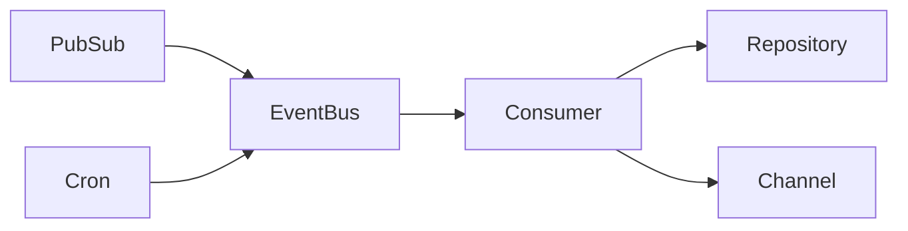
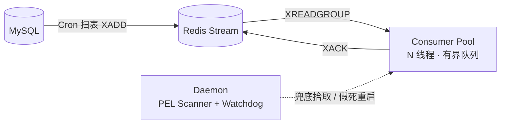

# MOCASA 催收系统升级 — Phase 1 基础设施交互规范

> **版本**: Phase 1 · 仅覆盖菲律宾市场  
> **日期**: 2026-07-01  
> **关联文档**: [产品需求文档 (PRD)](./MOCASA催收系统升级_Phase1_产品需求文档_PRD.md)、[架构设计文档](./MOCASA催收系统升级_Phase1_架构设计文档.md)、[核心引擎规格](./MOCASA催收系统升级_Phase1_核心引擎规格.md)、[领域模型与数据定义](./MOCASA催收系统升级_Phase1_领域模型与数据定义.md)、[数据接入规格](./MOCASA催收系统升级_Phase1_数据接入规格.md)

---

## 目录

- [1. 文档定位与阅读导图](#1-文档定位与阅读导图)
  - [1.1 文档定位与覆盖范围](#11-文档定位与覆盖范围)
  - [1.2 全局运行链路](#12-全局运行链路)
  - [1.3 阅读约定与 SSOT 索引](#13-阅读约定与-ssot-索引)
- [2. 运行模式与事件消费模型](#2-运行模式与事件消费模型)
  - [2.1 目的与边界](#21-目的与边界)
  - [2.2 当前状态与生产切换条件](#22-当前状态与生产切换条件)
  - [2.3 生产消费拓扑、线程职责与背压](#23-生产消费拓扑线程职责与背压)
  - [2.4 Daemon 与故障恢复](#24-daemon-与故障恢复)
- [3. 事件总线：Redis Stream](#3-事件总线redis-stream)
  - [3.1 目的与边界](#31-目的与边界)
  - [3.2 当前状态与生产目标](#32-当前状态与生产目标)
  - [3.3 核心消费协议](#33-核心消费协议)
  - [3.4 异常恢复与死信](#34-异常恢复与死信)
  - [3.5 重放前合规时段校验](#35-重放前合规时段校验)
- [4. 运行时状态：Redis KV](#4-运行时状态redis-kv)
  - [4.1 目的与边界](#41-目的与边界)
  - [4.2 当前状态与生产约束](#42-当前状态与生产约束)
  - [4.3 Key 与生命周期规格](#43-key-与生命周期规格)
  - [4.4 原子操作与内存保护](#44-原子操作与内存保护)
- [5. 定时调度：XXL-Job](#5-定时调度xxl-job)
  - [5.1 目的与边界](#51-目的与边界)
  - [5.2 当前状态与生产切换](#52-当前状态与生产切换)
  - [5.3 Job 规格](#53-job-规格)
  - [5.4 调度一致性与积压处理](#54-调度一致性与积压处理)
- [6. 持久层：Repository](#6-持久层repository)
  - [6.1 目的、边界与读者指引](#61-目的边界与读者指引)
  - [6.2 事件与调度场景映射](#62-事件与调度场景映射)
  - [6.3 契约分工](#63-契约分工)
  - [6.4 事务、行锁与并发约束](#64-事务行锁与并发约束)
- [7. 配置管理与可观测性](#7-配置管理与可观测性)
  - [7.1 配置职责与来源](#71-配置职责与来源)
  - [7.2 配置热更新与静态参数](#72-配置热更新与静态参数)
  - [7.3 指标与日志](#73-指标与日志)
- [附录 A：配置键与环境索引](#附录-a配置键与环境索引)
  - [A.1 配置来源与热更规则](#a1-配置来源与热更规则)
  - [A.2 引擎与事件总线](#a2-引擎与事件总线)
    - [A.2.1 Phase 1 生效（缺省即可）](#a21-phase-1-生效缺省即可)
    - [A.2.2 Redis 生产键](#a22-redis-生产键)
  - [A.3 接入与 PubSub](#a3-接入与-pubsub)
  - [A.4 迁移与触达](#a4-迁移与触达)
  - [A.5 接入层 Redis Key 索引](#a5-接入层-redis-key-索引)
- [附录 B：上线准备、容量校准与联调签字](#附录-b上线准备容量校准与联调签字)
  - [B.1 上线前容量校准清单](#b1-上线前容量校准清单)
  - [B.2 生产切换门槛](#b2-生产切换门槛)
  - [B.3 接入域联调签字索引](#b3-接入域联调签字索引)

---

## 1. 文档定位与阅读导图

### 1.1 文档定位与覆盖范围

本文定义 Redis Stream、Redis KV、定时调度、Repository 访问、配置与可观测性的基础设施交互规范。

业务状态机以[核心引擎规格](./MOCASA催收系统升级_Phase1_核心引擎规格.md)为准，渠道协议以[渠道编排规格](./channel/MOCASA催收系统升级_Phase1_渠道编排规格.md)为准，数据接入协议与 PubSub 消费细节以[数据接入规格](./MOCASA催收系统升级_Phase1_数据接入规格.md)为准；本文仅覆盖它们与基础设施的交互边界。

### 1.2 全局运行链路


```mermaid
flowchart LR
  PubSub[PubSub] --> EventBus[EventBus]
  Cron[Cron] --> EventBus
  EventBus --> Consumer[Consumer]
  Consumer --> Repository[Repository]
  Consumer --> Channel[Channel]
```

> 图示用于说明本文档在全链路中的位置；PubSub 和 Channel 的协议细节不在本文展开。

### 1.3 阅读约定与 SSOT 索引

- **当前实现 / 生产目标**：正文明确区分已在 Phase 1 默认路径生效的能力和生产切换目标；`✅` 表示已确认的技术决策，**C 类上线前置**表示生产上线必须闭合的事项，`HANDOFF D1/D2` 表示 Redis 生产实现交接项。
- **配置 SSOT**：配置键、默认值和热更属性以[附录 A](#附录-a配置键与环境索引)为准。
- **运行时约定**：Redis Key 规范见 [§4](#4-运行时状态redis-kv)，指标和 MDC 规范见 [§7.3](#73-指标与日志)。

---

## 2. 运行模式与事件消费模型

[核心引擎规格 §3.1](./MOCASA催收系统升级_Phase1_核心引擎规格.md#31-线程隔离trigger-to-event) 定义了 Consumer Pool、Cron 与 Daemon 的线程隔离决策。本节定义可靠投递、并发处理、背压和故障恢复的基础设施模型；不定义业务事件状态机或渠道重试细节。

### 2.1 目的与边界

本节处理事件的可靠传递、并发消费、背压和故障恢复。业务事件状态机以核心引擎规格为准，单次消费内的渠道重试以渠道编排与引擎规格为准。

### 2.2 当前状态与生产切换条件

| 运行环境 | 事件总线与幂等实现 | 用途与限制 |
|---|---|---|
| 本地开发 / CI / L4 联调 | `InMemoryEventBus`、`InMemoryIdempotencyService`、`ConfigurableExecutionGuard` 内存计数 | 用于功能链路验证；不具备跨实例幂等、PEL、可靠重投或 Redis 原子频控能力 |
| 生产目标态 | `RedisStreamEventBusImpl`、Redis SETNX 幂等、Redis 原子频控计数 | 支持 Consumer Group、PEL、DLQ、跨实例幂等和跨渠道频控 |

**当前 Phase 1 代码默认内存实现；生产上线前必须完成 Redis D1/D2。** 生产配置须使用 `collection.eventbus=redis` 与 `collection.idempotency=redis`，并满足[附录 B.2](#b2-生产切换门槛)。

Redis 完成 D1/D2 后，Phase 1 初始部署采用单活跃实例；Redis 使后续多实例扩容无需改变业务处理逻辑。实例数、Consumer 并发和 Redis 容量须按[附录 B.1](#b1-上线前容量校准清单)完成 Pilot 校准后定版。

### 2.3 生产消费拓扑、线程职责与背压

生产目标拓扑如下：


```mermaid
flowchart LR
  DB[(MySQL)] -->|Cron 扫表 XADD| Stream[(Redis Stream)]
  Stream -->|XREADGROUP| Consumer[Consumer Pool\nN 线程 · 有界队列]
  Consumer -->|XACK| Stream
  Daemon[Daemon\nPEL Scanner + Watchdog] -.->|兜底拾取 / 假死重启| Consumer
```

| 线程组 | 职责 | 禁止事项 |
|---|---|---|
| Cron | 扫描到期步骤或旧库，发布事件后返回 | 执行渠道调用、等待业务 I/O、与 Consumer 共用线程池 |
| Consumer | 经 `XREADGROUP` 获取事件，执行业务管线并在成功后 `XACK` | 与 Cron 或 Daemon 共用线程池 |
| Daemon | 扫描 PEL、认领超时消息、检测消费连接假死并恢复 | 执行业务管线或长期占用 Consumer 线程 |

Consumer / Cron / Daemon 三组线程互不共享线程池；任一组阻塞不得影响其他两组。Redis Stream 的 `XREADGROUP`、`XACK`、PEL、DLQ 和看门狗详细语义见 [§3](#3-事件总线redis-stream)。

#### Consumer 线程池与背压

| 参数 | 值 | 说明 |
|---|---|---|
| 类型 | `ThreadPoolExecutor` | 非 `ScheduledThreadPool`，调度由消费循环自驱 |
| corePoolSize | `engine.consumer.thread_pool_size`（初始值 8） | 等于消费并发度；上线前按容量校准结果确定 |
| maximumPoolSize | = corePoolSize | 固定大小，不动态扩缩；突发流量由队列缓冲 |
| workQueue | `LinkedBlockingQueue(engine.consumer.queue_capacity)`（初始值 256） | 有界队列；上线前按可接受排队时延和单任务内存确定 |
| rejectedExecutionHandler | `CallerRunsPolicy` | 队列满时阻塞消费循环线程，XREADGROUP 暂停拉取，Redis Stream 自然积压但不丢消息 |
| threadFactory | `NamedThreadFactory("engine-consumer-%d")` | 线程命名便于日志 / thread dump 定位 |
| keepAliveTime | 0（core 不回收） | 固定池大小 |

> `8` 线程与队列 `256` 是基于日均案件 1–2 万、峰值约 1–3 QPS 的 Pilot 初始值，不是历史生产实测结论。须在上线前按[附录 B.1](#b1-上线前容量校准清单)的事件量、时效、渠道限流和实例资源压测校准。

> 拒绝策略选择 `CallerRunsPolicy` 而非 `AbortPolicy`（丢任务抛异常）或 `DiscardPolicy`（静默丢弃）：队列满 → Caller 阻塞 → XREADGROUP 停拉 → Stream 积压 → 上游感知背压。不丢消息、不 OOM、无需额外流控。

#### 降级日志防刷

`CallerRunsPolicy` 触发时须输出 WARN 日志，但高负载下可能每秒触发数百次。**约束**：背压日志必须使用 `RateLimiter` 压制（每 5 秒最多一条），内容包含当前队列深度和 Stream 积压量：

```
WARN [engine-consumer-loop] BackpressureTriggered — queue_depth=256, stream_pending=1832
```

> Watchdog 检测心跳时须排除"Caller 线程正在执行被拒绝任务"的场景（通过原子标志位 `callerRunning` 区分），防止将背压误判为假死。

### 2.4 Daemon 与故障恢复

| 守护任务 | 线程模型 | 执行频率 | 安全约束 |
|---|---|---|---|
| PEL Scanner | `ScheduledThreadPoolExecutor(1)`，命名 `engine-pel-scanner` | 初始值每 5 分钟（`engine.consumer.pel_scan_interval_minutes`） | 每次 XPENDING 必须携带 `COUNT`（`engine.consumer.pel_batch_size`，初始值 100），防止崩溃重启后一次性捞出海量积压导致 OOM |
| Watchdog | `ScheduledThreadPoolExecutor(1)`，命名 `engine-watchdog` | 每 `engine.watchdog.heartbeat_interval_seconds`（默认 10s）检测一次 | 必须 catch **`Throwable`**（非仅 `Exception`），防止偶发 Redis 连接超时的 `Error` 导致看门狗线程退出 |

> PEL Scanner 是低频兜底机制，初始值为每 5 分钟扫描一次，仅认领 idle 超过 10 分钟的消息。因此消费者崩溃后的自动恢复时间通常为 10–15 分钟；该时效须与业务可接受恢复时间共同在 Pilot 校准。

---

## 3. 事件总线：Redis Stream

### 3.1 目的与边界

事件总线负责事件可靠传递；不负责业务幂等、步骤状态机或渠道重试。业务模块仅依赖 `collection-common` 的 `CollectionEventBus` 接口，不感知底层实现。

### 3.2 当前状态与生产目标

| 实现 | 何时用 | 切换键 |
|---|---|---|
| `InMemoryEventBus` | Phase 1 默认，本地/CI 链路验证 | `collection.eventbus=memory`（缺省） |
| `RedisStreamEventBusImpl` | 生产上线前（HANDOFF D1/D2，待完成） | `collection.eventbus=redis` |

> 本节描述 **Redis Stream 生产语义**（XACK、PEL、DLQ、看门狗等）。Phase 1 内存版仅覆盖异步消费 + 背压，**不含**上述 Redis 能力（handler 异常仅 log，无 NACK/重投）；当前默认键见 [附录 A.2.1](#a21-phase-1-生效缺省即可)，生产切换键见 [A.2.2](#a22-redis-生产键)。

### 3.3 核心消费协议

**实现选型** ✅：技术栈为 Spring Boot 2.7.18，采用 Spring Data Redis 内置的 **`StreamMessageListenerContainer`**（Consumer Group 模式）承载消费循环，无需手写 Lettuce 轮询。容器负责订阅、反序列化分发与基础错误重启；PEL 拾取与看门狗作为崩溃/连接假死的兜底补充（下述）：

```java
public interface CollectionEventBus {
    void publish(CollectionEvent event);
    void subscribe(EventType eventType, EventHandler handler); // 实际用枚举增强类型安全
}
```

| 实现细节 | 说明 |
|---|---|
| 发布端 | `XADD` 写入 Redis Stream，事件序列化为 JSON，包含事件信封（eventId、eventType、timestamp、payload） |
| 消费端 | `XREADGROUP` 消费组模式，Consumer Group 保证同一事件仅被组内一个消费者处理 |
| ACK 机制 | 业务处理成功后显式 `XACK`；处理失败不 ACK → 滞留 PEL → 超时后重投递；不可重试（如反序列化失败）→ 直接 DLQ |
| 事件重投上限 | 跨消费重投次数达 `engine.consumer.max_delivery_count`（默认 5）→ XACK 移出 PEL + 写 DLQ + 告警（毒消息防护） |
| 渠道发送重试 | 单次消费内，渠道 dispatch 失败由 `StepExecutionOrchestrator` 按 `engine.step.max_retry_count`（默认 3）退避重试；**与事件重投计数无关** |

### 3.4 异常恢复与死信

#### PEL 拾取机制

消费者 `XREADGROUP` 后、`XACK` 前崩溃或假死 → 消息滞留 PEL，读 `>` 无法触达，须主动拾取。启动时扫一次，PEL Scanner 定期扫（频率见 [§2.4](#24-daemon-与故障恢复)）。

| 步骤 | 动作 | 判定 / 处置 |
|---|---|---|
| 1. 发现 | `XPENDING … COUNT` | 列出 PEL 中各消息的 idle 时长与 `delivery_count` |
| 2. 认领 | `XAUTOCLAIM`（或 `XCLAIM`） | 仅对 idle > `pel_idle_minutes`（默认 10min）的消息转移给当前消费者；阈值须大于单条最长处理时间，避免误抢正在处理的消息 |
| 3. 毒消息 | `delivery_count > max_delivery_count` | XACK 移出 PEL → 写 DLQ → 告警，不再重投 |
| 4. 正常重投 | 其余已认领消息 | 重新进入消费管线；引擎步骤幂等锁（`lock:plan:`）保证安全重试 |

#### 看门狗机制

`StreamMessageListenerContainer` 的轮询线程在连接假死（Lettuce 连接断开但无异常退出，容器 ErrorHandler 不触发）时可能静默停摆。线程规格见 [§2.4](#24-daemon-与故障恢复)，核心逻辑：

| 组件 | 行为 |
|---|---|
| 容器投递 | `MessageListener` 在每次投递（含空轮询回调）后更新心跳时间戳（Redis `SET` 或内存变量） |
| 守护线程 | 心跳超时（`engine.watchdog.timeout_seconds`，默认 60s）时：① 先 `container.stop()` 优雅停止旧订阅（等待终止）；② 重建 Lettuce 连接并 `container.start()` 重启订阅；③ 触发告警（[运维与协作](./MOCASA催收系统升级_Phase1_运维与协作.md)） |

> 重启前必须先停止旧订阅，防止旧连接（网络卡顿非真死）与新连接并存导致双重消费。

#### DLQ 重放（redrive）

> 上文 ACK / PEL 机制定义消息**进入** DLQ 的条件（不可重试、重投递次数达上限）。本节定义消息**移出** DLQ 的重放路径，是 DLQ 三级恢复中"自动重放"一环的运行时唯一归属（架构 §1.6 附：基础设施实现索引登记此处）。

| 项 | 约定 |
|---|---|
| 持久化 | **C 类上线前置**：DLQ 消息落 MySQL `t_event_dlq`（含原始信封、入队原因、投递次数、首次/末次失败时间），不仅留在 Redis。DDL owner=主架构/common，权威文件=`db/schema.sql`；Redis/DLQ 实现接入时一并补表，避免实例重启丢失 |
| 自动重放 | 定时任务扫描可重放消息（排除反序列化失败等不可恢复毒消息），重投回原 Stream 消费管线；重放计数独立，二次失败仍达上限 → 标记为"需人工" |
| 幂等保障 | 重放复用既有事件消费去重（`processed:{event_id}`，[§3](#3-运行时状态redis-kv)），保证重复投递安全 |
| 人工兜底 | 不可恢复 / 重放仍失败的消息保留待人工处理，并告警（[运维与协作](./MOCASA催收系统升级_Phase1_运维与协作.md)，规划中） |

### 3.5 重放前合规时段校验

> 重放可能发生在原触达时点之后较久，若直接重投会产生"业务时间毒丸"——在合规禁止时段（如夜间）触发触达。

- 自动重放前必须校验当前是否处于合规可触达时段；落在禁止时段的触达类事件**延迟到下一个合规窗口**再重投，而非立即消费。
- 合规时段判定复用 `ExecutionGuard` 的时段规则口径（[核心引擎规格 §7.3 L1 基础设施异常](./MOCASA催收系统升级_Phase1_核心引擎规格.md#73-l1-基础设施异常)、[渠道编排规格](./channel/MOCASA催收系统升级_Phase1_渠道编排规格.md)），本节只约束"重放调度时机"，不重复定义合规规则。

---

## 4. 运行时状态：Redis KV

### 4.1 目的与边界

Redis KV 负责幂等、步骤锁、频控和接入去重；Redis Stream 负责消息可靠传递，二者职责不可混用。

### 4.2 当前状态与生产约束

本地开发 / CI / L4 联调可使用内存幂等实现。生产环境必须使用 Redis SETNX + TTL 幂等与 Redis 原子频控，并满足与旧系统物理或前缀隔离、跨实例原子操作和明确淘汰边界的约束。

### 4.3 Key 与生命周期规格

| 前缀 | 用途 | 数据类型 | 示例 |
|---|---|---|---|
| `compliance:` | 合规计数器（每日/每周触达次数） | String（计数） | `compliance:daily:{user_id}:{channel}:{date}` |
| `processed:` | 事件消费去重标记 | String（标记） | `processed:{event_id}` |
| `lock:plan:` | 分布式幂等锁（步骤级） | String（SETNX） | `lock:plan:{step_idempotency_key}` |
| `idempotency:` | 渠道层二次去重 | String（SETNX） | `idempotency:channel:{idempotency_key}` |
| `ingestion:` | 接入层 PubSub 幂等 / 日切 dedup（Phase 1 可内存实现） | String | 见 [数据接入 §3.3](./MOCASA催收系统升级_Phase1_数据接入规格.md#33-接入幂等键)（[A.5](#a5-接入层-redis-key-索引) 索引） |

> 接入层 key 须与旧催收 Redis **物理或前缀隔离**（新系统 `ingestion:*` / `ai:*`）。

#### TTL 策略

| Key 类型 | TTL | 理由 |
|---|---|---|
| 合规计数器（daily） | 当日 23:59:59 过期 | 自然日重置 |
| 合规计数器（weekly） | 7 天 | 自然周重置 |
| 幂等锁 | 15 分钟（`engine.step.idempotency_ttl_minutes`） | 覆盖事件重复消费窗口，过期自动释放 |
| 渠道层去重 | 24 小时 | 覆盖供应商回调延迟窗口 |
| 事件消费去重 | 24 小时 | At-least-once 消费去重 |
| 看门狗心跳 | 无 TTL（持续覆写） | 守护线程主动检查，无需自动过期 |

### 4.4 原子操作与内存保护

#### 内存淘汰策略

Redis 实例配置 ✅ `maxmemory-policy = volatile-lru`：仅淘汰设有 TTL 的 key，保护无 TTL 的 Stream 数据不被误驱逐。

#### 合规计数器实现约束

`ExecutionGuard` 的硬超时为 20ms（[核心引擎规格 §6.1](./MOCASA催收系统升级_Phase1_核心引擎规格.md#61-接口总览)）。合规计数的读取 + 增加 + 设 TTL 必须在**单次 Redis 交互**内完成，使用 Lua 脚本或 Pipeline，目标延迟 < 5ms：

```lua
local current = redis.call('INCR', KEYS[1])
if current == 1 then
    redis.call('EXPIREAT', KEYS[1], ARGV[1])
end
return current
```

---

## 5. 定时调度：XXL-Job

核心引擎通过 XXL-Job 实现 Trigger-to-Event 模式（[核心引擎规格 §3.1](./MOCASA催收系统升级_Phase1_核心引擎规格.md#31-线程隔离trigger-to-event)）。

### 5.1 目的与边界

Cron 只扫描数据并发布事件，不执行业务 I/O；业务由引擎 Consumer 执行。

### 5.2 当前状态与生产切换

前两个 Handler 当前由 admin `TriggerScanner` 的 `@Scheduled`（`collection.scan.interval-ms`，默认 5s）驱动；生产须切换 XXL-Job 按 Cron 触发。`dailyRoll` 独立在 ingestion，生产注册 XXL-Job 前须完成运行环境与联调签字。触达精度 ±1min 可接受。

### 5.3 Job 规格

调度侧只扫表/扫旧库并发事件；业务在引擎 Consumer 执行。Phase 1 共 3 个 Handler（`ptpExpiredHandler` Phase 2 预留，不注册）。

| Handler | 类 · 模块 | Cron | 扫描条件 → 事件 | 引擎入口 |
|---|---|---|---|---|
| `planStepDueHandler` | `TriggerScanner` · admin | 每分钟 | `trigger_time≤NOW`，步骤待触发，计划非终态 → `PLAN_STEP_DUE` | `prepareStepDue` → `executeStep` |
| `callbackTimeoutHandler` | 同上 | 每分钟 | `timeout_time≤NOW`，`EXECUTING`，计划非终态 → `CALLBACK_TIMEOUT` | `onCallbackTimeout`（[§4.3.4](./MOCASA催收系统升级_Phase1_核心引擎规格.md#434-callback_timeout)） |
| `dailyRoll` | `DpdStageRollHandler` · ingestion | 0:35 PHT | 并行期读取旧库 `overdue_days` → `STAGE_CHANGED` / `CASE_CEASED`；切量后再改 bill 重算 | `onStageChanged` / `onCaseCeased`（[接入 §4](./MOCASA催收系统升级_Phase1_数据接入规格.md#4-阶段变更与-dpd-日切)） |

### 5.4 调度一致性与积压处理

**扫描分页**：每批 `LIMIT N`（默认 1000，`engine.consumer.scan_limit`）；`count==LIMIT` 告警、等下轮 Cron，禁止单 Job 内递归扫完（[运维与协作](./MOCASA催收系统升级_Phase1_运维与协作.md)）。

#### 伪代码 → DB 调度（`register_job` / `cancel_scheduled_jobs`）

引擎伪代码中的调度注册**不建独立 Job**，而是写 DB 字段，由上表 Cron 到期扫表拾取（[引擎 §4/§5](./MOCASA催收系统升级_Phase1_核心引擎规格.md#4-计划生命周期与状态机)）：

| 伪代码 | 写库 | 由谁扫 |
|---|---|---|
| `register_job(PLAN_STEP_DUE, t)` | `trigger_time=t`，步骤待触发 | `planStepDueHandler` |
| `register_job(CALLBACK_TIMEOUT, min)` | `timeout_time=NOW()+min`（§5 ⑤ dispatch 后） | `callbackTimeoutHandler` |
| `cancel_scheduled_jobs(plan)` | 计划置终态；扫描 SQL 过滤非终态计划，自动跳过 | — |

Cron 线程只做扫表→发事件→返回，**禁止业务 I/O**（[§3.1](./MOCASA催收系统升级_Phase1_核心引擎规格.md#31-线程隔离trigger-to-event)）。

#### Cron 重复扫描与去重

Cron **不改步骤状态**，迁出扫描集前每轮会重发同一 `(planId, stepId)`，且每次 `eventId` 新生成——**不靠** `processed:{event_id}` 去重，靠步骤幂等锁 `lock:plan:`（[引擎 §5 ①](./MOCASA催收系统升级_Phase1_核心引擎规格.md#5-步骤执行管线)）在管线入口吸收；幂等锁在合规计数（§5 ③）之前，故重复 Cron 不会重复 INCR。

| 事件 | 迁出扫描集 | 重复发布收敛 |
|---|---|---|
| `PLAN_STEP_DUE` | Consumer 消费后步骤离开「待触发」 | 幂等锁 |
| `CALLBACK_TIMEOUT` | Consumer 消费后步骤离开 `EXECUTING`/超时态 | 步骤状态 + 幂等锁 |

> **投诉/争议冻结**：Phase 2 能力；Phase 1 不存在解冻重注入、Override 事件或 Guard 拦截路径。

---

## 6. 持久层：Repository

### 6.1 目的、边界与读者指引

引擎与 admin Cron 经 `collection-common` 契约访问 MySQL。本节是 Repository 访问索引，不重复领域模型或接口 Javadoc；**方法全集** → 接口 Javadoc + [领域模型](./MOCASA催收系统升级_Phase1_领域模型与数据定义.md)，**实现** → `collection-service`（MyBatis）。

### 6.2 事件与调度场景映射

按**领域事件 / Cron 调度**（§5）聚合 Repository 读写；`Orchestrator` 由 `PLAN_STEP_DUE` 链式触发，不单列。

| 触发 | Repository 访问 |
|---|---|
| `CASE_INGESTED` / `STAGE_CHANGED` | 读 payload→snapshot；升档 carry-forward / 写 `savePlan` |
| `PLAN_STEP_DUE` | **prepareStepDue**（事务）：R 锁计划/查步骤 · W 计划→EXECUTING、`markStarted`、清 trigger（观察期：W 步骤 COMPLETED）→ **executeStep**：R `getContactHistory` · W `updateStepStatus`, `writeTimeline`, `updateStepTimeoutTime`… |
| `CHANNEL_CALLBACK` / `CALLBACK_TIMEOUT` | 引擎写 `updateStepStatus` + `writeTimeline`；admin/Cron 仅发布事件（见 [引擎 §4.3.3](./MOCASA催收系统升级_Phase1_核心引擎规格.md#433-channel_callback)） |
| `STEP_COMPLETED` | 读 `getNextStep` / 写 `updateStepTriggerTime`, `updatePlanStatus`, `updateCurrentStep` |
| `REPAYMENT_RECEIVED` / `CASE_CEASED` / 升档取消 | 读 `findActivePlansByCase` / 写 `updatePlanStatus`→CANCELLED |
| `PLAN_EXHAUSTED` | 读 `plan.context_snapshot` / 写 `savePlan` |
| Cron（§5） | 读 `findDueSteps`, `findTimeoutSteps` |

`CaseService` 不参与上表（建计划用 payload；守卫/兜底读库，见 §6.3）。`PTP_EXPIRED` Phase 2。

### 6.3 契约分工

| 接口 | 调用方 | 读写 | 职责 |
|---|---|---|---|
| `ContactPlanRepository` | 引擎、`TriggerScanner` | 读写 | 计划/步骤、行锁、Cron 扫表 |
| `TimelineRepository` | Orchestrator、ContextAssembler | 读写 | 触达时间线 |
| `DecisionLogRepository` | 引擎决策日志 | 只写 | `t_decision_log` |
| `CaseService` | 守卫 / payload 兜底 | 只读 | 建计划→payload；守卫→旧库；兜底→`getContextSnapshot` |

### 6.4 事务、行锁与并发约束

| 约束 | 要求 | 典型 |
|---|---|---|
| 行锁 | `@Transactional` 内调用；`FOR UPDATE` 持至 COMMIT | `findPlanWithLock` |
| 写事务 | 多行/多表写同一事务，失败整笔回滚 | `savePlan`, `updateStepStatus`, `writeTimeline` |
| 只读 | 无写锁要求 | 查询、Cron 扫表 |
| 批量加锁 | `findPlansWithLock` 按 planId **升序**（规格预留） | 防死锁 |

短事务（`PlanLifecycleManager`）与 Orchestrator 非事务 I/O 见 [引擎 §3.1](./MOCASA催收系统升级_Phase1_核心引擎规格.md#31-线程隔离trigger-to-event)。

---

## 7. 配置管理与可观测性

### 7.1 配置职责与来源

运行时参数由 **Nacos YAML**（DataId 如 `intelligent-collection-common.yml`）+ Spring **`@RefreshScope`** 热更；GCP 凭证等走环境变量（[操作说明_Nacos本地启动.md](./操作说明_Nacos本地启动.md)）。**键名与默认值 SSOT** → [附录 A](#附录-a配置键与环境索引)；Phase 2 可选 `t_system_property` DB 轮询。

| 前缀 | 配什么 | 举例（非完整清单） |
|---|---|---|
| `engine.*` | 引擎行为：重试/幂等 TTL、SPI 超时、Consumer 池、scan_limit、合规时段 | `engine.step.idempotency_ttl_minutes`、`engine.consumer.scan_limit` |
| `collection.*` | 接入开关、eventbus/idempotency 切换、Cron 间隔、迁移双写 | `collection.ingestion.enabled`、`collection.eventbus`、`collection.scan.interval-ms` |
| `channel.*` | 渠道 API 密钥、endpoint、模板/号段（**同 Nacos YAML**，运维下发，不入 Git） | `channel.notification.app-key`、SendGrid API key → [渠道开发执行指南 §6](./channel/MOCASA催收系统升级_Phase1_collection-channel开发执行指南.md) |

完整键表与热更列 → [附录 A](#附录-a配置键与环境索引)；**写代码绑配置**以 `EngineProperties` / `@ConfigurationProperties` 为准。

### 7.2 配置热更新与静态参数

配置热更分类、结构性参数的重启要求和窗口参数的生效语义以 [A.1](#a1-配置来源与热更规则) 为准。线程池、Redis 连接等结构性参数为静态参数，变更后须重启。

### 7.3 指标与日志

本节约束引擎/基础设施的 **Metrics 埋点 + MDC 日志**（→ Prometheus / 日志平台），**不是**后台单案查询（[架构 §1.2.2](./MOCASA催收系统升级_Phase1_架构设计文档.md#122-应用入站)）或 DB 业务表（[§6](#6-持久层repository)）。Phase 1：**Metrics + Logging 做**，Tracing 不做（MDC `eventId`/`caseId` 串联排障）。原则 → [架构 §1.6.8](./MOCASA催收系统升级_Phase1_架构设计文档.md#168-可观测性守卫)；告警/Dashboard → 《运维与协作》（待建）。

#### 指标（Metrics）

经 Actuator `/actuator/prometheus` 暴露：

| 分类 | 埋点位置 | 指标 | 类型 |
|---|---|---|---|
| 系统 | Actuator | JVM / HTTP / health | 自动装配，免埋点 |
| 基础设施 | 事件总线 | `event.published`, `event.consumed`, `event.consume.duration` | Counter / Timer |
| 基础设施 | Consumer 线程池 | `event.consumer.thread.utilization` | Gauge |
| 基础设施 | Stream / PEL | `event.stream.lag`, `event.pending` | Gauge |
| 基础设施 | DLQ / Watchdog | `event.dlq.size`, `event.watchdog.restart` | Counter |
| 引擎 | `StepExecutionOrchestrator` | `touch.total`, `step.duration` | Counter / Timer |
| 引擎 | 守卫 fail-close | `step.skipped` | Counter |
| 引擎 | `SpiInvoker` | `spi.timeout` | Counter（SPI tag） |
| 引擎 | reaper / 回查补发 | `reconcile.resend` | Counter |

> 引擎侧指标对应架构 §1.6.8 静默路径须可观测；总线类以生产实现为准，Phase 1 内存版可省略。

Consumer 线程池必须注册 Micrometer `ExecutorServiceMetrics`，确保 [运维与协作](./MOCASA催收系统升级_Phase1_运维与协作.md) §1.2.2 定义的 `collection.event.consumer.thread.utilization` 和 `collection.event.stream.lag` 指标有数据来源。

#### 结构化日志（MDC）

引擎关键路径日志必须通过 SLF4J MDC 携带以下字段（logback pattern 输出 `%X{caseId}` 等）：

| MDC Key | 来源 | 生命周期 |
|---|---|---|
| `caseId` | 事件 payload | 消费入口 set → 处理完成 clear |
| `planId` | Plan 实体 | PlanLifecycleManager 入口 set |
| `stepId` | Step 实体 | StepExecutionOrchestrator 入口 set |
| `eventType` / `eventId` | 事件信封 | 消费入口 set |
| `consumerId` | 本实例 consumer name | 启动时 set，线程级别 |

**跨线程 MDC 传递（研发红线）**：MDC 基于 `ThreadLocal`，跨线程丢上下文；引擎 Consumer 池（消费循环 → 工作线程）即跨线程场景。

- 禁止原生 `new Thread()` 或未包装的 `ExecutorService` 执行异步任务
- 自建线程池必须用 `MdcTaskDecorator` 包装（提交 `getCopyOfContextMap()` → 执行 `setContextMap(copy)` → 结束 `clear()`）
- Spring `@Async` 的 `AsyncConfigurer` 必须返回包装后的 `Executor`

---

## 附录 A：配置键与环境索引

运维 / 联调检索**键名、默认值与热更属性**的 SSOT。各键行为语义见对应模块正文；上线准备与签字事项见[附录 B](#附录-b上线准备容量校准与联调签字)。

| 分册 | 内容 |
|---|---|
| **A.1** | 配置来源与热更分类 |
| **A.2** | Phase 1 生效键 + Redis 切换索引（`engine.*` / `collection.eventbus`） |
| **A.3** | 接入与 PubSub（`collection.ingestion.*`、GCP 环境变量） |
| **A.4** | 迁移与触达（`collection.notification.owner`） |
| **A.5** | 接入 dedup 键索引（SSOT → [数据接入 §3.3](./MOCASA催收系统升级_Phase1_数据接入规格.md#33-接入幂等键)） |

> 渠道编排参数见 [渠道编排规格](./channel/MOCASA催收系统升级_Phase1_渠道编排规格.md)。**凭证与连接串不入 Git 仓库**。

### A.1 配置来源与热更规则

| 来源 | 适用 | 说明 |
|---|---|---|
| **Nacos** | Phase 1 主路径 | `intelligent-collection-common.yml` / 环境 profile |
| **环境变量** | GCP 凭证、本地联调 | 见 A.3「GCP 环境变量」 |
| **`t_system_property`** | Phase 2 可选 | DB 轮询热更；见 [§7.1](#71-配置职责与来源) |

**热更列含义**（A.2～A.4 各键「热更」列 SSOT）：

| 分类 | 特征 | 代码行为 |
|---|---|---|
| **Y** | 仅影响下一次执行的决策值，不涉及运行时结构 | Nacos 变更后立即生效 |
| **Y-注意** | TTL/超时等窗口类参数 | 生效；改小 TTL 存在「新老交替期」（已写入 key 不追溯，最长=旧 TTL） |
| **N** | 线程池结构、Redis 连接等 | 检测到变更仅 log WARN，**不生效**，须重启 |
| **—** | 环境变量 / 部署时设定 | 非 Nacos 热更路径 |

> **Y-注意 示例**：`idempotency_ttl_minutes` 从 60min 改 10min → 新 key 用 10min，旧 key 仍按写入时 TTL 过期。

**变更审计**（Phase 2）：参数变更写入 `t_system_property_audit`（old/new/operator/timestamp）。

<a id="a2-引擎与事件总线"></a>

### A.2 引擎与事件总线

**写代码 / 配 Nacos 时只看 [A.2.1](#a21-phase-1-生效缺省即可)**。Redis Stream、PEL、合规计数等生产切换项尚未完成 D1/D2；键名与行为语义见正文 [§2～§4](#2-运行模式与事件消费模型)、[引擎 §7.4](./MOCASA催收系统升级_Phase1_核心引擎规格.md#74-跨存储一致性修复)。

<a id="a21-phase-1-生效缺省即可"></a>

#### A.2.1 Phase 1 生效（缺省即可）

已绑定 `EngineProperties` / `@ConfigurationProperties`；Nacos 未覆盖时使用下列默认值。

| 参数 Key | 默认值 | 热更 | 说明 | 规格 |
|---|---|---|---|---|
| `engine.step.idempotency_ttl_minutes` | `15` | Y-注意 | 步骤幂等锁 TTL（分钟） | [引擎 §5](./MOCASA催收系统升级_Phase1_核心引擎规格.md#5-步骤执行管线) |
| `engine.step.max_retry_count` | `3` | Y | 步骤渠道发送最大重试次数 | 引擎 §5 |
| `engine.step.retry_base_interval_seconds` | `30` | Y | 首次重试退避基准（秒） | 引擎 §5 |
| `engine.step.retry_max_interval_seconds` | `300` | Y | 退避上限（秒） | 引擎 §5 |
| `engine.step.retry_backoff_factor` | `2` | Y | 退避倍数 | 引擎 §5 |
| `engine.step.callback_timeout_minutes` | `60` | Y-注意 | 异步回调超时（分钟） | [引擎 §4.3.4](./MOCASA催收系统升级_Phase1_核心引擎规格.md#434-callback_timeout) |
| `engine.plan.max_rebuild_count` | `2` | Y | 单案件单阶段最大续建次数 | [引擎 §4.5](./MOCASA催收系统升级_Phase1_核心引擎规格.md#45-穷尽续建) |
| `engine.spi.plan_factory.timeout_ms` | `50` | Y | PlanFactory 硬超时 | [引擎 §6.1](./MOCASA催收系统升级_Phase1_核心引擎规格.md#61-接口总览) |
| `engine.spi.execution_guard.timeout_ms` | `20` | Y | ExecutionGuard 硬超时 | 引擎 §6.1 |
| `engine.spi.step_resolver.timeout_ms` | `50` | Y | StepResolver 硬超时 | 引擎 §6.1 |
| `engine.spi.advancement_policy.timeout_ms` | `10` | Y | AdvancementPolicy 硬超时 | 引擎 §6.1 |
| `engine.spi.exhaustion_policy.timeout_ms` | `50` | Y | ExhaustionPolicy 硬超时 | 引擎 §6.1 |
| `engine.consumer.thread_pool_size` | `8` | N | Consumer 线程池大小 | [§2.3](#23-生产消费拓扑线程职责与背压) |
| `engine.consumer.queue_capacity` | `256` | N | Consumer 有界队列 | §2 |
| `engine.consumer.scan_limit` | `1000` | Y | Cron 扫描单批上限；`count==limit` 触发积压告警 | [§5](#5-定时调度xxl-job) |
| `engine.context.history_max_records` | `50` | Y | contactHistory 最大条数 | 引擎 §6.2 |
| `collection.eventbus` | `memory` | N | `memory` = `InMemoryEventBus` / `redis` = `RedisStreamEventBusImpl` | [§3](#3-事件总线redis-stream)、HANDOFF D1 |
| `collection.idempotency` | `memory` | N | `memory` = 内存幂等 / `redis` = SETNX+TTL | [§4](#4-运行时状态redis-kv)、HANDOFF D2 |
| `collection.scan.interval-ms` | `5000` | Y | Phase 1 `@Scheduled` 扫描间隔（ms）；生产改 XXL-Job 每分钟 | [§5](#5-定时调度xxl-job) |

#### A.2.2 Redis 生产键（Phase 1 生产依赖）

`collection.eventbus=redis` / `collection.idempotency=redis` 为生产配置，在 Redis 实现接入后启用（HANDOFF D1/D2）。本地开发与 L4b 联调可用缺省 `memory` 替身。完整默认值与热更列见正文，附录只索引键名。

| 参数 Key | 默认值 | 热更 | 规格 |
|---|---|---|---|
| `engine.consumer.poll_timeout_ms` | `2000` | Y | [§3](#3-事件总线redis-stream) |
| `engine.consumer.batch_size` | `10` | Y | §3 |
| `engine.consumer.pel_scan_interval_minutes` | `5` | Y | [§2.4](#24-daemon-与故障恢复) |
| `engine.consumer.pel_idle_minutes` | `10` | Y-注意 | §3 |
| `engine.consumer.pel_batch_size` | `100` | Y | §2 |
| `engine.consumer.max_delivery_count` | `5` | Y | §3 |
| `engine.watchdog.heartbeat_interval_seconds` | `10` | N | §3 |
| `engine.watchdog.timeout_seconds` | `60` | Y | §3 |
| `engine.redis.key_prefix` | `collection:` | N | [§4](#4-运行时状态redis-kv) |
| `engine.consumer.group_name` | `collection-engine` | N | §3 |
| `engine.consumer.stream_key` | `collection:event_stream` | N | §3 |
| `engine.step.executing_reaper_minutes` | `30` | Y | [引擎 §7.4](./MOCASA催收系统升级_Phase1_核心引擎规格.md#74-跨存储一致性修复) |
| `engine.compliance.daily_limit` | 每渠道 `1`，跨渠道合计 `3` | Y | [领域 §4.3](./MOCASA催收系统升级_Phase1_领域模型与数据定义.md#43-contacthistory触达历史摘要) |
| `engine.compliance.weekly_limit` | 未启用（Phase 2 预留） | Y | Phase 1 仅按自然日频控 |
| `engine.compliance.quiet_hours_start` | `21:00` | Y | 引擎 §5 ③ |
| `engine.compliance.quiet_hours_end` | `08:00` | Y | 引擎 §5 ③ |

<a id="a3-接入与-pubsub"></a>

### A.3 接入与 PubSub

行为 SSOT：[数据接入 §2.1～§3、§6.0](./MOCASA催收系统升级_Phase1_数据接入规格.md)。

**GCP 环境变量**（不入仓）

| 键 | 说明 | 待闭合 |
|---|---|---|
| `GCP_PUBSUB_PROJECT` | GCP 项目 ID | [C-P-01](./MOCASA催收系统升级_Phase1_数据接入规格.md#c-p-基础设施与可靠性) |
| `GCP_PUBSUB_SUBSCRIPTION` | 独立订阅，目标 **`collection-cases-ai-v1-sub`** | C-P-01 |
| `GOOGLE_APPLICATION_CREDENTIALS` | 服务账号 JSON 路径 | C-P-01 |

**Nacos / 应用配置**

| 参数 Key | 默认值 | 热更 | 说明 | 规格 |
|---|---|---|---|---|
| `collection.ingestion.enabled` | `false`（本地/CI）；联调/生产 `true` | Y | 是否启动 PubSub Consumer | 接入 §2.1 |
| `collection.ingestion.ack-deadline-seconds` | `60` | Y | PubSub ack 期限（秒） | 接入 §2.1 |
| `collection.ingestion.max-concurrency` | `4` | N | 拉取并发度；改需重启 | 接入 §2.1 |
| `collection.ingestion.loan-id-whitelist` | 空（全量） | Y | 非空时仅处理名单内 `loan_id` | [接入 §6.0](./MOCASA催收系统升级_Phase1_数据接入规格.md#60-联调隔离)、C-P-08 |
| `collection.ingestion.case-push.field-map` | — | Y | PubSub JSON key → 语义字段 JSON | C-I-01 |
| `collection.ingestion.enrich-jpush-token` | `false` | Y | 消息缺 token 时读新库补全（**主路径**：`case_push` 已带 token，2026-07 确认；仅异常消息开启） | C-I-10、接入 §3.1 |

<a id="a4-迁移与触达"></a>

### A.4 迁移与触达

| 参数 Key | 取值 | 热更 | 说明 | 规格 |
|---|---|---|---|---|
| `collection.notification.owner` | `LEGACY` / `PARALLEL`（= MIGRATING）/ `NEW` | Y | D-3~D0 触达职责归属 | [接入 §6.0～§6.1](./MOCASA催收系统升级_Phase1_数据接入规格.md#6-迁移与双写) |

### A.5 接入层 Redis Key 索引

Phase 1：`IngestionDedupStore` **内存实现**；**L4b 不必配 Redis**，亦不必在 Nacos 写本节键。

切 Redis 后：前缀 `ingestion:`，与引擎 `processed:` / `lock:plan:` **禁止混用**；须与旧催收 Redis **物理或前缀隔离**（`ingestion:*` / `ai:*`）。

**键名、TTL、命中处置 SSOT** → [数据接入 §3.3](./MOCASA催收系统升级_Phase1_数据接入规格.md#33-接入幂等键)（本节仅索引，不重复 TTL 表）。前缀约定见 [§4.3](#43-key-与生命周期规格)。

---

## 附录 B：上线准备、容量校准与联调签字

### B.1 上线前容量校准清单

下表是研发、业务和运维讨论后的回填位置；在数据确认前，不以 L4 功能测试结果替代容量结论。完成回填后据此调整 Nacos 参数、告警阈值和上线验收结论。

| 校准项 | 待确认信息 | 用于确定 | 讨论结论 / 来源 / 观测区间 |
|---|---|---|---|
| 事件量 | 平均 QPS / 峰值 QPS / 峰值持续时间 / 日总量 | Consumer 线程数、队列容量、Stream 积压阈值 | 待研发讨论后回填 |
| 时效 | 普通触达从事件入队到开始处理的目标时长；故障消息最大恢复时长 | 队列容量、PEL idle、PEL 扫描周期、Watchdog 超时 | 待研发讨论后回填 |
| 渠道 | SMS、Push、Email、AI Call 的 QPS/并发上限及超时 | Consumer 并发、每渠道限流、步骤超时与重试参数 | 待研发讨论后回填 |
| 资源 | 每实例 CPU 核数 / 内存 / JVM 堆 / 首期实例数 | 线程池上限、队列内存预算、实例扩容阈值 | 待研发讨论后回填 |
| Redis | 单机、主从或 Cluster；是否与旧系统共用；maxmemory 与持久化策略 | Consumer Group 部署、Key 隔离、容量与故障恢复设计 | 待研发讨论后回填 |
| 观测证据 | 旧系统日志/监控入口、PubSub 速率与 lag、Redis 指标、渠道发送日志 | Pilot 压测基线、告警阈值与上线验收 | 待研发讨论后回填 |

### B.2 生产切换门槛

- `RedisStreamEventBusImpl` 接入 Consumer Group、PEL 拾取、DLQ 与看门狗。
- Redis SETNX + TTL 幂等接入，并覆盖事件消费和步骤执行。
- Redis 原子频控接入，覆盖单渠道日上限与跨渠道日总上限。
- Redis 连接、事件积压、PEL、DLQ、Consumer 线程池指标已接入监控。
- [B.1](#b1-上线前容量校准清单)的容量数据完成回填并经相关方确认。

### B.3 接入域联调签字索引

明细与验收条件 → [数据接入 附录 C](./MOCASA催收系统升级_Phase1_数据接入规格.md#附录-c联调与实现跟踪台账)。签字后在 C 改 ✅ 并同步下表。

| # | 主题 | 跟踪 ID | 签字方 | 状态 |
|---|---|---|---|---|
| 1 | PubSub JSON 字段名 / `field-map` | C-I-01 | 信贷 | ⬜ |
| 2 | `case_push` 频率与 `message_id` 稳定性 | C-I-12 | 信贷 | ⬜ |
| 3 | 还款字段与全额结清判定 | C-I-13 | 信贷 | ⬜ |
| 4 | `NEW` 态信贷停发 D-3~D0 与灰度切片 | C-M-01 | 信贷 + 产品 | ⬜ |
| 5 | 存量 replay 名单与批次 | C-M-02 | 信贷 + 产品 | ⬜ |
| 6 | Topic project / 权限 / 跨 project | C-P-01 | 运维 + 信贷 | ⬜ |
| 7 | 独立订阅；`dataType` 码值稳定 | C-P-01, C-I-15 | 运维 + 信贷 | ⬜ |
| 8 | `case_push` 快照相关字段完整性 | C-I-02～C-I-11 | 信贷 | ⬜ |
| 9 | 旧系统下线后 topic 是否续发 | C-P-02 | 信贷 + 架构 | ⬜ |
| 10 | 数仓同步 jpush token 表（**可选降级**） | C-I-10 | 数仓 + DBA | ⬜ 主路径已改消息体，可逐步停用 |
