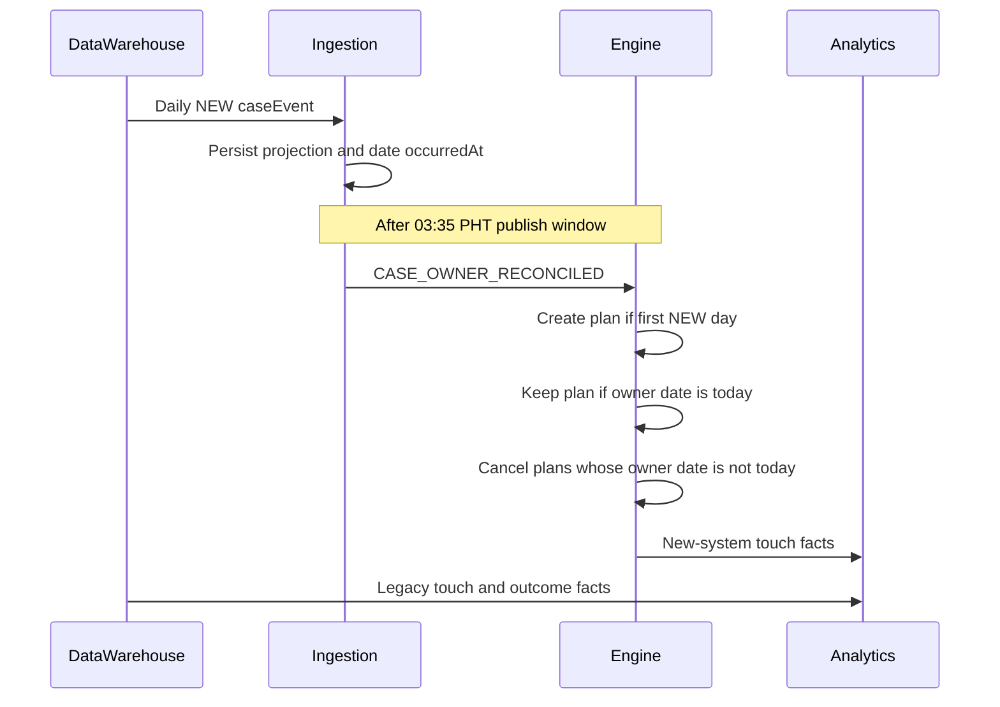

# MOCASA 催收系统升级 Phase 1 — 按日 Owner 路由改造计划

> **状态**：✅ 已确定（后续规格、代码与测试改造的执行计划）  
> **日期**：2026-09-02  
> **适用范围**：菲律宾市场；新旧催收系统按案件每日归属流转  
> **上游决策**：产品需求文档 PRD §2.3 / §6；现有案件消息以 [数仓 Pub/Sub 交付契约](./数仓_PubSub交付契约.md) 为准  
> **关联规格**：[架构设计文档](./MOCASA催收系统升级_Phase1_架构设计文档.md)、[数据接入规格](./MOCASA催收系统升级_Phase1_数据接入规格.md)、[领域模型与数据定义](./MOCASA催收系统升级_Phase1_领域模型与数据定义.md)、[核心引擎规格](./MOCASA催收系统升级_Phase1_核心引擎规格.md)、[基础设施交互规范](./MOCASA催收系统升级_Phase1_基础设施交互规范.md)、[管理后台设计文档](./MOCASA催收系统升级_Phase1_管理后台设计文档.md)

---

## 目录

- [1. 目标与边界](#1-目标与边界)
- [2. 已确定的关键决策](#2-已确定的关键决策)
- [3. 目标流程](#3-目标流程)
- [4. 消息与版本协议](#4-消息与版本协议)
- [5. 数据与模块改造](#5-数据与模块改造)
- [6. 分阶段实施顺序](#6-分阶段实施顺序)
- [7. 验收与灰度](#7-验收与灰度)
- [8. 风险与操作边界](#8-风险与操作边界)

## 1. 目标与边界

### 1.1 目标

数仓每日为每个在催案件决定 owner，并且只向新系统发布 `owner=NEW` 的完整 `caseEvent`：

- `NEW`：由 Intelligent-Collection-V1 生成和执行触达计划；
- 未出现在当天 NEW 批次的案件：由旧催收系统负责；新系统在当日案件发布窗口结束后做缺席对账，再停止其计划。

案件可在相邻的菲律宾自然日（`Asia/Manila`）在两套系统之间切换。该能力用于渐进迁移和同 cohort 下的新旧系统效果比较。

### 1.2 范围边界

- 外部仍使用现有 `caseEvent`，不新增外部事件类型。
- 数仓是路由决策唯一权威；新系统不得按本地规则重算或人工覆盖 owner。
- 同一 `caseId` 在同一 PHT 自然日内 owner 不变。
- 新系统不直接调用旧系统“接管案件”接口；旧系统按数仓侧路由接收其负责的案件。
- 旧系统触达、回款及成本事实须回流数仓，作为效果对比的数据来源；本仓不接管旧系统的运行逻辑。

## 2. 已确定的关键决策

| 决策 | 结论 | 原因 |
| --- | --- | --- |
| 计划模型 | 保留当前跨日、多步骤计划模型 | 继续支持观察期、异步 AI Call 回调、重试、穷尽续建与 Stage 变化，不将策略退化为每日重新开始。 |
| 回迁判定 | 发布窗口结束后的缺席对账 | 数仓只发 NEW 案件，不发 LEGACY 变更；窗口结束后未刷新归属日的活跃计划迁出。 |
| 批次完成 | Phase 1 **不**要数仓完成信号 | 连日观察与数仓沟通暂未见延迟/漏发。完成条件复用现有日切时钟：约 **03:00 PHT** 发完，**03:35 PHT** 起对账。若日后出现漏发，再补完成信号。 |
| 归属日 | `date(occurredAt)`，PHT 日历日 | 数仓确认每日 `caseEvent.occurredAt` 落在目标归属日当天。不新增 `routingDate`。不设 `routingBatchId`、`experimentId`、`experimentArm`。 |
| 案件内容版本 | 保留既有 `caseVersion` 内容指纹 | 它只判断 DPD、金额、结清等案件快照内容是否变化；不可承担路由事件排序。 |
| 分流粒度 | 数仓优先按 `userId` 稳定分桶，再输出逐案 owner | 同一用户的多笔在催案件不会被两套系统同日触达，降低频控与体验污染。 |
| 触达归因 | 以每日归属日刷新记录为准 | 归属日落库为 `date(occurredAt)`；回迁后不可用案件“当前状态”覆盖历史触达归属。 |

## 3. 目标流程

### 3.1 每日 NEW 批次接入

1. 数仓在每日案件批次窗口内，仅发布当天由新系统负责的完整 `caseEvent`；每条携带既有 `occurredAt` 与新增 `owner=NEW`。
2. `collection-ingestion` 写入案件投影，并以 `date(occurredAt)` 刷新该案的当日 NEW 归属；即使 `caseVersion` 未变，也必须刷新归属日。
3. 接入层**不**等待数仓完成信号。对账时刻复用现有日切起点：**03:35 PHT**（数仓约 **03:01 PHT** 发完，保留约 34 分钟传输、重投与落库缓冲）。
4. `dailyRoll` 当日的第一阶段必须先完成 owner 对账；只有对账成功，才能进入既有 DPD Stage 日切。该顺序由现有 Cloud Scheduler → Pub/Sub → 应用订阅入口保证，不增加 `@Scheduled` 入口。
5. 到达对账时刻后发布内部 `CASE_OWNER_RECONCILED`；若当日 inbox 仍无任何 NEW `caseEvent`，推迟对账并告警，不得把空收当成「今天零案」。

### 3.2 连续 NEW、迁出与重新迁入

连续多日 `owner=NEW` **沿用既有计划，不每天重建**。

| 情况 | 接入 | 03:35 对账 |
| --- | --- | --- |
| 首次进入 NEW | 写投影，归属日 = 当日 | 无活跃计划则建计划（既有 `CASE_INGESTED` 语义） |
| 连续第 N 日仍为 NEW | 即使 `caseVersion` 不变，也刷新归属日 | 归属日已是当日 → **保留**非终态计划，不取消、不重复建 |
| NEW → 当日未出现 | 归属日停留在昨日 | 取消活跃计划，`ROUTED_TO_LEGACY` |
| 迁出后再收到 NEW | 刷新归属日 | 无活跃计划则按首次入催再建 |

1. 已提交给供应商的请求不可撤回；回调仍可审计，但不得在迁出后推进或续建计划。
2. Stage 变化、穷尽续建仍走现有 `dailyRoll` / `PLAN_EXHAUSTED`，不因「又来了一条 NEW」而重置步骤。
3. 数仓统一触达事实应提供该用户当日旧系统触达摘要，供频控前对账；最终跨系统频控口径由数仓与旧系统协同确定。

### 3.3 运行时硬门控

以下入口都必须同时以「案件归属日等于当前 PHT 自然日」和「当日 owner 对账已成功」作为前置条件：

- 接入层首次建计划或重新入迁；
- 引擎的 Stage 变更和 `PLAN_EXHAUSTED` 续建；
- `planStepDue` / `callbackTimeout` 扫描；
- `PLAN_STEP_DUE` 消费后的 `PreFlightChecker` 和渠道 dispatch 前复检。

00:00 至当日 owner 对账成功前，不得沿用前一日归属执行、续建或推进计划。对账失败或未完成时，保持全局执行门控关闭并告警，不得让既有 DPD 日切绕过该门控；已经发出的外部触达以审计和人工处置收敛，不得盲目重发。

### 3.4 与既有日切的时序

现有生产 `dailyRoll` 窗口为 **03:35–05:55 PHT**，每 5 分钟由 Cloud Scheduler 发消息续跑。按日 owner 路由不改变窗口，也不新增独立调度入口：

1. 第一次可执行的 `dailyRoll` 消息先驱动 `CASE_OWNER_RECONCILED`，以可重入、可分页的方式完成当日迁出与首次/重新迁入建计划。
2. 将 `owner_reconciled_date = 当日` 持久化为当日全局水位；重复 `dailyRoll` 消息只恢复未完成的 owner 对账，不能重复取消或建计划。
3. 只有水位写成当日后，后续同窗口的 `dailyRoll` 消息才执行既有 Stage 变更、停催与续建逻辑。
4. `planStepDue`、`callbackTimeout` 与渠道 dispatch 都读取该水位；水位不是当日时一律跳过并记录可观测原因。

## 4. 消息与版本协议

### 4.1 `caseEvent` 字段

线上只新增 `owner`。归属日复用既有 `occurredAt`：

| 字段 | 来源 | 语义 |
| --- | --- | --- |
| `owner` | 新增，必填 | 发给新系统的案件固定为 `NEW`。 |
| `occurredAt` | 既有 | `yyyy-MM-dd HH:mm:ss`，按 `Asia/Manila`。**PHT 日历日 = 本次 NEW 归属日**（数仓已确认）。接入落库 `owner_date = date(occurredAt)`。 |
| `caseVersion` | 既有 | 内容指纹，不纳入 `owner`。 |

`repaymentEvent.occurredAt` 仍是还款时刻，**不得**刷新 owner 归属日。

接入处理顺序：

1. 拒绝 `date(occurredAt)` 早于已落库归属日的 `caseEvent`；
2. 刷新当日 NEW 归属（即使内容指纹未变）；
3. 独立比较 `caseVersion`，决定是否更新案件业务快照；
4. **03:35 PHT** 后对账：归属日等于当日的建/留计划，否则迁出活跃计划。

因此，即使案件金额与 DPD 未变化，当天 NEW 归属仍会刷新；同一消息的 Pub/Sub 重投由 `eventId` 和收件箱幂等吸收。

### 4.2 路由消息发布约束

- 数仓每日在现有案件批次窗口内发布当天 NEW 案件的完整快照；不得只发送 `caseId`。
- 每日 NEW `caseEvent.occurredAt` 的 PHT 日历日必须等于目标归属日；同日内容修正不得跨到次日。
- 迟到或重放消息必须复用原 `eventId`、`caseVersion` 与 `occurredAt`。
- Phase 1 不对账数仓完成信号。对账时刻固定为 **03:35 PHT**。零 NEW 案与「Publisher 故障」无法从消息流区分，须用 inbox 当日计数与告警兜底。

## 5. 数据与模块改造

本节列出后续实施扇出；字段、状态机、消息与配置的定义仍分别由对应 SSOT 文档承载。

| 层/模块 | 后续改造内容 | 首要 SSOT / 实现位置 |
| --- | --- | --- |
| 数仓契约 | 定义 `owner`；约束 `caseEvent.occurredAt` 日历日 = 归属日；明确只发 NEW、不发完成信号 | `docs/数仓_PubSub交付契约.md` |
| 领域与 DDL | 新增 `ROUTED_TO_LEGACY`、内部 `CASE_OWNER_RECONCILED`；投影增加 `owner` / `owner_date`（由 `occurredAt` 派生） | `docs/MOCASA催收系统升级_Phase1_领域模型与数据定义.md`、`db/schema.sql`、`collection-common` |
| 接入 | 映射 `owner`；指纹未变也按 `date(occurredAt)` 刷新归属日；持久化 `owner_reconciled_date` 水位；03:35 后先做 owner 对账、再允许既有日切 | `collection-ingestion` 的 `CasePayloadMapper`、`CaseProjectionAssembler`、`AiCaseIngestionProcessor`、`DpdStageRollHandler` |
| 服务层 | 投影读写 `owner` / `owner_date`；为引擎提供当日 NEW 归属查询 | `collection-service` 的投影 Repository、Mapper、`AiCollectionCaseService` |
| 引擎 | 对账后迁出；取消活跃计划；建计划 / 续建 / 到期执行 / 回调收敛时检查当日 NEW 归属 | `collection-engine` 的 `EventConsumerDispatcher`、`PlanLifecycleManager`、`StepExecutionOrchestrator`、`PreFlightChecker` |
| 调度 | 到期/超时扫描只拾取当日 NEW；对账空收、迁出后残留步骤告警 | `collection-admin` 调度扫描器、`collection-service` 扫描 SQL、基础设施规范 |
| 管理后台 | 案件详情展示归属日与自动迁出状态 | `collection-admin` 的查询/看板 API 与 UI、管理后台设计文档 |
| 数仓分析 | 汇总新旧两侧触达、还款、成本和投诉事实；按分流 cohort 与初始 DPD 对齐 | 数仓侧实现；本仓仅定义交付契约和查询口径 |

`collection-channel` 的策略、adapter 与 gateway 不改变 owner 决策；只有引擎已确认 owner=`NEW` 后才会调用渠道。若后续需要渠道透传路由标签或对接旧系统接口，须另行确认该模块的改动范围。

## 6. 分阶段实施顺序

1. **更新 SSOT**：先更新数仓契约、领域模型、核心引擎、接入、基础设施、管理后台和测试文档，明确 NEW 字段、时钟对账、状态机与指标口径。
2. **落 DDL 与 common 契约**：投影增加 `owner` / `owner_date`，新增枚举、事件 payload 和 Repository 接口。
3. **实现接入与时钟对账**：在不触发实际渠道的隔离环境验证重复、乱序、迟到、空收告警与缺席迁出。
4. **实现引擎取消与门控**：覆盖 PENDING、SCHEDULED、EXECUTING、等待 AI 回调、穷尽续建等状态。
5. **收紧调度与管理端可观测性**：扫描过滤、异常告警、单案归属日与迁出状态。
6. **接入数仓对比数据集**：核验旧系统事实回流、cohort 对齐和指标新鲜度。
7. **影子验证与灰度**：先不触达验证路由；再小比例真实分流；最后允许每日回迁。

## 7. 验收与灰度

### 7.1 必测场景

- 同一 `caseId` 的 `date(occurredAt)` 乱序、重复、跨日迟到与 Topic replay。
- 03:35 PHT 对账后的缺席迁出，在计划未开始、步骤待执行、步骤执行中、AI Call 等待回调、计划穷尽时均不再产生新触达。
- 03:35 PHT 起 owner 对账未完成或失败时，Stage 日切、到期扫描、回调推进和渠道 dispatch 均被门控；对账恢复后仅执行一次。
- 同一案件连续多日 `owner=NEW`：只刷新归属日，不重复建计划、不取消进行中的计划。
- 迁出后再入 NEW：只创建一条新计划，且不因重放重复建计划。
- 同一 `userId` 多案件在同一 PHT 自然日只能有一个执行 owner。
- 调度扫描、DLQ redrive、Outbox 兜底与回调处理不能绕过 owner 门控。
- 投影、计划、timeline 和决策日志的归属日可一致关联。

### 7.2 上线门槛

- 数仓完成 `owner` 字段，并确认只向新系统发送 NEW 案件，且 `caseEvent.occurredAt` 日历日等于归属日。
- 新旧系统分别确认执行前 owner 校验与当日频控口径。
- 缺席迁出、乱序保护、跨系统重复触达检测均通过隔离环境 E2E。
- 数仓可产出按路由日期、初始 DPD、产品、入催日期与系统归属分组的触达和回收指标。
- 灰度期间保留原有接入/扫描白名单作为隔离护栏；白名单不得作为长期 owner 路由来源。

## 8. 风险与操作边界

- `caseVersion` 相同不代表当天仍属于 NEW；案件内容去重与按 `date(occurredAt)` 刷新归属日必须独立处理。
- 已写入供应商的渠道请求无法可靠撤回；回迁的正确动作是停止后续步骤、保留审计和防止续建。
- 将“未收到 caseEvent”视为迁出依赖时钟门控，首次漏发会表现为漏催。Phase 1 用 03:35 缓冲与「当日零收则告警、不对账」降低该风险；出现漏发后再补完成信号。
- 指标比较按归属日与初始 DPD / 产品 cohort 对齐，并增加按实际 NEW 暴露时长的辅助视图；不得按案件最终状态归因。
- 新旧系统轨迹未统一回流时，只能评价新系统局部触达，不能宣称有新旧系统回收效果差异。

---

> 本文是实施计划，不替代字段、状态机、消息、调度、测试等 SSOT。后续每一阶段应先更新对应 SSOT，再修改代码和测试。
