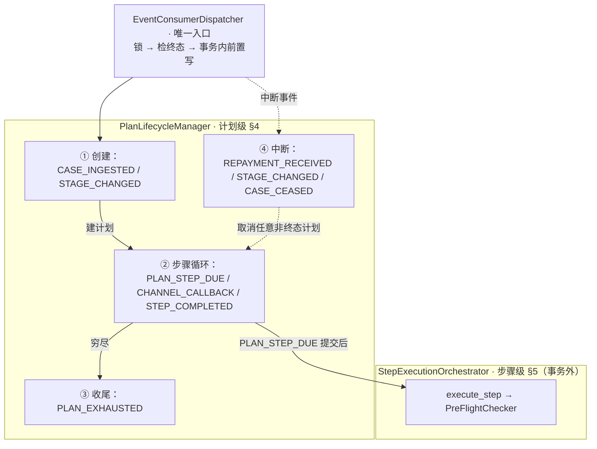

# MOCASA 催收系统升级 — Phase 1 核心引擎规格

> **版本**: Phase 1  
> **日期**: 2026-06-01  
> **范围**: 仅覆盖菲律宾市场  
> **模块**: `collection-engine`  
> **关联文档**: [产品需求文档 (PRD)](./MOCASA催收系统升级_Phase1_产品需求文档_PRD.md)、[架构设计文档](./MOCASA催收系统升级_Phase1_架构设计文档.md)、[基础设施交互规范](./MOCASA催收系统升级_Phase1_基础设施交互规范.md)、[领域模型 §6.6 / §9](./MOCASA催收系统升级_Phase1_领域模型与数据定义.md#9-eventpayload-字段定义)、[渠道总规格 §3.3](./channel/MOCASA催收系统升级_Phase1_collection-channel总规格.md#33-channel_callback-事件-payload)

---

## 目录

- [1. 引擎结构与边界](#1-引擎结构与边界)
  - [1.1 核心组件与职责](#11-核心组件与职责)
  - [1.2 模块边界与调用全景](#12-模块边界与调用全景)
- [2. 事件路由](#2-事件路由)
  - [2.1 事件路由表（SSOT）](#21-事件路由表ssot)
  - [2.2 生命周期派生总览](#22-生命周期派生总览)
- [3. 运行时执行模型](#3-运行时执行模型)
  - [3.1 线程隔离（Trigger-to-Event）](#31-线程隔离trigger-to-event)
  - [3.2 并发与一致性模型](#32-并发与一致性模型)
- [4. 计划生命周期与状态机](#4-计划生命周期与状态机)
  - [4.1 状态定义](#41-状态定义)
  - [4.2 计划创建](#42-计划创建)
  - [4.3 步骤执行循环](#43-步骤执行循环)
  - [4.4 中断处理](#44-中断处理)
  - [4.5 穷尽续建](#45-穷尽续建)
  - [4.6 PTP 到期处理（Phase 2 预留）](#46-ptp-到期处理)
  - [4.7 状态转换](#47-状态转换)
- [5. 步骤执行管线](#5-步骤执行管线)
  - [5.1 execute_step 七步管线](#51-execute_step-七步管线)
- [6. SPI 接口契约](#6-spi-接口契约)
  - [6.1 接口总览](#61-接口总览)
  - [6.2 共享 DTO 定义](#62-共享-dto-定义)
- [7. 容错与异常恢复](#7-容错与异常恢复)
  - [7.1 故障层级总览](#71-故障层级总览)
  - [7.2 步骤级降级](#72-步骤级降级)
  - [7.3 L1 基础设施异常](#73-l1-基础设施异常)
  - [7.4 跨存储一致性修复](#74-跨存储一致性修复)

---

## 1. 引擎结构与边界

本节交代引擎由哪些组件构成（§1.1）、与外部模块的边界与调用全景（§1.2），为后续事件路由（[§2](#2-事件路由)）、运行时执行模型（[§3](#3-运行时执行模型)）与计划生命周期（[§4](#4-计划生命周期与状态机)）提供结构地图。

### 1.1 核心组件与职责

`EventConsumerDispatcher` 是核心引擎的**唯一入口**——从 Redis Stream 消费事件，反序列化后按类型路由；其余三个核心类均为内部协作组件，不对外暴露调用。

| 类 | 职责边界 | 拥有的逻辑 |
|---|---|---|
| `EventConsumerDispatcher` | 事件消费 + 路由 + 并发保护 | 反序列化、行锁获取、终态拦截、委托 `PlanLifecycleManager` |
| `PlanLifecycleManager` | 计划级生命周期决策 | §4 全部伪代码（创建/中断/穷尽），事务内状态前置写入 |
| `StepExecutionOrchestrator` | 步骤级执行管线 | §5 全部伪代码（七步骨架），在非事务上下文中运行 |
| `PreFlightChecker` | 系统级实时守卫 | 实时查 DB 确认案件存活；由 Orchestrator 调用，**不直接消费事件** |

**调用链路**：`Dispatcher` → `Manager`（事务内）→ COMMIT → `Orchestrator`（事务外）；`PreFlightChecker` 嵌在 Orchestrator 的 `execute_step` 第②步。

### 1.2 模块边界与调用全景

核心引擎与渠道编排层的模块边界：引擎骨架通过 SPI / `ChannelGateway` 调用策略子层与执行子层（接口契约见 [§6](#6-spi-接口契约)）。下图为 [§5.1](#51-execute_step-七步管线) 步骤 ③④⑤ 的跨模块视角（签名见 [§6.1](#61-接口总览)，DTO 见 [§6.2](#62-共享-dto-定义)）：

```
  核心引擎(骨架)         渠道编排 · 策略子层          渠道编排 · 执行子层
  (engine.lifecycle)    (engine.strategy)          (collection-channel)
       │── ③ evaluate() ──→ │                          │
       │   BLOCK → SKIPPED  │                          │
       │   ALLOW ──→        │                          │
       │── ④ resolve() ───→ │←── StepCommand ──        │
       │── ⑤ dispatch() ──────────────────────────→    │
       │   消息类 ← DELIVERED → STEP_WAITING / STEP_COMPLETED
       │   电话/人工 → 保持 EXECUTING ← CHANNEL_CALLBACK（事件总线）
```

---

## 2. 事件路由

本节是事件的**声明性目录**：[§2.1](#21-事件路由表ssot) 路由表是 Dispatcher 消费的全部外部事件的唯一权威清单（SSOT），[§2.2](#22-生命周期派生总览) 给出由路由表派生的生命周期全景视图。事件如何被多线程承载与并发约束见 [§3](#3-运行时执行模型)。

### 2.1 事件路由表（SSOT）

下表是 Dispatcher 消费并路由的**事件唯一权威清单**（Phase 1 共 8 行）：处理动作与详见均以本表为准；事件按生命周期域的分组见 [§2.2](#22-生命周期派生总览) 派生总览图。

| 事件 | 引擎侧处理动作 | 详见 |
|---|---|---|
| `CASE_INGESTED` | 匹配模板 → 创建计划（PENDING）→ 注册首步 Job | [§4.2](#42-计划创建) |
| `STAGE_CHANGED` | 取消旧阶段活跃计划 → 为新阶段创建计划 | [§4.2](#42-计划创建)、[§4.4](#44-中断处理) |
| `REPAYMENT_RECEIVED` | 取消该用户所有活跃计划 + 清理已注册 Job | [§4.4](#44-中断处理) |
| `PLAN_STEP_DUE` | 按状态分流：到期执行 / 观察期结转 → 触达 | [§4.3](#43-步骤执行循环)、[§5](#5-步骤执行管线) |
| `CHANNEL_CALLBACK` | 更新步骤结果 → 发布 `STEP_COMPLETED` | [§4.3.3](#433-异步渠道回调处理) |
| `STEP_COMPLETED` | 推进决策：注册下一步 / 计划完成 / 发布穷尽 | [§4.3.2](#432-步骤完成推进决策) |
| `PLAN_EXHAUSTED` | 穷尽策略：续建新计划 / 升档 / 标记完成 | [§4.5](#45-穷尽续建) |
| `CASE_CEASED` | D+91 完全停催：取消该案件活跃计划，**不再续建**（停催终态） | [§4.4](#44-中断处理) |

所有事件经 Dispatcher 消费后遵循**统一的并发前置流程**（行锁 → 终态拦截 → 事务边界），该契约见 [§3.2](#32-并发与一致性模型)，本节不重复。事件的产生来源（外部上游 / 引擎链式 / 定时 Job）与 `EventType` 完整清单见 [领域模型 §6.6 EventType](./MOCASA催收系统升级_Phase1_领域模型与数据定义.md#66-eventtype内部事件类型)；链式发布的触发条件以 [§4.3](#43-步骤执行循环) / [§4.5](#45-穷尽续建) / [§5.1](#51-execute_step-七步管线) 伪代码为 SSOT。

### 2.2 生命周期派生总览

下图把路由表 8 行按其**生命周期域**压缩为四类协作关系，并用边表达正常推进顺序与横切关系，仅作全景导览（引擎侧视角，不涉及上游产生方式）；事件归属与处理动作以路由表为准，此处不展开单个事件语义。



> 读图：**实线**＝正常生命周期推进（入口 → ①创建 → ②循环 → ③收尾）与进入步骤管线；**虚线**＝横切中断（④可作用于任意非终态计划）。完整状态流转与竞态见 [§4.7](#47-状态转换)，本图不重复。

---

## 3. 运行时执行模型

本节定义事件的**操作性执行模型**：[§3.1](#31-线程隔离trigger-to-event) 调度线程与 Consumer 线程如何隔离，[§3.2](#32-并发与一致性模型) 并行消费下如何保证一致性。两者构成同一因果链——Consumer 线程池的并行正是并发控制的前提。

### 3.1 线程隔离（Trigger-to-Event）

[§2.1](#21-事件路由表ssot) 路由表中的 `PLAN_STEP_DUE` 由调度线程产生，其余业务事件由 Consumer 线程池消费。系统严格区分这两个运行上下文，杜绝调度线程与 I/O 密集操作的耦合：

| 阶段 | 线程上下文 | 职责 | 耗时要求 |
|---|---|---|---|
| 定时触发 | **XXL-Job Cron Thread** | 轻量扫表（`trigger_time <= NOW()` 且关联计划为非终态），发布 `PLAN_STEP_DUE` 事件到 Redis Stream | **毫秒级返回，严禁 I/O 阻塞** |
| 业务执行 | **Redis Stream Consumer Thread Pool** | 消费事件 → 执行合规/决策/渠道发送全链路 | 允许阻塞（渠道 I/O 集中在此线程池） |

XXL-Job 线程池永远毫秒级释放。渠道供应商变慢只影响 Consumer 线程池——单点可调优，不存在调度与 I/O 的交叉耦合。而 Consumer 线程池的**并行消费**正是 [§3.2](#32-并发与一致性模型) 所要约束的前提。

### 3.2 并发与一致性模型

Consumer 并行消费时存在四类一致性风险，典型事故是还款已取消计划却仍发出触达。下表为全局总览；**本节仅详述路由/线程层拥有的前两项**，其余在各自归属章节展开。

#### 一致性风险总览

| 风险 | 原则 | 一句话机制 | 归属 |
|---|---|---|---|
| 并发写坏 | 串行锁 + 锁内轻量 | 短事务 `SELECT FOR UPDATE`；锁内禁止渠道 I/O | **本节 ↓** |
| 重复执行 | 消费幂等 | XACK / DLQ + `idempotency_key` SETNX + 终态吸收 | **本节 ↓**（消费语义）；步骤级见 [§5.1](#51-execute_step-七步管线) ① |
| 乱序覆盖 | 终态单调 | 终态不可逆（先写先赢）；优先级 `REPAID` > `CEASED` > `STAGE_UPGRADE` > 非终态 | [§4.1](#41-状态定义)、[§4.4](#44-中断处理) |
| 迟到真相 | 多级复检 | 锁外重读计划行 + 触达前查案件库（PreFlightChecker） | [§5.1](#51-execute_step-七步管线) ②⑤½ |
| *容忍边界* | 有界越界 | 已发出触达允许秒级窗口；计划仍取消、后续不执行 | 设计决策，见下方竞态例证 |

> **终态单调**：中断 handler（[§4.4](#44-中断处理)）均**先取行锁、复检终态再写**，已终态则跳过——故终态**先写先赢**、互不覆盖。优先级全序中仅"`> 非终态`"（终态不可逆）是运行时强约束；终态之间的次序仅作审计/语义参考，不构成终态→终态覆盖。带外取消 `COMPLAINT` / `MANUAL`（[§4.4](#44-中断处理)，引擎管辖=否）同为终态、按先写先赢纳入；投诉的**可恢复实时冻结**是非终态停住（[§5.1 ②](#51-execute_step-七步管线)），与本优先级正交。低优先级先落的边界（如已还款却先被 `STAGE_UPGRADE` 取消续建）由**多级复检兜底**：新计划 `PreFlightChecker` 实时查得已还款即静默退出，迟到的 `REPAYMENT_RECEIVED` 亦会取消之。
>
> **扩展提醒**：新增 `cancel_reason` 或事件类型时，须重新审查上述终态语义与优先级是否仍成立。

#### 防并发写坏：串行锁 + 锁内轻量

所有事件经 Dispatcher 消费后，第一步即短事务内 `SELECT FOR UPDATE` 获取计划行级锁：

- **锁内只做**：校验当前状态 + 写状态前置（如 → `STEP_EXECUTING` / `PLAN_CANCELLED`）
- **锁内禁止**：渠道 I/O、远程调用、任何可能阻塞的操作
- **COMMIT 即释放**：锁持有时间 = 一次 DB 读写，毫秒级

同一计划的多个并发事件被串行化处理，且锁窗口极小——不会因渠道超时导致锁堆积。

#### 防重复执行：消费层幂等

Redis Stream 的消费语义保证：

| 场景 | 行为 |
|---|---|
| 处理成功 | `XACK` 确认，消息不再投递 |
| 处理失败（可重试） | 不 ACK → pending list → 自动重投递 |
| 处理失败（不可重试） | NACK → 转入 DLQ，触发告警 |
| 重复投递到达 | 步骤级 `idempotency_key`（SETNX）静默吸收；终态计划直接退出 |

消费 ACK 语义属于路由/线程层；`idempotency_key` 的具体实现见 [§5.1](#51-execute_step-七步管线) ①，DLQ 配置见 [基础设施交互规范](./MOCASA催收系统升级_Phase1_基础设施交互规范.md)。

#### 竞态时序例证

下面以最反直觉的一支为例，演示串行锁 + 多级复检 + 有界越界三者如何协同（非穷举，完整竞态覆盖由集成测试保证）：

```
Consumer-A (PLAN_STEP_DUE)           Consumer-B (REPAYMENT_RECEIVED)
    │                                      │
    │── SELECT FOR UPDATE plan ──→         │── SELECT FOR UPDATE plan (阻塞)
    │   plan.status == STEP_SCHEDULED      │
    │   → status = STEP_EXECUTING          │
    │── COMMIT（毫秒级释放锁）──→           │── 获取锁
    │                                      │   plan.status == STEP_EXECUTING（非终态）
    │   渠道 I/O 进行中...                  │   → status = PLAN_CANCELLED
    │                                      │── COMMIT
    │   渠道返回结果                         │
    │   写结果时重读计划发现 PLAN_CANCELLED   │   （多级复检：锁外重读计划行）
    │   → 静默丢弃，写补偿日志               │
```

结果：触达可能已发出（有界越界——还款与触达在同一秒级窗口内，不构成催收事故），计划已取消，后续步骤不再执行。

若中断线程先获锁，执行线程见终态 `PLAN_CANCELLED` 即静默退出（消费幂等——终态吸收）。还款/升档/执行等典型冲突由串行锁 + 终态单调 + 多级复检兜底，具体 cancel_reason 见 [§4.4](#44-中断处理)。

---

## 4. 计划生命周期与状态机

本节先定义状态词汇表，再按时间顺序展示计划从创建到终态的完整一生，最后以状态转换总表和转换图作为形式化总结。

> **§4 与 §5 的关系**：§4 是计划级的纵向视角（一个计划经历了什么），§5 是步骤级的横向视角（一次步骤执行内部怎么协作）。§4.3 中"执行步骤"的内部展开见 §5。

**§4 阅读地图**：先按"节 → 态 → 事件 → SPI"对齐全局，再读各节细节。

| 小节 | 触发事件 | 计划态变化 | 关联 SPI（链 [§6.1](#61-接口总览)） |
|---|---|---|---|
| [§4.1](#41-状态定义) 状态定义 | — | 词汇表（全 6 态） | — |
| [§4.2](#42-计划创建) 计划创建 | `CASE_INGESTED` / `STAGE_CHANGED` | → `PENDING` | `PlanFactory` |
| [§4.3](#43-步骤执行循环) 步骤执行循环 | `PLAN_STEP_DUE` / `CHANNEL_CALLBACK` / `STEP_COMPLETED` | `PENDING` / `STEP_SCHEDULED` → `STEP_EXECUTING` / `STEP_WAITING`；推进 → `STEP_SCHEDULED` | `ExecutionGuard` / `StepResolver` / `ChannelGateway` / `AdvancementPolicy` |
| [§4.4](#44-中断处理) 中断处理 | `REPAYMENT_RECEIVED` / `STAGE_CHANGED` / `CASE_CEASED` | 任意非终态 → `PLAN_CANCELLED`（`REPAID` / `STAGE_UPGRADE` / `CEASED`） | — |
| [§4.5](#45-穷尽续建) 穷尽续建 | `PLAN_EXHAUSTED` | → `PLAN_COMPLETED`；或新计划 `PENDING` | `ExhaustionPolicy` / `PlanFactory` |
| [§4.6](#46-ptp-到期处理) PTP 到期 | Phase 2 预留，Phase 1 不消费 | — | — |
| [§4.7](#47-状态转换) 状态转换 | 汇总（唯一完整状态图 SSOT） | 见图 | 链 §4.1–§4.5 |

> **生命周期不变量**：`context_snapshot` 在计划创建时冻结写入 plan 行，在计划整个存活期内保持不变；仅在三个重建点（[§4.2](#42-计划创建) 新建 / [§4.4](#44-中断处理) 升档重建 / [§4.5](#45-穷尽续建) 续建）刷新。
>
> **快照来源（决策 B，2026-06-29）**：① **§4.2 新建**——由 `CASE_INGESTED` 事件 payload 组装，**运行时不读旧库 `t_collection`**（payload 字段见 [领域模型 §9.2](./MOCASA催收系统升级_Phase1_领域模型与数据定义.md#92-逐事件-payload-字段)）；② **§4.4 升档重建 / §4.5 续建**——同案件无新 `case_push`，**carry-forward 旧计划已冻结快照**并按事件刷新 `stage`（§4.4 取 `STAGE_CHANGED.stage`）；③ `CaseService.getContextSnapshot` 仅作可选对账 / 兜底，非主链路。SPI 实现须知：不得依赖快照做实时判断（见 [§6.1「SPI 设计决策」](#61-接口总览) 及 [`contracts/ContextSnapshot契约对齐`](./contracts/README_ContextSnapshot契约对齐.md)）。

### 4.1 状态定义

计划级状态机共 **6 态**（4 非终态 + 2 终态），已覆盖引擎管辖的完整生命周期；步骤级状态（`SCHEDULED` / `EXECUTING` / `COMPLETED` 等）见 [领域模型](./MOCASA催收系统升级_Phase1_领域模型与数据定义.md)，不在此表重复。

| 状态 | 类型 | 语义 |
|---|---|---|
| `PENDING` | 非终态 | 计划刚创建，尚未执行任何步骤，等待首步 `trigger_time` |
| `STEP_SCHEDULED` | 非终态 | 上一步已结束，下一步 Job 已注册，等待到期 |
| `STEP_EXECUTING` | 非终态 | 当前步骤执行中（渠道发送 / 等待异步回调） |
| `STEP_WAITING` | 非终态 | 消息类渠道已发出，观察期内等待用户响应 |
| **`PLAN_COMPLETED`** | **终态** | 正常结束（还款确认或步骤全部走完） |
| **`PLAN_CANCELLED`** | **终态** | 被中断取消（见下表 `cancel_reason`） |

`PLAN_CANCELLED` 的 `cancel_reason` 枚举（完整枚举与"引擎管辖"列以 [领域模型 §6.7](./MOCASA催收系统升级_Phase1_领域模型与数据定义.md) 为 SSOT）：

| cancel_reason | 触发来源 | 语义 |
|---|---|---|
| `REPAID` | `REPAYMENT_RECEIVED`（引擎管辖） | 用户已还款 |
| `STAGE_UPGRADE` | `STAGE_CHANGED`（引擎管辖） | 阶段变更（DPD 自然越阶 / 人工调整等），旧阶段计划被新阶段取代 |
| `CEASED` | `CASE_CEASED`（引擎管辖） | Max DPD ≥ 91 完全停催：取消活跃计划且**不再续建**（停催终态） |
| `COMPLAINT` | 管理后台带外（引擎管辖=否） | 投诉冻结后经合规确认违规：终态取消、不续建（复用 [§4.4](#44-中断处理) 取消路径） |
| `MANUAL` | 管理后台带外（引擎管辖=否） | 人工运营手动取消（复用 [§4.4](#44-中断处理) 取消路径） |
| `PTP_EXPIRED` | （Phase 2 预留） | Phase 1 引擎不生产、不消费，见 [§4.6](#46-ptp-到期处理) |

> **带外取消**：`COMPLAINT` / `MANUAL` 由 admin 经管理后台触发，引擎仅识别为终态并复用 [§4.4](#44-中断处理) 取消路径（取行锁 → 复检终态 → 取消活跃计划 + 清理 Job），终态不续建。
>
> **投诉冻结 ≠ 取消**：一般投诉的**可恢复冻结**是非终态"停住"（由 [§5.1 ②](#51-execute_step-七步管线) PreFlightChecker 实时判定），不写本表、不进终态；仅合规确认违规时才升级为 `COMPLAINT` 终态取消。
>
> **不含 PLAN_PAUSED**：暂停态属于渠道编排层的概念（如人工外呼等待坐席分配），不归核心引擎状态机管辖。

### 4.2 计划创建

**入/出态**：入态 — / 出态 `PENDING`；`STEP_SCHEDULED` 的进入见 [§4.3](#43-步骤执行循环)。
**触发事件**：`CASE_INGESTED` / `STAGE_CHANGED`（链 [§2.1](#21-事件路由表ssot)）。
**关联 SPI**：`PlanFactory`（链 [§6.1](#61-接口总览)）。

数据接入流程见 ingestion 规格；引擎消费 `CASE_INGESTED` 后执行如下伪代码：

```python
def on_case_ingested(event):
    # 决策 B（2026-06-29）：快照字段随 CASE_INGESTED payload 带出，
    # 据 payload 组装 case_info + snapshot，运行时不读旧库 t_collection。
    case_info = build_case_info_from_payload(event)        # 取代 get_case_info(case_id)
    snapshot  = build_snapshot_from_payload(event)         # 取代 get_context_snapshot(case_id)

    plan = PlanFactory.create(case_info, event.stage, snapshot)   # → SPI §6.1
    if plan is None:
        return                        # 该案件不需要创建计划

    with transaction():               # 计划+步骤+首步 trigger_time 原子落盘
        save(plan)                    # 持久化计划 + 步骤序列
        first_step = plan.steps[0]
        first_step.trigger_time = calculate_trigger_time(first_step)
    plan.status = PENDING
```

**幂等约束**：`PlanFactory` 实现必须保证同一 `case_id + stage` 不重复创建计划。

> **单活跃计划约束**：同一 `case_id + stage` 在同一时刻最多存在一个非终态计划。阶段变更时旧阶段计划被取消后才创建新阶段计划（§4.4），穷尽续建时旧计划先标完成再创建新计划（§4.5）。因此 `find_active_plan(case_id)` 返回单个结果；`find_active_plans(user_id)` 返回多个结果仅当用户有多笔贷款（不同 case_id）。

创建时冻结 `context_snapshot`（见 [§4 生命周期不变量](#4-计划生命周期与状态机) note）。**数据来源（决策 B，2026-06-29）= `CASE_INGESTED` 事件 payload**：引擎据 payload 组装 `ContextSnapshot` 后序列化写入 plan 行，**运行时不读旧库 `t_collection`**；payload 字段 SSOT 见 [领域模型 §9.2](./MOCASA催收系统升级_Phase1_领域模型与数据定义.md#92-逐事件-payload-字段)、接入侧组装见 [数据接入 §3.4](./MOCASA催收系统升级_Phase1_数据接入规格.md#34-与-caseservice--profileservice-的调用边界)。`CaseService.getContextSnapshot` 降级为可选对账 / 兜底，非主链路。

### 4.3 步骤执行循环

**入/出态**：入态 `PENDING` / `STEP_SCHEDULED` → 出态 `STEP_EXECUTING`；推进后 `STEP_SCHEDULED`（**`STEP_SCHEDULED` 的唯一正常入口，见 [§4.3.2](#432-步骤完成推进决策)**）。
**触发事件**：`PLAN_STEP_DUE` / `CHANNEL_CALLBACK` / `STEP_COMPLETED`（事件名，非计划状态；链 [§2.1](#21-事件路由表ssot)）。
**关联 SPI**：`ExecutionGuard` / `StepResolver` / `ChannelGateway` / `AdvancementPolicy`（链 [§6.1](#61-接口总览)）。

线程隔离（Cron / Consumer 两上下文）见 [§3.1](#31-线程隔离trigger-to-event)；下方时序图聚焦**锁内/锁外事务边界**与事件驱动链路（非状态图重复，状态流转见 [§4.7](#47-状态转换)）。

```
  XXL-Job(Cron)      事件总线           核心引擎                合规/决策/渠道
    │                  │                  │                       │
    │  ──── [Cron Thread: 毫秒级扫表，严禁I/O] ────                │
    │                  │                  │                       │
    │──PLAN_STEP_DUE─→│                  │                       │
    │  [Cron Thread 立即释放]              │                       │
    │                  │                  │                       │
    │  ──── [Consumer Thread Pool: 允许I/O阻塞] ────               │
    │                  │── 消费 ────→     │                       │
    │                  │                  │                       │
    │                  │           ┌─ 事务(毫秒级) ───────────────┤
    │                  │           │  lock(plan)                  │
    │                  │           │  分流器(§4.3.1)              │
    │                  │  场景A:   │  → STEP_EXECUTING            │
    │                  │  场景B:   │  → COMPLETED + publish       │
    │                  │           └─ COMMIT 释放锁 ─────────────┤
    │                  │                  │                       │
    │                  │  场景A续: │  execute_step(plan, step)    │  ← 展开见 §5
    │                  │           │     check→decide→send        │
    │                  │           │  （渠道I/O在事务外执行）       │
    │                  │                  │                       │
    │                  │  ──── STEP_COMPLETED 消费 ────            │
    │                  │                  │                       │
    │                  │           AdvancementPolicy.decide()     │  ← SPI §6.1
    │                  │           ┌─ 推进决策 ──────────────────┤
    │                  │           │                              │
    │                  │  ADVANCE: │  注册下一步Job → STEP_SCHEDULED
    │                  │           │  （循环回到本节开头）          │
    │                  │           │                              │
    │                  │  COMPLETED:│ plan.status → PLAN_COMPLETED ✓
    │                  │           │                              │
    │                  │  EXHAUSTED:│ publish(PLAN_EXHAUSTED) → §4.5
    │                  │           └──────────────────────────────┘
```

#### 4.3.1 PLAN_STEP_DUE 分流器

`PLAN_STEP_DUE` 事件同时承载"步骤到期执行"和"观察期到期结转"两种语义。Consumer 消费后根据当前计划状态分流：

```python
def on_plan_step_due(event):
    # ── 事务 1（毫秒级：锁 → 校验 → 状态前置 → 释放） ──
    with transaction():
        plan = get_plan_with_lock(event.plan_id)  # SELECT FOR UPDATE
        if plan is None or plan.status in (PLAN_COMPLETED, PLAN_CANCELLED):
            return                                 # 终态拦截

        step = plan.get_current_step()

        if plan.status in (PENDING, STEP_SCHEDULED):
            plan.status = STEP_EXECUTING           # 状态前置，立即 COMMIT 释放行锁
        elif plan.status == STEP_WAITING:
            step.status = COMPLETED
            if step.best_result is None:
                step.result = SENT_NO_RESPONSE
            publish(STEP_COMPLETED)
            return
    # ── 事务已提交，行锁已释放 ──

    # ── 非事务上下文：渠道 I/O（允许耗时数百毫秒~数秒） ──
    execute_step(plan, step)                       # 展开见 §5
```

#### 4.3.2 步骤完成推进决策

```python
def on_step_completed(plan, completed_step):
    decision = AdvancementPolicy.decide(context, step_result)   # → SPI §6.1

    if decision == ADVANCE_NEXT:
        next_step = get_next_step(plan, completed_step)
        if next_step.delay_minutes > 0:
            register_job(PLAN_STEP_DUE, next_step.delay_minutes)
            plan.status = STEP_SCHEDULED
        else:
            execute_step(plan, next_step)          # 立即执行（并发安全由 §5.1 ⑤½ 复检保证）

    elif decision == PLAN_COMPLETED:
        plan.status = PLAN_COMPLETED               # 终态

    elif decision == PLAN_EXHAUSTED:
        publish(PLAN_EXHAUSTED)                    # → §4.5
```

#### 4.3.3 异步渠道回调处理

电话类（AI_CALL / TTS）渠道在发送后保持 `STEP_EXECUTING` 状态，等待外部供应商通过 Webhook 回调；消息类 **SMS** 在 `STEP_WAITING` 观察期内等待供应商 **DLR（送达回执）**。两类回调均经 `collection-admin` 鉴权后发布为 `CHANNEL_CALLBACK` 事件——SMS 收到 DLR 即**短路提前结转**，无需等满观察期；观察期是**最长等待上限**（默认 10min，由 `PlanFactory` 写入 `step.observation_minutes`），超时未收到 DLR 则按"受理即完成"由 [§4.3.1](#431-plan_step_due-分流器) 定时结转。（`HUMAN_CALL` 为 Phase 2 预留，Phase 1 不生成此类 step，见 [§4.3.4](#434-异步回调超时兜底)。）

```python
def on_channel_callback(event):
    with transaction():
        plan = get_plan_with_lock(event.plan_id)       # SELECT FOR UPDATE 串行化重复回调
        if plan.status not in (STEP_EXECUTING, STEP_WAITING):
            return                                     # 非执行/等待态（已处理或已取消），静默吸收

        step = plan.get_current_step()
        step.result = map_callback_to_result(event)    # 映射供应商回调为统一结果（电话 disposition / SMS DLR）
        step.status = COMPLETED                        # STEP_WAITING 收到 DLR → 短路结转，不等满观察期
        write_timeline(step.result)
    publish(STEP_COMPLETED)                            # 事务外发布，保证写入已落盘
```

#### 4.3.4 异步回调超时兜底

异步渠道（AI_CALL / TTS）在 `STEP_EXECUTING` 等待 Webhook；回调永久不到达时计划会卡死。采用两级保障，职责不同、互补而非重复：

| 级别 | 职责 | 典型失效场景 |
|---|---|---|
| **一级·引擎超时哨兵** | 按配置/渠道 metadata 注册超时 Job，到期仍无回调则标 `FAILED` 并 `publish(STEP_COMPLETED)`，走正常推进链路 | 供应商无回调、Webhook 丢失 |
| **二级·渠道对账扫描** | 一级未生效或外部已有结果但事件未到：查供应商状态、补写 timeline、补发事件 | 超时 Job 注册失败、进程崩溃、事件丢失 |

一级是状态机**主路径**自愈；二级是**运维兜底**，覆盖一级覆盖不到的副作用与对账缺口（详见 [渠道编排规格](./channel/MOCASA催收系统升级_Phase1_渠道编排规格.md)，**二级对账扫描章节规划中，待渠道编排补充后回链**）。

进入 `STEP_EXECUTING`（异步渠道）时注册超时 Job（[§5.1 步骤⑦](#51-execute_step-七步管线)）：

```python
def on_callback_timeout(event):
    plan = get_plan_with_lock(event.plan_id)
    if plan.status != STEP_EXECUTING:
        return                                     # 回调已正常处理，忽略

    step = plan.get_current_step()
    step.result = FAILED
    step.status = FAILED
    write_timeline(CALLBACK_TIMEOUT, note="async callback not received within timeout")
    publish(STEP_COMPLETED)                        # 由 AdvancementPolicy 决定下一步
```

**默认 60 分钟**：面向 AI_CALL / TTS（回调通常分钟级）。全局默认见 `engine.step.callback_timeout_minutes`（[基础设施交互规范·附录](./MOCASA催收系统升级_Phase1_基础设施交互规范.md#附录配置参数汇总)）。

> **异步等待期不变量**：60 分钟回调等待不占用 Consumer 线程；进入 `STEP_EXECUTING` 后由 `timeout_time` + Cron 触发超时哨兵，正常调度不会再次拾取同一步骤。故步骤幂等锁 TTL（默认 15 分钟）无需覆盖整个回调等待窗口，重复触发防线来自 Job 状态与计划状态，而非延长幂等锁。

> **`HUMAN_CALL`（Phase 2 预留）**：Phase 1 人工外呼**不进本系统**（由 LTH 现网承载，见 [架构设计文档 ADR](./MOCASA催收系统升级_Phase1_架构设计文档.md) / [渠道编排规格 §3.5](./channel/MOCASA催收系统升级_Phase1_渠道编排规格.md) / 对齐清单 E4）；`StepResolver` 永不输出 `HUMAN_CALL` step。本节及 [§5.1 步骤⑦](#51-execute_step-七步管线) 异步分支保留 `HUMAN_CALL` 仅为 Phase 2 前向兼容。Phase 2 接入时坐席录入可达数小时，须由 `StepResolver` 在 `StepCommand.metadata` 传入更长超时，不共用 60 分钟默认值。

### 4.4 中断处理

**入/出态**：入态 任意非终态 / 出态 `PLAN_CANCELLED`（`REPAID` / `STAGE_UPGRADE` / `CEASED`）。
**触发事件**：`REPAYMENT_RECEIVED` / `STAGE_CHANGED` / `CASE_CEASED`（链 [§2.1](#21-事件路由表ssot)）。
**关联 SPI**：—。

中断事件可在计划生命周期的**任意非终态**到达。状态机通过行级排他锁与终态单调（[§3.2](#32-并发与一致性模型)）确保中断与执行的并发安全。

> **带外取消（投诉/人工）**：除上述三个事件外，admin 可经管理后台直接将活跃计划置 `PLAN_CANCELLED` 并写 `cancel_reason = COMPLAINT` / `MANUAL`（[§4.1](#41-状态定义)）。其走与上述中断**相同的取消语义**（取行锁 → 复检终态 → 取消 + `cancel_scheduled_jobs`），终态不续建；引擎不持投诉事件（Phase 1）。需要"可恢复停住"而非终态取消时，走 [§5.1 ②](#51-execute_step-七步管线) 的实时冻结，不在本节。

> **`CASE_CEASED` 的适用边界**：仅处理**在途案件随日切老化跨过 D+91** 的情形——这类案件已在系统内、有活跃计划，需取消且不再续建。**新案件 Max DPD > 90 的入口过滤不走此路径**（由 `PlanFactory.create()` 返回 null 在 [§4.2](#42-计划创建) 拦截，与本节互不重叠）。事件由 ingestion 日切发布（见 [领域模型 §6.6](./MOCASA催收系统升级_Phase1_领域模型与数据定义.md#66-eventtype内部事件类型) `CASE_CEASED`）。

中断流程见下方伪代码 + [§4.7 状态图](#47-状态转换)。

```python
def on_repayment_received(user_id):
    plans = find_active_plans(user_id)             # status NOT IN 终态
    for plan in sorted(plans, key=lambda p: p.id): # 按 plan_id 升序加锁，防止死锁
        lock(plan)                                 # SELECT FOR UPDATE
        if plan.status in (PLAN_COMPLETED, PLAN_CANCELLED):
            continue                               # 终态不可逆：取锁后复检（§3.2），不覆盖
        plan.status = PLAN_CANCELLED
        plan.cancel_reason = REPAID
        cancel_scheduled_jobs(plan)
    PredictiveDialerService.filter_repaid_user(user_id)  # 失败 → 告警 + 继续（§7.3）

def on_stage_changed(case_id, new_stage):
    old_plans = find_active_plans_by_case(case_id)
    for plan in sorted(old_plans, key=lambda p: p.id):
        if plan.stage != new_stage:
            lock(plan)
            if plan.status in (PLAN_COMPLETED, PLAN_CANCELLED):
                continue                           # 终态不可逆：取锁后复检（§3.2），不覆盖
            plan.status = PLAN_CANCELLED
            plan.cancel_reason = STAGE_UPGRADE
            cancel_scheduled_jobs(plan)
    create_plan_for_stage(case_id, new_stage)       # 复用 §4.2 创建流程

def on_case_ceased(case_id):                        # D+91 完全停催：取消活跃计划，不续建
    old_plans = find_active_plans_by_case(case_id)
    for plan in sorted(old_plans, key=lambda p: p.id):  # 按 plan_id 升序加锁，防止死锁
        lock(plan)                                  # SELECT FOR UPDATE
        if plan.status in (PLAN_COMPLETED, PLAN_CANCELLED):
            continue                                # 终态不可逆：取锁后复检（§3.2），不覆盖
        plan.status = PLAN_CANCELLED
        plan.cancel_reason = CEASED
        cancel_scheduled_jobs(plan)
    # 不调用 create_plan_for_stage —— 停催后主动催收终止（区别于 STAGE_CHANGED 的取消+重建）
```

### 4.5 穷尽续建

**入/出态**：入态 `STEP_SCHEDULED` / `STEP_EXECUTING` → 出态 `PLAN_COMPLETED`（或新计划 `PENDING`）。
**触发事件**：`PLAN_EXHAUSTED`（所有步骤执行完毕但用户未还款；链 [§2.1](#21-事件路由表ssot)）。
**关联 SPI**：`ExhaustionPolicy` / `PlanFactory`（链 [§6.1](#61-接口总览)）。

穷尽**不等于结束**。当一个计划的所有步骤都已执行完毕但用户仍未还款时，`ExhaustionPolicy` 决定下一步走向。三种策略的区别：

| ExhaustionPolicy 返回值 | 语义 | 引擎动作 | 是否等待外部事件 |
|---|---|---|---|
| `REBUILD` | **同阶段立即续建**：在当前阶段创建新一轮计划（可能使用不同模板/策略），继续触达 | 立即调用 `PlanFactory.create()` 创建新计划并注册首步 Job | 否，立即执行 |
| `ESCALATE` | **升档**：当前阶段的触达手段已穷尽，需要提升催收强度 | 引擎发布 `STAGE_CHANGED` → 取消旧阶段计划 + 创建新阶段计划（复用 §4.2 + §4.4 流程） | 通过事件间接触发 |
| `COMPLETE` | **停止**：不再主动触达，等待用户自主还款或 DPD 自然越阶触发新阶段 | 标记计划 `PLAN_COMPLETED`（终态） | 结束，不再主动行动 |

> `REBUILD` 有续建次数上限（`engine.plan.max_rebuild_count`），防止无限循环。达到上限后策略层应返回 `ESCALATE` 或 `COMPLETE`。

```python
def on_plan_exhausted(event):
    plan = get_plan_with_lock(event.plan_id)
    if plan.status in (PLAN_COMPLETED, PLAN_CANCELLED):
        return

    # 决策 B：续建复用旧计划已冻结的快照（同案件、同数据），不回读旧库；
    # 续建/升档非外部 case_push 触发，无新 payload → carry-forward 即可。
    snapshot = deserialize(plan.context_snapshot)
    case_info = case_info_from_snapshot(snapshot)

    result = ExhaustionPolicy.handle(plan, case_info, snapshot)   # → SPI §6.1

    if result.action == REBUILD:
        new_plan = PlanFactory.create(case_info, plan.stage, snapshot)  # 幂等：同 case+stage 不重复
        with transaction():                        # 原子：后继持久化 + 旧计划终态写在同一事务
            save(new_plan)
            new_plan.steps[0].trigger_time = calculate_trigger_time(new_plan.steps[0])  # 注册首步
            plan.status = PLAN_COMPLETED           # 终态写最后；事务内崩溃整体回滚 → 重投重跑
    elif result.action == ESCALATE:
        publish(STAGE_CHANGED, new_stage=result.target_stage)  # 后继触发先发布（消费时复用 §4.2 建新阶段计划）
        plan.status = PLAN_COMPLETED               # 终态写最后；两步间崩溃 → 旧计划仍非终态 → 重投重跑
    elif result.action == COMPLETE:
        plan.status = PLAN_COMPLETED               # 终态，不再主动触达
```

> **续建/升档的崩溃安全（终态写最后 + 至少一次重投）**：旧计划的 `PLAN_COMPLETED` 终态写**置于后继（新计划持久化 / `STAGE_CHANGED` 发布）之后**。任何中途崩溃都使旧计划**仍处非终态** → `PLAN_EXHAUSTED` 未 ACK → 重投后 `on_plan_exhausted` 重跑（`ExhaustionPolicy` 无副作用、可重复调用；`PlanFactory` 与 `STAGE_CHANGED` 下游按 case+stage 幂等）。**不可改用 [§7.4](#74-跨存储一致性修复) 事后扫描兜底**——`COMPLETE`（正常完成、无后继）与「`REBUILD/ESCALATE` 半成品」在库中状态相同（计划 `PLAN_COMPLETED`、案件无活跃计划），扫描无法区分，故必须在写入期保证原子/可重入。

### 4.6 PTP 到期处理

**入/出态**：— / —。
**触发事件**：—（`PTP_EXPIRED` Phase 2 预留，Phase 1 不消费）。
**关联 SPI**：—。

> **Phase 2 预留——Phase 1 不启用。** Phase 1 **不做 PTP（Promise to Pay）记录**，PTP 到期也**不作为策略升档输入**；引擎不生产、不消费 `PTP_EXPIRED`，该事件也不入 [§2.1 路由表](#21-事件路由表ssot)。`EventType.PTP_EXPIRED` 与 `CancelReason.PTP_EXPIRED` 仅保留作前向兼容（[领域模型 §6.6](./MOCASA催收系统升级_Phase1_领域模型与数据定义.md#66-eventtype内部事件类型)/§6.7）；Phase 2 接入时再定义 PTP 录入来源、到期重评估（已还补偿取消 / 违约续建）与相应续建逻辑。需要绝对实时的"是否已还款"判断仍由七步管线系统级守卫（`PreFlightChecker`，[§5.1 ②](#51-execute_step-七步管线)）与 `REPAYMENT_RECEIVED` 中断路径（[§4.4](#44-中断处理)）覆盖。

### 4.7 状态转换

本节状态图是计划状态机的**唯一完整 SSOT**——§4.2–§4.5 不再画局部状态图，只交叉引用本节。图示主循环（含 `STEP_SCHEDULED` 推进入口）与全部中断路径（含 `CASE_CEASED`）；穷尽续建细节见 [§4.5](#45-穷尽续建)。

```
                 CASE_INGESTED / STAGE_CHANGED
                      │
                      ▼
                ┌──────────┐     PLAN_STEP_DUE    ┌────────────────┐
                │  PENDING  │ ──────────────────→ │ STEP_EXECUTING │
                └──────────┘                      └───────┬────────┘
                                                          │
                                    ┌─────────────────────┼──────────────────────┐
                                    │ 消息类(有观察期)      │ 消息类(无观察期)       │ 异步回调
                                    ▼                     │ / 同步完成             │ (CHANNEL_CALLBACK
                             ┌──────────────┐             │                      │  / 超时)
                             │ STEP_WAITING  │             │                      │
                             └──────┬───────┘             │                      │
                                    │ 观察期到期            │                      │
                                    │ (PLAN_STEP_DUE)      │                      │
                                    ▼                     ▼                      ▼
                             ┌──────────────────────────────────────────────────────┐
                             │              推进决策 (AdvancementPolicy)             │
                             │  ADVANCE_NEXT  → STEP_SCHEDULED (注册下一步 Job)      │
                             │  PLAN_COMPLETED → 终态                               │
                             │  PLAN_EXHAUSTED → §4.5（REBUILD / ESCALATE / COMPLETE）│
                             └──────────────────────────┬───────────────────────────┘
                                                        │ ADVANCE_NEXT
                                                        ▼
                             ┌────────────────┐    PLAN_STEP_DUE    ┌────────────────┐
                             │ STEP_SCHEDULED │ ──────────────────→ │ STEP_EXECUTING │
                             └────────────────┘                     └────────────────┘
                                                                          (循环)

  ════════════════════════════════════════════════════════════════════
  中断路径（任意非终态均可切入）:
  任意非终态 ──REPAYMENT_RECEIVED──→ PLAN_CANCELLED (REPAID)
  任意非终态 ──STAGE_CHANGED────────→ PLAN_CANCELLED (STAGE_UPGRADE) + 创建新计划
  任意非终态 ──CASE_CEASED──────────→ PLAN_CANCELLED (CEASED)，不再续建（D+91 停催，见 §4.4）
```

---

## 5. 步骤执行管线

本节定义 `StepExecutionOrchestrator` 的单步执行管线（§5.1）。计划级状态流转见 [§4.3](#43-步骤执行循环)；SPI 调用契约见 [§6](#6-spi-接口契约)；渠道失败时的步骤级降级归入容错章节 [§7.2](#72-步骤级降级)。

`StepExecutionOrchestrator` 的固定七步管线：幂等 → 系统守卫 → 合规 → 解析 → 渠道 → 降级 → 分流。所有步骤走同一条管线；差异在 SPI/渠道实现返回值，不在骨架分支。

### 5.1 execute_step 七步管线

**入口**：由 [§4.3.1](#431-plan_step_due-分流器) 分流器在事务外调用（行锁已释放，plan 已置 `STEP_EXECUTING`）。
**出口**：`STEP_WAITING`（消息类有观察期）/ `STEP_EXECUTING`（异步等回调）/ `publish(STEP_COMPLETED)` 推进。
**关联 SPI**：`ExecutionGuard` ③ / `StepResolver` ④ / `ChannelGateway` ⑤（职责、异常语义与演进策略以 [§6.1](#61-接口总览) 为 SSOT）。

```
executeStep(plan, step):

  ── 引擎内部 ──────────────────────────────────────────────────────
  ① 幂等锁获取    基于 idempotency_key 的分布式 SETNX；重复事件静默退出
  ② 系统级守卫    PreFlightChecker 实时查 DB 确认案件未还款/未冻结/未关闭；
                  失败 → 静默退出，不记录、不推进

  ── 通过接口契约调用渠道编排层 ─────────────────────────────────────
  ③ 业务级守卫    ExecutionGuard.evaluate() → 合规校验（频率/时段/放弃率）
                  拦截 → 标记 SKIPPED，写入 violation，推进下一步
  ④ 步骤解析      StepResolver.resolve() → 基于 context_snapshot 生成 StepCommand（零 DB I/O）
  ⑤ 渠道调度      ChannelGateway.dispatch(command) → StepResult
                  渠道层内部的熔断/fallback 对引擎完全透明

  ── 引擎内部 ──────────────────────────────────────────────────────
  ⑤½ 取消检测    reload plan 状态；已取消 → 记录但不推进
  ⑥ 故障降级      retryable → 非阻塞退避重试；不可重试 → FAILED → 推进（详见 §7.2）
  ⑦ 渠道分流      消息类：有观察期→STEP_WAITING / 无→推进
                  电话/人工类：保持 STEP_EXECUTING，等异步回调 + 注册超时哨兵（§4.3.4）
```

> ③④⑤ 均通过接口契约调用渠道编排层，引擎调用方式一致；SPI（③④，`engine.spi`，业务决策、Phase 2 可替换）与 `ChannelGateway`（⑤，`collection-common`，固定技术管道）的职责/包归属/异常语义差别见 [§6.1](#61-接口总览)，本节不展开。

运行在非事务上下文中，行锁已在调用方 [§4.3.1](#431-plan_step_due-分流器) 释放。步骤①对应 [§3.2](#32-并发与一致性模型) 消费幂等；步骤②对应多级复检（查案件库）；⑤½对应多级复检（重读计划行）+ 有界越界。其中对 DB 的写入（`step.status`、`plan.status`、`write_timeline`）均为独立短事务（单行 UPDATE，无需行锁）；⑥⑦ 写入失败由 [§7.3](#73-l1-基础设施异常) NACK 重消费兜底，①② 基础设施失败 fail-close 静默退出。

> **②的两类退出语义**：PreFlightChecker 命中即静默退出，分两类——**永久停**（已还款 / 案件关闭，后续由 `REPAYMENT_RECEIVED` / `CASE_CEASED` 终态清理）与**可恢复冻结**（投诉，计划保持非终态，停住当前步骤）。冻结为实时态，不依赖快照、不经 ExecutionGuard。冻结=取消的边界见 [§4.1「投诉冻结 ≠ 取消」](#41-状态定义)，解冻重注入恢复见 [基础设施 §4 投诉解冻恢复](./MOCASA催收系统升级_Phase1_基础设施交互规范.md#4-定时调度xxl-job)。

```python
def execute_step(plan, step):
    # ── ① 幂等锁 ──
    if not IdempotencyService.acquire(step.idempotency_key, ttl_minutes=15):
        return

    # ── ② 系统级守卫（实时查 DB：案件是否还款/冻结/关闭） ──
    # 同时兼作"事务间隙取消检测"——若事务释放后、此处执行前计划已被取消，此处会检出
    if not PreFlightChecker.check(plan.case_id):
        return                                    # 静默退出

    # ── ③ 业务级守卫（Redis 计数器：合规频率/时段/放弃率） ──
    verdict = ExecutionGuard.evaluate(context)     # → SPI §6.1
    if not verdict.allowed:
        step.status = SKIPPED
        write_timeline(COMPLIANCE_BLOCKED, violation=verdict.blocked_reason)
        publish(STEP_COMPLETED)
        return

    # ── ④ 步骤解析（零 DB I/O，读 context_snapshot） ──
    command = StepResolver.resolve(context)        # → SPI §6.1

    # ── ⑤ 渠道调度（渠道层内部熔断/fallback 对引擎透明） ──
    step.status = STEP_EXECUTING                    # 标记执行中：移出 planStepDueHandler「待触发」扫描，
                                                    # 防渠道 I/O / 异步等待期被 Cron 重拾二次发送（异步期由 timeout_time 守护，非 trigger_time）
    # dispatch 抛运行时异常 → 一律视为 retryable，走 §7.2 退避重试
    result = ChannelGateway.dispatch(command)

    # ── ⑤½ 回写前取消检测（应对渠道 I/O 期间计划被取消的场景） ──
    if reload_plan_status(plan.id) in (PLAN_COMPLETED, PLAN_CANCELLED):
        write_timeline(result, note="plan_cancelled_during_dispatch")
        return                                    # 记录已发出的触达，但不推进状态机

    # ── ⑥ 故障降级 ──
    if not result.success:
        if result.retryable and step.retry_count < MAX_RETRY:
            step.retry_count += 1
            delay = min(RETRY_BASE * (RETRY_FACTOR ** step.retry_count), RETRY_MAX)
            register_job(PLAN_STEP_DUE, delay_seconds=delay)  # 非阻塞：注册短延迟 Job
            return                                             # plan 保持 STEP_EXECUTING
        step.status = FAILED
        write_timeline(CHANNEL_ERROR, error_code=result.error_code)
        publish(STEP_COMPLETED)                   # 失败也推进，不卡死
        return

    # ── ⑦ 渠道分流 ──
    write_timeline(result)
    if command.channel_type in (SMS, PUSH, EMAIL, VIBER, WHATSAPP):
        if step.observation_minutes > 0:
            register_job(PLAN_STEP_DUE, step.observation_minutes)
            plan.status = STEP_WAITING
        else:
            publish(STEP_COMPLETED)
    else:  # AI_CALL / TTS（HUMAN_CALL：Phase 2 预留，Phase 1 不生成此类 step，见 §4.3.4）
        register_job(CALLBACK_TIMEOUT, callback_timeout_minutes)  # 超时哨兵 → §4.3.4
        plan.status = STEP_EXECUTING              # 保持执行态，释放线程，等待异步回调
```

> **步骤状态与故障重拾**：step 在 ⑤ 置 `EXECUTING` 之前始终为「待触发」。故 ①②（幂等锁 Redis / PreFlight DB 不可达）fail-close 在 ⑤ 之前退出 → step 仍「待触发」→ 基础设施恢复后由下一轮 `planStepDueHandler` 自动重拾重试（[§7.4](#74-跨存储一致性修复) 设计自愈；幂等锁已获取时须待其 TTL 过期）。⑤ 之后崩溃使 step=`EXECUTING`：异步渠道由 `CALLBACK_TIMEOUT`（[§4.3.4](#434-异步回调超时兜底)）兜底；消息类无 `timeout_time`，由 [§7.4](#74-跨存储一致性修复) 滞留 reaper 兜底。⑥ 退避重试与 ⑦ 观察期均经 `register_job(PLAN_STEP_DUE)` 重置「待触发」，不受影响。

---

## 6. SPI 接口契约

本节定义核心引擎与渠道编排层之间的**接口契约层**——5 个策略 SPI（引擎声明、渠道编排层实现）+ 1 个技术执行管道 `ChannelGateway`。

- **覆盖内容**：每个接口的调用时机与决策问题（§6.1 接口总览）、引擎对实现异常的应对决策（§6.1 SPI 设计决策）、入参/出参字段定义（§6.2 共享 DTO）
- **不覆盖**：接口的具体实现逻辑（模板匹配规则、合规阈值、渠道选择策略等），见 [渠道编排规格](./channel/MOCASA催收系统升级_Phase1_渠道编排规格.md)
- **模块边界与跨模块调用全景**：见 [§1.2](#12-模块边界与调用全景)

> **边界澄清**：①`PreFlightChecker`（系统级守卫，[§5.1 ②](#51-execute_step-七步管线)）是**引擎内置**实时不变量校验，**不属于**这 6 个契约接口，勿与业务级 SPI `ExecutionGuard`（③）混为一谈。②5 个策略 SPI 定义于 `engine.spi`（Phase 2 可整体替换：规则引擎 → LLM）；`ChannelGateway` 定义于 `collection-common`，因其 DTO（`StepCommand`/`StepResult`）是跨模块共享的技术执行结构、随 common 发布，且为不参与策略演进的固定管道。

### 6.1 接口总览

| 接口 | 调用时机 | 调用位置 | 决策问题 | 输入 → 输出 |
|---|---|---|---|---|
| `PlanFactory` | 案件入库 / 阶段变更 / 穷尽续建 | [§4.2](#42-计划创建)、[§4.5](#45-穷尽续建) | 创建什么触达计划？ | 案件+阶段 → 计划+步骤序列 |
| `ExecutionGuard` | 步骤执行前（骨架③） | [§5.1](#51-execute_step-七步管线) | 这一步允许执行吗？ | 用户+渠道+时间 → 允许/拦截 |
| `StepResolver` | Guard 通过后（骨架④） | [§5.1](#51-execute_step-七步管线) | 具体发什么、用什么渠道？ | 计划+步骤 → StepCommand |
| `AdvancementPolicy` | 步骤完成后 | [§4.3.2](#432-步骤完成推进决策) | 下一步是什么？ | 计划+结果 → 推进/完成/穷尽 |
| `ExhaustionPolicy` | 计划穷尽 | [§4.5](#45-穷尽续建) | 所有步骤用完怎么办？ | 计划+案件 → 续建/升档/完成 |
| `ChannelGateway` | Guard + Resolve 通过后（骨架⑤） | [§5.1](#51-execute_step-七步管线) | （技术管道，无业务决策） | StepCommand → StepResult |

#### 接口签名速查

```java
ContactPlan          PlanFactory.create(CaseInfo caseInfo, StageEnum stage, ContextSnapshot snapshot);
GuardVerdict         ExecutionGuard.evaluate(ExecutionContext context);
StepCommand          StepResolver.resolve(ExecutionContext context);
AdvancementDecision  AdvancementPolicy.decide(ExecutionContext context, StepResult stepResult);
ExhaustionResult     ExhaustionPolicy.handle(ContactPlan plan, CaseInfo caseInfo, ContextSnapshot snapshot);
StepResult           ChannelGateway.dispatch(StepCommand command);
```

#### SPI 设计决策

SPI 实现方可能抛出运行时异常或超时（两者均按异常处理），引擎需对每个接口预定义**应对行为**。**组织轴 = 失败影响域**：**计划级**失败(建计划/推进/穷尽)不可丢，一律 **NACK 延迟重消费**；**步骤级**失败影响限于当前步骤，按 **跳过本步(fail-close→SKIP)** 或 **失败前推(FAILED→推进)** 处理。即三种应对——延迟重消费 / 跳过本步 / 失败前推。`ChannelGateway` 的异常处理见 [§7.2 步骤级降级](#72-步骤级降级)。

| 接口 | 失败影响域 | 引擎应对 | 设计取舍（`＞` = 左侧优于右侧） | null 语义 | 硬超时 |
|---|---|---|---|---|---|
| `PlanFactory` | 计划级 | NACK → 延迟重消费 | 延迟触达 ＞ 丢失整个计划（案件将完全无触达） | null = 该案件不需建计划（正常返回值） | 50ms |
| `ExecutionGuard` | 步骤级 | fail-close → SKIPPED + 告警 | 跳过单步 ＞ 阻塞 Consumer（影响限于当前步骤，计划继续） | 不允许 | 20ms |
| `StepResolver` | 步骤级 | 标记 FAILED → `STEP_COMPLETED` → 推进 | 单步失败 ＞ 计划卡死（由 AdvancementPolicy 决定下一步） | 不允许（须抛异常触发 FAILED） | 50ms |
| `AdvancementPolicy` | 计划级 | NACK → 延迟重消费 | 延迟推进 ＞ 无决策悬停（计划不可无推进决策放任） | 不允许 | 10ms |
| `ExhaustionPolicy` | 计划级 | NACK → 延迟重消费 | 延迟穷尽决策 ＞ 丢失穷尽事件（穷尽是生命周期关键节点） | 不允许 | 50ms |
| `ChannelGateway` | 步骤级 | 抛异常视为 `retryable` → 退避重试 / 达上限 FAILED → 推进（详见 [§7.2](#72-步骤级降级)） | 见 [§7.2](#72-步骤级降级) | 见 [§7.2](#72-步骤级降级) | 见 [§7.2](#72-步骤级降级) |

> **副作用约束**：所有 SPI 实现禁止副作用（不可写 DB、不可发布事件、不可调用外部服务）。`ESCALATE` 时的 `STAGE_CHANGED` 事件由引擎在 [§4.5](#45-穷尽续建) 中发布，非实现方职责。
>
> **硬超时**：超过阈值等同于运行时异常，按上表应对行为处理；默认值可通过 `engine.spi.{name}.timeout_ms` 配置覆盖。

> **快照使用边界（编排层 SPI 必读）**：
> ① `context_snapshot` 反映建计划时状态，计划存活期内不刷新（见 [§4 生命周期不变量](#4-计划生命周期与状态机)）；需要实时判断（如"是否已还款"）**不得依赖快照**，由引擎七步管线 [§5.1 ②](#51-execute_step-七步管线) 系统守卫覆盖。
> ② 步骤决策应使用 `ExecutionContext.recentTimeline`（引擎实时装配），而非快照里的 `contactHistory`（建计划时旧值）。
> 字段级快照 SSOT 与读约定见 [`contracts/ContextSnapshot契约对齐`](./contracts/README_ContextSnapshot契约对齐.md)。

### 6.2 共享 DTO 定义

**共享 DTO** 定义于 `engine.spi`（`collection-common`），描述引擎骨架、策略子层、渠道执行子层之间的输入/输出数据结构，与 SPI 接口同包发布，构成模块契约层。

**SPI 与 DTO**：SPI 定义调用入口与时机；DTO 定义入参、出参及字段语义。

| DTO | 关联接口 | 契约边界 |
|---|---|---|
| `ExecutionContext` | ExecutionGuard / StepResolver / AdvancementPolicy | 引擎 → 渠道编排（策略子层） |
| `GuardVerdict` | ExecutionGuard | 渠道编排（策略子层） → 引擎 |
| `StepCommand` | StepResolver / ChannelGateway | 渠道编排内：策略子层 → 执行子层（引擎 ④⑤ 串联） |
| `StepResult` | ChannelGateway / AdvancementPolicy | 渠道编排（执行子层） → 引擎 |
| `AdvancementDecision` | AdvancementPolicy | 渠道编排（策略子层） → 引擎 |
| `ExhaustionResult` | ExhaustionPolicy | 渠道编排（策略子层） → 引擎 |

> **DTO 字段定义为单一真相源（SSOT）于领域模型**：上述 6 个 DTO 的逐字段定义（类型、语义、metadata 已知 key、枚举取值、字段级约束）统一维护于 [领域模型与数据定义 §4 SPI 契约 DTO](./MOCASA催收系统升级_Phase1_领域模型与数据定义.md#4-spi-契约-dto)（`ExecutionContext` §4.1 / `GuardVerdict` §4.2 / `StepCommand` §4.3 / `StepResult` §4.4 / `AdvancementDecision` §4.5 / `ExhaustionResult` §4.6）。本规格不再复制字段块，避免双写漂移（详见跨文档去重审计 [阶段C·K5](./audit/MOCASA催收系统升级_Phase1_跨文档去重_机制层_阶段C审计_20260618.md)）。

> **本节边界**：上表（DTO ↔ 关联接口 ↔ 契约边界）与 §6.1（接口签名、SPI 设计决策、硬超时）为引擎侧 SSOT——定义 DTO 在管线中的**流向与契约归属**；字段**内容**归领域模型 §4。`StepResult.success`/`retryable` 的运行时回填语义另见 [引擎渠道执行契约对齐](./contracts/MOCASA催收系统升级_Phase1_引擎渠道执行契约对齐_待编排确认.md)。

---

## 7. 容错与异常恢复

本节汇总核心引擎在故障发生时的**行为规格**，按故障来源分四个层级：业务降级（[§7.2 步骤级降级](#72-步骤级降级)）、L1 基础设施异常（[§7.3](#73-l1-基础设施异常)）、L2 SPI 异常（见 [§6.1 SPI 设计决策](#61-接口总览)）、L3 跨存储不一致（[§7.4](#74-跨存储一致性修复)）。

恢复策略选择依据：每个故障点在「漏触达」与「延迟触达」之间显式取舍——计划级故障优先延迟（NACK），步骤级故障优先跳过（fail-close）。所有恢复路径均须写入 timeline 或告警，不得静默吞没。

### 7.1 故障层级总览

| 层级 | 故障来源 | 引擎行为 | 详见 |
|---|---|---|---|
| 业务降级 | 渠道正常返回 `success=false` | 步骤级重试或 FAILED → 推进 | [§7.2](#72-步骤级降级) |
| L1 基础设施 | Redis / MySQL 不可用、运行时异常 | 按管线阶段 NACK 或 fail-close | [§7.3](#73-l1-基础设施异常) ↓ |
| L2 SPI 异常 | SPI 实现抛错或硬超时 | 按接口应对决策 | [§6.1 SPI 设计决策](#61-接口总览) |
| L3 跨存储不一致 | 多存储操作部分成功 | 定时扫描 + 对账修复 | [§7.4](#74-跨存储一致性修复) ↓ |

### 7.2 步骤级降级

故障降级分两层，引擎只负责步骤级——渠道层的供应商级降级对引擎完全透明。`ChannelGateway.dispatch()` 若抛运行时异常（非 `StepResult`），引擎一律视为 `retryable=true`，走下方退避重试路径。

```
┌─ 渠道编排层（对引擎透明）────────────────────────────────────────┐
│  供应商失败 → 熔断检测 → fallback 渠道自动切换                      │
│  所有重试/降级完成后，返回最终 StepResult 给引擎                     │
└──────────────────────────────────────────────────────────────────┘
                    │ StepResult
                    ▼
┌─ 核心引擎（步骤级）─────────────────────────────────────────────┐
│  success=true    → 正常推进（⑦ 渠道分流）                          │
│  success=false   → 判断 retryable:                               │
│    retryable + 未达上限 → 非阻塞退避重试                            │
│      注册短延迟 XXL-Job（间隔 = min(base × factor^n, max)）        │
│      plan 保持 STEP_EXECUTING，中断事件可正常取消                    │
│    retryable + 达上限 / 不可重试 → 标记 FAILED                     │
│      publish(STEP_COMPLETED)，由 AdvancementPolicy 决定下一步      │
└──────────────────────────────────────────────────────────────────┘
```

> 单步 `FAILED` 仅发布 `STEP_COMPLETED`，由 [§4.3.2](#432-步骤完成推进决策) / [§6.1](#61-接口总览) AdvancementPolicy 推进下一步，不丢弃或重建计划；仅全计划穷尽且 [§4.5](#45-穷尽续建) `REBUILD` 时才新建计划。

### 7.3 L1 基础设施异常

按管线阶段列出所有基础设施故障点及引擎行为。

#### Dispatcher 层

| 异常场景 | 恢复策略 |
|---|---|
| Redis Stream 读取失败 | 看门狗重建连接（[基础设施交互规范](./MOCASA催收系统升级_Phase1_基础设施交互规范.md)） |
| 事件反序列化失败（payload 畸形） | 跳过 → DLQ + 告警（不可重试）。DLQ 写入与 ACK 机制规格见 [基础设施交互规范 §2](./MOCASA催收系统升级_Phase1_基础设施交互规范.md#2-事件总线redis-stream) |
| MySQL 锁等待超时 | NACK → 重消费 |
| MySQL 死锁 | 自动回滚重试一次，再失败 NACK |
| 毒消息：retryable 但持续失败（代码缺陷 / 数据异常） | 投递次数达上限（`engine.consumer.max_delivery_count`）→ DLQ + 告警，防无限重投占满 Consumer 线程池。规格见 [基础设施交互规范 §2](./MOCASA催收系统升级_Phase1_基础设施交互规范.md#2-事件总线redis-stream) |

#### Manager 层（§4 计划生命周期）

| 异常场景 | 发生位置 | 恢复策略 |
|---|---|---|
| `CASE_INGESTED` payload 缺快照字段（决策 B，§4.2） | §4.2 | 非关键字段做 null 防御照建；关键键（`caseId`/`stage`）缺失或解析失败 → NACK → 重消费（接入侧已强校验，见 [接入 §3.1](./MOCASA催收系统升级_Phase1_数据接入规格.md#31-上游字段校验与防御)） |
| 续建反序列化 `plan.context_snapshot` 失败（§4.5） | §4.5 | NACK → 重消费（快照是续建前提；不回读旧库） |
| `save(plan)` 事务失败 | §4.2 / §4.5 REBUILD | NACK → 重消费（计划未持久化，重试安全） |
| `find_active_plans` 读取失败 | §4.4 中断 | NACK → 重消费（未取消任何计划，重试安全） |
| `PredictiveDialerService.filter_repaid_user` 调用失败 | §4.4 中断 | 告警 + 继续（计划已取消是核心目标；过滤失败仅影响已排队外呼） |

#### Orchestrator 层（§5.1 七步管线）

| 异常场景 | 管线位置 | 恢复策略 | fail 策略 |
|---|---|---|---|
| Redis 不可达（幂等锁） | ① | 静默退出（宁可跳过也不重复发送） | fail-close |
| MySQL 不可达（PreFlightChecker） | ② | 静默退出，不执行触达 | fail-close |
| Redis 不可达（合规计数器） | ③ | SKIPPED + 告警，推进下一步 | fail-close |
| `ChannelGateway.dispatch()` 抛运行时异常 | ⑤ | 一律视为 retryable → [§7.2](#72-步骤级降级) 退避重试 | — |
| `reload_plan_status()` 读取失败 | ⑤½ | 保守退出，不推进（宁可漏推进也不误推进已取消计划） | fail-close |
| `register_job()` trigger_time 写入失败 | ⑥⑦ | NACK → 重消费 | — |
| MySQL 写入失败（步骤状态 / timeline） | ⑥⑦ | NACK → 重消费 | — |

### 7.4 跨存储一致性修复

步骤执行涉及三类存储（外部渠道供应商、MySQL、Redis Stream），无全局事务保障。当一次操作**部分成功**时，系统进入不一致中间态，需要后置扫描修复。修复对象为引擎侧的**触达记录（timeline）、计划/步骤状态、待消费事件**。

| 不一致模式 | 已完成 | 失败点 | 中间态 | 修复手段 |
|---|---|---|---|---|
| 外部已发 + 内部未记录 | 渠道触达已发出 | timeline / 步骤状态未落盘 | 用户已收到消息，系统无记录 | 对账清理器通过 `provider_msg_id` 回查供应商 → 补写 timeline |
| 内部已写 + 事件未发布 | 步骤状态=COMPLETED | `STEP_COMPLETED` 事件未进 Stream | 计划卡在 STEP_EXECUTING / STEP_WAITING | 定时扫描：步骤已完成但计划未推进 → 重发事件 |
| 事件已消费 + 业务未执行 | 事件已 ACK，从 pending list 移除 | 进程崩溃，业务逻辑未执行 | 事件丢失，计划/步骤未变化 | 消费时先写 DB "处理中"标记 → 超时扫描重发 |
| 已置执行中 + 进程崩溃（消息类无哨兵） | 步骤状态=EXECUTING（§5.1 ⑤ 已写）| ⑤½/⑥/⑦ 前崩溃，消息类未注册 `timeout_time` | step=EXECUTING、plan=STEP_EXECUTING 永久滞留（既非「待触发」无法 Cron 重拾，又无超时哨兵） | reaper 扫描 step=EXECUTING 超 `engine.step.executing_reaper_minutes` 且 `timeout_time` 为空 → 复检计划：非终态则经 `provider_msg_id` 回查供应商，已发→补 timeline 推进、未发→重置「待触发」重试 |

**设计自愈（不需主动修复）**：①② fail-close（step 仍「待触发」）→ 基础设施恢复后 `planStepDueHandler` 自动重拾（幂等锁已获取时须待其 TTL 15min 过期）。异步渠道滞留由 `CALLBACK_TIMEOUT`（[§4.3.4](#434-异步回调超时兜底)）兜底。仅「step=EXECUTING 且无 `timeout_time`」（消息类 ⑤ 之后崩溃）需上表末行 reaper 主动兜底。
