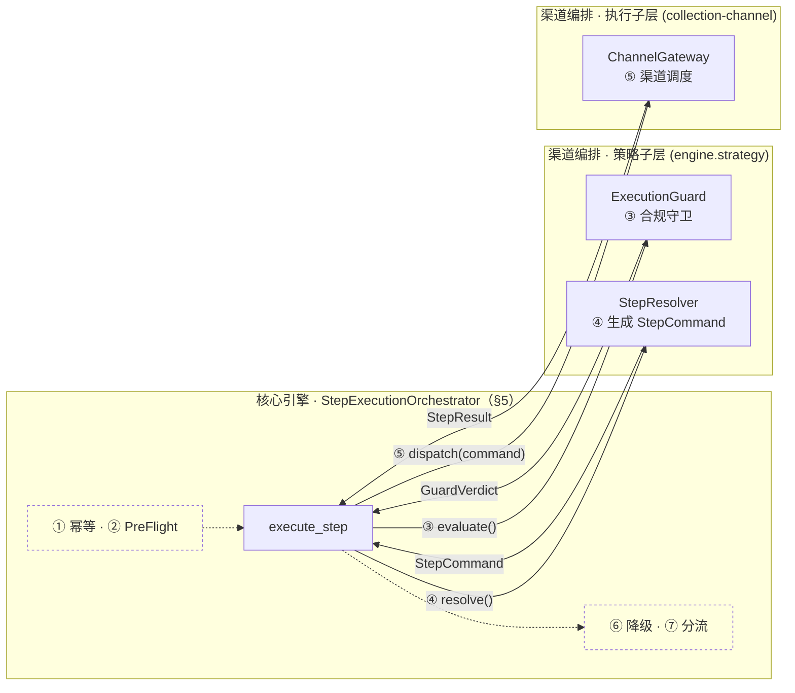
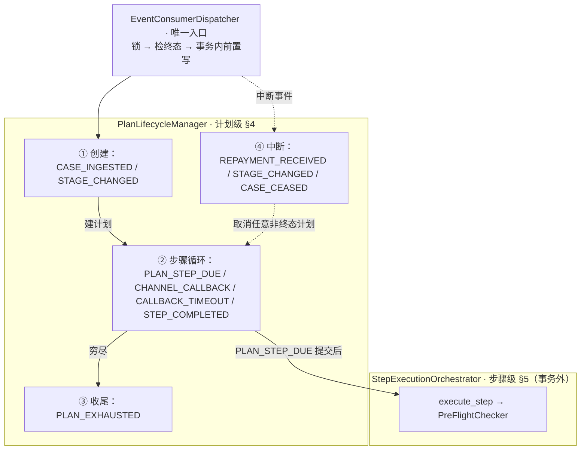
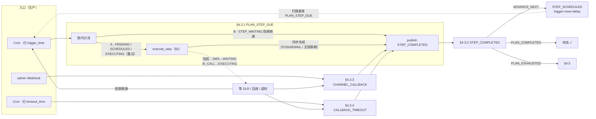
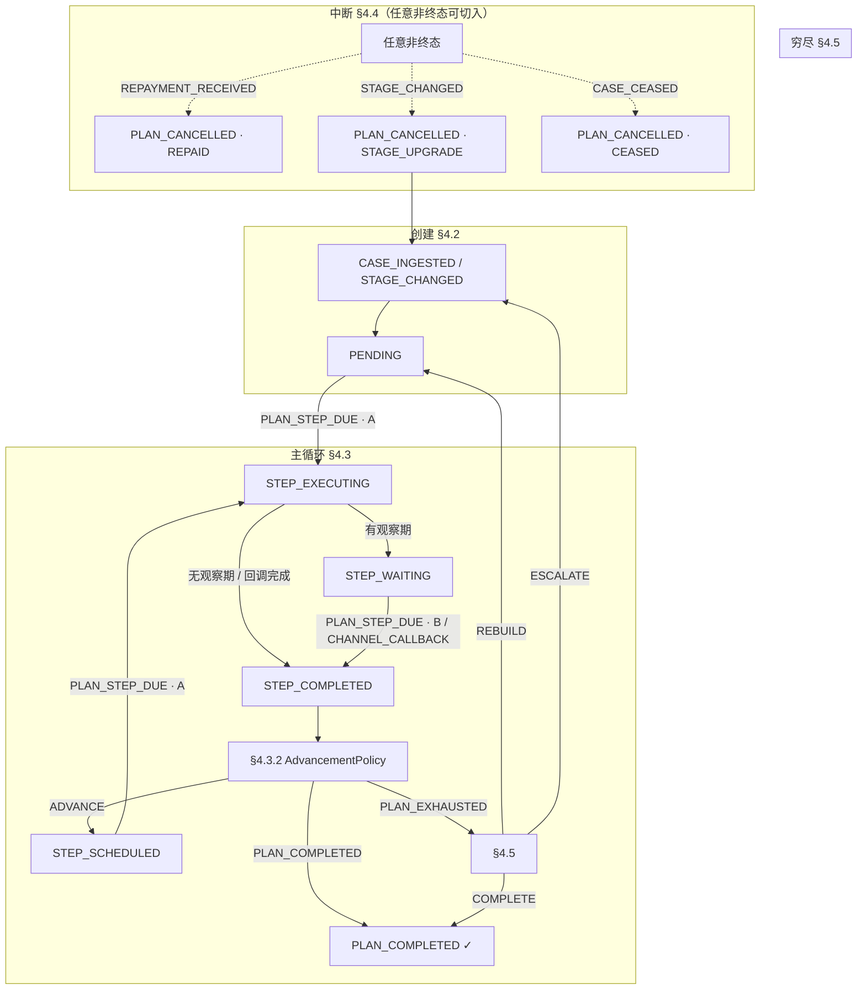
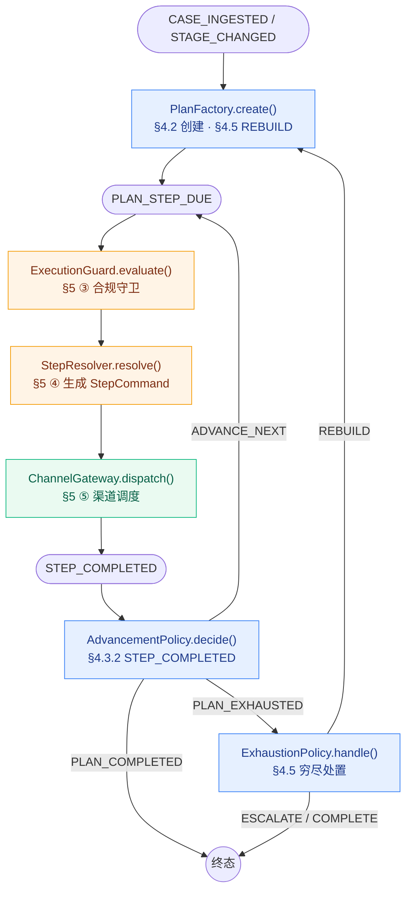

# MOCASA 催收系统升级 — Phase 1 核心引擎规格

> **版本**: Phase 1 · 仅覆盖菲律宾市场  
> **日期**: 2026-07-01  
> **关联文档**: [产品需求文档 (PRD)](./MOCASA催收系统升级_Phase1_产品需求文档_PRD.md)、[架构设计文档](./MOCASA催收系统升级_Phase1_架构设计文档.md)、[基础设施交互规范](./MOCASA催收系统升级_Phase1_基础设施交互规范.md)、[领域模型 §2.6 / §6](./MOCASA催收系统升级_Phase1_领域模型与数据定义.md#6-eventpayload-字段定义)、[渠道总规格 §3.3](./channel/MOCASA催收系统升级_Phase1_collection-channel总规格.md#33-channel_callback-事件-payload)

---

## 目录

- [1. 引擎结构与边界](#1-引擎结构与边界)
  - [1.1 核心组件与职责](#11-核心组件与职责)
  - [1.2 模块边界与调用全景](#12-模块边界与调用全景)
- [2. 事件路由](#2-事件路由)
  - [2.1 事件路由表（SSOT）](#21-事件路由表ssot)
  - [2.2 生命周期派生总览](#22-生命周期派生总览)
- [3. 运行时执行模型](#3-运行时执行模型)
  - [3.1 线程隔离（Trigger-to-Event）](#31-线程隔离trigger-to-event)
  - [3.2 并发与一致性模型](#32-并发与一致性模型)
- [4. 计划生命周期与状态机](#4-计划生命周期与状态机)
  - [4.1 状态定义](#41-状态定义)
  - [4.2 计划创建](#42-计划创建)
  - [4.3 步骤执行循环](#43-步骤执行循环)
  - [4.4 中断处理](#44-中断处理)
  - [4.5 穷尽续建](#45-穷尽续建)
  - [4.6 PTP 到期处理（Phase 2 预留）](#46-ptp-到期处理)
  - [4.7 状态转换](#47-状态转换)
- [5. 步骤执行管线](#5-步骤执行管线)
- [6. SPI 接口契约](#6-spi-接口契约)
  - [6.1 接口总览](#61-接口总览)
  - [6.2 共享 DTO 定义](#62-共享-dto-定义)
- [7. 容错与异常恢复](#7-容错与异常恢复)
  - [7.1 故障层级总览](#71-故障层级总览)
  - [7.2 步骤级降级](#72-步骤级降级)
  - [7.3 L1 基础设施异常](#73-l1-基础设施异常)
  - [7.4 跨存储一致性修复](#74-跨存储一致性修复)

---

## 1. 引擎结构与边界

本节交代引擎由哪些组件构成（§1.1）、与外部模块的边界与调用全景（§1.2），为后续事件路由（[§2](#2-事件路由)）、运行时执行模型（[§3](#3-运行时执行模型)）与计划生命周期（[§4](#4-计划生命周期与状态机)）提供结构地图。

### 1.1 核心组件与职责

`EventConsumerDispatcher` 是核心引擎的**唯一入口**——从 Redis Stream 消费事件，反序列化后按类型路由；其余三个核心类均为内部协作组件，不对外暴露调用。

| 类 | 职责边界 | 拥有的逻辑 |
|---|---|---|
| `EventConsumerDispatcher` | 事件消费 + 路由 + 并发保护 | 反序列化、行锁获取、终态拦截、委托 `PlanLifecycleManager` |
| `PlanLifecycleManager` | 计划级生命周期决策 | §4 全部伪代码（创建/中断/穷尽），事务内状态前置写入 |
| `StepExecutionOrchestrator` | 步骤级执行管线 | §5 全部伪代码（七步骨架），在非事务上下文中运行 |
| `PreFlightChecker` | 系统级实时守卫 | 实时查 DB 确认案件存活；由 Orchestrator 调用，**不直接消费事件** |

**调用链路**：`Dispatcher` → `Manager`（事务内）→ COMMIT → `Orchestrator`（事务外）；`PreFlightChecker` 嵌在 Orchestrator 的 `execute_step` 第②步。

### 1.2 模块边界与调用全景

核心引擎与渠道编排层的模块边界：`StepExecutionOrchestrator`（非 `EventConsumerDispatcher`）经 SPI / `ChannelGateway` 串联策略子层与执行子层（接口契约见 [§6](#6-spi-接口契约)）。下图突出 [§5](#5-步骤执行管线) 跨模块步骤 ③④⑤——`StepCommand` 由策略子层 `StepResolver` 产出、引擎持有后再传入执行子层（签名见 [§6.1](#61-接口总览)，DTO 见 [§6.2](#62-共享-dto-定义)）；引擎内 ①②⑥⑦ 仅作轻量标注：



> **读图**：**实线**＝跨模块 ③④⑤；**虚线灰标**＝引擎内 ①②⑥⑦（不穿边界）。细节见 [§5](#5-步骤执行管线)。

---

## 2. 事件路由

本节是事件的**声明性目录**：[§2.1](#21-事件路由表ssot) 路由表是 Dispatcher 消费的全部外部事件的唯一权威清单（SSOT），[§2.2](#22-生命周期派生总览) 给出由路由表派生的生命周期全景视图。事件如何被多线程承载与并发约束见 [§3](#3-运行时执行模型)。

### 2.1 事件路由表（SSOT）

下表是 Dispatcher 消费并路由的**事件唯一权威清单**（Phase 1 共 9 行）：处理动作与详见均以本表为准；「生命周期域」列与 [§2.2](#22-生命周期派生总览) 四块对齐（①创建 / ②步骤循环 / ③收尾 / ④中断）。

| 事件 | 生命周期域 | 引擎侧处理动作 | 详见 |
|---|---|---|---|
| `CASE_INGESTED` | ① 创建 | 匹配模板 → 创建计划（PENDING）→ 注册首步 Job | [§4.2](#42-计划创建) |
| `STAGE_CHANGED` | ① 创建 + ④ 中断 | 取消旧阶段活跃计划 → 为新阶段创建计划 | [§4.2](#42-计划创建)、[§4.4](#44-中断处理) |
| `REPAYMENT_RECEIVED` | ④ 中断 | 取消该用户所有活跃计划 + 清理已注册 Job | [§4.4](#44-中断处理) |
| `PLAN_STEP_DUE` | ② 步骤循环 | 按状态分流：到期执行 / 观察期结转 → 触达 | [§4.3](#43-步骤执行循环)、[§5](#5-步骤执行管线) |
| `CHANNEL_CALLBACK` | ② 步骤循环 | 更新步骤结果 → 发布 `STEP_COMPLETED` | [§4.3.3](#433-channel_callback) |
| `CALLBACK_TIMEOUT` | ② 步骤循环 | 回调超时 → 标 `FAILED` → 发布 `STEP_COMPLETED` | [§4.3.4](#434-callback_timeout) |
| `STEP_COMPLETED` | ② 步骤循环 | 推进决策：注册下一步 / 计划完成 / 发布穷尽 | [§4.3.2](#432-step_completed) |
| `PLAN_EXHAUSTED` | ③ 收尾 | 穷尽策略：续建新计划 / 升档 / 标记完成 | [§4.5](#45-穷尽续建) |
| `CASE_CEASED` | ④ 中断 | D+91 完全停催：取消该案件活跃计划，**不再续建**（停催终态） | [§4.4](#44-中断处理) |

所有事件经 Dispatcher 消费后遵循**统一的并发前置流程**（行锁 → 终态拦截 → 事务边界），该契约见 [§3.2](#32-并发与一致性模型)，本节不重复。事件的产生来源（外部上游 / 引擎链式 / 定时 Job）见 [领域模型 §6.2](./MOCASA催收系统升级_Phase1_领域模型与数据定义.md#62-逐事件-payload-字段)（发布者列）；链式发布的触发条件以 [§4.3](#43-步骤执行循环) / [§4.5](#45-穷尽续建) / [§5](#5-步骤执行管线) 伪代码为 SSOT。

### 2.2 生命周期派生总览

下图把路由表 9 行按其**生命周期域**压缩为四类协作关系，并用边表达正常推进顺序与横切关系，仅作全景导览（引擎侧视角，不涉及上游产生方式）；事件归属与处理动作以路由表为准，此处不展开单个事件语义。



> 读图：**实线**＝正常生命周期推进（入口 → ①创建 → ②循环 → ③收尾）与进入步骤管线；**虚线**＝横切中断（④可作用于任意非终态计划）。完整状态流转与竞态见 [§4.7](#47-状态转换)，本图不重复。

---

## 3. 运行时执行模型

本节定义事件的**操作性执行模型**：[§3.1](#31-线程隔离trigger-to-event) 调度线程与 Consumer 线程如何隔离，[§3.2](#32-并发与一致性模型) 并行消费下如何保证一致性。两者构成同一因果链——Consumer 线程池的并行正是并发控制的前提。

### 3.1 线程隔离（Trigger-to-Event）

[§2.1](#21-事件路由表ssot) 路由表中的 `PLAN_STEP_DUE` 由调度线程**生产**，由 Consumer 线程池**消费**；其余业务事件仅由 Consumer 消费。两线程池严格隔离，杜绝调度与 I/O 密集操作耦合：

```
Cron 扫表 ──XADD──→ Redis Stream ──XREADGROUP──→ Consumer 执行业务
```

| 维度 | **Cron 调度线程** | **Consumer 业务线程** |
|---|---|---|
| 线程池 | XXL-Job Handler | Redis Stream 消费线程池 |
| 职责 | 扫表发现到期步骤 → `XADD` 发事件 | `XREADGROUP` 消费 → 引擎全链路 |
| 耗时约束 | 毫秒级返回；**禁止**渠道 I/O 等阻塞 | 允许阻塞；供应商变慢仅占用本池 |

**事件分工**（横切维度，与上表正交）：

| 事件 | Cron | Consumer |
|---|---|---|
| `PLAN_STEP_DUE` | **生产**（扫 `trigger_time`） | **消费**（分流 → `execute_step`） |
| `CALLBACK_TIMEOUT` | **生产**（扫 `timeout_time`） | **消费**（标 FAILED → `STEP_COMPLETED`） |
| 其余 7 种（`CASE_INGESTED` 等） | 不参与 | 消费 + 执行 |

> 两池不共享线程（详见 [基础设施 §1](./MOCASA催收系统升级_Phase1_基础设施交互规范.md#1-消费线程模型)）。Consumer 并行消费正是 [§3.2](#32-并发与一致性模型) 的前提。

### 3.2 并发与一致性模型

Consumer 并行消费时，同一计划可能同时收到「步骤到期触达」与「还款取消」等事件。典型事故是**还款已取消计划却仍发出触达**。下表归纳四类风险；**本节详述 ① 及其代价、②**；③ 见 [§4.4](#44-中断处理)，④ 见 [§5](#5-步骤执行管线) ②⑤½。

#### 四类一致性风险（总览）

| # | 风险 | 应对 | 详述 |
|---|---|---|---|
| ① | **并发写坏** | 行锁串行 + 锁内禁 I/O | **本节 ↓** |
| ② | **重复执行** | `XACK` / DLQ + 步骤幂等键 | **本节 ↓**；步骤级见 [§5](#5-步骤执行管线) ① |
| ③ | **乱序覆盖** | 终态先写先赢 | [§4.4](#44-中断处理) |
| ④ | **迟到真相** | I/O 前后复检 | [§5](#5-步骤执行管线) ②⑤½ |

> **③ 要点**：`REPAID > CEASED > STAGE_UPGRADE > 非终态` 为语义/审计参考，非运行时覆盖规则。投诉/争议冻结为 Phase 2 能力，不属于本阶段状态机。

#### ① 防并发写坏：串行锁 + 锁内轻量

**串行锁**：同一 `plan_id` 的并发事件在 `SELECT FOR UPDATE` 处排队，一次只让一个 Consumer 改计划。
**锁内轻量**：持锁期间只做状态校验 + 前置写（如 → `STEP_EXECUTING` / `PLAN_CANCELLED`），COMMIT 后立即释放；渠道 I/O、远程调用等慢操作一律放到锁外。

所有事件经 Dispatcher 消费后，第一步即进入上述短事务——同一计划的并发事件被串行化，锁窗口保持毫秒级，不会因渠道超时导致锁堆积。

**① 的代价（有界越界）**：锁外 I/O 期间计划可能被取消，**已发出的触达无法撤回**（秒级窗口）。Phase 1 接受此取舍：计划仍取消、后续不再执行；写入补偿 timeline / 告警。④ 多级复检（[§5](#5-步骤执行管线) ②⑤½）可减轻误推进，但不能消除已发出触达。

#### ② 防重复执行：消费层幂等

Redis Stream 的消费语义保证：

| 场景 | 行为 | 典型原因 |
|---|---|---|
| 处理成功 | `XACK`，消息不再投递 | — |
| 处理失败（**可重试**） | 不 ACK → pending list → 自动重投递 | DB 短暂不可用、锁等待超时、计划级 SPI 超时、进程崩溃于 ACK 前 |
| 处理失败（**不可重试**） | 跳过 ACK → 直接 DLQ + 告警 | payload 反序列化失败（畸形消息，重投必败） |
| 可重试但达投递上限 | DLQ + 告警（毒消息） | 代码缺陷或数据异常导致持续失败（默认上限 5 次，见 [§7.3](#73-l1-基础设施异常)） |
| 重复投递到达 | 步骤 `idempotency_key` SETNX 吸收；终态计划直接退出 | Stream 重投或并发重复消费 |

消费 ACK 语义属于路由/线程层；`idempotency_key` 的具体实现见 [§5](#5-步骤执行管线) ①，DLQ 配置见 [基础设施交互规范](./MOCASA催收系统升级_Phase1_基础设施交互规范.md)。

#### 时序例证（①②④ 交织）

`PLAN_STEP_DUE`（执行）与 `REPAYMENT_RECEIVED`（中断）争锁的典型场景：A 先获锁并进入锁外 I/O，B 在 I/O 窗口内取消计划，A 返回后 ④ 复检丢弃结果；触达可能已发出（有界越界）。若 B 先获锁，A 见终态静默退出（② 终态吸收）。

```
Consumer-A (PLAN_STEP_DUE)           Consumer-B (REPAYMENT_RECEIVED)
    │                                      │
    │── SELECT FOR UPDATE plan ──→         │── SELECT FOR UPDATE plan (阻塞)
    │   → status = STEP_EXECUTING          │
    │── COMMIT ──→                          │── 获取锁 → PLAN_CANCELLED → COMMIT
    │   渠道 I/O 进行中...                  │
    │   返回后重读发现 PLAN_CANCELLED        │
    │   → 静默丢弃，写补偿日志               │
```

更多竞态分支（中断乱序、重复投递、升档 vs 还款等）见 [§4.4](#44-中断处理) / [§5](#5-步骤执行管线)；完整覆盖由集成测试保证。

---

## 4. 计划生命周期与状态机

本节先定义状态词汇表，再按时间顺序展示计划从创建到终态的完整一生，最后以状态转换总表和转换图作为形式化总结。

> **§4 与 §5 的关系**：§4 是计划级的纵向视角（一个计划经历了什么），§5 是步骤级的横向视角（一次步骤执行内部怎么协作）。§4.3 中"执行步骤"的内部展开见 §5。

### 4.1 状态定义

计划级状态机共 **6 态**（4 非终态 + 2 终态），已覆盖引擎管辖的完整生命周期；步骤级状态（`SCHEDULED` / `EXECUTING` / `COMPLETED` 等）见 [领域模型](./MOCASA催收系统升级_Phase1_领域模型与数据定义.md)，不在此表重复。

| 状态 | 类型 | 语义 |
|---|---|---|
| `PENDING` | 非终态 | 计划刚创建，尚未执行任何步骤，等待首步 `trigger_time` |
| `STEP_SCHEDULED` | 非终态 | 上一步已结束，下一步 Job 已注册，等待到期 |
| `STEP_EXECUTING` | 非终态 | 当前步骤执行中（渠道发送 / 等待异步回调） |
| `STEP_WAITING` | 非终态 | 消息类渠道已发出，观察期内等待用户响应 |
| **`PLAN_COMPLETED`** | **终态** | 正常结束（还款确认或步骤全部走完） |
| **`PLAN_CANCELLED`** | **终态** | 被中断取消；`cancel_reason` 枚举见 [领域模型 §2.7](./MOCASA催收系统升级_Phase1_领域模型与数据定义.md#27-cancelreason计划取消原因) |

> **带外取消（Phase 2）**：`COMPLAINT` / `MANUAL` 不经事件总线、由管理后台写 `PLAN_CANCELLED` 终态；枚举见 [领域模型 §2.7](./MOCASA催收系统升级_Phase1_领域模型与数据定义.md#27-cancelreason计划取消原因)（Phase 2 预留）。Phase 1 引擎仅写入 `REPAID` / `STAGE_UPGRADE` / `CEASED`；投诉/争议冻结及其后台操作同属 Phase 2。
>
> **不含 `PLAN_PAUSED`**：人工外呼等待坐席等暂停态归渠道编排层，非引擎状态机。

### 4.2 计划创建

**入/出态**：入态 — / 出态 `PENDING`；`STEP_SCHEDULED` 的进入见 [§4.3](#43-步骤执行循环)。
**触发事件**：`CASE_INGESTED` / `STAGE_CHANGED`（链 [§2.1](#21-事件路由表ssot)）。
**关联 SPI**：`PlanFactory`（链 [§6.1](#61-接口总览)）。

数据接入流程见 ingestion 规格；引擎消费 `CASE_INGESTED` 后执行如下伪代码：

```python
def on_case_ingested(event):
    # 快照由 payload 组装，不读旧库（决策 B，见领域 §4.4）
    case_info = build_case_info_from_payload(event)
    snapshot  = build_snapshot_from_payload(event)

    plan = PlanFactory.create(case_info, event.stage, snapshot)   # → SPI §6.1
    if plan is None:
        return                        # 该案件不需要创建计划

    with transaction():               # 计划+步骤+首步 trigger_time 原子落盘
        save(plan)                    # 持久化计划 + 步骤序列
        first_step = plan.steps[0]
        first_step.trigger_time = calculate_trigger_time(first_step)
    plan.status = PENDING
```

**幂等约束**：同一 `case_id + stage` 不得重复建计划，且任一时刻仅一个非终态计划（升档 [§4.4](#44-中断处理) / 续建 [§4.5](#45-穷尽续建) 时先终态旧计划）。`find_active_plan(case_id)` 因此唯一；`find_active_plans(user_id)` 多条仅当用户多笔贷款。

### 4.3 步骤执行循环

**入/出态**：场景 A 入态 `PENDING` / `STEP_SCHEDULED`（及退避重试时的 `STEP_EXECUTING`）→ 触达前出态 `STEP_EXECUTING`；消息类有观察期 → `STEP_WAITING`；推进下一步后 → `STEP_SCHEDULED`（**`STEP_SCHEDULED` 的唯一正常入口，见 [§4.3.2](#432-step_completed)**）；回调/超时/观察期结转后经 `STEP_COMPLETED` 再分流。
**触发事件**：`PLAN_STEP_DUE` / `CHANNEL_CALLBACK` / `STEP_COMPLETED`（及 Cron 产生的 `CALLBACK_TIMEOUT` 哨兵；事件名均非计划状态，链 [§2.1](#21-事件路由表ssot)）。
**关联 SPI**：`ExecutionGuard` / `StepResolver` / `ChannelGateway` / `AdvancementPolicy`（链 [§6.1](#61-接口总览)）。

| 小节 | 触发事件 | 职责 |
|---|---|---|
| [§4.3.1](#431-plan_step_due) | `PLAN_STEP_DUE` | 锁内按计划态分流（场景 A/B） |
| [§4.3.2](#432-step_completed) | `STEP_COMPLETED` | 推进下一步 / 计划完成 / 发布穷尽 |
| [§4.3.3](#433-channel_callback) | `CHANNEL_CALLBACK` | 供应商 Webhook → 写结果 → 发 `STEP_COMPLETED` |
| [§4.3.4](#434-callback_timeout) | `CALLBACK_TIMEOUT` | 回调超时 → 标 `FAILED` → 发 `STEP_COMPLETED` |

下方流程图按「入口 → 汇聚 → 推进」分层：四条入口汇入 `publish(STEP_COMPLETED)` 后再进 §4.3.2。线程隔离见 [§3.1](#31-线程隔离trigger-to-event)，锁外触达见 [§5](#5-步骤执行管线)。



> **读图**：实线＝直接汇入完成事件；虚线＝触达后挂起，再经回调 / 超时 / 观察期满（场景 B）汇入。A/B 仅属于 `PLAN_STEP_DUE` 分流，详见 [§4.3.1](#431-plan_step_due)。

#### 4.3.1 PLAN_STEP_DUE

锁内按计划态分流（场景 A/B）：**A 到期执行**（`PENDING` / `STEP_SCHEDULED` / 退避重试时的 `STEP_EXECUTING` → 置或保持 `STEP_EXECUTING`，COMMIT 后锁外 `execute_step`）/ **B 观察期结转**（`STEP_WAITING` → 标记步骤完成；事务提交后由 Dispatcher 投递 `STEP_COMPLETED`，不触达）。

```python
def on_plan_step_due(event):
    # ── 事务 1（毫秒级：锁 → 校验 → 状态前置 → 释放） ──
    events = []
    with transaction():
        plan = get_plan_with_lock(event.plan_id)  # SELECT FOR UPDATE
        if plan is None or plan.status in (PLAN_COMPLETED, PLAN_CANCELLED):
            return                                 # 终态拦截

        step = plan.get_current_step()

        if plan.status in (PENDING, STEP_SCHEDULED, STEP_EXECUTING):
            plan.status = STEP_EXECUTING           # 含退避重试再触发；COMMIT 后释放行锁
        elif plan.status == STEP_WAITING:
            step.status = COMPLETED
            if step.result is None:
                step.result = SENT_NO_RESPONSE
            events.append(STEP_COMPLETED)          # 不在事务内 XADD；提交后投递
            return events
    # ── 事务已提交，行锁已释放 ──

    # ── 非事务上下文：渠道 I/O（允许耗时数百毫秒~数秒） ──
    execute_step(plan, step)                       # 展开见 §5
```

#### 4.3.2 STEP_COMPLETED

```python
def on_step_completed(plan, completed_step):
    decision = AdvancementPolicy.decide(context, step_result)   # → SPI §6.1

    if decision == ADVANCE_NEXT:
        next_step = get_next_step(plan, completed_step)
        # 任意 delay（含 0）：统一 STEP_SCHEDULED + trigger=now+max(0,delay)；
        # delay=0 表示即刻到期，由 Cron 扫描器发 PLAN_STEP_DUE 驱动（非同步递归 execute_step）
        register_job(PLAN_STEP_DUE, delay_minutes=max(0, next_step.delay_minutes))
        plan.status = STEP_SCHEDULED

    elif decision == PLAN_COMPLETED:
        plan.status = PLAN_COMPLETED               # 终态

    elif decision == PLAN_EXHAUSTED:
        publish(PLAN_EXHAUSTED)                    # → §4.5
```

#### 4.3.3 CHANNEL_CALLBACK

Webhook / DLR 经 `collection-admin` 鉴权后发布为本事件。**AI_CALL**：`STEP_EXECUTING` 等 disposition；**SMS**：`STEP_WAITING` 等 DLR，收到即短路结转，期满未收到则走 [§4.3.1](#431-plan_step_due) 场景 B（观察期机制见 [§5](#5-步骤执行管线) ⑦、[执行契约 §3](./contracts/MOCASA催收系统升级_Phase1_引擎渠道执行契约对齐_待编排确认.md)）。

> **Timeline 落库**：回调结果 timeline 由 `collection-admin` Webhook 入站时落库；引擎**仅**更新 step 状态并发布 `STEP_COMPLETED`（与 [§7.3](#73-l1-基础设施异常) 一致）。

```python
def on_channel_callback(event):
    events = []
    with transaction():
        plan = get_plan_with_lock(event.plan_id)       # SELECT FOR UPDATE 串行化重复回调
        if plan.status not in (STEP_EXECUTING, STEP_WAITING):
            return events                              # 非执行/等待态（已处理或已取消），静默吸收

        step = plan.get_current_step()
        step.result = map_callback_to_result(event)    # 电话 disposition / SMS DLR
        step.status = COMPLETED                        # WAITING 收到 DLR → 短路结转，不等满观察期
        events.append(STEP_COMPLETED)
    return events                                      # 事务提交后由 Dispatcher 投递
```

#### 4.3.4 CALLBACK_TIMEOUT

AI_CALL 停在 `STEP_EXECUTING` 等 Webhook 时，若回调不到达会卡死。Phase 1 **仅靠引擎超时哨兵**：进入异步执行时注册超时 Job（[§5 ⑦](#5-步骤执行管线)）；Cron 扫到 `timeout_time` 仍无回调 → 标 `FAILED` → 发布 `STEP_COMPLETED`。

> **Phase 2**：渠道对账扫描（查供应商、补 timeline / 补发事件）作运维兜底，Phase 1 不实现。

> **Timeline**：超时记录由 admin 路径落库；引擎只改 step 状态并发布 `STEP_COMPLETED`。

```python
def on_callback_timeout(event):
    events = []
    with transaction():
        plan = get_plan_with_lock(event.plan_id)
        if plan.status != STEP_EXECUTING:
            return events                          # 回调已正常处理，忽略

        step = plan.get_current_step()
        step.result = FAILED
        step.status = FAILED
        events.append(STEP_COMPLETED)
    return events                                  # 提交后投递；由 AdvancementPolicy 决定下一步
```

**默认 60 分钟**（`engine.step.callback_timeout_minutes`，见 [基础设施附录](./MOCASA催收系统升级_Phase1_基础设施交互规范.md#附录运行配置与环境)）。等待不占 Consumer——Cron 扫表触发本事件；防重复拾取靠计划/步骤状态。

### 4.4 中断处理

**入/出态**：入态 任意非终态 / 出态 `PLAN_CANCELLED`（`REPAID` / `STAGE_UPGRADE` / `CEASED`）。
**触发事件**：`REPAYMENT_RECEIVED` / `STAGE_CHANGED` / `CASE_CEASED`（链 [§2.1](#21-事件路由表ssot)）。`COMPLAINT` / `MANUAL` 带外取消为 **Phase 2**，见 [§4.1](#41-状态定义)。
**关联 SPI**：—（纯引擎状态机；还款路径另调 `PredictiveDialerService`，见 [§7.3](#73-l1-基础设施异常)）。

`CASE_CEASED` 边界见 [数据接入 §4.4](./MOCASA催收系统升级_Phase1_数据接入规格.md#44-产出事件)；DPD≥91 拒建见 §4.2。并发：`plan_id` 升序加锁 + 终态单调（[§3.2](#32-并发与一致性模型)）。中断流程见下方伪代码 + [§4.7 状态图](#47-状态转换)。

```python
def on_repayment_received(user_id):
    plans = find_active_plans(user_id)             # status NOT IN 终态
    for plan in sorted(plans, key=lambda p: p.id): # 按 plan_id 升序加锁，防止死锁
        lock(plan)                                 # SELECT FOR UPDATE
        if plan.status in (PLAN_COMPLETED, PLAN_CANCELLED):
            continue                               # 终态不可逆：取锁后复检（§3.2），不覆盖
        plan.status = PLAN_CANCELLED
        plan.cancel_reason = REPAID
        cancel_scheduled_jobs(plan)
    PredictiveDialerService.filter_repaid_user(user_id)  # 失败 → 告警 + 继续（§7.3）

def on_stage_changed(case_id, new_stage):
    old_plans = find_active_plans_by_case(case_id)
    for plan in sorted(old_plans, key=lambda p: p.id):
        if plan.stage != new_stage:
            lock(plan)
            if plan.status in (PLAN_COMPLETED, PLAN_CANCELLED):
                continue                           # 终态不可逆：取锁后复检（§3.2），不覆盖
            plan.status = PLAN_CANCELLED
            plan.cancel_reason = STAGE_UPGRADE
            cancel_scheduled_jobs(plan)
    create_plan_for_stage(case_id, new_stage)       # 复用 §4.2 创建流程

def on_case_ceased(case_id):                        # D+91 完全停催：取消活跃计划，不续建
    old_plans = find_active_plans_by_case(case_id)
    for plan in sorted(old_plans, key=lambda p: p.id):  # 按 plan_id 升序加锁，防止死锁
        lock(plan)                                  # SELECT FOR UPDATE
        if plan.status in (PLAN_COMPLETED, PLAN_CANCELLED):
            continue                                # 终态不可逆：取锁后复检（§3.2），不覆盖
        plan.status = PLAN_CANCELLED
        plan.cancel_reason = CEASED
        cancel_scheduled_jobs(plan)
    # 不调用 create_plan_for_stage —— 停催后主动催收终止（区别于 STAGE_CHANGED 的取消+重建）
```

### 4.5 穷尽续建

**入/出态**：入态 `STEP_SCHEDULED` / `STEP_EXECUTING` → 出态 `PLAN_COMPLETED`（或新计划 `PENDING`）。
**触发事件**：`PLAN_EXHAUSTED`（所有步骤执行完毕但用户未还款；链 [§2.1](#21-事件路由表ssot)）。
**关联 SPI**：`ExhaustionPolicy` / `PlanFactory`（链 [§6.1](#61-接口总览)）。

穷尽**不等于结束**。当一个计划的所有步骤都已执行完毕但用户仍未还款时，`ExhaustionPolicy`（渠道编排 SPI）返回三值之一，引擎按 [§4.5 伪代码](#45-穷尽续建) 落地：

| 返回值 | 场景 | 引擎动作 | Phase 1 策略实现 |
|---|---|---|---|
| `REBUILD` | **同阶段续建**：本轮步骤已跑完仍未还款，同 Stage 内再建一轮计划（换模板/策略） | `PlanFactory.create()` 同阶段新建 + 注册首步 Job | ✅ `DefaultExhaustionPolicy`：续建次数 < `max_rebuild_count`（默认 2） |
| `ESCALATE` | **策略升档**：同 Stage 续建次数已用尽，提升催收强度 | 发布 `STAGE_CHANGED` → §4.4 取消旧计划 + §4.2 建新阶段计划 | ✅ 续建超限且 Stage 可升（S1→S2→…→S4） |
| `COMPLETE` | **停止主动触达**：续建与升档均无可行路径 | 标记 `PLAN_COMPLETED` | ✅ 已达 S4 或无法升档；Mock 恒返回 COMPLETE |

> **与 DPD 日切的区别**：DPD 导致阶段变更走 ingestion 的 `STAGE_CHANGED`，**不是** `PLAN_EXHAUSTED` → REBUILD。`REBUILD` 仅用于同 Stage 内模板轮换（[渠道编排规格](./channel/MOCASA催收系统升级_Phase1_渠道编排规格.md)）。
>
> `REBUILD` 有续建次数上限（`engine.plan.max_rebuild_count`），达到上限后策略层应返回 `ESCALATE` 或 `COMPLETE`。

```python
def on_plan_exhausted(event):
    plan = get_plan_with_lock(event.plan_id)
    if plan.status in (PLAN_COMPLETED, PLAN_CANCELLED):
        return

    # 决策 B：续建复用旧计划已冻结的快照（同案件、同数据），不回读旧库；
    # 续建/升档非外部 case_push 触发，无新 payload → carry-forward 即可。
    snapshot = deserialize(plan.context_snapshot)
    case_info = case_info_from_snapshot(snapshot)

    result = ExhaustionPolicy.handle(plan, case_info, snapshot)   # → SPI §6.1

    if result.action == REBUILD:
        new_plan = PlanFactory.create(case_info, plan.stage, snapshot)  # 幂等：同 case+stage 不重复
        with transaction():                        # 原子：后继持久化 + 旧计划终态写在同一事务
            save(new_plan)
            new_plan.steps[0].trigger_time = calculate_trigger_time(new_plan.steps[0])  # 注册首步
            plan.status = PLAN_COMPLETED           # 终态写最后；事务内崩溃整体回滚 → 重投重跑
    elif result.action == ESCALATE:
        publish(STAGE_CHANGED, new_stage=result.target_stage)  # 后继触发先发布（消费时复用 §4.2 建新阶段计划）
        plan.status = PLAN_COMPLETED               # 终态写最后；两步间崩溃 → 旧计划仍非终态 → 重投重跑
    elif result.action == COMPLETE:
        plan.status = PLAN_COMPLETED               # 终态，不再主动触达
```

> **崩溃安全**：`REBUILD`/`ESCALATE` 须**先落后继**（新建计划 / 发 `STAGE_CHANGED`），**再**标旧计划 `PLAN_COMPLETED`。中途崩溃 → 旧计划仍非终态 → `PLAN_EXHAUSTED` 重投 → `on_plan_exhausted` 重跑（SPI 可重复调用、下游幂等）。不可用 [§7.4](#74-跨存储一致性修复) 扫描补救——正常 `COMPLETE` 与续建/升档「半成品」在库中不可区分。

### 4.6 PTP 到期处理

**Phase 2 预留**：Phase 1 不做 PTP，不生产/不消费 `PTP_EXPIRED`（枚举仅前向兼容，见 [领域模型 §2.7](./MOCASA催收系统升级_Phase1_领域模型与数据定义.md#27-cancelreason计划取消原因)）。实时还款仍走 [§5 ②](#5-步骤执行管线) / [§4.4](#44-中断处理)。

### 4.7 状态转换

本节为计划状态机**唯一完整 SSOT**；穷尽续建细节见 [§4.5](#45-穷尽续建)。



> 读图：**实线**＝主循环与创建；**虚线**＝中断横切。`STEP_EXECUTING` 异步完成经 `CHANNEL_CALLBACK` / `CALLBACK_TIMEOUT` → `STEP_COMPLETED`（见 [§4.3](#43-步骤执行循环)），未单独画边以避免杂乱。

---

## 5. 步骤执行管线

本节定义 `StepExecutionOrchestrator` 的单步执行管线，与 [架构 §1.3.2](./MOCASA催收系统升级_Phase1_架构设计文档.md#132-步骤执行骨架) 七步骨架一致。计划级状态流转见 [§4.3](#43-步骤执行循环)；SPI 契约见 [§6](#6-spi-接口契约)；渠道失败降级见 [§7.2](#72-步骤级降级)。

`StepExecutionOrchestrator` 的固定七步管线：幂等 → 系统守卫 → 合规 → 解析 → 渠道 → 降级 → 分流。所有步骤走同一条管线；差异在 SPI/渠道实现返回值，不在骨架分支。

### execute_step 执行骨架（①–⑦ + ⑤½）

**入口**：由 [§4.3.1](#431-plan_step_due) 在事务外调用（行锁已释放，plan 已置 `STEP_EXECUTING`）。
**出口**：`STEP_WAITING`（消息类有观察期）/ `STEP_EXECUTING`（异步等回调）/ `publish(STEP_COMPLETED)` 推进。
**关联 SPI**：`ExecutionGuard` ③ / `StepResolver` ④ / `ChannelGateway` ⑤（职责、异常语义与演进策略以 [§6.1](#61-接口总览) 为 SSOT）。

```
executeStep(plan, step):

  ── 引擎内部 ──────────────────────────────────────────────────────
  ① 幂等锁获取    基于 idempotency_key 的分布式 SETNX；重复事件静默退出
  ② 系统级守卫    PreFlightChecker 实时查 DB 确认案件存在且未还款；
                  不可触达 → 静默退出；读取失败 → NACK 重投

  ── 通过接口契约调用渠道编排层 ─────────────────────────────────────
  ③ 业务级守卫    ExecutionGuard.evaluate() → 合规校验（每日渠道频率 / 时段 / 地址可用性）
                  静默时段 → 重排至下一允许时段；其他拦截 → SKIPPED + 推进
  ④ 步骤解析      StepResolver.resolve() → 基于 context_snapshot 生成 StepCommand（零 DB I/O）
                  异常/超时 → FAILED（§6.1）
  ⑤ 渠道调度      ChannelGateway.dispatch(command) → StepResult
                  渠道层内部同槽 fallback 对引擎透明；跨供应商切换 Phase 2

  ── 引擎内部 ──────────────────────────────────────────────────────
  ⑤½ 取消检测    reload plan 状态；已取消 → 记录但不推进
  ⑥ 故障降级      retryable → 非阻塞退避重试；不可重试 → FAILED → 推进（详见 §7.2）
  ⑦ 渠道分流      消息类：有观察期→STEP_WAITING / 无→推进
                  电话/人工类：保持 STEP_EXECUTING，等异步回调 + 注册超时哨兵（§4.3.4）
```

③④ 为 SPI、⑤ 为 `ChannelGateway`（详见 [§6.1](#61-接口总览)）。**以⑤为界重拾**：之前 Cron 重扫；之后靠 [§4.3.4](#434-callback_timeout) / [§7.4](#74-跨存储一致性修复)（故障分级见 [§7.3](#73-l1-基础设施异常)）。

```python
def execute_step(plan, step):
    # ── ① 幂等锁 ──
    if not IdempotencyService.acquire(step.idempotency_key, ttl_minutes=15):
        return

    # ── ② 系统级守卫（实时查 DB；案件存在 / 还款） ──
    if not PreFlightChecker.check(plan.case_id):
        return                                    # 静默退出

    # ── ③ 业务级守卫（Phase 1 内存计数器：每日渠道频率 / 时段 / 地址可用性） ──
    verdict = ExecutionGuard.evaluate(context)     # → SPI §6.1
    if not verdict.allowed:
        if verdict.defer_until:
            step.trigger_time = verdict.defer_until
            step.status = PENDING
            plan.status = STEP_SCHEDULED
            return
        step.status = SKIPPED
        write_timeline(COMPLIANCE_BLOCKED, violation=verdict.blocked_reason)
        publish(STEP_COMPLETED)
        return

    # ── ④ 步骤解析（零 DB I/O，读 context_snapshot） ──
    command = StepResolver.resolve(context)        # → SPI §6.1

    # ── ⑤ 渠道调度（渠道层内部熔断/fallback 对引擎透明） ──
    step.status = STEP_EXECUTING                    # 标记执行中：移出 planStepDueHandler「待触发」扫描，
                                                    # 防渠道 I/O / 异步等待期被 Cron 重拾二次发送（异步期由 timeout_time 守护，非 trigger_time）
    # dispatch 抛运行时异常 → 一律视为 retryable，走 §7.2 退避重试
    result = ChannelGateway.dispatch(command)

    # ── ⑤½ 回写前取消检测（应对渠道 I/O 期间计划被取消的场景） ──
    if reload_plan_status(plan.id) in (PLAN_COMPLETED, PLAN_CANCELLED):
        write_timeline(result, note="plan_cancelled_during_dispatch")
        return                                    # 记录已发出的触达，但不推进状态机

    # ── ⑥ 故障降级 ──
    if not result.success:
        if result.retryable and step.retry_count < MAX_RETRY:
            step.retry_count += 1
            delay = min(RETRY_BASE * (RETRY_FACTOR ** step.retry_count), RETRY_MAX)
            register_job(PLAN_STEP_DUE, delay_seconds=delay)  # 非阻塞：注册短延迟 Job
            return                                             # plan 保持 STEP_EXECUTING
        step.status = FAILED
        write_timeline(CHANNEL_ERROR, error_code=result.error_code)
        publish(STEP_COMPLETED)                   # 失败也推进，不卡死
        return

    # ── ⑦ 渠道分流 ──
    write_timeline(result)
    if command.channel_type in (SMS, PUSH, EMAIL, VIBER, WHATSAPP):
        if step.observation_minutes > 0:
            register_job(PLAN_STEP_DUE, step.observation_minutes)
            plan.status = STEP_WAITING
        else:
            publish(STEP_COMPLETED)
    else:  # AI_CALL（HUMAN_CALL Phase 2 预留）
        register_job(CALLBACK_TIMEOUT, callback_timeout_minutes)  # 超时哨兵 → §4.3.4
        plan.status = STEP_EXECUTING              # 保持执行态，释放线程，等待异步回调
```

---

## 6. SPI 接口契约

5 个策略 SPI（`engine.spi`，渠道编排实现）+ 技术管道 `ChannelGateway`（`collection-common`）。模块边界见 [§1.2](#12-模块边界与调用全景)；DTO 字段 SSOT 见 [领域模型 §5](./MOCASA催收系统升级_Phase1_领域模型与数据定义.md#5-spi-契约-dto)。

> **边界澄清**：`PreFlightChecker`（[§5 ②](#5-步骤执行管线)）为引擎内置系统守卫，**不属于**下表 6 个契约接口，勿与 `ExecutionGuard`（③）混淆。

### 6.1 接口总览

下图按**调用时序**串起 6 个契约接口，并以颜色标注**失败影响域**（决定引擎应对，详见下方 [SPI 设计决策](#spi-设计决策)）；`PreFlightChecker`（[§5 ②](#5-步骤执行管线)）为引擎内置守卫、非契约接口，故不入图。签名与输入/输出以其下的表格与速查块为 SSOT。



> 图例：🔵 计划级（失败 → NACK 延迟重消费）｜🟠 步骤级（失败 → fail-close SKIP / FAILED 前推）｜🟢 技术管道（异常 → retryable 退避，[§7.2](#72-步骤级降级)）。

| 接口 | 生命周期阶段 | 输入 → 输出 |
|---|---|---|
| `PlanFactory` | 计划创建 · [§4.2](#42-计划创建) ｜ 穷尽续建 · [§4.5](#45-穷尽续建)（`REBUILD`） | 案件+阶段+快照 → 计划+步骤（null=不建） |
| `ExecutionGuard` | 步骤执行 · [§5](#5-步骤执行管线) ③ | 用户+渠道+时间 → 允许/拦截 |
| `StepResolver` | 步骤执行 · [§5](#5-步骤执行管线) ④ | 计划+步骤+快照 → `StepCommand` |
| `ChannelGateway` | 步骤执行 · [§5](#5-步骤执行管线) ⑤ | `StepCommand` → `StepResult` |
| `AdvancementPolicy` | 步骤推进 · [§4.3.2](#432-step_completed) | 计划+步骤结果 → 推进/完成/穷尽 |
| `ExhaustionPolicy` | 穷尽处置 · [§4.5](#45-穷尽续建) | 计划+案件+快照 → 续建/升档/完成 |

#### 接口签名速查

```java
ContactPlan          PlanFactory.create(CaseInfo caseInfo, StageEnum stage, ContextSnapshot snapshot);
GuardVerdict         ExecutionGuard.evaluate(ExecutionContext context);
StepCommand          StepResolver.resolve(ExecutionContext context);
AdvancementDecision  AdvancementPolicy.decide(ExecutionContext context, StepResult stepResult);
ExhaustionResult     ExhaustionPolicy.handle(ContactPlan plan, CaseInfo caseInfo, ContextSnapshot snapshot);
StepResult           ChannelGateway.dispatch(StepCommand command);
```

#### SPI 设计决策

SPI 抛错或超时时，引擎按**失败影响域**分三类应对（与上图颜色一致）：

| 影响域 | 接口 | 引擎应对 | 原则 |
|---|---|---|---|
| **计划级** | PlanFactory / AdvancementPolicy / ExhaustionPolicy | NACK → 延迟重消费 | 计划决策不可丢 |
| **步骤级** | ExecutionGuard / StepResolver | SKIP 或 FAILED → 推进 | 单步失败不卡死计划 |
| **技术管道** | ChannelGateway | 退避重试 / FAILED → 推进 | 见 [§7.2](#72-步骤级降级) |

下表为 5 个 SPI 的**故障应对 SSOT**（`ChannelGateway` 见总览表与 [§7.2](#72-步骤级降级)）。null 返回值与硬超时见下方 [SPI 实现约束](#spi-实现约束)。

> **读表**：步骤级 SKIP 与 FAILED 均 `publish(STEP_COMPLETED)` 交 AdvancementPolicy，差别仅在结果语义。计划级 NACK 有上限（达 `max_delivery_count` → DLQ，见 [§7.3](#73-l1-基础设施异常)），防毒消息占满 Consumer。

| 接口 | 引擎应对 | 设计取舍（`＞` = 左侧优于右侧） |
|---|---|---|
| `PlanFactory` | NACK → 延迟重消费 | 延迟触达 ＞ 丢失整个计划 |
| `ExecutionGuard` | fail-close → SKIPPED + 告警 | fail-close 跳过 ＞ fail-open 误触达 |
| `StepResolver` | 标记 FAILED → `STEP_COMPLETED` → 推进 | 单步失败 ＞ 计划卡死 |
| `AdvancementPolicy` | NACK → 延迟重消费 | 延迟推进 ＞ 无决策悬停 |
| `ExhaustionPolicy` | NACK → 延迟重消费 | 延迟穷尽决策 ＞ 丢失穷尽事件 |

#### SPI 实现约束

编排方实现 5 个 SPI 时须遵守（引擎调用方式决定，非业务策略）：

| 维度 | 约束 |
|---|---|
| **无副作用** | **须** 只读计算 · **禁** 写 DB / 发事件 / 调外部服务 · **例外** `ExecutionGuard` 可读 Redis 合规计数器；`ESCALATE` 的 `STAGE_CHANGED` 由引擎 [§4.5](#45-穷尽续建) 发布 |
| **null 返回值** | `PlanFactory`：null → 不建计划（正常） · `StepResolver`：null → 主动跳过 → SKIPPED · **其余 SPI**：不可 null，须抛异常（触发上表故障应对） |
| **硬超时** | `SpiInvoker` 统一 `Future.get(timeout_ms)`；超时或池满 → `SpiTimeoutException` → 上表应对 · 配置键与默认值 → [基础设施附录 A.2～A.4](./MOCASA催收系统升级_Phase1_基础设施交互规范.md#附录运行配置与环境) |
| **I/O** | 含 I/O 的 SPI（Guard）：**client 命令超时 < 执行器阈值**（client 第一道防线，执行器仅兜底线程池） |
| **锁内 SPI** | `AdvancementPolicy` / `ExhaustionPolicy` 在行锁事务内调用：**纯内存、≤10ms** |
| **快照** | 存活期 `context_snapshot` 不变（[领域 §4.4](./MOCASA催收系统升级_Phase1_领域模型与数据定义.md#44-contextsnapshot决策上下文快照)） · 实时判断（案件存在/还款）→ [§5 ②](#5-步骤执行管线) · 步骤决策读 `ExecutionContext.recentTimeline`，**不读**快照内 `contactHistory` · 字段 → [ContextSnapshot 契约对齐](./contracts/README_ContextSnapshot契约对齐.md) |

> Phase 1 超时阈值为暂定值，联调后按 SPI p99 回采校准。

### 6.2 共享 DTO 定义

**共享 DTO** 定义于 `engine.spi`（`collection-common`），描述引擎骨架、策略子层、渠道执行子层之间的输入/输出数据结构，与 SPI 接口同包发布，构成模块契约层。

**SPI 与 DTO**：SPI 定义调用入口与时机；DTO 定义入参、出参及字段语义。

| DTO | 关联接口 | 契约边界 |
|---|---|---|
| `ExecutionContext` | ExecutionGuard / StepResolver / AdvancementPolicy | 引擎 → 渠道编排（策略子层） |
| `GuardVerdict` | ExecutionGuard | 渠道编排（策略子层） → 引擎 |
| `StepCommand` | StepResolver / ChannelGateway | 渠道编排内：策略子层 → 执行子层（引擎 ④⑤ 串联） |
| `StepResult` | ChannelGateway / AdvancementPolicy | 渠道编排（执行子层） → 引擎；`success`/`retryable` 运行时语义见 [执行契约对齐](./contracts/MOCASA催收系统升级_Phase1_引擎渠道执行契约对齐_待编排确认.md) |
| `AdvancementDecision` | AdvancementPolicy | 渠道编排（策略子层） → 引擎 |
| `ExhaustionResult` | ExhaustionPolicy | 渠道编排（策略子层） → 引擎 |

> 字段定义 → [领域模型 §5](./MOCASA催收系统升级_Phase1_领域模型与数据定义.md#5-spi-契约-dto)。

---

## 7. 容错与异常恢复

本节汇总核心引擎在故障发生时的**行为规格**，按故障来源分四个层级：业务降级（[§7.2 步骤级降级](#72-步骤级降级)）、L1 基础设施异常（[§7.3](#73-l1-基础设施异常)）、L2 SPI 异常（见 [§6.1 SPI 设计决策](#61-接口总览)）、L3 跨存储不一致（[§7.4](#74-跨存储一致性修复)）。

恢复策略按**失败影响域**取舍：计划级不丢决策（NACK）；步骤级不卡计划（SKIP / FAILED 前推 / 退避重试）。合规守卫等另采 fail-close（宁可漏触达也不误触达）。所有恢复路径须写 timeline 或告警，不得静默吞没。

### 7.1 故障层级总览

| 层级 | 故障来源 | 引擎行为 | 详见 |
|---|---|---|---|
| 业务降级 | 渠道返回 `success=false` 或 `ChannelGateway` 抛异常 | 退避重试 → FAILED 前推 | [§7.2](#72-步骤级降级) |
| L1 基础设施 | Redis / MySQL / 运行时异常（含 ①② 幂等锁与 PreFlight fail-close） | 按管线位置：NACK / fail-close 静默 / 告警继续 | [§7.3](#73-l1-基础设施异常) |
| L2 SPI 异常 | 5 个 SPI 抛错或硬超时 | 按接口：NACK 或 SKIP / FAILED 前推 | [§6.1](#spi-设计决策) |
| L3 跨存储不一致 | 多存储部分成功（⑤ 为界） | reaper / 对账扫描修复 | [§7.4](#74-跨存储一致性修复) |

> L1/L2 达 `max_delivery_count` → DLQ（[§7.3](#73-l1-基础设施异常)）；Phase 1 无跨供应商切换，同槽 fallback 在编排层一次 `dispatch` 内完成（[§7.2](#72-步骤级降级)）。

### 7.2 步骤级降级

编排层与引擎层分工见下图：Phase 1 经 NOTIFICATION 调供应商，**无跨供应商切换**（Phase 2）；同槽 fallback（如 Push→SMS）在编排层一次 `dispatch` 内完成。引擎只看 `StepResult`；`dispatch` 抛异常一律视为 `retryable`。

```
┌─ 渠道编排层（对引擎透明）────────────────────────────────────────┐
│  Phase 1：失败 → StepResult（可 retryable）；同槽 fallback 可内嵌   │
│  Phase 2 预留：跨供应商自动切换                                     │
└──────────────────────────────────────────────────────────────────┘
                    │ StepResult
                    ▼
┌─ 核心引擎（步骤级）─────────────────────────────────────────────┐
│  success=true  → ⑦ 渠道分流                                       │
│  success=false:                                                  │
│    retryable 且未超限 → 推迟 trigger_time，到期重拾**本步**        │
│    否则 → FAILED → publish(STEP_COMPLETED) → AdvancementPolicy    │
└──────────────────────────────────────────────────────────────────┘
```

> 单步 FAILED 后由 [§4.3.2](#432-step_completed) AdvancementPolicy **推进下一步**（非末步恒走下一步；末步失败走穷尽）；**同一步骤不重发**，发送失败的重试仅在标记 FAILED 之前的退避阶段（`max_retry_count` 次）。计划级续建见 [§4.5](#45-穷尽续建) `REBUILD`。

### 7.3 L1 基础设施异常

**范围**：Redis / MySQL / 运行时基础设施故障，及引擎内置守卫（§5 ①②）。**不含**：SPI 抛错/超时（→ [§6.1](#spi-设计决策) L2）、渠道 `StepResult` 失败或 `ChannelGateway` 抛异常（→ [§7.2](#72-步骤级降级)）、`dispatch` 已发出后的中间态（→ [§7.4](#74-跨存储一致性修复)）。

**读表**：`NACK` = 不 ACK，Stream 重投递（[§3.2 ②](#32-并发与一致性模型)）；`fail-close` = 静默退出或 SKIP，不丢计划。L1/L2 达 `engine.consumer.max_delivery_count` → DLQ（Dispatcher 末行）。

#### Dispatcher 层（事件消费）

| 异常场景 | 恢复策略 | fail 策略 |
|---|---|---|
| Redis Stream 读取失败 | 看门狗重建连接（[基础设施 §2](./MOCASA催收系统升级_Phase1_基础设施交互规范.md#2-事件总线redis-stream)） | — |
| 事件反序列化失败（payload 畸形） | DLQ + 告警（不可重试） | 不可重试 |
| MySQL 锁等待超时 | NACK → 重消费 | — |
| MySQL 死锁 | 自动回滚重试一次，再失败 NACK | — |
| 毒消息（可重试但持续失败） | 达 `max_delivery_count` → DLQ + 告警 | 不可重试 |

#### Manager 层（§4 计划生命周期）

| 异常场景 | 位置 | 恢复策略 | fail 策略 |
|---|---|---|---|
| `CASE_INGESTED` payload 缺字段（决策 B） | §4.2 | 非关键字段 null 防御照建；`caseId`/`stage` 缺失或解析失败 → NACK（接入强校验见 [接入 §3.2](./MOCASA催收系统升级_Phase1_数据接入规格.md#32-上游字段校验与防御)） | — |
| `PlanFactory` / `ExhaustionPolicy` SPI 抛错或超时 | §4.2 / §4.5 | NACK → 重消费（计划级，[§6.1](#spi-设计决策)） | — |
| `save(plan)` 事务失败 | §4.2 / §4.5 REBUILD | NACK → 重消费（计划未持久化） | — |
| 续建 `context_snapshot` 反序列化失败 | §4.5 | NACK → 重消费（不回读旧库） | — |
| `prepareStepDue` 事务失败 | §4.3.1 | NACK → 重消费（状态前置未落盘） | — |
| `AdvancementPolicy` SPI 抛错或超时 | §4.3.2 | NACK → 重消费（事务回滚，[§6.1](#spi-设计决策)） | — |
| `onChannelCallback` / `onCallbackTimeout` 写库失败 | §4.3.3 / §4.3.4 | NACK → 重消费（step 状态未更新；回调/超时 timeline 由 admin 落库，引擎不写） | — |
| 中断链路 MySQL 读/写失败 | §4.4 | NACK → 重消费（计划未取消） | — |
| `PredictiveDialerService.filter_repaid_user` 失败 | §4.4 | 告警 + 继续（计划已 `PLAN_CANCELLED`；仅影响已排队外呼） | 降级继续 |

#### Orchestrator 层（§5 步骤管线）

> **以 `dispatch` 是否已发出触达为界**（[§5](#5-步骤执行管线)）：**未发出** → 事件 NACK 可自愈；**已发出** → ⑥⑦ 写库失败进中间态，事件重投因 ① 幂等锁无效，靠 [§7.4](#74-跨存储一致性修复)。①② 基础设施恢复后 step 仍「待触发」，由 Cron 重拾（① 已持锁须待 TTL 15min，见 §7.4 设计自愈）。

| 异常场景 | 位置 | 恢复策略 | fail 策略 | 事件重投 |
|---|---|---|---|---|
| Redis 不可达（幂等锁） | ① | 静默退出 | fail-close（防重复发送） | — |
| MySQL 不可达（PreFlightChecker） | ② | NACK 重投；恢复后重跑守卫 | fail-close | ✅ |
| Redis 不可达（合规计数器） | ③ | SKIPPED + 告警，推进下一步 | fail-close（合规） | — |
| `reload_plan_status()` 读取失败 | ⑤½ | 保守退出，不推进 | fail-close | — |
| ⑥⑦ 写库 / 登记 Job / 发事件失败 | ⑥⑦ | **dispatch 未发出** → NACK · **dispatch 已发出** → [§7.4](#74-跨存储一致性修复) | — | 未发出 ✅ / 已发出 ❌ |

> ③④ SPI 异常、⑤ 渠道 `StepResult` / 抛异常 → 分别见 [§6.1](#spi-设计决策)、[§7.2](#72-步骤级降级)，不在此表重复。

### 7.4 跨存储一致性修复

步骤执行涉及三类存储（外部渠道供应商、MySQL、Redis Stream），无全局事务保障。当一次操作**部分成功**时，系统进入不一致中间态，需要后置扫描修复。修复对象为引擎侧的**触达记录（timeline）、计划/步骤状态、待消费事件**。

| 不一致模式 | 已完成 | 失败点 | 中间态 | 修复手段 |
|---|---|---|---|---|
| 外部已发 + 内部未记录 | 渠道触达已发出 | timeline / 步骤状态未落盘 | 用户已收到消息，系统无记录 | 对账清理器通过 `provider_msg_id` 回查供应商 → 补写 timeline |
| 内部已写 + 事件未发布 | 步骤状态=COMPLETED | `STEP_COMPLETED` 事件未进 Stream | 计划卡在 STEP_EXECUTING / STEP_WAITING | 定时扫描：步骤已完成但计划未推进 → 重发事件 |
| 事件已消费 + 业务未执行 | 事件已 ACK，从 pending list 移除 | 进程崩溃，业务逻辑未执行 | 事件丢失，计划/步骤未变化 | 消费时先写 DB "处理中"标记 → 超时扫描重发 |
| 已置执行中 + 进程崩溃（消息类无哨兵） | 步骤状态=EXECUTING（§5 ⑤ 已写）| ⑤½/⑥/⑦ 前崩溃，消息类未注册 `timeout_time` | step=EXECUTING、plan=STEP_EXECUTING 永久滞留（既非「待触发」无法 Cron 重拾，又无超时哨兵） | reaper 扫描 step=EXECUTING 超 `engine.step.executing_reaper_minutes` 且 `timeout_time` 为空 → 复检计划：非终态则经 `provider_msg_id` 回查供应商，已发→补 timeline 推进、未发→重置「待触发」重试 |

**设计自愈（不需主动修复）**：①② fail-close（step 仍「待触发」）→ 基础设施恢复后 `planStepDueHandler` 自动重拾（幂等锁已获取时须待其 TTL 15min 过期）。异步渠道滞留由 `CALLBACK_TIMEOUT`（[§4.3.4](#434-callback_timeout)）兜底。⑤ 成功后 ⑥⑦ 失败（NACK 重投因幂等锁无效）及「step=EXECUTING 且无 `timeout_time`」消息类崩溃，均靠上表末行 reaper 主动兜底。
