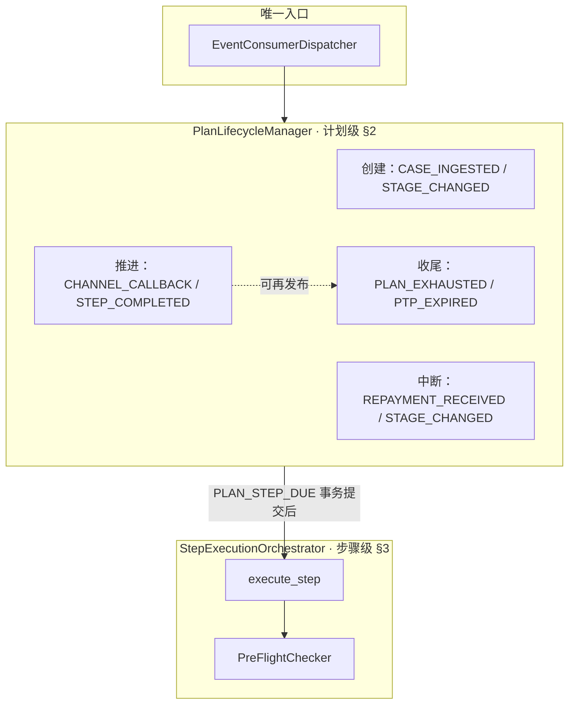

# MOCASA 催收系统升级 — Phase 1 核心引擎规格

> **版本**: Phase 1 · v1.0  
> **日期**: 2026-06-01  
> **范围**: 仅覆盖菲律宾市场  
> **定位**: 定义核心引擎（`engine.lifecycle` + `engine.spi`）的内部技术规格——事件路由、计划状态机、步骤执行管线及 SPI 调用时机；不含系统全局架构与基础设施实施细节。  
> **关联文档**: [产品需求文档 (PRD)](./MOCASA催收系统升级_Phase1_产品需求文档_PRD.md)、[架构设计文档](./MOCASA催收系统升级_Phase1_架构设计文档.md)、[基础设施交互规范](./MOCASA催收系统升级_Phase1_基础设施交互规范.md)

---

## 目录

- [1. 事件路由与线程模型](#1-事件路由与线程模型)
  - [1.1 EventConsumerDispatcher 与事件路由](#11-eventconsumerdispatcher-与事件路由)
  - [1.2 Trigger-to-Event 线程隔离](#12-trigger-to-event-线程隔离)
  - [1.3 并发与一致性模型](#13-并发与一致性模型)
- [2. 计划生命周期与状态机](#2-计划生命周期与状态机)
  - [2.1 状态定义](#21-状态定义)
  - [2.2 计划创建](#22-计划创建)
  - [2.3 步骤执行循环](#23-步骤执行循环)
  - [2.4 中断处理](#24-中断处理)
  - [2.5 穷尽续建](#25-穷尽续建)
  - [2.6 PTP 到期处理](#26-ptp-到期处理)
  - [2.7 状态转换](#27-状态转换)
- [3. 步骤执行骨架](#3-步骤执行骨架)
  - [3.1 execute_step 七步管线](#31-executestep-七步管线)
  - [3.2 故障降级](#32-故障降级)
- [4. SPI 接口完整定义](#4-spi-接口完整定义)
  - [4.1 接口总览](#41-接口总览)
  - [4.2 共享 DTO 定义](#42-共享-dto-定义)
- [5. 异常恢复策略](#5-异常恢复策略)
  - [5.1 L1 基础设施异常](#51-l1-基础设施异常)
  - [5.2 跨存储一致性修复](#52-跨存储一致性修复)

---

## 1. 事件路由与线程模型

本节定义引擎的**运行时骨架**：事件如何进入与路由（§1.1）、调度线程与 Consumer 线程如何隔离（§1.2）、并发与重复执行下如何保证一致性（§1.3）。事件 Payload 契约见数据接入与事件规格 §2（**规划中**——该规格待新建，EXTRACT 计划见 [阶段C 审计 C3-2](./audit/MOCASA催收系统升级_Phase1_跨文档去重_机制层_阶段C审计_20260618.md)）；SPI 调用时机见 [§4](#4-spi-接口完整定义)。

### 1.1 EventConsumerDispatcher 与事件路由

`EventConsumerDispatcher` 是核心引擎的**唯一入口**——从 Redis Stream 消费事件，反序列化后按类型路由；其余三个核心类均为内部协作组件，不对外暴露调用。

#### 核心类协作分工

| 类 | 职责边界 | 拥有的逻辑 |
|---|---|---|
| `EventConsumerDispatcher` | 事件消费 + 路由 + 并发保护 | 反序列化、行锁获取、终态拦截、委托 `PlanLifecycleManager` |
| `PlanLifecycleManager` | 计划级生命周期决策 | §2 全部伪代码（创建/中断/穷尽/PTP），事务内状态前置写入 |
| `StepExecutionOrchestrator` | 步骤级执行管线 | §3 全部伪代码（七步骨架），在非事务上下文中运行 |
| `PreFlightChecker` | 系统级实时守卫 | 实时查 DB 确认案件存活；由 Orchestrator 调用，**不直接消费事件** |

**调用链路**：`Dispatcher` → `Manager`（事务内）→ COMMIT → `Orchestrator`（事务外）；`PreFlightChecker` 嵌在 Orchestrator 的 `execute_step` 第②步。

#### 事件路由表（引擎侧）

| 事件 | 生命周期域 | 引擎侧处理动作 | 处理类 | 详见 |
|---|---|---|---|---|
| `CASE_INGESTED` | 计划创建 | 匹配模板 → 创建计划（PENDING）→ 注册首步 Job | Dispatcher → Manager | [§2.2](#22-计划创建) |
| `STAGE_CHANGED` | 创建 + 中断 | 取消旧阶段活跃计划 → 为新阶段创建计划 | Dispatcher → Manager | [§2.2](#22-计划创建)、[§2.4](#24-中断处理) |
| `REPAYMENT_RECEIVED` | 计划中断 | 取消该用户所有活跃计划 + 清理已注册 Job | Dispatcher → Manager | [§2.4](#24-中断处理) |
| `PLAN_STEP_DUE` | 步骤循环 | 按状态分流：到期执行 / 观察期结转 → 触达 | Dispatcher → Manager → Orchestrator（含 PreFlightChecker） | [§2.3](#23-步骤执行循环)、[§3](#3-步骤执行骨架) |
| `CHANNEL_CALLBACK` | 步骤循环 | 更新步骤结果 → 发布 `STEP_COMPLETED` | Dispatcher → Manager | [§2.3.3](#233-异步渠道回调处理) |
| `STEP_COMPLETED` | 步骤循环 | 推进决策：注册下一步 / 计划完成 / 发布穷尽 | Dispatcher → Manager（必要时 → Orchestrator） | [§2.3.2](#232-步骤完成推进决策) |
| `PLAN_EXHAUSTED` | 计划收尾 | 穷尽策略：续建新计划 / 升档 / 标记完成 | Dispatcher → Manager | [§2.5](#25-穷尽续建) |
| `PTP_EXPIRED` | 计划收尾 | 实时查 DB 确认还款；已还则补偿取消，未还则违约续建 | Dispatcher → Manager | [§2.6](#26-ptp-到期处理) |

**路由统一行为**：所有事件经 Dispatcher 消费后，第一步均为短事务内 `SELECT FOR UPDATE` 获取计划行级锁，检查终态——已终态则静默退出；否则完成状态前置写入后立即 COMMIT 释放锁。渠道 I/O 在事务外由 Orchestrator 执行。锁契约、幂等与竞态时序见 [§1.3](#13-并发与一致性模型)。

#### 事件四域总览

共 **10 种内部事件**（8 核心业务事件 + `CALLBACK_TIMEOUT` 内部超时哨兵 + `CASE_CEASED` D+91 停催；完整枚举见 [领域模型 §6.6 EventType](./MOCASA催收系统升级_Phase1_领域模型与数据定义.md#66-eventtype内部事件类型)）。下图按计划在生命周期中的角色将 **8 核心事件**分为四域（引擎侧视角，不涉及上游产生方式；`CALLBACK_TIMEOUT` 见 §2.3.4，`CASE_CEASED` 由 ingestion 发布、引擎识别为停催终态）：



部分事件会在引擎内部链式发布（仍经 Dispatcher 消费），例如 `CHANNEL_CALLBACK` → `STEP_COMPLETED`，`STEP_COMPLETED`（穷尽）→ `PLAN_EXHAUSTED`，`ExhaustionPolicy.ESCALATE` → `STAGE_CHANGED`。

### 1.2 Trigger-to-Event 线程隔离

系统严格区分两个运行上下文，杜绝调度线程与 I/O 密集操作的耦合：

| 阶段 | 线程上下文 | 职责 | 耗时要求 |
|---|---|---|---|
| 定时触发 | **XXL-Job Cron Thread** | 轻量扫表（`trigger_time <= NOW()` 且关联计划为非终态），发布 `PLAN_STEP_DUE` 事件到 Redis Stream | **毫秒级返回，严禁 I/O 阻塞** |
| 业务执行 | **Redis Stream Consumer Thread Pool** | 消费事件 → 执行合规/决策/渠道发送全链路 | 允许阻塞（渠道 I/O 集中在此线程池） |

XXL-Job 线程池永远毫秒级释放。渠道供应商变慢只影响 Consumer 线程池——单点可调优，不存在调度与 I/O 的交叉耦合。

### 1.3 并发与一致性模型

Consumer 并行消费时存在四类一致性风险，典型事故是还款已取消计划却仍发出触达。下表为全局总览；**本节仅详述路由/线程层拥有的前两项**，其余在各自归属章节展开。

#### 一致性风险总览

| 风险 | 原则 | 一句话机制 | 归属 |
|---|---|---|---|
| 并发写坏 | 串行锁 + 锁内轻量 | 短事务 `SELECT FOR UPDATE`；锁内禁止渠道 I/O | **本节 ↓** |
| 重复执行 | 消费幂等 | XACK / DLQ + `idempotency_key` SETNX + 终态吸收 | **本节 ↓**（消费语义）；步骤级见 [§3.1](#31-executestep-七步管线) ① |
| 乱序覆盖 | 终态单调 | 终态不可逆；优先级 `REPAID` > `STAGE_UPGRADE` > 非终态 | [§2.1](#21-状态定义)、[§2.4](#24-中断处理) |
| 迟到真相 | 多级复检 | 锁外重读计划行 + 触达前查案件库（PreFlightChecker） | [§3.1](#31-executestep-七步管线) ②⑤½ |
| *容忍边界* | 有界越界 | 已发出触达允许秒级窗口；计划仍取消、后续不执行 | 设计决策，见下方竞态例证 |

> **扩展提醒**：新增 `cancel_reason` 或事件类型时，须重新审查**终态单调**的优先级全序是否仍成立。

#### 防并发写坏：串行锁 + 锁内轻量

所有事件经 Dispatcher 消费后，第一步即短事务内 `SELECT FOR UPDATE` 获取计划行级锁：

- **锁内只做**：校验当前状态 + 写状态前置（如 → `STEP_EXECUTING` / `PLAN_CANCELLED`）
- **锁内禁止**：渠道 I/O、远程调用、任何可能阻塞的操作
- **COMMIT 即释放**：锁持有时间 = 一次 DB 读写，毫秒级

同一计划的多个并发事件被串行化处理，且锁窗口极小——不会因渠道超时导致锁堆积。

#### 防重复执行：消费层幂等

Redis Stream 的消费语义保证：

| 场景 | 行为 |
|---|---|
| 处理成功 | `XACK` 确认，消息不再投递 |
| 处理失败（可重试） | 不 ACK → pending list → 自动重投递 |
| 处理失败（不可重试） | NACK → 转入 DLQ，触发告警 |
| 重复投递到达 | 步骤级 `idempotency_key`（SETNX）静默吸收；终态计划直接退出 |

消费 ACK 语义属于路由/线程层；`idempotency_key` 的具体实现见 [§3.1](#31-executestep-七步管线) ①，DLQ 配置见 [基础设施交互规范](./MOCASA催收系统升级_Phase1_基础设施交互规范.md)。

#### 竞态时序例证

下面以最反直觉的一支为例，演示串行锁 + 多级复检 + 有界越界三者如何协同（非穷举，完整竞态覆盖由集成测试保证）：

```
Consumer-A (PLAN_STEP_DUE)           Consumer-B (REPAYMENT_RECEIVED)
    │                                      │
    │── SELECT FOR UPDATE plan ──→         │── SELECT FOR UPDATE plan (阻塞)
    │   plan.status == STEP_SCHEDULED      │
    │   → status = STEP_EXECUTING          │
    │── COMMIT（毫秒级释放锁）──→           │── 获取锁
    │                                      │   plan.status == STEP_EXECUTING（非终态）
    │   渠道 I/O 进行中...                  │   → status = PLAN_CANCELLED
    │                                      │── COMMIT
    │   渠道返回结果                         │
    │   写结果时重读计划发现 PLAN_CANCELLED   │   （多级复检：锁外重读计划行）
    │   → 静默丢弃，写补偿日志               │
```

结果：触达可能已发出（有界越界——还款与触达在同一秒级窗口内，不构成催收事故），计划已取消，后续步骤不再执行。

若中断线程先获锁，执行线程见终态 `PLAN_CANCELLED` 即静默退出（消费幂等——终态吸收）。还款/升档/执行等典型冲突由串行锁 + 终态单调 + 多级复检兜底，具体 cancel_reason 见 [§2.4](#24-中断处理)。

---

## 2. 计划生命周期与状态机

本节先定义状态词汇表，再按时间顺序展示计划从创建到终态的完整一生，最后以状态转换总表和转换图作为形式化总结。

> **§2 与 §3 的关系**：§2 是计划级的纵向视角（一个计划经历了什么），§3 是步骤级的横向视角（一次步骤执行内部怎么协作）。§2.3 中"执行步骤"的内部展开见 §3。

### 2.1 状态定义

计划级状态机共 **6 态**（4 非终态 + 2 终态），已覆盖引擎管辖的完整生命周期；步骤级状态（`SCHEDULED` / `EXECUTING` / `COMPLETED` 等）见 [领域模型](./MOCASA催收系统升级_Phase1_领域模型与数据定义.md)，不在此表重复。

| 状态 | 类型 | 语义 |
|---|---|---|
| `PENDING` | 非终态 | 计划刚创建，尚未执行任何步骤，等待首步 `trigger_time` |
| `STEP_SCHEDULED` | 非终态 | 上一步已结束，下一步 Job 已注册，等待到期 |
| `STEP_EXECUTING` | 非终态 | 当前步骤执行中（渠道发送 / 等待异步回调） |
| `STEP_WAITING` | 非终态 | 消息类渠道已发出，观察期内等待用户响应 |
| **`PLAN_COMPLETED`** | **终态** | 正常结束（还款确认或步骤全部走完） |
| **`PLAN_CANCELLED`** | **终态** | 被中断取消（见下表 `cancel_reason`） |

`PLAN_CANCELLED` 的 `cancel_reason` 枚举：

| cancel_reason | 触发事件 | 语义 |
|---|---|---|
| `REPAID` | `REPAYMENT_RECEIVED` | 用户已还款 |
| `STAGE_UPGRADE` | `STAGE_CHANGED` | 阶段变更（DPD 自然越阶 / PTP 违约升档 / 人工调整等），旧阶段计划被新阶段取代 |

> **不含 PLAN_PAUSED**：暂停态属于渠道编排层的概念（如人工外呼等待坐席分配），不归核心引擎状态机管辖。

### 2.2 计划创建

**触发事件**：`CASE_INGESTED`（新案件入库）或 `STAGE_CHANGED`（阶段变更，为新阶段创建计划）。

```
  信贷系统          数据接入层          事件总线           核心引擎
    │                  │                 │                  │
    │── case_push ──→ │                 │                  │
    │                  │── 数据清洗       │                  │
    │                  │── 写入DB        │                  │
    │                  │── 生成snapshot  │                  │
    │                  │── 阶段检测(DPD) │                  │
    │                  │                 │                  │
    │                  │──CASE_INGESTED─→│                  │
    │                  │                 │── 消费 ────→     │
    │                  │                 │                  │
    │                  │                 │    ① PlanFactory.create(case, stage, snapshot)
    │                  │                 │       → 匹配 plan_template(stage × product)
    │                  │                 │       → 生成 ContactPlan(PENDING) + N 个 Step
    │                  │                 │    ② save(plan) + 设置首步 trigger_time（同事务）
    │                  │                 │                  │
    │                  │                 │    计划状态: PENDING ✓
```

```python
def on_case_ingested(event):
    case_info = get_case_info(event.case_id)
    snapshot = get_context_snapshot(event.case_id)

    plan = PlanFactory.create(case_info, event.stage, snapshot)   # → SPI §4.1
    if plan is None:
        return                        # 该案件不需要创建计划

    with transaction():               # 计划+步骤+首步 trigger_time 原子落盘
        save(plan)                    # 持久化计划 + 步骤序列
        first_step = plan.steps[0]
        first_step.trigger_time = calculate_trigger_time(first_step)
    plan.status = PENDING
```

**幂等约束**：`PlanFactory` 实现必须保证同一 `case_id + stage` 不重复创建计划。

> **单活跃计划约束**：同一 `case_id + stage` 在同一时刻最多存在一个非终态计划。阶段变更时旧阶段计划被取消后才创建新阶段计划（§2.4），穷尽续建时旧计划先标完成再创建新计划（§2.5）。因此 `find_active_plan(case_id)` 返回单个结果；`find_active_plans(user_id)` 返回多个结果仅当用户有多笔贷款（不同 case_id）。

> **快照新鲜度边界（重要，编排层 SPI 必读）**：`context_snapshot` 在**计划创建时冻结**写入 `t_contact_plan.context_snapshot`，并在**计划整个生命周期内保持不变**。它**仅在以下时机重建**：①新建计划（`CASE_INGESTED`）、②升档为新阶段建计划（`STAGE_CHANGED`，§2.4）、③穷尽续建建新计划（§2.5）。**计划存活期内不刷新**——同一计划的所有步骤决策都基于同一份快照，以保证决策视图的时点一致性。
>
> 由此推导出编排层 SPI（`StepResolver`/`AdvancementPolicy`/`ExhaustionPolicy`）的两条使用约束：
> - 快照中的**案件画像 / 还款计划 / 用户资料**反映的是"建计划那一刻"的状态，**可能随计划存活而陈旧**；需要绝对实时的判断（如"是否已还款"）**不得依赖快照**，由引擎在执行前实时校验（§2.6 PTP、七步管线系统级守卫）。
> - 快照中的 `contactHistory` 是建计划时的旧值；决策应使用引擎在执行时实时装配进 `ExecutionContext` 的 `recentTimeline`（计划自身执行过程中新产生的触达），而非快照里的历史。

### 2.3 步骤执行循环

**触发事件**：`PLAN_STEP_DUE`、`CHANNEL_CALLBACK`、`STEP_COMPLETED`（事件名，非计划状态）。计划态流转见 [§2.7](#27-状态转换)；下文按**事件驱动**展开单次处理链路（非状态图重复）。

```
  XXL-Job(Cron)      事件总线           核心引擎                合规/决策/渠道
    │                  │                  │                       │
    │  ──── [Cron Thread: 毫秒级扫表，严禁I/O] ────                │
    │                  │                  │                       │
    │──PLAN_STEP_DUE─→│                  │                       │
    │  [Cron Thread 立即释放]              │                       │
    │                  │                  │                       │
    │  ──── [Consumer Thread Pool: 允许I/O阻塞] ────               │
    │                  │── 消费 ────→     │                       │
    │                  │                  │                       │
    │                  │           ┌─ 事务(毫秒级) ───────────────┤
    │                  │           │  lock(plan)                  │
    │                  │           │  分流器(§2.3.1)              │
    │                  │  场景A:   │  → STEP_EXECUTING            │
    │                  │  场景B:   │  → COMPLETED + publish       │
    │                  │           └─ COMMIT 释放锁 ─────────────┤
    │                  │                  │                       │
    │                  │  场景A续: │  execute_step(plan, step)    │  ← 展开见 §3
    │                  │           │     check→decide→send        │
    │                  │           │  （渠道I/O在事务外执行）       │
    │                  │                  │                       │
    │                  │  ──── STEP_COMPLETED 消费 ────            │
    │                  │                  │                       │
    │                  │           AdvancementPolicy.decide()     │  ← SPI §4.1
    │                  │           ┌─ 推进决策 ──────────────────┤
    │                  │           │                              │
    │                  │  ADVANCE: │  注册下一步Job → STEP_SCHEDULED
    │                  │           │  （循环回到本节开头）          │
    │                  │           │                              │
    │                  │  COMPLETED:│ plan.status → PLAN_COMPLETED ✓
    │                  │           │                              │
    │                  │  EXHAUSTED:│ publish(PLAN_EXHAUSTED) → §2.5
    │                  │           └──────────────────────────────┘
```

#### 2.3.1 PLAN_STEP_DUE 分流器

`PLAN_STEP_DUE` 事件同时承载"步骤到期执行"和"观察期到期结转"两种语义。Consumer 消费后根据当前计划状态分流：

```python
def on_plan_step_due(event):
    # ── 事务 1（毫秒级：锁 → 校验 → 状态前置 → 释放） ──
    with transaction():
        plan = get_plan_with_lock(event.plan_id)  # SELECT FOR UPDATE
        if plan is None or plan.status in (PLAN_COMPLETED, PLAN_CANCELLED):
            return                                 # 终态拦截

        step = plan.get_current_step()

        if plan.status in (PENDING, STEP_SCHEDULED):
            plan.status = STEP_EXECUTING           # 状态前置，立即 COMMIT 释放行锁
        elif plan.status == STEP_WAITING:
            step.status = COMPLETED
            if step.best_result is None:
                step.result = SENT_NO_RESPONSE
            publish(STEP_COMPLETED)
            return
    # ── 事务已提交，行锁已释放 ──

    # ── 非事务上下文：渠道 I/O（允许耗时数百毫秒~数秒） ──
    execute_step(plan, step)                       # 展开见 §3
```

#### 2.3.2 步骤完成推进决策

```python
def on_step_completed(plan, completed_step):
    decision = AdvancementPolicy.decide(context, step_result)   # → SPI §4.1

    if decision == ADVANCE_NEXT:
        next_step = get_next_step(plan, completed_step)
        if next_step.delay_minutes > 0:
            register_job(PLAN_STEP_DUE, next_step.delay_minutes)
            plan.status = STEP_SCHEDULED
        else:
            execute_step(plan, next_step)          # 立即执行（并发安全由 §3.1 ⑤½ 复检保证）

    elif decision == PLAN_COMPLETED:
        plan.status = PLAN_COMPLETED               # 终态

    elif decision == PLAN_EXHAUSTED:
        publish(PLAN_EXHAUSTED)                    # → §2.5
```

#### 2.3.3 异步渠道回调处理

电话类（AI_CALL / TTS）和人工类（HUMAN_CALL）渠道在发送后保持 `STEP_EXECUTING` 状态，等待外部供应商通过 Webhook 回调。回调经 `collection-admin` 鉴权后发布为 `CHANNEL_CALLBACK` 事件。

```python
def on_channel_callback(event):
    with transaction():
        plan = get_plan_with_lock(event.plan_id)       # SELECT FOR UPDATE 串行化重复回调
        if plan.status != STEP_EXECUTING:
            return                                     # 非执行态（已处理或已取消），静默吸收

        step = plan.get_current_step()
        step.result = map_callback_to_result(event)    # 映射供应商回调为统一结果
        step.status = COMPLETED
        write_timeline(step.result)
    publish(STEP_COMPLETED)                            # 事务外发布，保证写入已落盘
```

#### 2.3.4 异步回调超时兜底

异步渠道（AI_CALL / TTS / HUMAN_CALL）在 `STEP_EXECUTING` 等待 Webhook；回调永久不到达时计划会卡死。采用两级保障，职责不同、互补而非重复：

| 级别 | 职责 | 典型失效场景 |
|---|---|---|
| **一级·引擎超时哨兵** | 按配置/渠道 metadata 注册超时 Job，到期仍无回调则标 `FAILED` 并 `publish(STEP_COMPLETED)`，走正常推进链路 | 供应商无回调、Webhook 丢失 |
| **二级·渠道对账扫描** | 一级未生效或外部已有结果但事件未到：查供应商状态、补写 timeline、补发事件 | 超时 Job 注册失败、进程崩溃、事件丢失 |

一级是状态机**主路径**自愈；二级是**运维兜底**，覆盖一级覆盖不到的副作用与对账缺口（详见 [渠道编排规格](./channel/MOCASA催收系统升级_Phase1_渠道编排规格.md)）。

进入 `STEP_EXECUTING`（异步渠道）时注册超时 Job（[§3.1 步骤⑦](#31-executestep-七步管线)）：

```python
def on_callback_timeout(event):
    plan = get_plan_with_lock(event.plan_id)
    if plan.status != STEP_EXECUTING:
        return                                     # 回调已正常处理，忽略

    step = plan.get_current_step()
    step.result = FAILED
    step.status = FAILED
    write_timeline(CALLBACK_TIMEOUT, note="async callback not received within timeout")
    publish(STEP_COMPLETED)                        # 由 AdvancementPolicy 决定下一步
```

**默认 60 分钟**：面向 AI_CALL / TTS（回调通常分钟级）。`HUMAN_CALL` 坐席录入可达数小时，须由 `StepResolver` 在 `StepCommand.metadata` 中传入更长超时（与 [渠道编排规格](./channel/MOCASA催收系统升级_Phase1_渠道编排规格.md) 人工渠道约定对齐，不宜共用 60 分钟默认值）。全局默认见 `engine.step.callback_timeout_minutes`（[基础设施交互规范·附录](./MOCASA催收系统升级_Phase1_基础设施交互规范.md#附录配置参数汇总)）。

### 2.4 中断处理

**触发事件**：`REPAYMENT_RECEIVED`（用户还款）、`STAGE_CHANGED`（阶段变更）。

中断事件可在计划生命周期的**任意非终态**到达。状态机通过行级排他锁与终态单调（[§1.3](#13-并发与一致性模型)）确保中断与执行的并发安全。

```
  信贷系统          数据接入层          事件总线           核心引擎
    │                  │                 │                  │
    │                  │                 │    当前可能处于:   │
    │                  │                 │    PENDING / STEP_SCHEDULED /
    │                  │                 │    STEP_EXECUTING / STEP_WAITING
    │                  │                 │                  │
    │── repayment ──→ │                 │                  │
    │                  │──REPAYMENT_RECEIVED→              │
    │                  │                 │── 消费 ────→     │
    │                  │                 │                  │
    │                  │                 │    lock(plan)    │
    │                  │                 │    plan.status → PLAN_CANCELLED
    │                  │                 │    cancel_reason = REPAID
    │                  │                 │    cancel_scheduled_jobs(plan)
    │                  │                 │    filter_repaid_user(user_id)
    │                  │                 │    PLAN_CANCELLED(REPAID) ✓
    │                  │                 │                  │
    ├ ─ ─ ─ ─ ─ ─ ─ ─ ─ ─ ─ ─ ─ ─ ─ ─ ─ ─ ─ ─ ─ ─ ─ ─ ┤
    │                  │                 │                  │
    │  (阶段变更)       │                 │                  │
    │                  │──STAGE_CHANGED─→│                  │
    │                  │                 │── 消费 ────→     │
    │                  │                 │                  │
    │                  │                 │    lock(old_plan)│
    │                  │                 │    old_plan → PLAN_CANCELLED
    │                  │                 │    cancel_reason = STAGE_UPGRADE
    │                  │                 │    cancel_scheduled_jobs(old_plan)
    │                  │                 │    PlanFactory.create(case, new_stage, snapshot)
    │                  │                 │    → 新计划(PENDING) + 新Job
    │                  │                 │                  │
```

```python
def on_repayment_received(user_id):
    plans = find_active_plans(user_id)             # status NOT IN 终态
    for plan in sorted(plans, key=lambda p: p.id): # 按 plan_id 升序加锁，防止死锁
        lock(plan)                                 # SELECT FOR UPDATE
        plan.status = PLAN_CANCELLED
        plan.cancel_reason = REPAID
        cancel_scheduled_jobs(plan)
    PredictiveDialerService.filter_repaid_user(user_id)  # 失败 → 告警 + 继续（§5.1）

def on_stage_changed(case_id, new_stage):
    old_plans = find_active_plans_by_case(case_id)
    for plan in sorted(old_plans, key=lambda p: p.id):
        if plan.stage != new_stage:
            lock(plan)
            plan.status = PLAN_CANCELLED
            plan.cancel_reason = STAGE_UPGRADE
            cancel_scheduled_jobs(plan)
    create_plan_for_stage(case_id, new_stage)       # 复用 §2.2 创建流程
```

### 2.5 穷尽续建

**触发事件**：`PLAN_EXHAUSTED`（所有步骤执行完毕但用户未还款）。

穷尽**不等于结束**。当一个计划的所有步骤都已执行完毕但用户仍未还款时，`ExhaustionPolicy` 决定下一步走向。三种策略的区别：

| ExhaustionPolicy 返回值 | 语义 | 引擎动作 | 是否等待外部事件 |
|---|---|---|---|
| `REBUILD` | **同阶段立即续建**：在当前阶段创建新一轮计划（可能使用不同模板/策略），继续触达 | 立即调用 `PlanFactory.create()` 创建新计划并注册首步 Job | 否，立即执行 |
| `ESCALATE` | **升档**：当前阶段的触达手段已穷尽，需要提升催收强度 | 引擎发布 `STAGE_CHANGED` → 取消旧阶段计划 + 创建新阶段计划（复用 §2.2 + §2.4 流程） | 通过事件间接触发 |
| `COMPLETE` | **停止**：不再主动触达，等待用户自主还款或 DPD 自然越阶触发新阶段 | 标记计划 `PLAN_COMPLETED`（终态） | 结束，不再主动行动 |

> `REBUILD` 有续建次数上限（`engine.plan.max_rebuild_count`），防止无限循环。达到上限后策略层应返回 `ESCALATE` 或 `COMPLETE`。

```python
def on_plan_exhausted(event):
    plan = get_plan_with_lock(event.plan_id)
    if plan.status in (PLAN_COMPLETED, PLAN_CANCELLED):
        return

    case_info = get_case_info(plan.case_id)
    snapshot = get_context_snapshot(plan.case_id)

    result = ExhaustionPolicy.handle(plan, case_info, snapshot)   # → SPI §4.1

    if result.action == REBUILD:
        plan.status = PLAN_COMPLETED               # 旧计划正常完成（步骤已全部执行）
        new_plan = PlanFactory.create(case_info, plan.stage, snapshot)
        save(new_plan)
        register_job(PLAN_STEP_DUE, new_plan.steps[0].trigger_time)
    elif result.action == ESCALATE:
        plan.status = PLAN_COMPLETED               # 旧计划正常完成
        publish(STAGE_CHANGED, new_stage=result.target_stage)
        # STAGE_CHANGED 消费时复用 §2.2 创建新阶段计划
    elif result.action == COMPLETE:
        plan.status = PLAN_COMPLETED               # 终态，不再主动触达
```

### 2.6 PTP 到期处理

**PTP 记录来源**：坐席在通话中录入用户的承诺还款日期（Promise to Pay），由催收员 App 后端持久化至 `t_collection_ptp_info`。Phase 1 仅此一个来源——无其他事件或自动流程会产生 PTP 记录。录入流程不归核心引擎管辖（见 [渠道编排规格](./channel/MOCASA催收系统升级_Phase1_渠道编排规格.md)）。`ptpExpiredHandler`（[基础设施交互规范](./MOCASA催收系统升级_Phase1_基础设施交互规范.md)）定时扫描到期记录并发布 `PTP_EXPIRED` 事件。

`PTP_EXPIRED` 是终态后的重评估：到期时若已还款则补偿取消，若违约则按需续建，若有活跃计划则不干预。

**触发事件**：`PTP_EXPIRED`（承诺还款日到期，由定时任务发布）。

PTP（Promise to Pay）到期时，引擎必须**实时查询 DB 确认还款状态**（不依赖 context_snapshot），因为 `REPAYMENT_RECEIVED` 事件在分布式系统中存在延迟到达的可能——若不主动查 DB，可能对已还款用户触发新一轮催收。

```python
def on_ptp_expired(case_id, ptp_id):
    ptp = get_ptp_record(ptp_id)
    if ptp.status in (HONORED, BROKEN):            # 幂等：已处理过
        return

    # ── 实时查 DB，不用快照 ──
    if is_repaid(case_id):
        ptp.status = HONORED
        cancel_active_plans_if_any(case_id, reason=REPAID)   # 补偿取消
        return

    # ── PTP 违约 ──
    ptp.status = BROKEN

    active_plan = find_active_plan(case_id)
    if active_plan is not None:
        return                                     # 计划仍在执行，正常流程继续

    # 无活跃计划（已穷尽/已完成但未还款）→ 续建
    case_info = get_case_info(case_id)
    snapshot = get_latest_snapshot(case_id)
    last_plan = get_last_completed_plan(case_id)
    result = ExhaustionPolicy.handle(last_plan, case_info, snapshot)   # → SPI §4.1
    if result.action == REBUILD:
        create_new_plan(case_id, result.template_id)
```

### 2.7 状态转换

状态图展示主循环与中断路径；穷尽与 PTP 重评估的细节见 [§2.5](#25-穷尽续建)、[§2.6](#26-ptp-到期处理)。

```
                 CASE_INGESTED / STAGE_CHANGED
                      │
                      ▼
                ┌──────────┐     PLAN_STEP_DUE    ┌────────────────┐
                │  PENDING  │ ──────────────────→ │ STEP_EXECUTING │
                └──────────┘                      └───────┬────────┘
                                                          │
                                    ┌─────────────────────┼──────────────────────┐
                                    │ 消息类(有观察期)      │ 消息类(无观察期)       │ 异步回调
                                    ▼                     │ / 同步完成             │ (CHANNEL_CALLBACK
                             ┌──────────────┐             │                      │  / 超时)
                             │ STEP_WAITING  │             │                      │
                             └──────┬───────┘             │                      │
                                    │ 观察期到期            │                      │
                                    │ (PLAN_STEP_DUE)      │                      │
                                    ▼                     ▼                      ▼
                             ┌──────────────────────────────────────────────────────┐
                             │              推进决策 (AdvancementPolicy)             │
                             │  ADVANCE_NEXT  → STEP_SCHEDULED (注册下一步 Job)      │
                             │  PLAN_COMPLETED → 终态                               │
                             │  PLAN_EXHAUSTED → §2.5（REBUILD / ESCALATE / COMPLETE）│
                             └──────────────────────────┬───────────────────────────┘
                                                        │ ADVANCE_NEXT
                                                        ▼
                             ┌────────────────┐    PLAN_STEP_DUE    ┌────────────────┐
                             │ STEP_SCHEDULED │ ──────────────────→ │ STEP_EXECUTING │
                             └────────────────┘                     └────────────────┘
                                                                          (循环)

  ════════════════════════════════════════════════════════════════════
  中断路径（任意非终态均可切入）:
  任意非终态 ──REPAYMENT_RECEIVED──→ PLAN_CANCELLED (REPAID)
  任意非终态 ──STAGE_CHANGED────────→ PLAN_CANCELLED (STAGE_UPGRADE) + 创建新计划

  PTP 到期（PTP_EXPIRED，见 §2.6）:
  已还款 → 补偿取消 | 有活跃计划 → 不干预 | 无活跃计划 → §2.5 续建
```

---

## 3. 步骤执行骨架

本节定义 `StepExecutionOrchestrator` 的单步执行管线（§3.1）及渠道失败时的步骤级降级（§3.2）。计划级状态流转见 [§2.3](#23-步骤执行循环)；SPI 调用契约见 [§4](#4-spi-接口完整定义)。

`StepExecutionOrchestrator` 的固定七步管线：幂等 → 系统守卫 → 合规 → 解析 → 渠道 → 降级 → 分流。所有步骤走同一条管线；差异在 SPI/渠道实现返回值，不在骨架分支。

### 3.1 execute_step 七步管线

```
executeStep(plan, step):

  ── 引擎内部 ──────────────────────────────────────────────────────
  ① 幂等锁获取    基于 idempotency_key 的分布式 SETNX；重复事件静默退出
  ② 系统级守卫    PreFlightChecker 实时查 DB 确认案件未还款/未冻结/未关闭；
                  失败 → 静默退出，不记录、不推进

  ── 通过接口契约调用渠道编排层 ─────────────────────────────────────
  ③ 业务级守卫    ExecutionGuard.evaluate() → 合规校验（频率/时段/放弃率）
                  拦截 → 标记 SKIPPED，写入 violation，推进下一步
  ④ 步骤解析      StepResolver.resolve() → 基于 context_snapshot 生成 StepCommand（零 DB I/O）
  ⑤ 渠道调度      ChannelGateway.dispatch(command) → StepResult
                  渠道层内部的熔断/fallback 对引擎完全透明

  ── 引擎内部 ──────────────────────────────────────────────────────
  ⑤½ 取消检测    reload plan 状态；已取消 → 记录但不推进
  ⑥ 故障降级      retryable → 非阻塞退避重试；不可重试 → FAILED → 推进（详见 §3.2）
  ⑦ 渠道分流      消息类：有观察期→STEP_WAITING / 无→推进
                  电话/人工类：保持 STEP_EXECUTING，等异步回调 + 注册超时哨兵（§2.3.4）
```

> ③④⑤ 均通过接口契约调用渠道编排层——核心引擎不区分"SPI 接口"和"ChannelGateway 接口"，调用方式完全相同。两者的区别仅在于**演进策略**：5 个 SPI 接口（含③④）定义于 `engine.spi` 包，Phase 2 支持策略替换（规则引擎 → LLM）；`ChannelGateway`（⑤）定义于 `collection-common`，是固定的技术执行管道。模块边界与契约见 [§4](#4-spi-接口完整定义)。

运行在非事务上下文中，行锁已在调用方 [§2.3.1](#231-plan_step_due-分流器) 释放。步骤①对应 [§1.3](#13-并发与一致性模型) 消费幂等；步骤②对应多级复检（查案件库）；⑤½对应多级复检（重读计划行）+ 有界越界。其中对 DB 的写入（`step.status`、`plan.status`、`write_timeline`）均为独立短事务（单行 UPDATE，无需行锁）；⑥⑦ 写入失败由 [§5.1](#51-l1-基础设施异常) NACK 重消费兜底，①② 基础设施失败 fail-close 静默退出。

```python
def execute_step(plan, step):
    # ── ① 幂等锁 ──
    if not IdempotencyService.acquire(step.idempotency_key, ttl_minutes=15):
        return

    # ── ② 系统级守卫（实时查 DB：案件是否还款/冻结/关闭） ──
    # 同时兼作"事务间隙取消检测"——若事务释放后、此处执行前计划已被取消，此处会检出
    if not PreFlightChecker.check(plan.case_id):
        return                                    # 静默退出

    # ── ③ 业务级守卫（Redis 计数器：合规频率/时段/放弃率） ──
    verdict = ExecutionGuard.evaluate(context)     # → SPI §4.1
    if not verdict.allowed:
        step.status = SKIPPED
        write_timeline(COMPLIANCE_BLOCKED, violation=verdict.blocked_reason)
        publish(STEP_COMPLETED)
        return

    # ── ④ 步骤解析（零 DB I/O，读 context_snapshot） ──
    command = StepResolver.resolve(context)        # → SPI §4.1

    # ── ⑤ 渠道调度（渠道层内部熔断/fallback 对引擎透明） ──
    # dispatch 抛运行时异常 → 一律视为 retryable，走 §3.2 退避重试
    result = ChannelGateway.dispatch(command)

    # ── ⑤½ 回写前取消检测（应对渠道 I/O 期间计划被取消的场景） ──
    if reload_plan_status(plan.id) in (PLAN_COMPLETED, PLAN_CANCELLED):
        write_timeline(result, note="plan_cancelled_during_dispatch")
        return                                    # 记录已发出的触达，但不推进状态机

    # ── ⑥ 故障降级 ──
    if not result.success:
        if result.retryable and step.retry_count < MAX_RETRY:
            step.retry_count += 1
            delay = min(RETRY_BASE * (RETRY_FACTOR ** step.retry_count), RETRY_MAX)
            register_job(PLAN_STEP_DUE, delay_seconds=delay)  # 非阻塞：注册短延迟 Job
            return                                             # plan 保持 STEP_EXECUTING
        step.status = FAILED
        write_timeline(CHANNEL_ERROR, error_code=result.error_code)
        publish(STEP_COMPLETED)                   # 失败也推进，不卡死
        return

    # ── ⑦ 渠道分流 ──
    write_timeline(result)
    if command.channel_type in (SMS, PUSH, EMAIL, VIBER, WHATSAPP):
        if step.observation_minutes > 0:
            register_job(PLAN_STEP_DUE, step.observation_minutes)
            plan.status = STEP_WAITING
        else:
            publish(STEP_COMPLETED)
    else:  # AI_CALL / TTS / HUMAN_CALL
        register_job(CALLBACK_TIMEOUT, callback_timeout_minutes)  # 超时哨兵 → §2.3.4
        plan.status = STEP_EXECUTING              # 保持执行态，释放线程，等待异步回调
```

### 3.2 故障降级

故障降级分两层，引擎只负责步骤级——渠道层的供应商级降级对引擎完全透明。`ChannelGateway.dispatch()` 若抛运行时异常（非 `StepResult`），引擎一律视为 `retryable=true`，走下方退避重试路径。

```
┌─ 渠道编排层（对引擎透明）────────────────────────────────────────┐
│  供应商失败 → 熔断检测 → fallback 渠道自动切换                      │
│  所有重试/降级完成后，返回最终 StepResult 给引擎                     │
└──────────────────────────────────────────────────────────────────┘
                    │ StepResult
                    ▼
┌─ 核心引擎（步骤级）─────────────────────────────────────────────┐
│  success=true    → 正常推进（⑦ 渠道分流）                          │
│  success=false   → 判断 retryable:                               │
│    retryable + 未达上限 → 非阻塞退避重试                            │
│      注册短延迟 XXL-Job（间隔 = min(base × factor^n, max)）        │
│      plan 保持 STEP_EXECUTING，中断事件可正常取消                    │
│    retryable + 达上限 / 不可重试 → 标记 FAILED                     │
│      publish(STEP_COMPLETED)，由 AdvancementPolicy 决定下一步      │
└──────────────────────────────────────────────────────────────────┘
```

> 单步 `FAILED` 仅发布 `STEP_COMPLETED`，由 [§2.3.2](#232-步骤完成推进决策) / [§4.1](#41-接口总览) AdvancementPolicy 推进下一步，不丢弃或重建计划；仅全计划穷尽且 [§2.5](#25-穷尽续建) `REBUILD` 时才新建计划。

---

## 4. SPI 接口完整定义

本节定义核心引擎与渠道编排层之间的**接口契约层**——5 个策略 SPI（引擎声明、渠道编排层实现）+ 1 个技术执行管道 `ChannelGateway`。

- **覆盖内容**：每个接口的调用时机与决策问题（§4.1 接口总览）、引擎对实现异常的应对决策（§4.1 SPI 设计决策）、入参/出参字段定义（§4.2 共享 DTO）
- **不覆盖**：接口的具体实现逻辑（模板匹配规则、合规阈值、渠道选择策略等），见 [渠道编排规格](./channel/MOCASA催收系统升级_Phase1_渠道编排规格.md)

### 模块边界与调用全景

§3.1 步骤 ③④⑤ 的跨模块视角（签名见 §4.1，DTO 见 §4.2）：

```
  核心引擎(骨架)         渠道编排 · 策略子层          渠道编排 · 执行子层
  (engine.lifecycle)    (engine.strategy)          (collection-channel)
       │── ③ evaluate() ──→ │                          │
       │   BLOCK → SKIPPED  │                          │
       │   ALLOW ──→        │                          │
       │── ④ resolve() ───→ │←── StepCommand ──        │
       │── ⑤ dispatch() ──────────────────────────→    │
       │   消息类 ← DELIVERED → STEP_WAITING / STEP_COMPLETED
       │   电话/人工 → 保持 EXECUTING ← CHANNEL_CALLBACK（事件总线）
```

### 4.1 接口总览

| 接口 | 调用时机 | 调用位置 | 决策问题 | 输入 → 输出 |
|---|---|---|---|---|
| `PlanFactory` | 案件入库 / 阶段变更 / 穷尽续建 | [§2.2](#22-计划创建)、[§2.5](#25-穷尽续建) | 创建什么触达计划？ | 案件+阶段 → 计划+步骤序列 |
| `ExecutionGuard` | 步骤执行前（骨架③） | [§3.1](#31-executestep-七步管线) | 这一步允许执行吗？ | 用户+渠道+时间 → 允许/拦截 |
| `StepResolver` | Guard 通过后（骨架④） | [§3.1](#31-executestep-七步管线) | 具体发什么、用什么渠道？ | 计划+步骤 → StepCommand |
| `AdvancementPolicy` | 步骤完成后 | [§2.3.2](#232-步骤完成推进决策) | 下一步是什么？ | 计划+结果 → 推进/完成/穷尽 |
| `ExhaustionPolicy` | 计划穷尽 / PTP 到期 | [§2.5](#25-穷尽续建)、[§2.6](#26-ptp-到期处理) | 所有步骤用完怎么办？ | 计划+案件 → 续建/升档/完成 |
| `ChannelGateway` | Guard + Resolve 通过后（骨架⑤） | [§3.1](#31-executestep-七步管线) | （技术管道，无业务决策） | StepCommand → StepResult |

#### 接口签名速查

```java
ContactPlan          PlanFactory.create(CaseInfo caseInfo, StageEnum stage, ContextSnapshot snapshot);
GuardVerdict         ExecutionGuard.evaluate(ExecutionContext context);
StepCommand          StepResolver.resolve(ExecutionContext context);
AdvancementDecision  AdvancementPolicy.decide(ExecutionContext context, StepResult stepResult);
ExhaustionResult     ExhaustionPolicy.handle(ContactPlan plan, CaseInfo caseInfo, ContextSnapshot snapshot);
StepResult           ChannelGateway.dispatch(StepCommand command);
```

#### SPI 设计决策

SPI 实现方可能抛出运行时异常或超时（两者均按异常处理），引擎需对每个接口预定义**应对行为**。核心取舍是：**延迟处理（NACK 重消费）**与**跳过继续（fail-close）**之间的选择——取决于该接口失败对计划完整性的影响程度。`ChannelGateway` 的异常处理见 [§3.2 故障降级](#32-故障降级)。

| 接口 | 引擎应对 | 设计取舍（`＞` = 左侧优于右侧） | null 语义 | 硬超时 |
|---|---|---|---|---|
| `PlanFactory` | NACK → 延迟重消费 | 延迟触达 ＞ 丢失整个计划（案件将完全无触达） | null = 该案件不需建计划（正常返回值） | 50ms |
| `ExecutionGuard` | fail-close → SKIPPED + 告警 | 跳过单步 ＞ 阻塞 Consumer（影响限于当前步骤，计划继续） | 不允许 | 20ms |
| `StepResolver` | 标记 FAILED → `STEP_COMPLETED` → 推进 | 单步失败 ＞ 计划卡死（由 AdvancementPolicy 决定下一步） | 不允许（须抛异常触发 FAILED） | 50ms |
| `AdvancementPolicy` | NACK → 延迟重消费 | 延迟推进 ＞ 无决策悬停（计划不可无推进决策放任） | 不允许 | 10ms |
| `ExhaustionPolicy` | NACK → 延迟重消费 | 延迟穷尽决策 ＞ 丢失穷尽事件（穷尽是生命周期关键节点） | 不允许 | 50ms |

> **副作用约束**：所有 SPI 实现禁止副作用（不可写 DB、不可发布事件、不可调用外部服务）。`ESCALATE` 时的 `STAGE_CHANGED` 事件由引擎在 [§2.5](#25-穷尽续建) 中发布，非实现方职责。
>
> **硬超时**：超过阈值等同于运行时异常，按上表应对行为处理；默认值可通过 `engine.spi.{name}.timeout_ms` 配置覆盖。

### 4.2 共享 DTO 定义

**共享 DTO** 定义于 `engine.spi`（`collection-common`），描述引擎骨架、策略子层、渠道执行子层之间的输入/输出数据结构，与 SPI 接口同包发布，构成模块契约层。

**SPI 与 DTO**：SPI 定义调用入口与时机；DTO 定义入参、出参及字段语义。

| DTO | 关联接口 | 契约边界 |
|---|---|---|
| `ExecutionContext` | ExecutionGuard / StepResolver / AdvancementPolicy | 引擎 → 渠道编排（策略子层） |
| `GuardVerdict` | ExecutionGuard | 渠道编排（策略子层） → 引擎 |
| `StepCommand` | StepResolver / ChannelGateway | 渠道编排内：策略子层 → 执行子层（引擎 ④⑤ 串联） |
| `StepResult` | ChannelGateway / AdvancementPolicy | 渠道编排（执行子层） → 引擎 |
| `AdvancementDecision` | AdvancementPolicy | 渠道编排（策略子层） → 引擎 |
| `ExhaustionResult` | ExhaustionPolicy | 渠道编排（策略子层） → 引擎 |

> **DTO 字段定义为单一真相源（SSOT）于领域模型**：上述 6 个 DTO 的逐字段定义（类型、语义、metadata 已知 key、枚举取值、字段级约束）统一维护于 [领域模型与数据定义 §4 SPI 契约 DTO](./MOCASA催收系统升级_Phase1_领域模型与数据定义.md#4-spi-契约-dto)（`ExecutionContext` §4.1 / `GuardVerdict` §4.2 / `StepCommand` §4.3 / `StepResult` §4.4 / `AdvancementDecision` §4.5 / `ExhaustionResult` §4.6）。本规格不再复制字段块，避免双写漂移（详见跨文档去重审计 [阶段C·K5](./audit/MOCASA催收系统升级_Phase1_跨文档去重_机制层_阶段C审计_20260618.md)）。

> **本节边界**：上表（DTO ↔ 关联接口 ↔ 契约边界）与 §4.1（接口签名、SPI 设计决策、硬超时）为引擎侧 SSOT——定义 DTO 在管线中的**流向与契约归属**；字段**内容**归领域模型 §4。`StepResult.success`/`retryable` 的运行时回填语义另见 [引擎渠道执行契约对齐](./contracts/MOCASA催收系统升级_Phase1_引擎渠道执行契约对齐_待编排确认.md)。

---

## 5. 异常恢复策略

本节汇总核心引擎在故障发生时的**行为规格**。故障按来源分四个层级；业务降级与 SPI 异常在各自归属章节定义，本节补充 L1（基础设施异常）和 L3（跨存储一致性修复）。

恢复策略选择依据：每个故障点在「漏触达」与「延迟触达」之间显式取舍——计划级故障优先延迟（NACK），步骤级故障优先跳过（fail-close）。所有恢复路径均须写入 timeline 或告警，不得静默吞没。

#### 故障层级总览

| 层级 | 故障来源 | 引擎行为 | 详见 |
|---|---|---|---|
| 业务降级 | 渠道正常返回 `success=false` | 步骤级重试或 FAILED → 推进 | [§3.2](#32-故障降级) |
| L1 基础设施 | Redis / MySQL 不可用、运行时异常 | 按管线阶段 NACK 或 fail-close | [§5.1](#51-l1-基础设施异常) ↓ |
| L2 SPI 异常 | SPI 实现抛错或硬超时 | 按接口应对决策 | [§4.1 SPI 设计决策](#41-接口总览) |
| L3 跨存储不一致 | 多存储操作部分成功 | 定时扫描 + 对账修复 | [§5.2](#52-跨存储一致性修复) ↓ |

### 5.1 L1 基础设施异常

按管线阶段列出所有基础设施故障点及引擎行为。

#### Dispatcher 层

| 异常场景 | 恢复策略 |
|---|---|
| Redis Stream 读取失败 | 看门狗重建连接（[基础设施交互规范](./MOCASA催收系统升级_Phase1_基础设施交互规范.md)） |
| 事件反序列化失败（payload 畸形） | 跳过 → DLQ + 告警（不可重试）。DLQ 写入与 ACK 机制规格见 [基础设施交互规范 §2](./MOCASA催收系统升级_Phase1_基础设施交互规范.md#2-事件总线redis-stream) |
| MySQL 锁等待超时 | NACK → 重消费 |
| MySQL 死锁 | 自动回滚重试一次，再失败 NACK |

#### Manager 层（§2 计划生命周期）

| 异常场景 | 发生位置 | 恢复策略 |
|---|---|---|
| `get_case_info` / `get_context_snapshot` 读取失败 | §2.2 / §2.5 / §2.6 | NACK → 重消费（案件数据是创建计划的前提） |
| `save(plan)` 事务失败 | §2.2 / §2.5 REBUILD | NACK → 重消费（计划未持久化，重试安全） |
| `find_active_plans` 读取失败 | §2.4 中断 | NACK → 重消费（未取消任何计划，重试安全） |
| `PredictiveDialerService.filter_repaid_user` 调用失败 | §2.4 中断 | 告警 + 继续（计划已取消是核心目标；过滤失败仅影响已排队外呼） |

#### Orchestrator 层（§3.1 七步管线）

| 异常场景 | 管线位置 | 恢复策略 | fail 策略 |
|---|---|---|---|
| Redis 不可达（幂等锁） | ① | 静默退出（宁可跳过也不重复发送） | fail-close |
| MySQL 不可达（PreFlightChecker） | ② | 静默退出，不执行触达 | fail-close |
| Redis 不可达（合规计数器） | ③ | SKIPPED + 告警，推进下一步 | fail-close |
| `ChannelGateway.dispatch()` 抛运行时异常 | ⑤ | 一律视为 retryable → [§3.2](#32-故障降级) 退避重试 | — |
| `reload_plan_status()` 读取失败 | ⑤½ | 保守退出，不推进（宁可漏推进也不误推进已取消计划） | fail-close |
| `register_job()` trigger_time 写入失败 | ⑥⑦ | NACK → 重消费 | — |
| MySQL 写入失败（步骤状态 / timeline） | ⑥⑦ | NACK → 重消费 | — |

### 5.2 跨存储一致性修复

步骤执行涉及三类存储（外部渠道供应商、MySQL、Redis Stream），无全局事务保障。当一次操作**部分成功**时，系统进入不一致中间态，需要后置扫描修复。修复对象为引擎侧的**触达记录（timeline）、计划/步骤状态、待消费事件**。

| 不一致模式 | 已完成 | 失败点 | 中间态 | 修复手段 |
|---|---|---|---|---|
| 外部已发 + 内部未记录 | 渠道触达已发出 | timeline / 步骤状态未落盘 | 用户已收到消息，系统无记录 | 对账清理器通过 `provider_msg_id` 回查供应商 → 补写 timeline |
| 内部已写 + 事件未发布 | 步骤状态=COMPLETED | `STEP_COMPLETED` 事件未进 Stream | 计划卡在 STEP_EXECUTING / STEP_WAITING | 定时扫描：步骤已完成但计划未推进 → 重发事件 |
| 事件已消费 + 业务未执行 | 事件已 ACK，从 pending list 移除 | 进程崩溃，业务逻辑未执行 | 事件丢失，计划/步骤未变化 | 消费时先写 DB "处理中"标记 → 超时扫描重发 |

**设计自愈（不需主动修复）**：幂等锁已获取 + 进程崩溃 → 锁 TTL（15min）自动过期后，Cron 扫描重新拾取步骤。无需额外补偿机制。
