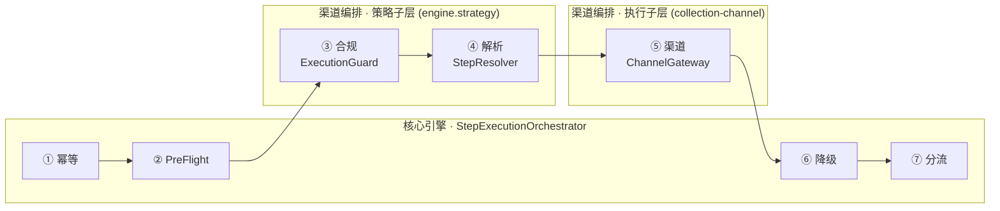
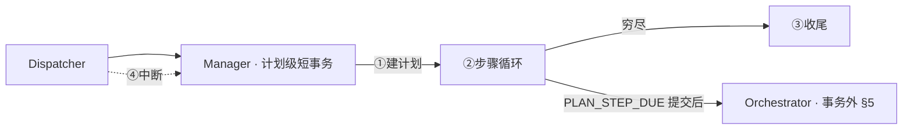
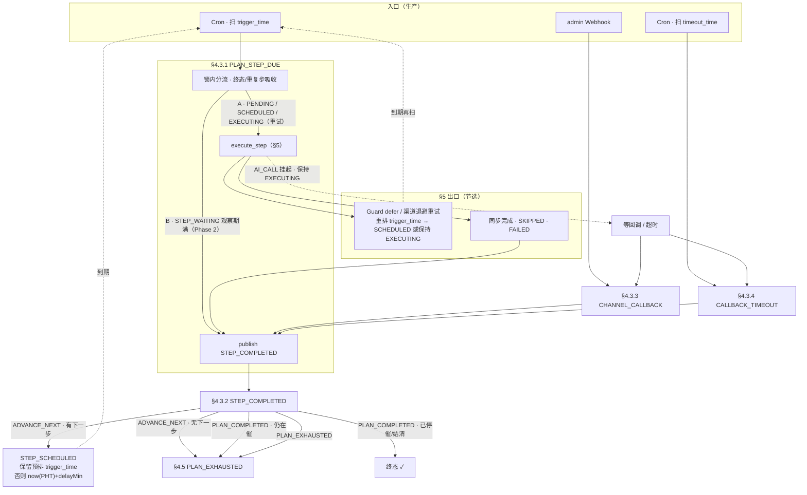
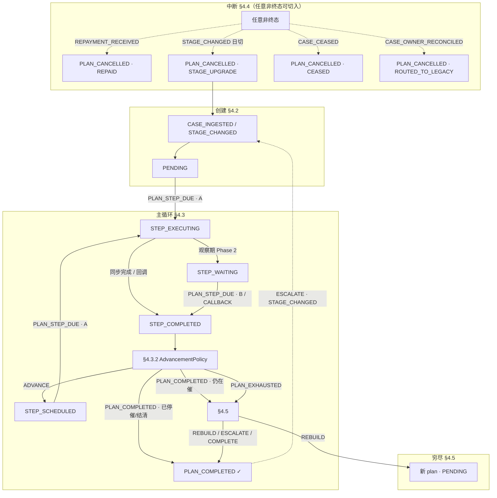
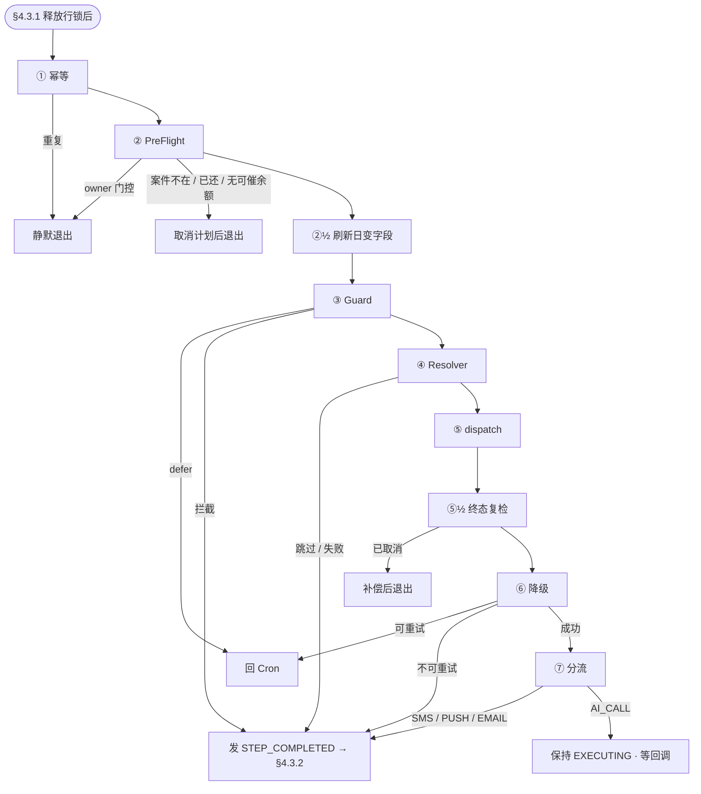
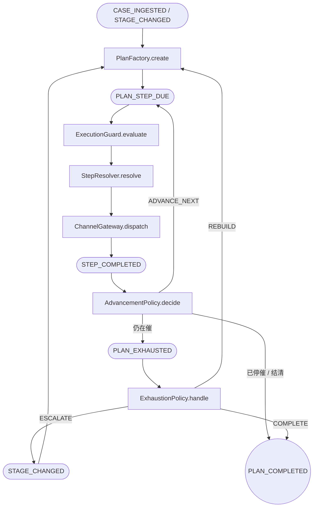

# MOCASA 催收系统升级 — Phase 1 核心引擎规格

> **版本**: Phase 1 · 仅覆盖菲律宾市场  
> **日期**: 2026-09-03  
> **状态**: ✅ 已确定（事件路由、状态机、七步管线、SPI SSOT）  
> **关联文档**: [产品需求文档 (PRD)](./MOCASA催收系统升级_Phase1_产品需求文档_PRD.md)、[架构设计文档](./MOCASA催收系统升级_Phase1_架构设计文档.md)、[基础设施交互规范](./MOCASA催收系统升级_Phase1_基础设施交互规范.md)、[领域模型 §2.6 / §6](./MOCASA催收系统升级_Phase1_领域模型与数据定义.md#6-eventpayload-字段定义)、[渠道总规格 §3.3](./channel/MOCASA催收系统升级_Phase1_collection-channel总规格.md#33-channel_callback-事件-payload)

---

## 目录

- [1. 引擎结构与边界](#1-引擎结构与边界)
  - [1.1 核心组件与职责](#11-核心组件与职责)
  - [1.2 模块边界与调用全景](#12-模块边界与调用全景)
- [2. 事件路由](#2-事件路由)
- [3. 运行时执行模型](#3-运行时执行模型)
  - [3.1 线程隔离（Trigger-to-Event）](#31-线程隔离trigger-to-event)
  - [3.2 并发与一致性模型](#32-并发与一致性模型)
- [4. 计划生命周期与状态机](#4-计划生命周期与状态机)
  - [4.1 状态定义](#41-状态定义)
  - [4.2 计划创建](#42-计划创建)
  - [4.3 步骤执行循环](#43-步骤执行循环)
  - [4.4 中断处理](#44-中断处理)
  - [4.5 穷尽续建](#45-穷尽续建)
  - [4.6 部分还款余额更新](#46-部分还款余额更新)
  - [4.7 PTP 到期处理（Phase 2 预留）](#47-ptp-到期处理)
  - [4.8 状态转换](#48-状态转换)
- [5. 步骤执行管线](#5-步骤执行管线)
- [6. SPI 接口契约](#6-spi-接口契约)
  - [6.1 接口职责与调用位置](#61-接口职责与调用位置)
  - [6.2 实现约束](#62-实现约束)
  - [6.3 入参与返回类型](#63-入参与返回类型)
- [7. 故障处置与恢复边界](#7-故障处置与恢复边界)
  - [7.1 引擎失败处置](#71-引擎失败处置)
  - [7.2 派生事件可靠投递](#72-派生事件可靠投递)
  - [7.3 渠道调用后的部分成功](#73-渠道调用后的部分成功)

---


## 1. 引擎结构与边界

本文是引擎内部行为的 SSOT：事件路由、并发模型、状态机、执行管线、SPI 契约与恢复机制均以本文为准。架构文档只说明跨模块边界与机制要点，不重复本文的伪代码、状态表、超时值或指标名。

本节交代引擎由哪些组件构成（§1.1）、与外部模块的边界与调用全景（§1.2），为后续事件路由（[§2](#2-事件路由)）、运行时执行模型（[§3](#3-运行时执行模型)）与计划生命周期（[§4](#4-计划生命周期与状态机)）提供结构地图。

### 1.1 核心组件与职责

`EventConsumerDispatcher` 是核心引擎的**唯一入口**——从 Redis Stream 消费事件，反序列化后按类型路由；其余三个核心类均为内部协作组件，不对外暴露调用。


| 类                           | 职责边界              | 拥有的逻辑                                                              |
| --------------------------- | ----------------- | ------------------------------------------------------------------ |
| `EventConsumerDispatcher`   | 事件消费 + 路由 + 提交后投递 | 反序列化、按类型路由、委托 `PlanLifecycleManager`（行锁与终态拦截在其短事务内）、COMMIT 后发布派生事件 |
| `PlanLifecycleManager`      | 计划级生命周期决策         | §4 全部伪代码（创建/中断/穷尽），事务内状态前置写入                                       |
| `StepExecutionOrchestrator` | 步骤级执行管线           | §5 全部伪代码（七步骨架），在非事务上下文中运行                                          |
| `PreFlightChecker`          | 系统级实时守卫           | 实时查 DB 确认案件存活；由 Orchestrator 调用，**不直接消费事件**                        |


**调用链路**：`Dispatcher` → `Manager`（事务内）→ COMMIT → `Orchestrator`（事务外）；`PreFlightChecker` 嵌在 Orchestrator 的 `execute_step` 第②步。

### 1.2 模块边界与调用全景

`StepExecutionOrchestrator` 按 [§5](#5-步骤执行管线) 七步顺序执行；③④⑤ 经 SPI（可替换接口，契约见 [§6](#6-spi-接口契约)）/ `ChannelGateway` 进入渠道编排，①②⑥⑦ 在引擎内完成：


```mermaid
flowchart LR
    subgraph engine["核心引擎 · StepExecutionOrchestrator"]
        S1["① 幂等"]
        S2["② PreFlight"]
        S6["⑥ 降级"]
        S7["⑦ 分流"]
    end

    subgraph strategy["渠道编排 · 策略子层 (engine.strategy)"]
        S3["③ 合规<br/>ExecutionGuard"]
        S4["④ 解析<br/>StepResolver"]
    end

    subgraph exec["渠道编排 · 执行子层 (collection-channel)"]
        S5["⑤ 渠道<br/>ChannelGateway"]
    end

    S1 --> S2 --> S3 --> S4 --> S5 --> S6 --> S7
```


> 七步顺序与 [§5](#5-步骤执行管线) 一致；⑤ 与 ⑥ 之间另有 ⑤½ 取消复检（引擎内，本图从略）。

---


## 2. 事件路由

本节是事件的**声明性目录**：下表是 Dispatcher 消费并路由的全部外部事件的唯一权威清单（Phase 1 共 11 行，SSOT），并说明各事件如何在 Dispatcher / Manager / Orchestrator 之间协作。处理动作与详见均以本表为准。「生命周期域」为 ①创建 / ②运行中 / ③收尾 / ④中断。`owner` 表示该案当日是否由本系统负责。事件如何被多线程承载与并发约束见 [§3](#3-运行时执行模型)。计划状态名与合法迁移见 [§4.8](#48-状态转换)。


| 事件                      | 生命周期域       | 引擎侧处理动作                                                         | 详见                                 |
| ----------------------- | ----------- | --------------------------------------------------------------- | ---------------------------------- |
| `CASE_INGESTED`         | ① 创建        | 创建计划（该案当日由本系统负责；拒绝结清/停催）                                        | [§4.2](#42-计划创建)                   |
| `CASE_OWNER_RECONCILED` | ④ 中断        | 取消活跃计划并交回旧系统（该案当日不再由本系统负责），`cancel_reason=ROUTED_TO_LEGACY`，不续建 | [§4.4](#44-中断处理)                   |
| `STAGE_CHANGED`         | ① 创建 + ④ 中断 | 取消旧阶段计划 → 创建新阶段计划（须该案当日由本系统负责）                                  | [§4.2](#42-计划创建)、[§4.4](#44-中断处理)  |
| `REPAYMENT_RECEIVED`    | ④ 中断        | **整笔结清**：取消活跃计划 + 清理已注册 Job                                     | [§4.4](#44-中断处理)                   |
| `CASE_BALANCE_UPDATED`  | ② 运行中更新     | **部分还款**：刷新快照运行态金额与下一期提醒字段；不改 stage                             | [§4.6](#46-部分还款余额更新)               |
| `PLAN_STEP_DUE`         | ② 步骤循环      | 按状态分流执行；该案当日不由本系统负责则跳过、不取消计划                                    | [§4.3](#43-步骤执行循环)、[§5](#5-步骤执行管线) |
| `CHANNEL_CALLBACK`      | ② 步骤循环      | 更新步骤结果 → 发布 `STEP_COMPLETED`                                    | [§4.3.3](#433-channel_callback)    |
| `CALLBACK_TIMEOUT`      | ② 步骤循环      | 标 `FAILED` → 发布 `STEP_COMPLETED`；该案当日不由本系统负责则跳过                 | [§4.3.4](#434-callback_timeout)    |
| `STEP_COMPLETED`        | ② 步骤循环      | 推进决策：注册下一步 / 计划完成 / 发布穷尽                                        | [§4.3.2](#432-step_completed)      |
| `PLAN_EXHAUSTED`        | ③ 收尾        | 按 `ExhaustionPolicy` 续建 / 升档 / 收口；该案当日不由本系统负责则跳过不续建             | [§4.5](#45-穷尽续建)                   |
| `CASE_CEASED`           | ④ 中断        | D+91 停催：取消活跃计划，**不再续建**                                         | [§4.4](#44-中断处理)                   |


所有事件经 `EventConsumerDispatcher` 进入，按类型交给 `PlanLifecycleManager`。①创建、②运行中、③收尾、④中断都在 Manager 短事务内做计划级决策（行锁 → 终态拦截 → 前置写，契约见 [§3.2](#32-并发与一致性模型)）。正常推进：①建计划 → ②步骤循环 → ③穷尽续建。④中断可作用于任意非终态计划，不插入主循环。

唯一跨出事务的交接：`PLAN_STEP_DUE` 在事务内把计划前置为可执行并提交后，才由 `StepExecutionOrchestrator` 跑 [§5](#5-步骤执行管线)（含 PreFlight）。其余事件不进 Orchestrator。


```mermaid
flowchart LR
    D["Dispatcher"] --> M["Manager · 计划级短事务"]
    M -->|"①建计划"| L["②步骤循环"]
    L -->|"穷尽"| E["③收尾"]
    D -.->|"④中断"| M
    L -->|"PLAN_STEP_DUE 提交后"| O["Orchestrator · 事务外 §5"]
```


事件的产生来源（外部上游 / 引擎链式 / 定时 Job）见 [领域模型 §6.2](./MOCASA催收系统升级_Phase1_领域模型与数据定义.md#62-逐事件-payload-字段)（发布者列）；链式发布的触发条件以 [§4.3](#43-步骤执行循环) / [§4.5](#45-穷尽续建) / [§5](#5-步骤执行管线) 伪代码为 SSOT。

---


## 3. 运行时执行模型

本节定义事件的**操作性执行模型**：[§3.1](#31-线程隔离trigger-to-event) 调度线程与 Consumer 线程如何隔离，[§3.2](#32-并发与一致性模型) 并行消费下如何保证一致性。两者构成同一因果链——Consumer 线程池的并行正是并发控制的前提。

### 3.1 线程隔离（Trigger-to-Event）

[§2](#21-事件路由表ssot) 路由表中的 `PLAN_STEP_DUE` 由调度线程**生产**，由 Consumer 线程池**消费**；其余业务事件仅由 Consumer 消费。两线程池严格隔离，杜绝调度与 I/O 密集操作耦合：

```
Cron 扫表 ──XADD──→ Redis Stream ──XREADGROUP──→ Consumer 执行业务
```


| 维度   | **Cron 调度线程**                       | **Consumer 业务线程**       |
| ---- | ----------------------------------- | ----------------------- |
| 线程池  | 调度订阅消费线程（Cloud Scheduler → Pub/Sub） | Redis Stream 消费线程池      |
| 职责   | 扫表发现到期步骤 → `XADD` 发事件               | `XREADGROUP` 消费 → 引擎全链路 |
| 耗时约束 | 毫秒级返回；**禁止**渠道 I/O 等阻塞              | 允许阻塞；供应商变慢仅占用本池         |


**事件分工**（横切维度，与上表正交）：


| 事件                        | Cron                     | Consumer                            |
| ------------------------- | ------------------------ | ----------------------------------- |
| `PLAN_STEP_DUE`           | **生产**（扫 `trigger_time`） | **消费**（分流 → `execute_step`）         |
| `CALLBACK_TIMEOUT`        | **生产**（扫 `timeout_time`） | **消费**（标 FAILED → `STEP_COMPLETED`） |
| 其余 8 种（`CASE_INGESTED` 等） | 不参与                      | 消费 + 执行                             |


> 两池不共享线程；生产线程池、背压与 PEL 的实现参数以 [基础设施 §2.2](./MOCASA催收系统升级_Phase1_基础设施交互规范.md#22-生产消费拓扑线程职责与背压) 为准。Consumer 并行消费正是 [§3.2](#32-并发与一致性模型) 的前提。


### 3.2 并发与一致性模型

Consumer 并行消费时，同一计划可能同时收到「步骤到期触达」与「还款取消」等事件。典型事故是**还款已取消计划却仍发出触达**。下表是五类风险的总索引。前提都是 Consumer 并行；机制写在真正发生那次写入的章节——①②是消费/锁层（本节），③是计划终态规则（[§4.4](#44-中断处理)），④是锁外管线复检（[§5](#5-步骤执行管线) ②⑤½），⑤是发件箱（[§7.2](#72-派生事件可靠投递)）。不把后文伪代码搬进本节。

#### 五类一致性风险（总览）


| 风险与应对                           | 机制所在                            |
| ------------------------------- | ------------------------------- |
| ① **并发写坏**：行锁串行 + 锁内禁 I/O       | **本节 ↓**                        |
| ② **重复执行**：`XACK` / DLQ + 步骤幂等键 | **本节 ↓**；步骤级见 [§5](#5-步骤执行管线) ① |
| ③ **乱序覆盖**：终态先写先赢               | [§4.4](#44-中断处理)                |
| ④ **迟到真相**：I/O 前后复检             | [§5](#5-步骤执行管线) ②⑤½             |
| ⑤ **派生事件丢失**：事件与状态迁移同事务落发件箱     | [§7.2](#72-派生事件可靠投递)            |


> **③ 要点**：`REPAID > CEASED > STAGE_UPGRADE > 非终态` 为语义/审计参考，非运行时覆盖规则。投诉/争议冻结为 Phase 2 能力，不属于本阶段状态机。


#### ① 防并发写坏：串行锁 + 锁内轻量

**串行锁**：同一 `plan_id` 的并发事件在 `SELECT FOR UPDATE` 处排队，一次只让一个 Consumer 改计划。
**锁内轻量**：持锁期间只做状态校验 + 前置写（如 → `STEP_EXECUTING` / `PLAN_CANCELLED`），COMMIT 后立即释放；渠道 I/O、远程调用等慢操作一律放到锁外。

所有事件经 Dispatcher 消费后，第一步即进入上述短事务——同一计划的并发事件被串行化，锁窗口保持毫秒级，不会因渠道超时导致锁堆积。

**① 的代价（有界越界）**：锁外 I/O 期间计划可能被取消，**已发出的触达无法撤回**（秒级窗口）。Phase 1 接受此取舍：计划仍取消、后续不再执行；写入补偿 timeline / 告警。④ 多级复检（[§5](#5-步骤执行管线) ②⑤½）可减轻误推进，但不能消除已发出触达。

#### ② 防重复执行：消费层幂等

Redis Stream 的消费语义保证：


| 场景             | 行为                                     | 典型原因                                                                                   |
| -------------- | -------------------------------------- | -------------------------------------------------------------------------------------- |
| 处理成功           | `XACK`，消息不再投递                          | —                                                                                      |
| 处理失败（**可重试**）  | 不 ACK → pending list → 自动重投递           | DB 短暂不可用、锁等待超时、计划级 SPI 超时、进程崩溃于 ACK 前                                                  |
| 处理失败（**不可重试**） | 跳过 ACK → 直接 DLQ + 告警                   | payload 反序列化失败（畸形消息，重投必败）                                                              |
| 可重试但达投递上限      | DLQ + 告警（毒消息）                          | 代码缺陷或数据异常导致持续失败（默认上限 5 次，见 [基础设施附录 A.2](./MOCASA催收系统升级_Phase1_基础设施交互规范.md#a2-引擎与事件总线)） |
| 重复投递到达         | 步骤 `idempotency_key` SETNX 吸收；终态计划直接退出 | Stream 重投或并发重复消费                                                                       |


消费 ACK 语义属于路由/线程层；`idempotency_key` 的具体实现见 [§5](#5-步骤执行管线) ①，DLQ 配置见 [基础设施交互规范](./MOCASA催收系统升级_Phase1_基础设施交互规范.md)。

#### 时序例证（①②④ 交织）

`PLAN_STEP_DUE`（执行）与 `REPAYMENT_RECEIVED`（中断）争锁的典型场景：A 先获锁并进入锁外 I/O，B 在 I/O 窗口内取消计划，A 返回后 ④ 复检丢弃结果；触达可能已发出（有界越界）。若 B 先获锁，A 见终态静默退出（② 终态吸收）。

```
Consumer-A (PLAN_STEP_DUE)           Consumer-B (REPAYMENT_RECEIVED)
    │                                      │
    │── SELECT FOR UPDATE plan ──→         │── SELECT FOR UPDATE plan (阻塞)
    │   → status = STEP_EXECUTING          │
    │── COMMIT ──→                          │── 获取锁 → PLAN_CANCELLED → COMMIT
    │   渠道 I/O 进行中...                  │
    │   返回后重读发现 PLAN_CANCELLED        │
    │   → 静默丢弃，写补偿日志               │
```

更多竞态分支（中断乱序、重复投递、升档 vs 还款等）见 [§4.4](#44-中断处理) / [§5](#5-步骤执行管线)；完整覆盖由集成测试保证。

---


## 4. 计划生命周期与状态机

本节按计划生命周期展开：先定义状态词汇表，再按时间顺序列出从创建到终态的流转，最后以状态转换总表和转换图固化规则。§4.2–§4.6 各节「写入」只记本处理器落盘的计划态；下一跳与合法迁移见各节伪代码与 [§4.8](#48-状态转换)。步骤级横向协作见 [§5](#5-步骤执行管线)，即 §4.3「执行步骤」的内部展开；部分还款不改计划态，见 [§4.6](#46-部分还款余额更新)。

### 4.1 状态定义

计划级状态机共 **6 态**（4 非终态 + 2 终态），已覆盖引擎管辖的完整生命周期；步骤级状态（`SCHEDULED` / `EXECUTING` / `COMPLETED` 等）见 [领域模型](./MOCASA催收系统升级_Phase1_领域模型与数据定义.md)，不在此表重复。


| 状态               | 类型     | 语义                                                                                                                           |
| ---------------- | ------ | ---------------------------------------------------------------------------------------------------------------------------- |
| `PENDING`        | 非终态    | 计划刚创建，尚未执行任何步骤，等待首步 `trigger_time`                                                                                           |
| `STEP_SCHEDULED` | 非终态    | 上一步已结束，下一步 Job 已注册，等待到期                                                                                                      |
| `STEP_EXECUTING` | 非终态    | 当前步骤执行中。Phase 1 的 AI_CALL 在此态等 Webhook（[§4.3.3](#433-channel_callback) / [§4.3.4](#434-callback_timeout)），不是 `STEP_WAITING`  |
| `STEP_WAITING`   | 非终态    | 消息已发出、观察期内等用户响应。Phase 1 不进入；Phase 2 消息渠道（如 Viber / WhatsApp）才使用                                                              |
| `PLAN_COMPLETED` | **终态** | 本计划正常收口；落入条件见 [§4.3.2](#432-step_completed) / [§4.5](#45-穷尽续建)                                                               |
| `PLAN_CANCELLED` | **终态** | 被中断取消；`cancel_reason` 枚举见 [领域模型 §2.7](./MOCASA催收系统升级_Phase1_领域模型与数据定义.md#27-cancelreason计划取消原因)，Phase 1 写入见 [§4.4](#44-中断处理) |


### 4.2 计划创建

**写入**：新计划 → `PENDING`；同时写入首步 `trigger_time`。
**触发事件**：`CASE_INGESTED` / `STAGE_CHANGED`（链 [§2](#21-事件路由表ssot)）。
**关联 SPI**：`PlanFactory`（链 [§6.1](#61-接口职责与调用位置)）。

从 payload 组装快照后落盘（不读 `t_ai_collection`）。首步到期由 [§4.3.1](#431-plan_step_due) 进入 `STEP_EXECUTING`。发布条件见 [数据接入 §3](./MOCASA催收系统升级_Phase1_数据接入规格.md#3-案件消息处理主链路) 与 [数据接入 §4](./MOCASA催收系统升级_Phase1_数据接入规格.md#4-dpd-日切)。引擎拒绝 `CEASED` / `SETTLED` 快照；`owner_date` 不是当日则静默返回。

```python
def on_case_ingested(event):
    # 快照由 payload 组装，不读 t_ai_collection（决策 B，见领域 §4.4）
    case_info = build_case_info_from_payload(event)
    snapshot  = build_snapshot_from_payload(event)

    plan = PlanFactory.create(case_info, event.stage, snapshot)   # → SPI §6.1
    if plan is None:
        return                        # 该案件不需要创建计划

    plan.status = PENDING
    first_step = plan.steps[0]
    # DayBlock 模板已写 PHT 绝对槽位则保留；扁平 delayMinutes 模板才回退计算。
    if first_step.trigger_time is None:
        first_step.trigger_time = now(PHT) + max(0, first_step.delay_minutes)
    with transaction():               # 计划+步骤+首步 trigger_time 原子落盘
        save(plan)                    # 持久化计划 + 步骤序列
```

**幂等约束**：同一 `case_id + stage` 不得重复建计划，且任一时刻仅一个非终态计划（升档 [§4.4](#44-中断处理) / 续建 [§4.5](#45-穷尽续建) 时先终态旧计划）。

**失败处理**：`PlanFactory` 抛错、超时或返回非法 `null` 时 NACK；`PlanFactory=null` 表示正常不建计划。`save(plan)` 失败时事务回滚并 NACK，事件重投后重新创建。

### 4.3 步骤执行循环

**触发事件**：`PLAN_STEP_DUE` / `CHANNEL_CALLBACK` / `STEP_COMPLETED`（及 Cron 产生的 `CALLBACK_TIMEOUT` 哨兵；事件名均非计划状态，链 [§2](#21-事件路由表ssot)）。
**关联 SPI**：`ExecutionGuard` / `StepResolver` / `ChannelGateway` / `AdvancementPolicy`（链 [§6.1](#61-接口职责与调用位置)）。

计划态写入见各小节「写入」。Phase 1 的 AI_CALL 挂起保持 `STEP_EXECUTING`（下图虚线），与场景 B 的 `STEP_WAITING` 观察期不是同一条路径。


| 小节                              | 触发事件               | 职责                                     |
| ------------------------------- | ------------------ | -------------------------------------- |
| [§4.3.1](#431-plan_step_due)    | `PLAN_STEP_DUE`    | 锁内分流：A 到期执行 / B 观察期结转（Phase 2）         |
| [§4.3.2](#432-step_completed)   | `STEP_COMPLETED`   | 推进下一步 / 计划完成 / 发布穷尽                    |
| [§4.3.3](#433-channel_callback) | `CHANNEL_CALLBACK` | 供应商 Webhook → 写结果 → 发 `STEP_COMPLETED` |
| [§4.3.4](#434-callback_timeout) | `CALLBACK_TIMEOUT` | 回调超时 → 标 `FAILED` → 发 `STEP_COMPLETED` |


下方流程图按「入口 → 执行/回环 → 汇聚 → 推进」分层：多数路径经 `STEP_COMPLETED` 进入 §4.3.2；Guard defer 与渠道退避重试不经汇聚，直接重排 `trigger_time` 后回到 Cron。线程隔离见 [§3.1](#31-线程隔离trigger-to-event)，单步分支详见 [§5](#5-步骤执行管线)。


```mermaid
flowchart TB
    subgraph in["入口（生产）"]
        C1["Cron · 扫 trigger_time"]
        C2["Cron · 扫 timeout_time"]
        WH["admin Webhook"]
    end

    subgraph s431["§4.3.1 PLAN_STEP_DUE"]
        S1["锁内分流 · 终态/重复步吸收"]
        EX["execute_step（§5）"]
        S1 -->|"A · PENDING / SCHEDULED / EXECUTING（重试）"| EX
        S1 -->|"B · STEP_WAITING 观察期满（Phase 2）"| HUB
    end

    subgraph s5out["§5 出口（节选）"]
        LOOP["Guard defer / 渠道退避重试<br/>重排 trigger_time → SCHEDULED 或保持 EXECUTING"]
        SYNC["同步完成 · SKIPPED · FAILED"]
    end

    CB["§4.3.3 CHANNEL_CALLBACK"]
    TO["§4.3.4 CALLBACK_TIMEOUT"]
    HUB["publish STEP_COMPLETED"]
    ADV["§4.3.2 STEP_COMPLETED"]

    C1 --> S1
    C2 --> TO
    WH --> CB

    EX --> LOOP
    EX --> SYNC
    EX -.->|"AI_CALL 挂起 · 保持 EXECUTING"| ASYNC["等回调 / 超时"]
    LOOP -.->|"到期再扫"| C1
    SYNC --> HUB
    ASYNC --> CB
    ASYNC --> TO
    CB --> HUB
    TO --> HUB

    HUB --> ADV
    ADV -->|"ADVANCE_NEXT · 有下一步"| NEXT["STEP_SCHEDULED<br/>保留预排 trigger_time<br/>否则 now(PHT)+delayMin"]
    ADV -->|"ADVANCE_NEXT · 无下一步"| EXH["§4.5 PLAN_EXHAUSTED"]
    ADV -->|"PLAN_COMPLETED · 仍在催"| EXH
    ADV -->|"PLAN_COMPLETED · 已停催/结清"| DONE["终态 ✓"]
    ADV -->|PLAN_EXHAUSTED| EXH
    NEXT -.->|"到期"| C1
```


> **读图**：实线＝步骤终态汇入 `STEP_COMPLETED`；虚线＝不经汇聚的回环（defer/重试重排 `trigger_time`，或 AI_CALL 保持 `STEP_EXECUTING` 等回调/超时）。场景 B 的 `STEP_WAITING` 是消息观察期满结转、不再触达，Phase 2 才进入；Phase 1 的 SMS/PUSH/EMAIL 同步完成，不进 WAITING。横切中断见 [§4.4](#44-中断处理)，未在本图展开。


#### 4.3.1 PLAN_STEP_DUE

**写入**：场景 A → `STEP_EXECUTING`（COMMIT 后锁外 `execute_step`）；场景 B（Phase 2 观察期满）步骤标完成并投递 `STEP_COMPLETED`，不触达、不进入执行态。
**触发事件**：`PLAN_STEP_DUE`（链 [§2](#21-事件路由表ssot)）。
**关联 SPI**：—（锁外见 [§5](#5-步骤执行管线)）。

场景 A 覆盖 `PENDING` / `STEP_SCHEDULED` / 退避重试时的 `STEP_EXECUTING`。锁外管线见 [§5](#5-步骤执行管线)；Guard defer 见其中 ③。

```python
def on_plan_step_due(event):
    # ── 事务 1（毫秒级：锁 → 校验 → 状态前置 → 释放） ──
    events = []
    with transaction():
        plan = get_plan_with_lock(event.plan_id)  # SELECT FOR UPDATE
        if plan is None or plan.status in (PLAN_COMPLETED, PLAN_CANCELLED):
            return                                 # 终态拦截

        step = plan.get_current_step()

        if plan.status in (PENDING, STEP_SCHEDULED, STEP_EXECUTING):
            plan.status = STEP_EXECUTING           # 含退避重试再触发；COMMIT 后释放行锁
        elif plan.status == STEP_WAITING:
            step.status = COMPLETED
            if step.result is None:
                step.result = SENT_NO_RESPONSE
            events.append(STEP_COMPLETED)          # 事务内落发件箱，不在事务内 XADD；提交后投递（§7.2）
            return events
    # ── 事务已提交，行锁已释放 ──

    # ── 非事务上下文：渠道 I/O（允许耗时数百毫秒~数秒） ──
    execute_step(plan, step)                       # 展开见 §5
    # Guard defer（§5 ③）：step.trigger_time ← deferUntil，plan ← STEP_SCHEDULED，直接 return
    # 不经 STEP_COMPLETED；Cron 到期后再投递 PLAN_STEP_DUE → 重入本函数场景 A
```


#### 4.3.2 STEP_COMPLETED

**写入**：有下一步 → `STEP_SCHEDULED`；策略收口且已不在催 → `PLAN_COMPLETED`；仍在催或策略穷尽 → 发布 `PLAN_EXHAUSTED`（本节不终态化，见 [§4.5](#45-穷尽续建)）。
**触发事件**：`STEP_COMPLETED`（链 [§2](#21-事件路由表ssot)）。
**关联 SPI**：`AdvancementPolicy`（链 [§6.1](#61-接口职责与调用位置)）。

**闸门**：`AdvancementPolicy` 的 `PLAN_COMPLETED` 表示策略认为本计划可收口。引擎在仍在催（快照 `collectionStatus` 非 `CEASED` / `SETTLED`、非结清）时改写为 `PLAN_EXHAUSTED`，由 [§4.5](#45-穷尽续建) 决定 `REBUILD` / `ESCALATE` / `COMPLETE`。此闸门在引擎。

不变量：仍在催 ∧ 未结清 ∧ 未停催 ∧ 投影有 stage ⇒ 必须有活跃计划，或穷尽已 `COMPLETE`（已达 S4 / 无法再升）。

```python
def on_step_completed(plan, completed_step):
    decision = AdvancementPolicy.decide(context, step_result)   # → SPI §6.1

    if decision == ADVANCE_NEXT:
        next_step = get_next_step(plan, completed_step)
        if next_step is None:
            publish(PLAN_EXHAUSTED)                # 本计划已无后续步骤 → §4.5
            return
        # DayBlock 已预排绝对 trigger_time 时保留；否则按 delayMinutes 回退。
        if next_step.trigger_time is None:
            next_step.trigger_time = now(PHT) + max(0, next_step.delay_minutes)
        # 均由 Cron 在 trigger_time 到期后发 PLAN_STEP_DUE（非同步递归 execute_step）
        plan.status = STEP_SCHEDULED

    elif decision == PLAN_COMPLETED:
        if still_in_collection(plan):              # 非 CEASED / SETTLED / 结清
            publish(PLAN_EXHAUSTED)                # 引擎改写，不采纳策略停催
            return
        plan.status = PLAN_COMPLETED               # 已不在催，本计划收口

    elif decision == PLAN_EXHAUSTED:
        publish(PLAN_EXHAUSTED)                    # → §4.5
```

**失败处理**：`AdvancementPolicy` 抛错、超时或返回非法 `null` 时 NACK；步骤推进状态未提交，事件重投后重新决策。

#### 4.3.3 CHANNEL_CALLBACK

**写入**：不改计划态。Phase 1 须为 `STEP_EXECUTING`（AI_CALL 等回调）；步骤 → `COMPLETED`，发 `STEP_COMPLETED`。Phase 2 亦接受 `STEP_WAITING`。
**触发事件**：`CHANNEL_CALLBACK`（链 [§2](#21-事件路由表ssot)）。

Webhook 经 `collection-admin` 鉴权后发布。Phase 1 **仅 AI_CALL** 走本事件；SMS/PUSH/EMAIL `dispatch` 成功即同步完成，不进 `STEP_WAITING`。

> **Timeline 落库**：admin Webhook 仅鉴权、规范化并发布事件；引擎在本事务中更新 step，并经 `TimelineRepository` 写回调结果 timeline 后发布 `STEP_COMPLETED`。channel 不直接写 timeline。

```python
def on_channel_callback(event):
    events = []
    with transaction():
        plan = get_plan_with_lock(event.plan_id)       # SELECT FOR UPDATE 串行化重复回调
        if plan.status not in (STEP_EXECUTING, STEP_WAITING):
            return events                              # 非执行/等待态（已处理或已取消），静默吸收

        step = plan.get_current_step()
        step.result = map_callback_to_result(event)    # AI_CALL disposition；WAITING 为 Phase 2 预留
        step.status = COMPLETED
        write_timeline(step.result, event.providerMsgId)
        events.append(STEP_COMPLETED)
    return events                                      # 已随本事务入发件箱；提交后由 Dispatcher 投递（§7.2）
```


#### 4.3.4 CALLBACK_TIMEOUT

**写入**：不改计划态（须为 `STEP_EXECUTING`）；步骤 → `FAILED`，发 `STEP_COMPLETED`。
**触发事件**：`CALLBACK_TIMEOUT`（链 [§2](#21-事件路由表ssot)）。

AI_CALL 停在 `STEP_EXECUTING` 等 Webhook 时，若回调不到达会卡死。Phase 1 由引擎超时哨兵收敛：进入异步执行时注册超时 Job（[§5 ⑦](#5-步骤执行管线)）；默认 **10 分钟**（`engine.step.callback_timeout_minutes`，见 [基础设施附录 A](./MOCASA催收系统升级_Phase1_基础设施交互规范.md#附录-a生产配置键索引)）。Cron 扫到 `timeout_time` 仍无回调 → 标 `FAILED` → 发布 `STEP_COMPLETED`。等待不占 Consumer；防重复拾取靠计划/步骤状态。

> **Timeline**：超时由引擎经 `TimelineRepository` 写入 FAILED 记录；admin/Cron 只发布 `CALLBACK_TIMEOUT`。

```python
def on_callback_timeout(event):
    events = []
    with transaction():
        plan = get_plan_with_lock(event.plan_id)
        if plan.status != STEP_EXECUTING:
            return events                          # 回调已正常处理，忽略

        step = plan.get_current_step()
        step.result = FAILED
        step.status = FAILED
        write_timeline(FAILED, error_code="CALLBACK_TIMEOUT")
        events.append(STEP_COMPLETED)
    return events                                  # 已随本事务入发件箱；提交后投递，由 AdvancementPolicy 决定下一步
```

> **标识落库**：dispatch 成功须把任务标识落入 `t_contact_timeline.provider_msg_id`，回调原始证据落 `t_channel_callback_audit.provider_msg_id`（[§5 ⑦](#5-步骤执行管线)）。⏳ 合作方查询 API 到位前，超时假失败只靠审计，不得自行重拨。


### 4.4 中断处理

**写入**：活跃计划 → `PLAN_CANCELLED`；`STAGE_CHANGED` 另建 `PENDING`。
**触发事件**：`REPAYMENT_RECEIVED` / `STAGE_CHANGED` / `CASE_CEASED` / `CASE_OWNER_RECONCILED`（链 [§2](#21-事件路由表ssot)）。Phase 1 经事件总线写入的 `cancel_reason` 仅 `REPAID` / `STAGE_UPGRADE` / `CEASED` / `ROUTED_TO_LEGACY`；`COMPLAINT` / `MANUAL` 为 Phase 2 预留，不经事件总线。
**关联 SPI**：—（纯引擎状态机；还款路径另调 `PredictiveDialerService`）。

整笔结清走本节取消；部分还款见 [§4.6](#46-部分还款余额更新)。结清判定见 [数据接入 §3.3](./MOCASA催收系统升级_Phase1_数据接入规格.md#33-按消息类型的处理矩阵)。无活跃计划时（含已 `ROUTED_TO_LEGACY`）还款事件对计划无写。`CASE_CEASED` 产出边界见 [数据接入 §4](./MOCASA催收系统升级_Phase1_数据接入规格.md#4-dpd-日切)。`STAGE_CHANGED` 在 owner 水位不是当日或该案 `owner_date≠当日` 时跳过。并发：`plan_id` 升序加锁 + 终态单调（[§3.2](#32-并发与一致性模型)）。

**失败处理**：计划读取或写入失败时 NACK，取消事务回滚；`PredictiveDialerService.filter_repaid_case` 失败时记录告警并继续，计划已处于 `PLAN_CANCELLED`。

```python
def on_repayment_received(case_id, user_id):
    plans = find_active_plans_by_case(case_id)     # status NOT IN 终态
    for plan in sorted(plans, key=lambda p: p.id): # 按 plan_id 升序加锁，防止死锁
        lock(plan)                                 # SELECT FOR UPDATE
        if plan.status in (PLAN_COMPLETED, PLAN_CANCELLED):
            continue                               # 终态不可逆：取锁后复检（§3.2），不覆盖
        plan.status = PLAN_CANCELLED
        plan.cancel_reason = REPAID
        cancel_scheduled_jobs(plan)
    PredictiveDialerService.filter_repaid_case(user_id, case_id)  # 失败 → 告警 + 继续

def on_stage_changed(case_id, new_stage):
    old_plans = find_active_plans_by_case(case_id)
    for plan in sorted(old_plans, key=lambda p: p.id):
        if plan.stage != new_stage:
            lock(plan)
            if plan.status in (PLAN_COMPLETED, PLAN_CANCELLED):
                continue                           # 终态不可逆：取锁后复检（§3.2），不覆盖
            plan.status = PLAN_CANCELLED
            plan.cancel_reason = STAGE_UPGRADE
            cancel_scheduled_jobs(plan)
    create_plan_for_stage(case_id, new_stage)       # 复用 §4.2 创建流程

def on_case_ceased(case_id):                        # D+91 完全停催：取消活跃计划，不续建
    old_plans = find_active_plans_by_case(case_id)
    for plan in sorted(old_plans, key=lambda p: p.id):  # 按 plan_id 升序加锁，防止死锁
        lock(plan)                                  # SELECT FOR UPDATE
        if plan.status in (PLAN_COMPLETED, PLAN_CANCELLED):
            continue                                # 终态不可逆：取锁后复检（§3.2），不覆盖
        plan.status = PLAN_CANCELLED
        plan.cancel_reason = CEASED
        cancel_scheduled_jobs(plan)
    # 不调用 create_plan_for_stage —— 停催后主动催收终止（区别于 STAGE_CHANGED 的取消+重建）

def on_case_owner_reconciled(case_id):              # 当日 NEW 缺席：迁出，不续建
    old_plans = find_active_plans_by_case(case_id)
    for plan in sorted(old_plans, key=lambda p: p.id):
        lock(plan)
        if plan.status in (PLAN_COMPLETED, PLAN_CANCELLED):
            continue
        plan.status = PLAN_CANCELLED
        plan.cancel_reason = ROUTED_TO_LEGACY
        cancel_scheduled_jobs(plan)
```


### 4.5 穷尽续建

**写入**：旧计划 → `PLAN_COMPLETED`；`REBUILD` 另建同 stage `PENDING`；`ESCALATE` 本事务不建新计划；`COMPLETE` 只终态。
**触发事件**：`PLAN_EXHAUSTED`（链 [§2](#21-事件路由表ssot)）。该案当日不由本系统负责则跳过不续建。
**关联 SPI**：`ExhaustionPolicy` / `PlanFactory`（链 [§6.1](#61-接口职责与调用位置)）。

`ExhaustionPolicy` 返回三值之一，按下表落地。本事件由 [§4.3.2](#432-step_completed) 在末步仍在催时发布。`REBUILD` 新计划首步 `trigger_time` 不得早于次日 08:00 PHT（已更晚则保留），避免末步接通后同日再触达；`ESCALATE` / 日切新建不在此钳制。`ESCALATE` 发件箱投递 `STAGE_CHANGED` 后由 [§4.2](#42-计划创建) 建新阶段。

**失败处理**：`ExhaustionPolicy` 或 `REBUILD` 内的 `PlanFactory` 抛错、超时或返回非法 `null` 时 NACK；当前事务回滚，`PLAN_EXHAUSTED` 重投后重新处理。owner 门控未过（水位不是当日，或该案 `owner_date ≠ 当日`）时**静默 ACK、不改终态、不续建**；迁出走 [§4.4](#44-中断处理) `CASE_OWNER_RECONCILED`。水位未到当日时本事件不再重投，仍属 NEW 的计划由 [§7.4](#74-停摆计划检测) 暴露。


| 返回值        | 场景                                            | 引擎动作                                                                           | Phase 1 策略实现                                                 |
| ---------- | --------------------------------------------- | ------------------------------------------------------------------------------ | ------------------------------------------------------------ |
| `REBUILD`  | **同阶段续建**：本轮步骤已跑完仍未还款，同 Stage 内再建一轮计划（换模板/策略） | `PlanFactory.create()` 同阶段新建 + 注册首步 Job                                        | ✅ `DefaultExhaustionPolicy`：续建次数 < `max_rebuild_count`（默认 2） |
| `ESCALATE` | **策略升档**：同 Stage 续建次数已用尽，提升催收强度               | 旧计划 → `PLAN_COMPLETED`，发件箱投递 `STAGE_CHANGED`；消费时旧计划已终态，走 [§4.2](#42-计划创建) 建新阶段 | ✅ 续建超限且 Stage 可升（S1→S2→…→S4）                                 |
| `COMPLETE` | **停止主动触达**：续建与升档均无可行路径                        | 标记 `PLAN_COMPLETED`                                                            | ✅ 已达 S4 或无法升档；Mock 恒返回 COMPLETE                              |


> `REBUILD` 有续建次数上限（`engine.plan.max_rebuild_count`），达到上限后策略层应返回 `ESCALATE` 或 `COMPLETE`。

```python
def on_plan_exhausted(event):
    plan = get_plan_with_lock(event.plan_id)
    if plan.status in (PLAN_COMPLETED, PLAN_CANCELLED):
        return
    if owner_gate_blocks(plan.case_id):           # 水位不是当日，或该案 owner_date ≠ 当日
        return                                    # 不续建、不改终态；迁出走 §4.4

    # 续建复用旧计划快照，不回读 t_ai_collection；后续步骤发送前仍会按 §5②½
    # 覆盖内存中的 dpd / 运行态金额 / stage，保证用户可见文案取发送时刻值。
    snapshot = deserialize(plan.context_snapshot)
    case_info = case_info_from_snapshot(snapshot)

    result = ExhaustionPolicy.handle(plan, case_info, snapshot)   # → SPI §6.1

    if result.action == REBUILD:
        with transaction():                        # 原子：renewal_pending + 新 plan + 旧 plan 终态
            plan.renewal_pending = True              # 旧 plan 暂退出活跃唯一约束与 Cron 扫描
            create_plan_for_stage(plan.case_id, plan.stage, case_info, snapshot)  # 同 stage 新建
            clamp_first_step_to_next_pht_morning()   # 不得早于次日 08:00；已更晚则保留
            plan.status = PLAN_COMPLETED             # 新 plan 落库后再终态化旧 plan
    elif result.action == ESCALATE:
        with transaction():                        # 原子：旧 plan 终态 + 后继入发件箱
            plan.status = PLAN_COMPLETED
            enqueue_outbox(STAGE_CHANGED, new_stage=result.target_stage)  # 提交后投递；消费时走 §4.4 + §4.2
    elif result.action == COMPLETE:
        plan.status = PLAN_COMPLETED               # 终态，不再主动触达
```

> **崩溃安全**：`REBUILD` / `ESCALATE` 同事务原子提交；未提交则回滚，靠 `PLAN_EXHAUSTED` 重投重跑（下游幂等）。`ESCALATE` 的 `STAGE_CHANGED` 经发件箱投递（§7.2）。正常 `COMPLETE` 与半成品库态不可区分，不做 §7.4 扫描补救。


### 4.6 部分还款余额更新

**写入**：不改计划态；只更新活跃计划快照金额。
**触发事件**：`CASE_BALANCE_UPDATED`（发布判定与 payload 口径见 [数据接入 §3.3](./MOCASA催收系统升级_Phase1_数据接入规格.md#33-按消息类型的处理矩阵)；链 [§2](#21-事件路由表ssot)）。
**关联 SPI**：—（不调策略 SPI）。

```python
def on_case_balance_updated(event):
    if event.case_id is None or event.total_outstanding is None or event.total_outstanding < 0:
        return                                      # 脏事件静默忽略

    plans = find_active_plans_by_case(event.case_id)
    for plan in sorted(plans, key=lambda p: p.id):
        lock(plan)                                  # SELECT FOR UPDATE
        if plan.status in (PLAN_COMPLETED, PLAN_CANCELLED):
            continue                                # 取锁后复检终态
        ctx = plan.context_snapshot.caseContext
        ctx.totalOutstanding = event.total_outstanding      # 必填，已校验非负
        for f in (overdueAmount, dpd, penaltyAmount,        # 可选：仅在事件携带该键时覆盖，
                  upcomingAmount, nextDueDate,              # 缺省保持旧值，不写 null
                  collectionStatus):
            if event.has(f):
                ctx[f] = event[f]
        save_context_snapshot(plan)
```

**可写字段全集**（`CaseContext` 内，实现见 `PlanLifecycleManager.onCaseBalanceUpdated`）：


| 字段                                                   | 必填性 | 说明                                       |
| ---------------------------------------------------- | --- | ---------------------------------------- |
| `totalOutstanding`                                   | 必填  | 缺失或为负则整个事件忽略                             |
| `overdueAmount` / `penaltyAmount` / `upcomingAmount` | 可选  | 运行态金额                                    |
| `nextDueDate`                                        | 可选  | 下一期提醒日期                                  |
| `dpd`                                                | 可选  | 数仓重算值，接入不自算；仅刷新快照列，**不推导 stage**         |
| `collectionStatus`                                   | 可选  | 由接入派生（`SETTLED` / `IN_COLLECTION`），引擎只透传 |


本事件只改活跃计划快照的运行态金额；后续步骤沿用原计划与话术，渲染时读更新后的金额。`stage` 由 `STAGE_CHANGED` 驱动（[§4.4](#44-中断处理)）。可选字段采用「事件携带才覆盖」，缺省保持旧值。

### 4.7 PTP 到期处理（Phase 2 预留）

**Phase 2 预留**：Phase 1 不做 PTP，不生产/不消费 `PTP_EXPIRED`（枚举仅前向兼容，见 [领域模型 §2.7](./MOCASA催收系统升级_Phase1_领域模型与数据定义.md#27-cancelreason计划取消原因)）。实时还款仍走 [§5 ②](#5-步骤执行管线) / [§4.4](#44-中断处理)。需要产品确认到期信号源与 keep/break 规则后再实现。

### 4.8 状态转换

本节为计划状态机**唯一完整 SSOT**；穷尽续建细节见 [§4.5](#45-穷尽续建)。


```mermaid
flowchart TB
    subgraph create ["创建 §4.2"]
        IN["CASE_INGESTED / STAGE_CHANGED"] --> PENDING
    end

    subgraph main ["主循环 §4.3"]
        PENDING -->|PLAN_STEP_DUE · A| EXEC["STEP_EXECUTING"]
        SCHED["STEP_SCHEDULED"] -->|PLAN_STEP_DUE · A| EXEC
        EXEC -->|观察期 Phase 2| WAIT["STEP_WAITING"]
        EXEC -->|同步完成 / 回调| SC["STEP_COMPLETED"]
        WAIT -->|PLAN_STEP_DUE · B / CALLBACK| SC
        SC --> AP["§4.3.2 AdvancementPolicy"]
        AP -->|ADVANCE| SCHED
        AP -->|PLAN_COMPLETED · 仍在催| EXH["§4.5"]
        AP -->|PLAN_COMPLETED · 已停催/结清| DONE["PLAN_COMPLETED ✓"]
        AP -->|PLAN_EXHAUSTED| EXH
    end

    subgraph exhaust ["穷尽 §4.5"]
        EXH -->|REBUILD| NP["新 plan · PENDING"]
        EXH -->|REBUILD / ESCALATE / COMPLETE| DONE
        DONE -.->|ESCALATE · STAGE_CHANGED| IN
    end

    subgraph intr ["中断 §4.4（任意非终态可切入）"]
        INTR["任意非终态"] -.->|REPAYMENT_RECEIVED| CR["PLAN_CANCELLED · REPAID"]
        INTR -.->|STAGE_CHANGED 日切| CS["PLAN_CANCELLED · STAGE_UPGRADE"]
        CS --> IN
        INTR -.->|CASE_CEASED| CC["PLAN_CANCELLED · CEASED"]
        INTR -.->|CASE_OWNER_RECONCILED| CL["PLAN_CANCELLED · ROUTED_TO_LEGACY"]
    end
```


> **读图**：实线＝主循环与创建；**虚线**＝中断横切。`STEP_EXECUTING` 上的 AI_CALL 经 `CHANNEL_CALLBACK` / `CALLBACK_TIMEOUT` → `STEP_COMPLETED`（见 [§4.3](#43-步骤执行循环)），未单独画边。Phase 1 消息类渠道同步完成，不进 `STEP_WAITING`；`STEP_WAITING` 仅 Phase 2 消息观察期。
>
> 日切 `STAGE_CHANGED` 与穷尽 `ESCALATE` 的分工见 [数据接入 §4](./MOCASA催收系统升级_Phase1_数据接入规格.md#4-dpd-日切)：日切只在投影 stage 更严重时发布；`ESCALATE` 先终态旧计划再投递，消费时走 [§4.2](#42-计划创建) 建新阶段。

---


## 5. 步骤执行管线

本节是 [§4.3.1](#431-plan_step_due) 提交并释放行锁之后的 `execute_step`：计划已为 `STEP_EXECUTING`。同步渠道走完发布 `STEP_COMPLETED` 回 [§4.3.2](#432-step_completed)；AI_CALL 保持 `STEP_EXECUTING`，等 [§4.3.3](#433-channel_callback) / [§4.3.4](#434-callback_timeout)。③④⑤ 经 SPI（[§6.1](#61-接口职责与调用位置)）。下图只画控制流与出口；横切失败见下表（引擎级汇总见 [§7.1](#71-统一处置规则)）；伪代码为业务路径写入权威。


```mermaid
flowchart TD
    entry(["§4.3.1 释放行锁后"]) --> s1["① 幂等"]
    s1 -->|重复| silent["静默退出"]
    s1 --> s2["② PreFlight"]
    s2 -->|owner 门控| silent
    s2 -->|案件不在 / 已还 / 无可催余额| cancel["取消计划后退出"]
    s2 --> s25["②½ 刷新日变字段"]
    s25 --> s3["③ Guard"]
    s3 -->|defer| cron["回 Cron"]
    s3 -->|拦截| done["发 STEP_COMPLETED → §4.3.2"]
    s3 --> s4["④ Resolver"]
    s4 -->|跳过 / 失败| done
    s4 --> s5["⑤ dispatch"]
    s5 --> s55["⑤½ 终态复检"]
    s55 -->|已取消| compensate["补偿后退出"]
    s55 --> s6["⑥ 降级"]
    s6 -->|可重试| cron
    s6 -->|不可重试| done
    s6 -->|成功| s7["⑦ 分流"]
    s7 -->|SMS / PUSH / EMAIL| done
    s7 -->|AI_CALL| async["保持 EXECUTING · 等回调"]
```


> **读图**：四类出口——静默退出、取消计划后退出、回 Cron（不经 `STEP_COMPLETED`）、发 `STEP_COMPLETED` 或保持 `STEP_EXECUTING` 等回调。PreFlight 通过后须 `markStepExecuting`；抢不到则静默退出。Phase 2 观察期（`STEP_WAITING`）见伪代码 ⑦。

**失败处理**（业务旁路已在图与伪代码中；本表只列基础设施 / SPI 非法 / 锁 / 渠道后写失败）：


| 位置   | 条件                                 | 处置                                               |
| ---- | ---------------------------------- | ------------------------------------------------ |
| ①–②  | 执行锁 Redis 或 PreFlight MySQL 不可用    | 释放已获锁后 NACK                                      |
| ③    | Guard 抛错、超时、非法 `null`、合规 Redis 不可用 | `SKIPPED` + `GUARD_ERROR` + `STEP_COMPLETED`；不触达 |
| ④    | Resolver 抛错或超时                     | `FAILED` + `STEP_COMPLETED`                      |
| ④ 后  | `decision_log` 失败                  | 仅告警，继续 dispatch                                  |
| ⑤    | `dispatch` **前**可重试异常              | 释放执行锁后 NACK                                      |
| ⑤    | `dispatch` **已调用**后抛异常             | 保留锁；`FAILED` + `CHANNEL_OUTCOME_UNKNOWN`，不重试     |
| ⑤½–⑦ | 已调用渠道后读计划 / 写状态 / 登记 Job 失败        | 不重试，按 [§7.3](#73-渠道调用后的部分成功)                     |


`STEP_COMPLETED` 与步骤状态迁移同事务入发件箱，提交后投递（[§7.2](#72-派生事件可靠投递)）。幂等 TTL：`max(engine.step.idempotency_ttl_minutes, callback_timeout_minutes)`。

```python
def execute_step(plan, step):
    # ── ① 执行锁 ──
    if not IdempotencyService.acquire(execution_lock_key, ttl_minutes=effective_idempotency_ttl):
        return
    dispatch_started = False
    try:
        # ── ② 系统级守卫（实时查 DB；owner 门控 / 案件存在 / 还款 / 无可催余额） ──
        preflight = PreFlightChecker.inspect(plan.case_id)
        if preflight.gated:                   # 水位不是当日或 owner_date ≠ 当日
            return                            # 不取消计划、不写 timeline
        if not preflight.passed:
            plan.status = PLAN_CANCELLED      # 含 CASE_NOT_FOUND / REPAID / NO_DUE_BALANCE
            skip_open_steps(plan)             # 否则消息渠道无 timeout，步骤会悬挂
            return

        # prepareStepDue 提交后，回调/超时可能已把步骤写成终态；抢不到则放弃，避免重复触达
        if not markStepExecuting(step.id):
            return

        # ── ②½ 渲染前刷新日变字段（复用 ② 的实时读，零新增 I/O） ──
        context = ContextAssembler.assemble(plan, step)
        overlay_from(preflight.case_info)     # 内存：dpd / 运行态金额 / stage（跟当天投影）
        # 不回写 context_snapshot 列。计划 stage 列仍只由 STAGE_CHANGED 改。

        # ── ③ 业务级守卫 ──
        try:
            verdict = ExecutionGuard.evaluate(context)   # → SPI §6.1
        except:
            skip_and_complete(GUARD_ERROR)      # 见失败表
            return
        if verdict is None:
            skip_and_complete(GUARD_ERROR)
            return
        if not verdict.allowed:
            if verdict.defer_until:
                step.trigger_time = verdict.defer_until
                step.status = PENDING
                plan.status = STEP_SCHEDULED
                release(execution_lock_key)
                return
            step.status = SKIPPED
            write_timeline(COMPLIANCE_BLOCKED, violation=verdict.blocked_reason)
            publish(STEP_COMPLETED)
            return

        # ── ④ 步骤解析 ──
        try:
            command = StepResolver.resolve(context)        # → SPI §6.1
        except:
            fail_and_complete(RESOLVER_ERROR)
            return
        if command is None:
            step.status = SKIPPED
            publish(STEP_COMPLETED)           # 不写 timeline
            return
        write_decision_log(context, command)  # fail-open，领域 §3.3

        # ── ⑤ 渠道调度 ──
        dispatch_started = True
        try:
            result = ChannelGateway.dispatch(command)
        except:
            result = unknown_failure(CHANNEL_OUTCOME_UNKNOWN)  # 不重试；锁保留到 TTL

        # ── ⑤½ 回写前取消检测 ──
        reloaded = reload_plan(plan.id)
        if reloaded is None or reloaded.status in (PLAN_COMPLETED, PLAN_CANCELLED):
            write_timeline(result, note="plan_cancelled_during_dispatch")
            return

        # ── ⑥ 故障降级 ──
        if not result.success:
            if result.retryable and step.retry_count < MAX_RETRY:
                step.retry_count += 1
                step.status = PENDING
                step.trigger_time = now(PHT) + backoff(step.retry_count)
                return                         # plan 保持 STEP_EXECUTING，回 Cron
            step.status = FAILED
            write_timeline(CHANNEL_ERROR, error_code=result.error_code)
            publish(STEP_COMPLETED)
            return

        mark_dispatched(step)                  # dispatched_at

        # ── ⑦ 渠道分流 ──
        if command.channel_type in (SMS, PUSH, EMAIL):
            write_timeline(result)
            publish(STEP_COMPLETED)           # Phase 1 同步完成，忽略 observationMinutes
        elif command.channel_type in (VIBER, WHATSAPP) and step.observation_minutes > 0:
            write_timeline(result)
            step.trigger_time = now(PHT) + observation_minutes   # Phase 2 预留
            plan.status = STEP_WAITING
        elif command.channel_type in (VIBER, WHATSAPP):
            write_timeline(result)
            publish(STEP_COMPLETED)
        else:  # AI_CALL（HUMAN_CALL Phase 2 预留）
            write_timeline(result, provider_msg_id=result.provider_msg_id)
            step.timeout_time = now(PHT) + callback_timeout_minutes
            # plan 保持 STEP_EXECUTING，等 §4.3.3 / §4.3.4
    except:
        if not dispatch_started:
            release(execution_lock_key)
        raise                                 # NACK 重投
```

---


## 6. SPI 接口契约

SPI（Service Provider Interface）是引擎向渠道编排调用的可替换接口：五个策略接口由编排**策略子层**实现，`ChannelGateway` 是**执行子层**的技术管道。模块边界见 [§1.2](#12-模块边界与调用全景)。

谁调用、返回值引擎怎么解释见 [§6.1](#61-接口职责与调用位置)；实现必须遵守的调用约定见 [§6.2](#62-实现约束)；入参/出参的字段定义在 [领域模型 §5](./MOCASA催收系统升级_Phase1_领域模型与数据定义.md#5-spi-契约-dto)，本节 [§6.3](#63-入参与返回类型) 只做对照。状态如何落盘见 [§4](#4-计划生命周期与状态机) / [§5](#5-步骤执行管线)。

### 6.1 接口职责与调用位置

接口源码（`collection-common`）为签名权威。本节只回答：哪个组件在哪一节调用、产出什么、引擎如何解释合法特殊返回。超时、无副作用、锁内时限见 [§6.2](#62-实现约束)。


| 接口                  | 调用组件 / 时机                                     | 产出                    | 合法特殊返回（引擎语义）                                                     |
| ------------------- | --------------------------------------------- | --------------------- | ---------------------------------------------------------------- |
| `PlanFactory`       | `PlanLifecycleManager`：§4.2 创建、§4.5 `REBUILD` | `ContactPlan`         | `null`：新入案或阶段变更时正常不建计划。`REBUILD` 路径不能生成后继则回滚并重投 `PLAN_EXHAUSTED` |
| `ExecutionGuard`    | `StepExecutionOrchestrator`：§5 ③              | `GuardVerdict`        | 不允许 `null`；`null` 视为非法，按 §5 记 `SKIPPED` + `GUARD_ERROR`          |
| `StepResolver`      | `StepExecutionOrchestrator`：§5 ④              | `StepCommand`         | `null`：策略主动跳过，步骤 `SKIPPED` 后投递 `STEP_COMPLETED`                  |
| `ChannelGateway`    | `StepExecutionOrchestrator`：§5 ⑤              | `StepResult`          | `success=false`：按 `retryable` 退避重试，或记 `FAILED` 后推进               |
| `AdvancementPolicy` | `PlanLifecycleManager`：§4.3.2                 | `AdvancementDecision` | 不允许 `null`；`null` → NACK                                         |
| `ExhaustionPolicy`  | `PlanLifecycleManager`：§4.5                   | `ExhaustionResult`    | 不允许 `null`；`null` → NACK                                         |


圆角节点是事件，方框是 SPI。Orchestrator 只承担中间 ③④⑤；创建、推进、穷尽都在 Manager 短事务里。中断事件不经 SPI，见 [§4.4](#44-中断处理)。


```mermaid
flowchart TB
    IN(["CASE_INGESTED / STAGE_CHANGED"]) --> PF["PlanFactory.create"]
    PF --> DUE(["PLAN_STEP_DUE"])

    DUE --> EG["ExecutionGuard.evaluate"]
    EG --> SR["StepResolver.resolve"]
    SR --> CG["ChannelGateway.dispatch"]
    CG --> DONE(["STEP_COMPLETED"])

    DONE --> AP["AdvancementPolicy.decide"]
    AP -->|ADVANCE_NEXT| DUE
    AP -->|仍在催| EXH(["PLAN_EXHAUSTED"])
    AP -->|已停催 / 结清| END((PLAN_COMPLETED))

    EXH --> EP["ExhaustionPolicy.handle"]
    EP -->|REBUILD| PF
    EP -->|ESCALATE| SC(["STAGE_CHANGED"])
    SC --> PF
    EP -->|COMPLETE| END
```


> **读图**：三条回环——`ADVANCE_NEXT` 回到到期扫描；`REBUILD` 同阶段再走 `PlanFactory`；`ESCALATE` 经 `STAGE_CHANGED` 进 §4.2 建新阶段（不是终态）。`COMPLETE` 与已停催/结清才落入 `PLAN_COMPLETED`。Guard / Resolver 跳过仍发 `STEP_COMPLETED`，图上不单独画。


#### 接口签名速查

```java
ContactPlan          PlanFactory.create(CaseInfo caseInfo, Stage stage, ContextSnapshot snapshot);
GuardVerdict         ExecutionGuard.evaluate(ExecutionContext context);
StepCommand          StepResolver.resolve(ExecutionContext context);
AdvancementDecision  AdvancementPolicy.decide(ExecutionContext context, StepResult stepResult);
ExhaustionResult     ExhaustionPolicy.handle(ContactPlan plan, CaseInfo caseInfo, ContextSnapshot snapshot);
StepResult           ChannelGateway.dispatch(StepCommand command);
```


### 6.2 实现约束

本节约束渠道编排的**策略子层**。特殊返回见 [§6.1](#61-接口职责与调用位置)。


| 适用接口                                        | 约束                                                                                               |
| ------------------------------------------- | ------------------------------------------------------------------------------------------------ |
| 五个策略 SPI                                    | 只读；禁止写库、发事件、调外部服务。`SpiInvoker` 硬超时，阈值见 [基础设施附录 A](./MOCASA催收系统升级_Phase1_基础设施交互规范.md#附录-a生产配置键索引) |
| Guard / Resolver（事务外）                       | 只读传入上下文，不查库；最多 50 条 `recentTimeline`。Guard 可 Redis，且 client 超时须短于执行器                             |
| PlanFactory / Advancement / Exhaustion（事务内） | 行锁内纯内存。`STAGE_CHANGED` 由引擎 [§4.5](#45-穷尽续建) 发布。Advancement 无 `recentTimeline`                    |
| ChannelGateway（执行子层）                        | 上表不适用；供应商 I/O 见 [§5](#5-步骤执行管线) 与 [执行契约](./contracts/MOCASA催收系统升级_Phase1_引擎渠道执行契约.md)            |


> ⏳ 待深入讨论：Phase 1 超时阈值为联调前工程默认，由主架构在联调后按 SPI p99 回采，再改 [基础设施附录 A](./MOCASA催收系统升级_Phase1_基础设施交互规范.md#附录-a生产配置键索引)。


### 6.3 入参与返回类型

DTO（Data Transfer Object，数据传输对象）是 SPI 方法的入参和返回值：内存中传递，不落表。Java 类在 `collection-common` 的 `dto` / `model` 包。字段定义只在 [领域模型 §5](./MOCASA催收系统升级_Phase1_领域模型与数据定义.md#5-spi-契约-dto)；本表只对照「哪个接口用哪一类」。运行时 `StepResult` 语义见 [执行契约](./contracts/MOCASA催收系统升级_Phase1_引擎渠道执行契约.md)。


| DTO（类型）               | 关联接口                                              | 字段定义                                                                       |
| --------------------- | ------------------------------------------------- | -------------------------------------------------------------------------- |
| `CaseInfo`            | PlanFactory / ExhaustionPolicy / PreFlightChecker | [领域模型 §5.1](./MOCASA催收系统升级_Phase1_领域模型与数据定义.md#51-caseinfo案件基本信息--spi-入参)  |
| `ExecutionContext`    | ExecutionGuard / StepResolver / AdvancementPolicy | [领域模型 §5.2](./MOCASA催收系统升级_Phase1_领域模型与数据定义.md#52-executioncontext执行上下文)   |
| `GuardVerdict`        | ExecutionGuard                                    | [领域模型 §5.3](./MOCASA催收系统升级_Phase1_领域模型与数据定义.md#53-guardverdict守卫裁定)        |
| `StepCommand`         | StepResolver / ChannelGateway                     | [领域模型 §5.4](./MOCASA催收系统升级_Phase1_领域模型与数据定义.md#54-stepcommand步骤命令)         |
| `StepResult`          | ChannelGateway / AdvancementPolicy                | [领域模型 §5.5](./MOCASA催收系统升级_Phase1_领域模型与数据定义.md#55-stepresult步骤结果)          |
| `AdvancementDecision` | AdvancementPolicy                                 | [领域模型 §5.6](./MOCASA催收系统升级_Phase1_领域模型与数据定义.md#56-advancementdecision推进决策) |
| `ExhaustionResult`    | ExhaustionPolicy                                  | [领域模型 §5.7](./MOCASA催收系统升级_Phase1_领域模型与数据定义.md#57-exhaustionresult穷尽结果)    |


---


<a id="7-容错与异常恢复"></a>
## 7. 故障处置与恢复边界

局部失败规则位于对应调用章节：计划创建、推进与穷尽见 [§4](#4-计划生命周期与状态机)，步骤执行见 [§5](#5-步骤执行管线)，SPI 特殊返回见 [§6.1](#61-接口职责与调用位置)，超时与实现约束见 [§6.2](#62-实现约束)。本节只定义引擎对失败结果的处置与不可自动恢复边界；PEL、DLQ、Outbox、Reaper 的运行机制与告警见[基础设施规范](./MOCASA催收系统升级_Phase1_基础设施交互规范.md#23-可靠性守护任务)。

<a id="71-统一处置规则"></a>
### 7.1 引擎失败处置


| 条件                                                       | 处置                                                  |
| -------------------------------------------------------- | --------------------------------------------------- |
| 计划创建、推进、穷尽或取消事务失败                                        | NACK；事件重投后重新执行                                      |
| 渠道调用前的 Redis / MySQL 失败                                  | NACK；释放已获取的执行锁                                      |
| 合规判定失败                                                   | `SKIPPED` + `GUARD_ERROR` 告警 + `STEP_COMPLETED`；不触达 |
| 步骤解析失败                                                   | `FAILED` + `STEP_COMPLETED`                         |
| 渠道明确未受理，且 `retryable=true`                               | 退避重排当前步骤                                            |
| 渠道结果未知、渠道已受理或渠道调用后持久化失败                                  | 不重试；记录可见状态并等待人工处理                                   |
| 旁路写入失败（决策日志、预测外呼过滤）                                      | 记录告警；主链继续                                           |


`NACK` 表示消息交回事件总线重投；PEL、DLQ 与最大投递次数见[基础设施 §3.3](./MOCASA催收系统升级_Phase1_基础设施交互规范.md#33-异常恢复与死信)。`SKIPPED` 表示合规限制或守卫失败导致不触达；`FAILED` 表示本步骤终止并推进计划。

### 7.2 派生事件可靠投递

状态迁移提交而派生事件未投递时，原事件重投会因状态已终结而 no-op，无法再次生成后继事件。以下位置必须将状态迁移和派生事件写入同一事务：


| 位置                                 | 状态迁移                                      | 派生事件             |
| ---------------------------------- | ----------------------------------------- | ---------------- |
| [§4.3.1](#431-plan_step_due) 观察期结转 | step → `COMPLETED`                        | `STEP_COMPLETED` |
| [§4.3.2](#432-step_completed) 末步推进 | 无下一步                                      | `PLAN_EXHAUSTED` |
| [§4.3.3](#433-channel_callback) 回调 | step → `COMPLETED`                        | `STEP_COMPLETED` |
| [§4.3.4](#434-callback_timeout) 超时 | step → `FAILED`                           | `STEP_COMPLETED` |
| [§4.5](#45-穷尽续建) `ESCALATE`        | 旧 plan → `PLAN_COMPLETED`                 | `STAGE_CHANGED`  |
| [§5](#5-步骤执行管线) 同步完成、Guard 拦截、策略跳过 | step → `COMPLETED` / `SKIPPED` / `FAILED` | `STEP_COMPLETED` |


`eventId` 用确定性业务键，公式见 [领域模型 §1.5](./MOCASA催收系统升级_Phase1_领域模型与数据定义.md#15-计划生命周期关联键)。入箱与即时发布必须同一键。Outbox 的投递状态、认领、退避与失败收敛见[基础设施 §2.3](./MOCASA催收系统升级_Phase1_基础设施交互规范.md#23-可靠性守护任务)。

### 7.3 渠道调用后的部分成功

⑤ `dispatch` 一旦开始，渠道可能已受理，而 ⑥⑦ 的状态或 timeline 可能尚未提交。此时不得靠 NACK 或到期扫描自动再发。Phase 1 的保护如下。

| 措施 | 作用 |
| --- | --- |
| 执行锁 | dispatch 后不释放；TTL = `max(engine.step.idempotency_ttl_minutes, engine.step.callback_timeout_minutes)`。同键重投静默退出 |
| 禁止自动重投 | dispatch 已开始则不 NACK；未知结果 `retryable=false`（[§5](#5-步骤执行管线)、[执行契约](./contracts/MOCASA催收系统升级_Phase1_引擎渠道执行契约.md)） |
| 到期扫描 | `prepareStepDue` 已清空 `trigger_time`，Cron 不会再拾该步 |
| 日配额 | 未知结果不归还预占；锁过期后 Guard 仍可能因额度已耗尽而拦截再发 |
| ⑤½ 已终态 | 计划已取消则只写 timeline，不推进状态机 |
| timeline | 已提交则可查本次触达；状态机仍可能未推进 |
| 停摆告警 | [基础设施 §2.3](./MOCASA催收系统升级_Phase1_基础设施交互规范.md#停摆计划检测) 只告警，不自动补发 |
| 供应商去重 | `providerIdempotencyKey` 已预留；Phase 1 未验证，不作为正确性保证 |

消息渠道没有 `timeout_time`，⑥⑦ 失败后可能滞留 `STEP_EXECUTING`。`AI_CALL` 仅在 ⑦ 已写下 `timeout_time` 后才由 [§4.3.4](#434-callback_timeout) 收敛。Phase 2 增加渠道对账。⏳ 对账扫描与供应商回补不在 Phase 1 交付。

<a id="74-停摆计划检测"></a>
**恢复边界**：无法自动恢复的非终态计划由[基础设施 §2.3 停摆计划检测](./MOCASA催收系统升级_Phase1_基础设施交互规范.md#停摆计划检测)告警，人工决定重建步骤、终结计划或受控重放；不得自动补发触达。
