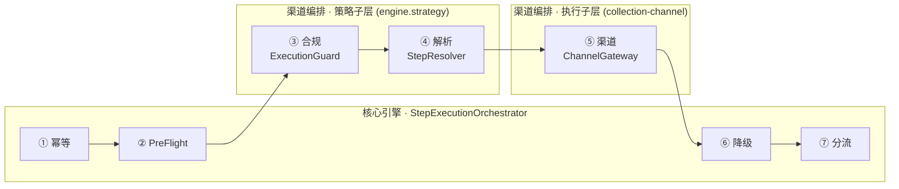
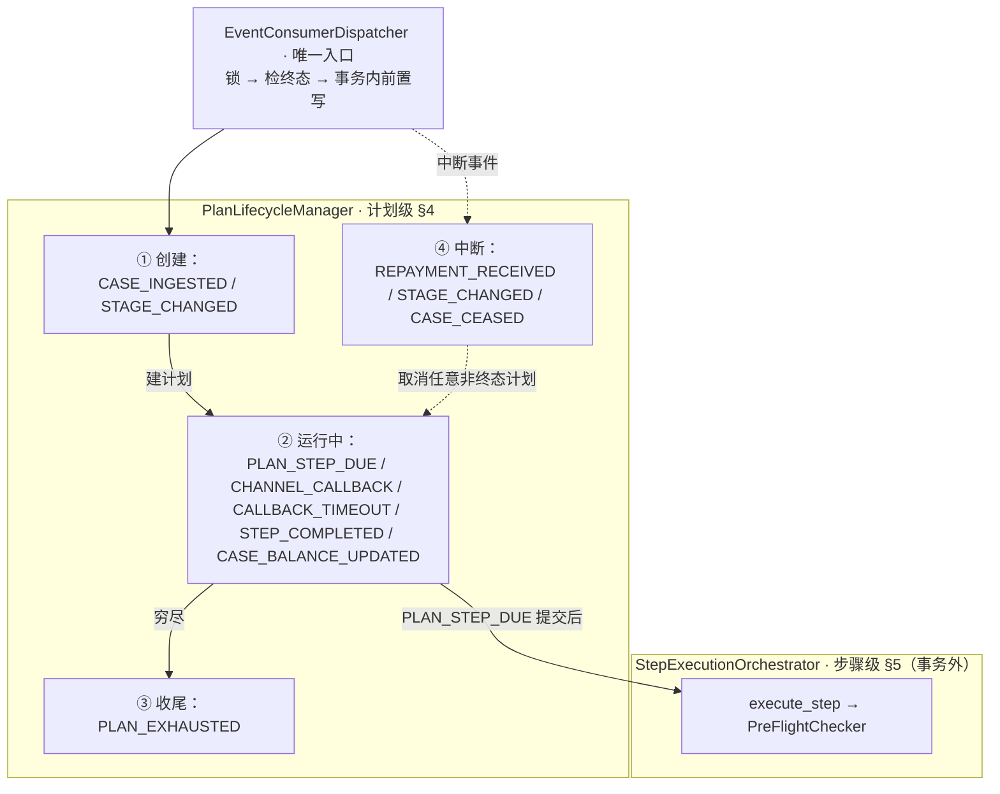
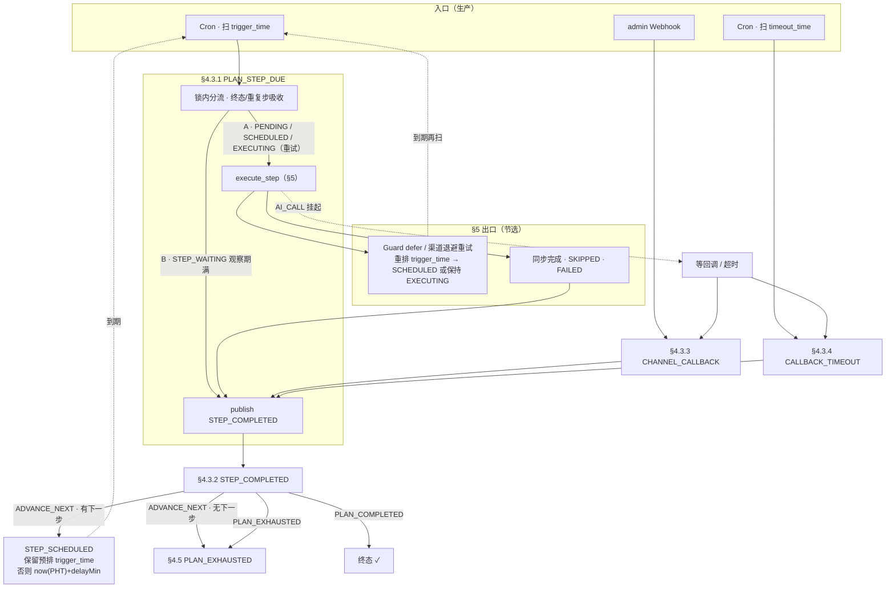
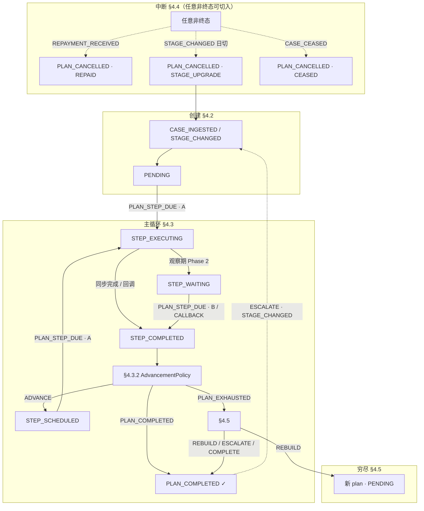
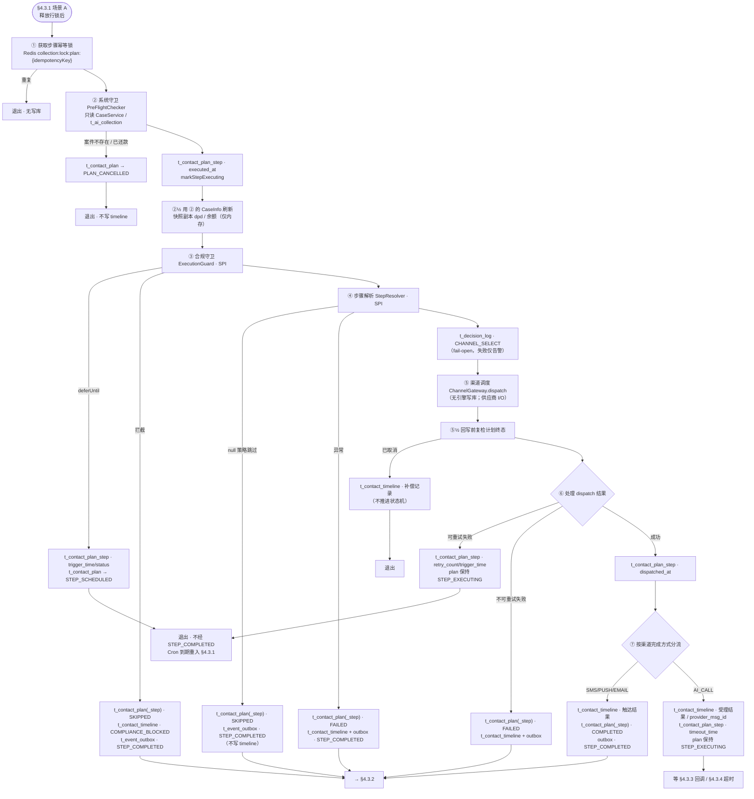
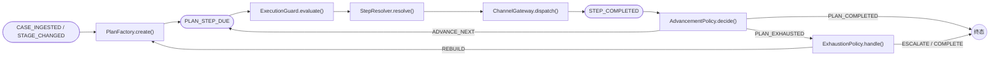

# MOCASA 催收系统升级 — Phase 1 核心引擎规格

> **版本**: Phase 1 · 仅覆盖菲律宾市场  
> **日期**: 2026-07-01  
> **关联文档**: [产品需求文档 (PRD)](./MOCASA催收系统升级_Phase1_产品需求文档_PRD.md)、[架构设计文档](./MOCASA催收系统升级_Phase1_架构设计文档.md)、[基础设施交互规范](./MOCASA催收系统升级_Phase1_基础设施交互规范.md)、[领域模型 §2.6 / §6](./MOCASA催收系统升级_Phase1_领域模型与数据定义.md#6-eventpayload-字段定义)、[渠道总规格 §3.3](./channel/MOCASA催收系统升级_Phase1_collection-channel总规格.md#33-channel_callback-事件-payload)

---

## 目录

- [1. 引擎结构与边界](#1-引擎结构与边界)
  - [1.1 核心组件与职责](#11-核心组件与职责)
  - [1.2 模块边界与调用全景](#12-模块边界与调用全景)
- [2. 事件路由](#2-事件路由)
  - [2.1 事件路由表（SSOT）](#21-事件路由表ssot)
  - [2.2 生命周期派生总览](#22-生命周期派生总览)
- [3. 运行时执行模型](#3-运行时执行模型)
  - [3.1 线程隔离（Trigger-to-Event）](#31-线程隔离trigger-to-event)
  - [3.2 并发与一致性模型](#32-并发与一致性模型)
- [4. 计划生命周期与状态机](#4-计划生命周期与状态机)
  - [4.1 状态定义](#41-状态定义)
  - [4.2 计划创建](#42-计划创建)
  - [4.3 步骤执行循环](#43-步骤执行循环)
  - [4.4 中断处理](#44-中断处理)
  - [4.5 穷尽续建](#45-穷尽续建)
  - [4.6 部分还款余额更新](#46-部分还款余额更新)
  - [4.7 PTP 到期处理（Phase 2 预留）](#47-ptp-到期处理)
  - [4.8 状态转换](#48-状态转换)
- [5. 步骤执行管线](#5-步骤执行管线)
- [6. SPI 接口契约](#6-spi-接口契约)
  - [6.1 接口职责与调用位置](#61-接口职责与调用位置)
  - [6.2 返回值与实现约束](#62-返回值与实现约束)
  - [6.3 共享 DTO 定义](#63-共享-dto-定义)
- [7. 容错与异常恢复](#7-容错与异常恢复)
  - [7.1 故障层级总览](#71-故障层级总览)
  - [7.2 步骤级降级](#72-步骤级降级)
    - [7.2.1 SPI 异常应对](#721-spi-异常应对)
    - [7.2.2 渠道执行降级](#722-渠道执行降级)
  - [7.3 L1 基础设施异常](#73-l1-基础设施异常)
  - [7.4 跨存储一致性修复](#74-跨存储一致性修复)

---


## 1. 引擎结构与边界

本节交代引擎由哪些组件构成（§1.1）、与外部模块的边界与调用全景（§1.2），为后续事件路由（[§2](#2-事件路由)）、运行时执行模型（[§3](#3-运行时执行模型)）与计划生命周期（[§4](#4-计划生命周期与状态机)）提供结构地图。

### 1.1 核心组件与职责

`EventConsumerDispatcher` 是核心引擎的**唯一入口**——从 Redis Stream 消费事件，反序列化后按类型路由；其余三个核心类均为内部协作组件，不对外暴露调用。


| 类                           | 职责边界             | 拥有的逻辑                                       |
| --------------------------- | ---------------- | ------------------------------------------- |
| `EventConsumerDispatcher`   | 事件消费 + 路由 + 提交后投递 | 反序列化、按类型路由、委托 `PlanLifecycleManager`（行锁与终态拦截在其短事务内）、COMMIT 后发布派生事件 |
| `PlanLifecycleManager`      | 计划级生命周期决策        | §4 全部伪代码（创建/中断/穷尽），事务内状态前置写入                |
| `StepExecutionOrchestrator` | 步骤级执行管线          | §5 全部伪代码（七步骨架），在非事务上下文中运行                   |
| `PreFlightChecker`          | 系统级实时守卫          | 实时查 DB 确认案件存活；由 Orchestrator 调用，**不直接消费事件** |


**调用链路**：`Dispatcher` → `Manager`（事务内）→ COMMIT → `Orchestrator`（事务外）；`PreFlightChecker` 嵌在 Orchestrator 的 `execute_step` 第②步。

### 1.2 模块边界与调用全景

`StepExecutionOrchestrator` 按 [§5](#5-步骤执行管线) 七步顺序执行；③④⑤ 经 SPI / `ChannelGateway` 进入渠道编排，①②⑥⑦ 在引擎内完成（契约见 [§6](#6-spi-接口契约)）：


```mermaid
flowchart LR
    subgraph engine["核心引擎 · StepExecutionOrchestrator"]
        S1["① 幂等"]
        S2["② PreFlight"]
        S6["⑥ 降级"]
        S7["⑦ 分流"]
    end

    subgraph strategy["渠道编排 · 策略子层 (engine.strategy)"]
        S3["③ 合规<br/>ExecutionGuard"]
        S4["④ 解析<br/>StepResolver"]
    end

    subgraph exec["渠道编排 · 执行子层 (collection-channel)"]
        S5["⑤ 渠道<br/>ChannelGateway"]
    end

    S1 --> S2 --> S3 --> S4 --> S5 --> S6 --> S7
```

> 七步顺序与 [§5](#5-步骤执行管线) 一致；⑤ 与 ⑥ 之间另有 ⑤½ 取消复检（引擎内，本图从略）。

---


## 2. 事件路由

本节是事件的**声明性目录**：[§2.1](#21-事件路由表ssot) 路由表是 Dispatcher 消费的全部外部事件的唯一权威清单（SSOT），[§2.2](#22-生命周期派生总览) 给出由路由表派生的生命周期全景视图。事件如何被多线程承载与并发约束见 [§3](#3-运行时执行模型)。

### 2.1 事件路由表（SSOT）

下表是 Dispatcher 消费并路由的**事件唯一权威清单**（Phase 1 共 10 行）：处理动作与详见均以本表为准；「生命周期域」列与 [§2.2](#22-生命周期派生总览) 四块对齐（①创建 / ②运行中 / ③收尾 / ④中断）。


| 事件                   | 生命周期域       | 引擎侧处理动作                                 | 详见                                 |
| -------------------- | ----------- | --------------------------------------- | ---------------------------------- |
| `CASE_INGESTED`      | ① 创建        | 匹配模板 → 创建计划（PENDING）→ 注册首步 Job          | [§4.2](#42-计划创建)                   |
| `STAGE_CHANGED`      | ① 创建 + ④ 中断 | 取消旧阶段活跃计划 → 为新阶段创建计划                    | [§4.2](#42-计划创建)、[§4.4](#44-中断处理)  |
| `REPAYMENT_RECEIVED` | ④ 中断        | **整笔 loan 全额结清**：取消该案件活跃计划 + 清理已注册 Job  | [§4.4](#44-中断处理)                   |
| `CASE_BALANCE_UPDATED` | ② 运行中更新 | **部分还款**：刷新该案件活跃计划快照的运行态金额与下一期提醒字段；不改 stage | [§4.6](#46-部分还款余额更新) |
| `PLAN_STEP_DUE`      | ② 步骤循环      | 按状态分流：到期执行 / 观察期结转 → 触达                 | [§4.3](#43-步骤执行循环)、[§5](#5-步骤执行管线) |
| `CHANNEL_CALLBACK`   | ② 步骤循环      | 更新步骤结果 → 发布 `STEP_COMPLETED`            | [§4.3.3](#433-channel_callback)    |
| `CALLBACK_TIMEOUT`   | ② 步骤循环      | 回调超时 → 标 `FAILED` → 发布 `STEP_COMPLETED` | [§4.3.4](#434-callback_timeout)    |
| `STEP_COMPLETED`     | ② 步骤循环      | 推进决策：注册下一步 / 计划完成 / 发布穷尽                | [§4.3.2](#432-step_completed)      |
| `PLAN_EXHAUSTED`     | ③ 收尾        | 穷尽策略：续建新计划 / 升档 / 标记完成                  | [§4.5](#45-穷尽续建)                   |
| `CASE_CEASED`        | ④ 中断        | D+91 完全停催：取消该案件活跃计划，**不再续建**（停催终态）      | [§4.4](#44-中断处理)                   |


所有事件经 Dispatcher 消费后遵循**统一的并发前置流程**（行锁 → 终态拦截 → 事务边界），该契约见 [§3.2](#32-并发与一致性模型)，本节不重复。事件的产生来源（外部上游 / 引擎链式 / 定时 Job）见 [领域模型 §6.2](./MOCASA催收系统升级_Phase1_领域模型与数据定义.md#62-逐事件-payload-字段)（发布者列）；链式发布的触发条件以 [§4.3](#43-步骤执行循环) / [§4.5](#45-穷尽续建) / [§5](#5-步骤执行管线) 伪代码为 SSOT。

### 2.2 生命周期派生总览

下图把路由表 10 行按其**生命周期域**压缩为四类协作关系，并用边表达正常推进顺序与横切关系，仅作全景导览（引擎侧视角，不涉及上游产生方式）；事件归属与处理动作以路由表为准，此处不展开单个事件语义。


```mermaid
flowchart TB
    D["EventConsumerDispatcher · 唯一入口<br/>锁 → 检终态 → 事务内前置写"]

    subgraph plan["PlanLifecycleManager · 计划级 §4"]
        P1["① 创建：CASE_INGESTED / STAGE_CHANGED"]
        P3["② 运行中：PLAN_STEP_DUE / CHANNEL_CALLBACK / CALLBACK_TIMEOUT / STEP_COMPLETED / CASE_BALANCE_UPDATED"]
        P4["③ 收尾：PLAN_EXHAUSTED"]
        P2["④ 中断：REPAYMENT_RECEIVED / STAGE_CHANGED / CASE_CEASED"]
    end

    subgraph step["StepExecutionOrchestrator · 步骤级 §5（事务外）"]
        O["execute_step → PreFlightChecker"]
    end

    D --> P1
    P1 -->|"建计划"| P3
    P3 -->|"穷尽"| P4
    P3 -->|"PLAN_STEP_DUE 提交后"| O
    D -. "中断事件" .-> P2
    P2 -. "取消任意非终态计划" .-> P3
```


> 读图：**实线**＝正常生命周期推进（入口 → ①创建 → ②循环 → ③收尾）与进入步骤管线；**虚线**＝横切中断（④可作用于任意非终态计划）。完整状态流转与竞态见 [§4.8](#48-状态转换)，本图不重复。

---


## 3. 运行时执行模型

本节定义事件的**操作性执行模型**：[§3.1](#31-线程隔离trigger-to-event) 调度线程与 Consumer 线程如何隔离，[§3.2](#32-并发与一致性模型) 并行消费下如何保证一致性。两者构成同一因果链——Consumer 线程池的并行正是并发控制的前提。

### 3.1 线程隔离（Trigger-to-Event）

[§2.1](#21-事件路由表ssot) 路由表中的 `PLAN_STEP_DUE` 由调度线程**生产**，由 Consumer 线程池**消费**；其余业务事件仅由 Consumer 消费。两线程池严格隔离，杜绝调度与 I/O 密集操作耦合：

```
Cron 扫表 ──XADD──→ Redis Stream ──XREADGROUP──→ Consumer 执行业务
```


| 维度   | **Cron 调度线程**          | **Consumer 业务线程**       |
| ---- | ---------------------- | ----------------------- |
| 线程池  | 调度订阅消费线程（Cloud Scheduler → Pub/Sub） | Redis Stream 消费线程池      |
| 职责   | 扫表发现到期步骤 → `XADD` 发事件  | `XREADGROUP` 消费 → 引擎全链路 |
| 耗时约束 | 毫秒级返回；**禁止**渠道 I/O 等阻塞 | 允许阻塞；供应商变慢仅占用本池         |


**事件分工**（横切维度，与上表正交）：


| 事件                        | Cron                     | Consumer                            |
| ------------------------- | ------------------------ | ----------------------------------- |
| `PLAN_STEP_DUE`           | **生产**（扫 `trigger_time`） | **消费**（分流 → `execute_step`）         |
| `CALLBACK_TIMEOUT`        | **生产**（扫 `timeout_time`） | **消费**（标 FAILED → `STEP_COMPLETED`） |
| 其余 8 种（`CASE_INGESTED` 等） | 不参与                      | 消费 + 执行                             |


> 两池不共享线程；生产线程池、背压与 PEL 的实现参数以 [基础设施 §2.2](./MOCASA催收系统升级_Phase1_基础设施交互规范.md#22-生产消费拓扑线程职责与背压) 为准。Consumer 并行消费正是 [§3.2](#32-并发与一致性模型) 的前提。


### 3.2 并发与一致性模型

Consumer 并行消费时，同一计划可能同时收到「步骤到期触达」与「还款取消」等事件。典型事故是**还款已取消计划却仍发出触达**。下表归纳五类风险；**本节详述 ① 及其代价、②**；③ 见 [§4.4](#44-中断处理)，④ 见 [§5](#5-步骤执行管线) ②⑤½，⑤ 见 [§7.4](#74-跨存储一致性修复)。

#### 五类一致性风险（总览）


| #   | 风险       | 应对                   | 详述                              |
| --- | -------- | -------------------- | ------------------------------- |
| ①   | **并发写坏** | 行锁串行 + 锁内禁 I/O       | **本节 ↓**                        |
| ②   | **重复执行** | `XACK` / DLQ + 步骤幂等键 | **本节 ↓**；步骤级见 [§5](#5-步骤执行管线) ① |
| ③   | **乱序覆盖** | 终态先写先赢               | [§4.4](#44-中断处理)                |
| ④   | **迟到真相** | I/O 前后复检             | [§5](#5-步骤执行管线) ②⑤½             |
| ⑤   | **派生事件丢失** | 事件与状态迁移同事务落发件箱       | [§7.4](#74-跨存储一致性修复)            |


> **③ 要点**：`REPAID > CEASED > STAGE_UPGRADE > 非终态` 为语义/审计参考，非运行时覆盖规则。投诉/争议冻结为 Phase 2 能力，不属于本阶段状态机。


#### ① 防并发写坏：串行锁 + 锁内轻量

**串行锁**：同一 `plan_id` 的并发事件在 `SELECT FOR UPDATE` 处排队，一次只让一个 Consumer 改计划。
**锁内轻量**：持锁期间只做状态校验 + 前置写（如 → `STEP_EXECUTING` / `PLAN_CANCELLED`），COMMIT 后立即释放；渠道 I/O、远程调用等慢操作一律放到锁外。

所有事件经 Dispatcher 消费后，第一步即进入上述短事务——同一计划的并发事件被串行化，锁窗口保持毫秒级，不会因渠道超时导致锁堆积。

**① 的代价（有界越界）**：锁外 I/O 期间计划可能被取消，**已发出的触达无法撤回**（秒级窗口）。Phase 1 接受此取舍：计划仍取消、后续不再执行；写入补偿 timeline / 告警。④ 多级复检（[§5](#5-步骤执行管线) ②⑤½）可减轻误推进，但不能消除已发出触达。

#### ② 防重复执行：消费层幂等

Redis Stream 的消费语义保证：


| 场景             | 行为                                     | 典型原因                                              |
| -------------- | -------------------------------------- | ------------------------------------------------- |
| 处理成功           | `XACK`，消息不再投递                          | —                                                 |
| 处理失败（**可重试**）  | 不 ACK → pending list → 自动重投递           | DB 短暂不可用、锁等待超时、计划级 SPI 超时、进程崩溃于 ACK 前             |
| 处理失败（**不可重试**） | 跳过 ACK → 直接 DLQ + 告警                   | payload 反序列化失败（畸形消息，重投必败）                         |
| 可重试但达投递上限      | DLQ + 告警（毒消息）                          | 代码缺陷或数据异常导致持续失败（默认上限 5 次，见 [§7.3](#73-l1-基础设施异常)） |
| 重复投递到达         | 步骤 `idempotency_key` SETNX 吸收；终态计划直接退出 | Stream 重投或并发重复消费                                  |


消费 ACK 语义属于路由/线程层；`idempotency_key` 的具体实现见 [§5](#5-步骤执行管线) ①，DLQ 配置见 [基础设施交互规范](./MOCASA催收系统升级_Phase1_基础设施交互规范.md)。

#### 时序例证（①②④ 交织）

`PLAN_STEP_DUE`（执行）与 `REPAYMENT_RECEIVED`（中断）争锁的典型场景：A 先获锁并进入锁外 I/O，B 在 I/O 窗口内取消计划，A 返回后 ④ 复检丢弃结果；触达可能已发出（有界越界）。若 B 先获锁，A 见终态静默退出（② 终态吸收）。

```
Consumer-A (PLAN_STEP_DUE)           Consumer-B (REPAYMENT_RECEIVED)
    │                                      │
    │── SELECT FOR UPDATE plan ──→         │── SELECT FOR UPDATE plan (阻塞)
    │   → status = STEP_EXECUTING          │
    │── COMMIT ──→                          │── 获取锁 → PLAN_CANCELLED → COMMIT
    │   渠道 I/O 进行中...                  │
    │   返回后重读发现 PLAN_CANCELLED        │
    │   → 静默丢弃，写补偿日志               │
```

更多竞态分支（中断乱序、重复投递、升档 vs 还款等）见 [§4.4](#44-中断处理) / [§5](#5-步骤执行管线)；完整覆盖由集成测试保证。

---


## 4. 计划生命周期与状态机

本节从计划级纵向视角说明一个计划经历什么：先定义状态词汇表，再按时间顺序展示从创建到终态的完整生命周期，最后以状态转换总表和转换图作形式化总结。步骤级横向协作见 [§5](#5-步骤执行管线)，即 §4.3「执行步骤」的内部展开；部分还款的余额快照更新不构成状态迁移，见 [§4.6](#46-部分还款余额更新)。

> **边界**：上游消息到领域事件的归属、`caseId=loanId`、结清/部分还款判定、DPD/停催准入与 payload 校验，以 [数据接入规格](./MOCASA催收系统升级_Phase1_数据接入规格.md) 为 SSOT；本节只定义引擎收到事件后的计划状态机行为，并保留必要的防御性校验。


### 4.1 状态定义

计划级状态机共 **6 态**（4 非终态 + 2 终态），已覆盖引擎管辖的完整生命周期；步骤级状态（`SCHEDULED` / `EXECUTING` / `COMPLETED` 等）见 [领域模型](./MOCASA催收系统升级_Phase1_领域模型与数据定义.md)，不在此表重复。


| 状态               | 类型     | 语义                                                                                              |
| ---------------- | ------ | ----------------------------------------------------------------------------------------------- |
| `PENDING`        | 非终态    | 计划刚创建，尚未执行任何步骤，等待首步 `trigger_time`                                                              |
| `STEP_SCHEDULED` | 非终态    | 上一步已结束，下一步 Job 已注册，等待到期                                                                         |
| `STEP_EXECUTING` | 非终态    | 当前步骤执行中（渠道发送 / 等待异步回调）                                                                          |
| `STEP_WAITING`   | 非终态    | 消息类渠道已发出，观察期内等待用户响应                                                                             |
| `PLAN_COMPLETED` | **终态** | 正常结束（还款确认或步骤全部走完）                                                                               |
| `PLAN_CANCELLED` | **终态** | 被中断取消；`cancel_reason` 枚举见 [领域模型 §2.7](./MOCASA催收系统升级_Phase1_领域模型与数据定义.md#27-cancelreason计划取消原因) |


> Phase 1 引擎经事件总线写入的 `cancel_reason` 仅 `REPAID` / `STAGE_UPGRADE` / `CEASED`（见 [§4.4](#44-中断处理)）。`COMPLAINT` / `MANUAL` 为 Phase 2 预留，不经事件总线。


### 4.2 计划创建

**状态影响**：创建新计划为 `PENDING`；首步已预排或回退写入 `trigger_time` 后由扫描器进入 `STEP_SCHEDULED`。
**触发事件**：`CASE_INGESTED` / `STAGE_CHANGED`（链 [§2.1](#21-事件路由表ssot)）。
**关联 SPI**：`PlanFactory`（链 [§6.1](#61-接口总览)）。

`CASE_INGESTED` 的准入、DPD/停催口径与 payload 组装见 [数据接入 §3](./MOCASA催收系统升级_Phase1_数据接入规格.md#3-入案处理主链路校验幂等与边界)；`STAGE_CHANGED` 的来源与目标 Stage 口径见 [数据接入 §4](./MOCASA催收系统升级_Phase1_数据接入规格.md#4-阶段变更与-dpd-日切)。二者均复用下方创建逻辑。`collectionStatus` 由接入派生；引擎仍防御性拒绝 `CEASED` 快照的建计划请求，避免迟到/重放事件绕过停催边界。

```python
def on_case_ingested(event):
    # 快照由 payload 组装，不读 t_ai_collection（决策 B，见领域 §4.4）
    case_info = build_case_info_from_payload(event)
    snapshot  = build_snapshot_from_payload(event)

    plan = PlanFactory.create(case_info, event.stage, snapshot)   # → SPI §6.1
    if plan is None:
        return                        # 该案件不需要创建计划

    plan.status = PENDING
    first_step = plan.steps[0]
    # DayBlock 模板已写 PHT 绝对槽位则保留；扁平 delayMinutes 模板才回退计算。
    if first_step.trigger_time is None:
        first_step.trigger_time = now(PHT) + max(0, first_step.delay_minutes)
    with transaction():               # 计划+步骤+首步 trigger_time 原子落盘
        save(plan)                    # 持久化计划 + 步骤序列
```

**幂等约束**：同一 `case_id + stage` 不得重复建计划，且任一时刻仅一个非终态计划（升档 [§4.4](#44-中断处理) / 续建 [§4.5](#45-穷尽续建) 时先终态旧计划）。

### 4.3 步骤执行循环

**状态影响**：`PENDING` / `STEP_SCHEDULED`（重试时 `STEP_EXECUTING`）→ `STEP_EXECUTING` → 消息类同步完成或 AI_CALL 挂起；`STEP_WAITING`（Phase 2）结转 `STEP_COMPLETED`（不触达）。推进下一步为 `STEP_SCHEDULED`；回调/超时经 `STEP_COMPLETED` 再分流。
**触发事件**：`PLAN_STEP_DUE` / `CHANNEL_CALLBACK` / `STEP_COMPLETED`（及 Cron 产生的 `CALLBACK_TIMEOUT` 哨兵；事件名均非计划状态，链 [§2.1](#21-事件路由表ssot)）。
**关联 SPI**：`ExecutionGuard` / `StepResolver` / `ChannelGateway` / `AdvancementPolicy`（链 [§6.1](#61-接口总览)）。


| 小节                              | 触发事件               | 职责                                     |
| ------------------------------- | ------------------ | -------------------------------------- |
| [§4.3.1](#431-plan_step_due)    | `PLAN_STEP_DUE`    | 锁内按计划态分流（场景 A/B）                       |
| [§4.3.2](#432-step_completed)   | `STEP_COMPLETED`   | 推进下一步 / 计划完成 / 发布穷尽                    |
| [§4.3.3](#433-channel_callback) | `CHANNEL_CALLBACK` | 供应商 Webhook → 写结果 → 发 `STEP_COMPLETED` |
| [§4.3.4](#434-callback_timeout) | `CALLBACK_TIMEOUT` | 回调超时 → 标 `FAILED` → 发 `STEP_COMPLETED` |


下方流程图按「入口 → 执行/回环 → 汇聚 → 推进」分层：多数路径经 `STEP_COMPLETED` 进入 §4.3.2；Guard defer 与渠道退避重试不经汇聚，直接重排 `trigger_time` 后回到 Cron。线程隔离见 [§3.1](#31-线程隔离trigger-to-event)，单步分支详见 [§5](#5-步骤执行管线)。


```mermaid
flowchart TB
    subgraph in["入口（生产）"]
        C1["Cron · 扫 trigger_time"]
        C2["Cron · 扫 timeout_time"]
        WH["admin Webhook"]
    end

    subgraph s431["§4.3.1 PLAN_STEP_DUE"]
        S1["锁内分流 · 终态/重复步吸收"]
        EX["execute_step（§5）"]
        S1 -->|"A · PENDING / SCHEDULED / EXECUTING（重试）"| EX
        S1 -->|"B · STEP_WAITING 观察期满"| HUB
    end

    subgraph s5out["§5 出口（节选）"]
        LOOP["Guard defer / 渠道退避重试<br/>重排 trigger_time → SCHEDULED 或保持 EXECUTING"]
        SYNC["同步完成 · SKIPPED · FAILED"]
    end

    CB["§4.3.3 CHANNEL_CALLBACK"]
    TO["§4.3.4 CALLBACK_TIMEOUT"]
    HUB["publish STEP_COMPLETED"]
    ADV["§4.3.2 STEP_COMPLETED"]

    C1 --> S1
    C2 --> TO
    WH --> CB

    EX --> LOOP
    EX --> SYNC
    EX -.->|"AI_CALL 挂起"| ASYNC["等回调 / 超时"]
    LOOP -.->|"到期再扫"| C1
    SYNC --> HUB
    ASYNC --> CB
    ASYNC --> TO
    CB --> HUB
    TO --> HUB

    HUB --> ADV
    ADV -->|"ADVANCE_NEXT · 有下一步"| NEXT["STEP_SCHEDULED<br/>保留预排 trigger_time<br/>否则 now(PHT)+delayMin"]
    ADV -->|"ADVANCE_NEXT · 无下一步"| EXH["§4.5 PLAN_EXHAUSTED"]
    ADV -->|PLAN_COMPLETED| DONE["终态 ✓"]
    ADV -->|PLAN_EXHAUSTED| EXH
    NEXT -.->|"到期"| C1
```


> **读图**：实线＝步骤终态汇入 `STEP_COMPLETED`；虚线＝不经汇聚的回环（defer/重试重排 `trigger_time`，或 AI_CALL 异步回调/超时）。场景 B（`STEP_WAITING`）为 Phase 2 预留，Phase 1 SMS/PUSH/EMAIL 不进 WAITING。横切中断（还款/升档/停催）见 [§4.4](#44-中断处理)，未在本图展开。


#### 4.3.1 PLAN_STEP_DUE

锁内按计划态分流（场景 A/B）：**A 到期执行**（`PENDING` / `STEP_SCHEDULED` / 退避重试时的 `STEP_EXECUTING` → 置或保持 `STEP_EXECUTING`，COMMIT 后锁外 `execute_step`）/ **B 观察期结转**（`STEP_WAITING` → 标记步骤完成；事务提交后由 Dispatcher 投递 `STEP_COMPLETED`，不触达）。

**Guard defer**（§5 ③）：若落在 PHT 静默窗（默认 21:00–08:00，`TIME_WINDOW`），将当前步 `trigger_time` 重排至 `deferUntil`（通常次日 08:00），计划回 `STEP_SCHEDULED` 后直接返回——不触达、不写 timeline、不经 `STEP_COMPLETED`；到期 Cron 重入场景 A。区别于 Guard block（跳过并推进）与渠道退避重试（保持 `EXECUTING`），见 [§5 ③](#5-步骤执行管线)。

```python
def on_plan_step_due(event):
    # ── 事务 1（毫秒级：锁 → 校验 → 状态前置 → 释放） ──
    events = []
    with transaction():
        plan = get_plan_with_lock(event.plan_id)  # SELECT FOR UPDATE
        if plan is None or plan.status in (PLAN_COMPLETED, PLAN_CANCELLED):
            return                                 # 终态拦截

        step = plan.get_current_step()

        if plan.status in (PENDING, STEP_SCHEDULED, STEP_EXECUTING):
            plan.status = STEP_EXECUTING           # 含退避重试再触发；COMMIT 后释放行锁
        elif plan.status == STEP_WAITING:
            step.status = COMPLETED
            if step.result is None:
                step.result = SENT_NO_RESPONSE
            events.append(STEP_COMPLETED)          # 事务内落发件箱，不在事务内 XADD；提交后投递（§7.4 A）
            return events
    # ── 事务已提交，行锁已释放 ──

    # ── 非事务上下文：渠道 I/O（允许耗时数百毫秒~数秒） ──
    execute_step(plan, step)                       # 展开见 §5
    # Guard defer（§5 ③）：step.trigger_time ← deferUntil，plan ← STEP_SCHEDULED，直接 return
    # 不经 STEP_COMPLETED；Cron 到期后再投递 PLAN_STEP_DUE → 重入本函数场景 A
```


#### 4.3.2 STEP_COMPLETED

```python
def on_step_completed(plan, completed_step):
    decision = AdvancementPolicy.decide(context, step_result)   # → SPI §6.1

    if decision == ADVANCE_NEXT:
        next_step = get_next_step(plan, completed_step)
        if next_step is None:
            publish(PLAN_EXHAUSTED)                # 本计划已无后续步骤 → §4.5
            return
        # DayBlock 已预排绝对 trigger_time 时保留；否则按 delayMinutes 回退。
        if next_step.trigger_time is None:
            next_step.trigger_time = now(PHT) + max(0, next_step.delay_minutes)
        # 均由 Cron 在 trigger_time 到期后发 PLAN_STEP_DUE（非同步递归 execute_step）
        plan.status = STEP_SCHEDULED

    elif decision == PLAN_COMPLETED:
        plan.status = PLAN_COMPLETED               # 终态

    elif decision == PLAN_EXHAUSTED:
        publish(PLAN_EXHAUSTED)                    # → §4.5
```


#### 4.3.3 CHANNEL_CALLBACK

Webhook 经 `collection-admin` 鉴权后发布为本事件。Phase 1 **仅 AI_CALL** 在 `STEP_EXECUTING` 等 disposition；**SMS/PUSH/EMAIL** `dispatch` 成功即同步完成，**不进** `STEP_WAITING`、不用本事件结转（与 [架构 §1.6.7](./MOCASA催收系统升级_Phase1_架构设计文档.md#167-异步回调对账)、[渠道编排 §3.5](./channel/MOCASA催收系统升级_Phase1_渠道编排规格.md) 一致）。

> **Timeline 落库**：admin Webhook 仅鉴权、规范化并发布事件；引擎在本事务中更新 step，并经 `TimelineRepository` 写回调结果 timeline 后发布 `STEP_COMPLETED`。channel 不直接写 timeline。

```python
def on_channel_callback(event):
    events = []
    with transaction():
        plan = get_plan_with_lock(event.plan_id)       # SELECT FOR UPDATE 串行化重复回调
        if plan.status not in (STEP_EXECUTING, STEP_WAITING):
            return events                              # 非执行/等待态（已处理或已取消），静默吸收

        step = plan.get_current_step()
        step.result = map_callback_to_result(event)    # AI_CALL disposition；WAITING 为 Phase 2 预留
        step.status = COMPLETED
        write_timeline(step.result, event.providerMsgId)
        events.append(STEP_COMPLETED)
    return events                                      # 已随本事务入发件箱；提交后由 Dispatcher 投递（§7.4 A）
```


#### 4.3.4 CALLBACK_TIMEOUT

AI_CALL 停在 `STEP_EXECUTING` 等 Webhook 时，若回调不到达会卡死。Phase 1 **仅靠引擎超时哨兵**：进入异步执行时注册超时 Job（[§5 ⑦](#5-步骤执行管线)）；Cron 扫到 `timeout_time` 仍无回调 → 标 `FAILED` → 发布 `STEP_COMPLETED`。

> **Timeline**：超时由引擎经 `TimelineRepository` 写入 FAILED 记录；admin/Cron 只发布 `CALLBACK_TIMEOUT`。

```python
def on_callback_timeout(event):
    events = []
    with transaction():
        plan = get_plan_with_lock(event.plan_id)
        if plan.status != STEP_EXECUTING:
            return events                          # 回调已正常处理，忽略

        step = plan.get_current_step()
        step.result = FAILED
        step.status = FAILED
        write_timeline(FAILED, error_code="CALLBACK_TIMEOUT")
        events.append(STEP_COMPLETED)
    return events                                  # 已随本事务入发件箱；提交后投递，由 AdvancementPolicy 决定下一步
```

**默认 60 分钟**（`engine.step.callback_timeout_minutes`，见 [基础设施附录](./MOCASA催收系统升级_Phase1_基础设施交互规范.md#附录运行配置与环境)）。等待不占 Consumer——Cron 扫表触发本事件；防重复拾取靠计划/步骤状态。

> **Phase 2 对账（AI_CALL）**：仅当独立 AI Call 合作方提供按其任务标识（`call_task_id` / `request_id`）查询终态的 API 时，才能以查询结果纠正 `CALLBACK_TIMEOUT` 造成的假 `FAILED` 并补齐 timeline。故 dispatch 成功必须把该标识落入 `t_contact_timeline.provider_msg_id`，回调原始证据落 `t_channel_callback_audit.provider_msg_id`。没有查询 API 时，只能保留「超时置失败 + 回调审计 + 告警」，不得自行重拨或推测改写结果；合作方底层线路（LTH / SIP / 其他）对该契约不可见。

### 4.4 中断处理

**状态影响**：`REPAYMENT_RECEIVED` / `CASE_CEASED` 将该案件活跃计划置 `PLAN_CANCELLED`；`STAGE_CHANGED` 取消旧计划后，为目标 Stage 新建 `PENDING` 计划。
**触发事件**：`REPAYMENT_RECEIVED` / `STAGE_CHANGED` / `CASE_CEASED`（链 [§2.1](#21-事件路由表ssot)）。`COMPLAINT` / `MANUAL` 带外取消为 **Phase 2**，见 [§4.1](#41-状态定义)。
**关联 SPI**：—（纯引擎状态机；还款路径另调 `PredictiveDialerService`，见 [§7.3](#73-l1-基础设施异常)）。

`REPAYMENT_RECEIVED` / `CASE_BALANCE_UPDATED` 的结清判定（`isFullCleared`）及发布来源，以 [数据接入 §3.3](./MOCASA催收系统升级_Phase1_数据接入规格.md#33-按消息类型的处理矩阵) 为 SSOT；本节前者取消计划，后者仅走 §4.6 更新余额。`CASE_CEASED` 的 DPD≥91 产出边界见 [数据接入 §4.4](./MOCASA催收系统升级_Phase1_数据接入规格.md#44-产出事件)。并发：`plan_id` 升序加锁 + 终态单调（[§3.2](#32-并发与一致性模型)）。中断流程见下方伪代码 + [§4.8 状态图](#48-状态转换)。

```python
def on_repayment_received(case_id, user_id):
    plans = find_active_plans_by_case(case_id)     # status NOT IN 终态
    for plan in sorted(plans, key=lambda p: p.id): # 按 plan_id 升序加锁，防止死锁
        lock(plan)                                 # SELECT FOR UPDATE
        if plan.status in (PLAN_COMPLETED, PLAN_CANCELLED):
            continue                               # 终态不可逆：取锁后复检（§3.2），不覆盖
        plan.status = PLAN_CANCELLED
        plan.cancel_reason = REPAID
        cancel_scheduled_jobs(plan)
    PredictiveDialerService.filter_repaid_case(user_id, case_id)  # 失败 → 告警 + 继续（§7.3）

def on_stage_changed(case_id, new_stage):
    old_plans = find_active_plans_by_case(case_id)
    for plan in sorted(old_plans, key=lambda p: p.id):
        if plan.stage != new_stage:
            lock(plan)
            if plan.status in (PLAN_COMPLETED, PLAN_CANCELLED):
                continue                           # 终态不可逆：取锁后复检（§3.2），不覆盖
            plan.status = PLAN_CANCELLED
            plan.cancel_reason = STAGE_UPGRADE
            cancel_scheduled_jobs(plan)
    create_plan_for_stage(case_id, new_stage)       # 复用 §4.2 创建流程

def on_case_ceased(case_id):                        # D+91 完全停催：取消活跃计划，不续建
    old_plans = find_active_plans_by_case(case_id)
    for plan in sorted(old_plans, key=lambda p: p.id):  # 按 plan_id 升序加锁，防止死锁
        lock(plan)                                  # SELECT FOR UPDATE
        if plan.status in (PLAN_COMPLETED, PLAN_CANCELLED):
            continue                                # 终态不可逆：取锁后复检（§3.2），不覆盖
        plan.status = PLAN_CANCELLED
        plan.cancel_reason = CEASED
        cancel_scheduled_jobs(plan)
    # 不调用 create_plan_for_stage —— 停催后主动催收终止（区别于 STAGE_CHANGED 的取消+重建）
```


### 4.5 穷尽续建

**状态影响**：当前非终态计划恒转 `PLAN_COMPLETED`；`REBUILD` / `ESCALATE` 另建 `PENDING` 新计划（首步靠 Cron，非 case Pub/Sub）。
**触发事件**：`PLAN_EXHAUSTED`（所有步骤执行完毕但用户未还款；链 [§2.1](#21-事件路由表ssot)）。
**关联 SPI**：`ExhaustionPolicy` / `PlanFactory`（链 [§6.1](#61-接口总览)）。

穷尽**不等于结束**。当一个计划的所有步骤都已执行完毕但用户仍未还款时，`ExhaustionPolicy`（渠道编排 SPI）返回三值之一，引擎按 [§4.5 伪代码](#45-穷尽续建) 落地：


| 返回值        | 场景                                            | 引擎动作                                          | Phase 1 策略实现                                                 |
| ---------- | --------------------------------------------- | --------------------------------------------- | ------------------------------------------------------------ |
| `REBUILD`  | **同阶段续建**：本轮步骤已跑完仍未还款，同 Stage 内再建一轮计划（换模板/策略） | `PlanFactory.create()` 同阶段新建 + 注册首步 Job       | ✅ `DefaultExhaustionPolicy`：续建次数 < `max_rebuild_count`（默认 2） |
| `ESCALATE` | **策略升档**：同 Stage 续建次数已用尽，提升催收强度               | 发布 `STAGE_CHANGED` → §4.4 取消旧计划 + §4.2 建新阶段计划 | ✅ 续建超限且 Stage 可升（S1→S2→…→S4）                                 |
| `COMPLETE` | **停止主动触达**：续建与升档均无可行路径                        | 标记 `PLAN_COMPLETED`                           | ✅ 已达 S4 或无法升档；Mock 恒返回 COMPLETE                              |


> `REBUILD` 有续建次数上限（`engine.plan.max_rebuild_count`），达到上限后策略层应返回 `ESCALATE` 或 `COMPLETE`。

```python
def on_plan_exhausted(event):
    plan = get_plan_with_lock(event.plan_id)
    if plan.status in (PLAN_COMPLETED, PLAN_CANCELLED):
        return

    # 续建复用旧计划快照，不回读 t_ai_collection；后续步骤发送前仍会按 §5②½
    # 覆盖内存中的 dpd / totalOutstanding，保证用户可见文案取发送时刻值。
    snapshot = deserialize(plan.context_snapshot)
    case_info = case_info_from_snapshot(snapshot)

    result = ExhaustionPolicy.handle(plan, case_info, snapshot)   # → SPI §6.1

    if result.action == REBUILD:
        with transaction():                        # 原子：renewal_pending + 新 plan + 旧 plan 终态
            plan.renewal_pending = True              # 旧 plan 暂退出活跃唯一约束与 Cron 扫描
            create_plan_for_stage(plan.case_id, plan.stage, case_info, snapshot)  # 同 stage 新建
            plan.status = PLAN_COMPLETED             # 新 plan 落库后再终态化旧 plan
    elif result.action == ESCALATE:
        with transaction():                        # 原子：旧 plan 终态 + 后继入发件箱
            plan.status = PLAN_COMPLETED
            enqueue_outbox(STAGE_CHANGED, new_stage=result.target_stage)  # 提交后投递；消费时走 §4.4 + §4.2
    elif result.action == COMPLETE:
        plan.status = PLAN_COMPLETED               # 终态，不再主动触达
```

> **崩溃安全**：`REBUILD` / `ESCALATE` 同事务原子提交；未提交则回滚，靠 `PLAN_EXHAUSTED` 重投重跑（下游幂等）。`ESCALATE` 的 `STAGE_CHANGED` 经发件箱投递（§7.4 A）。正常 `COMPLETE` 与半成品库态不可区分，不做 §7.4 B 扫描补救。


### 4.6 部分还款余额更新

**触发事件**：`CASE_BALANCE_UPDATED`（发布判定与 payload 口径见 [数据接入 §3.3](./MOCASA催收系统升级_Phase1_数据接入规格.md#33-按消息类型的处理矩阵)；链 [§2.1](#21-事件路由表ssot)）。
**状态影响**：无。该事件只更新活跃计划的快照金额，不属于计划状态迁移。

```python
def on_case_balance_updated(case_id, total_outstanding):
    if case_id is None or total_outstanding is None or total_outstanding < 0:
        return                                      # 脏事件静默忽略

    plans = find_active_plans_by_case(case_id)
    for plan in sorted(plans, key=lambda p: p.id):
        lock(plan)                                  # SELECT FOR UPDATE
        if plan.status in (PLAN_COMPLETED, PLAN_CANCELLED):
            continue                                # 取锁后复检终态
        plan.context_snapshot.caseContext.totalOutstanding = total_outstanding
        save_context_snapshot(plan)
```

**边界**：不修改计划/步骤状态、模板、渠道决策字段或已注册 Job，**不调用** `PlanFactory.create()`、`ExhaustionPolicy` 或 `create_plan_for_stage()`；后续步骤沿用原计划与话术，仅在渲染时读取更新后的金额。

### 4.7 PTP 到期处理

**Phase 2 预留**：Phase 1 不做 PTP，不生产/不消费 `PTP_EXPIRED`（枚举仅前向兼容，见 [领域模型 §2.7](./MOCASA催收系统升级_Phase1_领域模型与数据定义.md#27-cancelreason计划取消原因)）。实时还款仍走 [§5 ②](#5-步骤执行管线) / [§4.4](#44-中断处理)。

### 4.8 状态转换

本节为计划状态机**唯一完整 SSOT**；穷尽续建细节见 [§4.5](#45-穷尽续建)。


```mermaid
flowchart TB
    subgraph create ["创建 §4.2"]
        IN["CASE_INGESTED / STAGE_CHANGED"] --> PENDING
    end

    subgraph main ["主循环 §4.3"]
        PENDING -->|PLAN_STEP_DUE · A| EXEC["STEP_EXECUTING"]
        SCHED["STEP_SCHEDULED"] -->|PLAN_STEP_DUE · A| EXEC
        EXEC -->|观察期 Phase 2| WAIT["STEP_WAITING"]
        EXEC -->|同步完成 / 回调| SC["STEP_COMPLETED"]
        WAIT -->|PLAN_STEP_DUE · B / CALLBACK| SC
        SC --> AP["§4.3.2 AdvancementPolicy"]
        AP -->|ADVANCE| SCHED
        AP -->|PLAN_COMPLETED| DONE["PLAN_COMPLETED ✓"]
        AP -->|PLAN_EXHAUSTED| EXH["§4.5"]
    end

    subgraph exhaust ["穷尽 §4.5"]
        EXH -->|REBUILD| NP["新 plan · PENDING"]
        EXH -->|REBUILD / ESCALATE / COMPLETE| DONE
        DONE -.->|ESCALATE · STAGE_CHANGED| IN
    end

    subgraph intr ["中断 §4.4（任意非终态可切入）"]
        INTR["任意非终态"] -.->|REPAYMENT_RECEIVED| CR["PLAN_CANCELLED · REPAID"]
        INTR -.->|STAGE_CHANGED 日切| CS["PLAN_CANCELLED · STAGE_UPGRADE"]
        CS --> IN
        INTR -.->|CASE_CEASED| CC["PLAN_CANCELLED · CEASED"]
    end
```


> 读图：**实线**＝主循环与创建；**虚线**＝中断横切。`STEP_EXECUTING` 异步完成经 `CHANNEL_CALLBACK` / `CALLBACK_TIMEOUT` → `STEP_COMPLETED`（见 [§4.3](#43-步骤执行循环)），未单独画边。Phase 1 消息类渠道不进 `STEP_WAITING`。
>
> **穷尽 vs 日切**：`REBUILD` / `ESCALATE` / `COMPLETE` 均将**旧 plan** 置 `PLAN_COMPLETED`；`REBUILD` 另建同 stage **新 plan**（`renewal_pending` 过渡）。`ESCALATE` 经发件箱投递 `STAGE_CHANGED` 触发 §4.2 建新 stage plan（旧 plan 已是终态，不经 `STAGE_UPGRADE` 取消）。日切 `STAGE_CHANGED` 走 §4.4：旧 plan `CANCELLED · STAGE_UPGRADE` 再建。

---


## 5. 步骤执行管线

**场景 A（到期执行）**：`PLAN_STEP_DUE` 在短事务内确认计划仍可执行，并将计划前置为 `STEP_EXECUTING`；提交、释放行锁后，才调用本节完成当前步骤的守卫、解析与渠道 I/O。骨架同 [架构 §1.3.2](./MOCASA催收系统升级_Phase1_架构设计文档.md#132-步骤执行骨架)。

### execute_step 执行骨架（①–⑦，含 ⑤½）

**入口**：[§4.3.1](#431-plan_step_due) 事务外调用（行锁已释放，plan=`STEP_EXECUTING`）。
**出口**：同步路径 → `STEP_COMPLETED`（经发件箱 §7.4 A）；AI_CALL → 保持 `STEP_EXECUTING` 等 [§4.3.3/§4.3.4](#433-channel_callback)。
**关联 SPI**：③ `ExecutionGuard` / ④ `StepResolver` / ⑤ `ChannelGateway`（[§6.1](#61-接口总览)）；⑤/⑥ 故障见 [§7.2.2](#722-渠道执行降级)。


```mermaid
flowchart TD
    entry(["§4.3.1 场景 A<br/>释放行锁后"]) --> idempotency

    idempotency["① 获取步骤幂等锁<br/>Redis collection:lock:plan:{idempotencyKey}"]
    idempotency -->|重复| duplicate_exit["退出 · 无写库"]
    idempotency --> preflight

    preflight["② 系统守卫 PreFlightChecker<br/>只读 CaseService / t_ai_collection"]
    preflight -->|案件不存在 / 已还款| cancel_plan["t_contact_plan → PLAN_CANCELLED"]
    cancel_plan --> preflight_exit["退出 · 不写 timeline"]
    preflight --> mark_executing["t_contact_plan_step · executed_at<br/>markStepExecuting"]
    mark_executing --> refresh["②½ 用 ② 的 CaseInfo 刷新<br/>快照副本 dpd / 余额（仅内存）"]
    refresh --> guard

    guard["③ 合规守卫 ExecutionGuard · SPI"]
    guard -->|deferUntil| reschedule_defer["t_contact_plan_step · trigger_time/status<br/>t_contact_plan → STEP_SCHEDULED"]
    reschedule_defer --> rescan_exit["退出 · 不经 STEP_COMPLETED<br/>Cron 到期重入 §4.3.1"]
    guard -->|拦截| record_block["t_contact_plan(_step) · SKIPPED<br/>t_contact_timeline · COMPLIANCE_BLOCKED<br/>t_event_outbox · STEP_COMPLETED"]
    record_block --> advance["→ §4.3.2"]
    guard --> resolve

    resolve["④ 步骤解析 StepResolver · SPI"]
    resolve -->|null 策略跳过| record_strategy_skip["t_contact_plan(_step) · SKIPPED<br/>t_event_outbox · STEP_COMPLETED<br/>（不写 timeline）"]
    record_strategy_skip --> advance
    resolve -->|异常| record_resolver_failure["t_contact_plan(_step) · FAILED<br/>t_contact_timeline + outbox · STEP_COMPLETED"]
    record_resolver_failure --> advance
    resolve --> decision_log["t_decision_log · CHANNEL_SELECT<br/>（fail-open，失败仅告警）"]
    decision_log --> dispatch

    dispatch["⑤ 渠道调度 ChannelGateway.dispatch<br/>（无引擎写库；供应商 I/O）"]
    dispatch --> reload_status

    reload_status["⑤½ 回写前复检计划终态"]
    reload_status -->|已取消| record_cancelled_dispatch["t_contact_timeline · 补偿记录<br/>（不推进状态机）"]
    record_cancelled_dispatch --> cancelled_exit["退出"]
    reload_status --> dispatch_result

    dispatch_result{"⑥ 处理 dispatch 结果"}
    dispatch_result -->|可重试失败| schedule_retry["t_contact_plan_step · retry_count/trigger_time<br/>plan 保持 STEP_EXECUTING"]
    schedule_retry --> rescan_exit
    dispatch_result -->|不可重试失败| record_channel_failure["t_contact_plan(_step) · FAILED<br/>t_contact_timeline + outbox"]
    record_channel_failure --> advance
    dispatch_result -->|成功| mark_dispatched["t_contact_plan_step · dispatched_at"]
    mark_dispatched --> channel_split

    channel_split{"⑦ 按渠道完成方式分流"}
    channel_split -->|SMS/PUSH/EMAIL| record_sync_result["t_contact_timeline · 触达结果<br/>t_contact_plan(_step) · COMPLETED<br/>outbox · STEP_COMPLETED"]
    record_sync_result --> advance
    channel_split -->|AI_CALL| await_callback["t_contact_timeline · 受理结果 / provider_msg_id<br/>t_contact_plan_step · timeout_time<br/>plan 保持 STEP_EXECUTING"]
    await_callback --> async_exit["等 §4.3.3 回调 / §4.3.4 超时"]
```

> **以 ⑤ dispatch 为界恢复**（[§7.3](#73-l1-基础设施异常)）：⑤ 前异常释放执行锁后 NACK 重投；⑤ 后由渠道幂等、超时哨兵或 [§7.4 B](#74-跨存储一致性修复) 收敛。`STEP_COMPLETED` 均经发件箱（§7.4 A）提交后投递。

```python
def execute_step(plan, step):
    # ── ① 执行锁 ──
    # effective_idempotency_ttl = max(engine.step.idempotency_ttl_minutes, callback_timeout_minutes)
    if not IdempotencyService.acquire(execution_lock_key, ttl_minutes=effective_idempotency_ttl):
        return
    # ⑤ 前异常：release(execution_lock_key) 后上抛 → NACK 重投；
    # ⑤ 已调用：不得释放，交由渠道幂等与 §7.4 收敛。

    # ── ② 系统级守卫（实时查 DB；案件存在 / 还款） ──
    preflight = PreFlightChecker.inspect(plan.case_id)   # 带出本次读到的 CaseInfo
    if not preflight.passed:
        plan.status = PLAN_CANCELLED
        return                                    # 不写 timeline、不投递 STEP_COMPLETED

    # ── ②½ 渲染前刷新日变字段（复用 ② 的实时读，零新增 I/O） ──
    context = ContextAssembler.assemble(plan, step)
    context.snapshot.case_context.dpd = preflight.case_info.dpd
    context.snapshot.case_context.total_outstanding = preflight.case_info.total_outstanding
    # 仅内存覆盖：不回写 context_snapshot 列，不覆盖 stage（阶段决定模板与话术，须与计划一致）。
    # 理由：快照 dpd 冻结于建计划时刻，单阶段最长跨 60 天（S4 = DPD 31–90），
    # 不刷新会连续数十天向用户播报错误逾期天数；余额同理，CASE_BALANCE_UPDATED 只覆盖还款场景。

    # ── ③ 业务级守卫（Phase 1 内存计数器：每日渠道频率 / 时段 / 地址可用性） ──
    verdict = ExecutionGuard.evaluate(context)     # → SPI §6.1
    if not verdict.allowed:
        if verdict.defer_until:
            step.trigger_time = verdict.defer_until
            step.status = PENDING
            plan.status = STEP_SCHEDULED
            release(execution_lock_key)            # 同一 retryCount 未来可再次执行
            return
        step.status = SKIPPED
        write_timeline(COMPLIANCE_BLOCKED, violation=verdict.blocked_reason)
        publish(STEP_COMPLETED)
        return

    # ── ④ 步骤解析（SPI 零 DB I/O，读 context_snapshot） ──
    command = StepResolver.resolve(context)        # → SPI §6.1
    if command is None:
        step.status = SKIPPED
        publish(STEP_COMPLETED)
        return
    write_decision_log(context, command)           # → t_decision_log（fail-open，领域 §3.3 / §7.3）

    # ── ⑤ 渠道调度（渠道层内部熔断/fallback 对引擎透明） ──
    step.status = STEP_EXECUTING                    # 标记执行中：移出 planStepDueHandler「待触发」扫描，
                                                    # 防渠道 I/O / 异步等待期被 Cron 重拾二次发送（异步期由 timeout_time 守护，非 trigger_time）
    # dispatch 抛异常 → 结果未知，记 FAILED 后推进；仅渠道明确未受理时才 retryable
    result = ChannelGateway.dispatch(command)

    # ── ⑤½ 回写前取消检测（应对渠道 I/O 期间计划被取消的场景） ──
    if reload_plan_status(plan.id) in (PLAN_COMPLETED, PLAN_CANCELLED):
        write_timeline(result, note="plan_cancelled_during_dispatch")
        return                                    # 记录已发出的触达，但不推进状态机

    # ── ⑥ 故障降级 ──
    if not result.success:
        if result.retryable and step.retry_count < MAX_RETRY:
            step.retry_count += 1
            delay = min(RETRY_BASE * (RETRY_FACTOR ** step.retry_count), RETRY_MAX)
            register_job(PLAN_STEP_DUE, delay_seconds=delay)  # 非阻塞：注册短延迟 Job
            return                                             # plan 保持 STEP_EXECUTING
        step.status = FAILED
        write_timeline(CHANNEL_ERROR, error_code=result.error_code)
        publish(STEP_COMPLETED)                   # 失败也推进，不卡死
        return

    # ── ⑦ 渠道分流 ──
    if command.channel_type in (SMS, PUSH, EMAIL):
        write_timeline(result)
        publish(STEP_COMPLETED)                   # Phase 1 同步完成，不进 WAITING
    elif command.channel_type in (VIBER, WHATSAPP) and step.observation_minutes > 0:
        write_timeline(result)
        register_job(PLAN_STEP_DUE, step.observation_minutes)  # Phase 2 预留
        plan.status = STEP_WAITING
    elif command.channel_type in (VIBER, WHATSAPP):
        write_timeline(result)
        publish(STEP_COMPLETED)
    else:  # AI_CALL（HUMAN_CALL Phase 2 预留）
        write_timeline(result, provider_msg_id=result.provider_msg_id)  # 先持久化合作方任务标识
        register_job(CALLBACK_TIMEOUT, callback_timeout_minutes)  # 超时哨兵 → §4.3.4
        plan.status = STEP_EXECUTING              # 保持执行态，释放线程，等待异步回调
```

---


## 6. SPI 接口契约

5 个策略 SPI（`common.spi`，渠道编排实现）+ 技术管道 `ChannelGateway`（`common.channel`）；均发布于 `collection-common`。模块边界见 [§1.2](#12-模块边界与调用全景)；DTO 字段 SSOT 见 [领域模型 §5](./MOCASA催收系统升级_Phase1_领域模型与数据定义.md#5-spi-契约-dto)。

### 6.1 接口职责与调用位置

接口源码（`collection-common`）为签名权威；本节只界定职责与调用位置。返回值语义、实现约束与故障恢复分别见 [§6.2](#62-返回值与实现约束) 和 [§7.2.1](#721-spi-异常应对)。


| 接口 | 调用组件 / 时机 | 产出 |
| --- | --- | --- |
| `PlanFactory` | `PlanLifecycleManager`：§4.2 创建、§4.5 `REBUILD` | `ContactPlan` |
| `ExecutionGuard` | `StepExecutionOrchestrator`：§5 ③ | `GuardVerdict` |
| `StepResolver` | `StepExecutionOrchestrator`：§5 ④ | `StepCommand` |
| `ChannelGateway` | `StepExecutionOrchestrator`：§5 ⑤ | `StepResult` |
| `AdvancementPolicy` | `PlanLifecycleManager`：§4.3.2 | `AdvancementDecision` |
| `ExhaustionPolicy` | `PlanLifecycleManager`：§4.5 | `ExhaustionResult` |


下图按调用时序展示主链；回环表示后续事件再次进入同一处理链。


```mermaid
flowchart LR
    A(["CASE_INGESTED / STAGE_CHANGED"]) --> PF["PlanFactory.create()"]
    PF --> DUE(["PLAN_STEP_DUE"])
    DUE --> EG["ExecutionGuard.evaluate()"]
    EG --> SR["StepResolver.resolve()"]
    SR --> CG["ChannelGateway.dispatch()"]
    CG --> DONE(["STEP_COMPLETED"])
    DONE --> AP["AdvancementPolicy.decide()"]
    AP -->|ADVANCE_NEXT| DUE
    AP -->|PLAN_EXHAUSTED| EP["ExhaustionPolicy.handle()"]
    EP -->|REBUILD| PF
    AP -->|PLAN_COMPLETED| END((终态))
    EP -->|ESCALATE / COMPLETE| END
```


#### 接口签名速查

```java
ContactPlan          PlanFactory.create(CaseInfo caseInfo, Stage stage, ContextSnapshot snapshot);
GuardVerdict         ExecutionGuard.evaluate(ExecutionContext context);
StepCommand          StepResolver.resolve(ExecutionContext context);
AdvancementDecision  AdvancementPolicy.decide(ExecutionContext context, StepResult stepResult);
ExhaustionResult     ExhaustionPolicy.handle(ContactPlan plan, CaseInfo caseInfo, ContextSnapshot snapshot);
StepResult           ChannelGateway.dispatch(StepCommand command);
```


### 6.2 返回值与实现约束

#### 正常特殊值

| 接口 / 返回值 | 引擎语义 |
|---|---|
| `PlanFactory = null` | 正常不建计划。仅适用于新入案或阶段变更；`REBUILD` 路径不能生成后继则回滚并重投 `PLAN_EXHAUSTED`。 |
| `StepResolver = null` | 正常主动跳过：步骤记 `SKIPPED`，再投递 `STEP_COMPLETED`。 |
| `ChannelGateway.success = false` | 渠道失败：按 `retryable` 退避重试或记 `FAILED` 后推进。 |
| 其他 SPI 返回 `null` | 非法结果，按 [§7.2.1](#721-spi-异常应对) 处理。 |

#### SPI 实现约束

编排方实现 5 个 SPI 时须遵守（引擎调用方式决定，非业务策略）：


| 维度           | 约束                                                                                                                                                                                                                                                                                  |
| ------------ | ----------------------------------------------------------------------------------------------------------------------------------------------------------------------------------------------------------------------------------------------------------------------------------- |
| **无副作用**     | **须** 只读计算 · **禁** 写 DB / 发事件 / 调外部服务 · **例外** `ExecutionGuard` 可读 Redis 合规计数器；`ESCALATE` 的 `STAGE_CHANGED` 由引擎 [§4.5](#45-穷尽续建) 发布                                                                                                                                                 |
| **null 返回值** | `PlanFactory`：null → 不建计划（正常） · `StepResolver`：null → 主动跳过 → SKIPPED · **其余 SPI**：不可 null，视为异常，按 [§7.2.1](#721-spi-异常应对) 处理                                                                                                                                                         |
| **硬超时**      | `SpiInvoker` 统一 `Future.get(timeout_ms)`；超时或池满 → `SpiTimeoutException` → [§7.2.1](#721-spi-异常应对) · 配置键与默认值 → [基础设施附录 A.2～A.4](./MOCASA催收系统升级_Phase1_基础设施交互规范.md#附录运行配置与环境)                                                                                                          |
| **I/O**      | 含 I/O 的 SPI（Guard）：**client 命令超时 < 执行器阈值**（client 第一道防线，执行器仅兜底线程池）                                                                                                                                                                                                                  |
| **锁内 SPI**   | `AdvancementPolicy` / `ExhaustionPolicy` 在行锁事务内调用：**纯内存、≤10ms**                                                                                                                                                                                                                     |
| **快照与历史** | 策略字段在计划存活期保持不变；`CASE_BALANCE_UPDATED` 可更新持久化的 `totalOutstanding`，步骤②½ 再在内存覆盖 `dpd` / `totalOutstanding`。还款/存在性走 [§5②](#5-步骤执行管线)。Guard/Resolver 可读最多 50 条 `recentTimeline`（行为上下文，非精确计数）；AdvancementPolicy 锁内轻量上下文，`recentTimeline` 为空 |


> Phase 1 超时阈值为暂定值，联调后按 SPI p99 回采校准。


### 6.3 共享 DTO 定义

**共享 DTO** 定义于 `common.dto`（`collection-common`，与 `common.spi` 接口同模块发布），描述引擎骨架、策略子层、渠道执行子层之间的输入/输出数据结构，构成模块契约层。

**SPI 与 DTO**：SPI 定义调用入口与时机；DTO 定义入参、出参及字段语义。


| DTO                   | 关联接口                                              | 契约边界                                                                                                       |
| --------------------- | ------------------------------------------------- | ---------------------------------------------------------------------------------------------------------- |
| `ExecutionContext`    | ExecutionGuard / StepResolver / AdvancementPolicy | 引擎 → 渠道编排（策略子层）；前两者取得窗口化 `recentTimeline`，`AdvancementPolicy` 仅取得轻量上下文（该字段为空） |
| `GuardVerdict`        | ExecutionGuard                                    | 渠道编排（策略子层） → 引擎                                                                                            |
| `StepCommand`         | StepResolver / ChannelGateway                     | 渠道编排内：策略子层 → 执行子层（引擎 ④⑤ 串联）                                                                                |
| `StepResult`          | ChannelGateway / AdvancementPolicy                | 渠道编排（执行子层） → 引擎；`success`/`retryable` 运行时语义见 [执行契约对齐](./contracts/MOCASA催收系统升级_Phase1_引擎渠道执行契约对齐_待编排确认.md) |
| `AdvancementDecision` | AdvancementPolicy                                 | 渠道编排（策略子层） → 引擎                                                                                            |
| `ExhaustionResult`    | ExhaustionPolicy                                  | 渠道编排（策略子层） → 引擎                                                                                            |


> 字段定义 → [领域模型 §5](./MOCASA催收系统升级_Phase1_领域模型与数据定义.md#5-spi-契约-dto)。

---


## 7. 容错与异常恢复

本节汇总核心引擎在故障发生时的**行为规格**：SPI 异常（[§7.2.1](#721-spi-异常应对)）、渠道步骤降级（[§7.2.2](#722-渠道执行降级)）、L1 基础设施异常（[§7.3](#73-l1-基础设施异常)）与 L3 跨存储不一致（[§7.4](#74-跨存储一致性修复)）。

恢复策略按以下五条原则取舍，**贯穿 §7.2 / §7.3 / §7.4**（非仅 SPI）：

1. **失败影响域**：计划级（建计划 / 推进 / 穷尽）不丢决策 → NACK 延迟重消费（丢一个计划＝案件完全无触达）；步骤级（单步执行）不卡计划 → SKIP / FAILED 前推 / 退避重试；合规守卫另采 fail-close（宁可漏触达也不误触达）。
2. **幂等边界**：以 ⑤ `dispatch` 是否已发出为界——**未发出**可安全 NACK 重投 / Cron 重扫自愈；**已发出**靠幂等键 + 供应商去重防重复触达，残留态见 [§7.4 B](#74-跨存储一致性修复)。
5. **事件不因发布失败而消失**：状态迁移一旦提交，其派生事件必须已随同一事务落盘。重投只能重放"还没发生的事"，无法重新推导"已经发生但没广播出去的事"（[§7.4 A](#74-跨存储一致性修复)）。
3. **可重试性升级**：可重试的 L1 / SPI 异常达 `engine.consumer.max_delivery_count` → DLQ + 告警（毒消息不无限重投）。
4. **可观测 + 旁路降级**：所有恢复路径须写 timeline 或告警，**不得静默吞没**；非核心副作用（`decision_log` 数仓写、`PredictiveDialerService` 过滤）失败 fail-open 降级继续，不阻断触达主链。

### 7.1 故障层级总览


| 层级        | 故障来源                                                  | 引擎行为                              | 详见                      |
| --------- | ----------------------------------------------------- | --------------------------------- | ----------------------- |
| SPI 异常    | 5 个 SPI 抛错 / 超时 / 非法 null                             | 按影响域 NACK 或 SKIPPED / FAILED 前推   | [§7.2.1](#721-spi-异常应对) |
| 渠道降级      | 渠道返回 `success=false` 或 `ChannelGateway` 抛异常           | 退避重试 → FAILED 前推                  | [§7.2.2](#722-渠道执行降级)   |
| L1 基础设施   | Redis / MySQL / 运行时异常（含 ①② 幂等锁与 PreFlight fail-close） | 按管线位置：NACK / fail-close 静默 / 告警继续 | [§7.3](#73-l1-基础设施异常)   |
| L3 派生事件丢失  | 状态已提交，提交后的派生事件发布失败                                   | 事件与状态迁移同事务入发件箱，`OutboxPublisher` 兜底重发                              | [§7.4 A](#74-跨存储一致性修复)  |
| L3 跨存储不一致 | ⑤ 已发出后 ⑥⑦ 写库失败（多存储部分成功）                              | 供应商幂等去重兜底 + 已知残留中间态；`StuckPlanReaper` 检测告警，不自动修复；渠道对账 = Phase 2 | [§7.4 B](#74-跨存储一致性修复)  |


> 可重试的 L1 / SPI 异常达 `max_delivery_count` → DLQ（[§7.3](#73-l1-基础设施异常)）；Phase 1 无跨供应商切换，同槽 fallback 在编排层一次 `dispatch` 内完成（[§7.2.2](#722-渠道执行降级)）。


### 7.2 步骤级降级


#### 7.2.1 SPI 异常应对

SPI 异常按失败语义处理；计划级决策不可丢，步骤级则区分合规保护与策略解析。

| 失败语义 | 接口 / 调用组件 | 典型事件 | 抛错、超时或非法 null 时的应对 | 取舍 |
| --- | --- | --- | --- | --- |
| 计划决策 | `PlanFactory` / `AdvancementPolicy` / `ExhaustionPolicy`；`PlanLifecycleManager` | `CASE_INGESTED`、`STAGE_CHANGED`、`STEP_COMPLETED`、`PLAN_EXHAUSTED` | NACK → 延迟重消费 | 延迟决策优于丢失计划/推进/穷尽 |
| 合规守卫 | `ExecutionGuard`；`StepExecutionOrchestrator` | `PLAN_STEP_DUE` | fail-close → `SKIPPED` + 告警 → `STEP_COMPLETED` | 漏触达优于违规触达 |
| 单步策略解析 | `StepResolver`；`StepExecutionOrchestrator` | `PLAN_STEP_DUE` | `FAILED` → `STEP_COMPLETED` | 单步失败优于计划卡死 |

> `PlanFactory=null` 是正常“不建计划”；`StepResolver=null` 是正常主动跳过（`SKIPPED`）。Resolver 的异常/超时表示本应生成指令却失败，故记 `FAILED` 后推进；Phase 1 要求其本地/缓存优先、无外部 I/O。其余 SPI 返回 null 均视为异常。


#### 7.2.2 渠道执行降级

Phase 1 没有跨供应商、跨渠道的引擎级降级策略。渠道编排可在一次 `dispatch` 内完成同槽 fallback（如 Push→SMS），对引擎透明；引擎只处理 `StepResult`。

**重试与否由「请求字节是否已写给供应商」决定**，而非渠道是返回了还是抛了异常：

| `StepResult` | 渠道侧典型来源 | 引擎行为 |
| --- | --- | --- |
| `retryable=true` | 熔断未调用、凭证缺失、DNS/连接被拒、供应商显式 429 拒绝受理 | 未超 `max_retry_count` → 退避重试本步骤 |
| `retryable=false` | 读超时、写后连接中断、供应商 5xx、地址无效、退订、业务码失败 | 记 `FAILED` → `STEP_COMPLETED` 推进 |

引擎重试会让 `idempotencyKey` 的 `retryCount` 加一，供应商即便有去重也不会命中，所以结果未知时重试等价于重复发送——这是 `retryable` 判定必须严格的原因。`dispatch` **抛出异常**时引擎无从判断，一律按 `CHANNEL_OUTCOME_UNKNOWN` + `retryable=false` 处理；分类责任在渠道层（[契约对齐 §1](./contracts/MOCASA催收系统升级_Phase1_引擎渠道执行契约对齐_待编排确认.md)）。

`FAILED` 后不再重发；计划级续建见 [§4.5](#45-穷尽续建) `REBUILD`。


### 7.3 L1 基础设施异常

Redis / MySQL / 运行时基础设施故障及 §5①②、③计数器的异常，按所在位置处理，始终以一致性与合规优先。

> `NACK` 指 Handler 失败后不 ACK，由 PEL 重投；持续失败达 `max_delivery_count` 才进入 DLQ。`fail-close` 仅指合规无法判断时跳过触达，不等同于吞掉基础设施异常。

#### Dispatcher 层（事件消费）


| 异常场景                 | 恢复策略                                                                     | fail 策略 |
| -------------------- | ------------------------------------------------------------------------ | ------- |
| Redis Stream 读取失败    | 轮询模型下一轮自动重连，无需看门狗（[基础设施 §3.2](./MOCASA催收系统升级_Phase1_基础设施交互规范.md#32-核心消费协议)） | —       |
| 事件反序列化失败（payload 畸形） | DLQ + 告警（不可重试）                                                           | 不可重试    |
| MySQL 锁等待超时          | NACK → 重消费                                                               | —       |
| MySQL 死锁             | 事务回滚后 NACK → 重消费                                                            | —       |
| 毒消息（可重试但持续失败）        | 达 `max_delivery_count` → DLQ + 告警                                        | 不可重试    |


#### Manager 层（§4 计划生命周期）


| 异常场景                                            | 位置                  | 恢复策略                                                                                                            | fail 策略 |
| ----------------------------------------------- | ------------------- | --------------------------------------------------------------------------------------------------------------- | ------- |
| `save(plan)` 事务失败                               | §4.2 / §4.5 REBUILD | NACK → 重消费（计划未持久化）                                                                                              | —       |
| 续建 `context_snapshot` 反序列化失败                    | §4.5                | NACK → 重消费（不回读 `t_ai_collection`）                                                                                 | —       |
| `prepareStepDue` 事务失败                           | §4.3.1              | NACK → 重消费（状态前置未落盘）                                                                                             | —       |
| `onChannelCallback` / `onCallbackTimeout` 写库失败  | §4.3.3 / §4.3.4     | NACK → 重消费（step 状态与回调/超时 timeline 均未更新；引擎在同一事务落库）                                                           | —       |
| 中断链路 MySQL 读/写失败                                | §4.4                | NACK → 重消费（计划未取消）                                                                                               | —       |
| `PredictiveDialerService.filter_repaid_user` 失败 | §4.4                | 告警 + 继续（计划已 `PLAN_CANCELLED`；仅影响已排队外呼）                                                                          | 降级继续    |


#### Orchestrator 层（§5 步骤管线）

`dispatch` 前的可重试异常可 NACK 重投；合规与审计例外按下表处理。发出后的写库失败进入 [§7.4 B](#b-触达已发出但状态未落盘不可自动修复)。


| 异常场景                        | 位置  | 恢复策略                                                              | fail 策略           | 事件重投          |
| --------------------------- | --- | ----------------------------------------------------------------- | ----------------- | ------------- |
| Redis 不可达（执行锁）              | ①   | NACK 重投；⑤ 前异常会释放已获取的锁；锁已存在的重复事件才正常跳过      | —                 | ✅             |
| MySQL 不可达（PreFlightChecker） | ②   | NACK 重投；恢复后重跑守卫                                                   | fail-close        | ✅             |
| Redis 不可达（合规计数器）            | ③   | SKIPPED + 告警，推进下一步                                                | fail-close（合规）    | —             |
| `reload_plan_status()` 读取失败 | ⑤½  | 渠道已调用，无法安全重试，进入 [§7.4 B](#b-触达已发出但状态未落盘不可自动修复) | —                 | ❌             |
| `decision_log` 写失败           | ④后  | fail-open：仅告警忽略（数仓审计，不影响触达 / 推进）                                  | 降级继续              | —             |
| ⑥⑦ 写库 / 登记 Job 失败           | ⑥⑦  | **dispatch 未发出** → NACK · **dispatch 已发出** → [§7.4 B](#74-跨存储一致性修复) | —                 | 未发出 ✅ / 已发出 ❌ |


> ③④ SPI 异常、⑤ 渠道 `StepResult` / 抛异常 → 分别见 [§7.2.1](#721-spi-异常应对)、[§7.2.2](#722-渠道执行降级)，不在此表重复。


### 7.4 跨存储一致性修复

本节两类问题必须分开看，因为它们的可修复性完全不同：

- **A. 状态已落盘，派生事件没发出去** —— 可完整修复。事件与状态迁移写在同一事务（发件箱），发布失败只是延迟。
- **B. 触达已发出，状态没落盘** —— 不可自动修复。什么都没提交，系统无从知道该补什么；只能检测并告警。

#### A. 派生事件与状态迁移的原子性（Transactional Outbox）

**要解决的问题**：状态迁移已提交但派生事件发布失败时，原事件重投会因状态已终结而 no-op，无法重新生成后续事件，计划可能静默停摆。发件箱将状态迁移与派生事件同事务落库，确保后续投递可重试。

受此影响的派生点共六处，全部覆盖：

| 位置 | 状态迁移 | 派生事件 |
| --- | --- | --- |
| [§4.3.1](#431-plan_step_due) B 观察期结转 | step → `COMPLETED` | `STEP_COMPLETED` |
| [§4.3.2](#432-step_completed) 末步推进 | 无下一步 | `PLAN_EXHAUSTED` |
| [§4.3.3](#433-channel_callback) 回调 | step → `COMPLETED` | `STEP_COMPLETED` |
| [§4.3.4](#434-callback_timeout) 超时哨兵 | step → `FAILED` | `STEP_COMPLETED` |
| [§4.5](#45-穷尽续建) `ESCALATE` | 旧计划 → `PLAN_COMPLETED` | `STAGE_CHANGED` |
| [§5](#5-步骤执行管线) ⑦ / Guard block / 策略性跳过 | step → `COMPLETED`/`SKIPPED`/`FAILED` | `STEP_COMPLETED` |

**机制**：

1. **同事务入箱**：状态迁移所在事务内向 `t_event_outbox` 插入一条 `PENDING` 记录。仓储实现声明为 `Propagation.MANDATORY`——脱离事务调用会立即失败，而不是悄悄退化回"提交后发布"。
2. **提交后即时发布**：链路不变，仍由 Dispatcher / Orchestrator 在提交后立即 `publish`。成功即把记录置 `PUBLISHED`（销账）。**正常链路的延迟与投递量完全不受影响。**
3. **兜底重发**：`OutboxPublisher` 每 2s（`engine.outbox.poll-interval-ms`）扫描 `PENDING` 到期或 `PROCESSING` 租约到期的记录；先原子认领为 `PROCESSING`，写入 60s 租约（`lease-seconds`），只有认领成功的实例才发布。认领者崩溃则租约到期后重新认领，避免多实例并发重复投递。入箱时 `next_retry_at = now + grace`（`grace-seconds` 默认 30s），让即时发布先赢——正常情况下轮询扫不到任何行。重发失败回到 `PENDING`，按 `grace × factor^retry` 退避（上限 15min）；超过 `max-retry-count`（默认 8，默认约 65min）置 `FAILED` 并告警转人工。
4. **确定性 eventId**：派生事件的 `eventId` 由业务身份推导而非随机 UUID（`STEP_COMPLETED:{planId}:{stepOrder}:{retryCount}` / `PLAN_EXHAUSTED:{planId}` / `STAGE_CHANGED:{planId}:{targetStage}`）。事件 payload 同时携带 `caseId`、`planId`，步骤事件另带 `stepId`；入箱行将前两者落为普通列，步骤 ID 保留在 payload。这样既可按计划查询，也可从 eventId / payload 回溯原步骤。入箱记录与即时发布必须落到同一个 id，否则轮询器无法判断已投递成功、会把每个正常事件都重发一遍；同时它也让重投与兜底重发在消费侧天然收敛到同一条。

**部署位置**：`OutboxPublisher` 是引擎内部的可靠性守护进程，与 `RedisStreamEventBus.consume()` 同一类角色——不经 Cloud Scheduler，调度链路自身故障时也能推进，因此不受 [基础设施 §5.2](./MOCASA催收系统升级_Phase1_基础设施交互规范.md#52-任务清单与-cron) 的调度入口唯一性约束。

#### B. 触达已发出但状态未落盘（不可自动修复）

**中间态定义**：以 ⑤ `dispatch` 是否已发出触达为界（[§5](#5-步骤执行管线)）。**未发出**时，执行锁释放后由事件 NACK 重投自愈（见 [§7.3](#73-l1-基础设施异常)）；**已发出后** ⑥⑦ 写库失败，则触达已产生但状态机未推进——供应商已收、MySQL 未落，形成跨存储部分成功。发件箱盖不住这一类：事务整体回滚，没有任何记录说明"有个事件该发"。

| 处置          | 说明                                                                                                                                                                                                        |
| ----------- | --------------------------------------------------------------------------------------------------------------------------------------------------------------------------------------------------------- |
| 幂等去重兜底      | 事件重投被 ① 执行锁吸收（TTL 15min）——`dispatch` 已开始的路径**不释放锁**，重投直接静默退出，不会二次触达。锁过期后的重投则依赖供应商去重，而**供应商去重能力尚未确认**（`providerIdempotencyKey` 已建键待编排接入），故这层只是兜底、不作为保证 |
| 已写 timeline 可见 | ⑦ 若已写 `t_contact_timeline` 后才失败，触达结果在时间线可查，仅状态机未推进                                                                                                                                                          |
| 残留风险（已知）    | 消息渠道 step 在 `prepare_step_due` 后 `trigger_time=NULL` 且无 `timeout_time`，`selectDueSteps` / `selectTimeoutSteps` 均不重拾 → 该 step 可能滞留 `STEP_EXECUTING`。**无自动修复**，靠下述巡检告警 + 运维介入；异步（AI_CALL）类由 [§4.3.4](#434-callback_timeout) 超时哨兵兜底，不受此限 |

#### 停摆巡检（StuckPlanReaper，只告警不修复）

`StuckPlanReaper` 每 5min（`engine.reaper.interval-ms`）扫一次「非终态、`renewal_pending=0`、`updated_at` 静默超过 `idle-minutes`（默认 75，覆盖 Outbox 默认约 65min 的自愈窗口）、没有任何步骤能被 `selectDueSteps` / `selectTimeoutSteps` 拾取，且无 `PENDING` / `PROCESSING` Outbox」的计划——判定与 DB 内的 Cron 和 Outbox 自愈严格互补，都捞不到才视为停摆。命中即 `collection.plan.stuck` 计数 + ERROR 日志，**只把静默停摆变成有人知道，不自动重建步骤或重发触达**：在无法确认触达是否已发出时替用户做外部动作，误判代价（重复外呼、监管投诉）远高于人工介入的延迟。Reaper 不读取 Redis PEL，故 `collection.plan.stuck` 与 PEL 积压同时出现时，须先按 [基础设施 §3.3](./MOCASA催收系统升级_Phase1_基础设施交互规范.md#33-异常恢复与死信) 判断事件是否仍在重投。另有一类 Reaper 刻意不碰：`REBUILD` / `ESCALATE` 的「半成品」与正常 `PLAN_COMPLETED` 在库中不可区分（[§4.5](#45-穷尽续建)），靠同事务原子提交 + `PLAN_EXHAUSTED` 重投重跑保证后继不丢，而非事后扫描补救。

**Phase 2 预留**：渠道对账扫描——查供应商补 `t_contact_timeline`（[§4.3.4](#434-callback_timeout)），覆盖 B 类残留。
