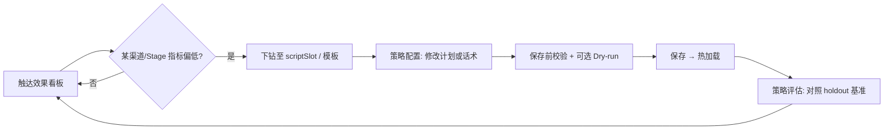
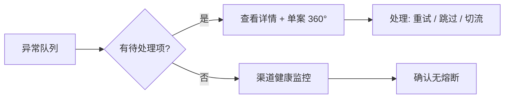
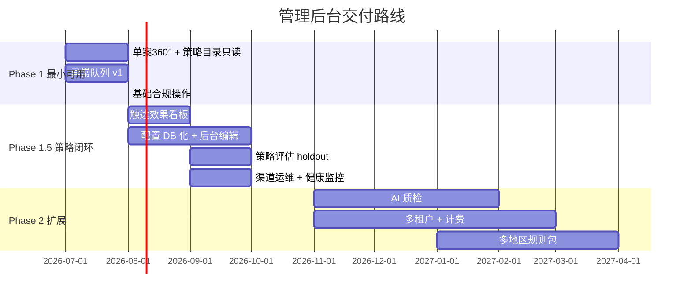

# MOCASA 催收系统升级 — Phase 1 管理后台设计文档

> **版本**: v1.1  
> **日期**: 2026-06-30  
> **状态**: ✅ 设计草案（基于产品讨论与 Intelligent-Collection-V1 方案对齐）  
> **范围**: 内部运营管理后台；菲律宾 MOCASA 现金贷 Phase 1；含商业化扩展预留  
> **定位**: 定义催收系统管理后台的信息架构、功能模块、交互闭环、技术边界与分阶段交付路线；不含前端实现细节与 API 契约全文。  
> **关联文档**:  
> - [产品需求文档 (PRD)](../Intelligent-Collection-V1/docs/MOCASA催收系统升级_Phase1_产品需求文档_PRD.md) §3、§6（F8/F11）、§9  
> - [架构设计文档](../Intelligent-Collection-V1/docs/MOCASA催收系统升级_Phase1_架构设计文档.md) §1.7（应用层）  
> - [领域模型与数据定义](../Intelligent-Collection-V1/docs/MOCASA催收系统升级_Phase1_领域模型与数据定义.md) §1.2  
> - [策略迭代与测试操作手册](../Intelligent-Collection-V1/docs/channel/MOCASA催收系统升级_Phase1_策略迭代与测试操作手册.md)  
> **输入来源**: 管理后台设计讨论（2026-06-30）、业内催收 SaaS 调研、同事评审优化（2026-06-30）

---

## 目录

- [1. 背景与目标](#1-背景与目标)
- [2. 设计原则与边界](#2-设计原则与边界)
- [3. 用户角色与权限](#3-用户角色与权限)
- [4. 信息架构总览](#4-信息架构总览)
- [5. 核心模块设计](#5-核心模块设计)
  - [5.1 数据分析看板](#51-数据分析看板)
  - [5.2 策略配置](#52-策略配置)
  - [5.3 案件与计划监控](#53-案件与计划监控)
  - [5.4 渠道与系统运维](#54-渠道与系统运维)
  - [5.5 异常队列](#55-异常队列)
  - [5.6 基础合规操作](#56-基础合规操作)
  - [5.7 策略评估（holdout 基准对比）](#57-策略评估holdout-基准对比)
  - [5.8 系统管理](#58-系统管理)
- [6. 配置管理与热更新](#6-配置管理与热更新)
- [7. 技术架构](#7-技术架构)
- [8. 商业化扩展预留](#8-商业化扩展预留)
- [9. Phase 2 规划](#9-phase-2-规划)
- [10. 分阶段交付路线](#10-分阶段交付路线)
- [11. 关键决策记录](#11-关键决策记录)
- [12. 开放问题](#12-开放问题)
- [附录 A：与 PRD 功能映射](#附录-a与-prd-功能映射)
- [附录 B：现有代码与页面资产](#附录-b现有代码与页面资产)

---

## 1. 背景与目标

### 1.1 背景

Intelligent-Collection-V1 将催收系统重构为事件驱动、SPI 解耦的分层架构，`collection-admin` 作为**应用层**承载管理后台 REST API、Webhook 回调与 XXL-Job 触发入口（详见 [架构设计文档 §1.7](../Intelligent-Collection-V1/docs/MOCASA催收系统升级_Phase1_架构设计文档.md#17-应用层-collection-admin)）。

当前 Phase 1 策略配置主路径仍是 **Nacos + Git 文档 + 代码发布**（详见 [策略迭代手册 §1](../Intelligent-Collection-V1/docs/channel/MOCASA催收系统升级_Phase1_策略迭代与测试操作手册.md#1-phase-1-策略配置在哪里)），后台仅有只读 API（`/catalog`、`/plans`）与开发用静态页（`catalog.html`、`orchestration.html`）。**运营与策略人员无法通过产品化界面完成日常配置与监控**，是 Phase 1 产品化缺口。

PRD 场景 B 定义了策略配置员的核心闭环：

1. 查看触达效果分析看板（渠道 / Stage / 模板维度）
2. 发现低响应率，调整触达计划或话术版本
3. 更改立即生效，无需发版

本设计文档将上述闭环落地为可执行的后台模块方案。

### 1.2 设计目标

| 目标 | 说明 |
|------|------|
| **策略闭环** | 看板发现问题 → 后台改配置 → 热加载生效 → 看板验证 |
| **运行可观测** | 单案 360° 视图 + 全局异常队列，支撑日常运维 |
| **配置产品化** | 逐步将 Nacos/代码中的策略配置迁移至 DB + 后台 UI |
| **商业化预留** | 多租户、计费计量、多地区规则包在数据模型与模块边界上预留，Phase 1 不交付完整能力 |
| **边界清晰** | 不含催收员坐席作业（LTH）、不含 Creditor Portal、不做重型合规子系统 |

### 1.3 成功标准

| 指标 | 验收口径 |
|------|----------|
| 配置无需发版 | 计划模板、话术、合规阈值、渠道开关均可通过后台修改并热加载 ✅ |
| 策略闭环可用 | 策略配置员可在 15 分钟内完成「看板 → 改模板 → 验证」全流程 ⏳ 待 UI 实现后实测 |
| 异常可发现 | 计划卡死、回调超时、渠道熔断等异常在 5 分钟内进入异常队列并可见 ✅ |
| 数据可下钻 | 看板汇总指标可下钻至 scriptSlot / 单案 timeline ✅ |

---

## 2. 设计原则与边界

### 2.1 设计原则

| 原则 | 说明 |
|------|------|
| **角色驱动导航** | 按催收主管 / 策略配置员 / 系统管理员的工作流组织菜单，而非按代码模块 |
| **配置与运行态分离** | 配置表（模板、规则）与运行表（plan、step、timeline）分开展示与操作 |
| **观测驱动决策** | 看板是策略迭代起点；配置变更应能关联到可观测指标 |
| **热更新优先** | 保存即发布（无强制审批流）；变更记录留痕但不阻断发布 |
| **校验而非审批** | 保存前做自动静态校验 + 可选历史预演（Dry-run）拦截荒谬配置；这是机器护栏，不是人工审批流 |
| **可复盘** | 运行态落表存配置版本/参数快照，确保改配置后旧案溯源拉到当时的真实配置 |
| **评估带基准** | 策略效果评估默认对照 holdout 基准 + cohort 对齐，避免进件质量波动造成的伪提升（Fake Lift） |
| **并发安全** | 配置写入用乐观锁（version + CAS），防多人编辑互相覆盖 |
| **渐进产品化** | Phase 1 先只读 + 有限写；Phase 1.5 完整配置 DB 化 |
| **API 先行** | 后台 UI 消费 `collection-admin` REST API，不直连引擎内部 |

### 2.2 In-scope（本设计覆盖）

- 内部运营管理后台（单一门户）
- 数据分析看板、策略配置、案件监控、渠道运维、异常队列
- 基础合规操作（投诉冻结 / 解冻 / 终态取消）
- 系统管理（账号、RBAC、租户预留字段）
- 计费与多地区规则包的**预留设计**（不含完整实现）

### 2.3 Out-of-scope（明确不做）

| 能力 | 决策 | 理由 |
|------|------|------|
| **Creditor Portal（客户门户）** | ✅ 暂不做 | 当前服务 MOCASA 自用；商业化初期仍由运营侧提供报表，Phase 2+ 再评估 |
| **强制审批发布流** | ✅ 不做 | 内部流程简单、合规要求较低；保存即生效 + 变更日志即可 |
| **重型合规子系统** | ✅ 不做 | Consent 台账、DNC 统一管理、Dispute 工单流等不作为 Phase 1 重点；引擎层合规 Guard 仍保留 |
| **催收员坐席作业** | ✅ 不做 | PRD 已锁定：人工外呼在 LTH，本系统仅查看与配置 |
| **绩效报表导出** | ✅ 不做 | PRD 决策：绩效取数在信贷主系统，本系统只记录底层数据 |
| **债务人自助门户** | ✅ 不做 | 非 Phase 1 范围 |

### 2.4 与 Intelligent-Collection-V1 架构对齐

```
┌─────────────────────────────────────────────────────────────┐
│                   管理后台 UI（本设计范围）                    │
│   看板 │ 策略配置 │ 案件监控 │ 渠道运维 │ 异常队列 │ 系统管理   │
└──────────────────────────┬──────────────────────────────────┘
                           │ REST API
                           ▼
┌─────────────────────────────────────────────────────────────┐
│              collection-admin（应用层，已有）                  │
│   CatalogController │ PlanQueryController │ WebhookController │
│   + 待扩展：ConfigController │ OpsQueueController │ ...       │
└──────────────────────────┬──────────────────────────────────┘
                           │ 读写
                           ▼
┌─────────────────────────────────────────────────────────────┐
│   collection-service（配置/运行数据）  │  BigQuery（聚合指标） │
└──────────────────────────┬──────────────────────────────────┘
                           │ CONFIG_CHANGED / 热加载
                           ▼
┌─────────────────────────────────────────────────────────────┐
│   engine.strategy + collection-channel（策略与渠道执行）       │
└─────────────────────────────────────────────────────────────┘
```

---

## 3. 用户角色与权限

角色定义与 PRD §3.1 一致。RBAC 复用现有 `t_system_role` / `t_system_role_function` 框架（PRD §9 决策）。

| 角色 | 核心职责 | 主要模块 |
|------|----------|----------|
| **催收主管** | 监控进度与效果、处理投诉冻结、查看异常 | 看板、案件监控、异常队列、基础合规操作 |
| **策略配置员** | 配置计划模板、话术、策略规则 | 看板、策略配置、策略评估 |
| **系统管理员** | 渠道开关、密钥引用、账号管理、全局切流 | 渠道运维、系统管理、异常队列 |

### 3.1 权限矩阵

| 模块 | 催收主管 | 策略配置员 | 系统管理员 |
|------|:--------:|:----------:|:----------:|
| 数据分析看板 | 读 | 读 | 读 |
| 策略配置 | — | 读写 | 读 |
| 案件与计划监控 | 读 | 读 | 读 |
| 渠道与系统运维 | 读 | — | 读写 |
| 异常队列 | 读 + 处理 | 读 | 读写 |
| 基础合规操作 | 读写 | — | 读 |
| 策略评估 | 读 | 读写 | 读 |
| 系统管理 | — | — | 读写 |

> **说明**：Phase 1 不引入多级主管审批或细粒度字段级权限（PRD §9 RBAC 决策）。

---

## 4. 信息架构总览

### 4.1 导航结构

```
管理后台
├── 📊 数据分析
│   ├── 触达效果看板          ← 场景 B 起点
│   ├── 回收效果看板          ← Stage 回收率、漏斗
│   └── 渠道 ROI 概览         ← 触达成本 vs 回收（P1）
├── ⚙️ 策略配置
│   ├── 触达计划模板          ← Stage × 日块 × 槽位
│   ├── 话术与模板            ← scriptSlot × 渠道
│   ├── 策略规则矩阵          ← DPD × 产品 × 标签 → 模板（risk_tier 维度预留）
│   ├── 合规阈值              ← 时段 / 频率 / 呼损率（简化配置）
│   └── 配置校验与预演         ← 保存前静态校验 + Dry-run（护栏，非审批）
├── 📋 案件监控
│   ├── 案件检索
│   └── 单案 360° 视图        ← plan + steps + timeline
├── 🔧 渠道运维
│   ├── 渠道开关与熔断
│   ├── 渠道健康监控
│   └── 全局切流（Emergency）
├── 🚨 异常队列
│   ├── 待处理异常
│   └── 异常历史
├── 🛡️ 合规操作              ← 轻量，非独立子系统
│   └── 投诉冻结 / 解冻
├── 📈 策略评估               ← holdout 基准对比，非黑盒实验引擎
└── ⚙️ 系统管理
    ├── 用户与角色
    ├── 操作日志
    └── 租户配置（预留）
```

### 4.2 核心用户路径

**路径 A — 策略配置员日常迭代（场景 B）**



**路径 B — 运维日常巡检**



---

## 5. 核心模块设计

### 5.1 数据分析看板

**定位**：观测层——回答「发生了什么、哪里有问题」。是策略迭代的起点，也是异常发现的辅助入口。

#### 5.1.0 冷热分离（数据新鲜度架构）

**问题**：成功标准要求「15 分钟看到配置效果」，但回收漏斗、Aging 等趋势指标若全部建在数仓（BigQuery 通常 T+1 或小时级延迟），实时闭环会被延迟打断。

**方案**✅：按指标的时效需求做冷热分离，看板上明示每个指标的「数据新鲜度」。

| 层 | 指标 | 数据源 | 延迟 | 支撑 |
|----|------|--------|------|------|
| **热层（实时）** | 触达量、送达率、接通率、异常计数 | MySQL / ODS 直读（运行表聚合） | 分钟级 | 15 分钟闭环、异常发现 |
| **冷层（趋势）** | 回收漏斗、分 Stage 回收率、Aging、渠道 ROI | BigQuery / 数仓 | T+1 / 小时级 | 趋势分析、策略复盘 |

> 策略配置员改话术后，先在热层看「送达/响应」是否即时变化（闭环验证），回收类结果在冷层次日复盘。

#### 5.1.1 触达效果看板（P0）

| 维度 | 指标 | 数据来源 | 层 |
|------|------|----------|----|
| 渠道 | 发送量、送达率、接通率（AI Call）、已读率（Email） | `t_contact_timeline` + 渠道回调 | 热 |
| Stage | S0–S4 各阶段触达量与结果分布 | plan + timeline 聚合 | 热 |
| 模板 / scriptSlot | 各 scriptSlot 触达量、结果分布 | step.template_id / scriptSlot | 热 |
| 时间 | 日 / 周 / 月趋势 | BigQuery 数仓 | 冷 |

**交互要求**：

- 默认展示近 7 日，支持自定义时间范围 ✅
- 表格 cell 可点击下钻至 scriptSlot 详情或案件列表 ⏳ Phase 1.5
- 每个指标标注数据新鲜度（实时 / T+1）✅
- 与 PRD F11 对齐：SMS、AI Call 为 KPI 口径渠道；Push / Email 仅看板呈现（PRD §6.2）

#### 5.1.2 回收效果看板（P1）

| 指标 | 说明 | 基线来源 |
|------|------|----------|
| 分 Stage 回收率 | S1 ~36% / S2 ~17% 等 | PRD §2.3 基线 |
| 触达 → 还款漏斗 | 触达量 → 响应 → 还款 | timeline + 还款事件 |
| Aging 分布 | 各 DPD 段案件量随时间变化 | 案件表聚合 |

> **说明**：绩效报表导出不在本系统实现（PRD §9 决策）；看板仅供内部策略与监控使用。

#### 5.1.3 渠道 ROI 概览（P1）

| 指标 | 说明 |
|------|------|
| 单渠道触达成本 | 按供应商单价 × 触达量估算 ⏳ 成本数据需运营维护 |
| 单渠道回收贡献 | 该渠道触达后 X 日内还款金额 / 案件数 |
| 成本回收比 | 辅助策略配置员判断渠道投入 |

数据来源：触达量来自 timeline；成本单价 ⏳ 待确认维护方式（配置表或手工导入）。

---

### 5.2 策略配置

**定位**：配置层——回答「发什么、什么顺序、什么时间」。策略配置员的核心工作区。

#### 5.2.1 触达计划模板

**功能**：按 Stage（S0–S4）配置固定槽位多步触达计划。

| 配置项 | 说明 | Phase 1 现状 | 目标态 |
|--------|------|-------------|--------|
| Stage | S0–S4 | Java 常量 / Nacos | DB `t_contact_plan_template` |
| 日块 / 槽位 | 每日触达窗口与步骤序列 | Nacos `channel.plan-templates` | 模板 JSON 可视化编辑 |
| 渠道顺序 | 如 Push → Email → SMS → AI Call | DefaultPlanFactory | 拖拽或表格编辑 |
| 触发时间 | 步骤间 delay、日频率上限 | 模板内字段 | 同上 |

**UI 形态** ⏳ 默认方案：Stage 为行的表格编辑器 + 步骤序列时间线预览；理由：比纯 JSON 编辑更易被运营理解，实现成本低于全拖拽编排器。

**生效策略** ✅ 已确定：

| 策略 | 行为 |
|------|------|
| 新配置 | 仅对新创建的 plan 生效 |
| 进行中 plan | 不 retroactive 修改已生成步骤；阶段变更重建 plan 时用新模板 |
| 保存 | 立即写入 DB/Nacos 并触发 CONFIG_CHANGED 热加载 |

#### 5.2.2 话术与模板

**功能**：管理 scriptSlot × 渠道的文案与外部 template_id 映射。

| 渠道 | 配置内容 | 预览 |
|------|----------|------|
| SMS / Push | title / body / 变量占位符 | 变量填充预览 |
| Email | SendGrid template_id + HTML | 已有 `/catalog/template/{slot}/preview` |
| AI Call / TTS | 话术脚本参数 | 文本预览 ⏳ 供应商参数待 LTH 确认 |

**变量支持**（PRD F6）：姓名、金额、日期、还款链接等；Phase 1 英文。

**关联 SSOT**：[渠道模板清单](../Intelligent-Collection-V1/docs/channel/MOCASA催收系统升级_Phase1_渠道模板清单与配置.md) 为 Phase 1 文档 SSOT；后台录入后与之对齐。

#### 5.2.3 策略规则矩阵

**功能**：`DPD × 产品 × 用户标签` → 计划模板 / 话术组（难催 vs 标准）。`risk_tier`（风险分层）作为**独立维度预留**，Phase 1 不参与匹配。

| 维度 | 示例 | Phase 1 状态 |
|------|------|-------------|
| DPD | D-3~D0 / D1–15 / D16–30 / … | ✅ 参与匹配 |
| 产品 | 现金贷产品 code | ✅ 参与匹配 |
| 用户标签 | 难催 / 标准 / 渠道偏好 / … | ✅ 参与匹配（规则驱动，PRD F5） |
| **risk_tier（风险分层）** | 高危 / 普通 | ⏳ **字段预留，Phase 1 不填充、不匹配** |
| 输出 | plan_template_id、tone、scriptSlot 前缀 | ✅ 命中结果 |

**risk_tier 为何预留而不在 Phase 1 填充**（采纳风险分层建议的方向，但拒绝低质量粗分）：

- **诉求成立**：仅按 DPD + 渠道差异化不足——理想情况下高难度案件应走更强触达。
- **Phase 1 缺乏可靠信号**：
  - **金额不适合**——好用户往往获得高额度，但高额逾期反而催回更难，金额与催回难度无正向区分度，甚至负相关。
  - **行为粗分不适合对外**——历史逾期次数 / 首逾等粗分对内勉强可用，但**对外商业化输出时不够专业**，会成为负担。
  - 用错误信号分层 **不如不分层**。
- **决策**✅：Phase 1 **维度字段预留、逻辑不启用**；矩阵仍按 `DPD × 产品 × 标签` 匹配。
- **Phase 2 启用**：接催收评分卡 ML 模型（还款概率 / 失联预测）填充 `risk_tier`；矩阵结构不变，仅新增该维度参与匹配（DecisionEngine SPI 已预留）。
- **关键**：字段从一开始就设为**独立维度**（不混入"用户标签"），保证 Phase 2 启用时零结构改动、历史数据可回溯对齐。

Phase 1 使用 `RuleBasedDecisionEngine`；Phase 2 可替换为 LLM（SPI 预留）。

#### 5.2.4 合规阈值（简化配置）

**定位**：非独立合规子系统，而是策略配置下的**可配参数组**。

| 参数 | 默认值 | 说明 |
|------|--------|------|
| 触达时段 | 6:00–22:00 | PRD §7.2 |
| 单用户日触达上限 | 策略配置员设定 | 按用户维度 Redis 计数 |
| AI Call 呼损率上限 | 策略配置员设定 | 超阈值降级渐进式拨号 |

保存即生效；违规拦截记录可在案件 360° 或看板中查看，不单独建设合规管理模块 ✅。

#### 5.2.5 配置校验与 Dry-run 预演

**定位**：在「无审批流」前提下提供**自动护栏**——保存即生效，但荒谬配置不允许保存。区别于人工审批：这是机器校验，零等待。

| 层级 | 能力 | 时机 | 拦截示例 |
|------|------|------|----------|
| **静态校验**（P0） | 字段级规则校验，保存前同步执行 | 点击保存 | 触达时段非法（如 22:00–06:00 跨夜未声明）、日频率上限 = 0、模板变量缺失、scriptSlot 无渠道映射、计划步骤引用了停用渠道 |
| **Dry-run 预演**（P1） | 对历史案件样本回放新规则，展示命中分布 | 保存前可选触发 | 新规则导致某 Stage 触达量骤增/归零、与现有合规阈值冲突、绝大多数案件未命中任何模板 |

**Dry-run 实现**：复用 `MockTriggerController` 能力，取近期历史案件样本（如近 7 日 N 个案件），用**新配置**跑一遍 plan 生成与 Guard 校验（不真实发送），输出：

- 命中各模板 / scriptSlot 的案件数分布
- 触发合规拦截的数量与原因
- 与变更前的差异对比

> 这与 §5.7 holdout 的区别：Dry-run 是**上线前**的逻辑预演（防呆），holdout 是**上线后**的效果校准（防 Fake Lift）。

---

### 5.3 案件与计划监控

**定位**：运行态只读 + 有限干预。支撑 debug、客诉处理与异常排查。

#### 5.3.1 案件检索

| 检索条件 | 说明 |
|----------|------|
| caseId / userId | 精确检索 |
| Stage | S0–S4 筛选 |
| plan 状态 | ACTIVE / COMPLETED / CANCELLED 等 |
| 最近触达渠道 | timeline 聚合 |
| 冻结状态 | 是否 complaint 冻结 |

列表展示脱敏后的用户标识（PRD §9 脱敏决策）。

#### 5.3.2 单案 360° 视图

**功能**：一屏展示案件触达全链路，是 orchestration.html 的产品化版本。

| 区块 | 内容 | 现有 API |
|------|------|----------|
| 案件摘要 | Stage、DPD、产品、冻结状态 | 待扩展 |
| 活跃计划 | plan 状态、步骤序列、各 step 状态 | `/plans/active/by-case/{caseId}` |
| 步骤详情 | channel、template_id、config_version、trigger_time、result | `/plans/{planId}/steps` |
| 触达时间线 | 全渠道触达记录 | `/plans/timeline/{userId}` |
| 决策日志 | 规则命中（Phase 2 `t_decision_log`） | 预留 |

**交互**：步骤状态色标（已有 orchestration.html 样式可复用）；支持从看板/异常队列一键跳转。

---

### 5.4 渠道与系统运维

**定位**：系统管理员保障渠道可用性与故障响应。

#### 5.4.1 渠道开关与熔断

| 能力 | 说明 | PRD 依据 |
|------|------|----------|
| 单渠道 enable/disable | Push / Email / SMS / AI Call 独立开关 | F2 |
| 自动熔断状态展示 | 连续失败超阈值后降级 | §9 渠道故障降级 |
| 手动恢复 | 熔断后人工确认恢复 | 运维操作 |

#### 5.4.2 渠道健康监控（P1，F13）

| 指标 | 告警条件 |
|------|----------|
| 成功率 | 低于阈值 |
| 平均延迟 | 高于阈值 |
| 错误码分布 | 某错误码突增 |

对接 Micrometer + Prometheus + Grafana（架构文档 §2 技术栈决策）；后台嵌入 Grafana 面板或自建简化视图 ⏳ 待确认嵌入 vs 跳转。

#### 5.4.3 全局切流（Emergency）

| 操作 | 场景 |
|------|------|
| 全局暂停 AI Call | 供应商大面积故障 |
| 全局 SMS 补发策略 | Viber 不可用时的降级（Phase 2 渠道） |
| 全局暂停自动触达 | 合规突发检查 |

操作需二次确认；记录操作人、时间、原因（操作日志，非审批流）✅。

---

### 5.5 异常队列

**定位**：运维与主管的**行动入口**——集中展示需要人工关注的运行态异常。✅ 本设计重点模块。

#### 5.5.1 异常类型

| 类型 | 触发条件 | 建议处理 |
|------|----------|----------|
| **CALLBACK_TIMEOUT** | 异步渠道步骤超时未回调 | 查供应商状态 / 手动补发事件 / 标记 FAILED |
| **PLAN_STUCK** | 计划长期处于 EXECUTING / WAITING 异常态 | 单案 360° 排查 / 引擎对账 |
| **CHANNEL_CIRCUIT_OPEN** | 渠道熔断触发 | 确认供应商 / 手动恢复 / 切流 |
| **DLQ_EVENT** | Redis Stream 死信 | 重试 / 丢弃 / 升级 |
| **COMPLIANCE_BLOCK_SPIKE** | 合规拦截量突增 | 检查阈值配置是否误改 |
| **INGESTION_FAILURE** | 上游 PubSub 消费失败 | 检查接入层日志 |

来源：引擎 CALLBACK_TIMEOUT 机制（[架构文档 §1.8.9](../Intelligent-Collection-V1/docs/MOCASA催收系统升级_Phase1_架构设计文档.md#189-异步回调对账)）、渠道熔断、CollectionEventBus DLQ。

#### 5.5.2 折叠聚合（防雪崩，核心设计）

**问题**：菲律宾本地网关（如 SMS 链路）短时波动会瞬间产生海量同类 `CALLBACK_TIMEOUT` / `CHANNEL_CIRCUIT_OPEN`。若逐条展示，主管会被刷屏淹没，真正需要单独处理的异常（如 PLAN_STUCK）被埋没。

**方案**✅：队列**默认按 `渠道 + 错误码 + 时间窗` 折叠聚合**，一行代表一簇同类异常。

| 机制 | 说明 |
|------|------|
| 聚合维度 | `异常类型 × 渠道 × 错误码`，滚动时间窗（如 5/15 分钟）内合并 |
| 折叠展示 | 一行显示「SMS / TIMEOUT / 1,243 条 / 近 15 分钟」，可展开看明细 |
| 入队去重 | 同 stepId 的重复异常事件去重，避免同一问题反复入队 |
| 限流保护 | 单簇超阈值后只更新计数，不再产生新通知（防告警风暴） |
| 升级提示 | 某簇增速异常（如分钟级翻倍）时标红，提示可能是网关故障 |

#### 5.5.3 队列交互

| 能力 | 说明 |
|------|------|
| 待处理列表 | 按簇严重度 + 增速排序；默认展示未处理簇 |
| 详情/明细 | 展开簇查看逐条 caseId / planId / stepId / 错误信息 |
| 快捷跳转 | 单条一键进入单案 360° |
| **批量操作** | 对整簇批量重试 / 批量忽略 / 批量标记已处理 / 一键关联全局切流 |
| 单条操作 | 重试、跳过、标记已处理 |
| 历史记录 | 已处理簇及处理人、处理时间、影响条数、备注 |

> 批量操作是防雪崩的关键——网关恢复后，主管对整簇「SMS / TIMEOUT」一键批量重试，而非逐条点击。

#### 5.5.4 告警联动

| 渠道 | 场景 |
|------|------|
| 后台站内通知 | 新异常簇出现或某簇升级（增速翻倍） |
| 外部告警 ⏳ | 钉钉 / 邮件；按簇而非逐条推送，对接方式待确认 |

---

### 5.6 基础合规操作

**定位**：满足 PRD 场景 C 的最小后台能力；**不是**独立合规子系统。

| 操作 | 行为 | 角色 |
|------|------|------|
| **投诉冻结** | 对用户活跃 plan 打冻结标记；引擎 Pre-flight 拦截新触达，不取消 plan | 催收主管 |
| **解冻** | 清除冻结标记，恢复触达 | 催收主管 |
| **终态取消** | 确认违规后标记 COMPLAINT 终态，不再续建 | 催收主管 |

记录：操作人、时间、原因（操作日志）。不建设 Consent 台账、DNC 管理、Dispute 工单流 ✅。

---

### 5.7 策略评估（holdout 基准对比）

**定位**：回答「我改的策略到底有没有效」。本设计**不建设重型 A/B 实验引擎**，但必须避免最常见的评估陷阱——**Fake Lift（伪提升）**。

#### 5.7.1 为什么不能只做「前后 N 日对比」

现金贷进件的资产质量随时间剧烈波动（vintage 效应）：本月新策略效果看起来变好，可能只是这批进件本身更优质，与策略无关。**单纯「变更前 N 日 vs 变更后 N 日」会把资产质量变化误判为策略效果**，得出错误结论。

| 评估方式 | 是否抗 Fake Lift | 成本 | 本设计态 |
|----------|:----------------:|------|----------|
| 纯日历日前后对比 | ❌ 否 | 低 | **降级为辅助参考，不作主结论** |
| **holdout 基准对比** | ✅ 是 | 低 | **Phase 1.5 主评估口径** ✅ |
| cohort 对齐对比 | ✅ 部分 | 低 | 与 holdout 配合使用 |
| 完整随机 A/B 实验平台 | ✅ 是 | 高 | Phase 2 可选，非必需 |

#### 5.7.2 holdout 基准对比（Phase 1.5 主口径）

**做法**：分案时按 `userId` hash 留出固定小比例（如 5–10%）走**基准策略**（不随配置变更），其余走实验策略。评估时对比「实验组 vs 同期 holdout」。

| 要素 | 说明 |
|------|------|
| 分流 | 分案阶段按 `userId` hash 稳定分桶，holdout 固定不变 |
| 基准组 | 始终走基准策略，作为「同期资产质量」的参照系 |
| 对比口径 | 实验组指标 − 同期 holdout 指标 = 真实 Lift（剔除质量波动） |
| cohort 对齐 | 进一步按入催批次 / 起始 DPD 日期分组对比，而非日历日 |
| 输出 | 真实提升幅度；运营判断为主，不强求 p-value |

**典型用法**：策略配置员改 S2 SMS 话术后，对比「实验组 S2 响应率」与「同期 holdout S2 响应率」的差值，而非「本周 vs 上周」。

> 与 §5.2.5 Dry-run 的区别：Dry-run 是**上线前**逻辑防呆；holdout 是**上线后**效果校准。两者互补。

#### 5.7.3 辅助：变更标记与前后对比

作为 holdout 的补充，看板保留轻量前后对比，但**明确标注混淆风险**：

| 能力 | 说明 |
|------|------|
| 变更标记 | 配置保存时自动记录变更时间点与摘要，在看板时间轴打点 |
| 前后对比 | 变更前后同维度指标并排，**附「未控制资产质量波动」风险提示** |

#### 5.7.4 Phase 2 结构化实验（可选）

仅在 holdout 不足以支撑决策时启动：实验控制台（实验定义、流量比例、结束条件）+ 统计显著性报告（如 chi-square / 序贯检验）。⏳ 默认不纳入；理由：holdout + cohort 对齐已能消除 Fake Lift，满足当前迭代需求。

---

### 5.8 系统管理

| 子模块 | 功能 | Phase |
|--------|------|-------|
| 用户与角色 | 创建/禁用账号，分配主管/策略/管理员角色 | P0 |
| 操作日志 | 记录配置变更、全局切流、冻结操作（谁、何时、做了什么） | P0 |
| 租户配置（预留） | 租户 ID、名称、状态；Phase 1 仅 MOCASA 单租户 | 预留 |
| SQL 规则治理（P1，F12） | SQL 引擎规则版本、回滚、沙箱 | P1 |

---

## 6. 配置管理与热更新

### 6.1 配置存储演进

| 阶段 | 配置来源 | 运行观测 |
|------|----------|----------|
| **Phase 1 现状** | Nacos + Git + Java 常量 | MySQL 运行表 + 只读 catalog API |
| **Phase 1.5 目标** | DB 配置表为主，Nacos 仅渠道密钥 | 后台完整读写 |
| **Phase 2** | DB + 多租户 scoped 配置 | 同上 |

### 6.2 待建配置表（与领域模型对齐）

| 表 | 用途 | 领域模型状态 |
|----|------|-------------|
| `t_contact_plan_template` | 计划模板 JSON | NEW ⚠️ 待 DDL |
| `t_strategy_rule` | 策略规则矩阵（含 `risk_tier` 预留列） | NEW ⚠️ 待 DDL |
| `t_compliance_rule` | 合规阈值 | NEW ⚠️ 待 DDL |
| `t_channel_config` | 渠道路由与开关 | NEW ⚠️ 待 DDL |
| `t_config_change_log` | 配置变更日志 | 本设计新增建议 |

**所有配置表的公共列约定**：

- `version`（乐观锁，见 §6.4）
- `config_version`（全局递增的配置版本号，运行态快照引用，见 §6.5）
- `tenant_id`（多租户预留，Phase 1 默认单租户，见 §8.1）

运行态表（已存在）：`t_contact_plan`、`t_contact_plan_step`、`t_contact_timeline`——需 ALTER 增加快照字段（见 §6.5）。

### 6.3 热更新流程

```
后台编辑配置
  → 静态校验（§5.2.5，不通过则拒绝保存）
  → [可选] Dry-run 历史预演（§5.2.5）
  → 乐观锁写入 DB（version CAS，冲突则提示刷新；config_version 递增）
  → 记录 change_log
  → 发布 CONFIG_CHANGED 事件 / Nacos 推送
  → engine.strategy 各组件刷新本地缓存
  → 新 plan 创建时使用新配置（运行态落表带 config_version 快照，§6.5）
```

**不做** Draft / Approve / Publish 审批门 ✅；**做** 静态校验 + 可选 Dry-run + change_log 留痕。

### 6.4 变更日志与并发控制

**变更日志字段**：

| 字段 | 说明 |
|------|------|
| operator | 操作人 |
| timestamp | 变更时间 |
| config_type | plan_template / script / rule / compliance / channel |
| config_key | 如 scriptSlot、template_id |
| from_version / to_version | 变更前后配置版本号 |
| diff_summary | 变更摘要（JSON diff 或文本） |
| rollback_ref | 可一键回滚至指定版本 ⏳ P1 |

**乐观锁（防多人脏写）**✅ P0：

- 每条配置记录带 `version` 字段；保存时 `UPDATE ... WHERE id=? AND version=?`（CAS）
- 版本不匹配 → 拒绝写入，提示「该配置已被他人修改，请刷新后重试」
- 与节点数无关，单实例多人编辑也必须有

### 6.5 历史快照与可复盘（核心数据约束）

**问题**：运行表（`t_contact_plan_step` / `t_contact_timeline`）若只存 `template_id`，一旦话术/模板被修改，旧案溯源时拉取到的全是**新内容**——无法还原「当时实际发给用户的是什么」，客诉举证、质检复盘、合规追溯全部失真。

**方案**✅：运行态落表时**冻结当时的配置引用与关键参数**。

| 表 | 新增字段 | 内容 |
|----|----------|------|
| `t_contact_plan_step` | `config_version` | 生成该步骤时的配置版本号 |
| `t_contact_plan_step` | `resolved_params`（JSON） | 解析后的关键参数（scriptSlot、渠道、模板 id、tone 等） |
| `t_contact_timeline` | `config_version` + `rendered_ref` | 实际发送时的配置版本 + 渲染内容引用（变量已填充的话术摘要） |

- **快照粒度**✅：存 `config_version` + 关键参数 JSON 快照（已确认口径）——平衡存储成本与可复盘性；需要完整正文时按 `config_version` 回查配置表。
- **跨文档影响** ⚠️：此为运行表 schema 变更，需在 [领域模型与数据定义](../Intelligent-Collection-V1/docs/MOCASA催收系统升级_Phase1_领域模型与数据定义.md) §7 DDL 配合增列。本设计提出需求，DDL 落地以领域模型文档为准。

### 6.6 节点配置一致性（多实例演进项）

Phase 1 为**单实例部署**（[架构文档 §3.1](../Intelligent-Collection-V1/docs/MOCASA催收系统升级_Phase1_架构设计文档.md#31-容量扩展)），不存在「部分节点未收到 Nacos 推送导致新老策略混跑」的脑裂问题，因此本能力**当前不做**。

⏳ **演进触发条件**：当引擎扩容到 >1 个实例（多个 Consumer 加入 Redis Stream Consumer Group）时，启用「节点配置版本一致性视图」——展示各引擎节点当前加载的 `config_version`，运维可发现落后/失联节点。

---

## 7. 技术架构

### 7.1 前后端分离

| 层 | 技术选型 | 说明 |
|----|----------|------|
| 前端 | React / Vue SPA + Ant Design Pro 类组件库 ⏳ | PRD §8.1：管理后台英文界面 |
| 后端 | Spring Boot 2.7.18 `collection-admin` | 已有 |
| 鉴权 | Shiro + RBAC | PRD §9 决策 |
| BI 聚合 | **冷热分离**：热层 MySQL/ODS 直读（实时），冷层 BigQuery（趋势 T+1） | 看板数据源，见 §5.1.0 |

### 7.2 API 扩展规划

| Controller | 职责 | 状态 |
|------------|------|------|
| `CatalogController` | 策略/模板只读目录 | ✅ 已有 |
| `PlanQueryController` | 计划/时间线查询 | ✅ 已有 |
| `MockTriggerController` | 测试触发 | ✅ 已有（dev） |
| `ConfigController` | 配置 CRUD + 热加载 | ⏳ 待建 |
| `OpsQueueController` | 异常队列查询与处理 | ⏳ 待建 |
| `DashboardController` | 看板聚合 API | ⏳ 待建 |
| `ComplianceOpsController` | 冻结/解冻/终态取消 | ⏳ 待建 |

### 7.3 现有页面资产

| 页面 | 用途 | 演进 |
|------|------|------|
| `catalog.html` | 策略目录只读 | → 话术管理模块原型 |
| `orchestration.html` | 单案编排观测 | → 单案 360° 视图原型 |

详见 [附录 B](#附录-b现有代码与页面资产)。

---

## 8. 商业化扩展预留

Phase 1 服务 MOCASA 菲律宾自用；后续作为催收服务商对外商业化。以下在**数据模型与模块边界**预留，Phase 1 不交付完整 UI。

### 8.1 多租户

| 预留项 | 说明 |
|--------|------|
| `tenant_id` | 所有配置表与运行表预留字段；Phase 1 默认单租户 `mocasa-ph` |
| 租户配置页 | 系统管理下占位；Phase 2 启用 |
| 数据隔离 | 查询层强制 tenant 过滤 |

**不做** Creditor Portal ✅；对外客户报表 Phase 2+ 再评估。

### 8.2 计费与计量（预留）

| 预留项 | 说明 |
|--------|------|
| `t_usage_meter` | 按租户统计触达量、案件量、渠道用量 |
| 计费维度 | 触达条数 / 案件数 / 回收佣金 ⏳ 商务规则待确认 |
| 后台模块 | 「计费与用量」菜单占位；Phase 2 实现 |

### 8.3 地区与产品

| 维度 | 预留 |
|------|------|
| `region` | ph / 未来市场 |
| `product_code` | 不同现金贷产品 |
| `locale` | Phase 1 英文；Tagalog Phase 2 |

---

## 9. Phase 2 规划

以下能力 Phase 1 仅预留接口/表结构/菜单占位，Phase 2 实现。

### 9.1 AI 质检模块

| 能力 | 说明 |
|------|------|
| AI Call 100% 监控 | 对接 ASR 转写（`TranscriptService` 预留） |
| 合规 scorecard | 禁用词、必填披露检测 |
| 质检看板 | 违规趋势、clip 回放 |

与 PRD F16（ASR 转写）对齐。

### 9.2 多地区规则包

| 能力 | 说明 |
|------|------|
| Regulatory Rule Pack | 菲律宾 SEC MC 18-2019 为默认包；新市场新增包 |
| 规则包切换 | 按 region 加载不同合规阈值与模板 |
| 语言本地化 | Tagalog 话术（PRD §8.1 Phase 2） |

### 9.3 结构化 A/B 实验（可选）

见 [§5.7.4](#574-phase-2-结构化实验可选)。仅在 holdout 基准对比不足以支撑决策时启动。

### 9.4 Creditor Portal（可选）

对外商业化时，委托方可自助查看组合表现与 SLA；与内部运营后台分离。当前明确不做。

---

## 10. 分阶段交付路线



### 10.1 Phase 1 最小可用（P0）

| 交付项 | 说明 |
|--------|------|
| 单案 360° 视图 | 产品化 orchestration.html |
| 策略目录只读 | 产品化 catalog.html |
| 异常队列 v1 | CALLBACK_TIMEOUT、PLAN_STUCK、CHANNEL_CIRCUIT_OPEN（逐条；折叠聚合见 Phase 1.5 §5.5.2） |
| 基础合规操作 | 冻结 / 解冻 / 终态取消 |
| 用户与角色 | RBAC 基础 |

### 10.2 Phase 1.5 策略闭环（P0/P1）

| 交付项 | 说明 |
|--------|------|
| 触达效果看板（冷热分离） | 渠道 × Stage × scriptSlot；热层实时、冷层趋势（§5.1.0） |
| 配置 DB 化 | 计划模板、话术、规则、合规阈值后台编辑 |
| 热加载 + 乐观锁 | 保存即生效 + version CAS 防脏写 + change_log |
| 配置校验 + Dry-run | 静态校验 P0；历史预演 P1（§5.2.5） |
| 历史快照 | 运行表落 config_version + 参数快照（§6.5） |
| 策略评估 | holdout 基准对比 + cohort 对齐（§5.7） |
| 异常队列折叠聚合 | 渠道+错误码聚合 + 批量操作（§5.5.2） |
| 渠道运维 | 开关、熔断、全局切流 |
| 回收效果看板 | 分 Stage 回收率、漏斗（冷层） |
| SQL 规则治理 | F12 |

### 10.3 Phase 2 扩展

| 交付项 | 说明 |
|--------|------|
| AI 质检 | ASR + 合规 scorecard |
| 多租户 + 计费 | tenant scoped + 用量计量 |
| 多地区规则包 | region 切换 |
| 结构化 A/B | 可选 |
| Creditor Portal | 可选，当前不做 |

---

## 11. 关键决策记录

| 决策项 | 结论 | 理由 |
|--------|------|------|
| Creditor Portal | **Phase 1 不做** | 当前 MOCASA 自用；对外报表由运营侧提供 |
| 审批发布流 | **不做** | 内部流程简单、合规要求低；静态校验 + Dry-run 替代 |
| 重型合规子系统 | **不做** | 引擎 Guard + 基础冻结操作足够；非业务重点 |
| 策略效果评估 | **holdout 基准 + cohort 对齐（Phase 1.5）** | 避免现金贷 vintage 波动造成 Fake Lift；前后对比仅作辅助 |
| risk_tier 风险分层 | **字段预留，Phase 1 不填充** | 金额无区分度；行为粗分不适合对外；Phase 2 接 ML 评分卡 |
| 配置护栏 | **静态校验 P0 + Dry-run P1** | 无审批流但需防荒谬配置上线 |
| 历史快照 | **config_version + 关键参数 JSON** | 改配置后旧案可复盘当时真实内容 |
| 看板数据源 | **冷热分离** | 热层 MySQL 分钟级支撑 15 分钟闭环；冷层 BigQuery 做趋势 |
| 配置并发 | **乐观锁 P0** | 防多人编辑脏写；与单/多实例无关 |
| 节点一致性视图 | **多实例演进项** | Phase 1 单实例无脑裂；>1 节点时启用 |
| 异常队列 | **Phase 1 必做；Phase 1.5 折叠聚合** | 防网关抖动雪崩；批量操作 |
| 计费模块 | **Phase 2，预留数据模型** | 商业化时需要，当前无计费需求 |
| AI 质检 / 多地区 | **Phase 2，提前规划模块** | 依赖 ASR 与新市场拓展 |
| 配置存储 | **Phase 1.5 迁 DB** | 摆脱 Nacos/代码发布依赖，实现场景 B |
| 界面语言 | **英文** | PRD §8.1 |
| 绩效报表 | **不在本系统** | PRD §9 决策 |

---

## 12. 开放问题

| # | 问题 | 影响 | 状态 |
|---|------|------|------|
| Q1 | 看板冷热分离细节（热层物化视图刷新周期） | §5.1.0 架构已定为 MySQL 热 + BQ 冷；刷新策略待实现 | ⏳ 默认热层 1–5 分钟刷新 |
| Q2 | 渠道 ROI 成本单价由谁维护、如何录入？ | §5.1.3 渠道 ROI | ❓ 待运营确认 |
| Q3 | 异常队列外部告警渠道（钉钉/邮件）？ | §5.5.4 | ❓ 待运维确认 |
| Q4 | Grafana 嵌入后台还是跳转独立页面？ | §5.4.2 | ⏳ 默认跳转，嵌入成本高 |
| Q5 | 配置变更回滚是否 Phase 1.5 必做？ | §6.4 | ⏳ 默认 P1，手动回滚可先接受 |
| Q6 | 前端技术栈 React vs Vue 最终选型？ | §7.1 | ⏳ 默认 React + Ant Design Pro |
| Q7 | holdout 基准组比例（5% vs 10%） | §5.7.2 策略评估 | ❓ 待策略/业务确认 |

---

## 附录 A：与 PRD 功能映射

| PRD 编号 | 功能 | 本设计模块 | Phase |
|----------|------|-----------|-------|
| F8 | 统一管理后台 | 全文 | 1 / 1.5 |
| F11 | 触达效果分析看板 | §5.1 | 1.5 |
| F12 | SQL 引擎规则治理 | §5.8 | 1.5 |
| F13 | 渠道健康监控 | §5.4.2 | 1.5 |
| F3 | 触达计划编排 | §5.2.1 | 1.5 |
| F5 | 触达策略引擎 | §5.2.3 | 1.5 |
| F6 | 话术模板管理 | §5.2.2 | 1 / 1.5 |
| F4 | 合规引擎 | §5.2.4 + §5.6 | 1 |
| 场景 B | 策略配置与调优 | §4.2 路径 A、§5.7 | 1.5 |
| 场景 C | 投诉冻结 | §5.6 | 1 |

---

## 附录 B：现有代码与页面资产

| 资产 | 路径 | 说明 |
|------|------|------|
| CatalogController | `Intelligent-Collection-V1/collection-admin/.../CatalogController.java` | 策略目录只读 API |
| PlanQueryController | `Intelligent-Collection-V1/collection-admin/.../PlanQueryController.java` | 计划/时间线查询 |
| catalog.html | `Intelligent-Collection-V1/collection-admin/src/main/resources/static/catalog.html` | 策略目录静态页 |
| orchestration.html | `Intelligent-Collection-V1/collection-admin/src/main/resources/static/orchestration.html` | 单案观测静态页 |
| MockTriggerController | `Intelligent-Collection-V1/collection-admin/.../MockTriggerController.java` | 测试触发（可包装为沙箱入口） |

---

> **修订历史**  
> - v1.1 · 2026-06-30 · 整合同事评审 8 条优化：holdout 评估、risk_tier 预留、Dry-run 护栏、历史快照、冷热分离、异常折叠聚合、乐观锁、节点一致性演进项  
> - v1.0 · 2026-06-30 · 初版：整合管理后台设计讨论、用户边界确认、业内调研结论
