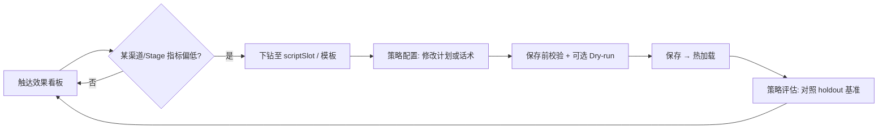
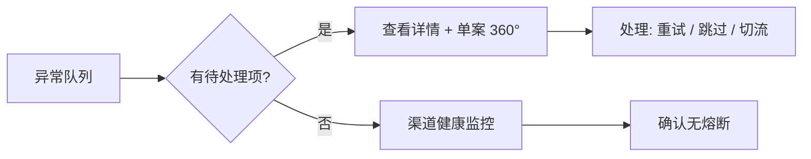
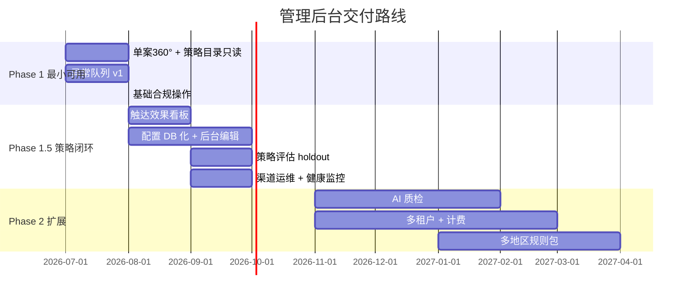

# MOCASA 催收系统升级 — Phase 1 管理后台设计文档

> **版本**: v1.6  
> **日期**: 2026-09-07  
> **状态**: ✅ 已确定（设计基线）；v1.6 收口看板两视图 / 告警 A1–A3 + 渠道 FAILED A7–A9 / 后台替代按日自动跑记录。未开工项见正文 ⏳ / ❓。实现进度见 HANDOFF 与测试文档。  
> **范围**: 内部运营管理后台；菲律宾 MOCASA 现金贷 Phase 1；含商业化扩展预留  
> **定位**: 定义催收系统管理后台的信息架构、功能模块、交互闭环、技术边界与分阶段交付路线；不含前端实现细节与 API 契约全文。  
> **关联文档**:  
> - [产品需求文档 (PRD)](./MOCASA催收系统升级_Phase1_产品需求文档_PRD.md) [§3](./MOCASA催收系统升级_Phase1_产品需求文档_PRD.md#3-目标用户与使用场景)、[§6](./MOCASA催收系统升级_Phase1_产品需求文档_PRD.md#6-功能需求清单)（F8/F11）、[§9](./MOCASA催收系统升级_Phase1_产品需求文档_PRD.md#9-产品层已拍板决策)  
> - [架构设计文档](./MOCASA催收系统升级_Phase1_架构设计文档.md) §1.6（应用层）  
> - [领域模型与数据定义](./MOCASA催收系统升级_Phase1_领域模型与数据定义.md) §1.2  
> - [管理后台操作手册](./MOCASA催收系统升级_Phase1_管理后台操作手册.md)  
> - [策略迭代与测试操作手册](./channel/MOCASA催收系统升级_Phase1_策略迭代与测试操作手册.md)  
> - [Facade Webhook 实现规格](./channel/MOCASA催收系统升级_Phase1_AI_Call_Facade_Webhook实现规格.md)  
> **输入来源**: 管理后台设计讨论（2026-06-30）、业内催收 SaaS 调研、同事评审优化（2026-06-30）；v1.2 对齐新 Pub/Sub 投影与 AI Call Facade

---

## 目录

- [1. 背景与目标](#1-背景与目标)
- [2. 设计原则与边界](#2-设计原则与边界)
- [3. 用户角色与权限](#3-用户角色与权限)
- [4. 信息架构总览](#4-信息架构总览)
- [5. 核心模块设计](#5-核心模块设计)
  - [5.1 数据分析看板](#51-数据分析看板)（v1.6：今日执行 / 复盘 两视图）
  - [5.2 策略配置](#52-策略配置)
  - [5.3 案件与计划监控](#53-案件与计划监控)
  - [5.4 渠道与系统运维](#54-渠道与系统运维)
  - [5.5 异常队列](#55-异常队列)
  - [5.6 基础合规操作](#56-基础合规操作)
  - [5.7 策略评估（holdout 基准对比）](#57-策略评估holdout-基准对比)
  - [5.8 系统管理](#58-系统管理)
- [6. 配置管理与热更新](#6-配置管理与热更新)
- [7. 技术架构](#7-技术架构)
- [8. 商业化扩展预留](#8-商业化扩展预留)
- [9. Phase 2 规划](#9-phase-2-规划)
- [10. 分阶段交付路线](#10-分阶段交付路线)
- [11. 关键决策记录](#11-关键决策记录)
- [12. 开放问题](#12-开放问题)
- [13. 差距地图：离「成熟稳定完整的催收作业系统」还差什么](#13-差距地图离成熟稳定完整的催收作业系统还差什么)
- [附录 A：与 PRD 功能映射](#附录-a与-prd-功能映射)
- [附录 B：现有代码与页面资产](#附录-b现有代码与页面资产)

---

## 1. 背景与目标

### 1.1 背景

Intelligent-Collection-V1 将催收系统重构为事件驱动、SPI 解耦的分层架构，`collection-admin` 作为**应用层**承载管理后台 REST API、Webhook 回调与调度订阅触发入口（Cloud Scheduler → Pub/Sub → 应用订阅）（详见 [架构设计文档 §1.6](./MOCASA催收系统升级_Phase1_架构设计文档.md#17-应用层-collection-admin)）。

当前 Phase 1 策略配置主路径仍是 **Nacos + Git 文档 + 代码发布**（详见 [策略迭代手册 §1](./channel/MOCASA催收系统升级_Phase1_策略迭代与测试操作手册.md#1-phase-1-策略配置在哪里)），后台已有 React SPA（`collection-admin/ui`，菜单：看板 / 策略 / 模板 / 案件监控 / 异常队列 / 合规 / 系统）与对应 REST。`catalog.html`、`orchestration.html` 仅作开发观测页，不再是唯一入口。

案件检索读源已切到 `t_ai_collection`，与入案主路径一致。单案摘要已由 `GET /cases/{caseId}` 提供投影字段（含 `ownerDate` 与最近取消原因）；仍未闭合的是 AI Call 回调细节与录音/转写代理。AI Call 观测（看板分区、360 外呼、钉钉 CRITICAL、`t_ai_call_session`）以本文为唯一设计 SSOT，实现落地后同步回写操作手册。小团队以超级管理员日常运营，审计留痕优先于权限管制；Pilot 主链路距可运营系统的缺口见 [§13](#13-差距地图离成熟稳定完整的催收作业系统还差什么)。版本编年见文末修订记录。

PRD 场景 B 定义了策略配置员的核心闭环：

1. 查看触达效果分析看板（渠道 / Stage / 模板维度）
2. 发现低响应率，调整触达计划或话术版本
3. 更改立即生效，无需发版

本设计文档将上述闭环落地为可执行的后台模块方案。

### 1.2 设计目标

| 目标 | 说明 |
|------|------|
| **策略闭环** | 看板发现问题 → 后台改配置 → 热加载生效 → 看板验证 |
| **运行可观测** | 单案 360° 视图 + 全局异常队列，支撑日常运维 |
| **配置产品化** | 逐步将 Nacos/代码中的策略配置迁移至 DB + 后台 UI |
| **商业化预留** | 多租户、计费计量、多地区规则包在数据模型与模块边界上预留，Phase 1 不交付完整能力 |
| **边界清晰** | 不含催收员坐席作业（Facade / 供应商侧），不含 Creditor Portal、不做重型合规子系统 |

### 1.3 成功标准

| 指标 | 验收口径 |
|------|----------|
| 配置无需发版 | SMS / Push 话术与计划模板可后台热更新 ✅；策略总览 / 合规阈值 / 渠道开关仍走 Nacos ⏳ 待深入讨论 · Phase 1.5（默认先 Nacos/发版） |
| 策略闭环可用 | 策略配置员可在 15 分钟内完成「看板 → 改模板 → 验证」全流程 ⏳ 待深入讨论（待 UI 实现后实测） |
| 异常可发现 | 计划卡死、回调超时、渠道熔断等异常在 5 分钟内进入异常队列并可见 ✅ |
| 数据可下钻 | 看板汇总指标可下钻至 scriptSlot / 单案 timeline ✅ |

---

## 2. 设计原则与边界

### 2.1 设计原则

| 原则 | 说明 |
|------|------|
| **角色驱动导航** | 按催收主管 / 策略配置员 / 系统管理员的工作流组织菜单，而非按代码模块 |
| **配置与运行态分离** | 配置表（模板、规则）与运行表（plan、step、timeline）分开展示与操作 |
| **观测驱动决策** | 看板是策略迭代起点；配置变更应能关联到可观测指标 |
| **热更新优先** | 保存即发布（无强制审批流）；变更记录留痕但不阻断发布 |
| **校验而非审批** | 保存前做自动静态校验 + 可选历史预演（Dry-run）拦截荒谬配置；这是机器护栏，不是人工审批流 |
| **可复盘** | 运行态落表存配置版本/参数快照，确保改配置后旧案溯源拉到当时的真实配置 |
| **评估带基准** | 策略效果评估默认对照 holdout 基准 + cohort 对齐，避免进件质量波动造成的伪提升（Fake Lift） |
| **并发安全** | 配置写入用乐观锁（version + CAS），防多人编辑互相覆盖 |
| **渐进产品化** | Phase 1 先只读 + 有限写；Phase 1.5 完整配置 DB 化 |
| **API 先行** | 后台 UI 消费 `collection-admin` REST API，不直连引擎内部 |

### 2.2 In-scope（本设计覆盖）

- 内部运营管理后台（单一门户）
- 数据分析看板、策略配置、案件监控、渠道运维、异常队列
- 基础合规操作（投诉冻结 / 解冻 / 终态取消）
- 系统管理（账号、RBAC、租户预留字段）
- 计费与多地区规则包的**预留设计**（不含完整实现）

### 2.3 Out-of-scope（明确不做）

产品层结论见 [PRD §9.3](./MOCASA催收系统升级_Phase1_产品需求文档_PRD.md#93-明确不做)。下表为后台视角的展开。

| 能力 | 决策 | 理由 |
|------|------|------|
| **Creditor Portal（客户门户）** | ✅ 暂不做 | 当前服务 MOCASA 自用；商业化初期仍由运营侧提供报表，Phase 2+ 再评估 |
| **强制审批发布流** | ✅ 不做 | 内部流程简单、合规要求较低；保存即生效 + 变更日志即可 |
| **重型合规子系统** | ✅ 不做 | Consent 台账、DNC 统一管理、Dispute 工单流等不作为 Phase 1 重点；引擎层合规 Guard 仍保留 |
| **催收员坐席作业** | ✅ 不做 | PRD 已锁定：AI 外呼在 Facade，人工外呼不在本系统；本后台只查看、配置、收回调 |
| **绩效报表导出** | ✅ 不做 | [PRD §9.1](./MOCASA催收系统升级_Phase1_产品需求文档_PRD.md#91-绩效报表)：绩效取数在信贷主系统，本系统只记录底层数据 |
| **债务人自助门户** | ✅ 不做 | 非 Phase 1 范围 |

### 2.4 与 Intelligent-Collection-V1 架构对齐

```
┌─────────────────────────────────────────────────────────────┐
│                   管理后台 UI（本设计范围）                    │
│   看板 │ 策略配置 │ 案件监控 │ 渠道运维 │ 异常队列 │ 系统管理   │
└──────────────────────────┬──────────────────────────────────┘
                           │ REST API
                           ▼
┌─────────────────────────────────────────────────────────────┐
│              collection-admin（应用层，已有）                  │
│   CatalogController │ PlanQueryController │ WebhookController │
│   + 待扩展：ConfigController │ OpsQueueController │ ...       │
└──────────────────────────┬──────────────────────────────────┘
                           │ 读写
                           ▼
┌─────────────────────────────────────────────────────────────┐
│   collection-service（配置/运行数据）  │  BigQuery（聚合指标） │
└──────────────────────────┬──────────────────────────────────┘
                           │ CONFIG_CHANGED / 热加载
                           ▼
┌─────────────────────────────────────────────────────────────┐
│   engine.strategy + collection-channel（策略与渠道执行）       │
└─────────────────────────────────────────────────────────────┘
```

---

## 3. 用户角色与权限

角色定义与 [PRD §3.1](./MOCASA催收系统升级_Phase1_产品需求文档_PRD.md#31-用户角色) 一致。RBAC 复用现有 `t_system_role` / `t_system_role_function` 框架（[PRD §9.2](./MOCASA催收系统升级_Phase1_产品需求文档_PRD.md#92-rbac)）。

| 角色 | 核心职责 | 主要模块 |
|------|----------|----------|
| **超级管理员** | 全模块读写：账号与角色管理、全局切流、配置回滚、告警阈值、渠道密钥引用 | 全部（含系统管理） |
| **催收主管** | 监控进度与效果、处理投诉冻结、查看异常 | 看板、案件监控、异常队列、基础合规操作 |
| **策略配置员** | 配置计划模板、话术、策略规则 | 看板、策略配置、策略评估 |
| **系统管理员** | 渠道开关、密钥引用、账号管理、全局切流 | 渠道运维、系统管理、异常队列 |

### 3.1 权限矩阵

| 模块 | 催收主管 | 策略配置员 | 系统管理员 |
|------|:--------:|:----------:|:----------:|
| 数据分析看板 | 读 | 读 | 读 |
| 策略配置 | — | 读写 | 读 |
| 案件与计划监控 | 读 | 读 | 读 |
| 渠道与系统运维 | 读 | — | 读写 |
| 异常队列 | 读 + 处理 | 读 | 读写 |
| 基础合规操作 | 读写 | — | 读 |
| 策略评估 | 读 | 读写 | 读 |
| 系统管理 | — | — | 读写 |

> **说明**：Phase 1 不引入多级主管审批或细粒度字段级权限（[PRD §9.2](./MOCASA催收系统升级_Phase1_产品需求文档_PRD.md#92-rbac)）。超级管理员对上表全部模块读写，矩阵从略。

> **小团队运营模式（v1.4）**：当前团队规模小，**日常运营以超级管理员为主**（1–2 人持有即可），三角色矩阵保留为**能力清单**而非日常管制——小团队阶段，权限的价值不在「防人」而在**审计留痕**：操作日志（`t_config_change_log`）、录音/转写访问审计（`t_media_access_log`）、告警抑制状态变更全部记操作人。超级管理员是 `t_system_role` 的**配置项，零开发**；商业化多租户阶段（§8）再按租户收紧。若后续需要，可对高危操作（全局切流、回滚）单独要求二次确认，仍不引入审批流。
>
> **v1.6 角色 vs 服务商（2026-09-07 拍板）**：内部三角色（催收主管 / 策略配置员 / 系统管理员）与「服务不同贷款企业」是两条轴，不要绑在一起。
> - **现在不做**三套角色看板。看板按任务切「今日执行 / 复盘」，超管一页看完。日后加人只在 `t_system_role` 挂权限、控制谁能打开哪页，**不必改指标口径与页面信息架构**。
> - **服务商预留**走租户，不走角色：配置表已有 `tenant_id`（默认 `mocasa-ph`）；运行表（`t_ai_collection` / `t_contact_timeline` 等）Phase 1 **不提前加列**——第二家贷款企业接入时再 `ALTER` 加列 + 查询层强制过滤，比现在做三套人格 UI 便宜且方向正确。Creditor Portal 仍按 §2.3 不做。

---

## 4. 信息架构总览

### 4.1 导航结构

```
管理后台
├── 📊 数据分析
│   ├── 触达效果看板          ← 场景 B 起点；含 AI Call 分区（v1.3，§5.1.1a）
│   ├── 回收效果看板          ← Stage 回收率、漏斗
│   └── 渠道 ROI 概览         ← 触达成本 vs 回收（P1）
├── ⚙️ 策略配置
│   ├── 触达计划模板          ← Stage × 日块 × 槽位
│   ├── 话术与模板            ← scriptSlot × 渠道
│   ├── 策略规则矩阵          ← DPD × 产品 × 标签 → 模板（risk_tier 维度预留）
│   ├── 合规阈值              ← 时段 / 频率 / 呼损率（简化配置）
│   └── 配置校验与预演         ← 保存前静态校验 + Dry-run（护栏，非审批）
├── 📋 案件监控
│   ├── 案件检索
│   └── 单案 360° 视图        ← plan + steps + timeline
├── 🔧 渠道运维
│   ├── 渠道开关与熔断
│   ├── 渠道健康监控
│   └── 全局切流（Emergency）
├── 🚨 异常队列
│   ├── 待处理异常
│   └── 异常历史
├── 🛡️ 合规操作              ← 轻量，非独立子系统
│   └── 投诉冻结 / 解冻
├── 📈 策略评估               ← holdout 基准对比，非黑盒实验引擎
└── ⚙️ 系统管理
    ├── 用户与角色
    ├── 操作日志
    └── 租户配置（预留）
```

### 4.2 核心用户路径

**路径 A — 策略配置员日常迭代（场景 B）**


```mermaid
flowchart LR
  A[触达效果看板] --> B{某渠道/Stage 指标偏低?}
  B -->|是| C[下钻至 scriptSlot / 模板]
  C --> D[策略配置: 修改计划或话术]
  D --> V[保存前校验 + 可选 Dry-run]
  V --> E[保存 → 热加载]
  E --> F[策略评估: 对照 holdout 基准]
  F --> A
  B -->|否| A
```

**路径 B — 运维日常巡检**


```mermaid
flowchart LR
  A[异常队列] --> B{有待处理项?}
  B -->|是| C[查看详情 + 单案 360°]
  C --> D[处理: 重试 / 跳过 / 切流]
  B -->|否| E[渠道健康监控]
  E --> F[确认无熔断]
```

---

## 5. 核心模块设计

### 5.1 数据分析看板

**定位**：观测层——回答「发生了什么、哪里有问题」。v1.6 起看板按**任务**分两层正交视图：**今日执行**（打开即查当波）与 **复盘**（近 7 日 / 时点存量）。同一数据模块只归属一个视图。告警不走看板，见 §5.5.4。本页替代按日「自动跑记录」Markdown，作为日常观测 SSOT。

> **v1.6 收口（2026-09-07）**：取消「经营 / 催收 / 策略」三套人格 UI。口径字典（§5.1.2–§5.1.4 / §5.1.6）保留，只改导航归属。旧三 Tab 前端内容重叠、`queryByStage` 跨渠道合并，开发必须按 §5.1.1 纠正，不得沿用。
>
> **v1.5 重写说明（2026-09-04，仍有效的口径约束）**：禁止异质渠道合并、Aging 不放执行视图、AI Call 独立漏斗。这些约束不因两视图而放松。

#### 5.1.0 看板设计原则（第一约束）

以下原则是看板设计的第一约束，**任何模块违反即视为设计错误**，开发必须逐条核对：

| # | 原则 | 说明 |
|---|------|------|
| P1 | **不聚合异质渠道** | SMS（单向通知）/ PUSH（推送）/ EMAIL（邮件）/ AI_CALL（双向对话）触达语义完全不同，**禁止合并统计**。任何「按 Stage / 按时间」的触达聚合都必须先按渠道拆分，或以「渠道 × 维度」矩阵呈现。违反后果：指标失真、无法定位问题渠道。 |
| P2 | **AI Call 独立口径** | AI_CALL 有独立的电信层漏斗（拨出→拨通→接通→AI 接续）与业务结果（`result_label`），与 SMS 的 deliveryRate 口径**分区隔离**，禁止用 deliveryRate 看 AI。 |
| P3 | **时点 vs 区间严格分离** | 存量（在催、OS 余额、Aging）= 时点型，无时间窗；流量（今日新增、今日触达、今日回收）= 区间型，必带时间窗。每个 panel 标注且仅标注一个时窗。 |
| P4 | **两视图内容正交** | **今日执行** 与 **复盘** 各自回答独立问题，同一数据模块只归属一个视图，不重复出现。不按角色拆第三套人格页。 |
| P5 | **指标口径先文档后代码** | 任何看板指标的新增 / 修改 / 删除，**必须先更新本节口径定义，再动代码**。开发完成自查标准：前端每一个数字都能对应到本节某一行口径；对不上即为偏移，必须返工。禁止开发时自创口径、自创分母、自创分组维度。 |

> **口径表通用约定**（下文所有口径表适用）：
> - 「实锚」列 = 2026-09-04 自动跑实测值（来源：[自动跑记录 20260904](./testing/records/MOCASA催收系统升级_Phase1_自动跑记录_20260904.md)），用于开发自校验——页面数字与实锚同口径对不上即实现有误。
> - 时间窗默认 **PHT（Asia/Manila）**；「今日」= PHT 当日 00:00 起；入库 UTC 的字段展示前转 PHT。
> - 分母为 0 时率值显示 `—`，**禁止显示 0%**。

#### 5.1.1 两视图信息架构（正交）

| 视图 | 核心问题 | 内容性质 | 默认时窗 | 刷新 |
|------|----------|----------|----------|------|
| **今日执行**（默认首屏） | 今天五槽打完了吗？接通/失败结构如何？有没有漏催或悬挂？ | 执行（分槽触达 + AI 波次 + 日切/分流断言 + 异常） | 今日 PHT | **打开即查**，手动刷新；**不做** WebSocket / 定时自动刷 |
| **复盘** | 池子多大？收回来多少？哪个渠道在哪个 Stage 差？ | 结果 + 质量（存量 + 回收 + Aging + 矩阵 + 趋势） | 时点 + 近 7 日 | 打开即查；趋势允许 T+1 |

**正交性**：每个数据模块只归属一个视图。判断依据 =「这个数字是用来当班盯盘，还是用来隔日调策略」。

| 模块 | 归属视图 | 回答的问题 |
|------|----------|-----------|
| 今日触达时间线（NEW，替代自动跑 §2；不固定条数） | 今日执行 | 各计划时刻打了多少（后续可多轮） |
| 今日触达执行（分渠道） | 今日执行 | 今日各渠道送达/跳过；**禁止跨渠道合并** |
| AI Call 业务结果（**按波次**，§5.1.6） | 今日执行 | 本波实拨 / BUSY / FAILED / 接通 / 有效对话 |
| 日切与分流断言（NEW，替代自动跑 §4） | 今日执行 | 迁出后再打 = 0；升档与 `stageChanged` 对齐 |
| 风险信号与异常 | 今日执行 | 悬挂、Guard、OPEN 异常 |
| 资产组合快照 | 复盘 | 池子多大、今日进出多少 |
| 回收成效 | 复盘 | 收回来多少 |
| 队列与迁徙（Aging） | 复盘 | 资产健康度 |
| 渠道 × Stage 矩阵 | 复盘 | 哪个渠道在哪个 Stage 差 |
| 计划执行分布 | 复盘 | 计划跑得正常吗 |
| 渠道质量趋势 | 复盘 | 哪个维度在恶化 |

> **禁止**：前端再做「经营 / 催收 / 策略」三 Segmented 且模块交叉出现（现行 `VIEW_MODULES` 催收看板含 portfolio、策略看板含 outreach/aicall/risk，视为偏移，必须改掉）。
> **禁止**：`queryByStage` 把 SMS/PUSH/EMAIL/AI_CALL 合并成一张「按 Stage」触达表（违反 P1）。Stage 拆分只允许出现在「单渠道下钻」或「渠道 × Stage 矩阵」。

#### 5.1.2 复盘 · 结果大盘（原「经营视图」口径，导航改挂复盘）

回答「催收业务整体经营结果」。不涉及当波渠道执行细节。面向超管隔日/周末看，不是当班盯盘。

**模块 1：资产组合快照**（时点型 + 今日流量，热层）

| 指标 | 口径 | 数据源与过滤 | 时窗 | 实锚（9/4） |
|------|------|-------------|------|------------|
| 在催案件 | `COUNT(*)` | `t_ai_collection` WHERE `collection_status='IN_COLLECTION'` | 时点 | **338** |
| OS 在催余额 | `SUM(total_outstanding)` | 同上（仅 IN_COLLECTION） | 时点 | **₱1,851,624** |
| 今日新增 inbox | `COUNT(*)` | `t_ai_collection_inbox` WHERE `message_type='caseEvent'` AND `created_at ≥ PHT 今日 00:00` | 今日 | **261** |
| 今日回收金额 | `SUM(last_paid_amount)` | `t_ai_collection` WHERE `settled_at ≥ PHT 今日 00:00` | 今日 | — |
| 今日结清案件 | `COUNT(*)` | 同上 | 今日 | — |
| 已结清（存量） | `COUNT(*)` WHERE `collection_status='SETTLED'` | `t_ai_collection` | 时点 | **36** |
| 停催（存量） | `COUNT(*)` WHERE `collection_status='CEASED'` | `t_ai_collection` | 时点 | **5** |

> **口径警戒**：`在催案件`（存量 338）与 `今日新增 inbox`（流量 261）是两个不同事物，**禁止互相对账或放在同一趋势线上**。

**模块 2：回收成效**（区间型，热+冷）

| 指标 | 口径 | 数据源与过滤 | 时窗 | 实锚（9/4） |
|------|------|-------------|------|------------|
| 触达→还款转化 | 窗口内 `settled_at` 落入窗口的案件数 ÷ 窗口内有任一渠道 `DELIVERED`/`ANSWERED` 记录的去重案件数 | `t_contact_timeline` + `t_ai_collection` | 近 7 日 / 自定义 | — |
| 分 Stage 回收率 | 各 Stage 结清案件 ÷ 该 Stage 入催案件；**Stage 取计划快照 `t_contact_plan.stage`，禁止用投影现值** | plan + collection | 近 7 日 | 基线 PRD §2.3：S1 ~36% / S2 ~17% |
| 回收金额趋势 | 按日 `SUM(last_paid_amount)`（`settled_at` 落当日） | `t_ai_collection` | 近 7/30 日 | — |

> **Phase 1 限制**：还款事件只有「结清」（`settled_at`/`last_paid_amount`），部分还款无独立事件流；Roll-rate 迁徙矩阵需日切 stage 历史快照表，**推迟 Phase 2**（当前无此表，禁止用投影现值伪造迁徙）。

**模块 3：队列与迁徙（Aging）**（时点型，热层）

| 指标 | 口径 | 数据源与过滤 | 时窗 | 实锚（9/4） |
|------|------|-------------|------|------------|
| DPD 桶案件量 | `COUNT(*)` by 桶 | `t_ai_collection` WHERE IN_COLLECTION，按 `dpd` 切 0-30 / 31-60 / 61-90 / 91+ | 时点 | 有数据（3 桶非空） |
| DPD 桶 OS 余额 | `SUM(total_outstanding)` by 桶 | 同上 | 时点 | — |

**模块 4：渠道 ROI 概览（P1）** ⏳ 成本单价维护方式待确认（配置表或手工导入），Phase 1 不展示。

> **Aging 归属说明**（2026-09-04 确认，v1.6 仍有效）：DPD 桶分布反映资产组合健康度，挂**复盘**，**不放今日执行**——今日执行关心「这波打了多少」。

> **回收口径说明**：绩效报表导出不在本系统实现（[PRD §9.1](./MOCASA催收系统升级_Phase1_产品需求文档_PRD.md#91-绩效报表)）；看板仅供内部策略与监控使用。

#### 5.1.3 今日执行（原「催收视图」，v1.6 升为首屏并承接自动跑）

回答「今天各时段有没有结果、这波该不该叫人」。默认时窗**今日（PHT）**，打开页面现查热层。本视图是停止撰写按日自动跑 Markdown 的前提（完整对照见 §5.1.7）。

**模块 0：今日触达时间线**（NEW，区间型，热层）——自动跑记录 §2 的产品化。不叫「五槽」：条数随当日计划增减，后续可多轮。列名用**时段 / 渠道 / 结果**。未到点的时段直接显示「尚未到时间」。

当前默认时刻（可增减）：

| 时段 | 渠道 | 结果列 |
|------|------|--------|
| 08:00 | SMS / PUSH | DELIVERED / attempted；SMS 附加 Stage 拆分（仅该渠道内） |
| 09:15 | AI_CALL | **只看实拨**：ANSWERED / BUSY / FAILED / NO_ANSWER / SNR；不下钻失败原因，下钻为接通 `result_label` |
| 12:00 | PUSH | DELIVERED |
| 14:00 | EMAIL | DELIVERED + SKIPPED；slot 拆分。无里程碑库存时发送=0 属正常。未到 14:00 显示「尚未到时间」 |
| 14:30 | AI_CALL | 同 09:15 |

**模块 1：今日触达执行**（区间型，热层）——**每渠道独立一张卡，禁止合并**（原则 P1）

通用口径（对 SMS / PUSH / EMAIL 三渠道分别计算）：

| 指标 | 口径 | 数据源与过滤 |
|------|------|-------------|
| 发送量 | `COUNT(*)` | `t_contact_timeline` WHERE `channel=X` AND `direction='OUT'` AND `created_at ≥ PHT 今日 00:00` |
| 送达量 / 送达率 | `result='DELIVERED'` 的量与其 ÷ 发送量 | 同上 |
| 失败量 | `result='FAILED'` | 同上（附 `provider_callback` 原因 Top） |
| 跳过量 | `result='SKIPPED'` | 同上；**必须附原因分类**（Guard 拦截 / 已结清 / 出窗 / CONNECT_AND_STOP） |

各渠道实锚（9/4 全日）与渠道特性：

| 渠道 | 发送 | 送达 | 跳过 | 渠道特性与禁止事项 |
|------|------|------|------|-------------------|
| SMS | 287 | **201** | 86 | 08:00 单波；按 Stage 拆 S1×36+S2×74+S3×69+S4×22 只作下钻，不作跨渠道合并 |
| PUSH | 345 | **254**（58+196） | 91 | 08:00 / 12:00 两波；08:00 波含 `S0_REMINDER`/`URGENT`/`DUE_TODAY` 特殊槽 |
| EMAIL | 31 | **25** | 6 | 14:00 里程碑波（D0/D+1/D+4/D+31/D+75 日历触发，**无里程碑库存时发送=0 属正常**）；9/4 跳过 6 = 3 已结清 + 3 投影出窗 |
| AI_CALL | — | — | — | **不用本表口径**（原则 P2）， funnel 与结果见 §5.1.6；此处只放「今日波次数 / 实拨 / 接通」三个速览数字 + 跳转链接 |

**模块 2：AI Call 业务结果**——完整指标字典见 **§5.1.6**（本视图引用其「今日」时窗子集：漏斗、result_label 分布、接通明细）。

**模块 3：风险信号与异常**（时点 + 今日，热层）

| 指标 | 口径 | 数据源与过滤 | 时窗 |
|------|------|-------------|------|
| Guard 拦截量 | 窗口内因合规/频次 Guard 被 SKIPPED 的步骤数，按渠道分组 | `t_contact_plan_step`（SKIPPED + guard 原因） | 今日 |
| AI 悬挂 | AI_CALL 步骤 `EXECUTING` 且 `dispatched_at < now()-15min` 的数量；>0 跳转 Case Monitor | `t_contact_plan_step` | 时点 |
| 渠道断连 | 窗口内 `FAILED` 计数按渠道 × 原因分组（供应商侧故障识别） | timeline + `t_ai_call_session.final_failure_reason` | 今日 |
| 异常队列入口 | 未处理异常计数 by 类型（回调超时 / 计划卡死 / 熔断） | `t_ops_exception` | 时点 |
| 活跃步骤卫生 | 当前 `EXECUTING` / 到期仍 `PENDING` 的 AI_CALL 步数；全日收口后应变 0 | `t_contact_plan_step` | 时点 |

**模块 4：日切与分流断言**（NEW，今日，热层）——自动跑记录 §4 的产品化

| 断言 | 口径 | 不通过时 |
|------|------|----------|
| 今日 `ROUTED_TO_LEGACY` 件数 + case_id 列表 | 计划取消原因 | 可点进 360 |
| 迁出后再 DELIVERED | 上述 case 在迁出时间之后仍有 OUT+DELIVERED | **必须为 0**，>0 标红 |
| `STAGE_UPGRADE` 件数 | 与日切 `stageChanged` 对齐 | 对不上标红 |
| inbox `caseEvent` / `repaymentEvent` 今日计数 | `t_ai_collection_inbox` | 只展示，不与在催存量对账 |

#### 5.1.4 复盘 · 质量下钻（原「策略视图」口径，导航改挂复盘）

回答「策略配置的执行质量如何、哪里要调」。默认时窗**近 7 日**。挂复盘，不进今日执行首屏。

**模块 1：渠道 × Stage 矩阵**（区间型，热层）

| 指标 | 口径 | 数据源与过滤 |
|------|------|-------------|
| 矩阵格-触达量 | `COUNT(*)` by (`channel`, `stage`) | `t_contact_timeline` LEFT JOIN `t_contact_plan` ON `plan_id`，窗口 `created_at ≥ 近 7 日` |
| 矩阵格-送达/接通率 | 格内 `DELIVERED` ÷ 格内触达量（AI_CALL 列改用 `was_answered` 率，取自 `t_ai_call_session`，与其他渠道分区呈现） | 同上 + session 表 |

> **Stage 口径（关键）**：取 **`t_contact_plan.stage`（计划创建时快照）**，**禁止用投影现值 `t_ai_collection.dpd` 回推**。9/4 实测曾出现 22 户快照与 live 口径不一致（样本 DPD≤30 但触达落 `S4_*` 槽），用现值会把历史触达错误归桶。

**模块 2：计划执行分布**（时点型，热层）

| 指标 | 口径 | 数据源与过滤 | 实锚（9/4） |
|------|------|-------------|------------|
| 计划状态分布 | `COUNT(*)` by `status`（PENDING/EXECUTING/COMPLETED/CANCELLED） | `t_contact_plan` | 活跃（PENDING+EXECUTING）**245** |
| 计划 Stage 分布 | `COUNT(*)` by `stage` | 同上 | 今日新建 **204** |
| 停滞预警 | `EXECUTING` 且超过预期时长的计划数 | 同上 | — |

**模块 3：渠道质量趋势**（区间型，热+冷）

| 指标 | 口径 | 数据源与过滤 |
|------|------|-------------|
| 分渠道送达率按日 | 按日 × 渠道：`DELIVERED ÷ 发送量`（SMS/PUSH/EMAIL 各自一条线，**不合并**） | `t_contact_timeline` |
| AI 接通率按日 | 按日：`was_answered=1 ÷ 当日 completed 会话`（含 42% BUSY 基线参考线，目视锚点不告警） | `t_ai_call_session` |
| Stage 退化信号 | 各 Stage 的送达率周环比，跌幅最大 Top 3 维度高亮 | 同上 |

#### 5.1.5 数据口径与冷热分离

**问题**：成功标准要求「15 分钟看到配置效果」，但回收漏斗、Aging 等趋势指标若全部建在数仓（BigQuery 通常 T+1 或小时级延迟），实时闭环会被延迟打断。

**方案**✅：按指标的时效需求做冷热分离，看板上明示每个指标的「数据新鲜度」。**看板本身不热推送**（v1.6 关闭 Q1：不做 1–5 分钟自动刷、不做 WebSocket）。今日执行 = 打开/点刷新现查 MySQL；复盘趋势允许 T+1。要「人还没打开页面就知道坏了」走 §5.5.4 钉钉，不走看板。

| 层 | 指标 | 数据源 | 延迟 | 支撑 |
|----|------|--------|------|------|
| **热层（实时）** | 触达量、送达率、接通率、异常计数 | MySQL / ODS 直读（运行表聚合） | 分钟级 | 15 分钟闭环、异常发现 |
| **冷层（趋势）** | 回收漏斗、分 Stage 回收率、Aging、渠道 ROI | BigQuery / 数仓 | T+1 / 小时级 | 趋势分析、策略复盘 |

> 策略配置员改话术后，先在热层看「送达/响应」是否即时变化（闭环验证），回收类结果在冷层次日复盘。

#### 5.1.6 AI Call 指标字典（完整口径，开发与验收唯一依据）

AI Call 是双向对话渠道，指标分**电信层**（线路质量）与**业务层**（催收结果）两层，分析时先看电信层定位「打不通」、再看业务层定位「通了没效果」。本节所有口径基于 8/25–9/4 真实分流数据（149 去重会话盘点 + 每日自动跑记录）定义。

**A. 数据底座与会话口径**

| 项 | 约定 |
|---|---|
| 数据表 | `t_ai_call_session`（一行 = 一个 `session_id` 的终态事件） |
| 分母（默认） | `is_synthetic=0` AND `event='session.completed'` 的窗口内会话（**`batch.completed` 事件行不进任何漏斗分母**） |
| 时间字段 | 聚合按 `received_at`（UTC 入库，展示转 PHT）；「今日」= PHT 00:00 起 |
| 主叫 | `caller_cli`（当前单主叫 `6310001`；扩号后作主叫 × SIP 交叉维度） |

**B. 波次：AI Call 分析的基本单位**

每日两波：**09:15 / 14:30**（`batch_id` 形如 `mocasa-YYYYMMDD-HHMM-N`）。所有漏斗、失败结构、接通明细都必须能**按波次下钻**；波次表列 = 波次 | 计划 | 实拨 | 拨通 | 接通 | AI 接续 | 有效对话 | 失败结构 Top 原因。

**C. 电信层漏斗**（5 层，率值分母均为上一层）

| 层 | 口径（SQL 条件） | 业务含义 | 9/4 实锚（09:15 波 / 14:30 波） |
|---|---|---|---|
| L0 计划拨出 | 波次内 AI_CALL step 总数 | 策略层计划打多少 | 287 / 234（含 SKIPPED 88 / 56） |
| L1 实拨（分母基准） | `session.completed` 会话数 | 供应商受理并回终态 | **199 / 178** |
| L2 拨通（振铃） | `was_ringing=1` | 线路/号码质量 | — |
| L3 接通 | `was_answered=1`（含 VOICEMAIL/CALL_SCREENING） | 客户接起 | **4 / 2**（接通率 2.0% / 1.1%，全日 6/377 = **1.6%**） |
| L4 AI 接续 | `was_ai_connected=1` AND `line_reason='NORMAL'` | 线路层「AI 接上了」，**不是催收有效对话** | — |

- 派生率值：接通率 = L3÷L1；AI 接续率 = L4÷L3；**有效对话率 = 有效业务结果（见 E）÷ L3**。
- 「接通但无效」单独一档：`was_answered=1` 且 `line_reason ∈ {VOICEMAIL, CALL_SCREENING}`（9/4 SNR 各 2 通），防止信箱/筛选计入有效对话。

**D. 未接通结构分析**（定位「打不通」的核心视图）

按 `final_failure_reason` 分组计数 + `sip_code` 分布，**按波次/按日趋势**呈现：

| 类别 | 取值 | 性质 | 9/4 实锚（两波合计 377） |
|---|---|---|---|
| BUSY | `final_failure_reason='BUSY'`（SIP 486） | **客户侧忙，不算 FAILED**；当前最大流失，盯主叫轮换 | **173（46%）** |
| NO_ANSWER | `'NO_ANSWER'`（sip_code 常为空） | 客户侧未接，不算 FAILED | 61（16%） |
| 媒体协商失败 | `'MEDIA_NEGOTIATION_FAILED'`（SIP 406） | **供应商侧故障**，FAILED 主构成 | **129（34%）** |
| 其他 FAILED | FORBIDDEN / DECLINE / TEMP_UNAVAILABLE / REQUEST_TIMEOUT / INVALID_NUMBER / SIP_SERVER_ERROR | 供应商侧，逐个看 | 4 |
| SNR（信箱/筛选） | `line_reason ∈ {VOICEMAIL, CALL_SCREENING}` | 单独档，不计 FAILED | 4 |

- **FAILED 率 = （媒体协商失败 + 其他 FAILED）÷ 实拨**；BUSY / NO_ANSWER **严禁计入**（由 A6 单独盯，见 §5.5.4）。
- 主叫 × SIP 交叉：当前仅 `6310001` 一行；扩号后直接看哪个号 486 多。

**E. 业务结果层**（定位「通了没效果」）

| 指标                | 口径                                                                                                 | 说明与实锚                                                                                                                                                                  |
| ----------------- | -------------------------------------------------------------------------------------------------- | ---------------------------------------------------------------------------------------------------------------------------------------------------------------------- |
| `result_label` 分布 | by `result_label` 计数（窗口内 L3 接通会话）                                                                  | **开放标签集，不冻结枚举**：已观测 `promise_to_pay` / `follow_up_required` / `dispute` / `refused_to_pay` / `refused_to_discuss` / `vague_commitment` / `incomplete`；新标签原样展示，禁止归入「其他」 |
| 有效业务结果            | `result_label` 非空 AND `≠ 'incomplete'`                                                             | 9/4：6 接通中仅 1 通（`533831` refused_to_pay）                                                                                                                                |
| 仅核名/短通            | `result_label` 空 AND `summary` 空                                                                   | 9/4：2 通（1 轮转写、无借款人发言）                                                                                                                                                  |
| `summary` 填充分     | 接通会话中 `summary` 非空占比                                                                               | **有条件落库**：Facade 回 `ai_result.*` 才写入；实质标签 9/1 起稳定回传，仅核名常空（库路径正常，非 bug）                                                                                                 |
| `promises_json`   | `ai_result.promises[]` 原始数组                                                                        | **现恒空**；供应商回传前不展示 PTP 金额/日期列                                                                                                                                           |
| `needs_review`    | 终态：`was_answered=1` 且无借款人发言（转写判定）；**当前代理口径**：`was_answered=1` AND `result_label` 空 AND `summary` 空 | 转写不落库（仅存 `script_url`，需 Facade key 拉）；角色标注判定规则以 `513749`/`513849` 实测格式定，未定前用代理口径                                                                                       |

**F. 接通明细列字典**（下钻表，每列来源与空值处理）

| 列 | 来源字段 | 空值处理 |
|---|---|---|
| 会话 / 案件 | `session_id` / `case_id` | — |
| 波次 | `batch_id` | — |
| Stage / DPD | `stage_snapshot` / `dpd_snapshot`（会话发生时快照） | 快照空显示 `—`；**禁止用投影现值回填** |
| 接通时间 | `answered_at`（供应商 `dial_timeline`） | 未回传显示「未回传」，**禁止显示 0 或 epoch** |
| 时长 | `ended_at - answered_at` 派生（秒） | 任一为空显示 `—`，**禁止显示 0**；**禁止**用 `dialed_at` / `received_at` 顶替 |
| 结果标签 / 摘要 | `result_label` / `summary` | 空显示 `（无标签）` / `—` |
| 主叫 | `caller_cli` | — |

接通明细与「真人接通」**不含 SNR**（`line_reason ∈ {VOICEMAIL, CALL_SCREENING}`）；SNR 只出现在波次结构 / 「接通但无效」。

**G. SKIPPED（未入波）分类**——L0 与 L1 的差值必须可解释，按原因分组：Guard 拦截（合规/频次）/ 已结清 / 出窗（投影 dpd 超窗）/ **CONNECT_AND_STOP**（同日已接通案件的当日后续 AI 步骤 SKIPPED；**跨日可再拨**，9/3 实证 `529588` 9/1、9/2 接通后 9/3 下午再通）/ 频控上限（如 S4 dpd≥61 仅 1 通/日）。CONNECT_AND_STOP 是策略配置的正常结果，看板只在「跳过原因」中计数，**不做告警条**。

**H. 健康基线与修复验收出口**

当前真实基线（9/4，两波 377 实拨）：接通率 **1.6%**、BUSY **46%**、媒体协商失败 **34%**。供应商修复验收出口（判据可配）：**406 <5%、BUSY <25%、真实接通 ≥15%**——无量化出口则「修好」不可证伪，告警抑制永不解除。BUSY 趋势画 ~42% 基线参考线（目视锚点，不告警）。切换条件：406+486 合计占比连续 7 个日历日低于 30% 后，看板默认首屏从 SIP 分布切换为漏斗。

**I. 已知数据质量问题与修复**（2026-09-04 定位）

| 问题 | 根因 | 修复 | 责任 |
|------|------|------|------|
| 接通明细 Stage / DPD 全空 | **代码 bug**：`FacadeWebhookService.writeAiCallSession` 的 INSERT 漏写 `stage_snapshot`/`dpd_snapshot` 两列（schema 有这两列、注释写明"写路径从 plan/step 补"，但 INSERT 字段清单没有） | 修 INSERT + 从 plan/step 上下文补 stage/dpd | 本仓库 |
| 接通时间 / 时长全空 | **供应商未回传** `dial_timeline.answered_at`/`ended_at` | 推动供应商补传；未回传时显示「未回传」占位 | 供应商 |

**J. AI Call 看板禁止事项**（开发自查清单，违反即返工）

1. 禁止用 timeline 的 deliveryRate 口径看 AI（原则 P2）；
2. 禁止把 BUSY / NO_ANSWER 计入 FAILED 率；
3. 禁止 `answered_at` 空显示 0、时长空显示 0；
4. 禁止把 `is_synthetic=1` 或 `batch.completed` 行计入漏斗分母；
5. 禁止按投影现值 stage/dpd 归桶（只用 `stage_snapshot`/`dpd_snapshot`）；
6. 禁止冻结 `result_label` 枚举或把新标签归入「其他」；
7. 禁止把 AI_CALL 与其他渠道合并进同一张触达汇总表（原则 P1）。

**供应商并行推动（不改本仓库，带证据去谈）**：SIP 406 媒体协商、486 + 单主叫号轮换（含 local presence 拨号评估）、回调补 `answered_at`/`ended_at`/`duration` 与发言轮次字段、`promises[]` 回传。

#### 5.1.7 用后台替代按日自动跑记录（v1.6）

**决策**：日常不再新写 `docs/testing/records/MOCASA催收系统升级_Phase1_自动跑记录_YYYYMMDD.md`。观测入口改为管理后台「今日执行」；历史 Markdown **保留作档案**，不删。事故、T4 出口、单次真拨等一次性证据仍写 testing 文档。

**停写前提**（未满足前仍允许手写一日）：今日执行页能覆盖下表每一行，数字可与 9/6、9/7 自动跑同口径对上。

| 自动跑原节 | 后台承接 | 现状（2026-09-07） |
|------------|----------|-------------------|
| §1 结论表（inbox / 新建 plan / 取消原因 / 五槽速览 / 接通） | 五槽时间线 + 日切断言 + AI 波次 | 缺按槽、缺取消原因拆分、AI 不是按波次 |
| §2 五槽明细 | §5.1.3 模块 0 | **未做** |
| §3 接通清单 / CONNECT_AND_STOP | AI 接通明细 + SKIPPED 原因 | 有明细，缺波次分组与 CONNECT_AND_STOP 断言 |
| §4 分流 / 日切 | §5.1.3 模块 4 | **未做** |
| §5 问题（406 计数、悬挂、FIRM 未测） | 失败结构 + 悬挂；FIRM 仍非看板范围 | 失败结构未按波次 |

默认打开路径：14:30 波收口后打开 `/dashboard`（今日执行）→ 五槽全绿或标红 → 异常点进 360。不再另开文档抄数。

---

### 5.2 策略配置

**定位**：配置层——回答「发什么、什么顺序、什么时间」。策略配置员的核心工作区。

#### 5.2.1 触达计划模板

**功能**：按 Stage（S0–S4）配置固定槽位多步触达计划。

| 配置项 | 说明 | Phase 1 现状 | 目标态 |
|--------|------|-------------|--------|
| Stage | S0–S4 | Java 常量 / Nacos | DB `t_contact_plan_template` |
| 日块 / 槽位 | 每日触达窗口与步骤序列 | Nacos `channel.plan-templates` | 模板 JSON 可视化编辑 |
| 渠道顺序 | 如 Push → Email → SMS → AI Call | DefaultPlanFactory | 拖拽或表格编辑 |
| 触发时间 | 步骤间 delay、日频率上限 | 模板内字段 | 同上 |

**UI 形态** ⏳ 默认方案：Stage 为行的表格编辑器 + 步骤序列时间线预览；理由：比纯 JSON 编辑更易被运营理解，实现成本低于全拖拽编排器。

**生效策略** ✅ 已确定：

| 策略 | 行为 |
|------|------|
| 新配置 | 仅对新创建的 plan 生效 |
| 进行中 plan | 不 retroactive 修改已生成步骤；阶段变更重建 plan 时用新模板 |
| 保存 | 立即写入 DB/Nacos 并触发 CONFIG_CHANGED 热加载 |

#### 5.2.2 话术与模板

**功能**：管理 scriptSlot × 渠道的文案与外部 template_id 映射。

| 渠道 | 配置内容 | 预览 |
|------|----------|------|
| SMS / Push | title / body / 变量占位符 | 变量填充预览 |
| Email | SendGrid template_id + HTML | 已有 `/catalog/template/{slot}/preview` |
| AI Call / TTS | Facade 话术脚本参数（`script.domain` + `business_context`） | 文本预览；**不**在后台听录音或拨号 |

**变量支持**（PRD F6）：姓名、金额、日期、还款链接等；Phase 1 英文。

**关联 SSOT**：[渠道模板清单](./channel/MOCASA催收系统升级_Phase1_渠道模板清单与配置.md) 为 Phase 1 文档 SSOT；后台录入后与之对齐。

#### 5.2.3 策略规则矩阵

**功能**：`DPD × 产品 × 用户标签` → 计划模板 / 话术组（难催 vs 标准）。`risk_tier`（风险分层）作为**独立维度预留**，Phase 1 不参与匹配。

| 维度 | 示例 | Phase 1 状态 |
|------|------|-------------|
| DPD | D-3~D0 / D1–15 / D16–30 / … | ✅ 参与匹配 |
| 产品 | 现金贷产品 code | ✅ 参与匹配 |
| 用户标签 | 难催 / 标准 / 渠道偏好 / … | ✅ 参与匹配（规则驱动，PRD F5） |
| **risk_tier（风险分层）** | 高危 / 普通 | ⏳ **字段预留，Phase 1 不填充、不匹配** |
| 输出 | plan_template_id、tone、scriptSlot 前缀 | ✅ 命中结果 |

**risk_tier 为何预留而不在 Phase 1 填充**（采纳风险分层建议的方向，但拒绝低质量粗分）：

- **诉求成立**：仅按 DPD + 渠道差异化不足——理想情况下高难度案件应走更强触达。
- **Phase 1 缺乏可靠信号**：
  - **金额不适合**——好用户往往获得高额度，但高额逾期反而催回更难，金额与催回难度无正向区分度，甚至负相关。
  - **行为粗分不适合对外**——历史逾期次数 / 首逾等粗分对内勉强可用，但**对外商业化输出时不够专业**，会成为负担。
  - 用错误信号分层 **不如不分层**。
- **决策**✅：Phase 1 **维度字段预留、逻辑不启用**；矩阵仍按 `DPD × 产品 × 标签` 匹配。
- **Phase 2 启用**：接催收评分卡 ML 模型（还款概率 / 失联预测）填充 `risk_tier`；矩阵结构不变，仅新增该维度参与匹配（DecisionEngine SPI 已预留）。
- **关键**：字段从一开始就设为**独立维度**（不混入"用户标签"），保证 Phase 2 启用时零结构改动、历史数据可回溯对齐。

Phase 1 使用 `RuleBasedDecisionEngine`；Phase 2 可替换为 LLM（SPI 预留）。

#### 5.2.4 合规阈值（简化配置）

**定位**：非独立合规子系统，而是策略配置下的**可配参数组**。

| 参数 | 引擎现行值 | 说明 |
|------|--------|------|
| 触达时段 | 08:00–21:00（PHT）+ 静音窗 21:00–08:00 | 引擎 Guard 实现；与 PRD §7.2 默认（08:00 AM ~ 09:00 PM PHT）**一致**——v1.2 表格「6:00–22:00」系误引，v1.4 核对 PRD 原文后修正（Q9 关闭） |
| 单用户日触达上限 | AI_CALL 日上限 2、全渠道日合计 3 | 引擎 Guard 现行配置（PRD §7.2 默认每渠道 1/日、跨渠道合计 3/日；AI_CALL 现配 2，可调不硬编码）。注意回调 `attempt_count` 是单通 SIP 重试次数，非日频次 |
| AI Call 呼损率上限 | 策略配置员设定 | 超阈值降级渐进式拨号 |

保存即生效；违规拦截记录可在案件 360° 或看板中查看（v1.3：看板 AI Call 分区露出窗口内 Guard 跳过步数，见 §5.1.1a），不单独建设合规管理模块 ✅。投诉冻结、`CONNECT_AND_STOP`（当日接通停呼）均已在引擎侧生效——后台只做可见性，不重做合规引擎。

#### 5.2.5 配置校验与 Dry-run 预演

**定位**：在「无审批流」前提下提供**自动护栏**——保存即生效，但荒谬配置不允许保存。区别于人工审批：这是机器校验，零等待。

| 层级 | 能力 | 时机 | 拦截示例 |
|------|------|------|----------|
| **静态校验**（P0） | 字段级规则校验，保存前同步执行 | 点击保存 | 触达时段非法（如 22:00–06:00 跨夜未声明）、日频率上限 = 0、模板变量缺失、scriptSlot 无渠道映射、计划步骤引用了停用渠道 |
| **Dry-run 预演**（P1） | 对历史案件样本回放新规则，展示命中分布 | 保存前可选触发 | 新规则导致某 Stage 触达量骤增/归零、与现有合规阈值冲突、绝大多数案件未命中任何模板 |

**Dry-run 实现**：复用 `MockTriggerController` 能力，取近期历史案件样本（如近 7 日 N 个案件），用**新配置**跑一遍 plan 生成与 Guard 校验（不真实发送），输出：

- 命中各模板 / scriptSlot 的案件数分布
- 触发合规拦截的数量与原因
- 与变更前的差异对比

> 这与 §5.7 holdout 的区别：Dry-run 是**上线前**的逻辑预演（防呆），holdout 是**上线后**的效果校准（防 Fake Lift）。

---

### 5.3 案件与计划监控

**定位**：运行态只读 + 有限干预。支撑 debug、客诉处理与异常排查。  
**数据 SSOT（v1.2）**：案件列表与摘要读 **`t_ai_collection`**（ingestion 投影）。计划 / 步骤 / 时间线仍读 `t_contact_plan*` / `t_contact_timeline`。禁止再把旧库 `t_collection` 当作新系统案件目录。

#### 5.3.1 案件检索

| 检索条件 | 说明 |
|----------|------|
| caseId / userId | 精确检索（`caseId` = `loan_id`） |
| Stage | S0–S4；D+91 `stage` 可空 |
| collectionStatus | `IN_COLLECTION` / `SETTLED` / `CEASED` |
| plan 状态 | ACTIVE / COMPLETED / CANCELLED 等 |
| 冻结状态 | 是否 complaint 冻结 |

**列表字段与隐私（PRD §8.2 / §9）**：

| 字段 | 列表 | 详情 | 口径 |
|------|------|------|------|
| Case ID / User ID | 明文 | 明文 | 内部键 |
| Stage / DPD / collectionStatus / 产品 | 明文 | 明文 | 运行态 |
| Phone | **脱敏** | 默认脱敏；完整号不进列表 | `borrower_phone`，如前 3 + `****` + 后 3 |
| Email | **脱敏** | 默认脱敏 | `borrower_email` |
| 姓名 | **不展示** | 默认不展示；客诉排查可按角色点开展示 | `borrower_name` 仅存投影，不进列表 |

现码已按上表实现：读 `t_ai_collection`，电话/邮箱脱敏，`borrower_name` 不进查询。检索条件支持 `caseId`/`userId`/`stage`/`collectionStatus`/`planStatus`/`frozen`；`stage` 与 `collectionStatus` 取自投影表，`planStatus` 取自该案**最新一条** `t_contact_plan`（一案多条历史计划时列表状态才稳定）。单案摘要见 [§5.3.2](#532-单案-360-视图) `GET /cases/{caseId}`。

#### 5.3.2 单案 360° 视图

**功能**：一屏展示入案投影 + 触达全链路。React `CasesPage` 展开行是现行入口；`orchestration.html` 仅开发观测。

| 区块 | 内容 | API |
|------|------|-----|
| 案件摘要 | Stage、DPD、产品、`collectionStatus`、`ownerDate`、最近 `cancel_reason`、`dueDate`、逾期/upcoming 金额、冻结 | `GET /cases/{caseId}`（读 `t_ai_collection`；迁出为 `ROUTED_TO_LEGACY`） |
| 计划（含终态） | plan 状态、步骤序列、各 step 状态 | `/plans/by-case/{caseId}/history`、`/plans/{planId}/steps` |
| 触达时间线 | 全渠道：channel、result、`providerMsgId`、scriptSlot、时间 | `/plans/timeline/{userId}` |
| AI Call 会话明细 | 三层布尔、SIP、`line_reason`、`result`、`wave_key`、`caller_cli`、stage/dpd 快照、`needs_review`、synthetic、时长占位 | `t_ai_call_session`（v1.3，按 `case_id` 读） |
| 决策快照 | `decision_type` / `output_decision` / `reasoning` | `t_decision_log`（表已存在；v1.3 只读展示，核对话术档是否跟当天档） |
| 还款事件 | 该案 inbox `repaymentEvent` 或投影结清时间，列在通话卡片旁 | query-time join；只读、不告警、不落派生列 |
| 录音 / 转写 | 接通会话复听与转写阅读 | `GET /ops/ai-calls/{sessionId}/transcript`、`/recording`（服务端代理，见下） |

**AI Call 展示边界**：后台展示是否受理、是否接通、映射结果（如 `SENT_NO_RESPONSE`）、失败码、`batchId`/`session_id`，以及录音/转写复听。**不提供坐席重拨**。

**录音/转写代理（v1.3，修订 v1.2「不内嵌录音播放」）**：接通样本必须能在后台复听/看转写，否则质检无从做起。采用**服务端代理**——服务端持 `channel.facade.api-key` 拉 `recording_url`/`script_url`（TLS 行为跟随现 Adapter），转写脱敏后落 `transcript_text`；API key 不出服务端，签名 URL 不交给浏览器长期持有。本批不分 RBAC 角色，**每次访问写 `t_media_access_log`**；无 media 返回 404（文案注明未接通或未回传）。`EvidenceController` 仍不外发 `canonical_payload`——新媒体接口是显式授权的只读代理，与证据面 PII 边界分开。

**交互**：步骤状态色标；异常队列 / 看板一键跳转本案。

#### 5.3.3 真实案接入后的验收

- 向测试 Topic 投 `e2e50_caseEvents.jsonl`（或白名单内真实 `caseId`）后，Case Monitor **必须能搜到**，且 DPD/stage/金额与投影一致。
- `CEASED`（D+91）可检索、无活跃催收计划。
- `SETTLED` 检索得到、活跃计划已取消。

---

### 5.4 渠道与系统运维

**定位**：系统管理员保障渠道可用性与故障响应。

#### 5.4.1 渠道开关与熔断

| 能力 | 说明 | PRD 依据 |
|------|------|----------|
| 单渠道 enable/disable | Push / Email / SMS / AI Call 独立开关 | F2 |
| 自动熔断状态展示 | 连续失败超阈值后降级 | §9 渠道故障降级 |
| 手动恢复 | 熔断后人工确认恢复 | 运维操作 |

#### 5.4.2 渠道健康监控（P1，F13）

| 指标 | 告警条件 |
|------|----------|
| 成功率 | 低于阈值 |
| 平均延迟 | 高于阈值 |
| 错误码分布 | 某错误码突增 |

对接 Micrometer + Prometheus + Grafana（架构文档 §3 技术栈决策）；后台嵌入 Grafana 面板或自建简化视图 ⏳ 待确认嵌入 vs 跳转。

#### 5.4.3 全局切流（Emergency）

| 操作 | 场景 |
|------|------|
| 全局暂停 AI Call | 供应商大面积故障 |
| 全局 SMS 补发策略 | Viber 不可用时的降级（Phase 2 渠道） |
| 全局暂停自动触达 | 合规突发检查 |

操作需二次确认；记录操作人、时间、原因（操作日志，非审批流）✅。

---

### 5.5 异常队列

**定位**：运维与主管的**行动入口**——集中展示需要人工关注的运行态异常。✅ 本设计重点模块。

#### 5.5.1 异常类型

| 类型 | 触发条件 | 建议处理 |
|------|----------|----------|
| **CALLBACK_TIMEOUT** | 异步渠道步骤超时未回调 | 查供应商状态 / 手动补发事件 / 标记 FAILED |
| **PLAN_STUCK** | 计划长期处于 EXECUTING / WAITING 异常态 | 单案 360° 排查 / 引擎对账 |
| **CHANNEL_CIRCUIT_OPEN** | 渠道熔断触发 | 确认供应商 / 手动恢复 / 切流 |
| **DLQ_EVENT** | Redis Stream 死信 | 重试 / 丢弃 / 升级 |
| **COMPLIANCE_BLOCK_SPIKE** | 合规拦截量突增 | 检查阈值配置是否误改 |
| **INGESTION_FAILURE** | 上游 PubSub 消费失败 | 检查接入层日志 |

来源：引擎 CALLBACK_TIMEOUT 机制（[架构文档 §1.8.9](./MOCASA催收系统升级_Phase1_架构设计文档.md#189-异步回调对账)）、渠道熔断、CollectionEventBus DLQ。

#### 5.5.2 折叠聚合（防雪崩，核心设计）

**问题**：菲律宾本地网关（如 SMS 链路）短时波动会瞬间产生海量同类 `CALLBACK_TIMEOUT` / `CHANNEL_CIRCUIT_OPEN`。若逐条展示，主管会被刷屏淹没，真正需要单独处理的异常（如 PLAN_STUCK）被埋没。

**方案**✅：队列**默认按 `渠道 + 错误码 + 时间窗` 折叠聚合**，一行代表一簇同类异常。

| 机制 | 说明 |
|------|------|
| 聚合维度 | `异常类型 × 渠道 × 错误码`，滚动时间窗（如 5/15 分钟）内合并 |
| 折叠展示 | 一行显示「SMS / TIMEOUT / 1,243 条 / 近 15 分钟」，可展开看明细 |
| 入队去重 | 同 stepId 的重复异常事件去重，避免同一问题反复入队 |
| 限流保护 | 单簇超阈值后只更新计数，不再产生新通知（防告警风暴） |
| 升级提示 | 某簇增速异常（如分钟级翻倍）时标红，提示可能是网关故障 |

#### 5.5.3 队列交互

| 能力 | 说明 |
|------|------|
| 待处理列表 | 按簇严重度 + 增速排序；默认展示未处理簇 |
| 详情/明细 | 展开簇查看逐条 caseId / planId / stepId / 错误信息 |
| 快捷跳转 | 单条一键进入单案 360° |
| **批量操作** | 对整簇批量重试 / 批量忽略 / 批量标记已处理 / 一键关联全局切流 |
| 单条操作 | 重试、跳过、标记已处理 |
| 历史记录 | 已处理簇及处理人、处理时间、影响条数、备注 |

> 批量操作是防雪崩的关键——网关恢复后，主管对整簇「SMS / TIMEOUT」一键批量重试，而非逐条点击。

#### 5.5.4 告警联动（v1.6：落地 A1–A3 + 渠道 FAILED A7–A9；规格仍含 A4/A6）

| 渠道 | 场景 |
|------|------|
| 后台站内通知 | 新异常簇出现或某簇升级（增速翻倍） |
| 钉钉 CRITICAL | webhook 来自 Nacos/环境变量 `collection.alert.dingtalk.webhook`（不入库、不进前端），未配置只打日志不抛 |

**本批必做（A1–A3 + A7–A9）**——阈值入 `t_evaluation_setting`，`config_type=alert`；未实现前不得把本文成功标准「5 分钟入队」标成已交付：

| ID | 条件 | 意图 |
|---|---|---|
| A1 | 波次 FAILED 率 >35% 且真实 completed ≥20 | SIP 406 类媒体故障；避开当前基线附近的误报，显著恶化才响 |
| A2 | AI_CALL 步骤 `trigger_time` 已过 ≥10 分钟仍 PENDING/活跃，且该槽无对应 `wave_key` 会话 | 漏催（按库内到期步骤推导，不硬编码档位/槽位） |
| A3 | 步骤 EXECUTING 且 `dispatched_at` 已过 15 分钟、明细表无对应 `session_id` | 悬挂；**同步入异常队列**供人工收敛，不只是通知 |
| A7 | SMS FAILED 率 >15% 且 attempted ≥20 | 短信通道故障；口径对齐看板（FAILED/REJECTED/BOUNCED ÷ ATTEMPTED，SKIPPED 不计分母）；全日一槽 0800 |
| A8 | PUSH FAILED 率 >15% 且 attempted ≥20 | 推送通道故障；同上口径；分槽 0800（HOUR&lt;12）与 1200（HOUR≥12），禁止与 SMS/Email 合并 |
| A9 | EMAIL FAILED 率 >15% 且 attempted ≥20 | 邮件通道故障；同上口径；全日一槽 1400。无里程碑日发送=0 属正常，n&lt;20 不告 |

**后做（不挡「停写自动跑」）**：

| ID | 条件 | 意图 |
|---|---|---|
| A4 | 窗口内新增 `signature_valid=0` | 安全 |
| A6 | 波次 BUSY 率 >60% 且真实 completed ≥20 | 拦号显著恶化（基线 ~42% 不告；慢爬看复盘趋势） |

**告警纪律**：

- 小样本不告（n<20 只展示不告警），防误伤。
- 抑制对象键 = `alert_id + 槽位 HHMM`（`wave_key` 含日期、不可跨日累计）；同键连续 3 个日历日告警后降级为日志，指标回到阈值下发一次恢复通知并清零计数。
- A2–A4 按 `(alert_id, 对象, 日历日)` 写 `t_alert_dedup` 去重；多实例 `@Scheduled` 重复扫描靠同表保证同日同对象只发一次。
- 扫描：Spring `@Scheduled` 每分钟，仅 `collection.scheduler.enabled=true` 时运行；不新增 GCP Scheduler job。
- 文案含波次、分子分母、SIP Top、主叫号、悬挂 id；**不含明文手机号**。
- **生产者必须写 `t_ops_exception`**：A3 及 CALLBACK_TIMEOUT / PLAN_STUCK 不得只打日志。现行仅 Mock 插入、Reaper 只 `log.error`，视为未交付。

---

### 5.6 合规操作

**定位**：轻量冻结/解冻/升级，不是 Consent / DNC / Dispute 子系统。P0 UI（`/compliance`）与 REST 已存在；须冻结 **`t_ai_collection.case_id`**，不能只认旧 `t_collection` 行。

| 操作 | 行为 | 角色 |
|------|------|------|
| **投诉冻结** | 对用户活跃 plan 写冻结标记，后续步骤 Guard 拦截 | 催收主管 |
| **解冻** | 清除冻结标记 | 催收主管 |
| **升级 / 终态取消** | 标记后不再续建（`COMPLAINT` 等 Phase 2 枚举仍按引擎规格） | 催收主管 |

记录操作人、时间、原因。不做 Consent 台账、DNC 管理、Dispute 工单流。

---

### 5.7 策略评估（holdout 基准对比）

**定位**：回答「我改的策略到底有没有效」。本设计**不建设重型 A/B 实验引擎**，但必须避免最常见的评估陷阱——**Fake Lift（伪提升）**。

#### 5.7.1 为什么不能只做「前后 N 日对比」

现金贷进件的资产质量随时间剧烈波动（vintage 效应）：本月新策略效果看起来变好，可能只是这批进件本身更优质，与策略无关。**单纯「变更前 N 日 vs 变更后 N 日」会把资产质量变化误判为策略效果**，得出错误结论。

| 评估方式 | 是否抗 Fake Lift | 成本 | 本设计态 |
|----------|:----------------:|------|----------|
| 纯日历日前后对比 | ❌ 否 | 低 | **降级为辅助参考，不作主结论** |
| **holdout 基准对比** | ✅ 是 | 低 | **Phase 1.5 主评估口径** ✅ |
| cohort 对齐对比 | ✅ 部分 | 低 | 与 holdout 配合使用 |
| 完整随机 A/B 实验平台 | ✅ 是 | 高 | Phase 2 可选，非必需 |

#### 5.7.2 holdout 基准对比（Phase 1.5 主口径）

**做法**：分案时按 `userId` hash 留出固定小比例（如 5–10%）走**基准策略**（不随配置变更），其余走实验策略。评估时对比「实验组 vs 同期 holdout」。

| 要素 | 说明 |
|------|------|
| 分流 | 分案阶段按 `userId` hash 稳定分桶，holdout 固定不变 |
| 基准组 | 始终走基准策略，作为「同期资产质量」的参照系 |
| 对比口径 | 实验组指标 − 同期 holdout 指标 = 真实 Lift（剔除质量波动） |
| cohort 对齐 | 进一步按入催批次 / 起始 DPD 日期分组对比，而非日历日 |
| 输出 | 真实提升幅度；运营判断为主，不强求 p-value |

**典型用法**：策略配置员改 S2 SMS 话术后，对比「实验组 S2 响应率」与「同期 holdout S2 响应率」的差值，而非「本周 vs 上周」。

> 与 §5.2.5 Dry-run 的区别：Dry-run 是**上线前**逻辑防呆；holdout 是**上线后**效果校准。两者互补。

#### 5.7.3 辅助：变更标记与前后对比

作为 holdout 的补充，看板保留轻量前后对比，但**明确标注混淆风险**：

| 能力 | 说明 |
|------|------|
| 变更标记 | 配置保存时自动记录变更时间点与摘要，在看板时间轴打点 |
| 前后对比 | 变更前后同维度指标并排，**附「未控制资产质量波动」风险提示** |

#### 5.7.4 Phase 2 结构化实验（可选）

仅在 holdout 不足以支撑决策时启动：实验控制台（实验定义、流量比例、结束条件）+ 统计显著性报告（如 chi-square / 序贯检验）。⏳ 默认不纳入；理由：holdout + cohort 对齐已能消除 Fake Lift，满足当前迭代需求。

---

### 5.8 系统管理

| 子模块 | 功能 | Phase |
|--------|------|-------|
| 用户与角色 | 创建/禁用账号，分配主管/策略/管理员角色 | P0 |
| 操作日志 | 记录配置变更、全局切流、冻结操作（谁、何时、做了什么） | P0 |
| 租户配置（预留） | 租户 ID、名称、状态；Phase 1 仅 MOCASA 单租户 | 预留 |
| SQL 规则治理（P1，F12） | SQL 引擎规则版本、回滚、沙箱 | P1 |

---

## 6. 配置管理与热更新

### 6.1 配置存储演进

| 阶段 | 配置来源 | 运行观测 |
|------|----------|----------|
| **Phase 1 现状** | Nacos + Git + Java 常量 | MySQL 运行表 + 只读 catalog API |
| **Phase 1.5 目标** | DB 配置表为主，Nacos 仅渠道密钥 | 后台完整读写 |
| **Phase 2** | DB + 多租户 scoped 配置 | 同上 |

### 6.2 待建配置表（与领域模型对齐）

| 表 | 用途 | 领域模型状态 |
|----|------|-------------|
| `t_contact_plan_template` | 计划模板 JSON | NEW ⚠️ 待 DDL |
| `t_strategy_rule` | 策略规则矩阵（含 `risk_tier` 预留列） | NEW ⚠️ 待 DDL |
| `t_compliance_rule` | 合规阈值 | NEW ⚠️ 待 DDL |
| `t_channel_config` | 渠道路由与开关 | NEW ⚠️ 待 DDL |
| `t_config_change_log` | 配置变更日志 | 本设计新增建议 |
| `t_ai_call_session` | AI Call 会话结构化明细（看板 AI 分区与案件 360 的查询层） | v1.3 新增，DDL 以领域模型文档为准 |
| `t_media_access_log` | 录音/转写访问审计（username, session_id, kind, created_at） | v1.3 新增 |
| `t_alert_dedup` | 告警去重与抑制状态（alert_id, object_key, calendar_day, status, last_sent_at） | v1.3 新增 |

**所有配置表的公共列约定**：

- `version`（乐观锁，见 §6.4）
- `config_version`（全局递增的配置版本号，运行态快照引用，见 §6.5）
- `tenant_id`（多租户预留，Phase 1 默认单租户，见 §8.1）

运行态表（已存在）：`t_contact_plan`、`t_contact_plan_step`、`t_contact_timeline`——需 ALTER 增加快照字段（见 §6.5）。

**`t_ai_call_session` 关键约定（v1.3）**：

- 写入：`FacadeWebhookService.handle` 双写（验签、身份与 `ContactResult` 映射逻辑不变；审计 `disposition` 改写原生词，不再硬写 NULL）；历史由 `scripts/pilot/backfill-ai-call-session.py` 按 `session_id` 幂等回填（只读审计原文；连 Pilot 写入需批准，本地/CI 用夹具）。
- upsert：`ON DUPLICATE KEY` + 可空列 `COALESCE(新, 旧)`（MySQL 8.0.20+ 用别名 `AS new`，不用已弃用的 `VALUES()`）；失败只打日志，不阻断 `CHANNEL_CALLBACK` 发布。
- 三层布尔 `was_ringing` / `was_answered` / `was_ai_connected` 落原子列，禁止合成单一枚举；`wave_key` 自 `external_batch_id` 解析（`mocasa-YYYYMMDD-HHMM-n` → `YYYYMMDD-HHMM`）。
- `stage` / `dpd` 入库快照**两列都落**（口径冻结，不做单一分箱二选一）；**回填行留空**——`t_ai_collection` 是当前态，历史行无法还原拨打时点值。
- `promises_json` 结构冻结为 `[{promise_amount, promise_date, promise_type, kept_status, updated_at}]`；PTP 功能缓做，现恒 `[]`。
- `is_synthetic`（session_id 非 36 位 UUID / 测试白名单）、`is_holdout`（按现有 holdout hash，本批无对比 UI）、`needs_review`、时长三列预留（供应商未回传，当前恒 NULL）。

### 6.3 热更新流程

```
后台编辑配置
  → 静态校验（§5.2.5，不通过则拒绝保存）
  → [可选] Dry-run 历史预演（§5.2.5）
  → 乐观锁写入 DB（version CAS，冲突则提示刷新；config_version 递增）
  → 记录 change_log
  → 发布 CONFIG_CHANGED 事件 / Nacos 推送
  → engine.strategy 各组件刷新本地缓存
  → 新 plan 创建时使用新配置（运行态落表带 config_version 快照，§6.5）
```

**不做** Draft / Approve / Publish 审批门 ✅；**做** 静态校验 + 可选 Dry-run + change_log 留痕。

### 6.4 变更日志与并发控制

**变更日志字段**：

| 字段 | 说明 |
|------|------|
| operator | 操作人 |
| timestamp | 变更时间 |
| config_type | plan_template / script / rule / compliance / channel |
| config_key | 如 scriptSlot、template_id |
| from_version / to_version | 变更前后配置版本号 |
| diff_summary | 变更摘要（JSON diff 或文本） |
| rollback_ref | 可一键回滚至指定版本 ⏳ P1 |

**乐观锁（防多人脏写）**✅ P0：

- 每条配置记录带 `version` 字段；保存时 `UPDATE ... WHERE id=? AND version=?`（CAS）
- 版本不匹配 → 拒绝写入，提示「该配置已被他人修改，请刷新后重试」
- 与节点数无关，单实例多人编辑也必须有

### 6.5 历史快照与可复盘（核心数据约束）

**问题**：运行表（`t_contact_plan_step` / `t_contact_timeline`）若只存 `template_id`，一旦话术/模板被修改，旧案溯源时拉取到的全是**新内容**——无法还原「当时实际发给用户的是什么」，客诉举证、质检复盘、合规追溯全部失真。

**方案**✅：运行态落表时**冻结当时的配置引用与关键参数**。

| 表 | 新增字段 | 内容 |
|----|----------|------|
| `t_contact_plan_step` | `config_version` | 生成该步骤时的配置版本号 |
| `t_contact_plan_step` | `resolved_params`（JSON） | 解析后的关键参数（scriptSlot、渠道、模板 id、tone 等） |
| `t_contact_timeline` | `config_version` + `rendered_ref` | 实际发送时的配置版本 + 渲染内容引用（变量已填充的话术摘要） |

- **快照粒度**✅：存 `config_version` + 关键参数 JSON 快照（已确认口径）——平衡存储成本与可复盘性；需要完整正文时按 `config_version` 回查配置表。
- **跨文档影响** ⚠️：此为运行表 schema 变更，需在 [领域模型与数据定义](./MOCASA催收系统升级_Phase1_领域模型与数据定义.md) §7 DDL 配合增列。本设计提出需求，DDL 落地以领域模型文档为准。

### 6.6 节点配置一致性（多实例演进项）

Phase 1 为**单实例部署**（部署拓扑见 [架构文档 §3](./MOCASA催收系统升级_Phase1_架构设计文档.md#2-技术栈决策)），不存在「部分节点未收到 Nacos 推送导致新老策略混跑」的脑裂问题，因此本能力**当前不做**。

⏳ **演进触发条件**：当引擎扩容到 >1 个实例（多个 Consumer 加入 Redis Stream Consumer Group）时，启用「节点配置版本一致性视图」——展示各引擎节点当前加载的 `config_version`，运维可发现落后/失联节点。

---

## 7. 技术架构

### 7.1 前后端分离

| 层 | 技术选型 | 说明 |
|----|----------|------|
| 前端 | React + Ant Design（`collection-admin/ui`） | 已选型；PRD §8.1 英文界面 |
| 后端 | Spring Boot 2.7.18 `collection-admin` | 已有 |
| 鉴权 | Session + 拦截器；RBAC | 现行栈见 [架构 §3](./MOCASA催收系统升级_Phase1_架构设计文档.md#2-技术栈决策)；角色框架见 [PRD §9.2](./MOCASA催收系统升级_Phase1_产品需求文档_PRD.md#92-rbac) |
| BI 聚合 | **冷热分离**：热层 MySQL/ODS 直读（实时），冷层 BigQuery（趋势 T+1） | 看板数据源，见 §5.1.0 |

### 7.2 API 扩展规划

| Controller | 职责 | 状态 |
|------------|------|------|
| `CatalogController` | 策略/模板只读目录 | ✅ 已有 |
| `PlanQueryController` | 计划/时间线查询 | ✅ 已有 |
| `CaseQueryController` | 案件检索 + 单案摘要 `GET /cases/{caseId}` | ✅ 检索读 `t_ai_collection`；摘要含 `ownerDate` / 最近 `cancel_reason` |
| `MockTriggerController` | 测试触发 | ✅ 已有（dev） |
| `ConfigController` | 配置 CRUD + 热加载 | ✅ 已有 |
| `OpsQueueController` | 异常队列查询与处理 | ✅ 已有 |
| `DashboardController` | 看板聚合 API | ✅ 已有（热层 timeline）；v1.3 增 `/dashboard/aicall/realtime` |
| `ComplianceOpsController` | 冻结/解冻/升级 | ✅ 已有 |
| `CaseDetailController` | 单案摘要 `GET /cases/{caseId}` | ✅ 并入 `CaseQueryController`（2026-09-03） |
| `AiCallMediaController` | 录音/转写代理 | ⚠️ v1.3 本批补建（`/ops/ai-calls/{sessionId}/transcript|recording`） |
| `FacadeWebhookService` | Facade 回调入站 | ✅ 已有；v1.3 起**双写** `t_ai_call_session` 并经其接入案件 360 |

### 7.3 现有页面资产

| 页面 | 用途 | 演进 |
|------|------|------|
| `catalog.html` | 策略目录只读 | → 话术管理模块原型 |
| `orchestration.html` | 单案编排观测 | → 单案 360° 视图原型 |

详见 [附录 B](#附录-b现有代码与页面资产)。

---

## 8. 商业化扩展预留

Phase 1 服务 MOCASA 菲律宾自用；后续作为催收服务商对外商业化。以下在**数据模型与模块边界**预留，Phase 1 不交付完整 UI。

### 8.1 多租户

| 预留项 | 说明 |
|--------|------|
| `tenant_id` | 所有配置表与运行表预留字段；Phase 1 默认单租户 `mocasa-ph` |
| 租户配置页 | 系统管理下占位；Phase 2 启用 |
| 数据隔离 | 查询层强制 tenant 过滤 |

**不做** Creditor Portal ✅；对外客户报表 Phase 2+ 再评估。

### 8.2 计费与计量（预留）

| 预留项 | 说明 |
|--------|------|
| `t_usage_meter` | 按租户统计触达量、案件量、渠道用量 |
| 计费维度 | 触达条数 / 案件数 / 回收佣金 ⏳ 商务规则待确认 |
| 后台模块 | 「计费与用量」菜单占位；Phase 2 实现 |

### 8.3 地区与产品

| 维度 | 预留 |
|------|------|
| `region` | ph / 未来市场 |
| `product_code` | 不同现金贷产品 |
| `locale` | Phase 1 英文；Tagalog Phase 2 |

---

## 9. Phase 2 规划

以下能力 Phase 1 仅预留接口/表结构/菜单占位，Phase 2 实现。

### 9.1 AI 质检模块

| 能力 | 说明 |
|------|------|
| AI Call 100% 监控 | 对接 ASR 转写（`TranscriptService` 预留；转写代理拉取与脱敏落库 v1.3 已具备，见 §5.3.2） |
| 合规 scorecard | 禁用词、必填披露检测 |
| 质检看板 | 违规趋势、clip 回放 |

与 PRD F16（ASR 转写）对齐。

### 9.2 多地区规则包

| 能力 | 说明 |
|------|------|
| Regulatory Rule Pack | 菲律宾 SEC MC 18-2019 为默认包；新市场新增包 |
| 规则包切换 | 按 region 加载不同合规阈值与模板 |
| 语言本地化 | Tagalog 话术（PRD §8.1 Phase 2） |

### 9.3 结构化 A/B 实验（可选）

见 [§5.7.4](#574-phase-2-结构化实验可选)。仅在 holdout 基准对比不足以支撑决策时启动。

### 9.4 Creditor Portal（可选）

对外商业化时，委托方可自助查看组合表现与 SLA；与内部运营后台分离。当前明确不做。

---

## 10. 分阶段交付路线


```mermaid
gantt
  title 管理后台交付路线
  dateFormat YYYY-MM
  section Phase 1 最小可用
  单案360° + 策略目录只读     :p1a, 2026-07, 2026-08
  异常队列 v1                :p1b, 2026-07, 2026-08
  基础合规操作               :p1c, 2026-08, 2026-08
  section Phase 1.5 策略闭环
  触达效果看板               :p15a, 2026-08, 2026-09
  配置 DB 化 + 后台编辑      :p15b, 2026-08, 2026-10
  策略评估 holdout              :p15c, 2026-09, 2026-10
  渠道运维 + 健康监控        :p15d, 2026-09, 2026-10
  section Phase 2 扩展
  AI 质检                    :p2a, 2026-11, 2027-02
  多租户 + 计费              :p2b, 2026-11, 2027-03
  多地区规则包               :p2c, 2027-01, 2027-04
```

### 10.1 Phase 1 最小可用（P0）

| 交付项 | 说明 |
|--------|------|
| 单案 360° 视图 | 产品化 CasesPage：投影摘要 + 计划 + 时间线 + AI Call 审计 |
| 案件检索 SSOT | `GET /cases/search` 改读 `t_ai_collection` |
| 策略目录只读 | 产品化 catalog.html |
| 异常队列 v1 | CALLBACK_TIMEOUT、PLAN_STUCK、CHANNEL_CIRCUIT_OPEN（逐条；折叠聚合见 Phase 1.5 §5.5.2） |
| 基础合规操作 | 冻结 / 解冻 / 终态取消 |
| 用户与角色 | RBAC 基础 |

### 10.2 Phase 1.5 策略闭环（P0/P1）

| 交付项 | 说明 |
|--------|------|
| 触达效果看板（冷热分离） | 渠道 × Stage × scriptSlot；热层实时、冷层趋势（§5.1.0） |
| 配置 DB 化 | 计划模板、话术、规则、合规阈值后台编辑 |
| 热加载 + 乐观锁 | 保存即生效 + version CAS 防脏写 + change_log |
| 配置校验 + Dry-run | 静态校验 P0；历史预演 P1（§5.2.5） |
| 历史快照 | 运行表落 config_version + 参数快照（§6.5） |
| 策略评估 | holdout 基准对比 + cohort 对齐（§5.7） |
| 异常队列折叠聚合 | 渠道+错误码聚合 + 批量操作（§5.5.2） |
| 渠道运维 | 开关、熔断、全局切流 |
| 回收效果看板 | 分 Stage 回收率、漏斗（冷层） |
| SQL 规则治理 | F12 |
| **AI Call 观测（v1.3 增量，本批）** | 看板 AI Call 分区 + `t_ai_call_session` 底座与回填 + 钉钉 CRITICAL（A1–A4+A6）+ 案件 360 录音/转写代理（§5.1.1a / §5.3.2 / §5.5.4 / §6.2）；验收口径 = 供应商修复验证闭环 |

### 10.3 Phase 2 扩展

| 交付项 | 说明 |
|--------|------|
| AI 质检 | ASR + 合规 scorecard |
| 多租户 + 计费 | tenant scoped + 用量计量 |
| 多地区规则包 | region 切换 |
| 结构化 A/B | 可选 |
| Creditor Portal | 可选，当前不做 |

---

## 11. 关键决策记录

| 决策项 | 结论 | 理由 |
|--------|------|------|
| Creditor Portal | **Phase 1 不做** | 当前 MOCASA 自用；对外报表由运营侧提供 |
| 审批发布流 | **不做** | 内部流程简单、合规要求低；静态校验 + Dry-run 替代 |
| 重型合规子系统 | **不做** | 引擎 Guard + 基础冻结操作足够；非业务重点 |
| 策略效果评估 | **holdout 基准 + cohort 对齐（Phase 1.5）** | 避免现金贷 vintage 波动造成 Fake Lift；前后对比仅作辅助 |
| risk_tier 风险分层 | **字段预留，Phase 1 不填充** | 金额无区分度；行为粗分不适合对外；Phase 2 接 ML 评分卡 |
| 配置护栏 | **静态校验 P0 + Dry-run P1** | 无审批流但需防荒谬配置上线 |
| 历史快照 | **config_version + 关键参数 JSON** | 改配置后旧案可复盘当时真实内容 |
| 看板数据源 | **冷热分离** | 热层 MySQL 分钟级支撑 15 分钟闭环；冷层 BigQuery 做趋势 |
| 配置并发 | **乐观锁 P0** | 防多人编辑脏写；与单/多实例无关 |
| 节点一致性视图 | **多实例演进项** | Phase 1 单实例无脑裂；>1 节点时启用 |
| 异常队列 | **Phase 1 必做；Phase 1.5 折叠聚合** | 防网关抖动雪崩；批量操作 |
| 计费模块 | **Phase 2，预留数据模型** | 商业化时需要，当前无计费需求 |
| AI 质检 / 多地区 | **Phase 2，提前规划模块** | 依赖 ASR 与新市场拓展 |
| 配置存储 | **Phase 1.5 迁 DB** | 摆脱 Nacos/代码发布依赖，实现场景 B |
| 界面语言 | **英文** | PRD §8.1 |
| 绩效报表 | **不在本系统** | [PRD §9.1](./MOCASA催收系统升级_Phase1_产品需求文档_PRD.md#91-绩效报表) |
| 案件目录 | **`t_ai_collection`** | 新 Pub/Sub 投影是运行时唯一案件来源；后台不得以旧 `t_collection` 为目录 |
| PII 展示 | **电话/邮箱脱敏；列表不展示姓名** | PRD §8.2；姓名仅话术渲染 |
| AI Call 观测入口 | **看板 AI 分区 + 案件 360 下钻，不新增一级菜单** | v1.3；与短信送达率分区隔离，避免口径混用 |
| 录音/转写 | **服务端代理 + 访问审计，不分 RBAC 角色** | v1.3 修订 v1.2「不内嵌录音播放」；无复听即无质检 |
| 触达时段 | **08:00–21:00 + 静音窗 21:00–08:00（与 PRD §7.2 默认一致）** | v1.2 曾误引为 6:00–22:00；v1.4 核对 PRD 原文后修正，引擎与 PRD 一致 |
| 角色模型 | **新增超级管理员；日常以超管为主，审计留痕优先于权限管制** | v1.4；团队小，超管为 `t_system_role` 配置零开发；RBAC 框架保留，商业化时再收紧 |
| 看板导航（v1.6） | **两视图：今日执行 / 复盘；不做经营·催收·策略三套人格 UI** | 当前只有超管；内部角色后加只挂 `t_system_role`，不改口径。服务商 = `tenant_id` 隔离，与人格 Tab 无关；运行表暂不加 tenant 列 |
| 看板刷新（v1.6） | **打开即查 + 手动刷新；不做 WebSocket / 定时自动刷** | 触达是离散五槽；叫醒靠钉钉。关闭 Q1 |
| 日常观测 SSOT（v1.6） | **管理后台今日执行替代按日自动跑 Markdown** | 停写前提见 §5.1.7；历史 records 保留；事故/T4 仍写 testing 文档 |
| PTP | **schema 冻结、功能缓做** | `promises` 现恒空；结构先行防返工 |
| AI Call 告警 | **钉钉 A1–A3（含 A3 入异常队列）+ 渠道 FAILED A7–A9；A4/A6 后做；n≥20；3 日抑制** | A1>35%；A7/A8/A9>15%；阈值尚未入 `t_evaluation_setting` |
| 本批验收 | **供应商修复验证闭环**（修复前后 FAILED/BUSY 分布与告警可对照） | 不等 PTP/回款；建议出口判据 406 <5%、BUSY <25%、真实接通 ≥15%（可调） |
| 看板信息架构 | **两视图正交：今日执行=当班五槽 / 复盘=存量+趋势；口径字典仍按模块分（原经营/催收/策略内容不丢）** | v1.6 修正 v1.5 三人格 UI；P1 不聚合异质渠道仍是第一约束 |
| 触达聚合同径 | **不聚合异质渠道（P1 第一约束）** | v1.5；SMS/PUSH/EMAIL/AI_CALL 触达语义不同，禁止合并按 Stage 统计，须分渠道或渠道×Stage 矩阵 |
| Aging 归属 | **复盘（资产健康度），不放今日执行** | v1.5 确认、v1.6 改名；DPD 桶不是当班盯盘项 |

---

## 12. 开放问题

仍开放的项如下。已关闭项（Q3 钉钉、Q6 React、Q8 投影目录、Q9 触达窗）见文末修订记录。

| # | 问题 | 影响 | 状态 |
|---|------|------|------|
| Q1 | 看板冷热分离细节（热层物化视图刷新周期） | §5.1.5 | ✅ v1.6 关闭：不做自动刷；打开即查 MySQL；告警独立钉钉 |
| Q2 | 渠道 ROI 成本单价由谁维护、如何录入？ | §5.1.2 渠道 ROI | ❓ 待确认：待运营提供维护方式；Phase 1 不展示 |
| Q4 | Grafana 嵌入后台还是跳转独立页面？ | §5.4.2 | ⏳ 待深入讨论：默认跳转，嵌入成本高；不挡今日执行 |
| Q5 | 配置变更回滚是否 Phase 1.5 必做？ | §6.4 | ⏳ 待深入讨论：默认 P1，手动回滚可先接受 |
| Q7 | holdout 基准组比例（5% vs 10%） | §5.7.2 策略评估 | ❓ 待确认：待策略/业务确认 |

---

## 13. 差距地图：离「成熟稳定完整的催收作业系统」还差什么

> **先把圈画清**：Pilot 上跑通的是 Phase 1 **自动触达主链路**（进件 → 投影 → 日切 → 五槽四渠道 → Facade 回写），这还不是完整催收作业系统。本节把缺口分三层，并回答「**哪些缺口能由管理后台承接**」。
>
> **读表约定**：「后台承接」列的 ✅ 表示**设计上由后台承接**，不是已经上线。「已并入本文」= 规格已写、**⏳ 未开工**；已上线的能力在「形态」里单独写清。

### 13.1 第一层：主链路本身还没稳（后台只做可见性，修复在上游/引擎）

| 缺口 | 后台承接 | 形态 |
|---|---|---|
| 进件覆盖：200 圈缺 57、S0 整桶为零 | ✅ 对账视图 | 看板新增「圈选 → 入案」对账区：订阅圈清单 vs 实际入案数，缺圈标红（数据源：ingestion 计数 + 圈选配置，只读） |
| 日切续档只手动补跑验过；穷尽升档与「走完等次日」可能双计划 | ✅ 检测 + 下钻 | 单案 360 已展示 plan history；**「同案双活跃计划」检测入异常队列**（PLAN_STUCK 变体，建议随 v1.3 批实现） |
| 圈选 Isolation 不干净（空名单 = 有什么打什么）；MANUAL_CLEANUP 管不住已 COMPLETED 旧圈（已误打 2 案） | ✅ 圈选状态视图 | 异常队列加「已终态计划收到新事件」告警；圈选管理只读视图列出各圈状态与订阅范围 |
| 对客内容没抽到（正文、金额、DPD 占位符未在真信/真短信核对） | ✅ 抽检入口 | §6.5 `rendered_ref` 快照 + 案件 360 内容预览；P1 加「话术金额 vs 投影金额」自动 diff |
| 接通质量（三天 2 通 ANSWERED、summary 空、借款人无发言） | ✅ 已并入 v1.3 | AI Call 分区（§5.1.1a）+ 360 转写代理 + `needs_review` |
| inbox 补发 Job 缺失（坏消息靠 Pub/Sub 重投） | ⚠️ 只做积压视图 | inbox 积压/死信计数入看板；补发 Job 属 ingestion 侧 |
| 03:00 投影死锁出现过一次（重投后齐，代码未改） | ⚠️ 告警 | 入案中断告警（A2 同族：窗口内零入案即告）；恢复靠上游重投 |

### 13.2 第二层：规格已写、还没成为可运营系统（**后台是主要载体**）

| 缺口 | 后台承接 | 实现状态 |
|---|---|---|
| AI 运营台（按波次看 FAILED/BUSY、后台听录音读转写） | ✅ 设计承接 | ⏳ **已并入本文 v1.3**（§5.1.1a / §5.3.2 / §5.5.4 / §6.2），未开工 |
| 转写与 summary 落库 | ✅ 设计承接 | ⏳ 360 转写代理已设计；`result_label`/`summary` 依赖 Facade 回传 |
| 简版观测 / 告警 | ✅ 设计承接 | ⏳ 钉钉 CRITICAL（§5.5.4）规格已写；PEL/DLQ 演练、T5-R 不属后台 |
| 停催 D91 真停催日未在链上验证 | ✅ 设计承接 | 案件检索已支持 `CEASED` ✅；停催产出走 `format=md` 日报位核对 ⏳ |
| 部分还款金额质量（缺/负/重复未验收） | ✅ 设计承接 | ⏳ 360 还款事件（query-time join）+ 话术金额 diff 抽检（同 13.1 第 4 行） |
| 正式 T4 出口条件（200 案 vs 冻结 50 案 + 双人复核 + 回滚演练） | ❌ 流程治理 | 后台只提供切流开关（§5.4.3 Emergency）与回滚（`/config/rollback`）；出口条件属测试 SSOT |

### 13.3 第三层：成熟催收系统通常还要、当前明确不在 Phase 1

| 能力 | 现状与设计位 |
|---|---|
| 人机协同（案件 360、人工外呼、冻结/解冻、质检抽听） | 冻结已有（§5.6）；案件 360 v1.3 增强；坐席作业 PRD 已排除（§2.3），质检 Phase 2（§9.1） |
| PTP 闭环（还款核对、keep/break） | `promises_json` schema 已冻结（§6.2），`promises` 现恒 `[]`；Phase 2 |
| 策略可运营（换模板免发版、运营自助圈选） | 配置 DB 化 Phase 1.5（§5.2 / §6.3）；圈选台不在本文范围 |
| 实验与对照 | §5.7 holdout + `is_holdout` 列已预留；对照看板 Phase 2 |
| 渠道对账（供应商送达/已读回写 timeline） | Phase 2 |
| 合规与频控生产验收（跨实例上限、断连 fail-close） | 引擎侧 T5 验收项，不属后台 |
| 容量与高可用（多实例抢锁、压测定版） | 架构侧；§6.6 节点一致性视图为演进项 |
| 作业效率（坐席工作量、接通后处置、法诉/外包接口） | Phase 2+；当前「效率」= 五槽自动打出 |

### 13.4 结论

1. **优先做**：v1.3 批（AI Call 分区 + 告警 + 360 代理）是第二层的主体，已设计完待开工；随批补两个第一层检测项（双活跃计划、已终态计划收到新事件），成本很低。
2. **第一层根因**（进件覆盖、日切稳定性、圈选隔离、投影死锁）在上游与引擎，后台只保证「看得见、告得出」，修复责任不在本文范围。
3. **第三层**按 §10 路线推进，本文已为每项留了设计位，无需提前建设。

---

## 附录 A：与 PRD 功能映射

| PRD 编号 | 功能 | 本设计模块 | Phase |
|----------|------|-----------|-------|
| F8 | 统一管理后台 | 全文 | 1 / 1.5 |
| F11 | 触达效果分析看板 | §5.1 | 1.5 |
| F12 | SQL 引擎规则治理 | §5.8 | 1.5 |
| F13 | 渠道健康监控 | §5.4.2 | 1.5 |
| F3 | 触达计划编排 | §5.2.1 | 1.5 |
| F5 | 触达策略引擎 | §5.2.3 | 1.5 |
| F6 | 话术模板管理 | §5.2.2 | 1 / 1.5 |
| F4 | 合规引擎 | §5.2.4 + §5.6 | 1 |
| 场景 B | 策略配置与调优 | §4.2 路径 A、§5.7 | 1.5 |
| 场景 C | 投诉冻结 | §5.6 | 1 |

---

## 附录 B：现有代码与页面资产

| 资产 | 路径 | 说明 |
|------|------|------|
| React SPA | `collection-admin/ui` | 现行门户（5173） |
| CaseQueryController | `collection-admin/.../CaseQueryController.java` | 案件检索与单案摘要；读 `t_ai_collection` |
| PlanQueryController | `collection-admin/.../PlanQueryController.java` | 计划/时间线查询 |
| DashboardController | `collection-admin/.../DashboardController.java` | 热层触达看板 |
| FacadeWebhookService | `collection-admin/.../web/facade/` | AI Call 回调入站 |
| catalog.html / orchestration.html | `collection-admin/src/main/resources/static/` | 开发观测页，非运营主入口 |
| MockTriggerController | `collection-admin/.../MockTriggerController.java` | 测试触发（可包装为沙箱入口） |

---

> **修订历史**  
> - v1.6 · 2026-09-09 · 钉钉加 A7/A8/A9：SMS / PUSH / EMAIL FAILED 率 >15% 且 attempted ≥20；口径对齐看板（FAILED/REJECTED/BOUNCED ÷ ATTEMPTED，SKIPPED 不计）；分渠道、禁止合并；PUSH 分 0800/1200 两槽  
> - v1.6 · 2026-09-07 · 拍板：看板改为「今日执行 / 复盘」两任务视图（取消三套人格 UI）；内部角色后置到 `t_system_role`，服务商预留走 `tenant_id` 而非角色 Tab；钉钉本批只做 A1–A3（纠正 v1.3 把 Q3 标成已交付）；看板不自动刷（关闭 Q1）；日常观测改走后台，停写按日自动跑 Markdown 的前提见 §5.1.7  
> - v1.5.1 · 2026-09-04 · §5.1 指标口径细化到「开发无需脑补」颗粒度：新增原则 P5（指标口径先文档后代码，前端每个数字必须对应本节某行口径）与口径表通用约定（PHT/实锚/分母 0 显示 `—`）；经营/催收/策略三视图全部改为逐指标口径表（分子分母 + 表.字段过滤条件 + 时窗 + 9/4 实测锚点）；§5.1.6 扩写为 AI Call 指标字典 A–J（数据底座/波次单位/5 层电信漏斗含实锚/未接通结构 D 表/业务结果层 E 表/接通明细列字典/SKIPPED 分类/健康基线与验收出口/禁止事项清单），全部口径锚定 8/25–9/4 真实分流数据  
> - v1.5 · 2026-09-04 · §5.1 数据分析看板整体重写为「三层正交视图」（经营=结果大盘 / 催收=今日执行与异常 / 策略=质量调优），替代旧版平铺结构；新增 §5.1.0 看板设计原则（P1 不聚合异质渠道 / P2 AI Call 独立口径 / P3 时点 vs 区间分离 / P4 三层正交）作为第一约束；Aging 归经营视图（不放催收执行）；§5.1.6 定位 AI Call 接通明细 Stage/DPD 空为代码 bug（INSERT 漏字段）、接通时间/时长空为供应商未回传；§11 补三条决策  
> - v1.4.3 · 2026-09-03 · 单案摘要 `GET /cases/{caseId}` 并入 `CaseQueryController`；展示 `ownerDate` 与最近 `cancel_reason`  
> - v1.4.2 · 2026-09-01 · 单篇标准：文首状态与 PRD §9 锚点；§1.1 编年移入本记录；§12 只留开放项。已关闭：Q3 钉钉 CRITICAL；Q6 React + Ant Design；Q8 案件检索切 `t_ai_collection`；Q9 触达窗与 PRD §7.2 一致（08:00–21:00 PHT）  
> - v1.4.1 · 2026-09-01 · 对齐系统层口径：架构补 §1.7；成功标准与 §13 区分「已写入设计」与「已上线」；配置免发版改为与操作手册一致（话术/计划模板已热更新，策略/合规/渠道仍 Nacos）  
> - v1.4 · 2026-08-31 · 小团队角色模式与差距地图：§3 新增超级管理员（日常以超管为主，审计留痕优先于权限管制，超管为配置零开发）；新增 §13 三层差距地图（主链路稳定性可见性 / 可运营载体 / Phase 2+ 设计位）；核对 PRD §7.2 后修正 v1.2 触达窗误引（引擎与 PRD 一致，Q9 关闭）；§7.2 API 表刷新（CaseQuery 已切投影、FacadeWebhook 双写、v1.3 待建 Controller 显式列出）  
> - v1.3 · 2026-08-31 · 并入 AI Call 观测迭代（原《AI 通话运营台开发文档》合并至本文后删除）：看板 AI Call 分区与指标口径（§5.1.1a）、案件 360 外呼增强与录音/转写代理（修订「不内嵌录音播放」）、钉钉 CRITICAL A1–A4+A6（Q3 关闭）、`t_ai_call_session` 数据底座与回填约定（§6.2）、触达窗以引擎口径为准（Q9）、`promises_json` schema 冻结  
> - v1.2 · 2026-08-24 · 对齐真实 Pub/Sub 投影与 AI Call Facade：案件 SSOT=`t_ai_collection`；PII（电话脱敏、列表不展示姓名）；单案补投影摘要与外呼审计；刷新「已实现 vs 待补」；合规 UI 承认为 P0 轻量能力  
> - v1.1 · 2026-06-30 · 整合同事评审 8 条优化：holdout 评估、risk_tier 预留、Dry-run 护栏、历史快照、冷热分离、异常折叠聚合、乐观锁、节点一致性演进项  
> - v1.0 · 2026-06-30 · 初版：整合管理后台设计讨论、用户边界确认、业内调研结论
