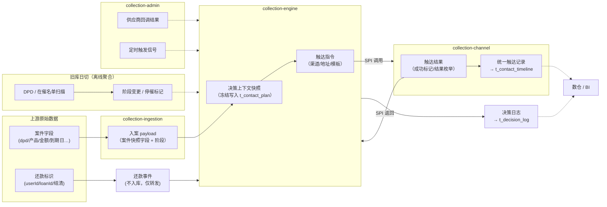
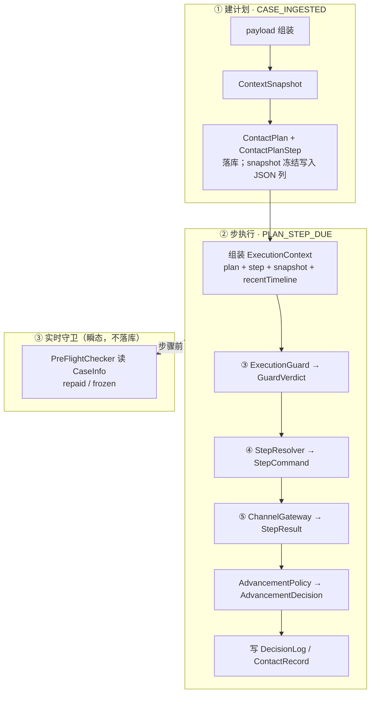

# MOCASA 催收系统升级 — Phase 1 领域模型与数据定义

> **版本**: Phase 1 · 仅覆盖菲律宾市场  
> **日期**: 2026-07-08  
> **关联文档**: [架构设计文档](./MOCASA催收系统升级_Phase1_架构设计文档.md)、[核心引擎规格](./MOCASA催收系统升级_Phase1_核心引擎规格.md)、[基础设施交互规范](./MOCASA催收系统升级_Phase1_基础设施交互规范.md)、[数据接入规格](./MOCASA催收系统升级_Phase1_数据接入规格.md)、[契约对齐索引](./contracts/README.md)、[ContextSnapshot 契约对齐](./contracts/README_ContextSnapshot契约对齐.md)、[权威 DDL `../db/schema.sql](../db/schema.sql)`

---

## 目录

- [1. 概览与全局约定](#1-概览与全局约定)
  - [1.1 数据流全景图](#11-数据流全景图)
  - [1.2 表级契约矩阵](#12-表级契约矩阵)
  - [1.3 对象关系与分类](#13-对象关系与分类)
  - [1.4 命名·类型·序列化·关联键约定](#14-命名类型序列化关联键约定)
- [2. 枚举与常量定义](#2-枚举与常量定义)
- [3. 持久化实体模型](#3-持久化实体模型)
  - [3.1 ContactPlan](#31-contactplan触达计划)
  - [3.2 ContactPlanStep](#32-contactplanstep触达计划步骤)
  - [3.3 DecisionLog](#33-decisionlog决策日志)
  - [3.4 ContactRecord](#34-contactrecord统一触达记录)
- [4. 决策上下文模型](#4-决策上下文模型)
- [5. SPI 契约 DTO](#5-spi-契约-dto)
  - [5.1 CaseInfo](#51-caseinfo案件基本信息--spi-入参)
- [6. EventPayload 字段定义](#6-eventpayload-字段定义)
- [附录 A：数据模型 DDL](#附录-a数据模型-ddl)
- [附录 B：渠道编排层模型](#附录-b渠道编排层模型)
- [附录 C：变更记录](#附录-c变更记录)

---

## 1. 概览与全局约定

> 本文是 MOCASA 催收 Phase 1 的**领域数据契约 SSOT**——`collection-common` 中枚举、模型、DTO、EventPayload key 与引擎 DDL 的字段定义权威来源，供引擎 / 接入 / 渠道 / 服务四模块对齐。

### 1.1 数据流全景图

下图以**数据内容**为主视角：追踪案件/还款原始数据如何逐步转化为决策快照、触达指令与结果、并最终落为可分析的记录。实线 = 运行时主路径；虚线 = 配置 / 离线聚合。


| 阶段           | 数据内容                                              | 载体 / 落表                                 | 说明                                                   |
| ------------ | ------------------------------------------------- | --------------------------------------- | ---------------------------------------------------- |
| ① 上游原始数据     | 案件字段（dpd/产品/金额/到期日…）、还款标识                         | PubSub JSON                             | 信贷推送，`case_push` / `repayment_push_and_load`         |
| ② 入案 payload | 精简后的案件快照字段 + 阶段                                   | EventPayload（经 `CASE_INGESTED`）         | ingestion 组装，字段见 [§6.2](#62-逐事件-payload-字段)          |
| ③ 决策上下文快照    | CaseContext + UserProfile + ContactHistory（冻结不可变） | `t_contact_plan.context_snapshot`（JSON） | 引擎建计划时序列化，见 §4                                       |
| ④ 触达指令 → 结果  | 渠道类型/地址/模板/幂等键 → 成功标记/结果枚举/供应商消息 ID               | `StepCommand` → `StepResult`（SPI DTO）   | 引擎 ↔ 渠道编排，见 §5                                       |
| ⑤ 统一触达记录     | 渠道、结果、内容摘要、供应商回调原文                                | `t_contact_timeline`                    | 渠道执行 / 人工外呼 / 迁移共写，见 [§3.4](#34-contactrecord统一触达记录) |
| ⑥ 决策日志       | 决策类型、输入快照、输出结果、置信度                                | `t_decision_log`                        | 引擎只写不读，供数仓分析，见 [§3.3](#33-decisionlog决策日志)           |
| ⑦ 外部触发数据     | 供应商回调结果、步骤到期/超时信号                                 | EventPayload（经 admin 收敛）                | 不驱动决策，仅触发引擎重新读取快照/状态                                 |





> 入站细节 → [数据接入规格](./MOCASA催收系统升级_Phase1_数据接入规格.md)；引擎消费与链式发布 → [核心引擎规格 §2/§4](./MOCASA催收系统升级_Phase1_核心引擎规格.md#21-事件路由表ssot)；事件传输载体 → [基础设施 §2](./MOCASA催收系统升级_Phase1_基础设施交互规范.md#2-事件总线redis-stream)。

### 1.2 表级契约矩阵

#### 状态标记说明

> 标记描述的是 **Phase 1 对该表的数据库变更类型**，不是运行时业务状态。其中 EXISTING / ALTER 指升级前已存在于 `collection_rebuild`（或关联库）的表；NEW 指本阶段新建表。


| 标记           | 含义                                              |
| ------------ | ----------------------------------------------- |
| **NEW**      | Phase 1 新建表，本文档 附录 A（或附录 B）已提供 `CREATE TABLE`   |
| **NEW ⚠️**   | Phase 1 计划新建，但本文档尚未写出 `CREATE TABLE`（文档/DDL 待补） |
| **ALTER**    | 既有表，Phase 1 需 `ALTER TABLE` 增字段（DDL 可能在其他模块文档）  |
| **EXISTING** | 既有表，Phase 1 只读引用，不做 DDL 变更                      |
| **NACOS**    | Phase 1 走 Nacos 配置，不建表；附录 B DDL 为 Phase 2 落库规划  |


> **列差异**：§1.2 仅列 Phase 1 本系统 owned/只读表（A/B/C）；**编排层配置与外呼表见 [附录 B](#附录-b渠道编排层模型)**。A/B 为 owned 表（写入方 / 消费方 / DDL；B 因 Owner 逐行不同独立成列）；C 为外部只读表，用 `引用位置` 替代写入/DDL 列，`状态` 恒为 `EXISTING`。

---

#### A. 引擎核心表 — Owner: collection-engine（主架构负责）


| 表名                    | 状态  | 首席写入方             | 核心消费方        | DDL 位置     |
| --------------------- | --- | ----------------- | ------------ | ---------- |
| `t_contact_plan`      | NEW | collection-engine | XXL-Job, 数仓  | 附录 A A.1.1 |
| `t_contact_plan_step` | NEW | collection-engine | 渠道编排(SPI 读取) | 附录 A A.1.2 |
| `t_decision_log`      | NEW | collection-engine | 数仓(决策效果分析)   | 附录 A A.1.3 |


#### B. 跨模块 / 服务层表


| 表名                    | 状态                  | Owner          | 首席写入方                               | 核心消费方                                      | DDL 位置                  |
| --------------------- | ------------------- | -------------- | ----------------------------------- | ------------------------------------------ | ----------------------- |
| `t_contact_timeline`  | NEW                 | 跨模块共写          | channel(自动触达), 人工外呼, ingestion(ETL) | 决策引擎(聚合), 合规引擎(频率), 数仓(BI)                 | 附录 A A.2.1              |
| `t_user_device_token` | NEW                 | 数仓（日同步，**可选**） | 数仓 ETL（源 = 旧库 `t_user_extend`）      | collection-ingestion（enrichment 只读，**降级**） | 附录 A A.2.3              |
| `t_user_profile_ext`  | **NEW（Phase 2 押后）** | service        | ProfileService, 坐席后台                | 决策引擎(画像输入)                                 | 附录 A A.2.2（Phase 1 不建表） |


#### C. 现有表 — 只读引用（Phase 1 不做 DDL 变更）

**Phase 1 实际读取**（守卫/日切/兜底经 CaseService·ProfileService；**入案快照主路径**为 `CASE_INGESTED` payload，见 [数据接入 §3.1](./MOCASA催收系统升级_Phase1_数据接入规格.md#34-与-caseservice--profileservice-的调用边界)）：


| 表名                      | 状态       | 引用位置                        | 用途                                            |
| ----------------------- | -------- | --------------------------- | --------------------------------------------- |
| `t_collection`          | EXISTING | §4.1 CaseContext            | 案件主表；守卫/日切读库来源，非入案快照主路径                       |
| `t_user_repayment_plan` | EXISTING | §4.1 CaseContext            | 还款计划，金额/日期来源                                  |
| `t_user_basis`          | EXISTING | §4.2 UserProfile.BasicInfo  | 用户基本信息（name/phone/email/language）             |
| `t_user_equipment`      | EXISTING | §4.2 UserProfile.DeviceInfo | 设备信息；Phase 1 入案不读（`jpushToken` 走 `case_push`） |


> **Phase 2 才引用**的现有表（`t_user_work` / `t_user_telephone_book` / `t_system_property`，对应 UserProfile 维度 Phase 1 不填充见 §4.2 🅿️2）不在 Phase 1 矩阵展开，见 [附录 A A.3](#a3-现有表只读引用)。

### 1.3 对象关系与分类

> **范围**：引擎运行时涉及的 **Java 领域模型**（§3–§5），不含 §1.2 库表全清单、不含附录 B 编排内部模型。
> **落库边界**：**持久实体**独立落表；**快照**以 JSON 写入 `t_contact_plan.context_snapshot`（不单独建表，但会落库）；**瞬态 DTO** 不落库（`DecisionLog.input_snapshot` 仅审计副本）。
> **分类表**按形态索引各对象的触发事件与职责；下图示运行时数据流（非静态类图）。




**模型分类总览**（持久实体 / 快照 / 瞬态 DTO）


| 形态         | 对象                                         | 定义节       | 落库                                | 触发事件 / 阶段                                                                                        | 职责                                            |
| ---------- | ------------------------------------------ | --------- | --------------------------------- | ------------------------------------------------------------------------------------------------ | --------------------------------------------- |
| **持久实体**   | ContactPlan                                | §3.1      | `t_contact_plan`                  | `CASE_INGESTED` 创建；`REPAYMENT_RECEIVED` / `STAGE_CHANGED` / `CASE_CEASED` 取消；`PLAN_EXHAUSTED` 续建 | 状态机聚合根；`version` 乐观锁                          |
| **持久实体**   | ContactPlanStep                            | §3.2      | `t_contact_plan_step`             | `PLAN_STEP_DUE` 执行；`STEP_COMPLETED` / `CHANNEL_CALLBACK` 推进                                      | 计划内单步；含 trigger/timeout 调度字段                  |
| **持久实体**   | DecisionLog                                | §3.3      | `t_decision_log`                  | 每次 SPI 调用后（步骤执行 ③④⑤）                                                                             | 决策审计；`input_snapshot` 存 ExecutionContext 副本   |
| **持久实体**   | ContactRecord                              | §3.4      | `t_contact_timeline`              | 渠道 dispatch / `CHANNEL_CALLBACK` / 合规拦截                                                          | 统一触达记录；回调可升级 result                           |
| **快照**     | CaseContext / UserProfile / ContactHistory | §4.1–§4.3 | 内嵌 `context_snapshot` JSON        | `CASE_INGESTED` 建计划时冻结                                                                           | 决策输入字段；无独立表                                   |
| **快照**     | ContextSnapshot                            | §4.4      | `t_contact_plan.context_snapshot` | 同上                                                                                               | 快照根；计划存活期内只读，保证步骤间决策一致                        |
| **瞬态 DTO** | CaseInfo                                   | §5.1      | 否                                 | `PreFlightChecker`（步骤②）；`PlanFactory` / `ExhaustionPolicy`                                       | 实时案件态（`repaid`/`frozen`）；与快照 CaseContext 语义不同 |
| **瞬态 DTO** | ExecutionContext                           | §5.2      | 否                                 | `PLAN_STEP_DUE` → 步骤执行 ③④⑤                                                                       | SPI 统一入参；含 snapshot + recentTimeline          |
| **瞬态 DTO** | GuardVerdict                               | §5.3      | 否                                 | 步骤 ③ `ExecutionGuard.evaluate`                                                                   | 合规裁定：放行 / 拦截原因                                |
| **瞬态 DTO** | StepCommand / StepResult                   | §5.4–§5.5 | 否                                 | 步骤 ④⑤ `StepResolver` / `ChannelGateway`                                                          | 触达指令 ↔ 渠道执行结果                                 |
| **瞬态 DTO** | AdvancementDecision / ExhaustionResult     | §5.6–§5.7 | 否                                 | `STEP_COMPLETED` 推进；`PLAN_EXHAUSTED` 续建                                                          | 步骤推进三选一；穷尽后 REBUILD/ESCALATE/COMPLETE         |


### 1.4 命名·类型·序列化·关联键约定

> **定位**：跨模块**字段级 checklist**，避免 §3–§6 各节重复。不定义：EventPayload key（§6）、渠道变量用法（contracts）、PubSub 上游字段映射（[数据接入规格](./MOCASA催收系统升级_Phase1_数据接入规格.md)）。

#### 命名与关联键


| 项            | 约定                                                                                                                     |
| ------------ | ---------------------------------------------------------------------------------------------------------------------- |
| Java ↔ DB 列名 | Java **camelCase** ↔ DB **snake_case**；MyBatis 开启 `map-underscore-to-camel-case: true`                                 |
| 表间关联         | `case_id` / `plan_id` / `step_id` / `user_id` 为**逻辑外键**；Phase 1 DDL **不设**物理 `FOREIGN KEY`                             |
| 物理库归属        | 引擎/服务新建表 → 新库 `collection_rebuild`；§1.2 C 区现有表 → 旧库只读（并行期），切量策略见 [数据接入 §4.2](./MOCASA催收系统升级_Phase1_数据接入规格.md#42-读库与演进) |


#### 类型映射（Java ↔ DB ↔ JSON）


| Java 类型                    | DB 列类型          | JSON 形态       | 约定                                                               |
| -------------------------- | --------------- | ------------- | ---------------------------------------------------------------- |
| `enum`（Stage/ChannelType…） | `VARCHAR`       | 字符串（`name()`） | MyBatis 默认 `EnumTypeHandler` 读写 `name()`；禁止 ordinal / 魔法字符串（§2）  |
| `LocalDateTime`            | `DATETIME`      | ISO-8601 字符串  | `LocalDateTime` 无时区；落库时刻由 JDBC 连接时区决定（Phase 1 连 `Asia/Manila`）   |
| `LocalDate`                | `DATE`          | ISO 日期串       | —                                                                |
| `BigDecimal`（金额）           | `DECIMAL(10,4)` | JSON 数值       | 金额 SSOT 见 [contracts](./contracts/README_ContextSnapshot契约对齐.md) |
| `Map` / 复杂对象               | `JSON`          | JSON 对象       | 如 `context_snapshot`、`output_decision`、`provider_callback`       |
| `List<子实体>`                | 独立子表            | —             | 如 `ContactPlan.steps` 落 `t_contact_plan_step`（内存态不占主表列）          |


#### 序列化边界（三条路径，勿混用）


| 路径               | 载体                                                      | 入口 / SSOT                                               | 字段规则                                                                                                                               |
| ---------------- | ------------------------------------------------------- | ------------------------------------------------------- | ---------------------------------------------------------------------------------------------------------------------------------- |
| **Model JSON 列** | `context_snapshot`、`input_snapshot`、`output_decision` 等 | `JsonUtil.toJson()` / `fromJson()`（**统一入口**，禁止模块自建序列化器） | 字段结构 / 不可变 / 布尔命名：[§4.4](#44-contextsnapshot决策上下文快照)；`null` vs `0`：[§4.3](#43-contacthistory触达历史摘要)；脱敏：[§4.2](#42-userprofile用户画像) |
| **EventPayload** | Redis Stream `Map<String,Object>`                       | `CollectionEvent` 常量 key                                | [§6](#6-eventpayload-字段定义) SSOT；**不走** model 序列化                                                                                   |
| **PubSub 入站**    | 信贷推送原始 JSON                                             | `CasePayloadMapper`                                     | [数据接入规格 §3](./MOCASA催收系统升级_Phase1_数据接入规格.md#31-pubsub-消费)；与 Model JSON 规则无关                                                        |


> **Model JSON 列补充**：MySQL `JSON` 列读回可能规范化键序/空格，断言**语义等价**即可（不按字节相等）。

---

---

## 2. 枚举与常量定义

> **目的**：统一催收业务中的离散取值（渠道、计划状态、触达结果、事件类型等），作为引擎 / 接入 / 渠道 / 服务四模块的**共同语言**——落库、事件、SPI 均引用同一套枚举，避免各模块口径漂移。
> **实现**：`collection-common`（`com.collection.common.enums`）；禁止硬编码枚举字符串；已发布值不可删改，Phase 2 预留须在定义处标注。
>
> **列约定**：本章各节以「枚举值 + 含义」为契约核心；落库列、DPD 区间等**影响序列化/存储**的列保留；触发场景、引擎动作、实现方式等**行为语义**归 [核心引擎规格](./MOCASA催收系统升级_Phase1_核心引擎规格.md) / 渠道规格，不在此复述。
>
> **节首约定**：**Java** + **落库**（或 **载体** 若不落表）；落库列详见章首总览表，字段语义见 §3 字段表。

**枚举总览**


| 枚举                                                      | 用途           | 主要存储列                                                           |
| ------------------------------------------------------- | ------------ | --------------------------------------------------------------- |
| ChannelType                                             | 触达渠道类型       | `t_contact_timeline.channel`、`t_contact_plan_step.channel_type` |
| ContactResult                                           | 触达结果         | `t_contact_timeline.result`、`t_contact_plan_step.result`        |
| PlanStatus                                              | 计划状态机（6 态）   | `t_contact_plan.status`                                         |
| StepStatus                                              | 步骤执行状态       | `t_contact_plan_step.status`                                    |
| DecisionType                                            | SPI 决策类型     | `t_decision_log.decision_type`                                  |
| EventType                                               | 内部领域事件       | Redis Stream（路由见 [核心引擎规格 §2.1](./MOCASA催收系统升级_Phase1_核心引擎规格.md#21-事件路由表ssot)；payload 见 §6） |
| CancelReason                                            | 计划取消原因       | `t_contact_plan.cancel_reason`                                  |
| Stage                                                   | 催收阶段（DPD 映射） | `t_contact_plan.stage`                                          |
| ExhaustionAction                                        | 穷尽续建动作       | `ExhaustionResult.action`（§5.7）                                 |
| Direction / DataSource                                  | 触达记录元数据      | `t_contact_timeline.direction` / `.source`（§3.4）                  |
| PhoneValidity / SensitivityTag                          | 画像扩展（Phase 2） | 附录 A.2.2；Phase 1 不落表，`UserProfile` 结构预留（§4.2）                 |


### 2.1 ChannelType（渠道类型）

> **Java**：`com.collection.common.enums.ChannelType`  
> **落库**：见章首总览（§3.1 / §3.2 / §3.4 字段表）


| 枚举值     | 显示名      | 供应商                                                                                                                                                           |
| ------- | -------- | ------------------------------------------------------------------------------------------------------------------------------------------------------------- |
| PUSH    | App 推送   | —（经内部通知中心异步入队，无独立供应商）                                                                                                                                         |
| SMS     | 短信       | 内部通知中心（具体短信通道由通知中心路由）                                                                                                                                         |
| AI_CALL | AI 机器人外呼 | LTH                                                                                                                                                           |
| EMAIL   | 邮件       | SendGrid（[渠道总规格](./channel/MOCASA催收系统升级_Phase1_collection-channel总规格.md)、[SendGrid 对接说明](./channel/MOCASA催收系统升级_Phase1_SendGrid_Email对接说明.md)；Phase 1 无备用供应商） |


> **Phase 1 不生成 plan step**：`VIBER` / `WHATSAPP`（Phase 2 接入）；`TTS` / `HUMAN_CALL`（域外，LTH 现网独立编排，[架构 ADR](./MOCASA催收系统升级_Phase1_架构设计文档.md#附录-a架构决策记录-adr)）。消息类/电话类分流见 [核心引擎规格 §5](./MOCASA催收系统升级_Phase1_核心引擎规格.md#5-步骤执行管线)（`isMessageChannel` / `isAsyncChannel`）。

### 2.2 ContactResult（触达结果）

> **Java**：`com.collection.common.enums.ContactResult`  
> **落库**：见章首总览（§3.2 / §3.4 字段表）
>
> 下列为**同一枚举**按 Phase 1 **结果来源**分组（4 组小表 = 4 类产生方式，**不是** 4 列返回值）。Phase 1 活跃渠道：SMS / PUSH / EMAIL / AI_CALL。

**PUSH / EMAIL — 同步派发**（无观察期）


| 枚举值       | 含义                      |
| --------- | ----------------------- |
| DELIVERED | 通知中心 / SendGrid 受理或入队成功 |
| FAILED    | API 失败、重试耗尽等            |


**SMS — 派发 + 可选观察期**（`observationMinutes>0` 时进 `STEP_WAITING`）


| 枚举值              | 含义                 |
| ---------------- | ------------------ |
| DELIVERED        | 通知中心受理；或观察期内收到 DLR |
| SENT_NO_RESPONSE | 观察期届满仍无 DLR        |
| FAILED           | 同步派发失败             |


**AI_CALL — 话单回调**（`CHANNEL_CALLBACK` 完成步骤）


| 枚举值       | 含义    |
| --------- | ----- |
| ANSWERED  | 电话已接通 |
| NO_ANSWER | 电话未接听 |
| BUSY      | 忙线    |


**Email — SendGrid 二次事件**（仅升级 timeline，不完成 step；详见 [SendGrid §5](./channel/MOCASA催收系统升级_Phase1_SendGrid_Email对接说明.md)）


| 枚举值      | 含义              |
| -------- | --------------- |
| READ     | 打开邮件            |
| CLICKED  | 点击链接            |
| REJECTED | 退订 / 硬退信 / 举报垃圾 |


> 退订：Webhook 异步写入 `REJECTED` 后 Guard 拦截后续 Email；无邮箱 → 发信前 `SKIPPED`。细则见 SendGrid 对接说明。

**系统内部 / Phase 2 预留**


| 枚举值                | 含义    | 写 timeline | 说明                        |
| ------------------ | ----- | ---------- | ------------------------- |
| COMPLIANCE_BLOCKED | 合规拦截  | 是          | 含频控、空地址等                  |
| SKIPPED            | 主动跳过  | **否**      | 如 EMAIL 无邮箱               |
| CHANNEL_DOWN       | 渠道不可用 | **否**      | 健康检查失败                    |
| REPLIED            | 用户回复  | 是          | Phase 2（VIBER / WHATSAPP） |


> **step 与 timeline**：写入 `ContactResult` 时，默认**同时推进 plan step** 并写 timeline；**例外**——SendGrid Webhook 仅更新 `t_contact_timeline.result`（Email 的 READ/CLICKED/REJECTED，不推进 step）。Email result 只升不降：`DELIVERED` → `READ` → `CLICKED`。

### 2.3 PlanStatus（触达计划状态）

> **Java**：`com.collection.common.enums.PlanStatus`  
> **落库**：`t_contact_plan.status`（§3.1）

计划级状态机共 **6 态**（4 非终态 + 2 终态）：


| 枚举值                | 含义                               |
| ------------------ | -------------------------------- |
| PENDING            | 计划刚创建，尚未执行任何步骤，等待首步 trigger_time |
| STEP_SCHEDULED     | 上一步已结束，下一步 Job 已注册，等待到期          |
| STEP_EXECUTING     | 当前步骤执行中（渠道发送 / 等待异步回调）           |
| STEP_WAITING       | 消息类渠道已发出，观察期内等待用户响应              |
| **PLAN_COMPLETED** | 终态：还款完成，或步骤走完 / 穷尽续建正常结束 |
| **PLAN_CANCELLED** | 终态：中断取消（`cancel_reason`）        |


> `PLAN_EXHAUSTED` 是 `EventType`，不是 `PlanStatus`（见 [核心引擎规格 §2.1](./MOCASA催收系统升级_Phase1_核心引擎规格.md#21-事件路由表ssot)）。

### 2.4 StepStatus（步骤执行状态）

> **Java**：`com.collection.common.enums.StepStatus`  
> **落库**：`t_contact_plan_step.status`（§3.2）


| 枚举值       | 含义                  |
| --------- | ------------------- |
| PENDING   | 步骤尚未执行              |
| EXECUTING | 步骤执行中               |
| COMPLETED | 步骤正常完成              |
| SKIPPED   | 步骤被跳过（合规拦截 / 渠道不可用） |
| FAILED    | 步骤失败（渠道发送失败，重试耗尽）   |


### 2.5 DecisionType（决策类型）

> **Java**：`com.collection.common.enums.DecisionType`  
> **落库**：`t_decision_log.decision_type`（§3.3）


| 枚举值            | 含义              |
| -------------- | --------------- |
| CHANNEL_SELECT | 渠道选择：决定使用哪个渠道触达 |
| SCRIPT_SELECT  | 话术选择：决定使用哪个话术组  |
| TIMING         | 触达时间：决定最佳触达时间   |

> SPI 调用时机与实现见 [核心引擎规格 §5](./MOCASA催收系统升级_Phase1_核心引擎规格.md#5-步骤执行管线)。Phase 1 `TIMING`：固定 9AM–6PM PHT 窗口，RuleBasedEngine 直接返回。
>
> **Phase 2 预留**：`ASSIGNMENT`、`CHANNEL_MODE_SELECT`（枚举保留，Phase 1 不写 `t_decision_log`）。


### 2.6 EventType（内部事件类型）

> **Java**：`com.collection.common.enums.EventType`  
> **载体**：Redis Stream（路由 [核心引擎规格 §2.1](./MOCASA催收系统升级_Phase1_核心引擎规格.md#21-事件路由表ssot)；payload §6；信封 [基础设施 §2](./MOCASA催收系统升级_Phase1_基础设施交互规范.md#2-事件总线redis-stream)）

### 2.7 CancelReason（计划取消原因）

> **Java**：`com.collection.common.enums.CancelReason`  
> **落库**：`t_contact_plan.cancel_reason`（§3.1）


| 枚举值           | 含义                            |
| ------------- | ----------------------------- |
| REPAID        | 用户已还款                          |
| STAGE_UPGRADE | 阶段变更：取消旧 stage 计划并新建（与模板是否相同无关，见 [核心引擎规格 §4.4](./MOCASA催收系统升级_Phase1_核心引擎规格.md#44-中断处理)） |
| CEASED        | Max DPD ≥91 完全停催（CASE_CEASED） |


> Phase 1 三值均由引擎写入（`CancelReason.isEngineManaged()=true`）。
>
> **Phase 2 预留**（枚举值保留，Phase 1 不使用）：`COMPLAINT`（投诉终态取消）、`MANUAL`（管理后台人工取消）、`PTP_EXPIRED`（PTP 到期未还款）。

### 2.8 Stage（催收阶段）

> **Java**：`com.collection.common.enums.Stage`  
> **落库**：`t_contact_plan.stage`（§3.1）


| 枚举值 | DPD 范围      | 说明            |
| --- | ----------- | ------------- |
| S0  | D-3 ~ D0    | Pre-Due 到期前提醒 |
| S1  | D+1 ~ D+3   | Early 早期催收    |
| S2  | D+4 ~ D+15  | Mid 中期        |
| S3  | D+16 ~ D+30 | Late 晚期       |
| S4  | D+31+       | Extended 延长期  |


> **D+91 停催不属于 Stage 概念**：由 `PlanFactory.shouldRejectPlan` / ingestion 日切独立处理（发 `CASE_CEASED` 事件，[核心引擎规格 §2.1](./MOCASA催收系统升级_Phase1_核心引擎规格.md#21-事件路由表ssot)），Stage 不感知。
>
> ⚠️ 上表区间为代码默认值；若后续改为从 `t_contact_plan_template` 配置读取，需同步 `Stage.java`（**代码待跟进**，本次仅文档对齐代码现状）。

### 2.9 ExhaustionAction（穷尽策略动作）

> **Java**：`com.collection.common.enums.ExhaustionAction`  
> **载体**：`ExhaustionResult.action`（§5.7，不落表）


| 枚举值      | 含义                           |
| -------- | ---------------------------- |
| REBUILD  | 同阶段立即续建：创建新一轮计划，继续触达         |
| ESCALATE | 升档：当前阶段触达手段已穷尽，提升催收强度        |
| COMPLETE | 停止：不再主动触达，等待用户自主还款或 DPD 自然越阶 |


> `REBUILD` 续建次数上限见配置项 `engine.plan.max_rebuild_count`（引擎规格 §4.5）。

---

---

---

## 3. 持久化实体模型

本章定义**落表持久实体**（状态机读写 + 触达时间线），每个类对应一张数据库表（或子表）。`PlanLifecycleManager` 和 `StepExecutionOrchestrator` 通过读写这些实体驱动状态流转。

> **节首约定**：**Java** + **表** + DDL 指针 + **用途**；枚举取值见 §2，运行时行为见 §1.3 / 核心引擎规格。

### 3.1 ContactPlan（触达计划）

> **Java**：`com.collection.common.model.ContactPlan`  
> **表**：`t_contact_plan` · DDL [附录 A A.1.1](#a11-t_contact_plan--触达计划主表)  
> **用途**：状态机聚合根，描述一个案件在某阶段的完整触达计划。


| 字段              | Java 类型             | DB 列             | 必填  | 说明                                                                                                   |
| --------------- | ------------------- | ---------------- | --- | ---------------------------------------------------------------------------------------------------- |
| id              | Long                | id               | 是   | 计划 ID                                                                                                |
| caseId          | Long                | case_id          | 是   | 关联案件 ID                                                                                              |
| userId          | Long                | user_id          | 是   | 用户 ID                                                                                                |
| stage           | Stage               | stage            | 是   | 催收阶段（枚举 §2.8）                                                                                        |
| planTemplateId  | Long                | plan_template_id | 否   | 触达计划模板 ID                                                                                            |
| status          | PlanStatus          | status           | 是   | 计划状态（枚举 §2.3）                                                                                        |
| currentStep     | int                 | current_step     | 是   | 当前执行到第几步（从 0 开始）                                                                                     |
| totalSteps      | int                 | total_steps      | 是   | 总步数                                                                                                  |
| cancelReason    | CancelReason        | cancel_reason    | 否   | 取消原因（枚举 §2.7，仅终态 PLAN_CANCELLED 时有值）                                                                 |
| contextSnapshot | String              | context_snapshot | 否   | 决策上下文快照（§4.4 ContextSnapshot 的 JSON 序列化字符串；DB 列类型 JSON）                                              |
| idempotencyKey  | String              | idempotency_key  | 否   | 计划创建幂等键（`case_id:stage:create_timestamp`），防止事件重投导致重复创建计划。若架构使用 UNIQUE 约束替代则可降为预留                     |
| renewalPending  | boolean             | renewal_pending  | 是   | ~~Phase 1 未使用，预留~~。穷尽续建为同步操作（旧计划终态 → 即时创新计划），无中间"待续建"态                                               |
| version         | int                 | version          | 是   | 乐观锁版本号，每次状态变更 +1                                                                                     |
| startedAt       | LocalDateTime       | started_at       | 否   | 计划开始执行时间。引擎写入时机：首步进入 EXECUTING 时（`IF plan.startedAt IS NULL THEN SET`）                               |
| completedAt     | LocalDateTime       | completed_at     | 否   | 计划完成时间。引擎写入时机：计划进入终态（PLAN_COMPLETED / PLAN_CANCELLED）时 SET                                           |
| createdAt       | LocalDateTime       | created_at       | 是   | 创建时间                                                                                                 |
| updatedAt       | LocalDateTime       | updated_at       | 是   | 最后更新时间                                                                                               |
| steps           | ListContactPlanStep | （无）              | —   | **仅内存态**：计划创建、ExecutionContext 组装时持有的步骤序列，不对应 `t_contact_plan` 单表列；持久化时落 `t_contact_plan_step`（§3.2） |


> **单活跃计划约束**：同一 `caseId + stage` 在同一时刻最多存在一个非终态计划。详见 [核心引擎规格 §4.2](./MOCASA催收系统升级_Phase1_核心引擎规格.md#42-计划创建)。

### 3.2 ContactPlanStep（触达计划步骤）

> **Java**：`com.collection.common.model.ContactPlanStep`  
> **表**：`t_contact_plan_step` · DDL [附录 A A.1.2](#a12-t_contact_plan_step--触达计划步骤表)  
> **用途**：计划内单步执行单元，含调度（trigger/timeout）与步骤状态。


| 字段                 | Java 类型       | DB 列                | 必填  | 说明                                                         |
| ------------------ | ------------- | ------------------- | --- | ---------------------------------------------------------- |
| id                 | Long          | id                  | 是   | 步骤 ID                                                      |
| planId             | Long          | plan_id             | 是   | 关联触达计划 ID                                                  |
| stepOrder          | int           | step_order          | 是   | 步骤序号（从 1 开始）                                               |
| channelType        | ChannelType   | channel_type        | 是   | 渠道类型（枚举 §2.1）                                              |
| templateId         | Long          | template_id         | 否   | 话术模板 ID                                                    |
| delayMinutes       | int           | delay_minutes       | 是   | 相对上一步的延迟（分钟），首步为相对计划创建时间                                   |
| triggerTime        | LocalDateTime | trigger_time        | 否   | 绝对触发时间（由引擎计算写入）                                            |
| timeoutTime        | LocalDateTime | timeout_time        | 否   | 异步回调超时时间（由引擎在执行时写入）                                        |
| triggerCondition   | String        | trigger_condition   | 否   | 前置条件表达式（如"前一步未响应"）。**Phase 1 未启用**，引擎不求值；预留 Phase 2 条件跳过逻辑 |
| status             | StepStatus    | status              | 是   | 步骤状态（枚举 §2.4）                                              |
| observationMinutes | int           | observation_minutes | 是   | 观察期（分钟），0=无观察期                                             |
| retryCount         | int           | retry_count         | 是   | 已重试次数                                                      |
| result             | ContactResult | result              | 否   | 步骤最终结果（枚举 §2.2）                                            |
| idempotencyKey     | String        | idempotency_key     | 否   | 步骤幂等键，由引擎生成（口径见下方说明）                                       |
| executedAt         | LocalDateTime | executed_at         | 否   | 步骤开始执行时间                                                   |
| completedAt        | LocalDateTime | completed_at        | 否   | 步骤完成时间                                                     |
| createdAt          | LocalDateTime | created_at          | 是   | 创建时间                                                       |
| updatedAt          | LocalDateTime | updated_at          | 是   | 最后更新时间                                                     |


> **幂等键**：统一格式 `{planId}:{stepOrder}:{retryCount}`，同一个值在两处去重：
>
> - **引擎侧**——消费 `PLAN_STEP_DUE` 时拦截重复事件，避免同一步骤被执行两次（`StepExecutionOrchestrator.buildIdempotencyKey`）。
> - **渠道侧**——透传为 `StepCommand.idempotencyKey`（§5.4），供应商 dispatch 去重（`DefaultStepResolver`）。
>
> 键里含 `retryCount` 是为了让每次重试（`retryCount+1`）生成新键，从而不被上一次的幂等记录拦住。口径已与代码、`contracts/README`、`.cursor/rules/ic-v1-channel-contract.mdc` 对齐（2026-06-17；旧写法 `…:attempt` 的 `attempt` 即 `retryCount`）。详见审计 K3。

### 3.3 DecisionLog（决策日志）

> **Java**：`com.collection.common.model.DecisionLog`  
> **表**：`t_decision_log` · DDL [附录 A A.1.3](#a13-t_decision_log--决策日志)  
> **用途**：SPI 决策审计；引擎只写不读，供数仓分析与 Phase 2 模型训练。


| 字段             | Java 类型       | DB 列            | 必填  | 说明                                                 |
| -------------- | ------------- | --------------- | --- | -------------------------------------------------- |
| id             | Long          | id              | 是   | 日志 ID                                              |
| caseId         | Long          | case_id         | 是   | 关联案件 ID                                            |
| planId         | Long          | plan_id         | 否   | 关联触达计划 ID（步骤级决策时有值；计划创建前为 null）        |
| stepId         | Long          | step_id         | 否   | 关联触达计划步骤 ID（步骤级决策时有值；计划级决策为 null）                  |
| decisionType   | DecisionType  | decision_type   | 是   | 决策类型（枚举 §2.5）                                      |
| engineType     | String        | engine_type     | 是   | 引擎类型：RULE 或 LLM                                    |
| engineVersion  | String        | engine_version  | 否   | Phase 1："rule-v{规则最后修改时间戳}"；Phase 2：LLM 模型版本       |
| inputSnapshot  | String        | input_snapshot  | 是   | 决策输入快照（ExecutionContext 的 JSON 序列化字符串；DB 列类型 JSON） |
| outputDecision | String        | output_decision | 是   | 决策结果（decision 字符串 + metadata；DB 列类型 JSON）          |
| reasoning      | String        | reasoning       | 否   | Phase 1：命中规则描述；Phase 2：LLM Chain of Thought        |
| confidence     | double        | confidence      | 是   | Phase 1 固定 1.0；Phase 2 由 LLM 输出                    |
| latencyMs      | Integer       | latency_ms      | 否   | SPI 调用耗时（毫秒）                                       |
| createdAt      | LocalDateTime | created_at      | 是   | 写入时间                                               |


---

### 3.4 ContactRecord（统一触达记录）

> **Java**：`com.collection.common.model.ContactRecord`  
> **表**：`t_contact_timeline` · DDL [附录 A A.2.1](#a21-t_contact_timeline--统一触达时间线)  
> **用途**：统一触达时间线；系统触达、ETL 迁移、回调升级共写此模型。


| 字段               | 类型            | 必填  | 取值约定                                                            |
| ---------------- | ------------- | --- | --------------------------------------------------------------- |
| id               | Long          | 否   | 记录 ID（DB 自增，写入前为 null）                                          |
| caseId           | Long          | 是   | 关联案件 ID                                                         |
| userId           | Long          | 是   | 用户 ID                                                           |
| planId           | Long          | 否   | 关联触达计划 ID。历史迁移数据（source=ETL_SYNC）无计划 ID，传 null                  |
| stepId           | Long          | 否   | 关联步骤 ID。人工渠道的坐席录入和历史迁移数据无步骤 ID                                  |
| channel          | ChannelType   | 是   | 渠道枚举                                                            |
| direction        | Direction     | 是   | OUT=系统发出，IN=用户响应（如用户回复 Viber 消息）                                |
| templateId       | Long          | 否   | 使用的话术模板 ID                                                      |
| contentSummary   | String        | 否   | 内容摘要，≤500 字符。SMS/Email 取前 500 字符；电话类取"呼叫 {phone}，时长 {seconds}s" |
| result           | ContactResult | 否   | 触达结果枚举。初次写入时可能为 null（如 SMS 发出但未收到回执），后续回调更新                     |
| providerMsgId    | String        | 否   | 供应商消息 ID，用于回调关联和去重                                              |
| providerCallback | String        | 否   | 供应商回调原始 JSON（调试用）                                               |
| cost             | BigDecimal    | 否   | 单次触达成本（如有）                                                      |
| source           | DataSource    | 是   | SYSTEM=系统实时触达；ETL_SYNC=历史数据迁移；PUBSUB_SYNC=过渡期增量同步               |
| createdAt        | LocalDateTime | 否   | 写入时间（DB 列 created_at，默认 CURRENT_TIMESTAMP）                      |


> **写入规则**：  
>
> 1. 合规拦截的触达**也写入** `t_contact_timeline`，result=COMPLIANCE_BLOCKED，用于形成完整的用户接触全貌（同时写入 `t_compliance_violation` 记录详情）。
> 2. 渠道发送失败（重试耗尽）写入 `t_contact_timeline`，result=FAILED。
> 3. 同一个 providerMsgId 的回调更新是幂等的：更新 result 和 providerCallback，不新增记录。

---

---

## 4. 决策上下文模型

本章定义 ContextSnapshot 及其组成模型的**字段结构**（Java model SSOT）。**Phase 1 入案主路径**：引擎消费 `CASE_INGESTED` 时将 payload 组装为不可变快照写入 `t_contact_plan.context_snapshot`（[核心引擎规格 §4.2](./MOCASA催收系统升级_Phase1_核心引擎规格.md#42-计划创建)）；`CaseService`/`ProfileService` 聚合逻辑用于守卫实时查库、日切与可选兜底，见 [数据接入 §3.1](./MOCASA催收系统升级_Phase1_数据接入规格.md#34-与-caseservice--profileservice-的调用边界)。

> **节首约定**：**Java** + **落库**（内嵌 `context_snapshot` JSON 或运行时聚合）+ **用途**；字段「来源」列保留在字段表内。

### 4.1 CaseContext（案件上下文）

> **Java**：`com.collection.common.model.CaseContext`  
> **落库**：内嵌 `ContextSnapshot.caseContext`（§4.4 → `t_contact_plan.context_snapshot`）  
> **用途**：案件决策视图；`CaseService.buildContext(caseId)` 亦可运行时聚合。


| 字段               | 类型         | 必填  | 说明                                                                                                           | 来源                        |
| ---------------- | ---------- | --- | ------------------------------------------------------------------------------------------------------------ | ------------------------- |
| caseId           | Long       | 是   | 案件ID                                                                                                         | t_collection.id           |
| userId           | Long       | 是   | 用户ID                                                                                                         | t_collection.user_id      |
| dpd              | int        | 是   | 逾期天数（D-3 起为负数，D0=0，D+1=1）                                                                                    | t_collection.overdue_day  |
| stage            | Stage      | 是   | 当前催收阶段                                                                                                       | 由 DPD 计算                  |
| product          | String     | 是   | 贷款产品标识                                                                                                       | t_collection.product_code |
| loanAmount       | BigDecimal | 是   | 贷款金额                                                                                                         | t_user_repayment_plan     |
| overdueAmount    | BigDecimal | 是   | 逾期待还金额（本金+利息）                                                                                                | t_user_repayment_plan 计算  |
| penaltyAmount    | BigDecimal | 是   | 罚息金额                                                                                                         | t_user_repayment_plan 计算  |
| totalOutstanding | BigDecimal | 是   | 总待还金额（overdueAmount + penaltyAmount）                                                                         | 计算字段                      |
| loanTerms        | int        | 否   | 贷款期数                                                                                                         | t_user_repayment_plan     |
| disbursementDate | LocalDate  | 否   | 放款日期                                                                                                         | t_collection              |
| dueDate          | LocalDate  | 是   | 到期日                                                                                                          | t_user_repayment_plan     |
| caseStatus       | String     | 是   | 案件状态（现有业务状态）                                                                                                 | t_collection.status       |
| assignedAgentId  | Long       | 否   | 当前分配的催收员ID                                                                                                   | t_collection.collector_id |
| isFirstLoan      | boolean    | 是   | 是否首贷用户（JSON 序列化为 `firstLoan`，见 §4.4 注）                                                                       | 数仓或 t_collection 扩展       |
| payCount         | int        | 是   | 历史还款次数（含本笔之前的贷款）                                                                                             | t_collection.pay_count    |
| activePlanId     | Long       | 否   | 当前活跃触达计划ID                                                                                                   | t_contact_plan 查询         |
| strategyTone     | String     | 否   | 编排强度：STANDARD / FIRM（读 snapshot，PlanFactory 匹配模板）                                                            | snapshot                  |
| complaintFrozen  | boolean    | 否   | 投诉/争议冻结标记；**可恢复实时冻结由 PreFlightChecker 实时查案件状态判定并"停住"**（非快照驱动、非 ExecutionGuard）；快照值仅记录建计划时点，不作中途投诉的冻结依据       | 案件状态（实时）/ snapshot（建计划时点） |
| collectionStatus | String     | 否   | 案件催收生命周期：`CEASED` = D+91 完全停催                                                                                | ingestion 日切 / 案件         |
| repaymentUrl     | String     | 否   | App 还款深链（ingestion 写入；Push/Email/SMS 变量渲染）。**契约必填**，见 [contracts](./contracts/README_ContextSnapshot契约对齐.md) | ingestion / 信贷结账链路        |
| emailScriptSlot  | String     | 否   | Phase 1 Mock：显式指定 Email 里程碑 scriptSlot（E2E 联调）；为空时由 `EmailMilestoneScriptSlots.resolveByDpd(dpd)` 推断         | Mock / E2E                |


> **字段映射说明**：上表中"来源"列标注的是逻辑来源。`CaseContext` 由 `CaseService.buildContext(caseId)` 构建，具体的字段映射和多表 JOIN 逻辑在 CaseService 实现中定义。`isFirstLoan` 的判定规则：同一 userId 在系统中仅有一笔贷款记录。

### 4.2 UserProfile（用户画像）

> **Java**：`com.collection.common.model.UserProfile`  
> **落库**：内嵌 `ContextSnapshot.userProfile`（§4.4）；扩展维度 Phase 2 见 [附录 A A.2.2](#a22-t_user_profile_ext--用户画像扩展表phase-1-不建表押后-phase-2)  
> **用途**：用户画像快照；SPI 取号、语言等决策输入。

> **Phase 1 范围**：渠道实际消费 `basic.{name,primaryPhone,email,language}` + `device.jpushToken`；其余维度 🅿️2 不填充。`repayment`/`risk` 已移除（[contracts 变更记录](./contracts/README_ContextSnapshot契约对齐.md#变更记录)）。

#### 顶层字段


| 字段                  | 类型              | 必填  | 说明                                       |
| ------------------- | --------------- | --- | ---------------------------------------- |
| userId              | Long            | 是   | 用户ID                                     |
| basic               | BasicInfo       | 是   | 基础信息（部分字段 🅿️2）                          |
| work                | WorkInfo        | 否   | 工作信息（🅿️2 Phase 2 预留，Phase 1 不填充）        |
| contacts            | ListContactInfo | 否   | 紧急联系人列表（🅿️2 Phase 2 预留）                 |
| behavior            | BehaviorProfile | 否   | 触达行为画像（🅿️2 Phase 2 预留）                  |
| device              | DeviceInfo      | 否   | 设备与数字足迹（仅 jpushToken Phase 1 在用，其余 🅿️2） |
| profileCompleteness | double          | 是   | 画像完整度 0.0-1.0（非空字段数 / 总字段数）              |


> 🅿️2 = Phase 2 预留（结构保留、Phase 1 返回 null）。

#### BasicInfo


| 字段              | 类型         | 必填  | 来源                                                                                  |
| --------------- | ---------- | --- | ----------------------------------------------------------------------------------- |
| name            | String     | 是   | t_user_basis.name                                                                   |
| gender          | String     | 否   | t_user_basis.gender                                                                 |
| age             | Integer    | 否   | t_user_basis.age                                                                    |
| education       | String     | 否   | t_user_basis.education                                                              |
| maritalStatus   | String     | 否   | t_user_basis.marital_status                                                         |
| idNumber        | String     | 否   | t_user_basis.id_number（中间四位脱敏后写入；**Phase 1 ProfileService 未实现**，Phase 2 组装时执行）      |
| address         | String     | 否   | t_user_basis.address                                                                |
| primaryPhone    | String     | 是   | t_user_basis.phone（SMS `targetAddress` 来源，E.164 `+63`）                              |
| email           | String     | 否   | EMAIL 渠道 `targetAddress` 来源（空 → Guard `NO_EMAIL` → 步骤 SKIP）。来源 t_user_basis / 信贷用户表 |
| language        | String     | 否   | 用户语言偏好 ISO 639-1（tl/en）；StepResolver → `metadata.language`；默认 en                    |
| alternatePhones | ListString | 否   | t_user_telephone_book 提取（🅿️2）                                                      |


#### WorkInfo（🅿️2）


| 字段                 | 类型     | 必填  | 来源                       |
| ------------------ | ------ | --- | ------------------------ |
| occupation         | String | 否   | t_user_work.occupation   |
| companyName        | String | 否   | t_user_work.company      |
| workPhone          | String | 否   | t_user_work.work_phone   |
| monthlyIncomeRange | String | 否   | t_user_work.income_range |


#### ContactInfo（🅿️2）


| 字段           | 类型     | 必填  | 说明                                            |
| ------------ | ------ | --- | --------------------------------------------- |
| name         | String | 是   | 联系人姓名                                         |
| phone        | String | 是   | 联系人电话                                         |
| relationship | String | 否   | 关系（FAMILY / FRIEND / COLLEAGUE）               |
| source       | String | 是   | 来源（EMERGENCY_CONTACT / PHONE_BOOK / BIGQUERY） |


#### BehaviorProfile（🅿️2）


| 字段                       | 类型                      | 必填  | 来源                          | Phase 1 状态                                    |
| ------------------------ | ----------------------- | --- | --------------------------- | --------------------------------------------- |
| bestContactHour          | Integer                 | 否   | t_user_profile_ext（Phase 2） | 预留，后期数仓填充                                     |
| preferredChannel         | ChannelType             | 否   | t_user_profile_ext（Phase 2） | 预留，系统运行累积                                     |
| channelReachability      | MapChannelType, Boolean | 否   | 运行时检测                       | Phase 1 实现：通过各渠道 supports() 判定                |
| lastEffectiveContactTime | LocalDateTime           | 否   | t_contact_timeline 聚合       | Phase 1 实现：查询最近一次 result=ANSWERED/REPLIED 的时间 |
| lastEffectiveChannel     | ChannelType             | 否   | t_contact_timeline 聚合       | 同上                                            |
| appLastActiveTime        | LocalDateTime           | 否   | App 埋点 / 数仓                 | 预留                                            |


#### DeviceInfo（Phase 1 渐进填充）


| 字段                 | 类型            | 必填  | 来源                                                                                                                   | Phase 1 状态                                                                 |
| ------------------ | ------------- | --- | -------------------------------------------------------------------------------------------------------------------- | -------------------------------------------------------------------------- |
| jpushToken         | String        | 否   | 上游 `case_push` 消息体 → ingestion 写入 payload（**已确认 2026-07**）；缺失且 `enrich-jpush-token=true` 时可读新库 `t_user_device_token` | JPush Registration ID；见 [数据接入 §3.1 读库](./MOCASA催收系统升级_Phase1_数据接入规格.md#读库) |
| deviceModel        | String        | 否   | t_user_equipment                                                                                                     | 🅿️2 Phase 2 预留                                                            |
| osVersion          | String        | 否   | t_user_equipment                                                                                                     | 🅿️2 Phase 2 预留                                                            |
| phoneValidity      | PhoneValidity | 否   | t_user_profile_ext（Phase 2）                                                                                          | 🅿️2 预留，需号码检测供应商                                                           |
| viberRegistered    | Boolean       | 否   | t_user_profile_ext（Phase 2）                                                                                          | 🅿️2 预留，需 Viber API 查询                                                     |
| whatsappRegistered | Boolean       | 否   | t_user_profile_ext（Phase 2）                                                                                          | 🅿️2 预留，需 WhatsApp API 查询                                                  |


**ingestion 约定（Phase 1）**


| 项        | 说明                                                                                                                                                  |
| -------- | --------------------------------------------------------------------------------------------------------------------------------------------------- |
| 主路径      | `jpushToken` 随上游 `case_push` 消息体携带 → `CASE_INGESTED` payload → 引擎冻结入 `context_snapshot`（2026-07 确认，[数据接入 §3.1](./MOCASA催收系统升级_Phase1_数据接入规格.md#读库)） |
| 降级读库     | 消息缺失且 `collection.ingestion.enrich-jpush-token=true` 时，可读新库 `t_user_device_token`                                                                   |
| 现网设备表    | `t_user_equipment` 仍由 App 上报维护；Phase 1 入案主链路不依赖此表取 token                                                                                            |
| 多设备      | Phase 1 **单 token**（最新设备）；多 token 逗号拼接见 Notification 附录 B #5                                                                                        |
| 与 FCM 区分 | **不使用** FCM token；催收 Push 经通知中心走 JPush                                                                                                              |


> **Phase 1 约定**：`ProfileService` 仅聚合 `t_user_basis` + `t_user_equipment`（+ email）；🅿️2 字段返回 null，SPI 须防御性处理。

### 4.3 ContactHistory（触达历史摘要）

> **Java**：`com.collection.common.model.ContactHistory`  
> **落库**：内嵌 `ContextSnapshot.contactHistory`（§4.4，仅建计划时点）；运行时频控/决策见下方三层口径 + `recentTimeline`（§5.2）  
> **用途**：触达历史统计摘要；`CaseService.buildContactHistory(userId, caseId)` 构建。


| 字段                        | 类型                      | 必填  | 说明                             | 统计范围      |
| ------------------------- | ----------------------- | --- | ------------------------------ | --------- |
| totalTouchCount           | int                     | 是   | 所有渠道触达总次数（OUT 方向）              | 当前案件      |
| channelTouchCounts        | MapChannelType, Integer | 是   | 按渠道分类的触达次数                     | 当前案件      |
| todayTouchCount           | int                     | 是   | 今日已触达次数（所有渠道合计）                | 当前用户（跨案件） |
| todayPhoneAnswered        | boolean                 | 是   | 今日是否已有电话接通                     | 当前用户（跨案件） |
| lastTouchTime             | LocalDateTime           | 否   | 最近一次触达时间                       | 当前案件      |
| lastTouchChannel          | ChannelType             | 否   | 最近一次触达渠道                       | 当前案件      |
| lastTouchResult           | ContactResult           | 否   | 最近一次触达结果                       | 当前案件      |
| currentPlanAiBotFailCount | int                     | 是   | 当前计划内 AI Bot 拨打未接通次数           | 当前计划      |
| ptpCount                  | Integer                 | 否   | PTP 承诺总次数（🅿️2；Phase 1 为 null） | 当前案件      |
| ptpFulfilledCount         | Integer                 | 否   | PTP 兑现次数（🅿️2；Phase 1 为 null）  | 当前案件      |
| stageEntryDate            | LocalDate               | 否   | 进入当前阶段的日期                      | 当前案件      |


> **统计范围说明**：部分字段按案件（caseId）统计，部分按用户（userId）统计。`todayTouchCount` 和 `todayPhoneAnswered` 必须按用户统计，因为合规引擎的频率限制和接通即停规则是用户维度的（同一用户多笔贷款合并计算）。
>
> **PTP 统计（🅿️2）**：`ptpCount` / `ptpFulfilledCount` 需从 `t_contact_timeline` 识别 PTP 承诺与兑现；Phase 1 **不计算**（`buildContactHistory` 返回 null，区别于 0）；Phase 2 再实现聚合。

#### 频控 / 决策 / 明细 —— 三层数据来源（Phase 1 落地口径 · SSOT）

> Phase 1 **不用「一刀切 `LIMIT 50`」**承担全部职责，而是按语义分三层，各有明确且可落地的取数方式（非临时占位）：


| 层          | 消费方                               | 数据来源与维度                                                                              | Phase 1 落地                                                                                                                                                                        |
| ---------- | --------------------------------- | ------------------------------------------------------------------------------------ | --------------------------------------------------------------------------------------------------------------------------------------------------------------------------------- |
| **① 合规频控** | `ExecutionGuard`（日频上限 / 接通即停）     | 用户维 · 渠道 · 自然日(PHT) 计数，对齐 `todayTouchCount` / `todayPhoneAnswered`                   | 每步**实时**取数；计数器接口化，Phase 1 内存版（`[ic-v1-overview](../.cursor/rules/ic-v1-overview.mdc)`：内存版、接口抽象、后续切 Redis），维度/语义与 Redis 目标态一致；**不读**冻结快照内 `contactHistory`（会 stale），**不靠**数最近 50 条 |
| **② 决策统计** | `DecisionEngine` / `StepResolver` | 案件维聚合（`totalTouchCount` / `channelTouchCounts` / `currentPlanAiBotFailCount`）+ 用户维今日 | 每步由 SPI 从 `recentTimeline` 的**对应窗口**聚合得出（见 ③）；不复用冻结快照，符合 [核心引擎规格 §6](./MOCASA催收系统升级_Phase1_核心引擎规格.md#6-spi-接口契约)「步骤决策读 `recentTimeline`、不读快照内 `contactHistory`」                   |
| **③ 事件明细** | 需逐条事件序列的规则（前步是否已读/回复、AI Bot 连拨未接） | `recentTimeline` 原始事件                                                                | 按 [§5.2](#52-executioncontext执行上下文) 的**时间窗 + 上限**组装：用户维今日 ∪ 案件维本阶段，叠加上限护栏                                                                                                         |


> **要点**：`recentTimeline` 的窗口化取数（用户维今日 + 案件维本阶段）同时为 ①频控计数、②决策聚合、③事件明细提供**正确基数**——规避「高频 stage 50 条只覆盖 1–2 天、低频 stage 覆盖数月」的基数漂移。冻结快照内 `contactHistory`（§4.4）仅记录**建计划时点**，不作运行时频控/决策依据。
> **Redis 演进**：切 Redis 原子计数仅为 ① 的**实现替换**（key = `user:channel:自然日`），维度/语义不变，不影响 ②③；属跨模块契约，改前按 [HANDOFF](../HANDOFF.md) 通知服务/编排同事。

### 4.4 ContextSnapshot（决策上下文快照）

> **Java**：`com.collection.common.model.ContextSnapshot`  
> **落库**：`t_contact_plan.context_snapshot`（JSON，§3.1）  
> **用途**：计划存活期内只读决策输入；建计划时冻结写入，经 `ExecutionContext`（§5.2）传给 SPI。


| 字段              | 类型             | 必填  | 说明                   |
| --------------- | -------------- | --- | -------------------- |
| caseContext     | CaseContext    | 是   | 案件上下文快照（§4.1）        |
| userProfile     | UserProfile    | 是   | 用户画像快照（§4.2）         |
| contactHistory  | ContactHistory | 是   | 触达历史快照（§4.3）         |
| snapshotTime    | LocalDateTime  | 是   | 快照生成时间               |
| snapshotVersion | String         | 是   | 快照版本标识（用于 A/B 测试时区分） |


> **不可变性约束**：快照一旦写入，不随源数据变化而更新。SPI 实现基于快照做决策——这保证了同一计划内步骤之间的决策一致性。不可快照的实时状态（还款/冻结）由 PreFlightChecker 在步骤执行时实时校验。
>
> **JSON 序列化约定**：样例 JSON 字段名 = Java 模型字段名（fastjson 默认）。注意布尔字段 `CaseContext.isFirstLoan` 序列化为 `**firstLoan`**（去 `is` 前缀）。冻结样例见 `[./contracts/ContextSnapshot.sample.json](./contracts/ContextSnapshot.sample.json)`。MySQL `JSON` 列读回可能规范化键序/空格，测试与对账按**语义等价**断言（不按字节相等）。
>
> ⚠️ **待确认**：具体的序列化策略（全量 vs 精简字段）、快照大小上限、快照刷新机制（阶段变更时是否重建）待后续讨论确定。

> **与 contracts 的分工（SSOT 边界）**
>
> - **本文 §4**：ContextSnapshot 及其组成（CaseContext / UserProfile / ContactHistory）的**完整字段结构**，与 `collection-common` model 对齐，为字段定义唯一 SSOT。
> - **[contracts](./contracts/README_ContextSnapshot契约对齐.md)**：跑通各渠道的**最小必填字段集**、**金额 SSOT**（对外文案变量只认 `caseContext.`*）、**targetAddress 取号口径**（SMS→`basic.primaryPhone`、PUSH→`device.jpushToken`、EMAIL→`basic.email`）。本文不重复这些用法表。

---

---

---

## 5. SPI 契约 DTO

本章定义核心引擎（`engine.lifecycle`）与渠道编排层（`engine.strategy` + `collection-channel`）之间的接口数据结构。这些 DTO 定义于 `engine.spi` 包（`collection-common` 模块），构成模块契约层。

SPI 接口签名与调用时机见 [核心引擎规格 §6](./MOCASA催收系统升级_Phase1_核心引擎规格.md#6-spi-接口契约)。

> **节首约定**：**Java** + **载体**（不落表，SPI 内存传递）+ **用途**；调用时机见章首 SPI 表 / 核心引擎规格 §5。


| DTO                 | 关联 SPI 接口                                         | 契约边界                        |
| ------------------- | ------------------------------------------------- | --------------------------- |
| CaseInfo            | PlanFactory / ExhaustionPolicy                    | 引擎 → SPI（精简案件入参）            |
| ExecutionContext    | ExecutionGuard / StepResolver / AdvancementPolicy | 引擎 → 渠道编排（策略子层）             |
| GuardVerdict        | ExecutionGuard                                    | 渠道编排（策略子层） → 引擎             |
| StepCommand         | StepResolver / ChannelGateway                     | 渠道编排内：策略子层 → 执行子层（引擎 ④⑤ 串联） |
| StepResult          | ChannelGateway / AdvancementPolicy                | 渠道编排（执行子层） → 引擎             |
| AdvancementDecision | AdvancementPolicy                                 | 渠道编排（策略子层） → 引擎             |
| ExhaustionResult    | ExhaustionPolicy                                  | 渠道编排（策略子层） → 引擎             |


### 5.1 CaseInfo（案件基本信息 · SPI 入参）

> **Java**：`com.collection.common.model.CaseInfo`  
> **载体**：不落表；`CaseService.getCaseInfo(caseId)` 实时读取  
> **用途**：`PlanFactory` / `ExhaustionPolicy` / `PreFlightChecker` 精简案件入参（含 `repaid`/`frozen`）。与 `CaseContext`（§4.1 快照视图）语义不同，禁止混用。


| 字段               | 类型         | 必填  | 说明                                         | 来源                                   |
| ---------------- | ---------- | --- | ------------------------------------------ | ------------------------------------ |
| caseId           | Long       | 是   | 案件 ID                                      | `t_collection` / payload             |
| userId           | Long       | 是   | 用户 ID                                      | `t_collection`                       |
| dpd              | int        | 是   | 逾期天数                                       | `t_collection.overdue_day` / payload |
| stage            | Stage      | 是   | 当前催收阶段（枚举 §2.8）                            | 由 DPD 计算                             |
| product          | String     | 是   | 贷款产品标识                                     | `t_collection.product_code`          |
| caseStatus       | String     | 是   | 案件业务状态                                     | `t_collection.status`                |
| totalOutstanding | BigDecimal | 是   | 总待还金额                                      | 还款计划计算                               |
| dueDate          | LocalDate  | 是   | 到期日                                        | `t_user_repayment_plan`              |
| repaid           | boolean    | 是   | 实时还款状态；`true` = 已结清（`PreFlightChecker` 使用） | 实时查库                                 |
| frozen           | boolean    | 是   | 投诉/争议冻结标记（可恢复）                             | 实时查库                                 |


### 5.2 ExecutionContext（执行上下文）

> **Java**：`com.collection.common.dto.ExecutionContext`  
> **载体**：不落表；引擎每步组装后传入 SPI  
> **用途**：所有 SPI 调用的统一只读入参（plan + step + snapshot + recentTimeline）。SPI 实现方只读，不得 setter。


| 字段              | 类型                | 必填  | 说明                                                                                                                                                                                                                                    |
| --------------- | ----------------- | --- | ------------------------------------------------------------------------------------------------------------------------------------------------------------------------------------------------------------------------------------- |
| plan            | ContactPlan       | 是   | 当前计划（状态、阶段、案件引用）。引擎内部实体的引用。                                                                                                                                                                                                           |
| currentStep     | ContactPlanStep   | 是   | 当前待执行步骤                                                                                                                                                                                                                               |
| contextSnapshot | ContextSnapshot   | 是   | 案件入库快照，决策唯一输入（零 DB I/O）                                                                                                                                                                                                               |
| recentTimeline  | ListContactRecord | 是   | 近期触达记录，按**时间窗 + 上限**组装（非纯条数）：用户维 `created_at ≥ 今日0点(PHT)`（供合规频控/接通即停）∪ 案件维 `case_id AND created_at ≥ stageEntryDate`（供本阶段决策），叠加上限护栏 `engine.context.history_max_records`（默认 50）防撑爆 payload。三层数据来源分工见 [§4.3](#43-contacthistory触达历史摘要) |


### 5.3 GuardVerdict（守卫裁定）

> **Java**：`com.collection.common.dto.GuardVerdict`  
> **载体**：不落表；`ExecutionGuard.evaluate()` 输出  
> **用途**：步骤③合规裁定（放行 / 拦截原因）。


| 字段              | 类型      | 必填  | 说明                                                                         |
| --------------- | ------- | --- | -------------------------------------------------------------------------- |
| allowed         | boolean | 是   | true=放行，false=拦截                                                           |
| blockedReason   | String  | 否   | 拦截原因（allowed=true 时为 null）                                                 |
| blockedRuleType | String  | 否   | 拦截规则类型：FREQUENCY_LIMIT / TIME_WINDOW / CONNECT_AND_STOP / ABANDONMENT_RATE |


### 5.4 StepCommand（步骤命令）

> **Java**：`com.collection.common.dto.StepCommand`  
> **载体**：不落表；`StepResolver` → `ChannelGateway.dispatch()`  
> **用途**：步骤④⑤触达指令（渠道、地址、模板、幂等键）。


| 字段             | 类型                | 必填  | 说明                                                             |
| -------------- | ----------------- | --- | -------------------------------------------------------------- |
| channelType    | ChannelType       | 是   | Phase 1：SMS / PUSH / EMAIL / AI_CALL（Phase 2：VIBER / WHATSAPP） |
| targetAddress  | String            | 是   | 手机号 / Token / 邮箱（按渠道解释）                                        |
| templateId     | String            | 是   | 模板 ID（策略选定，执行层渲染）                                              |
| idempotencyKey | String            | 是   | 透传 step.idempotencyKey，渠道层供应商去重                                |
| metadata       | MapString, Object | 否   | 扩展字段，已知 key 见下表                                                |


**metadata 已知 key（Phase 1）**：与 `StepCommand.java` 的 `META_`* 常量一一对应，共 **13** 个。新增字段优先塞 metadata，避免破坏性改 DTO。


| key                 | 常量                         | 类型             | 说明                                           |
| ------------------- | -------------------------- | -------------- | -------------------------------------------- |
| stage               | META_STAGE                 | String         | `Stage.name()`，渠道层用于选择模板变体                   |
| language            | META_LANGUAGE              | String         | ISO 639-1（如 "tl" / "en"）                     |
| callbackUrl         | META_CALLBACK_URL          | String         | 异步渠道必填，回调地址                                  |
| timeoutMinutes      | META_TIMEOUT_MINUTES       | Integer        | 异步渠道回调超时分钟数                                  |
| scriptSlot          | META_SCRIPT_SLOT           | String         | 话术槽位标识（里程碑/场景），渠道层选模板变体                      |
| sms_body            | META_SMS_BODY              | String         | SMS 正文（已渲染文案）                                |
| fallback_sms_body   | META_FALLBACK_SMS_BODY     | String         | PUSH 失败回退 SMS 的正文                            |
| title               | META_TITLE                 | String         | PUSH 通知标题                                    |
| body                | META_BODY                  | String         | PUSH 通知正文                                    |
| pushData            | META_PUSH_DATA             | Object         | PUSH 附加数据（如 `deep_link` 等结构化字段）              |
| dynamicTemplateData | META_DYNAMIC_TEMPLATE_DATA | Object         | EMAIL 动态模板变量（SendGrid dynamic template data） |
| case_id             | META_CASE_ID               | String         | 案件 ID（渠道层日志 / 回执关联）                          |
| fallback_sms        | META_FALLBACK_SMS          | String/Boolean | PUSH 同槽 fallback SMS 标记/开关                   |


> **执行运行时语义**（`retryable` 判定、观察期、空地址处理等）不在本文复述，见 [contracts 引擎渠道执行契约对齐](./contracts/MOCASA催收系统升级_Phase1_引擎渠道执行契约对齐_待编排确认.md) 与 `.cursor/rules/ic-v1-channel-contract.mdc`。

### 5.5 StepResult（步骤结果）

> **Java**：`com.collection.common.dto.StepResult`  
> **载体**：不落表；`ChannelGateway.dispatch()` 输出  
> **用途**：步骤⑤渠道执行结果；供 `AdvancementPolicy` 推进决策。


| 字段            | 类型            | 必填  | 说明                                                              |
| ------------- | ------------- | --- | --------------------------------------------------------------- |
| success       | boolean       | 是   | 渠道层是否成功接受并处理了请求                                                 |
| contactResult | ContactResult | 是   | DELIVERED / ANSWERED / NO_ANSWER / REJECTED / FAILED 等（枚举 §2.2） |
| errorCode     | String        | 否   | 失败时统一错误码（success=true 时为 null）                                  |
| retryable     | boolean       | 是   | 网络超时=true；号码无效=false（仅 success=false 时有意义）                      |
| providerMsgId | String        | 否   | 供应商消息/通话 ID，回调关联与对账                                             |


> **success 判定规则**：由渠道层根据 contactResult 设置。FAILED 类 → false，其余 → true。引擎仅读 success 决定是否进入故障降级；AdvancementPolicy 读 contactResult 做业务决策。
>
> `**retryable` 判定、观察期（STEP_WAITING）、空地址（NO_EMAIL/NO_PHONE/NO_TOKEN）等执行运行时语义**为渠道执行契约，不在本文复述，见 [contracts 引擎渠道执行契约对齐](./contracts/MOCASA催收系统升级_Phase1_引擎渠道执行契约对齐_待编排确认.md)。

### 5.6 AdvancementDecision（推进决策）

> **Java**：`com.collection.common.enums.AdvancementDecision`  
> **载体**：不落表；`AdvancementPolicy.decide()` 输出  
> **用途**：步骤完成后三选一枚举（推进下一步 / 计划完成 / 计划穷尽）。


| 枚举值            | 含义     | 引擎动作                                                                        |
| -------------- | ------ | --------------------------------------------------------------------------- |
| ADVANCE_NEXT   | 推进到下一步 | 注册下一步 Job 或立即执行                                                             |
| PLAN_COMPLETED | 计划完成   | 计划进入终态 PLAN_COMPLETED                                                       |
| PLAN_EXHAUSTED | 计划穷尽   | 发布 PLAN_EXHAUSTED 事件 → [§4.5 穷尽续建](./MOCASA催收系统升级_Phase1_核心引擎规格.md#45-穷尽续建) |


### 5.7 ExhaustionResult（穷尽结果）

> **Java**：`com.collection.common.dto.ExhaustionResult`  
> **载体**：不落表；`ExhaustionPolicy.handle()` 输出  
> **用途**：计划穷尽后的处置策略（`action` 枚举 §2.9）。


| 字段          | 类型               | 必填  | 说明                     |
| ----------- | ---------------- | --- | ---------------------- |
| action      | ExhaustionAction | 是   | 穷尽策略动作（枚举 §2.9）       |
| targetStage | Stage            | 否   | 仅 ESCALATE 时有值：升档目标阶段  |
| templateId  | String           | 否   | 仅 REBUILD 时有值：新计划模板 ID |
| reason      | String           | 是   | 决策理由，写 timeline / 日志   |


**字段约束**：


| action   | targetStage | templateId |
| -------- | ----------- | ---------- |
| REBUILD  | null        | 必填         |
| ESCALATE | 必填          | null       |
| COMPLETE | null        | null       |


---

---

---

## 6. EventPayload 字段定义

> Java 载体：`com.collection.common.event.CollectionEvent`（信封字段 `eventId` / `eventType` / `occurredAt` + `payload: Map<String,Object>`）。payload 的 key 以 `CollectionEvent` 的静态常量为准（`CASE_ID` / `USER_ID` / `PLAN_ID` / `STEP_ID` / `STAGE` / `MAX_DPD` / `PTP_ID`，以及决策 B 新增的快照字段常量 `DPD` / `PRODUCT` / `TOTAL_OUTSTANDING` / `PENALTY_AMOUNT` / `DUE_DATE` / `FULL_REPAY_TIME` / `NAME` / `PHONE` / `EMAIL` / `JPUSH_TOKEN` 等）。  
> **本节是各 EventType 的 payload 字段唯一 SSOT。** 引擎路由与处理动作见 [核心引擎规格 §2.1](./MOCASA催收系统升级_Phase1_核心引擎规格.md#21-事件路由表ssot)；发布者见下表 §6.2；JSON 传输信封（序列化 / ACK / Stream / DLQ）见 [基础设施 §2](./MOCASA催收系统升级_Phase1_基础设施交互规范.md#2-事件总线redis-stream)；`CHANNEL_CALLBACK` 的供应商回调字段细节见 [渠道总规格 §3.3](./channel/MOCASA催收系统升级_Phase1_collection-channel总规格.md#33-channel_callback-事件-payload)。本节不重复上述内容。

### 6.1 信封与 payload 边界

- **信封字段**（`eventId` / `eventType` / `occurredAt`）由 `CollectionEventBus` 在 `publish` 时统一填充，业务代码不手动设置。
- **payload** 仅承载业务键值；引擎通过 `event.getLong(key)` / `getString(key)` 读取。本节只定义 payload，不定义信封与 Stream 编解码（归 [基础设施 §2](./MOCASA催收系统升级_Phase1_基础设施交互规范.md#2-事件总线redis-stream)）。
- **key 值类型**：`caseId` / `userId` / `planId` / `stepId` / `ptpId` 为 `Long`；`stage` 为 `String`（`Stage.name()`）；`maxDpd` / `dpd` 为 `Integer`；`result` / `providerMsgId` / `disposition` 为 `String`。
- **CASE_INGESTED 快照字段类型（决策 B）**：`dpd` 为 `Integer`；`totalOutstanding` / `penaltyAmount` 为 `BigDecimal`（JSON 数值）；`dueDate` / `fullRepayTime` 为 ISO 日期串（`String`）；`product` / `name` / `phone`（E.164）/ `email` / `jpushToken` 为 `String`。映射到 `ContextSnapshot`（`caseContext.`* + `userProfile.basic.*` + `userProfile.device.jpushToken`），溯源见 [contracts](./contracts/README_ContextSnapshot契约对齐.md)。

### 6.2 逐事件 payload 字段


| EventType                   | 发布者                                                  | payload 字段（key）                                                                                                                                   | 必填 / 缺省                                                                                                                                                                                                                                                                                                               |
| --------------------------- | ---------------------------------------------------- | ------------------------------------------------------------------------------------------------------------------------------------------------- | --------------------------------------------------------------------------------------------------------------------------------------------------------------------------------------------------------------------------------------------------------------------------------------------------------------------- |
| CASE_INGESTED               | ingestion                                            | `caseId`、`userId`、`stage` + 快照字段：`dpd`、`product`、`totalOutstanding`、`penaltyAmount`、`dueDate`、`fullRepayTime`、`name`、`phone`、`email`、`jpushToken` | `caseId`、`stage` 必填；`userId` 缺省取 `caseId`。**快照字段**：引擎建计划时据此组装 `ContextSnapshot`，运行时不读旧库（[接入 §3.1](./MOCASA催收系统升级_Phase1_数据接入规格.md#34-与-caseservice--profileservice-的调用边界)）；`**jpushToken` 由 `case_push` 消息体携带**（2026-07 确认）；缺失时可降级读新库（[数据接入 §3.1 读库](./MOCASA催收系统升级_Phase1_数据接入规格.md#读库)）；无 token → PUSH fallback SMS |
| STAGE_CHANGED               | ingestion / engine（ESCALATE 续建）                      | `caseId`、`stage`（=**目标阶段**）                                                                                                                       | 均必填                                                                                                                                                                                                                                                                                                                   |
| REPAYMENT_RECEIVED          | ingestion                                            | `userId`；推荐 `loanId`、`repayTime`、`messageId`（去重 / 全额结清 DEL ingested）                                                                              | `userId` 必填                                                                                                                                                                                                                                                                                                           |
| PLAN_STEP_DUE               | XXL-Job（`planStepDueHandler`）                        | `planId`、`stepId`                                                                                                                                 | 均必填                                                                                                                                                                                                                                                                                                                   |
| CHANNEL_CALLBACK            | admin（webhook）                                       | `planId`、`stepId`、`result`、`providerMsgId`、`disposition`                                                                                          | `planId`、`stepId` 必填；其余为供应商回调字段，细节见 [渠道总规格 §3.3](./channel/MOCASA催收系统升级_Phase1_collection-channel总规格.md#33-channel_callback-事件-payload)                                                                                                                                                                               |
| STEP_COMPLETED              | engine                                               | `caseId`、`userId`、`planId`、`stepId`                                                                                                               | 均必填                                                                                                                                                                                                                                                                                                                   |
| PLAN_EXHAUSTED              | engine                                               | `caseId`、`planId`                                                                                                                                 | 均必填                                                                                                                                                                                                                                                                                                                   |
| CALLBACK_TIMEOUT            | collection-admin（`callbackTimeoutHandler` / XXL-Job） | `planId`、`stepId`                                                                                                                                 | 均必填                                                                                                                                                                                                                                                                                                                   |
| CASE_CEASED                 | ingestion（日切 / mock）                                 | `caseId`、`maxDpd`                                                                                                                                 | `caseId` 必填；`maxDpd` 缺省 91                                                                                                                                                                                                                                                                                            |
| PTP_EXPIRED（**Phase 2 预留**） | （Phase 2）                                            | `caseId`、`ptpId`                                                                                                                                  | Phase 1 不生产、不消费（不入 [核心引擎规格 §2.1](./MOCASA催收系统升级_Phase1_核心引擎规格.md#21-事件路由表ssot) 路由表）                                                                                                                                                                                                                                                                        |


> 新增 payload key 须先在 `CollectionEvent` 增补常量并同步本表（跨模块契约，改前对齐，见 [HANDOFF §五](../HANDOFF.md)）。

---

---

---

## 附录 A：数据模型 DDL

> **权威 DDL**：`[../db/schema.sql](../db/schema.sql)`。**附录定位**：列定义与 `schema.sql` 结构对齐的可读副本；**字段语义 SSOT 见正文 §4–§4**，本节 COMMENT 从简（列 / 类型 / 索引 / DEFAULT / COMMENT）；变更须**双写**（先改 schema.sql，再同步本节）。
> 为与权威文件对齐，本节统一采用 `CREATE TABLE IF NOT EXISTS` + 表级 `COMMENT`。

### A.1 引擎核心表 CREATE TABLE

#### A.1.1 t_contact_plan — 触达计划主表

```sql
CREATE TABLE IF NOT EXISTS t_contact_plan (
    id                  BIGINT          AUTO_INCREMENT PRIMARY KEY,
    case_id             BIGINT          NOT NULL COMMENT '关联案件ID',
    user_id             BIGINT          NOT NULL COMMENT '用户ID',
    stage               VARCHAR(16)     NOT NULL COMMENT '催收阶段: S0/S1/S2/S3/S4',
    plan_template_id    BIGINT          NULL     COMMENT '触达计划模板ID',
    status              VARCHAR(32)     NOT NULL DEFAULT 'PENDING' COMMENT 'PENDING/STEP_SCHEDULED/STEP_EXECUTING/STEP_WAITING/PLAN_COMPLETED/PLAN_CANCELLED',
    current_step        INT             NOT NULL DEFAULT 0 COMMENT '当前执行到第几步',
    total_steps         INT             NOT NULL COMMENT '总步数',
    cancel_reason       VARCHAR(64)     NULL     COMMENT '取消原因: REPAID/STAGE_UPGRADE/CEASED（Phase 2 预留 COMPLAINT/MANUAL/PTP_EXPIRED）',
    context_snapshot    JSON            NULL     COMMENT '决策上下文快照（ContextSnapshot JSON）',
    idempotency_key     VARCHAR(128)    NULL     COMMENT '计划创建幂等键（case_id:stage:create_timestamp），防止事件重投重复创建。Phase 1 预留',
    renewal_pending     TINYINT(1)      NOT NULL DEFAULT 0 COMMENT 'Phase 1 未使用，预留。穷尽续建为同步操作无中间态',
    version             INT             NOT NULL DEFAULT 0 COMMENT '乐观锁版本号，每次状态变更 +1',
    started_at          DATETIME        NULL     COMMENT '首步进入EXECUTING时写入（IF NULL THEN SET）',
    completed_at        DATETIME        NULL     COMMENT '计划进入终态时写入',
    created_at          DATETIME        NOT NULL DEFAULT CURRENT_TIMESTAMP,
    updated_at          DATETIME        NOT NULL DEFAULT CURRENT_TIMESTAMP ON UPDATE CURRENT_TIMESTAMP,
    INDEX idx_case (case_id),
    INDEX idx_status (status),
    INDEX idx_user_stage (user_id, stage)
) ENGINE=InnoDB DEFAULT CHARSET=utf8mb4 COMMENT='触达计划主表';
```

#### A.1.2 t_contact_plan_step — 触达计划步骤表

```sql
CREATE TABLE IF NOT EXISTS t_contact_plan_step (
    id                  BIGINT          AUTO_INCREMENT PRIMARY KEY,
    plan_id             BIGINT          NOT NULL COMMENT '关联触达计划ID',
    step_order          INT             NOT NULL COMMENT '步骤序号（从1开始）',
    channel_type        VARCHAR(32)     NOT NULL COMMENT 'PUSH/SMS/AI_CALL/TTS/EMAIL/VIBER/WHATSAPP/HUMAN_CALL',
    template_id         BIGINT          NULL     COMMENT '话术模板ID',
    delay_minutes       INT             NOT NULL DEFAULT 0 COMMENT '相对上一步的延迟（分钟），首步为相对计划创建时间',
    trigger_time        DATETIME        NULL     COMMENT '绝对触发时间（由引擎计算写入）',
    timeout_time        DATETIME        NULL     COMMENT '异步回调超时时间（由引擎在执行时写入）',
    trigger_condition   VARCHAR(256)    NULL     COMMENT '前置条件表达式（如"前一步未响应"）',
    status              VARCHAR(16)     NOT NULL DEFAULT 'PENDING' COMMENT 'PENDING/EXECUTING/COMPLETED/SKIPPED/FAILED',
    observation_minutes INT             NOT NULL DEFAULT 0 COMMENT '观察期（分钟），0=无观察期',
    retry_count         INT             NOT NULL DEFAULT 0 COMMENT '已重试次数',
    result              VARCHAR(32)     NULL     COMMENT '步骤最终结果（ContactResult 枚举值）',
    idempotency_key     VARCHAR(128)    NULL     COMMENT '幂等键（plan_id:step_order:retryCount，由引擎生成）',
    executed_at         DATETIME        NULL     COMMENT '步骤开始执行时间',
    completed_at        DATETIME        NULL     COMMENT '步骤完成时间',
    created_at          DATETIME        NOT NULL DEFAULT CURRENT_TIMESTAMP,
    updated_at          DATETIME        NOT NULL DEFAULT CURRENT_TIMESTAMP ON UPDATE CURRENT_TIMESTAMP,
    INDEX idx_plan_order (plan_id, step_order),
    INDEX idx_trigger (trigger_time, status),
    INDEX idx_timeout (timeout_time, status)
) ENGINE=InnoDB DEFAULT CHARSET=utf8mb4 COMMENT='触达计划步骤表';
```

#### A.1.3 t_decision_log — 决策日志

```sql
CREATE TABLE IF NOT EXISTS t_decision_log (
    id                  BIGINT          AUTO_INCREMENT PRIMARY KEY,
    case_id             BIGINT          NOT NULL,
    plan_id             BIGINT          NULL     COMMENT '关联触达计划ID（计划级决策时有值）',
    step_id             BIGINT          NULL     COMMENT '关联触达计划步骤ID（步骤级决策时有值）',
    decision_type       VARCHAR(32)     NOT NULL COMMENT 'CHANNEL_SELECT/SCRIPT_SELECT/TIMING（Phase 2 预留 ASSIGNMENT/CHANNEL_MODE_SELECT）',
    engine_type         VARCHAR(16)     NOT NULL COMMENT 'RULE/LLM',
    engine_version      VARCHAR(32)     NULL,
    input_snapshot      JSON            NOT NULL COMMENT '决策输入快照',
    output_decision     JSON            NOT NULL COMMENT '决策结果',
    reasoning           TEXT            NULL     COMMENT 'Phase 1: 命中规则; Phase 2: LLM CoT',
    confidence          DECIMAL(5,4)    NOT NULL DEFAULT 1.0000,
    latency_ms          INT             NULL,
    created_at          DATETIME        NOT NULL DEFAULT CURRENT_TIMESTAMP,
    INDEX idx_case_type (case_id, decision_type),
    INDEX idx_plan_step (plan_id, step_id),
    INDEX idx_engine (engine_type, created_at)
) ENGINE=InnoDB DEFAULT CHARSET=utf8mb4 COMMENT='决策日志';
```

#### A.1.4 t_contact_plan_template（已移至附录 B）

> 该表由渠道编排层负责，Phase 1 走 Nacos 不建表，DDL 见 [附录 B](#附录-b渠道编排层模型)（Phase 2）。

### A.2 跨模块共享表 CREATE TABLE

#### A.2.1 t_contact_timeline — 统一触达时间线

```sql
CREATE TABLE IF NOT EXISTS t_contact_timeline (
    id                  BIGINT          AUTO_INCREMENT PRIMARY KEY,
    case_id             BIGINT          NOT NULL,
    user_id             BIGINT          NOT NULL,
    plan_id             BIGINT          NULL     COMMENT '关联触达计划（历史迁移数据无计划ID）',
    step_id             BIGINT          NULL     COMMENT '关联步骤ID（人工渠道/迁移数据无步骤ID）',
    channel             VARCHAR(32)     NOT NULL COMMENT 'PUSH/SMS/AI_CALL/TTS/EMAIL/VIBER/WHATSAPP/HUMAN_CALL',
    direction           VARCHAR(8)      NOT NULL DEFAULT 'OUT' COMMENT 'OUT=系统发出 / IN=用户响应',
    template_id         BIGINT          NULL     COMMENT '使用的话术模板ID',
    content_summary     VARCHAR(500)    NULL     COMMENT '内容摘要',
    result              VARCHAR(32)     NULL     COMMENT 'DELIVERED/READ/REPLIED/FAILED/REJECTED/ANSWERED/NO_ANSWER/BUSY',
    provider_msg_id     VARCHAR(128)    NULL     COMMENT '供应商消息ID',
    provider_callback   JSON            NULL     COMMENT '供应商回调原始数据',
    cost                DECIMAL(10,4)   NULL     COMMENT '成本（如有）',
    source              VARCHAR(16)     NOT NULL DEFAULT 'SYSTEM' COMMENT 'SYSTEM/ETL_SYNC/PUBSUB_SYNC',
    created_at          DATETIME        NOT NULL DEFAULT CURRENT_TIMESTAMP,
    INDEX idx_case_time (case_id, created_at),
    INDEX idx_user_channel (user_id, channel),
    INDEX idx_plan (plan_id)
) ENGINE=InnoDB DEFAULT CHARSET=utf8mb4 COMMENT='统一触达时间线';
```

#### A.2.2 t_user_profile_ext — 用户画像扩展表（Phase 1 不建表，押后 Phase 2）

> **决定（2026-06-18）**：Phase 1 **不建** `t_user_profile_ext`。其承载字段（bestContactHour / preferredChannel / phoneValidity / viber·whatsapp 注册态 / sensitivityTag / ptpFulfillRate）Phase 1 无代码消费、无 mapper 接线（`MockProfileService` 仅填 `BasicInfo` + `DeviceInfo.jpushToken`）。
> 待 Phase 2 数仓/号码检测供应商就绪、或坐席标记功能上线时再建表，DDL 一并同步 `[../db/schema.sql](../db/schema.sql)`。
> `UserProfile` 内存模型对应字段（§4.2）**结构保留**（快照契约冻结，见 [contracts 开放问题 #4](./contracts/README_ContextSnapshot契约对齐.md)），Phase 1 返回 null。

#### A.2.3 t_user_device_token — Push Token 镜像（Phase 1）

> **用途**：可选 enrichment 降级表（`enrich-jpush-token=true` 且消息缺 token 时只读）。**主路径（2026-07 确认）**：`jpushToken` 随 `case_push` 消息体携带，入案零读库。数仓同步可逐步停用。

```sql
CREATE TABLE IF NOT EXISTS t_user_device_token (
    user_id             BIGINT          NOT NULL PRIMARY KEY COMMENT '用户ID，与 case_push user_id 对齐',
    jpush_token         VARCHAR(256)    NULL     COMMENT 'JPush Registration ID（源：旧库 t_user_extend.ji_guang_token）',
    synced_at           DATETIME        NOT NULL COMMENT '数仓同步批次时间',
    updated_at          DATETIME        NOT NULL DEFAULT CURRENT_TIMESTAMP ON UPDATE CURRENT_TIMESTAMP,
    INDEX idx_synced_at (synced_at)
) ENGINE=InnoDB DEFAULT CHARSET=utf8mb4 COMMENT='用户 Push Token 镜像（数仓日同步，供 ingestion enrichment）';
```

### A.3 现有表只读引用

> Phase 1 不做 DDL 变更，仅读取。**Phase 1 实际读取**清单（`t_collection` / `t_user_repayment_plan` / `t_user_basis` / `t_user_equipment`，含用途）以 [§1.2 C 区](#12-表级契约矩阵) 为准，本节不重复。

**Phase 2 才引用**（对应 UserProfile 维度 Phase 1 不填充，见 §4.2 🅿️2；Phase 1 矩阵不展开，集中于此）：


| 表名                      | 状态       | 引用位置                                       | 说明                                      |
| ----------------------- | -------- | ------------------------------------------ | --------------------------------------- |
| `t_user_work`           | EXISTING | §4.2 UserProfile.WorkInfo                  | WorkInfo 维度 Phase 2 预留                  |
| `t_user_telephone_book` | EXISTING | §4.2 UserProfile.BasicInfo.alternatePhones | 备用号 Phase 2 预留                          |
| `t_system_property`     | EXISTING | 架构设计文档                                     | 全局系统配置；Phase 1 走 Nacos，DB 轮询 Phase 2 可选 |


---

---

---

## 附录 B：渠道编排层模型

> **Owner**: collection-channel（渠道编排层同事）。核心引擎层**不依赖**本章定义。
> **§1.2 不展开编排 owned 表**；本节为编排层配置表 / 人工外呼表的字段 / DDL / 写入方 SSOT，由编排同事在 Phase 2 落库时统一确认补全。

**引擎↔渠道的唯一契约**是 §5 的 SPI DTO（`StepCommand` / `StepResult` / `GuardVerdict` / `AdvancementDecision` / `ExhaustionResult`），已定稿。以下为渠道**内部**模型，Phase 1 不在本文冻结：


| 类别       | 对象                                                         | Phase 1 处置                       |
| -------- | ---------------------------------------------------------- | -------------------------------- |
| 决策 I/O   | DecisionRequest / DecisionResult                           | 渠道内部，编排同事按需定义                    |
| 发送 I/O   | SendRequest / SendResult                                   | 同上                               |
| 人工外呼 I/O | CallTaskRequest / TaskResult                               | 随预测式外呼能力落地再定（Phase 1 由 LTH 独立编排） |
| 渠道枚举     | DialMode / CallTaskStatus / AgentStatus / ComplianceAction | 同上                               |


### B.1 渠道编排配置表

> **Phase 1**：策略/合规/渠道/模板配置走 **Nacos**（[架构 §3](./MOCASA催收系统升级_Phase1_架构设计文档.md#2-技术栈决策)），不建表。理由：Phase 1 管理后台为**只读查询面**（可编辑写 UI 另行提供），规则/模板变更频率低，Nacos 支持热更新；Phase 2 admin 写 UI 到位后再落 DB。
> 下表为 Phase 2 落库规划。


| 表名                        | 状态         | 首席写入方              | 核心消费方                                     | DDL 位置      |
| ------------------------- | ---------- | ------------------ | ----------------------------------------- | ----------- |
| `t_contact_plan_template` | **NACOS**  | 管理后台 / Nacos       | DefaultPlanFactory(计划创建), Stage.fromDpd() | 本节（Phase 2） |
| `t_strategy_rule`         | **NACOS**  | 管理后台 / Nacos       | RuleBasedDecisionEngine                   | 本节（Phase 2） |
| `t_compliance_rule`       | **NACOS**  | 管理后台 / Nacos       | ComplianceExecutionGuard                  | 本节（Phase 2） |
| `t_compliance_violation`  | **NEW ⚠️** | collection-channel | 合规审计                                      | 本节（Phase 2） |
| `t_channel_config`        | **NACOS**  | 管理后台/运维 / Nacos    | ChannelAdapter 路由                         | 本节（Phase 2） |


### B.2 人工外呼表

> **Phase 1**：人工外呼由 LTH 现网独立编排，与本系统无交互（[架构 ADR](./MOCASA催收系统升级_Phase1_架构设计文档.md#附录-a架构决策记录-adr)）；下表为 Phase 2 预留。


| 表名                   | 状态         | 首席写入方                   | 核心消费方                   | DDL 位置      |
| -------------------- | ---------- | ----------------------- | ----------------------- | ----------- |
| `t_call_task`        | **NEW ⚠️** | PredictiveDialerService | 坐席系统                    | 本节（Phase 2） |
| `t_call_task_number` | **NEW ⚠️** | PredictiveDialerService | 坐席分配逻辑                  | 本节（Phase 2） |
| `t_agent_status`     | **NEW ⚠️** | 坐席 WebSocket / LTH 同步   | PredictiveDialerService | 本节（Phase 2） |


> 详见 [渠道文档索引](./channel/README_渠道文档索引.md)。各项按编排同事实现对应渠道能力时**按需补充**，不在 Phase 1 强制冻结。

---

---

---

## 附录 C：变更记录

> 本文为字段级契约 SSOT，字段/枚举/payload 的增删改须在此登记（`collection-common` Java 代码 > 本文 > contracts 用法表）。


| 日期         | 变更                                                                                                                                                                                                                                                                          | 影响面                       |
| ---------- | --------------------------------------------------------------------------------------------------------------------------------------------------------------------------------------------------------------------------------------------------------------------------- | ------------------------- |
| 2026-07-07 | 与架构/引擎/基础设施文档交叉审计：修正过时锚点（引擎锚点更新等）；EventType 发布方对齐（`PLAN_STEP_DUE`/`CALLBACK_TIMEOUT` 归 admin）；数据流图与 §1.2 矩阵对齐 Nacos 配置口径；DDL 幂等键注释 `attempt`→`retryCount`                                                                                                                   | 全文导航 / §1 / §2.6 / §6     |
| 2026-07-07 | 结构增补：新增 §1.3 对象关系图、§1.4 模型分类总览、§1.5 命名·类型·序列化约定、§3 枚举总览；修复 附录 A A.2.2/7.2.3 顺序；附录 A A.3 去重为指针；附录 B 压缩为指针                                                                                                                                                                    | §1 / §3 / 附录 A / 附录 B     |
| 2026-07-08 | **全量结构重构 v2**：枚举前置 §2；持久实体 §3（含 ContactRecord）；决策上下文 §4；SPI DTO §5（新增 CaseInfo）；EventPayload §6；DDL 降附录 A；渠道降附录 B；§1.3/§1.4 合并                                                                                                                                              | 全文章节号 / 下游锚点              |
| 2026-07-09 | 删除 §1.1（SSOT 边界并入章首）；§1 子节重编号；数据流图改为**数据内容视角**（案件/还款数据→快照→指令/结果→记录/日志，事件仅作传输标注）并去除 Phase 2 `assign_signal`；精简章首约定（去冲突优先级/导读句）                                                                                                                                               | §1                        |
| 2026-07-09 | **§4.3 新增「频控/决策/明细 三层数据来源（Phase 1 落地口径）」**：频控走用户维·渠道·自然日计数器（内存版，接口抽象切 Redis）、决策统计每步从 `recentTimeline` 窗口聚合、事件明细走窗口化 raw；`recentTimeline`（§5.2）由「最近 50 条」改为**时间窗+上限**组装。**§1.2**：新增矩阵结构说明（A–D owned / E 只读引用语义）、E 区补 `状态=EXISTING` 列、B/C 收缩为索引指针，编排 owned 细节统一沉入附录 B 待编排同事确认 | §1.2 / §4.3 / §5.2 / 附录 B |
| 2026-07-09 | 精简 §1.2 矩阵结构说明为单行；E 区「Phase 2 才引用」明细从 §1.2 迁入 [附录 A A.3](#a3-现有表只读引用)（§1.2 仅留指针，Phase 1 矩阵不展开）                                                                                                                                                                              | §1.2 / 附录 A A.3           |
| 2026-07-10 | §1.4 删除冗余「Model JSON 规则」小节：细则并入序列化边界表 + 脚注，字段语义指针 §4.2–§4.4；MySQL JSON 读回断言、idNumber Phase 1 未实现 下沉 §4                                                                                                                                                                      | §1.4 / §4.2 / §4.4        |
| 2026-07-10 | §2.2 精简：删冗余「写入 timeline」列（仅系统内部保留例外）；退订改一行+指针；「步骤完成 vs timeline」改标题并收紧；§2.1 行为分组注明非 DB 表                                                                                                                                                                                    | §2.1 / §2.2               |
| 2026-07-10 | Phase 1 口径收紧：§2.5 `CHANNEL_MODE_SELECT` 标 Phase 2 预留；§2.6 EventType 缩为交叉引用（路由 SSOT 归引擎 §2.1，payload 仍归 §6）；删除 §2.8 ChannelMode；§2.7 CancelReason 仅列 Phase 1 四值；章节重编号 §2.8 Stage / §2.9 ExhaustionAction；同步引擎/架构文档锚点 | §2 / §6 / 引擎 / 架构         |
| 2026-07-10 | §2.8 删 `fromDpd` 映射复述（DPD 区间表已覆盖）；§2.9 删「引擎动作」列改指引擎 §4.5；章首补列约定 | §2                         |
| 2026-07-10 | §2 确认后瘦身：PlanStatus/DecisionType/ContactResult 统一两列；CancelReason 仅引擎三值、COMPLAINT 移 Phase 2；§2.1 删行为分组表；Stage 补硬编码口径；TIMING 9AM–6PM 脚注 | §2 / DDL                  |
| 2026-07-11 | §2 章首「实现/演进」合并为一行；§2.1 合并 Phase 2/域外渠道说明 | §2                         |
| 2026-07-11 | §2.2 精简：PUSH/EMAIL 标题去引擎行为括号；删系统内部标题句；「step 与 timeline」改为主旨句 | §2.2                       |
| 2026-07-11 | §2.3 PLAN_COMPLETED 合并终态表述；§2.5 ASSIGNMENT 移 Phase 2；§2.7 STAGE_UPGRADE 补「策略不变也取消」 | §2.3 / §2.5 / §2.7 / DDL  |
| 2026-07-11 | §2.7 删引擎管辖列；§2.8 删 fromDpd 复述；删 §2.10，辅助枚举并入总览表 | §2 / 引擎 §4.1              |
| 2026-07-11 | §2/§3 节首统一：`Java`+`落库`/`载体`（§2）、`Java`+`表`+DDL+`用途`（§3） | §2 / §3                     |
| 2026-07-12 | §4/§5 节首统一：`Java`+`落库`（§4 快照）、`Java`+`载体`（§5 SPI DTO）；修正 dto 包路径 | §4 / §5                     |


---

> MOCASA Collection System Upgrade — Phase 1 Domain Model & Data Definition — 2026-07-09

