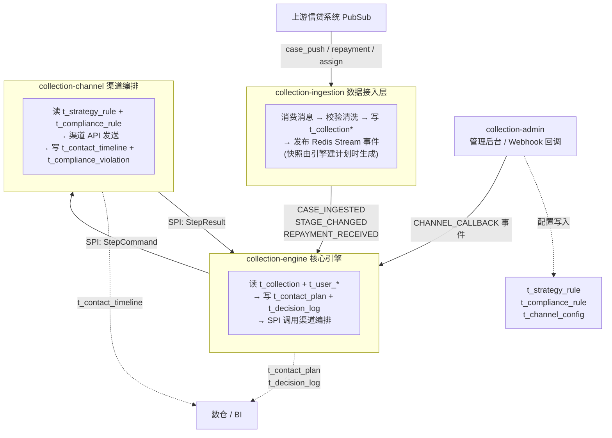

# MOCASA 催收系统升级 — Phase 1 领域模型与数据定义

> **版本**: Phase 1 · 仅覆盖菲律宾市场  
> **日期**: 2026-07-01  
> **关联文档**: [架构设计文档](./MOCASA催收系统升级_Phase1_架构设计文档.md)、[核心引擎规格](./MOCASA催收系统升级_Phase1_核心引擎规格.md)、[基础设施交互规范](./MOCASA催收系统升级_Phase1_基础设施交互规范.md)、[ContextSnapshot 契约对齐](./contracts/README_ContextSnapshot契约对齐.md)、[权威 DDL `../db/schema.sql`](../db/schema.sql)

---

## 目录

- [1. 数据资产总览](#1-数据资产总览)
- [2. 核心实体模型](#2-核心实体模型)
  - [2.1 ContactPlan（触达计划）](#21-contactplan触达计划)
  - [2.2 ContactPlanStep（触达计划步骤）](#22-contactplanstep触达计划步骤)
  - [2.3 DecisionLog（决策日志）](#23-decisionlog决策日志)
- [3. 决策上下文模型](#3-决策上下文模型)
- [4. SPI 契约 DTO](#4-spi-契约-dto)
- [5. 触达记录模型](#5-触达记录模型)
- [6. 枚举与常量定义](#6-枚举与常量定义)
- [7. 数据模型 DDL](#7-数据模型-ddl)
- [8. 渠道编排层模型（预留，待补充）](#8-渠道编排层模型预留待补充)
- [9. EventPayload 字段定义](#9-eventpayload-字段定义)

---

## 1. 数据资产总览

> 本章为跨团队 review 而设：§1.1 描述模块间主数据流与关键表读写关系；§1.2 按表列出 Owner、写入方、消费方与 DDL 归属。
> 字段级明细见 §2–§5（Java 类字段）和 §7（数据库建表语句）。

### 1.1 数据流全景图

下图展示 Phase 1 主数据流路径。实线 = 运行时数据流；虚线 = 离线/配置数据流。



### 1.2 表级契约矩阵

#### 状态标记说明

> 标记描述的是 **Phase 1 对该表的数据库变更类型**，不是运行时业务状态。其中 EXISTING / ALTER 指升级前已存在于 `collection_rebuild`（或关联库）的表；NEW 指本阶段新建表。

| 标记 | 含义 |
|---|---|
| **NEW** | Phase 1 新建表，本文档 §7（或 §8）已提供 `CREATE TABLE` |
| **NEW ⚠️** | Phase 1 计划新建，但本文档尚未写出 `CREATE TABLE`（文档/DDL 待补） |
| **ALTER** | 既有表，Phase 1 需 `ALTER TABLE` 增字段（DDL 可能在其他模块文档） |
| **EXISTING** | 既有表，Phase 1 只读引用，不做 DDL 变更 |
| ❓ | 表归属或变更范围待与相关方确认 |

---

#### A. 引擎核心表 — Owner: collection-engine（主架构负责）

| 表名 | 状态 | 首席写入方 | 核心消费方 | DDL 位置 | 审查方 |
|---|---|---|---|---|---|
| `t_contact_plan` | NEW | collection-engine | XXL-Job, 数仓 | §7.1.1 | 主架构 + 数仓 |
| `t_contact_plan_step` | NEW | collection-engine | 渠道编排(SPI 读取) | §7.1.2 | 主架构 |
| `t_decision_log` | NEW | collection-engine | 数仓(决策效果分析) | §7.1.3 | 主架构 + 数仓 |

#### B. 渠道编排配置表 — Owner: collection-channel（编排层负责，详见 §8）

| 表名 | 状态 | 首席写入方 | 核心消费方 | DDL 位置 | 审查方 |
|---|---|---|---|---|---|
| `t_contact_plan_template` | **NEW ⚠️** | 管理后台 | DefaultPlanFactory(计划创建), Stage.fromDpd() | §8（待补充） | 主架构 + 编排层 |
| `t_strategy_rule` | **NEW ⚠️** | 管理后台 | RuleBasedDecisionEngine | §8（待补充） | 编排层 |
| `t_compliance_rule` | NEW | 管理后台 | ComplianceExecutionGuard | §8（待补充） | 编排层 |
| `t_compliance_violation` | **NEW ⚠️** | collection-channel | 合规审计 | §8（待补充） | 编排层 |
| `t_channel_config` | NEW | 管理后台/运维 | ChannelAdapter 路由 | §8（待补充） | 编排层 |

#### C. 人工外呼表 — Owner: collection-channel（编排层负责，详见 §8）

| 表名 | 状态 | 首席写入方 | 核心消费方 | DDL 位置 | 审查方 |
|---|---|---|---|---|---|
| `t_call_task` | NEW | PredictiveDialerService | 坐席系统 | §8（待补充） | 编排层 |
| `t_call_task_number` | NEW | PredictiveDialerService | 坐席分配逻辑 | §8（待补充） | 编排层 |
| `t_agent_status` | NEW | 坐席 WebSocket / LTH 同步 | PredictiveDialerService | §8（待补充） | 编排层 |

#### D. 跨模块 / 服务层表

| 表名 | 状态 | Owner | 首席写入方 | 核心消费方 | DDL 位置 | 审查方 |
|---|---|---|---|---|---|---|
| `t_contact_timeline` | NEW | 跨模块共写 | channel(自动触达), 人工外呼, ingestion(ETL) | 决策引擎(聚合), 合规引擎(频率), 数仓(BI) | §7.2.1 | **全员** |
| `t_user_device_token` | NEW | 数仓（日同步，**可选**） | 数仓 ETL（源 = 旧库 `t_user_extend`） | collection-ingestion（enrichment 只读，**降级**） | §7.2.3 | 主架构 + 数仓 |
| `t_user_profile_ext` | **NEW（Phase 2 押后）** | service | ProfileService, 坐席后台 | 决策引擎(画像输入) | §7.2.2（Phase 1 不建表） | 主架构 + 数仓 |

#### E. 现有表 — 只读引用（Phase 1 不做 DDL 变更）

**Phase 1 实际读取**（ProfileService/CaseService 真实聚合）：

| 表名 | 引用位置 | 用途 |
|---|---|---|
| `t_collection` | §3.1 CaseContext | 案件主表，CaseContext 数据来源 |
| `t_user_repayment_plan` | §3.1 CaseContext | 还款计划，金额/日期来源 |
| `t_user_basis` | §3.2 UserProfile.BasicInfo | 用户基本信息（name/phone/email/language） |
| `t_user_equipment` | §3.2 UserProfile.DeviceInfo | 现网设备表（App 上报 RID）；**Phase 1 入案主路径不读**：`jpushToken` 随 `case_push` 消息体携带（2026-07 确认） |

**Phase 2 才引用**（对应 UserProfile 维度 Phase 1 不填充，见 §3.2 🅿️2）：

| 表名 | 引用位置 | 说明 |
|---|---|---|
| `t_user_work` | §3.2 UserProfile.WorkInfo | WorkInfo 维度 Phase 2 预留 |
| `t_user_telephone_book` | §3.2 UserProfile.BasicInfo.alternatePhones | 备用号 Phase 2 预留 |
| `t_system_property` | 架构设计文档 | 全局系统配置；Phase 1 走 Nacos，DB 轮询 Phase 2 可选 |

#### SSOT 导读（本文档内的定位）

> - **实体 / DTO 字段** → §2–§5（Java 类字段，本文为准）
> - **枚举值 + ChannelType 行为分组** → §6（与 `collection-common` enum 完全一致，禁止魔法字符串）
> - **引擎 / 服务 DDL** → §7（与 [`../db/schema.sql`](../db/schema.sql) 对齐的可读副本）
> - **ContextSnapshot 渠道最小必填集 / 金额 SSOT / targetAddress 取号** → [contracts](./contracts/README_ContextSnapshot契约对齐.md)（不在本文重复）
> - **状态机 / 七步管线 / 事件路由 / Redis** → [核心引擎规格](./MOCASA催收系统升级_Phase1_核心引擎规格.md) 与 [基础设施交互规范](./MOCASA催收系统升级_Phase1_基础设施交互规范.md)（本文仅链接）

---

## 2. 核心实体模型

本章定义核心引擎状态机直接读写的实体，每个类对应一张数据库表。`PlanLifecycleManager` 和 `StepExecutionOrchestrator` 通过读写这些实体驱动状态流转。

### 2.1 ContactPlan（触达计划）

> 用途：核心引擎状态机的主实体，描述一个案件在某阶段的完整触达计划。  
> 来源：`t_contact_plan` 表。  
> Java 类：`com.collection.common.model.ContactPlan`  
> 对应 DDL：[§7.1.1](#711-t_contact_plan--触达计划主表)

| 字段 | Java 类型 | DB 列 | 必填 | 说明 |
|---|---|---|---|---|
| id | Long | id | 是 | 计划 ID |
| caseId | Long | case_id | 是 | 关联案件 ID |
| userId | Long | user_id | 是 | 用户 ID |
| stage | Stage | stage | 是 | 催收阶段（枚举 §6.9） |
| planTemplateId | Long | plan_template_id | 否 | 触达计划模板 ID |
| status | PlanStatus | status | 是 | 计划状态（枚举 §6.3） |
| currentStep | int | current_step | 是 | 当前执行到第几步（从 0 开始） |
| totalSteps | int | total_steps | 是 | 总步数 |
| cancelReason | CancelReason | cancel_reason | 否 | 取消原因（枚举 §6.7，仅终态 PLAN_CANCELLED 时有值） |
| contextSnapshot | String | context_snapshot | 否 | 决策上下文快照（§3.4 ContextSnapshot 的 JSON 序列化字符串；DB 列类型 JSON） |
| idempotencyKey | String | idempotency_key | 否 | 计划创建幂等键（`case_id:stage:create_timestamp`），防止事件重投导致重复创建计划。若架构使用 UNIQUE 约束替代则可降为预留 |
| renewalPending | boolean | renewal_pending | 是 | ~~Phase 1 未使用，预留~~。穷尽续建为同步操作（旧计划终态 → 即时创新计划），无中间"待续建"态 |
| version | int | version | 是 | 乐观锁版本号，每次状态变更 +1 |
| startedAt | LocalDateTime | started_at | 否 | 计划开始执行时间。引擎写入时机：首步进入 EXECUTING 时（`IF plan.startedAt IS NULL THEN SET`） |
| completedAt | LocalDateTime | completed_at | 否 | 计划完成时间。引擎写入时机：计划进入终态（PLAN_COMPLETED / PLAN_CANCELLED）时 SET |
| createdAt | LocalDateTime | created_at | 是 | 创建时间 |
| updatedAt | LocalDateTime | updated_at | 是 | 最后更新时间 |
| steps | List\<ContactPlanStep\> | （无） | — | **仅内存态**：计划创建、ExecutionContext 组装时持有的步骤序列，不对应 `t_contact_plan` 单表列；持久化时落 `t_contact_plan_step`（§2.2） |

> **单活跃计划约束**：同一 `caseId + stage` 在同一时刻最多存在一个非终态计划。详见 [核心引擎规格 §2.2](./MOCASA催收系统升级_Phase1_核心引擎规格.md#22-计划创建)。

### 2.2 ContactPlanStep（触达计划步骤）

> 用途：计划内的单个执行步骤，由 `StepExecutionOrchestrator` 驱动执行。  
> 来源：`t_contact_plan_step` 表。  
> Java 类：`com.collection.common.model.ContactPlanStep`  
> 对应 DDL：[§7.1.2](#712-t_contact_plan_step--触达计划步骤表)

| 字段 | Java 类型 | DB 列 | 必填 | 说明 |
|---|---|---|---|---|
| id | Long | id | 是 | 步骤 ID |
| planId | Long | plan_id | 是 | 关联触达计划 ID |
| stepOrder | int | step_order | 是 | 步骤序号（从 1 开始） |
| channelType | ChannelType | channel_type | 是 | 渠道类型（枚举 §6.1） |
| templateId | Long | template_id | 否 | 话术模板 ID |
| delayMinutes | int | delay_minutes | 是 | 相对上一步的延迟（分钟），首步为相对计划创建时间 |
| triggerTime | LocalDateTime | trigger_time | 否 | 绝对触发时间（由引擎计算写入） |
| timeoutTime | LocalDateTime | timeout_time | 否 | 异步回调超时时间（由引擎在执行时写入） |
| triggerCondition | String | trigger_condition | 否 | 前置条件表达式（如"前一步未响应"）。**Phase 1 未启用**，引擎不求值；预留 Phase 2 条件跳过逻辑 |
| status | StepStatus | status | 是 | 步骤状态（枚举 §6.4） |
| observationMinutes | int | observation_minutes | 是 | 观察期（分钟），0=无观察期 |
| retryCount | int | retry_count | 是 | 已重试次数 |
| result | ContactResult | result | 否 | 步骤最终结果（枚举 §6.2） |
| idempotencyKey | String | idempotency_key | 否 | 步骤幂等键，由引擎生成（口径见下方说明） |
| executedAt | LocalDateTime | executed_at | 否 | 步骤开始执行时间 |
| completedAt | LocalDateTime | completed_at | 否 | 步骤完成时间 |
| createdAt | LocalDateTime | created_at | 是 | 创建时间 |
| updatedAt | LocalDateTime | updated_at | 是 | 最后更新时间 |

> **幂等键**：统一格式 `{planId}:{stepOrder}:{retryCount}`，同一个值在两处去重：
> - **引擎侧**——消费 `PLAN_STEP_DUE` 时拦截重复事件，避免同一步骤被执行两次（`StepExecutionOrchestrator.buildIdempotencyKey`）。
> - **渠道侧**——透传为 `StepCommand.idempotencyKey`（§4.3），供应商 dispatch 去重（`DefaultStepResolver`）。
>
> 键里含 `retryCount` 是为了让每次重试（`retryCount+1`）生成新键，从而不被上一次的幂等记录拦住。口径已与代码、`contracts/README`、`.cursor/rules/ic-v1-channel-contract.mdc` 对齐（2026-06-17；旧写法 `…:attempt` 的 `attempt` 即 `retryCount`）。详见审计 K3。

### 2.3 DecisionLog（决策日志）

> 用途：每次 SPI 调用后写入一条决策记录，供数仓分析决策效果及 Phase 2 模型训练。引擎只写不读（不参与状态流转）。  
> 来源：`t_decision_log` 表。  
> Java 类：`com.collection.common.model.DecisionLog`  
> 对应 DDL：[§7.1.3](#713-t_decision_log--决策日志)

| 字段 | Java 类型 | DB 列 | 必填 | 说明 |
|---|---|---|---|---|
| id | Long | id | 是 | 日志 ID |
| caseId | Long | case_id | 是 | 关联案件 ID |
| planId | Long | plan_id | 否 | 关联触达计划 ID（计划级决策时有值；ASSIGNMENT 等创建前决策为 null） |
| stepId | Long | step_id | 否 | 关联触达计划步骤 ID（步骤级决策时有值；计划级决策为 null） |
| decisionType | DecisionType | decision_type | 是 | 决策类型（枚举 §6.5） |
| engineType | String | engine_type | 是 | 引擎类型：RULE 或 LLM |
| engineVersion | String | engine_version | 否 | Phase 1："rule-v{规则最后修改时间戳}"；Phase 2：LLM 模型版本 |
| inputSnapshot | String | input_snapshot | 是 | 决策输入快照（ExecutionContext 的 JSON 序列化字符串；DB 列类型 JSON） |
| outputDecision | String | output_decision | 是 | 决策结果（decision 字符串 + metadata；DB 列类型 JSON） |
| reasoning | String | reasoning | 否 | Phase 1：命中规则描述；Phase 2：LLM Chain of Thought |
| confidence | double | confidence | 是 | Phase 1 固定 1.0；Phase 2 由 LLM 输出 |
| latencyMs | Integer | latency_ms | 否 | SPI 调用耗时（毫秒） |
| createdAt | LocalDateTime | created_at | 是 | 写入时间 |

---

## 3. 决策上下文模型

本章定义构建 ContextSnapshot 的源数据模型。这些模型由数据服务层（`CaseService`、`ProfileService`）构建，在计划创建时序列化为快照写入 `t_contact_plan.context_snapshot`，供 SPI 决策实现读取。

### 3.1 CaseContext（案件上下文）

> 用途：描述当前案件的核心属性，是 ContextSnapshot 的组成部分。  
> 来源：`t_collection` 表及关联的还款数据。  
> Java 类：`com.collection.common.model.CaseContext`  
> 构建方法：`CaseService.buildContext(caseId)`

| 字段 | 类型 | 必填 | 说明 | 来源 |
|---|---|---|---|---|
| caseId | Long | 是 | 案件ID | t_collection.id |
| userId | Long | 是 | 用户ID | t_collection.user_id |
| dpd | int | 是 | 逾期天数（D-3 起为负数，D0=0，D+1=1） | t_collection.overdue_day |
| stage | Stage | 是 | 当前催收阶段 | 由 DPD 计算 |
| product | String | 是 | 贷款产品标识 | t_collection.product_code |
| loanAmount | BigDecimal | 是 | 贷款金额 | t_user_repayment_plan |
| overdueAmount | BigDecimal | 是 | 逾期待还金额（本金+利息） | t_user_repayment_plan 计算 |
| penaltyAmount | BigDecimal | 是 | 罚息金额 | t_user_repayment_plan 计算 |
| totalOutstanding | BigDecimal | 是 | 总待还金额（overdueAmount + penaltyAmount） | 计算字段 |
| loanTerms | int | 否 | 贷款期数 | t_user_repayment_plan |
| disbursementDate | LocalDate | 否 | 放款日期 | t_collection |
| dueDate | LocalDate | 是 | 到期日 | t_user_repayment_plan |
| caseStatus | String | 是 | 案件状态（现有业务状态） | t_collection.status |
| assignedAgentId | Long | 否 | 当前分配的催收员ID | t_collection.collector_id |
| isFirstLoan | boolean | 是 | 是否首贷用户（JSON 序列化为 `firstLoan`，见 §3.4 注） | 数仓或 t_collection 扩展 |
| payCount | int | 是 | 历史还款次数（含本笔之前的贷款） | t_collection.pay_count |
| activePlanId | Long | 否 | 当前活跃触达计划ID | t_contact_plan 查询 |
| strategyTone | String | 否 | 编排强度：STANDARD / FIRM（读 snapshot，PlanFactory 匹配模板） | snapshot |
| complaintFrozen | boolean | 否 | 投诉/争议冻结标记；**可恢复实时冻结由 PreFlightChecker 实时查案件状态判定并"停住"**（非快照驱动、非 ExecutionGuard）；快照值仅记录建计划时点，不作中途投诉的冻结依据 | 案件状态（实时）/ snapshot（建计划时点） |
| collectionStatus | String | 否 | 案件催收生命周期：`CEASED` = D+91 完全停催 | ingestion 日切 / 案件 |
| repaymentUrl | String | 否 | App 还款深链（ingestion 写入；Push/Email/SMS 变量渲染）。**契约必填**，见 [contracts](./contracts/README_ContextSnapshot契约对齐.md) | ingestion / 信贷结账链路 |
| emailScriptSlot | String | 否 | Phase 1 Mock：显式指定 Email 里程碑 scriptSlot（E2E 联调）；为空时由 `EmailMilestoneScriptSlots.resolveByDpd(dpd)` 推断 | Mock / E2E |

> **字段映射说明**：上表中"来源"列标注的是逻辑来源。`CaseContext` 由 `CaseService.buildContext(caseId)` 构建，具体的字段映射和多表 JOIN 逻辑在 CaseService 实现中定义。`isFirstLoan` 的判定规则：同一 userId 在系统中仅有一笔贷款记录。

### 3.2 UserProfile（用户画像）

> 用途：聚合用户的全部维度数据，是 ContextSnapshot 的组成部分。  
> 来源：现有表 + `t_user_profile_ext` 扩展表（**后者 Phase 2 押后建表**，见 §7.2.2）。  
> Java 类：`com.collection.common.model.UserProfile`  
> 结构：分组嵌套，每个维度为独立内部类。  
> 对应 DDL：[§7.2.2](#722-t_user_profile_ext--用户画像扩展表phase-1-不建表押后-phase-2)（Phase 1 不建表）

> **Phase 1 范围**：渠道实际消费 `basic.{name,primaryPhone,email,language}` + `device.jpushToken`；其余维度 🅿️2 不填充。`repayment`/`risk` 已移除（[contracts 变更记录](./contracts/README_ContextSnapshot契约对齐.md#变更记录)）。

#### 顶层字段

| 字段 | 类型 | 必填 | 说明 |
|---|---|---|---|
| userId | Long | 是 | 用户ID |
| basic | BasicInfo | 是 | 基础信息（部分字段 🅿️2） |
| work | WorkInfo | 否 | 工作信息（🅿️2 Phase 2 预留，Phase 1 不填充） |
| contacts | List\<ContactInfo\> | 否 | 紧急联系人列表（🅿️2 Phase 2 预留） |
| behavior | BehaviorProfile | 否 | 触达行为画像（🅿️2 Phase 2 预留） |
| device | DeviceInfo | 否 | 设备与数字足迹（仅 jpushToken Phase 1 在用，其余 🅿️2） |
| profileCompleteness | double | 是 | 画像完整度 0.0-1.0（非空字段数 / 总字段数） |

> 🅿️2 = Phase 2 预留（结构保留、Phase 1 返回 null）。

#### BasicInfo

| 字段 | 类型 | 必填 | 来源 |
|---|---|---|---|
| name | String | 是 | t_user_basis.name |
| gender | String | 否 | t_user_basis.gender |
| age | Integer | 否 | t_user_basis.age |
| education | String | 否 | t_user_basis.education |
| maritalStatus | String | 否 | t_user_basis.marital_status |
| idNumber | String | 否 | t_user_basis.id_number（中间四位脱敏） |
| address | String | 否 | t_user_basis.address |
| primaryPhone | String | 是 | t_user_basis.phone（SMS `targetAddress` 来源，E.164 `+63`） |
| email | String | 否 | EMAIL 渠道 `targetAddress` 来源（空 → Guard `NO_EMAIL` → 步骤 SKIP）。来源 t_user_basis / 信贷用户表 |
| language | String | 否 | 用户语言偏好 ISO 639-1（tl/en）；StepResolver → `metadata.language`；默认 en |
| alternatePhones | List\<String\> | 否 | t_user_telephone_book 提取（🅿️2） |

#### WorkInfo（🅿️2）

| 字段 | 类型 | 必填 | 来源 |
|---|---|---|---|
| occupation | String | 否 | t_user_work.occupation |
| companyName | String | 否 | t_user_work.company |
| workPhone | String | 否 | t_user_work.work_phone |
| monthlyIncomeRange | String | 否 | t_user_work.income_range |

#### ContactInfo（🅿️2）

| 字段 | 类型 | 必填 | 说明 |
|---|---|---|---|
| name | String | 是 | 联系人姓名 |
| phone | String | 是 | 联系人电话 |
| relationship | String | 否 | 关系（FAMILY / FRIEND / COLLEAGUE） |
| source | String | 是 | 来源（EMERGENCY_CONTACT / PHONE_BOOK / BIGQUERY） |

#### BehaviorProfile（🅿️2）

| 字段 | 类型 | 必填 | 来源 | Phase 1 状态 |
|---|---|---|---|---|
| bestContactHour | Integer | 否 | t_user_profile_ext（Phase 2） | 预留，后期数仓填充 |
| preferredChannel | ChannelType | 否 | t_user_profile_ext（Phase 2） | 预留，系统运行累积 |
| channelReachability | Map\<ChannelType, Boolean\> | 否 | 运行时检测 | Phase 1 实现：通过各渠道 supports() 判定 |
| lastEffectiveContactTime | LocalDateTime | 否 | t_contact_timeline 聚合 | Phase 1 实现：查询最近一次 result=ANSWERED/REPLIED 的时间 |
| lastEffectiveChannel | ChannelType | 否 | t_contact_timeline 聚合 | 同上 |
| appLastActiveTime | LocalDateTime | 否 | App 埋点 / 数仓 | 预留 |

#### DeviceInfo（Phase 1 渐进填充）

| 字段 | 类型 | 必填 | 来源 | Phase 1 状态 |
|---|---|---|---|---|
| jpushToken | String | 否 | 上游 `case_push` 消息体 → ingestion 写入 payload（**已确认 2026-07**）；缺失且 `enrich-jpush-token=true` 时可读新库 `t_user_device_token` | JPush Registration ID；见 [数据接入 §3.1 读库](./MOCASA催收系统升级_Phase1_数据接入规格.md#读库) |
| deviceModel | String | 否 | t_user_equipment | 🅿️2 Phase 2 预留 |
| osVersion | String | 否 | t_user_equipment | 🅿️2 Phase 2 预留 |
| phoneValidity | PhoneValidity | 否 | t_user_profile_ext（Phase 2） | 🅿️2 预留，需号码检测供应商 |
| viberRegistered | Boolean | 否 | t_user_profile_ext（Phase 2） | 🅿️2 预留，需 Viber API 查询 |
| whatsappRegistered | Boolean | 否 | t_user_profile_ext（Phase 2） | 🅿️2 预留，需 WhatsApp API 查询 |

**ingestion 约定（Phase 1）**

| 项 | 说明 |
|----|------|
| 写入路径 | App 登录/启动时上报 JPush Registration ID → 信贷/App 后端 → `t_user_equipment` → `ProfileService.getFullProfile` |
| 字段映射 | DB 列名与 Java `jpushToken` 对齐（实现时定，建议与现网设备表扩展字段一致） |
| 多设备 | Phase 1 **单 token**（最新设备）；多 token 逗号拼接见 Notification 附录 B #5 |
| 与 FCM 区分 | **不使用** FCM token；催收 Push 经通知中心走 JPush |

> **Phase 1 约定**：`ProfileService` 仅聚合 `t_user_basis` + `t_user_equipment`（+ email）；🅿️2 字段返回 null，SPI 须防御性处理。

### 3.3 ContactHistory（触达历史摘要）

> 用途：描述用户的触达历史统计数据，是 ContextSnapshot 的组成部分。  
> 来源：`t_contact_timeline` + `t_contact_plan` 聚合计算。  
> Java 类：`com.collection.common.model.ContactHistory`  
> 构建方法：`CaseService.buildContactHistory(userId, caseId)`

| 字段 | 类型 | 必填 | 说明 | 统计范围 |
|---|---|---|---|---|
| totalTouchCount | int | 是 | 所有渠道触达总次数（OUT 方向） | 当前案件 |
| channelTouchCounts | Map\<ChannelType, Integer\> | 是 | 按渠道分类的触达次数 | 当前案件 |
| todayTouchCount | int | 是 | 今日已触达次数（所有渠道合计） | 当前用户（跨案件） |
| todayPhoneAnswered | boolean | 是 | 今日是否已有电话接通 | 当前用户（跨案件） |
| lastTouchTime | LocalDateTime | 否 | 最近一次触达时间 | 当前案件 |
| lastTouchChannel | ChannelType | 否 | 最近一次触达渠道 | 当前案件 |
| lastTouchResult | ContactResult | 否 | 最近一次触达结果 | 当前案件 |
| currentPlanAiBotFailCount | int | 是 | 当前计划内 AI Bot 拨打未接通次数 | 当前计划 |
| ptpCount | Integer | 否 | PTP 承诺总次数（🅿️2；Phase 1 为 null） | 当前案件 |
| ptpFulfilledCount | Integer | 否 | PTP 兑现次数（🅿️2；Phase 1 为 null） | 当前案件 |
| stageEntryDate | LocalDate | 否 | 进入当前阶段的日期 | 当前案件 |

> **统计范围说明**：部分字段按案件（caseId）统计，部分按用户（userId）统计。`todayTouchCount` 和 `todayPhoneAnswered` 必须按用户统计，因为合规引擎的频率限制和接通即停规则是用户维度的（同一用户多笔贷款合并计算）。
>
> **PTP 统计（🅿️2）**：`ptpCount` / `ptpFulfilledCount` 需从 `t_contact_timeline` 识别 PTP 承诺与兑现；Phase 1 **不计算**（`buildContactHistory` 返回 null，区别于 0）；Phase 2 再实现聚合。

### 3.4 ContextSnapshot（决策上下文快照）

> 用途：计划创建时，引擎经 `CaseService`/`ProfileService` 将决策所需上下文序列化为不可变 JSON，写入 `t_contact_plan.context_snapshot`。  
> Java 类：`com.collection.common.model.ContextSnapshot`  
> 写入时机：计划创建时（[核心引擎规格 §4.2 计划创建](./MOCASA催收系统升级_Phase1_核心引擎规格.md#42-计划创建)）  
> 消费方：ExecutionContext 的组成部分（§4.1），所有 SPI 实现通过 ExecutionContext.contextSnapshot 读取

| 字段 | 类型 | 必填 | 说明 |
|---|---|---|---|
| caseContext | CaseContext | 是 | 案件上下文快照（§3.1） |
| userProfile | UserProfile | 是 | 用户画像快照（§3.2） |
| contactHistory | ContactHistory | 是 | 触达历史快照（§3.3） |
| snapshotTime | LocalDateTime | 是 | 快照生成时间 |
| snapshotVersion | String | 是 | 快照版本标识（用于 A/B 测试时区分） |

> **不可变性约束**：快照一旦写入，不随源数据变化而更新。SPI 实现基于快照做决策——这保证了同一计划内步骤之间的决策一致性。不可快照的实时状态（还款/冻结）由 PreFlightChecker 在步骤执行时实时校验。
>
> **JSON 序列化约定**：样例 JSON 字段名 = Java 模型字段名（fastjson 默认）。注意布尔字段 `CaseContext.isFirstLoan` 序列化为 **`firstLoan`**（去 `is` 前缀）。冻结样例见 [`./contracts/ContextSnapshot.sample.json`](./contracts/ContextSnapshot.sample.json)。
>
> ⚠️ **待确认**：具体的序列化策略（全量 vs 精简字段）、快照大小上限、快照刷新机制（阶段变更时是否重建）待后续讨论确定。

> **与 contracts 的分工（SSOT 边界）**
>
> - **本文 §3**：ContextSnapshot 及其组成（CaseContext / UserProfile / ContactHistory）的**完整字段结构**，与 `collection-common` model 对齐，为字段定义唯一 SSOT。
> - **[contracts](./contracts/README_ContextSnapshot契约对齐.md)**：跑通各渠道的**最小必填字段集**、**金额 SSOT**（对外文案变量只认 `caseContext.*`）、**targetAddress 取号口径**（SMS→`basic.primaryPhone`、PUSH→`device.jpushToken`、EMAIL→`basic.email`）。本文不重复这些用法表。

---

## 4. SPI 契约 DTO

本章定义核心引擎（`engine.lifecycle`）与渠道编排层（`engine.strategy` + `collection-channel`）之间的接口数据结构。这些 DTO 定义于 `engine.spi` 包（`collection-common` 模块），构成模块契约层。

SPI 接口签名与调用时机见 [核心引擎规格 §4](./MOCASA催收系统升级_Phase1_核心引擎规格.md#4-spi-接口完整定义)。

| DTO | 关联 SPI 接口 | 契约边界 |
|---|---|---|
| ExecutionContext | ExecutionGuard / StepResolver / AdvancementPolicy | 引擎 → 渠道编排（策略子层） |
| GuardVerdict | ExecutionGuard | 渠道编排（策略子层） → 引擎 |
| StepCommand | StepResolver / ChannelGateway | 渠道编排内：策略子层 → 执行子层（引擎 ④⑤ 串联） |
| StepResult | ChannelGateway / AdvancementPolicy | 渠道编排（执行子层） → 引擎 |
| AdvancementDecision | AdvancementPolicy | 渠道编排（策略子层） → 引擎 |
| ExhaustionResult | ExhaustionPolicy | 渠道编排（策略子层） → 引擎 |

### 4.1 ExecutionContext（执行上下文）

> 用途：引擎组装后传递给 SPI 实现方，是所有 SPI 调用的统一输入。  
> 调用时机：所有 SPI 调用的统一入参，见 [核心引擎规格 §4](./MOCASA催收系统升级_Phase1_核心引擎规格.md#4-spi-接口完整定义)  
> 约束：SPI 实现方只读，不得调用任何 setter。Phase 2 考虑替换为不可变 View 对象。

| 字段 | 类型 | 必填 | 说明 |
|---|---|---|---|
| plan | ContactPlan | 是 | 当前计划（状态、阶段、案件引用）。引擎内部实体的引用。 |
| currentStep | ContactPlanStep | 是 | 当前待执行步骤 |
| contextSnapshot | ContextSnapshot | 是 | 案件入库快照，决策唯一输入（零 DB I/O） |
| recentTimeline | List\<ContactRecord\> | 是 | 近期触达历史记录，默认最近 50 条 |

### 4.2 GuardVerdict（守卫裁定）

> 用途：`ExecutionGuard.evaluate()` 的输出，决定当前步骤是否允许执行。  
> 调用位置：[核心引擎规格 §5 步骤③](./MOCASA催收系统升级_Phase1_核心引擎规格.md#5-步骤执行管线)

| 字段 | 类型 | 必填 | 说明 |
|---|---|---|---|
| allowed | boolean | 是 | true=放行，false=拦截 |
| blockedReason | String | 否 | 拦截原因（allowed=true 时为 null） |
| blockedRuleType | String | 否 | 拦截规则类型：FREQUENCY_LIMIT / TIME_WINDOW / CONNECT_AND_STOP / ABANDONMENT_RATE |

### 4.3 StepCommand（步骤命令）

> 用途：`StepResolver.resolve()` 的输出，同时作为 `ChannelGateway.dispatch()` 的输入。  
> 调用位置：[核心引擎规格 §5 步骤④⑤](./MOCASA催收系统升级_Phase1_核心引擎规格.md#5-步骤执行管线)

| 字段 | 类型 | 必填 | 说明 |
|---|---|---|---|
| channelType | ChannelType | 是 | SMS / PUSH / EMAIL / VIBER / WHATSAPP / AI_CALL / TTS / HUMAN_CALL |
| targetAddress | String | 是 | 手机号 / Token / 邮箱（按渠道解释） |
| templateId | String | 是 | 模板 ID（策略选定，执行层渲染） |
| idempotencyKey | String | 是 | 透传 step.idempotencyKey，渠道层供应商去重 |
| metadata | Map\<String, Object\> | 否 | 扩展字段，已知 key 见下表 |

**metadata 已知 key（Phase 1）**：与 `StepCommand.java` 的 `META_*` 常量一一对应，共 **13** 个。新增字段优先塞 metadata，避免破坏性改 DTO。

| key | 常量 | 类型 | 说明 |
|---|---|---|---|
| stage | META_STAGE | String | `Stage.name()`，渠道层用于选择模板变体 |
| language | META_LANGUAGE | String | ISO 639-1（如 "tl" / "en"） |
| callbackUrl | META_CALLBACK_URL | String | 异步渠道必填，回调地址 |
| timeoutMinutes | META_TIMEOUT_MINUTES | Integer | 异步渠道回调超时分钟数 |
| scriptSlot | META_SCRIPT_SLOT | String | 话术槽位标识（里程碑/场景），渠道层选模板变体 |
| sms_body | META_SMS_BODY | String | SMS 正文（已渲染文案） |
| fallback_sms_body | META_FALLBACK_SMS_BODY | String | PUSH 失败回退 SMS 的正文 |
| title | META_TITLE | String | PUSH 通知标题 |
| body | META_BODY | String | PUSH 通知正文 |
| pushData | META_PUSH_DATA | Object | PUSH 附加数据（如 `deep_link` 等结构化字段） |
| dynamicTemplateData | META_DYNAMIC_TEMPLATE_DATA | Object | EMAIL 动态模板变量（SendGrid dynamic template data） |
| case_id | META_CASE_ID | String | 案件 ID（渠道层日志 / 回执关联） |
| fallback_sms | META_FALLBACK_SMS | String/Boolean | PUSH 同槽 fallback SMS 标记/开关 |

> **执行运行时语义**（`retryable` 判定、观察期、空地址处理等）不在本文复述，见 [contracts 引擎渠道执行契约对齐](./contracts/MOCASA催收系统升级_Phase1_引擎渠道执行契约对齐_待编排确认.md) 与 `.cursor/rules/ic-v1-channel-contract.mdc`。

### 4.4 StepResult（步骤结果）

> 用途：`ChannelGateway.dispatch()` 的输出，同时作为 `AdvancementPolicy.decide()` 的输入之一。  
> 调用位置：[核心引擎规格 §5 步骤⑤](./MOCASA催收系统升级_Phase1_核心引擎规格.md#5-步骤执行管线)

| 字段 | 类型 | 必填 | 说明 |
|---|---|---|---|
| success | boolean | 是 | 渠道层是否成功接受并处理了请求 |
| contactResult | ContactResult | 是 | DELIVERED / ANSWERED / NO_ANSWER / REJECTED / FAILED 等（枚举 §6.2） |
| errorCode | String | 否 | 失败时统一错误码（success=true 时为 null） |
| retryable | boolean | 是 | 网络超时=true；号码无效=false（仅 success=false 时有意义） |
| providerMsgId | String | 否 | 供应商消息/通话 ID，回调关联与对账 |

> **success 判定规则**：由渠道层根据 contactResult 设置。FAILED 类 → false，其余 → true。引擎仅读 success 决定是否进入故障降级；AdvancementPolicy 读 contactResult 做业务决策。
>
> **`retryable` 判定、观察期（STEP_WAITING）、空地址（NO_EMAIL/NO_PHONE/NO_TOKEN）等执行运行时语义**为渠道执行契约，不在本文复述，见 [contracts 引擎渠道执行契约对齐](./contracts/MOCASA催收系统升级_Phase1_引擎渠道执行契约对齐_待编排确认.md)。

### 4.5 AdvancementDecision（推进决策）

> 用途：`AdvancementPolicy.decide()` 的输出，三选一枚举。  
> 调用位置：[核心引擎规格 §2.3.2](./MOCASA催收系统升级_Phase1_核心引擎规格.md#232-步骤完成推进决策)  
> Java 类：`com.collection.common.enums.AdvancementDecision`

| 枚举值 | 含义 | 引擎动作 |
|---|---|---|
| ADVANCE_NEXT | 推进到下一步 | 注册下一步 Job 或立即执行 |
| PLAN_COMPLETED | 计划完成 | 计划进入终态 PLAN_COMPLETED |
| PLAN_EXHAUSTED | 计划穷尽 | 发布 PLAN_EXHAUSTED 事件 → [§2.5 穷尽续建](./MOCASA催收系统升级_Phase1_核心引擎规格.md#25-穷尽续建) |

### 4.6 ExhaustionResult（穷尽结果）

> 用途：`ExhaustionPolicy.handle()` 的输出，描述计划穷尽后的处置策略。  
> 调用位置：[核心引擎规格 §2.5](./MOCASA催收系统升级_Phase1_核心引擎规格.md#25-穷尽续建)、[§2.6](./MOCASA催收系统升级_Phase1_核心引擎规格.md#26-ptp-到期处理)

| 字段 | 类型 | 必填 | 说明 |
|---|---|---|---|
| action | ExhaustionAction | 是 | 穷尽策略动作（枚举 §6.10） |
| targetStage | Stage | 否 | 仅 ESCALATE 时有值：升档目标阶段 |
| templateId | String | 否 | 仅 REBUILD 时有值：新计划模板 ID |
| reason | String | 是 | 决策理由，写 timeline / 日志 |

**字段约束**：

| action | targetStage | templateId |
|---|---|---|
| REBUILD | null | 必填 |
| ESCALATE | 必填 | null |
| COMPLETE | null | null |

---

## 5. 触达记录模型

### 5.1 ContactRecord（统一触达记录）

> 用途：写入 `t_contact_timeline` 的标准模型。所有渠道（自动 + 人工）、所有来源（系统触达 + ETL 迁移 + PubSub 同步）统一使用此模型写入。  
> Java 类：`com.collection.common.model.ContactRecord`  
> 对应 DDL：[§7.2.1](#721-t_contact_timeline--统一触达时间线)

| 字段 | 类型 | 必填 | 取值约定 |
|---|---|---|---|
| id | Long | 否 | 记录 ID（DB 自增，写入前为 null） |
| caseId | Long | 是 | 关联案件 ID |
| userId | Long | 是 | 用户 ID |
| planId | Long | 否 | 关联触达计划 ID。历史迁移数据（source=ETL_SYNC）无计划 ID，传 null |
| stepId | Long | 否 | 关联步骤 ID。人工渠道的坐席录入和历史迁移数据无步骤 ID |
| channel | ChannelType | 是 | 渠道枚举 |
| direction | Direction | 是 | OUT=系统发出，IN=用户响应（如用户回复 Viber 消息） |
| templateId | Long | 否 | 使用的话术模板 ID |
| contentSummary | String | 否 | 内容摘要，≤500 字符。SMS/Email 取前 500 字符；电话类取"呼叫 {phone}，时长 {seconds}s" |
| result | ContactResult | 否 | 触达结果枚举。初次写入时可能为 null（如 SMS 发出但未收到回执），后续回调更新 |
| providerMsgId | String | 否 | 供应商消息 ID，用于回调关联和去重 |
| providerCallback | String | 否 | 供应商回调原始 JSON（调试用） |
| cost | BigDecimal | 否 | 单次触达成本（如有） |
| source | DataSource | 是 | SYSTEM=系统实时触达；ETL_SYNC=历史数据迁移；PUBSUB_SYNC=过渡期增量同步 |
| createdAt | LocalDateTime | 否 | 写入时间（DB 列 created_at，默认 CURRENT_TIMESTAMP） |

> **写入规则**：  
> 1. 合规拦截的触达**也写入** `t_contact_timeline`，result=COMPLIANCE_BLOCKED，用于形成完整的用户接触全貌（同时写入 `t_compliance_violation` 记录详情）。  
> 2. 渠道发送失败（重试耗尽）写入 `t_contact_timeline`，result=FAILED。  
> 3. 同一个 providerMsgId 的回调更新是幂等的：更新 result 和 providerCallback，不新增记录。

---

## 6. 枚举与常量定义

本章定义的枚举直接转化为 `collection-common` 模块的 Java Enum 文件。所有模块引用统一枚举，禁止使用魔法字符串。

### 6.1 ChannelType（渠道类型）

> Java 类：`com.collection.common.enums.ChannelType`  
> 对应存储：`t_contact_timeline.channel`、`t_channel_config.channel_type`

| 枚举值 | 显示名 | 供应商 | 渠道模式 | Phase 1 状态 |
|---|---|---|---|---|
| PUSH | App 推送 | JPush（经内部通知中心；**不使用 FCM token**） | AUTOMATED | 接入 |
| SMS | 短信 | LTH | AUTOMATED | 升级 |
| AI_CALL | AI 机器人外呼 | LTH | AUTOMATED | 升级 |
| TTS | TTS 语音通知 | LTH | AUTOMATED | **LTH 域外**（独立编排，本系统不生成 plan step） |
| EMAIL | 邮件 | SendGrid（主；SES 备） | AUTOMATED | 接入 |
| VIBER | Viber 消息 | Viber Business API（待签约） | AUTOMATED | 接入 |
| WHATSAPP | WhatsApp 消息 | WSCRM | AUTOMATED | 升级 |
| HUMAN_CALL | 人工外呼 | LTH 预测式外呼 | AGENT_ASSISTED | 升级 |

> **渠道行为分组**（`ChannelType` 行为方法，引擎据此决定执行后状态流转）：
>
> | 方法 | 含义 | 成员 |
> |---|---|---|
> | `isMessageChannel()` | 消息类：同步返回、有/无观察期 | SMS / PUSH / EMAIL / VIBER / WHATSAPP |
> | `isAsyncChannel()` | 电话/人工类：发送后保持 STEP_EXECUTING，等待异步回调 | AI_CALL / HUMAN_CALL |

### 6.2 ContactResult（触达结果）

> Java 类：`com.collection.common.enums.ContactResult`  
> 对应存储：`t_contact_timeline.result`

| 枚举值 | 含义 | 写入 timeline | 产生该值的渠道 |
|---|---|---|---|
| DELIVERED | 已送达（供应商确认投递成功） | 是 | SMS, PUSH, EMAIL, VIBER, WHATSAPP |
| READ | 已读 | 是 | PUSH（点击）, VIBER, WHATSAPP |
| REPLIED | 用户回复了消息 | 是 | VIBER, WHATSAPP |
| CLICKED | 用户点击了消息中的链接/按钮 | 是 | PUSH, EMAIL, VIBER |
| ANSWERED | 电话已接通 | 是 | AI_CALL, HUMAN_CALL |
| NO_ANSWER | 电话未接听 | 是 | AI_CALL, HUMAN_CALL |
| BUSY | 忙线 | 是 | AI_CALL, HUMAN_CALL |
| FAILED | 发送失败（重试耗尽） | 是 | 所有渠道 |
| REJECTED | 被拒收（用户屏蔽/退订） | 是 | SMS, EMAIL, VIBER, WHATSAPP |
| SENT_NO_RESPONSE | 已发送，观察期内无响应 | 是 | SMS, PUSH, EMAIL, VIBER, WHATSAPP |
| COMPLIANCE_BLOCKED | 被合规引擎拦截 | **是** | 系统内部（步骤未实际执行，但写入 timeline 保证完整性） |
| SKIPPED | StepResolver 主动跳过该步（如 EMAIL 非里程碑 DPD / 无邮箱）；**非失败**，引擎照常推进 | 否 | 系统内部（步骤结果） |
| CHANNEL_DOWN | 渠道不可用（健康检查失败） | **否** | 系统内部（步骤结果，不写 timeline） |

> **回调更新规则**：初次发送写入 DELIVERED，后续回调可升级为 READ → REPLIED / CLICKED。结果只能"升级"不能"降级"（如已经是 READ 则不会回退为 DELIVERED）。升级优先级（低→高）：`DELIVERED(1) < READ(2) < CLICKED(3) < REPLIED(4)`。  
> **实现约束**：枚举类应声明 `priority` 字段（如 `DELIVERED(1), READ(2), CLICKED(3), REPLIED(4)`），回调更新时用 `if (newResult.priority > currentResult.priority)` 判断是否覆盖，避免枚举重排导致降级 bug。`ANSWERED`、`NO_ANSWER`、`BUSY` 等电话类结果为终态，不参与升级链。

### 6.3 PlanStatus（触达计划状态）

> Java 类：`com.collection.common.enums.PlanStatus`  
> 对应存储：`t_contact_plan.status`  
> 状态机详见 [核心引擎规格 §2](./MOCASA催收系统升级_Phase1_核心引擎规格.md#2-计划生命周期与状态机)

计划级状态机共 **6 态**（4 非终态 + 2 终态）：

| 枚举值 | 类型 | 含义 |
|---|---|---|
| PENDING | 非终态 | 计划刚创建，尚未执行任何步骤，等待首步 trigger_time |
| STEP_SCHEDULED | 非终态 | 上一步已结束，下一步 Job 已注册，等待到期 |
| STEP_EXECUTING | 非终态 | 当前步骤执行中（渠道发送 / 等待异步回调） |
| STEP_WAITING | 非终态 | 消息类渠道已发出，观察期内等待用户响应 |
| **PLAN_COMPLETED** | **终态** | 正常结束（还款确认或步骤全部走完） |
| **PLAN_CANCELLED** | **终态** | 被中断取消（cancel_reason 记录原因） |

> **与 StepStatus 的关系**：`PlanStatus` 描述整个计划的当前状态（始终跟踪最新步骤的执行进度）。`StepStatus` 描述每个步骤的最终结果（一旦步骤完成就不再变化）。
>
> ⚠️ **注意**：`PLAN_EXHAUSTED` **不是** `PlanStatus`，而是 `EventType`（§6.6）与 `AdvancementDecision`（§4.5）的值；计划穷尽后经续建流程进入终态 `PLAN_COMPLETED`/`PLAN_CANCELLED`，不存在 `PLAN_EXHAUSTED` 状态态。

### 6.4 StepStatus（步骤执行状态）

> Java 类：`com.collection.common.enums.StepStatus`

| 枚举值 | 含义 |
|---|---|
| PENDING | 步骤尚未执行 |
| EXECUTING | 步骤执行中 |
| COMPLETED | 步骤正常完成 |
| SKIPPED | 步骤被跳过（合规拦截 / 渠道不可用） |
| FAILED | 步骤失败（渠道发送失败，重试耗尽） |

### 6.5 DecisionType（决策类型）

> Java 类：`com.collection.common.enums.DecisionType`

| 枚举值 | 含义 | 触发时机 | Phase 1 实现 |
|---|---|---|---|
| ASSIGNMENT | 分案：将案件分配给催收员 | 案件入库 / 阶段切换 | RuleBasedEngine：按 DPD 阶段 × 产品分配 |
| CHANNEL_SELECT | 渠道选择：决定使用哪个渠道触达 | 步骤执行前 | RuleBasedEngine：按阶段 × 渠道矩阵 |
| SCRIPT_SELECT | 话术选择：决定使用哪个话术组 | 步骤执行前 | RuleBasedEngine：按阶段 × 用户标签匹配 |
| TIMING | 触达时间：决定最佳触达时间 | 步骤调度时 | Phase 1 固定时间窗口（9AM-6PM），直接返回 |
| CHANNEL_MODE_SELECT | AI/Human 决策：决定使用 AI Bot 还是人工坐席 | 步骤执行前（电话类渠道） | RuleBasedEngine：按决策表 |

### 6.6 EventType（内部事件类型）

> Java 类：`com.collection.common.enums.EventType`  
> 传输格式：Redis Stream message  
> 事件路由表详见 [核心引擎规格 §1.1](./MOCASA催收系统升级_Phase1_核心引擎规格.md#11-eventconsumerdispatcher-与事件路由)

| 枚举值 | 含义 | 发布者 | 消费者 |
|---|---|---|---|
| CASE_INGESTED | 案件入库（新案件或案件数据更新） | collection-ingestion | collection-engine |
| STAGE_CHANGED | 阶段变更（DPD 导致阶段升级） | collection-ingestion | collection-engine |
| REPAYMENT_RECEIVED | 还款到账 | collection-ingestion | collection-engine |
| PLAN_STEP_DUE | 步骤到期（观察期结束） | XXL-Job 定时扫描 | collection-engine |
| CHANNEL_CALLBACK | 渠道回调（送达/已读/接通等） | collection-admin (webhook) | collection-engine |
| PTP_EXPIRED | PTP 到期（承诺还款日期已过）— **Phase 2 预留**：Phase 1 不生产、不消费（引擎不入路由表，见 [核心引擎规格 §2.6](./MOCASA催收系统升级_Phase1_核心引擎规格.md#26-ptp-到期处理)） | （Phase 2） | （Phase 2） |
| STEP_COMPLETED | 步骤完成（事件驱动推进） | collection-engine | collection-engine |
| PLAN_EXHAUSTED | 计划穷尽（所有步骤完成但未还款） | collection-engine | collection-engine |
| CALLBACK_TIMEOUT | 异步回调超时哨兵（内部兜底，见基础设施规范 §4 callbackTimeoutHandler） | collection-engine | collection-engine |
| CASE_CEASED | D+91 完全停催；引擎 cancel plan 且不再 create（对齐待办 E1） | collection-ingestion（日切 / mock） | collection-engine |

### 6.7 CancelReason（计划取消原因）

> Java 类：`com.collection.common.enums.CancelReason`

| 枚举值 | 含义 | 触发场景 | 引擎管辖 |
|---|---|---|---|
| REPAID | 用户已还款 | 还款事件到达 | **是** |
| STAGE_UPGRADE | 阶段升级导致旧计划取消 | DPD 变化触发阶段变更 | **是** |
| CEASED | Max DPD ≥91 完全停催（CASE_CEASED） | ingestion 日切 / CASE_CEASED 事件 | **是** |
| COMPLAINT | 用户投诉 | 管理后台手动操作 | 否（管理后台触发） |
| MANUAL | 人工取消 | 管理后台手动操作 | 否（管理后台触发） |
| PTP_EXPIRED | PTP 到期未还款（**Phase 2 预留**，Phase 1 不使用） | （Phase 2） | 否 |

> **引擎管辖**列标注核心引擎状态机代码中直接写入的值。其余值由外部模块通过 API 设置，引擎仅识别为终态。

### 6.8 ChannelMode（渠道模式）

> Java 类：`com.collection.common.enums.ChannelMode`

| 枚举值 | 含义 | 适用渠道 |
|---|---|---|
| AUTOMATED | 自动触达：系统直接调 API，秒级完成 | PUSH, SMS, AI_CALL, EMAIL, VIBER, WHATSAPP |
| AGENT_ASSISTED | 人工辅助：需要坐席参与，以批量任务为单位 | HUMAN_CALL |

### 6.9 Stage（催收阶段）

> Java 类：`com.collection.common.enums.Stage`

| 枚举值 | DPD 范围 | 说明 |
|---|---|---|
| S0 | D-3 ~ D0 | Pre-Due 到期前提醒 |
| S1 | D+1 ~ D+3 | Early 早期催收 |
| S2 | D+4 ~ D+15 | Mid 中期 |
| S3 | D+16 ~ D+30 | Late 晚期 |
| S4 | D+31+ | Extended 延长期 |

> **DPD → Stage 映射方法**：`Stage.fromDpd(int dpd)` 静态方法，边界已与渠道编排同事对齐（2026-06-15）：S0∈[-3,0]、S1∈[1,3]、S2∈[4,15]、S3∈[16,30]、S4∈[31,∞)。共 **5** 个阶段（无 S4_PLUS）。
>
> **D+91 停催不属于 Stage 概念**：由 `PlanFactory.shouldRejectPlan` / ingestion 日切独立处理（发 `CASE_CEASED` 事件，§6.6），Stage 不感知。
>
> ⚠️ 上表区间为代码默认值；若后续改为从 `t_contact_plan_template` 配置读取，需同步 `Stage.java`（**代码待跟进**，本次仅文档对齐代码现状）。

### 6.10 ExhaustionAction（穷尽策略动作）

> Java 类：`com.collection.common.enums.ExhaustionAction`  
> 消费方：ExhaustionResult.action（§4.6）

| 枚举值 | 含义 | 引擎动作 |
|---|---|---|
| REBUILD | 同阶段立即续建：创建新一轮计划，继续触达 | 调用 PlanFactory.create() 创建新计划 |
| ESCALATE | 升档：当前阶段触达手段已穷尽，提升催收强度 | 发布 STAGE_CHANGED 事件 → 取消旧阶段计划 + 创建新阶段计划 |
| COMPLETE | 停止：不再主动触达，等待用户自主还款或 DPD 自然越阶 | 标记计划 PLAN_COMPLETED（终态） |

> `REBUILD` 有续建次数上限（`engine.plan.max_rebuild_count`），防止无限循环。达到上限后策略层应返回 `ESCALATE` 或 `COMPLETE`。

### 6.11 其他辅助枚举

| 枚举 | Java 类 | 值 |
|---|---|---|
| Direction | `com.collection.common.enums.Direction` | OUT（系统发出）、IN（用户响应） |
| DataSource | `com.collection.common.enums.DataSource` | SYSTEM、ETL_SYNC、PUBSUB_SYNC |
| SensitivityTag | `com.collection.common.enums.SensitivityTag` | COOPERATIVE、AVOIDANT、CONFRONTATIONAL、UNREACHABLE |
| PhoneValidity | `com.collection.common.enums.PhoneValidity` | VALID、INVALID、SUSPENDED、UNKNOWN |

---

## 7. 数据模型 DDL

> **权威 DDL**：[`../db/schema.sql`](../db/schema.sql)。本节为与之**结构一致的可读副本**（列 / 类型 / 索引 / DEFAULT / COMMENT）；变更须**双写**（先改 schema.sql，再同步本节）。
> 为与权威文件对齐，本节统一采用 `CREATE TABLE IF NOT EXISTS` + 表级 `COMMENT`。

### 7.1 引擎核心表 CREATE TABLE

#### 7.1.1 t_contact_plan — 触达计划主表

```sql
CREATE TABLE IF NOT EXISTS t_contact_plan (
    id                  BIGINT          AUTO_INCREMENT PRIMARY KEY,
    case_id             BIGINT          NOT NULL COMMENT '关联案件ID',
    user_id             BIGINT          NOT NULL COMMENT '用户ID',
    stage               VARCHAR(16)     NOT NULL COMMENT '催收阶段: S0/S1/S2/S3/S4',
    plan_template_id    BIGINT          NULL     COMMENT '触达计划模板ID',
    status              VARCHAR(32)     NOT NULL DEFAULT 'PENDING' COMMENT 'PENDING/STEP_SCHEDULED/STEP_EXECUTING/STEP_WAITING/PLAN_COMPLETED/PLAN_CANCELLED',
    current_step        INT             NOT NULL DEFAULT 0 COMMENT '当前执行到第几步',
    total_steps         INT             NOT NULL COMMENT '总步数',
    cancel_reason       VARCHAR(64)     NULL     COMMENT '取消原因: REPAID/STAGE_UPGRADE/CEASED/COMPLAINT/MANUAL/PTP_EXPIRED',
    context_snapshot    JSON            NULL     COMMENT '决策上下文快照（ContextSnapshot JSON）',
    idempotency_key     VARCHAR(128)    NULL     COMMENT '计划创建幂等键（case_id:stage:create_timestamp），防止事件重投重复创建。Phase 1 预留',
    renewal_pending     TINYINT(1)      NOT NULL DEFAULT 0 COMMENT 'Phase 1 未使用，预留。穷尽续建为同步操作无中间态',
    version             INT             NOT NULL DEFAULT 0 COMMENT '乐观锁版本号，每次状态变更 +1',
    started_at          DATETIME        NULL     COMMENT '首步进入EXECUTING时写入（IF NULL THEN SET）',
    completed_at        DATETIME        NULL     COMMENT '计划进入终态时写入',
    created_at          DATETIME        NOT NULL DEFAULT CURRENT_TIMESTAMP,
    updated_at          DATETIME        NOT NULL DEFAULT CURRENT_TIMESTAMP ON UPDATE CURRENT_TIMESTAMP,
    INDEX idx_case (case_id),
    INDEX idx_status (status),
    INDEX idx_user_stage (user_id, stage)
) ENGINE=InnoDB DEFAULT CHARSET=utf8mb4 COMMENT='触达计划主表';
```

#### 7.1.2 t_contact_plan_step — 触达计划步骤表

```sql
CREATE TABLE IF NOT EXISTS t_contact_plan_step (
    id                  BIGINT          AUTO_INCREMENT PRIMARY KEY,
    plan_id             BIGINT          NOT NULL COMMENT '关联触达计划ID',
    step_order          INT             NOT NULL COMMENT '步骤序号（从1开始）',
    channel_type        VARCHAR(32)     NOT NULL COMMENT 'PUSH/SMS/AI_CALL/TTS/EMAIL/VIBER/WHATSAPP/HUMAN_CALL',
    template_id         BIGINT          NULL     COMMENT '话术模板ID',
    delay_minutes       INT             NOT NULL DEFAULT 0 COMMENT '相对上一步的延迟（分钟），首步为相对计划创建时间',
    trigger_time        DATETIME        NULL     COMMENT '绝对触发时间（由引擎计算写入）',
    timeout_time        DATETIME        NULL     COMMENT '异步回调超时时间（由引擎在执行时写入）',
    trigger_condition   VARCHAR(256)    NULL     COMMENT '前置条件表达式（如"前一步未响应"）',
    status              VARCHAR(16)     NOT NULL DEFAULT 'PENDING' COMMENT 'PENDING/EXECUTING/COMPLETED/SKIPPED/FAILED',
    observation_minutes INT             NOT NULL DEFAULT 0 COMMENT '观察期（分钟），0=无观察期',
    retry_count         INT             NOT NULL DEFAULT 0 COMMENT '已重试次数',
    result              VARCHAR(32)     NULL     COMMENT '步骤最终结果（ContactResult 枚举值）',
    idempotency_key     VARCHAR(128)    NULL     COMMENT '幂等键（plan_id:step_order:attempt，由引擎生成）',
    executed_at         DATETIME        NULL     COMMENT '步骤开始执行时间',
    completed_at        DATETIME        NULL     COMMENT '步骤完成时间',
    created_at          DATETIME        NOT NULL DEFAULT CURRENT_TIMESTAMP,
    updated_at          DATETIME        NOT NULL DEFAULT CURRENT_TIMESTAMP ON UPDATE CURRENT_TIMESTAMP,
    INDEX idx_plan_order (plan_id, step_order),
    INDEX idx_trigger (trigger_time, status),
    INDEX idx_timeout (timeout_time, status)
) ENGINE=InnoDB DEFAULT CHARSET=utf8mb4 COMMENT='触达计划步骤表';
```

#### 7.1.3 t_decision_log — 决策日志

```sql
CREATE TABLE IF NOT EXISTS t_decision_log (
    id                  BIGINT          AUTO_INCREMENT PRIMARY KEY,
    case_id             BIGINT          NOT NULL,
    plan_id             BIGINT          NULL     COMMENT '关联触达计划ID（计划级决策时有值）',
    step_id             BIGINT          NULL     COMMENT '关联触达计划步骤ID（步骤级决策时有值）',
    decision_type       VARCHAR(32)     NOT NULL COMMENT 'ASSIGNMENT/CHANNEL_SELECT/SCRIPT_SELECT/TIMING/CHANNEL_MODE_SELECT',
    engine_type         VARCHAR(16)     NOT NULL COMMENT 'RULE/LLM',
    engine_version      VARCHAR(32)     NULL,
    input_snapshot      JSON            NOT NULL COMMENT '决策输入快照',
    output_decision     JSON            NOT NULL COMMENT '决策结果',
    reasoning           TEXT            NULL     COMMENT 'Phase 1: 命中规则; Phase 2: LLM CoT',
    confidence          DECIMAL(5,4)    NOT NULL DEFAULT 1.0000,
    latency_ms          INT             NULL,
    created_at          DATETIME        NOT NULL DEFAULT CURRENT_TIMESTAMP,
    INDEX idx_case_type (case_id, decision_type),
    INDEX idx_plan_step (plan_id, step_id),
    INDEX idx_engine (engine_type, created_at)
) ENGINE=InnoDB DEFAULT CHARSET=utf8mb4 COMMENT='决策日志';
```

#### 7.1.4 t_contact_plan_template（已移至 §8）

> 该表由渠道编排层负责，DDL 见 §8（待补充）。

### 7.2 跨模块共享表 CREATE TABLE

#### 7.2.1 t_contact_timeline — 统一触达时间线

```sql
CREATE TABLE IF NOT EXISTS t_contact_timeline (
    id                  BIGINT          AUTO_INCREMENT PRIMARY KEY,
    case_id             BIGINT          NOT NULL,
    user_id             BIGINT          NOT NULL,
    plan_id             BIGINT          NULL     COMMENT '关联触达计划（历史迁移数据无计划ID）',
    step_id             BIGINT          NULL     COMMENT '关联步骤ID（人工渠道/迁移数据无步骤ID）',
    channel             VARCHAR(32)     NOT NULL COMMENT 'PUSH/SMS/AI_CALL/TTS/EMAIL/VIBER/WHATSAPP/HUMAN_CALL',
    direction           VARCHAR(8)      NOT NULL DEFAULT 'OUT' COMMENT 'OUT=系统发出 / IN=用户响应',
    template_id         BIGINT          NULL     COMMENT '使用的话术模板ID',
    content_summary     VARCHAR(500)    NULL     COMMENT '内容摘要',
    result              VARCHAR(32)     NULL     COMMENT 'DELIVERED/READ/REPLIED/FAILED/REJECTED/ANSWERED/NO_ANSWER/BUSY',
    provider_msg_id     VARCHAR(128)    NULL     COMMENT '供应商消息ID',
    provider_callback   JSON            NULL     COMMENT '供应商回调原始数据',
    cost                DECIMAL(10,4)   NULL     COMMENT '成本（如有）',
    source              VARCHAR(16)     NOT NULL DEFAULT 'SYSTEM' COMMENT 'SYSTEM/ETL_SYNC/PUBSUB_SYNC',
    created_at          DATETIME        NOT NULL DEFAULT CURRENT_TIMESTAMP,
    INDEX idx_case_time (case_id, created_at),
    INDEX idx_user_channel (user_id, channel),
    INDEX idx_plan (plan_id)
) ENGINE=InnoDB DEFAULT CHARSET=utf8mb4 COMMENT='统一触达时间线';
```

#### 7.2.3 t_user_device_token — Push Token 镜像（Phase 1）

> **用途**：可选 enrichment 降级表（`enrich-jpush-token=true` 且消息缺 token 时只读）。**主路径（2026-07 确认）**：`jpushToken` 随 `case_push` 消息体携带，入案零读库。数仓同步可逐步停用。

```sql
CREATE TABLE IF NOT EXISTS t_user_device_token (
    user_id             BIGINT          NOT NULL PRIMARY KEY COMMENT '用户ID，与 case_push user_id 对齐',
    jpush_token         VARCHAR(256)    NULL     COMMENT 'JPush Registration ID（源：旧库 t_user_extend.ji_guang_token）',
    synced_at           DATETIME        NOT NULL COMMENT '数仓同步批次时间',
    updated_at          DATETIME        NOT NULL DEFAULT CURRENT_TIMESTAMP ON UPDATE CURRENT_TIMESTAMP,
    INDEX idx_synced_at (synced_at)
) ENGINE=InnoDB DEFAULT CHARSET=utf8mb4 COMMENT='用户 Push Token 镜像（数仓日同步，供 ingestion enrichment）';
```

#### 7.2.2 t_user_profile_ext — 用户画像扩展表（Phase 1 不建表，押后 Phase 2）

> **决定（2026-06-18）**：Phase 1 **不建** `t_user_profile_ext`。其承载字段（bestContactHour / preferredChannel / phoneValidity / viber·whatsapp 注册态 / sensitivityTag / ptpFulfillRate）Phase 1 无代码消费、无 mapper 接线（`MockProfileService` 仅填 `BasicInfo` + `DeviceInfo.jpushToken`）。
> 待 Phase 2 数仓/号码检测供应商就绪、或坐席标记功能上线时再建表，DDL 一并同步 [`../db/schema.sql`](../db/schema.sql)。
> `UserProfile` 内存模型对应字段（§3.2）**结构保留**（快照契约冻结，见 [contracts 开放问题 #4](./contracts/README_ContextSnapshot契约对齐.md)），Phase 1 返回 null。

### 7.3 现有表只读引用

以下表已存在于系统中，Phase 1 不做 DDL 变更，仅读取：

| 表名 | 用途 | 引用位置 | Phase |
|---|---|---|---|
| t_collection | 案件主表 | §3.1 CaseContext | Phase 1 读取 |
| t_user_repayment_plan | 还款计划 | §3.1 CaseContext | Phase 1 读取 |
| t_user_basis | 用户基本信息 | §3.2 UserProfile.BasicInfo | Phase 1 读取 |
| t_user_equipment | 设备信息 | §3.2 UserProfile.DeviceInfo | Phase 1 读取 |
| t_user_work | 工作信息 | §3.2 UserProfile.WorkInfo | 🅿️2 Phase 2 |
| t_user_telephone_book | 备用联系电话 | §3.2 UserProfile.BasicInfo.alternatePhones | 🅿️2 Phase 2 |
| t_system_property | 全局系统配置 | 架构设计文档 | 🅿️2 Phase 2（Phase 1 走 Nacos） |

---

## 8. 渠道编排层模型（预留，待补充）

> **Owner**: collection-channel（渠道编排层同事）  
> **状态**: 待补充  
> **说明**: 本章预留用于定义渠道编排层内部使用的模型、枚举和 DDL。内容由编排层负责人独立维护，核心引擎层不依赖本章定义。具体见 [渠道文档索引](./channel/README_渠道文档索引.md)。
>
> **Phase 1 确认范围说明**：本章模型（DecisionRequest/Result、SendRequest/Result、CallTask*、渠道层枚举、渠道 DDL）**Phase 1 无需全部确认**。引擎↔渠道的唯一契约是 §4 的 SPI DTO（StepCommand / StepResult / GuardVerdict / AdvancementDecision / ExhaustionResult），已定稿；本章为渠道**内部**模型，引擎不依赖。其中：人工外呼相关（CallTaskRequest/TaskResult、t_call_task*、AgentStatus、DialMode）随预测式外呼能力落地再定；配置类 DDL（t_strategy_rule 等）Phase 1 走 Nacos 不建表（见 §1.2 B 区）。各项按编排同事实现对应渠道能力时**按需补充**，不在 Phase 1 强制冻结。

### 8.1 DecisionRequest / DecisionResult（待补充）

> RuleBasedDecisionEngine 的统一输入输出模型。

### 8.2 SendRequest / SendResult（待补充）

> ChannelAdapter.send() 的入参和出参。

### 8.3 CallTaskRequest / TaskResult（待补充）

> 人工渠道 AgentAssistedChannel.createCallTask() 的入参和出参。

### 8.4 渠道编排层枚举（待补充）

> DialMode、CallTaskStatus、AgentStatus、ComplianceAction 等。

### 8.5 渠道编排层 DDL（待补充）

> t_strategy_rule、t_compliance_rule、t_compliance_violation、t_channel_config、t_call_task、t_call_task_number、t_agent_status、t_call_transcript、t_discount_rule 的 CREATE TABLE 及预装数据 INSERT。

---

## 9. EventPayload 字段定义

> Java 载体：`com.collection.common.event.CollectionEvent`（信封字段 `eventId` / `eventType` / `occurredAt` + `payload: Map<String,Object>`）。payload 的 key 以 `CollectionEvent` 的静态常量为准（`CASE_ID` / `USER_ID` / `PLAN_ID` / `STEP_ID` / `STAGE` / `MAX_DPD` / `PTP_ID`，以及决策 B 新增的快照字段常量 `DPD` / `PRODUCT` / `TOTAL_OUTSTANDING` / `PENALTY_AMOUNT` / `DUE_DATE` / `FULL_REPAY_TIME` / `NAME` / `PHONE` / `EMAIL` / `JPUSH_TOKEN` 等）。  
> **本节是各 EventType 的 payload 字段唯一 SSOT。** EventType 枚举含义与发布/消费方见 [§6.6](#66-eventtype内部事件类型)；JSON 传输信封（序列化 / ACK / Stream / DLQ）见 [基础设施 §2](./MOCASA催收系统升级_Phase1_基础设施交互规范.md#2-事件总线redis-stream)；`CHANNEL_CALLBACK` 的供应商回调字段细节见 [渠道总规格 §3.3](./channel/MOCASA催收系统升级_Phase1_collection-channel总规格.md#33-channel_callback-事件-payload)。本节不重复上述内容。

### 9.1 信封与 payload 边界

- **信封字段**（`eventId` / `eventType` / `occurredAt`）由 `CollectionEventBus` 在 `publish` 时统一填充，业务代码不手动设置。
- **payload** 仅承载业务键值；引擎通过 `event.getLong(key)` / `getString(key)` 读取。本节只定义 payload，不定义信封与 Stream 编解码（归 [基础设施 §2](./MOCASA催收系统升级_Phase1_基础设施交互规范.md#2-事件总线redis-stream)）。
- **key 值类型**：`caseId` / `userId` / `planId` / `stepId` / `ptpId` 为 `Long`；`stage` 为 `String`（`Stage.name()`）；`maxDpd` / `dpd` 为 `Integer`；`result` / `providerMsgId` / `disposition` 为 `String`。
- **CASE_INGESTED 快照字段类型（决策 B）**：`dpd` 为 `Integer`；`totalOutstanding` / `penaltyAmount` 为 `BigDecimal`（JSON 数值）；`dueDate` / `fullRepayTime` 为 ISO 日期串（`String`）；`product` / `name` / `phone`（E.164）/ `email` / `jpushToken` 为 `String`。映射到 `ContextSnapshot`（`caseContext.*` + `userProfile.basic.*` + `userProfile.device.jpushToken`），溯源见 [contracts](./contracts/README_ContextSnapshot契约对齐.md)。

### 9.2 逐事件 payload 字段

| EventType | 发布者 | payload 字段（key） | 必填 / 缺省 |
|---|---|---|---|
| CASE_INGESTED | ingestion | `caseId`、`userId`、`stage` + 快照字段：`dpd`、`product`、`totalOutstanding`、`penaltyAmount`、`dueDate`、`fullRepayTime`、`name`、`phone`、`email`、`jpushToken` | `caseId`、`stage` 必填；`userId` 缺省取 `caseId`。**快照字段**：引擎建计划时据此组装 `ContextSnapshot`，运行时不读旧库（[接入 §3.1](./MOCASA催收系统升级_Phase1_数据接入规格.md#34-与-caseservice--profileservice-的调用边界)）；**`jpushToken` 由 `case_push` 消息体携带**（2026-07 确认）；缺失时可降级读新库（[§3.1 读库](./MOCASA催收系统升级_Phase1_数据接入规格.md#读库)）；无 token → PUSH fallback SMS |
| STAGE_CHANGED | ingestion / engine（ESCALATE 续建） | `caseId`、`stage`（=**目标阶段**） | 均必填 |
| REPAYMENT_RECEIVED | ingestion | `userId`；推荐 `loanId`、`repayTime`、`messageId`（去重 / 全额结清 DEL ingested） | `userId` 必填 |
| PLAN_STEP_DUE | XXL-Job（`planStepDueHandler`） | `planId`、`stepId` | 均必填 |
| CHANNEL_CALLBACK | admin（webhook） | `planId`、`stepId`、`result`、`providerMsgId`、`disposition` | `planId`、`stepId` 必填；其余为供应商回调字段，细节见 [渠道总规格 §3.3](./channel/MOCASA催收系统升级_Phase1_collection-channel总规格.md#33-channel_callback-事件-payload) |
| STEP_COMPLETED | engine | `caseId`、`userId`、`planId`、`stepId` | 均必填 |
| PLAN_EXHAUSTED | engine | `caseId`、`planId` | 均必填 |
| CALLBACK_TIMEOUT | engine（超时哨兵） | `planId`、`stepId` | 均必填 |
| CASE_CEASED | ingestion（日切 / mock） | `caseId`、`maxDpd` | `caseId` 必填；`maxDpd` 缺省 91 |
| PTP_EXPIRED（**Phase 2 预留**） | （Phase 2） | `caseId`、`ptpId` | Phase 1 不生产、不消费（见 [§6.6](#66-eventtype内部事件类型)） |

> 新增 payload key 须先在 `CollectionEvent` 增补常量并同步本表（跨模块契约，改前对齐，见 [HANDOFF §五](../HANDOFF.md)）。

---

> MOCASA Collection System Upgrade — Phase 1 Domain Model & Data Definition — 2026-06-17
