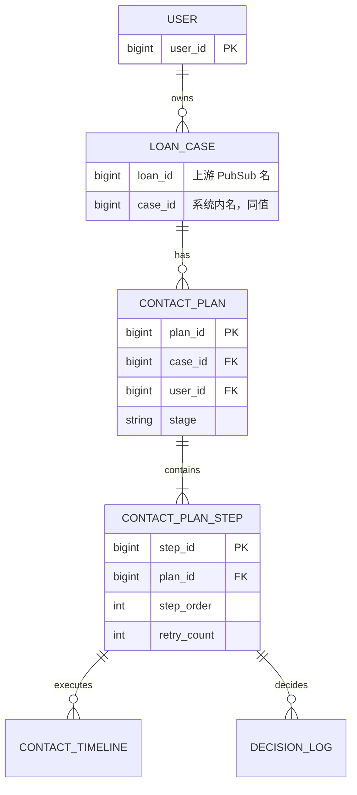

# MOCASA 催收系统升级 — Phase 1 领域模型与数据定义

> **版本**: Phase 1 · 仅覆盖菲律宾市场  
> **日期**: 2026-09-04  
> **状态**: ✅ 已确定（字段 / 枚举 / EventPayload SSOT）；DDL 权威在 [`../db/schema.sql`](../db/schema.sql)  
> **关联文档**: [架构设计文档](./MOCASA催收系统升级_Phase1_架构设计文档.md)、[核心引擎规格](./MOCASA催收系统升级_Phase1_核心引擎规格.md)、[基础设施交互规范](./MOCASA催收系统升级_Phase1_基础设施交互规范.md)、[数据接入规格](./MOCASA催收系统升级_Phase1_数据接入规格.md)、[契约对齐索引](./contracts/README.md)、[ContextSnapshot 契约对齐](./contracts/README_ContextSnapshot契约对齐.md)

---

## 目录

- [1. 概览与全局约定](#1-概览与全局约定)
  - [1.1 数据生命周期](#11-数据生命周期)
  - [1.2 表级契约矩阵](#12-表级契约矩阵)
  - [1.3 术语与对象分类](#13-术语与对象分类)
  - [1.4 命名·类型·序列化·关联键约定](#14-命名类型序列化关联键约定)
  - [1.5 聚合、身份与不变式](#15-聚合身份与不变式)
- [2. 枚举与常量定义](#2-枚举与常量定义)
  - [2.1 ChannelType](#21-channeltype渠道类型)
  - [2.2 ContactResult](#22-contactresult触达结果)
  - [2.3 PlanStatus](#23-planstatus触达计划状态)
  - [2.4 StepStatus](#24-stepstatus步骤执行状态)
  - [2.5 DecisionType](#25-decisiontype决策类型)
  - [2.6 EventType](#26-eventtype内部事件类型)
  - [2.7 CancelReason](#27-cancelreason计划取消原因)
  - [2.8 Stage](#28-stage催收阶段)
  - [2.9 ExhaustionAction](#29-exhaustionaction穷尽策略动作)
- [3. 持久化实体模型](#3-持久化实体模型)
  - [3.1 ContactPlan](#31-contactplan触达计划)
  - [3.2 ContactPlanStep](#32-contactplanstep触达计划步骤)
  - [3.3 DecisionLog](#33-decisionlog决策日志)
  - [3.4 ContactRecord](#34-contactrecord统一触达记录)
  - [3.5 CaseProjection](#35-caseprojection案件投影)
- [4. 决策上下文模型](#4-决策上下文模型)
  - [4.1 CaseContext](#41-casecontext案件上下文)
  - [4.2 UserProfile](#42-userprofile用户画像)
  - [4.3 ContactHistory](#43-contacthistory触达历史摘要)
  - [4.4 ContextSnapshot](#44-contextsnapshot决策上下文快照)
- [5. SPI 契约 DTO](#5-spi-契约-dto)
  - [5.1 CaseInfo](#51-caseinfo案件基本信息--spi-入参)
  - [5.2 ExecutionContext](#52-executioncontext执行上下文)
  - [5.3 GuardVerdict](#53-guardverdict守卫裁定)
  - [5.4 StepCommand](#54-stepcommand步骤命令)
  - [5.5 StepResult](#55-stepresult步骤结果)
  - [5.6 AdvancementDecision](#56-advancementdecision推进决策)
  - [5.7 ExhaustionResult](#57-exhaustionresult穷尽结果)
- [6. EventPayload 字段定义](#6-eventpayload-字段定义)
  - [6.1 信封与 payload 边界](#61-信封与-payload-边界)
  - [6.2 逐事件 payload 字段](#62-逐事件-payload-字段)
- [附录 A：DDL 例外与指针](#附录-addl-例外与指针)
- [附录 B：渠道编排层模型](#附录-b渠道编排层模型)
- [附录 C：变更记录](#附录-c变更记录)

---

## 1. 概览与全局约定

> 本文是 MOCASA 催收 Phase 1 的**领域数据契约 SSOT**——`collection-common` 中枚举、模型、DTO、EventPayload key 与引擎 DDL 的字段定义权威来源，供引擎 / 接入 / 渠道 / 服务四模块对齐。

### 1.1 数据生命周期
<a id="11-数据流全景图"></a>

案件与还款事实经 Pub/Sub 进入接入层，写入投影与收件箱后发布内部事件；引擎据此建计划并冻结决策快照，经 SPI 发出触达指令、收回结果，落时间线与决策日志。回调与调度信号只触发引擎重读已落盘状态。

| 阶段 | 数据 | 载体 | 详见 |
| --- | --- | --- | --- |
| 上游事实 | 案件快照 / 还款增量 | Pub/Sub JSON | [数仓契约](./数仓_PubSub交付契约.md)；消费见 [接入规格](./MOCASA催收系统升级_Phase1_数据接入规格.md) |
| 投影 | 运行时案件当前态 | `t_ai_collection` | [§3.5](#35-caseprojection案件投影)；收件箱见 [接入 §3.2](./MOCASA催收系统升级_Phase1_数据接入规格.md#32-投影写入inbox-与幂等) |
| 内部事件 | 入案 / 日切 / 还款 / 步骤到期 | EventPayload | [§6](#6-eventpayload-字段定义)；路由见 [引擎 §2](./MOCASA催收系统升级_Phase1_核心引擎规格.md#21-事件路由表ssot) |
| 计划与快照 | 阶段触达安排 + 冻结上下文 | `t_contact_plan` | [§3.1](#31-contactplan触达计划) / [§4](#4-决策上下文模型) |
| 指令与结果 | 渠道 / 地址 / 模板 → 结果枚举 | `StepCommand` / `StepResult` | [§5](#5-spi-契约-dto) |
| 记录 | 触达事实 / 决策审计 | `t_contact_timeline` / `t_decision_log` | [§3.4](#34-contactrecord统一触达记录) / [§3.3](#33-decisionlog决策日志) |

日切与 owner 对账见 [接入 §4](./MOCASA催收系统升级_Phase1_数据接入规格.md#4-dpd-日切)；事件传输见 [基础设施 §3](./MOCASA催收系统升级_Phase1_基础设施交互规范.md#3-事件总线redis-stream)；Nacos 模板不在主路径，见 [附录 B](#附录-b渠道编排层模型)。

### 1.2 表级契约矩阵

<a id="a11-t_contact_plan--触达计划主表"></a>
<a id="a12-t_contact_plan_step--触达计划步骤表"></a>
<a id="a13-t_decision_log--决策日志"></a>
<a id="a21-t_contact_timeline--统一触达时间线"></a>
<a id="a23-t_user_device_token"></a>
<a id="a3-现有表只读引用"></a>

> 标记描述 **Phase 1 对该表的数据库变更类型**，不是运行时业务状态。`schema.sql` 中 12 张 `CREATE TABLE` 各出现一行；字段语义列指向定义节，无字段节的表不进 §3。编排配置与外呼表见 [附录 B](#附录-b渠道编排层模型)。DDL 权威 [`../db/schema.sql`](../db/schema.sql)。

| 标记 | 含义 |
| --- | --- |
| **NEW** | Phase 1 新建表，DDL 在 `schema.sql` |
| **EXISTING** | 既有表（不在 `schema.sql`），Phase 1 只读、不做 DDL 变更 |
| **NACOS** | Phase 1 走 Nacos，不建表；见附录 B |

#### A. 引擎核心表 — Owner: collection-engine（主架构负责）

| 表名 | 状态 | 首席写入方 | 核心消费方 | 字段语义 | DDL |
| --- | --- | --- | --- | --- | --- |
| `t_contact_plan` | NEW | collection-engine | 调度扫描, 数仓 | [§3.1](#31-contactplan触达计划) | [`schema.sql`](../db/schema.sql) |
| `t_contact_plan_step` | NEW | collection-engine | 渠道编排(SPI 读取) | [§3.2](#32-contactplanstep触达计划步骤) | [`schema.sql`](../db/schema.sql) |
| `t_decision_log` | NEW | collection-engine | 数仓(决策效果分析) | [§3.3](#33-decisionlog决策日志) | [`schema.sql`](../db/schema.sql) |

#### B. 跨模块 / 服务层表

| 表名 | 状态 | Owner | 首席写入方 | 核心消费方 | 字段语义 | DDL |
| --- | --- | --- | --- | --- | --- | --- |
| `t_contact_timeline` | NEW | 跨模块共写 | channel(自动触达), 人工外呼, ingestion(ETL) | 决策引擎(聚合), 合规引擎(频率), 数仓(BI) | [§3.4](#34-contactrecord统一触达记录) | [`schema.sql`](../db/schema.sql) |
| `t_ai_collection` | NEW | ingestion | collection-ingestion | 引擎守卫、日切、管理查询；含 `owner` / `owner_date` | [§3.5](#35-caseprojection案件投影) | [`schema.sql`](../db/schema.sql) |
| `t_ai_collection_inbox` | NEW | ingestion | collection-ingestion | 入站幂等与 PENDING 补发；运维排障 | 无；行为见 [接入 §3.2](./MOCASA催收系统升级_Phase1_数据接入规格.md#32-投影写入inbox-与幂等) | [`schema.sql`](../db/schema.sql) |
| `t_ai_owner_reconcile` | NEW | ingestion | collection-ingestion | 当日 owner 对账水位；引擎/扫描只读 | 无；行为见 [接入 §4.1](./MOCASA催收系统升级_Phase1_数据接入规格.md#41-owner-对账) | [`schema.sql`](../db/schema.sql) |
| `t_user_device_token` | NEW | 数仓（日同步，**可选**） | 数仓 ETL（源 = 旧库 `t_user_extend`） | Phase 1 入案不消费 | 无 | [`schema.sql`](../db/schema.sql) |
| `t_email_suppression` | NEW | 主架构 / common | collection-admin（SendGrid Event Webhook） | ExecutionGuard | 无 | [`schema.sql`](../db/schema.sql) |
| `t_event_dlq` | NEW | 主架构 / common | collection-engine（事件总线） | 运维重放接口 `/ops/dlq/redrive` | 无（基础设施审计表，不进 §3） | [`schema.sql`](../db/schema.sql) |
| `t_event_outbox` | NEW | 主架构 / common | collection-engine（状态迁移所在事务） | `OutboxPublisher` 兜底重发（[引擎 §7.2](./MOCASA催收系统升级_Phase1_核心引擎规格.md#72-派生事件可靠投递)） | 无（基础设施审计表，不进 §3） | [`schema.sql`](../db/schema.sql) |
| `t_channel_callback_audit` | NEW | 主架构 / common | collection-admin（渠道 Webhook 入口） | 排障与渠道分析；**不计入 timeline 触达次数**（§3.4 注 4） | 无（基础设施审计表，不进 §3） | [`schema.sql`](../db/schema.sql) |

#### C. 现有表 — 只读引用（不在 `schema.sql`；Phase 1 不做 DDL 变更）

**Phase 1 实际读取**（守卫/日切/兜底经 CaseService·ProfileService；**入案快照主路径**为 `CASE_INGESTED` payload，见 [数据接入 §3.2](./MOCASA催收系统升级_Phase1_数据接入规格.md#32-投影写入inbox-与幂等)）：

| 表名 | 状态 | 引用位置 | 用途 |
| --- | --- | --- | --- |
| `t_collection` | EXISTING | 历史对账 | 旧案件主表；不在新系统运行时路径读取 |
| `t_user_repayment_plan` | EXISTING | §4.1 CaseContext | 还款计划，金额/日期来源 |
| `t_user_basis` | EXISTING | §4.2 UserProfile.BasicInfo | 用户基本信息（name/phone/email/language） |
| `t_user_equipment` | EXISTING | §4.2 UserProfile.DeviceInfo | 设备信息；Phase 1 入案不读（`jpushToken` 走 `caseEvent.device.pushToken`） |

**Phase 2 才引用**（UserProfile 维度 Phase 1 不填充，见 §4.2）：`t_user_work` / `t_user_telephone_book` / `t_system_property`。`t_user_profile_ext` Phase 1 不建表，见 [附录 A](#a22-t_user_profile_ext--用户画像扩展表phase-1-不建表押后-phase-2)。

### 1.3 术语与对象分类
<a id="13-对象关系与分类"></a>

先给出业务对象，再对照 Java 类与表。落库边界：**持久实体**独立落表；**快照**以 JSON 写入 `t_contact_plan.context_snapshot`；**瞬态 DTO** 不落库（`DecisionLog.input_snapshot` 仅审计副本）。分类表不含附录 B 编排内部模型。

| 术语 | 含义 | Java / 表 |
| --- | --- | --- |
| 案件 | 一笔贷款的催收对象 | `case_id` ≡ 上游 `loan_id`，不是旧库 `t_collection.id` |
| 投影 | 新系统运行时案件当前态 | `CaseProjection` / `t_ai_collection` |
| 计划 | 某案件在某阶段的一轮触达安排 | `ContactPlan` / `t_contact_plan` |
| 步骤 | 计划内一次渠道触达 | `ContactPlanStep` / `t_contact_plan_step` |
| 快照 | 建计划时冻结的决策上下文 | `ContextSnapshot`（JSON 列） |
| 时间线 | 统一触达事实 | `ContactRecord` / `t_contact_timeline` |
| 收件箱 | 入站事实已入库、领域事件是否已发 | `t_ai_collection_inbox` |
| 发件箱 | 引擎状态与派生事件同事务 | `t_event_outbox` |

**模型分类总览**（持久实体 / 快照 / 瞬态 DTO）

| 形态 | 对象 | 定义节 | 落库 | 触发事件 / 阶段 | 职责 |
| --- | --- | --- | --- | --- | --- |
| **持久实体** | CaseProjection | §3.5 | `t_ai_collection` | 接入消费 caseEvent / repaymentEvent 写入；日切只读 | 运行时案件当前态；`case_id` PK |
| **持久实体** | ContactPlan | §3.1 | `t_contact_plan` | `CASE_INGESTED` 创建；`REPAYMENT_RECEIVED` / `STAGE_CHANGED` / `CASE_CEASED` / `CASE_OWNER_RECONCILED` 取消；`PLAN_EXHAUSTED` 续建 | 状态机聚合根；`version` 乐观锁 |
| **持久实体** | ContactPlanStep | §3.2 | `t_contact_plan_step` | `PLAN_STEP_DUE` 执行；`STEP_COMPLETED` / `CHANNEL_CALLBACK` 推进 | 计划内单步；含 trigger/timeout 调度字段 |
| **持久实体** | DecisionLog | §3.3 | `t_decision_log` | **Phase 1 仅 ④ StepResolver 解析成功后**（step 级 `CHANNEL_SELECT`）；Guard/推进/穷尽决策 Phase 2 补记 | 决策审计；`input_snapshot` 存 ExecutionContext 副本 |
| **持久实体** | ContactRecord | §3.4 | `t_contact_timeline` | 渠道 dispatch / `CHANNEL_CALLBACK` / 合规拦截 | 统一触达记录；回调可升级 result |
| **快照** | CaseContext / UserProfile / ContactHistory | §4.1–§4.3 | 内嵌 `context_snapshot` JSON | 建计划时写入；阶段变更 / 续建时 carry-forward | 决策输入字段；无独立表 |
| **快照** | ContextSnapshot | §4.4 | `t_contact_plan.context_snapshot` | 同上；`CASE_BALANCE_UPDATED` 更新余额 | 快照根；策略字段固定，余额允许受控更新 |
| **瞬态 DTO** | CaseInfo | §5.1 | 否 | `PreFlightChecker`（步骤②）；`PlanFactory` / `ExhaustionPolicy` | 实时案件态（`repaid`）；与快照 CaseContext 语义不同 |
| **瞬态 DTO** | ExecutionContext | §5.2 | 否 | `PLAN_STEP_DUE` → 步骤执行 ③④⑤ | SPI 统一入参；含 snapshot + recentTimeline |
| **瞬态 DTO** | GuardVerdict | §5.3 | 否 | 步骤 ③ `ExecutionGuard.evaluate` | 合规裁定：放行 / 拦截原因 |
| **瞬态 DTO** | StepCommand / StepResult | §5.4–§5.5 | 否 | 步骤 ④⑤ `StepResolver` / `ChannelGateway` | 触达指令 ↔ 渠道执行结果 |
| **瞬态 DTO** | AdvancementDecision / ExhaustionResult | §5.6–§5.7 | 否 | `STEP_COMPLETED` 推进；`PLAN_EXHAUSTED` 续建 | 步骤推进三选一；穷尽后 REBUILD/ESCALATE/COMPLETE |

### 1.4 命名·类型·序列化·关联键约定

> **定位**：跨模块**字段级 checklist**，避免 §3–§6 各节重复。不定义：EventPayload key（§6）、渠道变量用法（contracts）、PubSub 上游字段映射（[数据接入规格](./MOCASA催收系统升级_Phase1_数据接入规格.md)）。

#### 命名与关联键


| 项            | 约定                                                                                                                     |
| ------------ | ---------------------------------------------------------------------------------------------------------------------- |
| Java ↔ DB 列名 | Java **camelCase** ↔ DB **snake_case**；MyBatis 开启 `map-underscore-to-camel-case: true`                                 |
| 表间关联         | `case_id` / `plan_id` / `step_id` / `user_id` 为**逻辑外键**；Phase 1 DDL **不设**物理 `FOREIGN KEY`                             |
| 物理库归属        | 引擎/服务新建表 → 新库 `collection_rebuild`；§1.2 C 区现有表 → 旧库只读（并行期），切量策略见 [数据接入 §5](./MOCASA催收系统升级_Phase1_数据接入规格.md#5-迁移与-replay) |


#### 类型映射（Java ↔ DB ↔ JSON）


| Java 类型                    | DB 列类型          | JSON 形态       | 约定                                                               |
| -------------------------- | --------------- | ------------- | ---------------------------------------------------------------- |
| `enum`（Stage/ChannelType…） | `VARCHAR`       | 字符串（`name()`） | MyBatis 默认 `EnumTypeHandler` 读写 `name()`；禁止 ordinal / 魔法字符串（§2）  |
| `LocalDateTime`            | `DATETIME`      | ISO-8601 字符串  | `LocalDateTime` 无时区；落库时刻由 JDBC 连接时区决定（Phase 1 连 `Asia/Manila`）   |
| `LocalDate`                | `DATE`          | ISO 日期串       | —                                                                |
| `BigDecimal`（金额）           | `DECIMAL(10,4)` | JSON 数值       | 金额 SSOT 见 [contracts](./contracts/README_ContextSnapshot契约对齐.md) |
| `Map` / 复杂对象               | `JSON`          | JSON 对象       | 如 `context_snapshot`、`output_decision`、`provider_callback`       |
| `List<子实体>`                | 独立子表            | —             | 如 `ContactPlan.steps` 落 `t_contact_plan_step`（内存态不占主表列）          |


#### 序列化边界（三条路径，勿混用）


| 路径               | 载体                                                      | 入口 / SSOT                                               | 字段规则                                                                                                                               |
| ---------------- | ------------------------------------------------------- | ------------------------------------------------------- | ---------------------------------------------------------------------------------------------------------------------------------- |
| **Model JSON 列** | `context_snapshot`、`input_snapshot`、`output_decision` 等 | `JsonUtil.toJson()` / `fromJson()`（**统一入口**，禁止模块自建序列化器） | 字段结构 / 不可变 / 布尔命名：[§4.4](#44-contextsnapshot决策上下文快照)；`null` vs `0`：[§4.3](#43-contacthistory触达历史摘要)；脱敏：[§4.2](#42-userprofile用户画像) |
| **EventPayload** | Redis Stream `Map<String,Object>`                       | `CollectionEvent` 常量 key                                | [§6](#6-eventpayload-字段定义) SSOT；**不走** model 序列化                                                                                   |
| **PubSub 入站**    | 信贷推送原始 JSON                                             | `CasePayloadMapper`                                     | [数据接入规格 §3.1](./MOCASA催收系统升级_Phase1_数据接入规格.md#31-消息路由与契约校验)；与 Model JSON 规则无关                                                        |


> **Model JSON 列补充**：MySQL `JSON` 列读回可能规范化键序/空格，断言**语义等价**即可（不按字节相等）。

### 1.5 聚合、身份与不变式
<a id="15-计划生命周期关联键"></a>

触达计划是状态机**聚合根**（`ContactPlan` / `t_contact_plan`），步骤是其内部实体。案件身份全链路是同一个数字 `case_id`（≡ 上游 `loan_id`），不是旧库 `t_collection.id`。行为见 [核心引擎规格 §4](./MOCASA催收系统升级_Phase1_核心引擎规格.md#4-计划生命周期与状态机)；接入 Redis 键见 [数据接入 §3.2](./MOCASA催收系统升级_Phase1_数据接入规格.md#32-投影写入inbox-与幂等)。快照寻址与金额用法见 [contracts](./contracts/README_ContextSnapshot契约对齐.md)。

**不变式**

| 项 | 约束 |
| --- | --- |
| 单活跃计划 | 同一 `caseId + stage` 同一时刻最多一个非终态计划；DDL `uk_active_stage_key`（`renewal_pending=1` 或终态不占键） |
| 身份 | **1 user : N loan(case)**；Phase 1 按 loan 粒度催收 |
| 投影单写 | 仅 ingestion 写 `t_ai_collection`；引擎不回写投影 |
| 快照 | 策略字段在计划存活期不变；`CASE_BALANCE_UPDATED` 可受控更新运行态金额；发送前内存覆盖见 [§4.4](#44-contextsnapshot决策上下文快照) |
| 乐观锁 | `t_contact_plan.version` 每次状态变更 +1 |

#### 实体关系



```mermaid
erDiagram
    USER ||--o{ LOAN_CASE : owns
    LOAN_CASE ||--o{ CONTACT_PLAN : has
    CONTACT_PLAN ||--|{ CONTACT_PLAN_STEP : contains
    CONTACT_PLAN_STEP ||--o{ CONTACT_TIMELINE : executes
    CONTACT_PLAN_STEP ||--o{ DECISION_LOG : decides

    USER {
        bigint user_id PK
    }
    LOAN_CASE {
        bigint loan_id "上游 PubSub 名"
        bigint case_id "系统内名，同值"
    }
    CONTACT_PLAN {
        bigint plan_id PK
        bigint case_id FK
        bigint user_id FK
        string stage
    }
    CONTACT_PLAN_STEP {
        bigint step_id PK
        bigint plan_id FK
        int step_order
        int retry_count
    }
```

#### 业务主键

| 出现位置 | 字段名 | 含义 |
|---|---|---|
| 数仓 PubSub | `caseId` | 两类 v3 单案事件的上游主键 |
| 领域事件 payload | `caseId` | 事件总线 SSOT |
| 新库表 | `case_id` | `t_contact_plan` / `t_contact_timeline` 等 |
| 案件投影 | `t_ai_collection.case_id` | 日切扫描、CaseService 查询 |

**同一笔 loan 全链路必须用同一数字标识**；**不是**旧库 `t_collection.id`（hex 行主键）。关系：**1 user : N loan(case)**；Phase 1 按 loan 粒度催收。

#### 计划与步骤

| 键 | 含义 | 关系 |
|---|---|---|
| `user_id` / `userId` | 用户标识 | 合规频控（日触达上限、接通即停）按 **user 维度** 统计 |
| `plan_id` | 一次触达计划实例（`t_contact_plan.id` 自增） | 1 case 可有多条 plan 历史；**同一 `case_id + stage` 同时最多 1 个非终态 plan** |
| `step_id` | 步骤行主键（DB 内部 ID） | 1 plan : N step |
| `step_order` | 计划内步骤序号（从 1 开始） | 幂等语义用 `step_order`，不用 `step_id` |
| `retry_count` | 当前步骤退避重试次数 | 与 `step_order` 共同构成步骤幂等维度 |

#### 幂等 / 去重键（分层，禁止混用）

| 键 | 格式 | 作用层 | 防什么 |
|---|---|---|---|
| `ingested:{loan_id}` | Redis | 接入 | 同催收周期重复 `CASE_INGESTED` |
| `dedup:stage:{loan_id}:{stage}:{date}` | Redis | 接入 | 日切重复 `STAGE_CHANGED` |
| `dedup:ceased:{loan_id}` | Redis | 接入 | 重复 `CASE_CEASED` |
| 计划创建 | `case_id:stage`（DB `active_stage_key`） | 引擎 | 同 case+stage 重复建 plan |
| 步骤幂等 | `{planId}:{stepOrder}:{retryCount}` | 引擎 + 渠道 | 同一步骤重复执行 / 重复触达 |
| `attempt_key` | 同上 | timeline | 同一次触达尝试只落一条最终事实 |
| `providerIdempotencyKey` | `{planId}:{stepOrder}` | 渠道 → 供应商 | 跨引擎重试稳定，供作供应商侧去重锚点（Phase 1 只建键，待编排接入） |
| `event_id` | 如 `STEP_COMPLETED:{planId}:{stepOrder}:{retryCount}` | 事件总线 + outbox | 派生事件去重、发件箱销账 |
| `collection:processed:{event_id}` | Redis | 引擎消费 | 同一事件信封重复消费 |
| `collection:lock:plan:{idempotencyKey}` | Redis | 引擎执行 | 并发重复执行同一步 |

#### 生命周期键流转

```
loan_id（上游）
  → caseId（接入 payload）
    → CASE_INGESTED / STAGE_CHANGED / REPAYMENT_RECEIVED / CASE_CEASED
      → plan_id（引擎建 plan，写入 case_id + user_id + stage）
        → step_id + step_order（预排步骤）
          → PLAN_STEP_DUE(planId, stepId)
            → idempotencyKey = planId:stepOrder:retryCount
              → timeline.attempt_key = 同上
              → STEP_COMPLETED eventId = STEP_COMPLETED:planId:stepOrder:retryCount
```

#### 各表键分布

| 表 | 主要关联键 |
|---|---|
| `t_contact_plan` | `plan_id`(PK), `case_id`, `user_id`, `stage`, `idempotency_key`, `renewal_pending` |
| `t_contact_plan_step` | `step_id`(PK), `plan_id`, `step_order`, `retry_count`, `idempotency_key` |
| `t_contact_timeline` | `case_id`, `user_id`, `plan_id`, `step_id`, `attempt_key`(UK) |
| `t_decision_log` | `case_id`, `plan_id`, `step_id` |
| `t_ai_collection` | `case_id`(PK), `user_id`, `owner`, `owner_date` |
| `t_ai_collection_inbox` | `event_id`(UK), `case_id` |
| `t_channel_callback_audit` | `plan_id`, `step_id`, `case_id`, `provider_msg_id` |
| `t_event_outbox` | `event_id`(UK), `plan_id`, `case_id` |

---

## 2. 枚举与常量定义

> **目的**：统一催收业务中的离散取值（渠道、计划状态、触达结果、事件类型等），作为引擎 / 接入 / 渠道 / 服务四模块的**共同语言**——落库、事件、SPI 均引用同一套枚举，避免各模块口径漂移。
> **实现**：`collection-common`（`com.collection.common.enums`）；禁止硬编码枚举字符串；已发布值不可删改，Phase 2 预留须在定义处标注。
>
> **列约定**：本章各节以「枚举值 + 含义」为契约核心；落库列、DPD 区间等**影响序列化/存储**的列保留；触发场景、引擎动作、实现方式等**行为语义**归 [核心引擎规格](./MOCASA催收系统升级_Phase1_核心引擎规格.md) / 渠道规格，不在此复述。
>
> **节首约定**：**Java** + **落库**（或 **载体** 若不落表）；落库列详见章首总览表，字段语义见 §3 字段表。

**枚举总览**


| 枚举                                                      | 用途           | 主要存储列                                                           |
| ------------------------------------------------------- | ------------ | --------------------------------------------------------------- |
| ChannelType                                             | 触达渠道类型       | `t_contact_timeline.channel`、`t_contact_plan_step.channel_type` |
| ContactResult                                           | 触达结果         | `t_contact_timeline.result`、`t_contact_plan_step.result`        |
| PlanStatus                                              | 计划状态机（6 态）   | `t_contact_plan.status`                                         |
| StepStatus                                              | 步骤执行状态       | `t_contact_plan_step.status`                                    |
| DecisionType                                            | SPI 决策类型     | `t_decision_log.decision_type`                                  |
| EventType                                               | 内部领域事件       | Redis Stream（路由见 [核心引擎规格 §2](./MOCASA催收系统升级_Phase1_核心引擎规格.md#21-事件路由表ssot)；payload 见 §6） |
| CancelReason                                            | 计划取消原因       | `t_contact_plan.cancel_reason`                                  |
| Stage                                                   | 催收阶段（DPD 映射） | `t_contact_plan.stage`                                          |
| ExhaustionAction                                        | 穷尽续建动作       | `ExhaustionResult.action`（§5.7）                                 |
| Direction / DataSource                                  | 触达记录元数据      | `t_contact_timeline.direction` / `.source`（§3.4）                  |
| PhoneValidity / SensitivityTag                          | 画像扩展（Phase 2） | 附录 A.2.2；Phase 1 不落表，`UserProfile` 结构预留（§4.2）                 |


### 2.1 ChannelType（渠道类型）

> **Java**：`com.collection.common.enums.ChannelType`  
> **落库**：见章首总览（§3.1 / §3.2 / §3.4 字段表）


| 枚举值     | 显示名      | 供应商                                                                                                                                                           |
| ------- | -------- | ------------------------------------------------------------------------------------------------------------------------------------------------------------- |
| PUSH    | App 推送   | —（经内部通知中心异步入队，无独立供应商）                                                                                                                                         |
| SMS     | 短信       | 内部通知中心（具体短信通道由通知中心路由）                                                                                                                                         |
| AI_CALL | AI 机器人外呼 | **独立 AI Call 合作方**（该合作方底层复用哪条拨号线路对引擎不可见；不等同于 LTH）                                                                                                          |
| EMAIL   | 邮件       | SendGrid（[渠道总规格](./channel/MOCASA催收系统升级_Phase1_collection-channel总规格.md)、[SendGrid 对接说明](./channel/MOCASA催收系统升级_Phase1_SendGrid_Email对接说明.md)；Phase 1 无备用供应商） |


> **Phase 1 不生成 plan step**：`VIBER` / `WHATSAPP`（Phase 2 接入）；`TTS` / `HUMAN_CALL`（域外，LTH 现网独立编排，[架构 ADR](./MOCASA催收系统升级_Phase1_架构设计文档.md#附录-a架构决策记录-adr)）。消息类/电话类分流见 [核心引擎规格 §5](./MOCASA催收系统升级_Phase1_核心引擎规格.md#5-步骤执行管线)（`isMessageChannel` / `isAsyncChannel`）。

### 2.2 ContactResult（触达结果）

> **Java**：`com.collection.common.enums.ContactResult`  
> **落库**：见章首总览（§3.2 / §3.4 字段表）
>
> 下列为**同一枚举**按 Phase 1 **结果来源**分组（4 组小表 = 4 类产生方式，**不是** 4 列返回值）。Phase 1 活跃渠道：SMS / PUSH / EMAIL / AI_CALL。

**PUSH / EMAIL — 同步派发**（无观察期）


| 枚举值       | 含义                      |
| --------- | ----------------------- |
| DELIVERED | 通知中心 / SendGrid 受理或入队成功 |
| FAILED    | API 失败、重试耗尽等            |


**SMS — 同步派发**（Phase 1 与 PUSH/EMAIL 相同：`dispatch` 成功即完成，不进 `STEP_WAITING`）


| 枚举值       | 含义        |
| --------- | --------- |
| DELIVERED | 通知中心受理成功  |
| FAILED    | 同步派发失败    |


**AI_CALL — 话单回调**（`CHANNEL_CALLBACK` 完成步骤）


| 枚举值       | 含义    |
| --------- | ----- |
| ANSWERED  | 电话已接通 |
| NO_ANSWER | 电话未接听 |
| BUSY      | 忙线    |


**Email — SendGrid 二次事件**（仅升级 timeline，不完成 step；详见 [SendGrid §5](./channel/MOCASA催收系统升级_Phase1_SendGrid_Email对接说明.md)）


| 枚举值      | 含义              |
| -------- | --------------- |
| READ     | 打开邮件            |
| CLICKED  | 点击链接            |
| REJECTED | 退订 / 硬退信 / 举报垃圾 |


> 退订：Webhook 异步写入 `REJECTED` 后 Guard 拦截后续 Email。空邮箱、空手机号、且 Push 无 token 与可回退手机号时，均由 Guard 先返回 `COMPLIANCE_BLOCKED`；不会进入 `StepResolver`。

**系统内部 / Phase 2 预留**


| 枚举值                | 含义    | 写 timeline | 说明                        |
| ------------------ | ----- | ---------- | ------------------------- |
| COMPLIANCE_BLOCKED | 合规拦截  | 是          | 含频控、空地址等                  |
| SKIPPED            | 策略性主动跳过  | **否**      | 仅 `StepResolver` 正常返回 `null`（如非里程碑槽位） |
| CHANNEL_DOWN       | 渠道不可用 | **否**      | 健康检查失败                    |
| REPLIED            | 用户回复  | 是          | Phase 2（VIBER / WHATSAPP） |


> **step 与 timeline**：空地址/频控等 Guard 拦截为 `COMPLIANCE_BLOCKED`，由引擎写 timeline 后推进；策略性 `SKIPPED` 不写 timeline、仍推进。其余写入 `ContactResult` 时默认同时推进 plan step 并写 timeline。例外是 SendGrid Webhook 仅更新 `t_contact_timeline.result`（Email 的 READ/CLICKED/REJECTED，不推进 step）。Email result 只升不降：`DELIVERED` → `READ` → `CLICKED`。

### 2.3 PlanStatus（触达计划状态）

> **Java**：`com.collection.common.enums.PlanStatus`  
> **落库**：`t_contact_plan.status`（§3.1）

计划级状态机共 **6 态**（4 非终态 + 2 终态）：


| 枚举值                | 含义                               |
| ------------------ | -------------------------------- |
| PENDING            | 计划刚创建，尚未执行任何步骤，等待首步 trigger_time |
| STEP_SCHEDULED     | 上一步已结束，下一步 Job 已注册，等待到期          |
| STEP_EXECUTING     | 当前步骤执行中。Phase 1 的 AI_CALL 在此态等 Webhook，不是观察期（[核心引擎 §4.1](./MOCASA催收系统升级_Phase1_核心引擎规格.md#41-状态定义)） |
| STEP_WAITING       | 消息已发出、观察期内等用户响应；Phase 1 不进入（同上） |
| **PLAN_COMPLETED** | 终态：本计划收口。仍在催时步骤走完须经穷尽（[核心引擎 §4.3.2](./MOCASA催收系统升级_Phase1_核心引擎规格.md#432-step_completed) / [§4.5](./MOCASA催收系统升级_Phase1_核心引擎规格.md#45-穷尽续建)），不在此直接停催 |
| **PLAN_CANCELLED** | 终态：中断取消（`cancel_reason`）        |


> `PLAN_EXHAUSTED` 是 `EventType`，不是 `PlanStatus`（见 [核心引擎规格 §2](./MOCASA催收系统升级_Phase1_核心引擎规格.md#21-事件路由表ssot)）。

### 2.4 StepStatus（步骤执行状态）

> **Java**：`com.collection.common.enums.StepStatus`  
> **落库**：`t_contact_plan_step.status`（§3.2）


| 枚举值       | 含义                  |
| --------- | ------------------- |
| PENDING   | 步骤尚未执行              |
| EXECUTING | 步骤执行中               |
| COMPLETED | 步骤正常完成              |
| SKIPPED   | 步骤被跳过（合规拦截 / 渠道不可用） |
| FAILED    | 步骤失败（渠道发送失败，重试耗尽）   |


### 2.5 DecisionType（决策类型）

> **Java**：`com.collection.common.enums.DecisionType`  
> **落库**：`t_decision_log.decision_type`（§3.3）


| 枚举值            | 含义              |
| -------------- | --------------- |
| CHANNEL_SELECT | 渠道选择：决定使用哪个渠道触达 |
| SCRIPT_SELECT  | 话术选择：决定使用哪个话术组  |
| TIMING         | 触达时间：决定最佳触达时间   |

> SPI 调用时机与实现见 [核心引擎规格 §5](./MOCASA催收系统升级_Phase1_核心引擎规格.md#5-步骤执行管线)。Phase 1 合规默认允许触达窗口为 **08:00–21:00 PHT**，由 `ExecutionGuard` 按 Nacos 配置执行；`TIMING` 不得绕过该 Guard。
>
> **Phase 2 预留**：`ASSIGNMENT`、`CHANNEL_MODE_SELECT`（枚举保留，Phase 1 不写 `t_decision_log`）。


### 2.6 EventType（内部事件类型）

> **Java**：`com.collection.common.enums.EventType`  
> **载体**：Redis Stream（路由 [核心引擎规格 §2](./MOCASA催收系统升级_Phase1_核心引擎规格.md#21-事件路由表ssot)；payload §6；信封 [基础设施 §3](./MOCASA催收系统升级_Phase1_基础设施交互规范.md#3-事件总线redis-stream)）

| 枚举值 | Phase 1 状态 | 说明 |
| --- | --- | --- |
| CASE_INGESTED | 活跃 | 03:35 owner 对账后的首次进入 NEW 或再入建计划；`caseEvent` 到达时不发 |
| CASE_OWNER_RECONCILED | 活跃 | 缺席迁出：payload `ownerAction=LEAVE`，引擎取消计划 |
| STAGE_CHANGED | 活跃 | 日切变更或引擎升档 |
| REPAYMENT_RECEIVED | 活跃 | 整笔 loan 全额结清：取消该案件活跃计划 |
| CASE_BALANCE_UPDATED | 活跃 | 部分还款：只刷新活跃计划快照余额，不改状态与模板 |
| PLAN_STEP_DUE | 活跃 | 调度触发步骤 |
| CHANNEL_CALLBACK | 活跃 | AI_CALL 回调 |
| CALLBACK_TIMEOUT | 活跃 | AI_CALL 回调超时哨兵 |
| STEP_COMPLETED | 活跃 | 步骤完成后推进 |
| PLAN_EXHAUSTED | 活跃 | 计划穷尽后续建决策 |
| CASE_CEASED | 活跃 | DPD≥91 停催 |
| PTP_EXPIRED | Phase 2 预留 | Phase 1 不生产、不消费 |

### 2.7 CancelReason（计划取消原因）

> **Java**：`com.collection.common.enums.CancelReason`  
> **落库**：`t_contact_plan.cancel_reason`（§3.1）


| 枚举值           | 含义                            |
| ------------- | ----------------------------- |
| REPAID        | 用户已还款                          |
| STAGE_UPGRADE | 阶段变更：取消旧 stage 计划并新建（与模板是否相同无关，见 [核心引擎规格 §4.4](./MOCASA催收系统升级_Phase1_核心引擎规格.md#44-中断处理)） |
| CEASED        | Max DPD ≥91 完全停催（CASE_CEASED） |
| CASE_NOT_FOUND | 实时 PreFlight 未找到案件，终结孤儿计划且不记录触达 |
| NO_DUE_BALANCE | 当前无已到期应还余额；阻断零金额催收文案，后续日切可按新快照重建 |
| ROUTED_TO_LEGACY | 当日 NEW 批次缺席，对账后迁出；案件仍可能在旧系统在催 |


> Phase 1 上表六值均由引擎写入（`CancelReason.isEngineManaged()=true`）。
>
> **非引擎写入**：`COMPLAINT`（投诉终态取消，Phase 2 预留）、`MANUAL`（管理后台人工取消，Phase 2 预留）、`MANUAL_CLEANUP`（运维人工清理测试计划，不经事件总线）、`PTP_EXPIRED`（PTP 到期未还款，Phase 2 预留）。

### 2.8 Stage（催收阶段）

> **Java**：`com.collection.common.enums.Stage`  
> **落库**：`t_contact_plan.stage`（§3.1）


| 枚举值 | DPD 范围      | 说明            |
| --- | ----------- | ------------- |
| S0  | D-3 ~ D0    | Pre-Due 到期前提醒 |
| S1  | D+1 ~ D+3   | Early 早期催收    |
| S2  | D+4 ~ D+15  | Mid 中期        |
| S3  | D+16 ~ D+30 | Late 晚期       |
| S4  | D+31+       | Extended 延长期  |


> **D+91 停催不属于 Stage 概念**：由 `PlanFactory.shouldRejectPlan` / ingestion 日切独立处理（发 `CASE_CEASED` 事件，[核心引擎规格 §2](./MOCASA催收系统升级_Phase1_核心引擎规格.md#21-事件路由表ssot)），Stage 不感知。
>
> ⚠️ 上表区间为代码默认值；若后续改为从 `t_contact_plan_template` 配置读取，需同步 `Stage.java`（**代码待跟进**，本次仅文档对齐代码现状）。

### 2.9 ExhaustionAction（穷尽策略动作）

> **Java**：`com.collection.common.enums.ExhaustionAction`  
> **载体**：`ExhaustionResult.action`（§5.7，不落表）


| 枚举值      | 含义                           |
| -------- | ---------------------------- |
| REBUILD  | 同阶段立即续建：创建新一轮计划，继续触达         |
| ESCALATE | 升档：当前阶段触达手段已穷尽，提升催收强度        |
| COMPLETE | 停止：不再主动触达，等待用户自主还款或 DPD 自然越阶 |


> `REBUILD` 续建次数上限见配置项 `engine.plan.max_rebuild_count`（引擎规格 §4.5）。

---

## 3. 持久化实体模型

本章定义**落表持久实体**。§3.1–§3.4 由状态机与时间线读写；§3.5 为接入投影（运行时案件当前态）。

> **节首约定**：**Java** + **表** + DDL 指针 + **用途**；枚举取值见 §2，运行时行为见 §1.3 / 核心引擎规格。

### 3.1 ContactPlan（触达计划）

> **Java**：`com.collection.common.model.ContactPlan`  
> **表**：`t_contact_plan` · DDL [`schema.sql`](../db/schema.sql)  
> **用途**：状态机聚合根，描述一个案件在某阶段的完整触达计划。


| 字段              | Java 类型             | DB 列             | 必填  | 说明                                                                                                   |
| --------------- | ------------------- | ---------------- | --- | ---------------------------------------------------------------------------------------------------- |
| id              | Long                | id               | 是   | 计划 ID                                                                                                |
| caseId          | Long                | case_id          | 是   | 关联案件 ID                                                                                              |
| userId          | Long                | user_id          | 是   | 用户 ID                                                                                                |
| stage           | Stage               | stage            | 是   | 催收阶段（枚举 §2.8）                                                                                        |
| planTemplateId  | Long                | plan_template_id | 否   | 触达计划模板 ID                                                                                            |
| status          | PlanStatus          | status           | 是   | 计划状态（枚举 §2.3）                                                                                        |
| currentStep     | int                 | current_step     | 是   | 当前执行到第几步（从 0 开始）                                                                                     |
| totalSteps      | int                 | total_steps      | 是   | 总步数                                                                                                  |
| cancelReason    | CancelReason        | cancel_reason    | 否   | 取消原因（枚举 §2.7，仅终态 PLAN_CANCELLED 时有值）                                                                 |
| contextSnapshot | String              | context_snapshot | 否   | 决策上下文快照（§4.4 ContextSnapshot 的 JSON 序列化字符串；DB 列类型 JSON）                                              |
| idempotencyKey  | String              | idempotency_key  | 否   | 计划创建幂等键（`case_id:stage:create_timestamp`），防止事件重投导致重复创建计划。若架构使用 UNIQUE 约束替代则可降为预留                     |
| renewalPending  | boolean             | renewal_pending  | 是   | REBUILD 同一事务内旧计划的短暂过渡标记：置 1 后不再参与活跃计划唯一约束/调度，插入新计划后旧计划立即终态化；事务失败整体回滚。                                               |
| version         | int                 | version          | 是   | 乐观锁版本号，每次状态变更 +1                                                                                     |
| startedAt       | LocalDateTime       | started_at       | 否   | 计划开始执行时间。引擎写入时机：首步进入 EXECUTING 时（`IF plan.startedAt IS NULL THEN SET`）                               |
| completedAt     | LocalDateTime       | completed_at     | 否   | 计划完成时间。引擎写入时机：计划进入终态（PLAN_COMPLETED / PLAN_CANCELLED）时 SET                                           |
| createdAt       | LocalDateTime       | created_at       | 是   | 创建时间                                                                                                 |
| updatedAt       | LocalDateTime       | updated_at       | 是   | 最后更新时间                                                                                               |
| steps           | ListContactPlanStep | （无）              | —   | **仅内存态**：计划创建、ExecutionContext 组装时持有的步骤序列，不对应 `t_contact_plan` 单表列；持久化时落 `t_contact_plan_step`（§3.2） |


> **单活跃计划约束**见 [§1.5](#15-聚合身份与不变式)；创建行为见 [核心引擎规格 §4.2](./MOCASA催收系统升级_Phase1_核心引擎规格.md#42-计划创建)。

### 3.2 ContactPlanStep（触达计划步骤）

> **Java**：`com.collection.common.model.ContactPlanStep`  
> **表**：`t_contact_plan_step` · DDL [`schema.sql`](../db/schema.sql)  
> **用途**：计划内单步执行单元，含调度（trigger/timeout）与步骤状态。


| 字段                 | Java 类型       | DB 列                | 必填  | 说明                                                         |
| ------------------ | ------------- | ------------------- | --- | ---------------------------------------------------------- |
| id                 | Long          | id                  | 是   | 步骤 ID                                                      |
| planId             | Long          | plan_id             | 是   | 关联触达计划 ID                                                  |
| stepOrder          | int           | step_order          | 是   | 步骤序号（从 1 开始）                                               |
| channelType        | ChannelType   | channel_type        | 是   | 渠道类型（枚举 §2.1）                                              |
| templateId         | Long          | template_id         | 否   | 话术模板 ID                                                    |
| delayMinutes       | int           | delay_minutes       | 是   | 扁平模板回退的相对延迟（分钟）；DayBlock 绝对槽位步骤为 0                       |
| triggerTime        | LocalDateTime | trigger_time        | 否   | **待触发**的 PHT 绝对时间；DayBlock 由 PlanFactory 写入，扁平模板由引擎回退计算。被扫描拾取后置空、退避重试与 Guard defer 会改写，**不可用于排期分析** |
| originalTriggerTime | LocalDateTime | original_trigger_time | 否   | 建计划时的原始排期，仅插入时写入、永不更新。与 `t_contact_timeline.created_at` 对比即得「计划 vs 实际」偏差 |
| timeoutTime        | LocalDateTime | timeout_time        | 否   | 异步回调超时时间（由引擎在执行时写入）                                        |
| triggerCondition   | String        | trigger_condition   | 否   | 前置条件表达式（如"前一步未响应"）。**Phase 1 未启用**，引擎不求值；预留 Phase 2 条件跳过逻辑 |
| status             | StepStatus    | status              | 是   | 步骤状态（枚举 §2.4）                                              |
| observationMinutes | int           | observation_minutes | 是   | 观察期（分钟），0=无观察期                                             |
| retryCount         | int           | retry_count         | 是   | 已重试次数                                                      |
| result             | ContactResult | result              | 否   | 步骤最终结果（枚举 §2.2）                                            |
| idempotencyKey     | String        | idempotency_key     | 否   | 步骤幂等键，由引擎生成（口径见下方说明）                                       |
| executedAt         | LocalDateTime | executed_at         | 否   | 引擎开始尝试的时间                                                  |
| dispatchedAt       | LocalDateTime | dispatched_at       | 否   | 渠道受理时间（供应商已接单），仅记首次。与 `executedAt` 的差值区分「卡在调用前」与「已发出未回写」 |
| completedAt        | LocalDateTime | completed_at        | 否   | 步骤完成时间                                                     |
| createdAt          | LocalDateTime | created_at          | 是   | 创建时间                                                       |
| updatedAt          | LocalDateTime | updated_at          | 是   | 最后更新时间                                                     |


> **幂等键**：统一格式 `{planId}:{stepOrder}:{retryCount}`，同一个值在两处去重：
>
> - **引擎侧**——消费 `PLAN_STEP_DUE` 时拦截重复事件，避免同一步骤被执行两次（`StepExecutionOrchestrator.buildIdempotencyKey`）。
> - **渠道侧**——透传为 `StepCommand.idempotencyKey`（§5.4），渠道层 dispatch 去重（`DefaultStepResolver`）。
>
> 供应商侧去重用另一个键 `StepCommand.providerIdempotencyKey` = `{planId}:{stepOrder}`（不含 `retryCount`，跨引擎重试稳定）。两者不可互换：含 `retryCount` 的键在重试时必变，无法作为供应商去重锚点。
>
> 键里含 `retryCount` 是为了让每次重试（`retryCount+1`）生成新键，从而不被上一次的幂等记录拦住。口径已与代码、`contracts/README`、`.cursor/rules/ic-v1-channel-contract.mdc` 对齐（2026-06-17；旧写法 `…:attempt` 的 `attempt` 即 `retryCount`）。详见审计 K3。

### 3.3 DecisionLog（决策日志）

> **Java**：`com.collection.common.model.DecisionLog`  
> **表**：`t_decision_log` · DDL [`schema.sql`](../db/schema.sql)  
> **用途**：SPI 决策审计；引擎只写不读，供数仓分析与 Phase 2 模型训练。
> **Phase 1 落库范围**：仅 ④ `StepResolver` 解析成功后写一条 step 级记录（`decision_type=CHANNEL_SELECT`、`engine_type=RULE`、`confidence=1.0`），`fail-open` 事务外写不阻断触达；③ Guard 拦截率走 `t_contact_timeline`，推进/穷尽决策 Phase 2 再补记。


| 字段             | Java 类型       | DB 列            | 必填  | 说明                                                 |
| -------------- | ------------- | --------------- | --- | -------------------------------------------------- |
| id             | Long          | id              | 是   | 日志 ID                                              |
| caseId         | Long          | case_id         | 是   | 关联案件 ID                                            |
| planId         | Long          | plan_id         | 否   | 关联触达计划 ID（步骤级决策时有值；计划创建前为 null）        |
| stepId         | Long          | step_id         | 否   | 关联触达计划步骤 ID（步骤级决策时有值；计划级决策为 null）                  |
| decisionType   | DecisionType  | decision_type   | 是   | 决策类型（枚举 §2.5）                                      |
| engineType     | String        | engine_type     | 是   | 引擎类型：RULE 或 LLM                                    |
| engineVersion  | String        | engine_version  | 否   | Phase 1："rule-v{规则最后修改时间戳}"；Phase 2：LLM 模型版本       |
| inputSnapshot  | String        | input_snapshot  | 是   | 决策输入快照（ExecutionContext 的 JSON 序列化字符串；DB 列类型 JSON） |
| outputDecision | String        | output_decision | 是   | 决策结果（decision 字符串 + metadata；DB 列类型 JSON）          |
| reasoning      | String        | reasoning       | 否   | Phase 1：命中规则描述；Phase 2：LLM Chain of Thought        |
| confidence     | double        | confidence      | 是   | Phase 1 固定 1.0；Phase 2 由 LLM 输出                    |
| latencyMs      | Integer       | latency_ms      | 否   | SPI 调用耗时（毫秒）                                       |
| createdAt      | LocalDateTime | created_at      | 是   | 写入时间                                               |


---

### 3.4 ContactRecord（统一触达记录）

> **Java**：`com.collection.common.model.ContactRecord`  
> **表**：`t_contact_timeline` · DDL [`schema.sql`](../db/schema.sql)  
> **用途**：统一触达时间线；系统触达、ETL 迁移、回调升级共写此模型。


| 字段               | 类型            | 必填  | 取值约定                                                            |
| ---------------- | ------------- | --- | --------------------------------------------------------------- |
| id               | Long          | 否   | 记录 ID（DB 自增，写入前为 null）                                          |
| caseId           | Long          | 是   | 关联案件 ID                                                         |
| userId           | Long          | 是   | 用户 ID                                                           |
| planId           | Long          | 否   | 关联触达计划 ID。历史迁移数据（source=ETL_SYNC）无计划 ID，传 null                  |
| stepId           | Long          | 否   | 关联步骤 ID。人工渠道的坐席录入和历史迁移数据无步骤 ID                                  |
| attemptKey       | String        | 否   | 系统触达为 `planId:stepOrder:retryCount`，唯一约束确保每次尝试仅一条最终事实；迁移/人工记录可为 null |
| channel          | ChannelType   | 是   | 渠道枚举                                                            |
| direction        | Direction     | 是   | OUT=系统发出，IN=用户响应（如用户回复 Viber 消息）                                |
| templateId       | Long          | 否   | 使用的话术模板 ID                                                      |
| configVersion    | Long          | 否   | DB 模板的发布配置版本；YAML/Nacos 回退时为 0                                |
| renderedRef      | String        | 否   | `channel:scriptSlot@templateVersion` 形式的无 PII 定位引用                    |
| contentSummary   | String        | 否   | 可选脱敏结构化摘要，≤500 字符。Phase 1 不落 SMS/Email 正文或变量值；未经过命令解析的记录可为 null |
| scriptSlot       | String        | 否   | 已解析的话术槽位；不含用户变量或正文                                            |
| templateVersion  | String        | 否   | 模板来源与发布版本；DB 模板为 `db:<config_version>`，Nacos/YAML 为 `nacos:<releaseVersion>` |
| contentHmac      | String        | 否   | 最终渲染内容的 HMAC-SHA-256，仅用于完整性核验，不可逆推正文                       |
| contentKeyId     | String        | 否   | 生成 `contentHmac` 的非秘密密钥版本；支持密钥轮换后的历史验证                       |
| result           | ContactResult | 否   | 触达结果枚举。初次写入时可能为 null（如 SMS 发出但未收到回执），后续回调更新                     |
| providerMsgId    | String        | 否   | 供应商消息 ID，用于回调关联和去重                                              |
| providerCallback | String        | 否   | 供应商回调原始 JSON（调试用）                                               |
| cost             | BigDecimal    | 否   | 单次触达成本（如有）                                                      |
| source           | DataSource    | 是   | SYSTEM=系统实时触达；ETL_SYNC=历史数据迁移；PUBSUB_SYNC=过渡期增量同步               |
| createdAt        | LocalDateTime | 否   | 写入时间（DB 列 created_at，默认 CURRENT_TIMESTAMP）                      |


> **写入规则**：  
>
> 1. 合规拦截的触达**也写入** `t_contact_timeline`，result=COMPLIANCE_BLOCKED，用于形成完整的用户接触全貌（同时写入 `t_compliance_violation` 记录详情）。
> 2. 渠道发送失败（重试耗尽）写入 `t_contact_timeline`，result=FAILED。
> 3. 同一次触达尝试以 attemptKey 幂等：重复回调更新 result/providerMsgId/providerCallback，不新增记录。不同 step 或 retryCount 是不同尝试，分别保留。
> 4. 供应商原始回调序列写 `t_channel_callback_audit`，不作为 timeline 触达次数，供排障和渠道分析。

---

### 3.5 CaseProjection（案件投影）

> **Java**：`com.collection.common.model.CaseProjection`  
> **表**：`t_ai_collection` · DDL [`schema.sql`](../db/schema.sql)  
> **用途**：新系统运行时唯一案件当前态；引擎与日切不回读旧 `t_collection`。列以 `schema.sql` 为准；写入规则见 [接入规格](./MOCASA催收系统升级_Phase1_数据接入规格.md)，上游字段映射见 [数仓契约](./数仓_PubSub交付契约.md)。

| 字段 | Java 类型 | DB 列 | 必填 | 说明 |
| --- | --- | --- | --- | --- |
| caseId | Long | case_id | 是 | PK；≡ 上游 `loan_id` |
| userId | Long | user_id | 是 | 用户 ID |
| caseVersion | String | case_version | 是 | 数仓快照内容指纹；相同略过业务列、不同刷新；指纹相同仍刷新 `owner_date` |
| dpd | Integer | dpd | 是 | 逾期天数；接入不重算 |
| stage | String | stage | 否 | S0–S4；D+91 可为空 |
| collectionStatus | String | collection_status | 是 | 接入派生：`isFullCleared` 优先 → `SETTLED`，否则 `dpd>=91` → `CEASED`，否则 `IN_COLLECTION`；不信任外部同名字段 |
| product | String | product | 是 | 贷款产品标识 |
| overdueAmount | BigDecimal | overdue_amount | 是 | 已到期未结清总额，含罚息 |
| totalOutstanding | BigDecimal | total_outstanding | 是 | 已到期且未结清，对客金额（与 `overdue_amount` 同口径） |
| penaltyAmount | BigDecimal | penalty_amount | 是 | 罚息 |
| remainingAmount | BigDecimal | remaining_amount | 是 | 废弃历史列，不再表示全部未结清 |
| upcomingAmount | BigDecimal | upcoming_amount | 否 | 三期下一期 D-3～D0 待还金额 |
| dueDate | LocalDate | due_date | 否 | 历史兼容到期日；新契约非全面必填 |
| nextDueDate | LocalDate | next_due_date | 否 | 与 `upcomingAmount` 成对的下一期还款日 |
| borrowerName | String | borrower_name | 是 | 借款人姓名 |
| borrowerPhone | String | borrower_phone | 是 | E.164 |
| borrowerEmail | String | borrower_email | 否 | 空不阻断入案 |
| borrowerLanguage | String | borrower_language | 是 | 默认 `en` |
| pushToken | String | push_token | 否 | JPush；空则 Push fallback SMS，不回查 token 表 |
| owner | String | owner | 是 | 发给本系统的案件固定 `NEW` |
| ownerDate | LocalDate | owner_date | 否 | PHT 归属日，`date(occurredAt)`；还款不得刷新 |
| updatedAt | LocalDateTime | updated_at | 是 | 数仓快照业务更新时间（消息 `occurredAt`） |
| syncedAt | LocalDateTime | synced_at | 是 | 接入层投影落库时间 |

> 内存合并标志 `stagePresent` / `nextDueDatePresent` 不是表列，见接入规格。`repaymentEvent` 合并运行态、不改 `owner_date`。

---

## 4. 决策上下文模型

本章定义 ContextSnapshot 及其组成模型的**字段结构**（Java model SSOT）。**Phase 1 入案主路径**：引擎消费 `CASE_INGESTED` 时将 payload 组装为不可变快照写入 `t_contact_plan.context_snapshot`（[核心引擎规格 §4.2](./MOCASA催收系统升级_Phase1_核心引擎规格.md#42-计划创建)）；`CaseService`/`ProfileService` 聚合逻辑用于守卫实时查库、日切与可选兜底，见 [数据接入 §3.2](./MOCASA催收系统升级_Phase1_数据接入规格.md#32-投影写入inbox-与幂等)。

> **节首约定**：**Java** + **落库**（内嵌 `context_snapshot` JSON 或运行时聚合）+ **用途**；字段「来源」列保留在字段表内。

### 4.1 CaseContext（案件上下文）

> **Java**：`com.collection.common.model.CaseContext`  
> **落库**：内嵌 `ContextSnapshot.caseContext`（§4.4 → `t_contact_plan.context_snapshot`）  
> **用途**：案件决策视图；`CaseService.buildContext(caseId)` 亦可运行时聚合。


| 字段               | 类型         | 必填  | 说明                                                                                                           | 来源                        |
| ---------------- | ---------- | --- | ------------------------------------------------------------------------------------------------------------ | ------------------------- |
| caseId           | Long       | 是   | 信贷业务贷款标识；全链路等同 `loan_id`，**不是**旧库 hex 行主键 `t_collection.id`                              | t_collection.loan_id / CASE_INGESTED payload |
| userId           | Long       | 是   | 用户ID                                                                                                         | t_collection.user_id      |
| dpd              | int        | 是   | 逾期天数（D-3 起为负数，D0=0，D+1=1）                                                                                    | t_collection.overdue_day  |
| stage            | Stage      | 是   | 当前催收阶段                                                                                                       | 由 DPD 计算                  |
| product          | String     | 是   | 贷款产品标识                                                                                                       | t_collection.product_code |
| loanAmount       | BigDecimal | 是   | 贷款金额                                                                                                         | t_user_repayment_plan     |
| overdueAmount    | BigDecimal | 是   | 逾期待还金额（本金+利息）                                                                                                | t_user_repayment_plan 计算  |
| penaltyAmount    | BigDecimal | 是   | 罚息金额                                                                                                         | t_user_repayment_plan 计算  |
| totalOutstanding | BigDecimal | 是   | 已到期未结清金额（直接映射数仓 `overdueAmount`，该字段已含罚息）                                                                         | caseEvent / repaymentEvent |
| loanTerms        | int        | 否   | 贷款期数                                                                                                         | t_user_repayment_plan     |
| disbursementDate | LocalDate  | 否   | 放款日期                                                                                                         | t_collection              |
| dueDate          | LocalDate  | 否   | 历史兼容到期日；不再由新 Pub/Sub 契约全面必填                                                                                                          | 旧投影 / 兼容数据     |
| upcomingAmount   | BigDecimal | 否   | 三期产品下一期 D-3～D0 的该期金额；仅提醒，不替代 `dueDate` | caseEvent / repaymentEvent |
| nextDueDate      | LocalDate  | 否   | 与 `upcomingAmount` 成对的下一期还款日；仅提醒 | caseEvent / repaymentEvent |
| caseStatus       | String     | 是   | 案件状态（现有业务状态）                                                                                                 | t_collection.status       |
| assignedAgentId  | Long       | 否   | 当前分配的催收员ID                                                                                                   | t_collection.collector_id |
| isFirstLoan      | boolean    | 是   | 是否首贷用户（JSON 序列化为 `firstLoan`，见 §4.4 注）                                                                       | 数仓或 t_collection 扩展       |
| payCount         | int        | 是   | 历史还款次数（含本笔之前的贷款）                                                                                             | t_collection.pay_count    |
| activePlanId     | Long       | 否   | 当前活跃触达计划ID                                                                                                   | t_contact_plan 查询         |
| strategyTone     | String     | 否   | 编排强度：Phase 1 固定 `STANDARD`；FIRM 规则为后续阶段预留                                                            | 引擎由 payload/配置推导 |
| complaintFrozen  | boolean    | 否   | 投诉/争议冻结标记；Phase 2 预留。Phase 1 不以该字段拦截触达，快照值仅记录建计划时点       | 案件状态（实时）/ snapshot（建计划时点） |
| collectionStatus | String     | 否   | 接入派生：结清优先，其次 D+91 停催，否则在催                                                                                | ingestion         |
| repaymentUrl     | String     | 否   | App 还款深链；引擎按受控 `collection.repayment-url-template` 基于 `caseId` 生成，供 Push/Email/SMS 渲染；点击归因不属 Phase 1 | engine snapshot builder |
| emailScriptSlot  | String     | 否   | Phase 1 Mock：显式指定 Email 里程碑 scriptSlot（E2E 联调）；为空时由 `EmailMilestoneScriptSlots.resolveByDpd(dpd)` 推断         | Mock / E2E                |


> **字段映射说明**：上表中"来源"列标注的是逻辑来源。`caseId` 始终为信贷 `loan_id`；`CaseService` 查旧库时必须按该业务键映射，不能透传 `t_collection.id`。`isFirstLoan` 的判定规则：同一 userId 在系统中仅有一笔贷款记录。

### 4.2 UserProfile（用户画像）

> **Java**：`com.collection.common.model.UserProfile`  
> **落库**：内嵌 `ContextSnapshot.userProfile`（§4.4）；扩展维度 Phase 2 见 [附录 A A.2.2](#a22-t_user_profile_ext--用户画像扩展表phase-1-不建表押后-phase-2)  
> **用途**：用户画像快照；SPI 取号、语言等决策输入。

> **Phase 1 范围**：渠道实际消费 `basic.{name,primaryPhone,email,language}` + `device.jpushToken`；其余维度 🅿️2 不填充。`repayment`/`risk` 已移除（[ContextSnapshot 契约](./contracts/README_ContextSnapshot契约对齐.md)）。

#### 顶层字段


| 字段                  | 类型              | 必填  | 说明                                       |
| ------------------- | --------------- | --- | ---------------------------------------- |
| userId              | Long            | 是   | 用户ID                                     |
| basic               | BasicInfo       | 是   | 基础信息（部分字段 🅿️2）                          |
| work                | WorkInfo        | 否   | 工作信息（🅿️2 Phase 2 预留，Phase 1 不填充）        |
| contacts            | ListContactInfo | 否   | 紧急联系人列表（🅿️2 Phase 2 预留）                 |
| behavior            | BehaviorProfile | 否   | 触达行为画像（🅿️2 Phase 2 预留）                  |
| device              | DeviceInfo      | 否   | 设备与数字足迹（仅 jpushToken Phase 1 在用，其余 🅿️2） |
| profileCompleteness | double          | 是   | 画像完整度 0.0-1.0（非空字段数 / 总字段数）              |


> Phase 2 预留字段：结构保留、Phase 1 返回 null。⏳ 待深入讨论：Phase 1 不填充，待数仓/号码检测供应商或坐席标记就绪后再实现。

#### BasicInfo


| 字段              | 类型         | 必填  | 来源                                                                                  |
| --------------- | ---------- | --- | ----------------------------------------------------------------------------------- |
| name            | String     | 是   | t_user_basis.name                                                                   |
| gender          | String     | 否   | t_user_basis.gender                                                                 |
| age             | Integer    | 否   | t_user_basis.age                                                                    |
| education       | String     | 否   | t_user_basis.education                                                              |
| maritalStatus   | String     | 否   | t_user_basis.marital_status                                                         |
| idNumber        | String     | 否   | t_user_basis.id_number（中间四位脱敏后写入；**Phase 1 ProfileService 未实现**，Phase 2 组装时执行）      |
| address         | String     | 否   | t_user_basis.address                                                                |
| primaryPhone    | String     | 是   | t_user_basis.phone（SMS `targetAddress` 来源，E.164 `+63`）                              |
| email           | String     | 否   | EMAIL 渠道 `targetAddress` 来源（空 → Guard `NO_EMAIL` → `COMPLIANCE_BLOCKED`）。来源 t_user_basis / 信贷用户表 |
| language        | String     | 否   | 用户语言偏好 ISO 639-1（tl/en）；StepResolver → `metadata.language`；默认 en                    |
| alternatePhones | ListString | 否   | t_user_telephone_book 提取（🅿️2）                                                      |


#### WorkInfo（🅿️2）


| 字段                 | 类型     | 必填  | 来源                       |
| ------------------ | ------ | --- | ------------------------ |
| occupation         | String | 否   | t_user_work.occupation   |
| companyName        | String | 否   | t_user_work.company      |
| workPhone          | String | 否   | t_user_work.work_phone   |
| monthlyIncomeRange | String | 否   | t_user_work.income_range |


#### ContactInfo（🅿️2）


| 字段           | 类型     | 必填  | 说明                                            |
| ------------ | ------ | --- | --------------------------------------------- |
| name         | String | 是   | 联系人姓名                                         |
| phone        | String | 是   | 联系人电话                                         |
| relationship | String | 否   | 关系（FAMILY / FRIEND / COLLEAGUE）               |
| source       | String | 是   | 来源（EMERGENCY_CONTACT / PHONE_BOOK / BIGQUERY） |


#### BehaviorProfile（🅿️2）


| 字段                       | 类型                      | 必填  | 来源                          | Phase 1 状态                                    |
| ------------------------ | ----------------------- | --- | --------------------------- | --------------------------------------------- |
| bestContactHour          | Integer                 | 否   | t_user_profile_ext（Phase 2） | 预留，后期数仓填充                                     |
| preferredChannel         | ChannelType             | 否   | t_user_profile_ext（Phase 2） | 预留，系统运行累积                                     |
| channelReachability      | MapChannelType, Boolean | 否   | 运行时检测                       | Phase 2 预留；Phase 1 以地址存在与渠道配置判断                |
| lastEffectiveContactTime | LocalDateTime           | 否   | t_contact_timeline 聚合       | Phase 2 预留 |
| lastEffectiveChannel     | ChannelType             | 否   | t_contact_timeline 聚合       | Phase 2 预留 |
| appLastActiveTime        | LocalDateTime           | 否   | App 埋点 / 数仓                 | 预留                                            |


#### DeviceInfo（Phase 1 渐进填充）


| 字段                 | 类型            | 必填  | 来源                                                                                                                   | Phase 1 状态                                                                 |
| ------------------ | ------------- | --- | -------------------------------------------------------------------------------------------------------------------- | -------------------------------------------------------------------------- |
| jpushToken         | String        | 否   | 用户存在 JPush 注册时由上游 `caseEvent.device.pushToken` 携带并由 ingestion 写入 payload；缺失不回查 | JPush Registration ID；无 token 时 Push fallback SMS |
| deviceModel        | String        | 否   | t_user_equipment                                                                                                     | 🅿️2 Phase 2 预留                                                            |
| osVersion          | String        | 否   | t_user_equipment                                                                                                     | 🅿️2 Phase 2 预留                                                            |
| phoneValidity      | PhoneValidity | 否   | t_user_profile_ext（Phase 2）                                                                                          | 🅿️2 预留，需号码检测供应商                                                           |
| viberRegistered    | Boolean       | 否   | t_user_profile_ext（Phase 2）                                                                                          | 🅿️2 预留，需 Viber API 查询                                                     |
| whatsappRegistered | Boolean       | 否   | t_user_profile_ext（Phase 2）                                                                                          | 🅿️2 预留，需 WhatsApp API 查询                                                  |


**ingestion 约定（Phase 1）**


| 项        | 说明                                                                                                                                                  |
| -------- | --------------------------------------------------------------------------------------------------------------------------------------------------- |
| 主路径      | `jpushToken` 随上游 `caseEvent.device.pushToken` 携带 → `CASE_INGESTED` payload → 引擎冻结入 `context_snapshot` |
| 无注册 token | 不读库；保留空值，渠道同槽 fallback SMS                                                                                                                           |
| 现网设备表    | `t_user_equipment` 仍由 App 上报维护；Phase 1 入案主链路不依赖此表取 token                                                                                            |
| 多设备      | Phase 1 **单 token**（最新设备）；多 token 逗号拼接见 Notification 附录 B #5                                                                                        |
| 与 FCM 区分 | **不使用** FCM token；催收 Push 经通知中心走 JPush                                                                                                              |


> **Phase 1 约定**：`ProfileService` 仅聚合 `t_user_basis` + `t_user_equipment`（+ email）；🅿️2 字段返回 null，SPI 须防御性处理。

### 4.3 ContactHistory（触达历史摘要）

> **Java**：`com.collection.common.model.ContactHistory`  
> **落库**：内嵌 `ContextSnapshot.contactHistory`（§4.4，仅建计划时点）；运行时频控/决策见下方三层口径 + `recentTimeline`（§5.2）  
> **用途**：触达历史统计摘要；`CaseService.buildContactHistory(userId, caseId)` 构建。


| 字段                        | 类型                      | 必填  | 说明                             | 统计范围      |
| ------------------------- | ----------------------- | --- | ------------------------------ | --------- |
| totalTouchCount           | int                     | 是   | 所有渠道触达总次数（OUT 方向）              | 当前案件      |
| channelTouchCounts        | MapChannelType, Integer | 是   | 按渠道分类的触达次数                     | 当前案件      |
| todayTouchCount           | int                     | 是   | 今日已触达次数（所有渠道合计）                | 当前用户（跨案件） |
| todayPhoneAnswered        | boolean                 | 是   | 今日是否已有电话接通                     | 当前用户（跨案件） |
| lastTouchTime             | LocalDateTime           | 否   | 最近一次触达时间                       | 当前案件      |
| lastTouchChannel          | ChannelType             | 否   | 最近一次触达渠道                       | 当前案件      |
| lastTouchResult           | ContactResult           | 否   | 最近一次触达结果                       | 当前案件      |
| currentPlanAiBotFailCount | int                     | 是   | 当前计划内 AI Bot 拨打未接通次数           | 当前计划      |
| ptpCount                  | Integer                 | 否   | PTP 承诺总次数（🅿️2；Phase 1 为 null） | 当前案件      |
| ptpFulfilledCount         | Integer                 | 否   | PTP 兑现次数（🅿️2；Phase 1 为 null）  | 当前案件      |
| stageEntryDate            | LocalDate               | 否   | 进入当前阶段的日期                      | 当前案件      |


> **统计范围说明**：部分字段按案件（caseId）统计，部分按用户（userId）统计。`todayTouchCount` 和 `todayPhoneAnswered` 必须按用户统计，因为合规引擎的频率限制和接通即停规则是用户维度的（同一用户多笔贷款合并计算）。
>
> **PTP 统计（🅿️2）**：`ptpCount` / `ptpFulfilledCount` 需从 `t_contact_timeline` 识别 PTP 承诺与兑现；Phase 1 **不计算**（`buildContactHistory` 返回 null，区别于 0）；Phase 2 再实现聚合。

#### 频控 / 决策 / 明细 —— 三层数据来源（Phase 1 落地口径 · SSOT）

> Phase 1 **不用「一刀切 `LIMIT 50`」**承担全部职责，而是按语义分三层，各有明确且可落地的取数方式（非临时占位）：


| 层          | 消费方                               | 数据来源与维度                                                                              | Phase 1 落地                                                                                                                                                                        |
| ---------- | --------------------------------- | ------------------------------------------------------------------------------------ | --------------------------------------------------------------------------------------------------------------------------------------------------------------------------------- |
| **① 合规频控** | `ExecutionGuard`（单渠道日上限 / 跨渠道日总上限）     | 用户维 · 渠道 · 自然日(PHT)，以及用户维 · 自然日(PHT)总计数；默认各渠道 1 次、跨渠道合计 3 次                   | 每步**实时**取数；计数器接口化，Phase 1 内存版（后续切 Redis）；接通即停为 Phase 2；**不读**冻结快照内 `contactHistory`（会 stale），**不靠**数最近 50 条 |
| **② 决策统计** | 未来 `StepResolver` 策略 | 案件维聚合（`totalTouchCount` / `channelTouchCounts` / `currentPlanAiBotFailCount`）+ 用户维今日 | Phase 1 尚无消费实现，**不新增聚合表**；只允许用 `recentTimeline` 推导「最近行为」类启发式，不能当精确基数。需要完整周期统计时，后续新增只读聚合 DTO / 查询，不能回写 timeline。 |
| **③ 事件明细** | 需逐条事件序列的规则（前步是否已读/回复、AI Bot 连拨未接） | `recentTimeline` 原始事件                                                                | 按 [§5.2](#52-executioncontext执行上下文) 的**时间窗 + 上限**组装：用户维今日 ∪ 案件维本阶段，叠加上限护栏                                                                                                         |


> **要点**：`recentTimeline` 的窗口化取数只服务 ③ 最近事件明细；其上限 50 条意味着它不提供 ①频控或②完整统计的正确基数。频控使用独立计数器；需要完整周期统计时，后续新增只读聚合 DTO / 查询。冻结快照内 `contactHistory`（§4.4）仅记录**建计划时点**，不作运行时频控/决策依据。
> **Redis 演进**：切 Redis 原子计数仅为 ① 的**实现替换**（key = `user:channel:自然日`），维度/语义不变，不影响 ②③；属跨模块契约，改前按 [HANDOFF](../HANDOFF.md) 通知服务/编排同事。

### 4.4 ContextSnapshot（决策上下文快照）

> **Java**：`com.collection.common.model.ContextSnapshot`  
> **落库**：`t_contact_plan.context_snapshot`（JSON，§3.1）  
> **用途**：策略字段在计划存活期保持不变；建计划、阶段变更和续建时写入，`CASE_BALANCE_UPDATED` 可受控更新运行态金额和下一期提醒字段。经 `ExecutionContext`（§5.2）传给 SPI；发送前的 `dpd` / 余额覆盖规则见 [架构 §2.2](./MOCASA催收系统升级_Phase1_架构设计文档.md#162-数据所有权与快照边界)。


| 字段              | 类型             | 必填  | 说明                   |
| --------------- | -------------- | --- | -------------------- |
| caseContext     | CaseContext    | 是   | 案件上下文快照（§4.1）        |
| userProfile     | UserProfile    | 是   | 用户画像快照（§4.2）         |
| contactHistory  | ContactHistory | 是   | 触达历史快照（§4.3）         |
| snapshotTime    | LocalDateTime  | 是   | 快照生成时间               |
| snapshotVersion | String         | 是   | 快照版本标识（用于 A/B 测试时区分） |


> **不可变性**见 [§1.5](#15-聚合身份与不变式)。**日变字段例外**（对外文案）：`caseContext.dpd` / `totalOutstanding` / `stage` 进入用户可见文案。① 日切 `STAGE_CHANGED` 携带字段时 carry-forward；② `CASE_BALANCE_UPDATED` 持久化更新活跃计划运行态金额；③ 步骤执行时用 `CaseInfo` 覆盖**内存**快照副本（`dpd`、运行态金额、`stage`；不回写本列）。计划 `t_contact_plan.stage` 仍只由 `STAGE_CHANGED` 改。实际渲染值见 `t_decision_log.input_snapshot`。寻址与金额见 [contracts](./contracts/README_ContextSnapshot契约对齐.md)。
>
> **Phase 1 组装责任**：`CASE_INGESTED` payload 是入案字段来源；完整 `caseEvent` 必带 `dpd`、`product`、`overdueAmount`、`overduePenaltyAmount`、`isFullCleared`，并可带三期提醒 `upcomingAmount` / `nextDueDate`。接入将前两项金额映射为 `totalOutstanding` / `penaltyAmount`，并派生 `collectionStatus`（`isFullCleared` 优先，随后 `dpd>=91`）。`repaymentEvent` 只更新运行态，不补齐完整快照。引擎仅消费内部 payload，并衍生 `stage`（由 dpd）、`strategyTone=STANDARD`、`repaymentUrl`（受控模板）；衍生值不新增 EventPayload key。
>
> **JSON 序列化约定**：样例 JSON 字段名 = Java 模型字段名（fastjson 默认）。注意布尔字段 `CaseContext.isFirstLoan` 序列化为 `**firstLoan`**（去 `is` 前缀）。冻结样例见 `[./contracts/ContextSnapshot.sample.json](./contracts/ContextSnapshot.sample.json)`。MySQL `JSON` 列读回可能规范化键序/空格，测试与对账按**语义等价**断言（不按字节相等）。
>
> ⚠️ **待确认**：具体的序列化策略（全量 vs 精简字段）、快照大小上限待后续讨论确定。快照刷新机制已定：阶段变更 carry-forward + 日变字段例外（见上）。

> **与 contracts 的分工（SSOT 边界）**
>
> - **本文 §4**：ContextSnapshot 及其组成（CaseContext / UserProfile / ContactHistory）的**完整字段结构**，与 `collection-common` model 对齐，为字段定义唯一 SSOT。
> - **[contracts](./contracts/README_ContextSnapshot契约对齐.md)**：跑通各渠道的**最小必填字段集**、**金额 SSOT**（对外文案变量只认 `caseContext.`*）、**targetAddress 取号口径**（SMS→`basic.primaryPhone`、PUSH→`device.jpushToken`、EMAIL→`basic.email`）。本文不重复这些用法表。

---

## 5. SPI 契约 DTO

本章定义核心引擎与渠道编排层之间的接口数据结构（`common.dto`，与 `common.spi` 同模块发布）。**调用时机与接口职责见 [核心引擎规格 §6](./MOCASA催收系统升级_Phase1_核心引擎规格.md#6-spi-接口契约)**；本节只定义字段。

> **节首约定**：**Java** + **载体**（不落表，SPI 内存传递）+ **用途**。


### 5.1 CaseInfo（案件基本信息 · SPI 入参）

> **Java**：`com.collection.common.model.CaseInfo`  
> **载体**：不落表；`CaseService.getCaseInfo(caseId)` 实时读取  
> **用途**：`PlanFactory` / `ExhaustionPolicy` / `PreFlightChecker` 精简案件入参（含 `repaid`/`frozen`）。与 `CaseContext`（§4.1 快照视图）语义不同，禁止混用。


| 字段               | 类型         | 必填  | 说明                                         | 来源                                   |
| ---------------- | ---------- | --- | ------------------------------------------ | ------------------------------------ |
| caseId           | Long       | 是   | 案件 ID                                      | `t_collection` / payload             |
| userId           | Long       | 是   | 用户 ID                                      | `t_collection`                       |
| dpd              | int        | 是   | 逾期天数                                       | `t_collection.overdue_day` / payload |
| stage            | Stage      | 是   | 当前催收阶段（枚举 §2.8）                            | 由 DPD 计算                             |
| product          | String     | 是   | 贷款产品标识                                     | `t_collection.product_code`          |
| caseStatus       | String     | 是   | 案件业务状态                                     | `t_collection.status`                |
| totalOutstanding | BigDecimal | 是   | 总待还金额                                      | 还款计划计算                               |
| dueDate          | LocalDate  | 是   | 到期日                                        | `t_user_repayment_plan`              |
| repaid           | boolean    | 是   | 实时还款状态；`true` = 已结清（`PreFlightChecker` 使用） | 实时查库                                 |
| frozen           | boolean    | 是   | 投诉/争议冻结标记（可恢复）                             | 实时查库                                 |


### 5.2 ExecutionContext（执行上下文）

> **Java**：`com.collection.common.dto.ExecutionContext`  
> **载体**：不落表；引擎每步组装后传入 SPI  
> **用途**：SPI 的统一只读入参（plan + step + snapshot + recentTimeline）。`ExecutionGuard` / `StepResolver` 可取得近期行为上下文；`AdvancementPolicy` 只取得轻量上下文，`recentTimeline` 固定为空。SPI 实现方只读，不得 setter。


| 字段              | 类型                | 必填  | 说明                                                                                                                                                                                                                                    |
| --------------- | ----------------- | --- | ------------------------------------------------------------------------------------------------------------------------------------------------------------------------------------------------------------------------------------- |
| plan            | ContactPlan       | 是   | 当前计划（状态、阶段、案件引用）。引擎内部实体的引用。                                                                                                                                                                                                           |
| currentStep     | ContactPlanStep   | 是   | 当前待执行步骤                                                                                                                                                                                                                               |
| contextSnapshot | ContextSnapshot   | 是   | 案件入库快照，决策唯一输入（零 DB I/O）                                                                                                                                                                                                               |
| recentTimeline  | ListContactRecord | 是   | 近期触达记录，按**时间窗 + 上限**组装：用户维 `created_at ≥ 今日0点(PHT)` ∪ 案件维 `case_id AND created_at ≥ stageEntryDate`，去重后按时间倒序取最多 `engine.context.history_max_records`（默认 50）条。仅供最近行为类策略上下文，**不得**用于精确频控或完整周期统计；三层数据来源分工见 [§4.3](#43-contacthistory触达历史摘要)。 |


### 5.3 GuardVerdict（守卫裁定）

> **Java**：`com.collection.common.dto.GuardVerdict`  
> **载体**：不落表；`ExecutionGuard.evaluate()` 输出  
> **用途**：步骤③合规裁定（放行 / 拦截原因）。


| 字段              | 类型      | 必填  | 说明                                                                         |
| --------------- | ------- | --- | -------------------------------------------------------------------------- |
| allowed         | boolean | 是   | true=放行，false=拦截                                                           |
| blockedReason   | String  | 否   | 拦截原因（allowed=true 时为 null）                                                 |
| blockedRuleType | String  | 否   | 拦截规则类型：FREQUENCY_LIMIT / TIME_WINDOW / NO_EMAIL / NO_PHONE / NO_TOKEN；CONNECT_AND_STOP、ABANDONMENT_RATE 为 Phase 2 预留 |
| deferUntil      | LocalDateTime | 否 | 仅 `TIME_WINDOW` 且 `allowed=false` 时必填；引擎重设当前步骤触发时刻，不写拦截 timeline |

> **空地址与延期语义**：EMAIL 无邮箱、SMS 无手机号、PUSH 同时无 jpushToken 和手机号时，Guard 返回对应 `NO_*`，引擎记 `COMPLIANCE_BLOCKED`、写 timeline 后推进。PUSH 有手机号但无 token 由 Gateway 在同一次 dispatch 内 fallback SMS。只有合规时段不满足时使用 `deferUntil` 延期；投诉/争议冻结与呼损率自动降级均为 Phase 2，不得在 Phase 1 Guard 中拦截。


### 5.4 StepCommand（步骤命令）

> **Java**：`com.collection.common.dto.StepCommand`  
> **载体**：不落表；`StepResolver` → `ChannelGateway.dispatch()`  
> **用途**：步骤④⑤触达指令（渠道、地址、模板、幂等键）。


| 字段             | 类型                | 必填  | 说明                                                             |
| -------------- | ----------------- | --- | -------------------------------------------------------------- |
| channelType    | ChannelType       | 是   | Phase 1：SMS / PUSH / EMAIL / AI_CALL（Phase 2：VIBER / WHATSAPP） |
| targetAddress  | String            | 是   | 手机号 / Token / 邮箱（按渠道解释）；必填仅指 Guard 已放行后，空地址不得进入 Resolver/dispatch |
| templateId     | String            | 是   | 模板 ID（策略选定，执行层渲染）                                              |
| idempotencyKey | String            | 是   | 尝试级键，透传 step.idempotencyKey（含 retryCount），渠道层去重与 timeline 审计     |
| providerIdempotencyKey | String    | 是   | 供应商侧去重键 `{planId}:{stepOrder}`，同一逻辑触达内稳定（不含 retryCount）；Phase 1 只建键，供应商去重能力待编排确认后才透传 |
| metadata       | MapString, Object | 否   | 扩展字段，已知 key 见下表                                                |


**metadata 已知 key（Phase 1）**：与 `StepCommand.java` 的 `META_`* 常量一一对应，共 **13** 个。新增字段优先塞 metadata，避免破坏性改 DTO。


| key                 | 常量                         | 类型             | 说明                                           |
| ------------------- | -------------------------- | -------------- | -------------------------------------------- |
| stage               | META_STAGE                 | String         | `Stage.name()`，渠道层用于选择模板变体                   |
| language            | META_LANGUAGE              | String         | ISO 639-1（如 "tl" / "en"）                     |
| callbackUrl         | META_CALLBACK_URL          | String         | 异步渠道必填，回调地址                                  |
| timeoutMinutes      | META_TIMEOUT_MINUTES       | Integer        | 异步渠道回调超时分钟数                                  |
| scriptSlot          | META_SCRIPT_SLOT           | String         | 话术槽位标识（里程碑/场景），渠道层选模板变体                      |
| sms_body            | META_SMS_BODY              | String         | SMS 正文（已渲染文案）                                |
| fallback_sms_body   | META_FALLBACK_SMS_BODY     | String         | PUSH 失败回退 SMS 的正文                            |
| title               | META_TITLE                 | String         | PUSH 通知标题                                    |
| body                | META_BODY                  | String         | PUSH 通知正文                                    |
| pushData            | META_PUSH_DATA             | Object         | PUSH 附加数据（如 `deep_link` 等结构化字段）              |
| dynamicTemplateData | META_DYNAMIC_TEMPLATE_DATA | Object         | EMAIL 动态模板变量（SendGrid dynamic template data） |
| case_id             | META_CASE_ID               | String         | 案件 ID（渠道层日志 / 回执关联）                          |
| fallback_sms        | META_FALLBACK_SMS          | String/Boolean | PUSH 同槽 fallback SMS 标记/开关                   |


> **Phase 1 执行语义**：`StepResolver=null` 仅表示策略性跳过，结果为 `SKIPPED` 且不写 timeline；空地址必须在 Guard 截断，不能以 null 表达。SMS/PUSH/EMAIL 成功 dispatch 即同步完成，`observationMinutes=0`，不进 `STEP_WAITING`；AI_CALL 等待回调。详细交互用法见 [contracts 引擎渠道执行契约对齐](./contracts/MOCASA催收系统升级_Phase1_引擎渠道执行契约.md)。

### 5.5 StepResult（步骤结果）

> **Java**：`com.collection.common.dto.StepResult`  
> **载体**：不落表；`ChannelGateway.dispatch()` 输出  
> **用途**：步骤⑤渠道执行结果；供 `AdvancementPolicy` 推进决策。


| 字段            | 类型            | 必填  | 说明                                                              |
| ------------- | ------------- | --- | --------------------------------------------------------------- |
| success       | boolean       | 是   | 渠道层是否成功接受并处理了请求                                                 |
| contactResult | ContactResult | 是   | DELIVERED / ANSWERED / NO_ANSWER / REJECTED / FAILED 等（枚举 §2.2） |
| errorCode     | String        | 否   | 失败时统一错误码（success=true 时为 null）                                  |
| retryable     | boolean       | 是   | 仅渠道能证明请求未写给供应商时为 true；结果未知或确定性失败均为 false（仅 success=false 时有意义） |
| providerMsgId | String        | 否   | 供应商消息/通话 ID，回调关联与对账                                             |


> **success 判定规则**：分档依据是**请求字节是否已写给供应商**，不是渠道「返回了还是抛了异常」。
>
> - 发送受理 → `success=true / DELIVERED / retryable=false`
> - **可证明未发出** → `success=false / CHANNEL_DOWN / retryable=true`：熔断未调用、凭证缺失、DNS 失败、连接被拒、TLS 握手失败、供应商显式 429 拒绝受理
> - **结果未知** → `success=false / FAILED / retryable=false`：socket 超时（含读超时）、写请求后连接中断、供应商 5xx
> - **确定性失败** → `success=false / FAILED 或 REJECTED / retryable=false`：地址无效、退订、业务码失败
>
> 结果未知时不重试的原因：引擎重试会让 `idempotencyKey` 的 `retryCount` 加一，供应商即便有去重也不会命中，重试等价于重复发送。引擎仅读 success 决定故障降级；AdvancementPolicy 读 contactResult 做业务决策。StepResult 不承担空地址语义，该路径在 Guard 截断。

### 5.6 AdvancementDecision（推进决策）

> **Java**：`com.collection.common.enums.AdvancementDecision`  
> **载体**：不落表；`AdvancementPolicy.decide()` 输出  
> **用途**：步骤完成后三选一枚举（推进下一步 / 计划完成 / 计划穷尽）。


| 枚举值            | 含义     | 引擎动作                                                                        |
| -------------- | ------ | --------------------------------------------------------------------------- |
| ADVANCE_NEXT   | 推进到下一步 | 注册下一步 Job 或立即执行                                                             |
| PLAN_COMPLETED | 策略建议收口 | 引擎在仍在催时改写为 `PLAN_EXHAUSTED`（[核心引擎 §4.3.2](./MOCASA催收系统升级_Phase1_核心引擎规格.md#432-step_completed)）；仅已停催/结清时落入计划终态 |
| PLAN_EXHAUSTED | 计划穷尽   | 发布 PLAN_EXHAUSTED 事件 → [§4.5 穷尽续建](./MOCASA催收系统升级_Phase1_核心引擎规格.md#45-穷尽续建) |


### 5.7 ExhaustionResult（穷尽结果）

> **Java**：`com.collection.common.dto.ExhaustionResult`  
> **载体**：不落表；`ExhaustionPolicy.handle()` 输出  
> **用途**：计划穷尽后的处置策略（`action` 枚举 §2.9）。


| 字段          | 类型               | 必填  | 说明                     |
| ----------- | ---------------- | --- | ---------------------- |
| action      | ExhaustionAction | 是   | 穷尽策略动作（枚举 §2.9）       |
| targetStage | Stage            | 否   | 仅 ESCALATE 时有值：升档目标阶段  |
| templateId  | String           | 否   | 仅 REBUILD 时有值：新计划模板 ID |
| reason      | String           | 是   | 决策理由，写 timeline / 日志   |


**字段约束**：


| action   | targetStage | templateId |
| -------- | ----------- | ---------- |
| REBUILD  | null        | 必填         |
| ESCALATE | 必填          | null       |
| COMPLETE | null        | null       |


---

## 6. EventPayload 字段定义

> Java 载体：`com.collection.common.event.CollectionEvent`（信封字段 `eventId` / `eventType` / `occurredAt` + `payload: Map<String,Object>`）。payload 的 key 以 `CollectionEvent` 的静态常量为准（`CASE_ID` / `USER_ID` / `PLAN_ID` / `STEP_ID` / `STAGE` / `MAX_DPD` / `PTP_ID`，以及决策 B 新增的快照字段常量 `DPD` / `PRODUCT` / `TOTAL_OUTSTANDING` / `PENALTY_AMOUNT` / `DUE_DATE` / `FULL_REPAY_TIME` / `NAME` / `PHONE` / `EMAIL` / `JPUSH_TOKEN` 等）。  
> **本节是各 EventType 的 payload 字段唯一 SSOT。** 引擎路由与处理动作见 [核心引擎规格 §2](./MOCASA催收系统升级_Phase1_核心引擎规格.md#21-事件路由表ssot)；发布者见下表 §6.2；JSON 传输信封（序列化 / ACK / Stream / DLQ）见 [基础设施 §3](./MOCASA催收系统升级_Phase1_基础设施交互规范.md#3-事件总线redis-stream)；`CHANNEL_CALLBACK` 的供应商回调字段细节见 [渠道总规格 §3.3](./channel/MOCASA催收系统升级_Phase1_collection-channel总规格.md#33-channel_callback-事件-payload)。本节不重复上述内容。

### 6.1 信封与 payload 边界

- **信封字段**（`eventId` / `eventType` / `occurredAt`）由 `CollectionEventBus` 在 `publish` 时统一填充，业务代码不手动设置。
- **payload** 仅承载业务键值；引擎通过 `event.getLong(key)` / `getString(key)` 读取。本节只定义 payload，不定义信封与 Stream 编解码（归 [基础设施 §3](./MOCASA催收系统升级_Phase1_基础设施交互规范.md#3-事件总线redis-stream)）。
- **key 值类型**：`caseId` / `userId` / `planId` / `stepId` / `ptpId` 为 `Long`；`stage` 为 `String`（`Stage.name()`）；`maxDpd` / `dpd` 为 `Integer`；`result` / `providerMsgId` / `disposition` 为 `String`。
- **CASE_INGESTED 快照字段类型（决策 B）**：`dpd` 为 `Integer`；`totalOutstanding` / `penaltyAmount` 为 `BigDecimal`（JSON 数值）；`dueDate` / `fullRepayTime` 为 ISO 日期串（`String`）；`product` / `name` / `phone`（E.164）/ `email` / `jpushToken` 为 `String`。映射到 `ContextSnapshot`（`caseContext.`* + `userProfile.basic.*` + `userProfile.device.jpushToken`），溯源见 [contracts](./contracts/README_ContextSnapshot契约对齐.md)。

### 6.2 逐事件 payload 字段


| EventType                   | 发布者                                                  | payload 字段（key）                                                                                                                                   | 必填 / 缺省                                                                                                                                                                                                                                                                                                               |
| --------------------------- | ---------------------------------------------------- | ------------------------------------------------------------------------------------------------------------------------------------------------- | --------------------------------------------------------------------------------------------------------------------------------------------------------------------------------------------------------------------------------------------------------------------------------------------------------------------- |
| CASE_INGESTED               | ingestion（owner 对账 ENTER，或水位已是当日的迟到补建） | `caseId`、`userId`、`stage` + 快照字段：`dpd`、`product`、`totalOutstanding`、`penaltyAmount`、`upcomingAmount`、`nextDueDate`、`name`、`phone`、`email`、`jpushToken` | `caseId`、`stage` 与 `dpd`、`product`、`totalOutstanding`、`penaltyAmount` 必填；`dueDate` 不再由新契约全面必填。`userId` 缺省取 `caseId`。**快照字段**：引擎建计划时据此组装 `ContextSnapshot`，运行时不读旧库（[接入 §3.2](./MOCASA催收系统升级_Phase1_数据接入规格.md#32-投影写入inbox-与幂等)）；`jpushToken` 仅在用户注册时携带，缺失不回查、无 token → PUSH fallback SMS。`caseEvent` 到达时**不**发本事件 |
| CASE_OWNER_RECONCILED       | ingestion（owner 对账 LEAVE）                        | `caseId`、`userId`、`ownerAction=LEAVE`、`cancelReason=ROUTED_TO_LEGACY`                                                                 | `caseId` 必填；`ownerAction` 固定 `LEAVE`。引擎取消该案活跃计划，不得续建。KEEP / ENTER 不发本事件（KEEP 无事件；ENTER 发 `CASE_INGESTED`） |
| STAGE_CHANGED               | ingestion / engine（ESCALATE 续建）                      | `caseId`、`stage`（=**目标阶段**）、`dpd`、`totalOutstanding`                                                                                             | `caseId`、`stage` 必填；`dpd`、`totalOutstanding` 可选，仅日切发布时携带（值取自 `t_ai_collection` 当日投影），非空则 carry-forward 时刷新新计划快照的同名字段，缺省保持旧值                                                                                                                                                              |
| REPAYMENT_RECEIVED          | ingestion                                            | `caseId`、`userId`、`cancelReason=REPAID`、`cancelScope=CASE`                                                                                  | `caseId`、`userId` 必填；仅 `repaymentEvent.isFullCleared=true` 时发布，取消该案件活跃计划                                                                                                                                                                                                                     |
| CASE_BALANCE_UPDATED        | ingestion                                            | `caseId`、`userId`、`totalOutstanding`、`penaltyAmount`、`upcomingAmount`、`nextDueDate`、`isFullCleared`                                                                            | 部分还款事件必须有 `caseId`、非负 `totalOutstanding`；其余运行态字段按消息合并。该事件不携带或驱动 stage，阶段变化仍由 dailyRoll 产生 `STAGE_CHANGED`；金额缺失或为负事件进入 poison                                                                                                                                                                                                                                                                          |
| PLAN_STEP_DUE               | collection-admin（调度订阅 `job=planStepDue`）             | `planId`、`stepId`                                                                                                                                 | 均必填                                                                                                                                                                                                                                                                                                                   |
| CHANNEL_CALLBACK            | admin（webhook）                                       | `planId`、`stepId`、`result`、`providerMsgId`、`disposition`                                                                                          | `planId`、`stepId` 必填；其余为供应商回调字段，细节见 [渠道总规格 §3.3](./channel/MOCASA催收系统升级_Phase1_collection-channel总规格.md#33-channel_callback-事件-payload)                                                                                                                                                                               |
| STEP_COMPLETED              | engine                                               | `caseId`、`userId`、`planId`、`stepId`                                                                                                               | 均必填                                                                                                                                                                                                                                                                                                                   |
| PLAN_EXHAUSTED              | engine                                               | `caseId`、`planId`                                                                                                                                 | 均必填                                                                                                                                                                                                                                                                                                                   |
| CALLBACK_TIMEOUT            | collection-admin（调度订阅 `job=callbackTimeout`）        | `planId`、`stepId`                                                                                                                                 | 均必填                                                                                                                                                                                                                                                                                                                   |
| CASE_CEASED                 | ingestion（日切 / mock）                                 | `caseId`、`maxDpd`                                                                                                                                 | `caseId` 必填；`maxDpd` 缺省 91                                                                                                                                                                                                                                                                                            |
| PTP_EXPIRED（**Phase 2 预留**） | （Phase 2）                                            | `caseId`、`ptpId`                                                                                                                                  | Phase 1 不生产、不消费（不入 [核心引擎规格 §2](./MOCASA催收系统升级_Phase1_核心引擎规格.md#21-事件路由表ssot) 路由表）                                                                                                                                                                                                                                                                        |


> 新增 payload key 须先在 `CollectionEvent` 增补常量并同步本表（跨模块契约，改前对齐，见 [HANDOFF §五](../HANDOFF.md)）。

---

## 附录 A：DDL 例外与指针
<a id="附录-a数据模型-ddl"></a>
<a id="附录-addl-例外与指针"></a>

权威 DDL 仅 [`../db/schema.sql`](../db/schema.sql)。字段语义见 [§1.2](#12-表级契约矩阵)「字段语义」列。本节只保留 `schema.sql` 未建表的例外。

### A.2.2 t_user_profile_ext — 用户画像扩展表（Phase 1 不建表，押后 Phase 2）
<a id="a22-t_user_profile_ext--用户画像扩展表phase-1-不建表押后-phase-2"></a>

> **决定（2026-06-18）**：Phase 1 **不建** `t_user_profile_ext`。其承载字段（bestContactHour / preferredChannel / phoneValidity / viber·whatsapp 注册态 / sensitivityTag / ptpFulfillRate）Phase 1 无代码消费、无 mapper 接线（`MockProfileService` 仅填 `BasicInfo` + `DeviceInfo.jpushToken`）。
> 待 Phase 2 数仓/号码检测供应商就绪、或坐席标记功能上线时再建表，DDL 一并同步 [`../db/schema.sql`](../db/schema.sql)。
> `UserProfile` 内存模型对应字段（§4.2）**结构保留**（快照契约冻结，见 [ContextSnapshot 契约](./contracts/README_ContextSnapshot契约对齐.md)），Phase 1 返回 null。

---

## 附录 B：渠道编排层模型
<a id="b1-渠道编排配置表"></a>
<a id="b2-人工外呼表"></a>

渠道内部模型（配置表、人工外呼表、DecisionRequest / SendRequest 等）Phase 1 **不在本文冻结**。引擎↔渠道的唯一契约是 [§5](#5-spi-契约-dto) SPI DTO。策略 / 合规 / 渠道开关走 Nacos；人工外呼由 LTH 现网独立编排。详见 [渠道文档索引](./channel/README_渠道文档索引.md)。

---

## 附录 C：变更记录

> 本文为字段级契约 SSOT，字段/枚举/payload 的增删改须在此登记（`collection-common` Java 代码 > 本文 > contracts 用法表）。


| 日期         | 变更                                                                                                                                                                                                                                                                          | 影响面                       |
| ---------- | --------------------------------------------------------------------------------------------------------------------------------------------------------------------------------------------------------------------------------------------------------------------------- | ------------------------- |
| 2026-07-07 | 与架构/引擎/基础设施文档交叉审计：修正过时锚点（引擎锚点更新等）；EventType 发布方对齐（`PLAN_STEP_DUE`/`CALLBACK_TIMEOUT` 归 admin）；数据流图与 §1.2 矩阵对齐 Nacos 配置口径；DDL 幂等键注释 `attempt`→`retryCount`                                                                                                                   | 全文导航 / §1 / §2.6 / §6     |
| 2026-07-07 | 结构增补：新增 §1.3 对象关系图、§1.4 模型分类总览、§1.5 命名·类型·序列化约定、§3 枚举总览；修复 附录 A A.2.2/7.2.3 顺序；附录 A A.3 去重为指针；附录 B 压缩为指针                                                                                                                                                                    | §1 / §3 / 附录 A / 附录 B     |
| 2026-07-08 | **全量结构重构 v2**：枚举前置 §2；持久实体 §3（含 ContactRecord）；决策上下文 §4；SPI DTO §5（新增 CaseInfo）；EventPayload §6；DDL 降附录 A；渠道降附录 B；§1.3/§1.4 合并                                                                                                                                              | 全文章节号 / 下游锚点              |
| 2026-07-09 | 删除 §1.1（SSOT 边界并入章首）；§1 子节重编号；数据流图改为**数据内容视角**（案件/还款数据→快照→指令/结果→记录/日志，事件仅作传输标注）并去除 Phase 2 `assign_signal`；精简章首约定（去冲突优先级/导读句）                                                                                                                                               | §1                        |
| 2026-07-09 | **§4.3 新增「频控/决策/明细 三层数据来源（Phase 1 落地口径）」**：频控走用户维·渠道·自然日计数器（内存版，接口抽象切 Redis）、决策统计每步从 `recentTimeline` 窗口聚合、事件明细走窗口化 raw；`recentTimeline`（§5.2）由「最近 50 条」改为**时间窗+上限**组装。**§1.2**：新增矩阵结构说明（A–D owned / E 只读引用语义）、E 区补 `状态=EXISTING` 列、B/C 收缩为索引指针，编排 owned 细节统一沉入附录 B 待编排同事确认 | §1.2 / §4.3 / §5.2 / 附录 B |
| 2026-07-09 | 精简 §1.2 矩阵结构说明为单行；E 区「Phase 2 才引用」明细从 §1.2 迁入 [附录 A A.3](#a3-现有表只读引用)（§1.2 仅留指针，Phase 1 矩阵不展开）                                                                                                                                                                              | §1.2 / 附录 A A.3           |
| 2026-07-10 | §1.4 删除冗余「Model JSON 规则」小节：细则并入序列化边界表 + 脚注，字段语义指针 §4.2–§4.4；MySQL JSON 读回断言、idNumber Phase 1 未实现 下沉 §4                                                                                                                                                                      | §1.4 / §4.2 / §4.4        |
| 2026-07-10 | §2.2 精简：删冗余「写入 timeline」列（仅系统内部保留例外）；退订改一行+指针；「步骤完成 vs timeline」改标题并收紧；§2.1 行为分组注明非 DB 表                                                                                                                                                                                    | §2.1 / §2.2               |
| 2026-07-10 | Phase 1 口径收紧：§2.5 `CHANNEL_MODE_SELECT` 标 Phase 2 预留；§2.6 EventType 缩为交叉引用（路由 SSOT 归引擎 §2.1，payload 仍归 §6）；删除 §2.8 ChannelMode；§2.7 CancelReason 仅列 Phase 1 四值；章节重编号 §2.8 Stage / §2.9 ExhaustionAction；同步引擎/架构文档锚点 | §2 / §6 / 引擎 / 架构         |
| 2026-07-10 | §2.8 删 `fromDpd` 映射复述（DPD 区间表已覆盖）；§2.9 删「引擎动作」列改指引擎 §4.5；章首补列约定 | §2                         |
| 2026-07-10 | §2 确认后瘦身：PlanStatus/DecisionType/ContactResult 统一两列；CancelReason 仅引擎三值、COMPLAINT 移 Phase 2；§2.1 删行为分组表；Stage 补硬编码口径；TIMING 9AM–6PM 脚注 | §2 / DDL                  |
| 2026-07-11 | §2 章首「实现/演进」合并为一行；§2.1 合并 Phase 2/域外渠道说明 | §2                         |
| 2026-07-11 | §2.2 精简：PUSH/EMAIL 标题去引擎行为括号；删系统内部标题句；「step 与 timeline」改为主旨句 | §2.2                       |
| 2026-07-11 | §2.3 PLAN_COMPLETED 合并终态表述；§2.5 ASSIGNMENT 移 Phase 2；§2.7 STAGE_UPGRADE 补「策略不变也取消」 | §2.3 / §2.5 / §2.7 / DDL  |
| 2026-07-11 | §2.7 删引擎管辖列；§2.8 删 fromDpd 复述；删 §2.10，辅助枚举并入总览表 | §2 / 引擎 §4.1              |
| 2026-07-11 | §2/§3 节首统一：`Java`+`落库`/`载体`（§2）、`Java`+`表`+DDL+`用途`（§3） | §2 / §3                     |
| 2026-07-12 | §4/§5 节首统一：`Java`+`落库`（§4 快照）、`Java`+`载体`（§5 SPI DTO）；修正 dto 包路径 | §4 / §5                     |
| 2026-09-01 | 附录 A 不再复制 `CREATE TABLE`，权威 DDL 仅 `db/schema.sql`；附录 B.1 纠正「后台只读」与现行热更新口径 | 附录 A / 附录 B.1 |
| 2026-09-03 | 按日 owner 路由：新增 `CASE_OWNER_RECONCILED`、`CancelReason.ROUTED_TO_LEGACY`；`CASE_INGESTED` 改为对账后发布；投影增加 `owner` / `owner_date`，水位表 `t_ai_owner_reconcile` | §2.6 / §2.7 / §6.2 / DDL |
| 2026-09-03 | 零收检测口径：由 inbox payload 字符串日期扫描改为投影 `owner_date = 当日` 计数（走 `idx_ai_collection_owner_date`，时区口径与投影写入一致）；水位表计数列 `inbox_case_event_count` 更名 `owner_case_count`，含既有环境迁移 | DDL（schema.sql）/ 接入规格 §4.1 |
| 2026-09-04 | 概念层收口 §1.3 术语 / §1.5 聚合与不变式；§1.1 改为数据生命周期；§1.2 按 `schema.sql` 12 表索引并上收附录空指针；新增 §3.5 投影字段；附录 B 压为渠道索引指针 | §1 / §3.5 / 附录 A / 附录 B |


---

> MOCASA Collection System Upgrade — Phase 1 Domain Model & Data Definition — 2026-09-04

