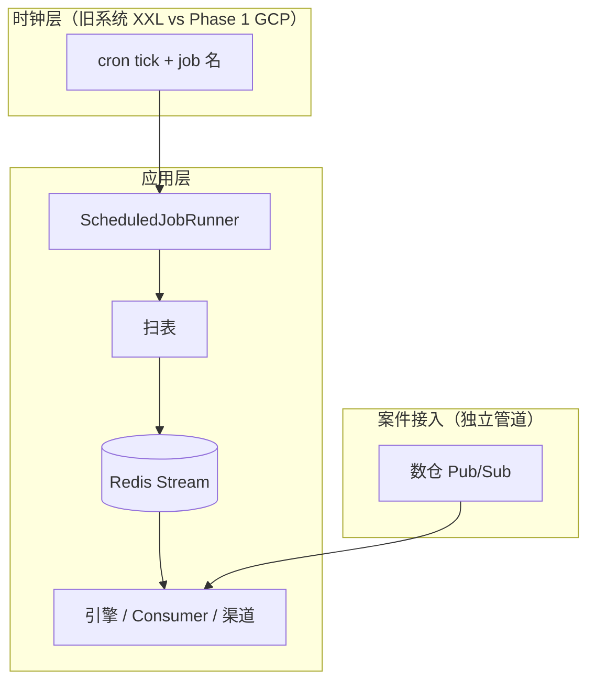
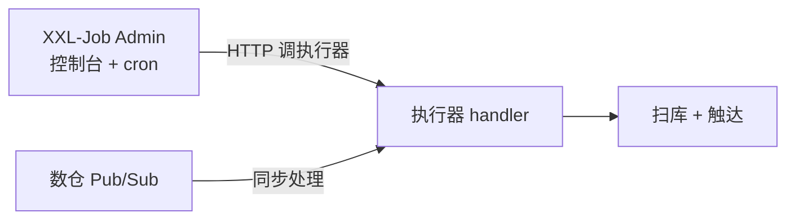
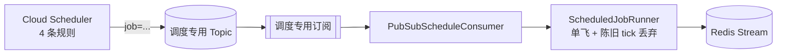

# 调度时钟讨论材料：旧系统（XXL）vs Phase 1 新系统（GCP 调度订阅）

> **用途**：组内评审 / 运维对齐 / 产品化路线讨论（非最终 ADR）  
> **日期**：2026-08-13  
> **读者**：主架构、运维、接入、引擎、测试  
> **结论前置**：Phase 1 已选 **GCP 调度订阅**；本文说明「为什么换」「换了什么」「没换什么」，供讨论是否回退或未来做多时钟适配。

---

## 1. 时钟在系统中的功能

催收系统里有两类「到点要做的事」：**外部数据到了**（案件/还款）和 **业务排期到了**（步骤触发、回调超时、日切）。  
**时钟**只负责后一类里的 **「按固定节奏叫醒应用」**——扫库、触达、改状态均在 Runner / 引擎侧，不在时钟层。

### 1.1 时钟负责什么

| 职责 | 说明 |
|---|---|
| **定节奏** | 按 cron 发出 tick |
| **投递标识** | tick 携带调度任务名（Phase 1 为 `job` 属性） |
| **叫醒应用** | 触发 `ScheduledJobRunner` 进入扫表与发事件 |

**应用侧链路（与时钟实现无关）**：

```
tick → ScheduledJobRunner → 扫 DB 排期字段 → 发 Redis Stream 事件 → 引擎 / Consumer / 渠道
```

**在整体架构中的位置**：



- **案件入站**：数仓 Pub/Sub → 接入写投影（[数仓契约](../数仓_PubSub交付契约.md)）。
- **调度入站**：时钟 → 调度专用 Topic / 订阅 → `PubSubScheduleConsumer`（[基础设施 §5](../MOCASA催收系统升级_Phase1_基础设施交互规范.md)）。
- 数仓侧另有 Cloud Scheduler 发 `caseEvent`，与 §5 调度 Job **不是同一套**。

模式：**固定频率 tick + DB 排期 + 有界扫表**；tick 频率 O(时间)，与案件量无关。

### 1.2 本文要对比什么

> **Runner 与新系统三调度任务已定**（见 §2 开篇）的前提下，Phase 1 继续用 **Cloud Scheduler → 调度 Pub/Sub 订阅**，还是改回 **旧系统式的 XXL-Job 时钟**？

比较维度：**tick 投递方式**、**无调度入站与管道隔离**、**运维形态（O1–O8 vs XXL 控制台）**、**成本**、**私有化时钟适配**。

---

## 2. 旧系统 vs Phase 1 新系统：时钟 tick 投递

**前提（非对比项）**——Phase 1 时钟须按 cron 触发下列 Runner 任务（[基础设施 §5](../MOCASA催收系统升级_Phase1_基础设施交互规范.md)）；讨论只涉及 tick **怎么送**：

| `job` | cron（Asia/Manila） | 功能 | 产出 |
|---|---|---|---|
| `planStepDue` | `* * * * *` | 到期的待触发计划步骤（首步/后续步、退避重试到期） | `PLAN_STEP_DUE` |
| `callbackTimeout` | `* * * * *` | 执行中 AI 步骤 Webhook 超时未到 | `CALLBACK_TIMEOUT` |
| `dailyRoll` | `35,40,45,50,55 3 * * *` + `*/5 4-5 * * *` | 日切窗口内读投影，检测 DPD/阶段/停催态变化（分页推进） | `STAGE_CHANGED` / `CASE_CEASED` / 复活 `CASE_INGESTED` |

### 2.1 旧系统（XXL-Job）



**旧系统无上述三 job 模型。** 相近逻辑如下（路径不同，不可直接对照为「同一任务」）：

| 新系统任务 | 旧系统逻辑（精简） |
|---|---|
| `planStepDue` | 案件 **Pub/Sub 同步**入站 → 规则/SQL 引擎 → **同线程**决策并触达；XXL 另跑 **渠道批外呼**（`lthVoice` 等），非步骤 `trigger_time` 扫表 |
| `callbackTimeout` | AI 外呼靠 **Webhook** 收结果；**无** `timeout_time` 周期扫描 |
| `dailyRoll` | 数仓 **Pub/Sub 日批**更新 `t_collection` → `case_load` 触发 SQL 规则；**无**投影分页、无 `STAGE_CHANGED` 事件链 |

- XXL 职责：LTH/AI **批外呼、统计、名单**（`LthVoiceNotificationCallTaskXXLJob` 等），与 Trigger-to-Event 无关。
- 案件 Pub/Sub 与 XXL **并列**，无调度专用 Topic。

### 2.2 Phase 1 新系统（GCP 调度订阅）

**时钟层**：Cloud Scheduler + 调度 Pub/Sub 投递上表 tick → `PubSubScheduleConsumer` → `ScheduledJobRunner`。



- **4 条 Scheduler 规则 → 3 个任务**：`planStepDue`、`callbackTimeout` 各 1 条；`dailyRoll` 因跨小时窗口拆 2 条 cron，消息属性均为 `job=dailyRoll`。
- 调度 Topic / 订阅与**案件接入订阅**物理隔离（[基础设施 §5](../MOCASA催收系统升级_Phase1_基础设施交互规范.md)）。
- 运维交付：O1–O8（Topic、IAM、四条 Job、告警等）。

---

## 3. 对比表（给讨论用）

### 3.1 架构与部署

| 维度 | 旧系统（XXL-Job） | Phase 1 新系统（GCP 调度订阅） |
|---|---|---|
| 时钟角色 | ✅ 是（Admin 按 cron 触发） | ✅ 是（Scheduler 发 tick） |
| 入站依赖 | 执行器注册、端口、网络放通 | **无**；应用出站拉订阅 |
| 与案件 Pub/Sub | 独立；易在进程内混跑 | Topic / 订阅 / 开关 **强制分离** |
| 调度线程职责 | 取决于实现；易写成扫库+触达 | 规格强制：只扫表发事件 |
| 多实例 | 需 XXL 路由 / 分片配置 | Pub/Sub 组内投递 + 应用单飞 |
| Pilot/生产 | 同一模型 | 同一实现，仅配置不同 |

### 3.2 运维

| 维度 | 旧系统（XXL-Job） | Phase 1 新系统（GCP 调度订阅） |
|---|---|---|
| 日常操作 | 控制台：执行记录、手动执行、失败重跑 | 无控制台；`gcloud publish` 补 tick + **指标** |
| 初次交付 | Admin + 执行器 + 网络策略 | **O1–O8**（Topic、订阅、IAM、4 条 Job、告警） |
| 「任务是否跑过」 | XXL 执行记录 | `collection.schedule.triggered`；Scheduler 成功 **≠** 扫描成功 |
| 停机恢复 | 相对直观 | 订阅积压 + **陈旧 tick 丢弃**（防扫描风暴） |
| 文档 SSOT | 旧系统惯例 | [基础设施 §5](../MOCASA催收系统升级_Phase1_基础设施交互规范.md)、[T5 §3.2](../testing/MOCASA催收系统升级_Phase1_T5Pilot准备与演练手册.md#32-调度交付清单o1o8) |

### 3.3 部署条件与选型边界

> **已确定的约束只有一个**：案件接入使用 GCP Pub/Sub。它说明应用必须能消费 Pub/Sub，**不等于**应用必须托管在 GCP，也**不等于**调度必须使用 Cloud Scheduler。

| 条件 / 诉求 | 更匹配的时钟 | 原因 |
|---|---|---|
| 应用部署在 GCP，且要求无调度入站端口 | GCP 调度订阅 | Scheduler → Pub/Sub → 应用订阅，与现有 Pub/Sub 接入及 IAM 模型一致 |
| 应用不在 GCP，或甲方不接受 GCP Scheduler 依赖 | XXL / K8s Cron / 所在云的 Scheduler | 时钟随应用部署环境选择，避免为调度额外绑定 GCP |
| 已有稳定 XXL 平台，且运维需要执行记录、手动重跑 | XXL | 复用既有控制台与值班流程 |
| 强调调度与案件消费隔离、无入站、脚本化交付 | GCP 调度订阅 | 专用 Topic / 订阅、IAM 与 O1–O8 已有实现规格 |

> **结论**：Pub/Sub 是案件接入契约，不是 GCP 托管或 Cloud Scheduler 的必选前提。当前代码实现为 GCP 调度订阅（见 §6）；是否将它定为生产选型，应由应用部署位置、入站网络约束与运维诉求共同决定。

---

## 4. 优缺点对比

> 仅比较**时钟层**；Runner、三调度任务与业务语义见 §2，不在此重复。

### 4.1 旧系统（XXL-Job）

| 优点 | 缺点 |
|---|---|
| 控制台可视：执行记录、手动触发、失败重跑 | 执行器须注册、开放端口，**有调度入站**依赖 |
| 运维心智成熟，值班排查路径熟悉 | 须维护 Admin、执行器及其依赖存储 |
| 多实例路由 / 分片在 XXL 侧可配置 | 调度线程易与业务耦合（执行器内扫库+触达） |
| 私有化场景若甲方已有 XXL，接入成本低 | 与案件 Pub/Sub 无强制隔离，易混跑 |
| | 无 Phase 1 三 job / Trigger-to-Event 模型（见 §2.1） |

### 4.2 Phase 1 新系统（GCP 调度订阅）

| 优点 | 缺点 |
|---|---|
| **无调度入站**；应用出站拉订阅，适合内网常驻 | 无 XXL 式执行记录页，靠指标 + `gcloud` |
| 调度 Topic 与案件接入**物理隔离** | 初次交付 **O1–O8**（Topic、IAM、四条 Job、告警） |
| Trigger-to-Event：时钟只发 tick，触达在 Consumer | 停机恢复需理解陈旧 tick 丢弃、订阅积压 |
| 应用部署在 GCP 时，IAM / 交付可脚本化验收 | Scheduler 成功 **≠** Runner 扫描成功，观测链更长 |
| 专用 Topic / 订阅可隔离调度与案件消费 | 依赖 GCP Scheduler；非 GCP 部署须改用其他时钟 |
| | **换时钟不提升**触达策略、案件吞吐、DPD 算法本身 |

---

## 5. 行业参考（简）

成熟催收常见 **混合**，不是单一 XXL 或单一云 Scheduler：

- **日切 / DPD / 分案**：批处理 Job（Oracle Collections、Spring Batch 等）。
- **还款 / 回调**：消息或 API **事件驱动**（越新越强调实时 DPD）。
- **步骤到期**：DB 排期 + **周期扫描**（与 Phase 1 相同模式；闹钟实现各异）。

XXL、Quartz、K8s Cron、Cloud Scheduler、EventBridge 等，都是 **时钟实现**；成熟点在 **状态机 + 事件 + 扫表排期**，不在闹钟品牌。

---

## 6. Phase 1 决策摘要（当前代码与文档）

| 项 | 状态 |
|---|---|
| 生产时钟 | Cloud Scheduler → `collection-schedule-ai-v1` → 专用订阅 |
| 应用入口 | `PubSubScheduleConsumer` → `ScheduledJobRunner` |
| 本地/测试 | `TriggerScanner` + `POST /mock/daily-roll`（与生产入口互斥） |
| XXL 运行时 | 已移除 |
| 运维闭合 | O1–O8 待交付（[HANDOFF](../HANDOFF.md)、附录 C） |

**未做**：可插拔 `ScheduleTickSource`（GCP / Spring Cron / XXL 适配器）——产品化时可加，不改变 Runner 语义。

---

## 7. 建议讨论的问题（会议议程）

1. **硬约束是否成立**：生产是否必须「无调度入站端口」？若否，回退 XXL 的成本收益如何？
2. **运维能否接受 O1–O8**：一次性交付 vs 持续 XXL Admin 维护，TCO 谁更高（含人力）？
3. **观测替代是否足够**：无 XXL 控制台后，T5-S + Prometheus 是否满足值班与审计？
4. **私有化路线**：未来甲方不在 GCP 时，是否认可 **「Runner 不变，只换时钟适配器」**，而非全局回 XXL 业务耦合？
5. **日切两条 Scheduler 规则**：是否接受 cron 限制；是否推进「批次完成信号」替代固定 03:35 窗口？
6. **是否 worth 写正式 ADR**：若组内共识稳定，可将本文收敛为 `architecture/000x-调度时钟选型.md`。

---

## 8. 一页纸（可单独贴会议邀请）

```
主题：调度时钟 — 旧系统（XXL）vs Phase 1 新系统（GCP 调度订阅）

背景：
  Phase 1 新系统三调度任务（§2 开篇表）+ Runner 已定。
  本文对比：旧系统 XXL 时钟 vs 新系统 Cloud Scheduler + 调度订阅。

旧系统（XXL-Job）：
  + 控制台、执行记录、手动重跑
  - 执行器入站、Admin 运维、易与业务混线程

Phase 1 新系统（GCP 调度订阅，当前）：
  + 无入站、与案件 Pub/Sub 隔离、脚本化 O1–O8
  - 无执行记录页、需指标 + gcloud、初次 GCP 交付

已确定：案件接入使用 Pub/Sub；这不等于应用必须托管 GCP、调度必须使用 Cloud Scheduler。
待表决：若应用部署在 GCP 且要求无调度入站，保留新系统方案；
        否则按部署环境和运维诉求选择 XXL/K8s Cron/所在云 Scheduler，Runner 语义不变。

请带着 §7 六个问题参会。
```
