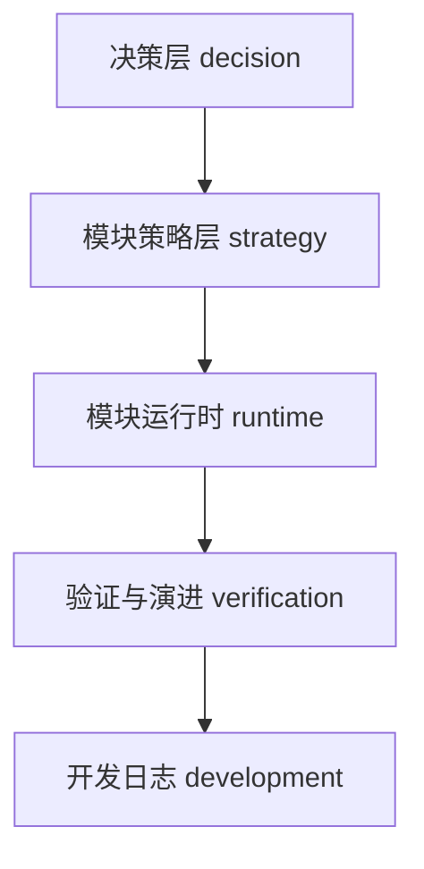

# 渠道域 · Agent 工作上下文（CONTEXT）

> **用途**：新会话、新成员、自动化 Agent 的**唯一入口**。描述渠道文档如何分层、按任务读什么、当前进展与 SSOT 边界。
> **维护**：编排同事；与根 [`docs/README.md`](../README.md) 状态图例对齐。

## 状态图例（与根 README 一致）

| 符号 | 含义 | AOD 映射 |
|------|------|----------|
| ✅ | 定稿 / Baseline，变更须 Changelog | `✅ Stable` |
| 🟡 | 进行中 / 临时代码 / 待深化 | `🟡 Under_Review` |
| 📦 | 历史结论，只读归档 | — |
| 🔴 | 草稿 / 缺外部输入 | `🔴 Draft` |

## 文档四层（纵向深度）

| 层 | 回答的问题 | 本域文档 |
|----|------------|----------|
| **决策层** | 为什么选这些供应商、Phase 1 裁什么 | [`reference/mocasa_channel_vendor_selection_v1.md`](./reference/mocasa_channel_vendor_selection_v1.md) |
| **模块策略层** | 计划怎么编、Guard 拦什么、事件怎么处理 | [`渠道编排规格`](./MOCASA催收系统升级_Phase1_渠道编排规格.md)（**业务规则 SSOT**） |
| **模块运行时** | Gateway/Adapter/Webhook 怎么接 | [`collection-channel 总规格`](./MOCASA催收系统升级_Phase1_collection-channel总规格.md)、各 Adapter 对接说明 |
| **验证层** | 怎么测、Golden Set 在哪 | [`功能测试指南`](./MOCASA催收系统升级_Phase1_collection-channel功能测试指南.md)、[`testing/`](../testing/README.md) |
| **开发演进层** | 今天做到哪、下一步什么 | [`开发进度`](./MOCASA催收系统升级_Phase1_collection-channel开发进度.md)、[`引擎对齐待办`](./MOCASA催收系统升级_Phase1_渠道编排与引擎对齐待办.md) |

**跨模块契约**（引擎维护，编排只读消费）：[`docs/contracts/`](../contracts/README.md)。

## 按任务阅读路径

| 任务 | 必读（顺序） | 按需 |
|------|--------------|------|
| **理解渠道全貌** | 本页 → [渠道编排规格 §3.5](./MOCASA催收系统升级_Phase1_渠道编排规格.md#35-phase-1-实现范围) → [开发进度 §0–2](./MOCASA催收系统升级_Phase1_collection-channel开发进度.md) | [HANDOFF](../../HANDOFF.md) |
| **编写 SPI / Adapter 代码** | [开发执行指南](./MOCASA催收系统升级_Phase1_collection-channel开发执行指南.md) → [执行契约](../contracts/MOCASA催收系统升级_Phase1_引擎渠道执行契约对齐_待编排确认.md) → [ContextSnapshot 契约](../contracts/README_ContextSnapshot契约对齐.md) | [字段透传说明](./MOCASA催收系统升级_Phase1_ContextSnapshot字段透传说明.md) |
| **改模板 / 文案** | [渠道模板清单](./MOCASA催收系统升级_Phase1_渠道模板清单与配置.md) → [`email-templates/`](../email-templates/README.md) | [策略迭代手册](./MOCASA催收系统升级_Phase1_策略迭代与测试操作手册.md) |
| **跑测试 / L4a** | [testing §L4a](../testing/MOCASA催收系统升级_Phase1_测试文档.md) → [L4a 编排补全清单](../testing/MOCASA催收系统升级_Phase1_L4a全量前置_编排同事补全清单.md) | [功能测试指南](./MOCASA催收系统升级_Phase1_collection-channel功能测试指南.md) |
| **与引擎对齐会议** | [引擎对齐待办](./MOCASA催收系统升级_Phase1_渠道编排与引擎对齐待办.md) | [编排对齐清单](../contracts/README_编排同事对齐清单.md) |

## 当前进展摘要（2026-06-26）

> 明细与 Changelog 见 [开发进度](./MOCASA催收系统升级_Phase1_collection-channel开发进度.md)。下列与代码仓库事实对齐。

| 域 | 状态 | 说明 |
|----|:--:|------|
| 执行子层 Adapter（SMS/Push/Email） | ✅ | `NotificationSmsAdapter` / `NotificationPushAdapter` / `SendGridEmailAdapter` |
| `DefaultStepResolver` + ScriptLibrary | ✅ | 取址 `jpushToken`、scriptSlot、变量注入 |
| SPI A1/A2/A4/A5 | 🟡 | 主架构 **2026-06-25 临时代写** `@Primary`（L4a-全）；**非生产**，编排须 review 并替换 |
| SMS DLR → `CHANNEL_CALLBACK` | 🔴 | 仅通用 `/webhook/channel-callback` 骨架；通知中心 DLR 未接 |
| `LthVoiceAdapter` + voice Webhook | 🔴 | 未实现 |
| `ComplianceExecutionGuard`（Redis） | 🔴 | 临时 `ConfigurableExecutionGuard` 为内存版 |
| 渠道编排规格 §3.5 SMS 观察期 | ✅ | 2026-06-26 与引擎 §2.3.3、执行契约对齐 |

## SSOT 边界（引用替代搬运）

| 主题 | SSOT 文档 | 章节指针 |
|------|-----------|----------|
| 业务编排规则 | 渠道编排规格 | §3–§9 |
| scriptSlot / 模板 ID | 渠道模板清单与配置 | §3–§7 |
| 快照字段与取号 | contracts ContextSnapshot 契约 | §最小必填 |
| dispatch/观察期/空地址 | 引擎渠道执行契约 | §1–§4 |
| 步骤完成时机（SMS 两段） | 核心引擎规格 | §2.3.3 |
| TC 用例与 curl | 功能测试指南 | `TC-*` |
| L4a 用例与脚本 | testing 主文档 | §L4a |

跨文档只写**一句摘要 + 上表指针**；不在下游重复论证上游结论。

## Golden Set / Harness 锚点

| Harness | 锚点 |
|---------|------|
| L4a 官方 8 条 | `scripts/test/l4a-official-test.sh`；用例定义见 [testing §L4a](../testing/MOCASA催收系统升级_Phase1_测试文档.md) |
| Email 5 封 E2E | [`email-e2e-test-cases.md`](../email-templates/email-e2e-test-cases.md) |
| SPI 单测 | `collection-channel/src/test/java/…`（WireMock Adapter、ScriptResolverLogicTest） |
| L2 契约 | `collection-engine/.../integration/ChannelContractL2Test` |

## Changelog

| 日期 | Reason |
|------|--------|
| 2026-06-26 | 初版 CONTEXT；对齐 README 状态、L4a §8 临时代码事实、§3.5 SMS 语义修正索引 |
