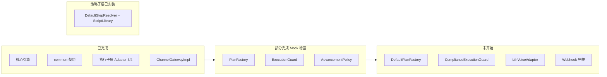

# MOCASA Phase 1 — collection-channel 开发进度

> **最后更新**: 2026-06-12（Notification SMS/Push 适配器落地 · DefaultStepResolver + ScriptLibrary 实装 · SMS 测试端点接通 · App Push 假 token 占位跑通链路）  
> **SSOT 任务分解**: [开发执行指南 §7 Checklist](./MOCASA催收系统升级_Phase1_collection-channel开发执行指南.md#7-推荐开发时间线checklist)  
> **测试手册**: [策略迭代与测试操作手册](./MOCASA催收系统升级_Phase1_策略迭代与测试操作手册.md) · [功能测试指南](./MOCASA催收系统升级_Phase1_collection-channel功能测试指南.md)

> **最后更新**: 2026-06-05（现网对照 · 决策：Voice=TTS only · 策略后台=Phase 2 全量）

---

## 0. 现网对照与已确认决策

### 0.1 现网 vs 新系统

| 能力        | 现网 `collection_rebuild`           | Phase 1 新系统                                         | 动作                                                                                   |
| --------- | --------------------------------- | --------------------------------------------------- | ------------------------------------------------------------------------------------ |
| App Push  | 通知中心 → JPush                      | ✅ `**NotificationPushAdapter`**（含 `push-sync-mode`） | **假 jpushToken 占位已跑通链路**（往返 invalid sign）；真实入队待 `appKey`，真投递待真 token + `data` schema |
| 催收 SMS    | 通知中心（内部路由 QH/Hiway/BORI）          | ✅ `**NotificationSmsAdapter`**                      | 真号 `9451374358/9451373897` 生产 `/send` DELIVERED；全链路 ingest+timeline 已通               |
| LTH TTS   | `voiceNotifactionTTSAndCustomize` | 待开发                                                 | 复用 `postLth` digest 鉴权                                                               |
| LTH AI 对话 | 现网走 Wiz/Saiduo                    | —                                                   | **Phase 1 不做**                                                                       |
| 策略模板 DB   | `t_system_property` 等             | Java + Nacos                                        | Phase 2 全量后台 + DDL                                                                   |

### 0.2 团队决策（2026-06-05）

| 议题          | 决策                                                          |
| ----------- | ----------------------------------------------------------- |
| **AI_CALL** | Phase 1 **仅 LTH TTS**；`AI_CALL` 继续 Mock / Phase 2           |
| **策略前台**    | Phase 2 **完整策略后台**（模板、合规、渠道开关）；Phase 1 用 Nacos + SQL + REST |
| **策略 DDL**  | Phase 1 **不建** `t_contact_plan_template`；跑通后再 DDL + 后台      |

---

| 分层                          | 完成度      | 说明                                                                                                                            |
| --------------------------- | -------- | ----------------------------------------------------------------------------------------------------------------------------- |
| **核心引擎**（collection-engine） | **~95%** | 事件消费、状态机、七步管线、CASE_CEASED 已联调                                                                                                 |
| **执行子层 / 哑管道**              | **~80%** | Gateway + Notification SMS/Push + SendGrid Email Adapter（均含单测）；Voice/Webhook 未做                                               |
| **策略子层**（5 SPI）             | **~30%** | **DefaultStepResolver + ScriptLibrary 已实装**（读 channel.scripts、变量注入、FIRM 选择、Push deep_link 兜底）；PlanFactory/Guard/Policy 仍 Mock |
| **数据接入**（ingestion）         | **~20%** | Mock 进案；日切/CASE_CEASED 生产 Job 占位                                                                                              |
| **策略 DB 后台**                | **0%**   | `t_contact_plan_template` 等未 DDL                                                                                              |

---

## 2. Checklist 逐项状态

| #   | 任务                                                        | 状态        | 备注 / 验证                                                                                                                               |
| --- | --------------------------------------------------------- | --------- | ------------------------------------------------------------------------------------------------------------------------------------- |
| 0   | .env + Nacos 连通；Mock 基线                                   | ✅ 完成      | TC-REG-01；verify-env.ps1                                                                                                              |
| 1   | 阶段 0：common 契约                                            | ✅ 完成      | CASE_CEASED、StepCommand 常量、repaymentUrl                                                                                               |
| 2   | ChannelProperties + Nacos `channel.*`                     | ✅ 完成      | `@RefreshScope`；`.env` SendGrid 变量                                                                                                    |
| 3   | StepResolver（多渠道地址、sms_body）                              | ✅ 完成      | 已并入 DefaultStepResolver（#9）                                                                                                           |
| 4   | NotificationSmsAdapter + NotificationClient + Gateway     | ✅ 完成      | WireMock 6 cases；含**测试端点 /v1/sms/testSend 免签名**；未配时回退 Mock                                                                            |
| 5   | NotificationPushAdapter + SMS fallback + `push-sync-mode` | ✅ 完成      | WireMock 6 cases；无 token → 同阶段 SMS fallback；`sync/send`(联调)↔`send`(生产)；假 token 占位跑通链路                                                 |
| 6   | SendGridEmailAdapter                                      | ✅ **已联调** | TC-EMAIL-D0-01：92002 → [wzynju@126.com](mailto:wzynju@126.com) DELIVERED                                                              |
| 7   | LthVoiceAdapter + `/webhook/lth/voice`                    | ❌ 未开始     | AI_CALL/TTS 仍走 MockChannelGateway                                                                                                     |
| 8   | DefaultPlanFactory（8 套骨架）                                 | ❌ 未开始     | 当前 Mock：PUSH→EMAIL 或 legacy 三步；scriptSlot 由 Resolver 按 Stage 推导                                                                       |
| 9   | DefaultStepResolver + ScriptLibrary                       | ✅ 完成      | 读 `channel.scripts` 注入 `{name}/{amount}/{dpd}`；Stage+Tone 推导 scriptSlot（S2+ FIRM）；Push `deep_link` 兜底；ScriptResolverLogicTest 6 cases |
| 10  | ComplianceExecutionGuard                                  | ❌ 未开始     | MockExecutionGuard 恒放行；需 Redis                                                                                                        |
| 11  | DefaultAdvancement/ExhaustionPolicy                       | ❌ 未开始     | Wave-2 取消、disposition 映射未做                                                                                                            |
| 12  | SendGrid Webhook timeline 升级                              | ❌ 未开始     |                                                                                                                                       |
| 13  | 删除全部 Mock 类                                               | ❌ 未开始     | 7 个 Mock 仍在                                                                                                                           |
| 14  | E2E CASE_CEASED                                           | 🟡 部分     | 引擎+MockPlanFactory 守卫已有；ingestion 日切未做                                                                                                |

**图例**：✅ 完成 · 🟡 进行中/部分 · ❌ 未开始

---

## 3. 模块文件清单

### 3.1 执行子层（哑管道）— 真实实现

| 类                                                     | 状态                  |
| ----------------------------------------------------- | ------------------- |
| `ChannelProperties`（含 `notification.*` + `scripts.*`） | ✅                   |
| `ChannelGatewayImpl`                                  | ✅ @Primary          |
| `NotificationClient`（鉴权 + 免签名 testSend + 瞬时重试）        | ✅                   |
| `NotificationSmsAdapter`（替换 LthSmsAdapter）            | ✅                   |
| `NotificationPushAdapter`（替换 FcmPushAdapter）          | ✅                   |
| `SendGridEmailAdapter`                                | ✅                   |
| `LthVoiceAdapter`                                     | ❌                   |
| `MockChannelGateway`                                  | 🟡 兜底（未配密钥 / 未实现渠道） |

### 3.2 策略子层 — 仍为 Mock

| SPI               | 当前类                   | 目标类                                     | 状态         |
| ----------------- | --------------------- | --------------------------------------- | ---------- |
| PlanFactory       | MockPlanFactory       | DefaultPlanFactory                      | 🟡 增强 Mock |
| StepResolver      | ~~MockStepResolver~~  | **DefaultStepResolver** + ScriptLibrary | ✅ 实装       |
| ExecutionGuard    | MockExecutionGuard    | ComplianceExecutionGuard                | ❌          |
| AdvancementPolicy | MockAdvancementPolicy | DefaultAdvancementPolicy                | ❌          |
| ExhaustionPolicy  | MockExhaustionPolicy  | DefaultExhaustionPolicy                 | ❌          |

### 3.3 单测

| 套件                                            | 状态                                      |
| --------------------------------------------- | --------------------------------------- |
| NotificationSmsAdapterTest（WireMock）          | ✅ 6 cases（含 testSend 免签名）               |
| NotificationPushAdapterTest（WireMock）         | ✅ 6 cases（含无 token fallback、sync 受理/拒绝） |
| ScriptResolverLogicTest（变量注入 + scriptSlot 推导） | ✅ 6 cases                               |
| SendGridEmailAdapterTest                      | ✅ 3 cases                               |
| MockPlanFactoryGuardTest                      | ✅ 4 cases                               |
| Gateway 幂等单测                                  | ❌                                       |

---

## 4. 已验证的端到端能力

| 能力                      | 验证方式                        | 日期         |
| ----------------------- | --------------------------- | ---------- |
| Mock 全链路 PLAN_COMPLETED | caseId 91000                | 2026-06-05 |
| SendGrid 真实发信 D0 Email  | caseId 92001/92002 → 126 邮箱 | 2026-06-05 |
| PUSH→EMAIL 简单编排         | 91001 timeline 2 条          | 2026-06-05 |
| CASE_CEASED 不建 plan     | 90091                       | 文档/冒烟      |

---

## 5. 下一步计划（建议顺序，2026-06-05 修订）

| 优先级    | 工作项                                                 | 预估   | 验收                                 | 阻塞                                              |
| ------ | --------------------------------------------------- | ---- | ---------------------------------- | ----------------------------------------------- |
| ✅      | ~~NotificationSmsAdapter + NotificationClient~~     | —    | WireMock 6 cases 通过；testSend 接通    | 生产 `/send` 待 `appKey`                           |
| ✅      | ~~NotificationPushAdapter（替换 FcmPushAdapter）~~      | —    | WireMock 6 cases 通过；假 token 占位跑通链路 | 真实入队待 `appKey`，真投递待真 jpushToken / `data` schema |
| ✅      | ~~DefaultStepResolver + ScriptLibrary~~             | —    | ScriptResolverLogicTest 6 cases    | 真实文案待业务终审 + Nacos `channel.scripts` 落库          |
| **P0** | 用真机/测试号跑通 SMS testSend（123456）→ 生产号                 | 0.5d | 通知中心 `t_history` 有记录               | 测试 SIM / `appKey`                               |
| P0     | **LthVoiceAdapter（仅 TTS）** + `/webhook/lth/voice`   | 2d   | TC-VOICE-TTS-01                    | 对齐现网 TTS action                                 |
| P0     | **AI_CALL**                                         | —    | 保持 Mock                            | Phase 2 / LTH AI 文档到位后                          |
| P1     | `DefaultPlanFactory` S0–S1 最小日块（设 Stage/scriptSlot） | 3–5d | TC-PLAN-S0                         | —                                               |
| P1     | `ComplianceExecutionGuard` + Redis                  | 2d   | TC-GUARD-*                         | parent POM 加 redis                              |
| P2     | S2–S4 + AdvancementPolicy + Webhook                 | 5d+  | 冒烟矩阵                               | Voice disposition                               |
| P3     | 删 Mock                                              | 1d   | Checklist #13                      | —                                               |
| P3     | **策略 DDL + 全量策略后台**                                 | TBD  | 模板/合规/渠道 CRUD                      | 产品 Phase 2                                      |

---

## 6. 变更日志

| 日期         | 进展                                                                                                                                                                                                                           |
| ---------- | ---------------------------------------------------------------------------------------------------------------------------------------------------------------------------------------------------------------------------- |
| 2026-06-05 | 初版进度文档；阶段 0–2 子集完成；TC-EMAIL-D0-01 联调通过（92002/[wzynju@126.com](mailto:wzynju@126.com)）                                                                                                                                        |
| 2026-06-05 | 现网对照：无 FCM；催收 SMS 为 QH/Hiway/BORI（非 LTH）；Voice AI 供应商待决策                                                                                                                                                                     |
| 2026-06-05 | 文档：新增 [SMS 对接说明](./channel/MOCASA催收系统升级_Phase1_SMS对接说明.md)，废止 LTH SMS 文档                                                                                                                                                     |
| 2026-06-05 | 文档：SMS/Push 改为 [Notification 对接说明](./channel/MOCASA催收系统升级_Phase1_Notification对接说明.md)（通知中心，非直连供应商/FCM）                                                                                                                       |
| 2026-06-05 | Email 文案 v3（催收心理学：词汇分阶段、S4 黑白律师函）；移除虚构 Hardship Program                                                                                                                                                                      |
| 2026-06-12 | 执行子层：`LthSmsAdapter`/`FcmPushAdapter` → `NotificationSmsAdapter`/`NotificationPushAdapter` + `NotificationClient`（鉴权/瞬时重试）；移除 google-auth 依赖                                                                                 |
| 2026-06-12 | SMS **测试端点 `/v1/sms/testSend`**（免签名，`sms-test-mode`）接通，appCode=mocasa / contentType=collection                                                                                                                               |
| 2026-06-12 | 实装 `**DefaultStepResolver` + `ScriptLibrary**`：读 `channel.scripts`、注入 `{name}/{amount}/{dpd}`、Stage+Tone 推导 scriptSlot（S2+ FIRM）、Push `deep_link` 兜底                                                                         |
| 2026-06-12 | SMS/Push 文案按专家 5 点修订（Offer 诱饵前置、客观后果替威胁、去全大写防 Spam、压缩控成本、Push 标题前置）；模板清单 + Nacos `channel.scripts` 同步                                                                                                                        |
| 2026-06-12 | App Push 用**假 jpushToken 占位**跑通链路：新增 `MockPushTestCases`(94200 占位/94201 无 token)、`/mock/send-push`、`push-sync-mode`(联调走 `sync/send`)；94201→SMS fallback DELIVERED，94200 dummy appKey 往返 → invalid sign（证完整往返，真实入队待 `appKey`） |

---

## 7. 相关文档索引

| 文档                                                                                             | 用途                  |
| ---------------------------------------------------------------------------------------------- | ------------------- |
| [开发执行指南](./MOCASA催收系统升级_Phase1_collection-channel开发执行指南.md)                                    | 怎么写代码               |
| [功能测试指南](./MOCASA催收系统升级_Phase1_collection-channel功能测试指南.md)                                    | TC 与 curl           |
| [策略迭代与测试操作手册](./MOCASA催收系统升级_Phase1_策略迭代与测试操作手册.md)                                            | 运营/策略怎么测、怎么改        |
| [渠道编排规格](./MOCASA催收系统升级_Phase1_渠道编排规格.md)                                                      | 业务规则 SSOT           |
| [渠道模板清单与配置](./MOCASA催收系统升级_Phase1_渠道模板清单与配置.md)                                                | 全渠道 scriptSlot SSOT |
| [总规格 附录 A](./MOCASA催收系统升级_Phase1_collection-channel总规格.md#附录-ascriptslot--供应商-template_id-映射表) | scriptSlot 映射       |

