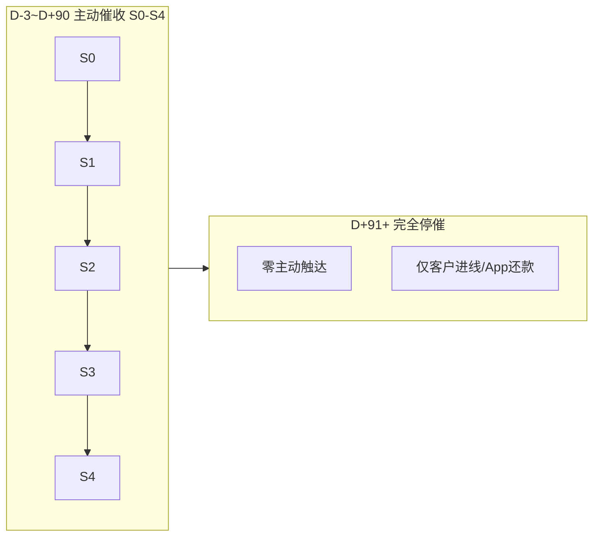
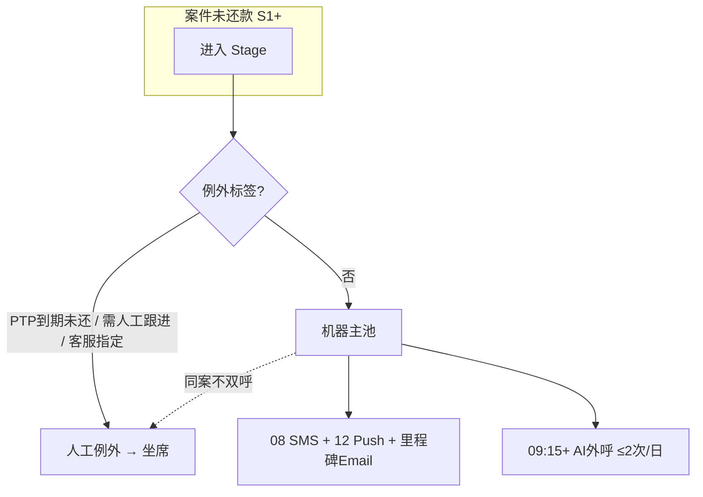

# MOCASA 催收系统升级 — Phase 1 渠道编排规格

> **版本**: V1.4  
> **日期**: 2026-06-03  
> **范围**: 仅覆盖菲律宾市场  
> **模块**: `collection-channel`（策略子层）  
> **关联文档**: [核心引擎规格](./MOCASA催收系统升级_Phase1_核心引擎规格.md)、[架构设计](./MOCASA催收系统升级_Phase1_架构设计文档.md)、[PRD](./MOCASA催收系统升级_Phase1_产品需求文档_PRD.md)、[collection-channel 总规格](./MOCASA催收系统升级_Phase1_collection-channel总规格.md)、[渠道模板清单](./MOCASA催收系统升级_Phase1_渠道模板清单与配置.md)、[渠道文档索引](./README_渠道文档索引.md)、[HANDOFF.md](../HANDOFF.md)

---

## 目录

- [方案概述](#方案概述)
- [0. 设计原则](#0-设计原则)
- [1. 背景与现状](#1-背景与现状)
- [2. 总体定位与编排范式](#2-总体定位与编排范式)
- [3. 系统形态与人机双轨](#3-系统形态与人机双轨)
  - [3.5 Phase 1 实现范围](#35-phase-1-实现范围)
- [4. 阶段划分与生命周期边界](#4-阶段划分与生命周期边界)
- [5. 产品形态与 Max DPD 口径](#5-产品形态与-max-dpd-口径)
- [6. 策略标记（替代 Persona 分类）](#6-策略标记替代-persona-分类)
- [8. 话术设计框架](#8-话术设计框架)
- [9. 事件处理范围](#9-事件处理范围)
- [10. 两系统一致性（Phase 1 立场）](#10-两系统一致性phase-1-立场)
- [11. 效果评估与验收](#11-效果评估与验收)
- [12. 待讨论事项与依赖](#12-待讨论事项与依赖)
- [13. 与核心引擎/基础设施映射](#13-与核心引擎基础设施映射)

---

## 方案概述

### 要解决什么问题

MOCASA 现网催收以 **SMS BLAST + 人工预测式外呼** 为主：到期前通知由信贷主系统发送，逾期后按固定 STAGE 1–4 短信模板推进，缺乏 Push / Email / AI 外呼的 **统一编排**；三期产品 DPD 按 bill 计导致阶段与金额口径不一致；高风险客户与普通客户 **策略一刀切**；人工坐席与机器触达 **无统一规则**，存在重复触达与产能浪费风险。

Phase 1 目标是新建 **机器轨策略引擎**，在合规护栏内 **最大化回收**，同时保护 **自营（first-party）** 品牌与复贷——行业调研（McKinsey、TrueAccord）指出：自营业务不宜照搬外包催收的高强度序列。

### 方案主张（摘要）


| 维度        | 主张                                                                    | 依据                                                       |
| --------- | --------------------------------------------------------------------- | -------------------------------------------------------- |
| **编排范式**  | **L1 = Stage 计划 + 事实标记**（难催→加强话术 FIRM；投诉→冻结），不做完整 Persona / ML 分群     | 日触达 2–3k；行业 Phase 1 以 **L2 规则编排** 为主（调研 §2.1）            |
| **阶段**    | **仅 S0–S4 主动催收**（D-3~D+90）；**D+91 起完全停催**                         | 90 天后零主动触达；仅客户 App 还款/进线 |
| **渠道**    | Push + SMS + Email + AI 外呼 / TTS；Viber Phase 1 不做                     | 渠道选型与业务确认；IM 通道后移 Phase 2                                |
| **人机**    | **S1–S4 AI 外呼为主**；人工 **仅例外池**（PTP 到期未还 / 需人工介入）                       | interface.ai、FinanceOps：标准账户由 AI 处理                      |
| **中晚期加压** | S3 **不加日触达槽位**；S4 **D+61~90 降至 1 呼/日**；靠 Email 里程碑 + 语气升级             | CloudContactAI、Frenzo、Marginal Value of Contact（调研 §5.9） |
| **评估**    | 北极星 = 回收率 / 阶段滚转率（Roll-rate）；护栏 = 投诉率 ≤0.5‰；强度 A/B 对比 FIRM 与 STANDARD | 上线前须抽 baseline                                           |


### 全生命周期触达时间线（拟议）

```
D-3~D0  S0：08:00 SMS×4 + D0 14:00 Email（到期前；无语音）
D+1~3   S1：08 SMS / 09:15+ AI×2 / 12 Push / D+1&D+3 Email
D+4~15  S2：同 S1 时间表 + D+4/7/12 Email + Offer（F10 动态）
D+16~30 S3：同 S2 时间表 + Pay Now 加重 + D+16/23/30 Email
D+31~90 S4：D+31~60 同时间表；D+61~90 AI×1/日 + 催告函 Email×4
D+91+   完全停催：零主动触达（Email/SMS/Push/AI）；仅客户 App 还款/客服进线→人工可回拨
```

---

## 0. 设计原则

业务方诉求：**简单、可控、可落地**。在此前提下，方案推导四条原则：

**1. 只对「事实」做差异化，不对「预测」下注**

可观测事实（历史逾期、PTP 破裂、投诉）驱动策略变化；A 卡等预测分 **写入 snapshot 供分析与排队，不驱动触达计划分叉**。  
*理由*：复贷户 A 卡沿用首贷分，若用于 cadence 分叉会长期误伤「首贷低分、历史良好」客户；Persona 中 EASY/自愈预测验证成本高（FICO 亦强调分阶段模型，非一模型贯穿全生命周期）。

**2. 错误的决策不如不做**

无 baseline 支撑的复杂分层（gold_window、INTENSIVE、4-Persona、按 ticket 拆 plan）Phase 1 不上。模板从 ~17 套收敛到 **≈8 套骨架**，降低工程与策略分析复杂度。

**3. 架构预留、能力分期**

Phase 1 全程规则 + 事件驱动（L2）；`DecisionEngine` 等 SPI 预留 Phase 2 Propensity / LLM 替换。与 FinAccel 自研编排 + CPaaS 哑管道路线一致。

**4. 北极星 = 回收，客诉 = 护栏**

MOCASA 回收仍有提升空间，策略目标是 **把激进度加到护栏触线为止**——FIRM、Offer、多通道编排服务于回收；投诉率/退订率触线则回退（优先砍 Wave-2 或 S4 晚期外呼）。

---

## 1. 背景与现状

### 1.1 MOCASA 业务约束


| 约束                           | 对方案的影响                                           |
| ---------------------------- | ------------------------------------------------ |
| **First-party 消费信贷**（菲律宾）    | 策略须兼顾回收与留存；S0 友好提醒、S1 前无 offer、防诈骗贯穿             |
| **日触达量级 ~2–3k**              | 不足以支撑 ML 实时决策；规则 plan + 事件闭环足够（调研 L2 定位）         |
| **一用户一笔在贷 loan**             | case = 用户 = 在贷 loan；编排按 loan 维度，还款按 bill/loan 两层 |
| **一期 + 三期产品**                | 同一套日时间表、话术变量不同；Max DPD 取各 bill 最大值                   |
| **两物理系统**（新建机器轨 + 现网 LTH/坐席） | Phase 1 不做实时转人工；标签异步推送；整合阶段再统一 timeline          |
| **无 chargeoff / 委外状态**       | 编排层 **D+91 完全停催**；360 可留作财务核销，与催收触达解耦 |


### 1.2 现网策略与缺口


| 现网                     | 缺口                                   | 本方案对应                   |
| ---------------------- | ------------------------------------ | ----------------------- |
| 信贷系统发 D-3~D0 通知        | 与机器轨可能双发                             | 机器轨 **接管 S0**，信贷侧关停     |
| SMS STAGE 1–4 按 DPD 天数 | 边界与新 Stage 不一致；无 Push/Email/Voice 编排 | §7 各 Stage 明细 + §8 话术迁移 |
| 三期按 bill 计 DPD         | 阶段与应还不一致                             | §5 Max DPD + 已到期合计      |
| 人工预测式覆盖 S2+            | 坐席成本高；与机器轨无互斥                        | AI 主 + 人工例外池 + 同案语音互斥   |
| 固定 DPD 折扣话术            | 易被博弈                                 | F10 动态 offer + 话术不公开时间表 |
| PRD 含 Viber Phase 1    | 业务已确认不做                              | 仅预留 Adapter             |


### 1.3 行业对标结论（与本方案的关系）

- **成熟度**：商用平台多数停留在 L1–L2；MOCASA Phase 1 目标 L2（事件 + 模板 + Guardrail）与行业主流一致，无需为 L3 Agentic 过度设计。
- **Omnichannel**：价值在 **统一 timeline + 事件驱动下一步**，非渠道数量；MOCASA 已有 `t_contact_timeline` + Redis Stream，本方案补的是 **Stage 级 plan 与槽位定义**。
- **中晚期**：行业共识为 **里程碑 Email + 正式度升级 + offer 谈判**，而非盲目加呼（详见调研 §5.9）；本方案 S3/S4 据此设计。

---

## 2. 总体定位与编排范式

### 2.1 升级对象

**机器轨**：无需坐席干预的自动化触达（Push / SMS / Email / **AI 外呼** / **语音播报 TTS**）。  
**人工轨**：维持现网 LTH 预测式 + 坐席 App，Phase 1 不纳入本次引擎开发范围，但通过标签/filter 对接。

### 2.2 编排范式：L1（Stage 计划 + 事实标记）

> **L1** 指 MOCASA 自用的编排分层（阶段模板 + 少量标记），**不是**行业成熟度模型里的 L1「仅批量发送」。行业对标上，本方案落地位相当于 **L2（规则 + 事件驱动 + 合规护栏）**。

```
匹配 plan = f(Stage, Tone)
Tone ∈ { STANDARD, FIRM }
FIRM 由事实标记「难催」触发，仅 S2+ 模板生效
投诉/争议 → ExecutionGuard 冻结，非 Tone
```

**为何不采用完整 4-Persona**


| 方案                   | 优点                             | 缺点                     | 结论          |
| -------------------- | ------------------------------ | ---------------------- | ----------- |
| 4-Persona（含 EASY 自愈） | 理论上可降本                         | EASY 难验证；~17 套模板；状态机复杂 | Phase 1 不采用 |
| **L1 事实标记**          | 可解释、可审计；~8 套骨架；命中 PRD「敏感客户差异化」 | 无预测型 soft treatment    | **推荐**      |
| 纯 DPD 桶              | 最简单                            | 一刀切、无难催/投诉差异           | 不满足 PRD     |


**强度实验**：不采用 5% 零触达 Holdout（伦理与回收损失争议），改为 **全员触达 + FIRM vs STANDARD 随机 A/B**，在测增量同时保持触达覆盖。

### 2.3 Phase 2 预留

事实标记旁预留「难度分」占位；`DecisionEngine` SPI 可替换为评分/LLM；A 卡 level 已写入 snapshot 供后续 Propensity queue。

---

## 3. 系统形态与人机双轨

### 3.1 系统切分


| 项     | 方案                                                               |
| ----- | ---------------------------------------------------------------- |
| 形态    | **两物理系统**：新建 collection-engine（机器轨）+ 现网 collection_rebuild / LTH |
| 职责    | 机器轨 = 全阶段自动化渠道；人工轨 = 仅人工外呼                                       |
| 实时转人工 | **不做**常规实时切换；打标 **需人工跟进** → 异步推送人工系统（紧急事件可 **Override**，§7.2） |
| 整合    | Phase 1 后阶段；人工并 HumanCallAdapter，统一 timeline                     |


### 3.2 渠道范围


| 渠道               | Phase 1 | 说明                      |
| ---------------- | ------- | ----------------------- |
| Push             | ✅       | 通知中心 → JPush；见 [Notification §2](./MOCASA催收系统升级_Phase1_Notification对接说明.md#2-app-push异步入队) |
| SMS              | ✅       | 通知中心（`contentType=collection`，内部路由 QH/Hiway/BORI）；见 [Notification §1](./MOCASA催收系统升级_Phase1_Notification对接说明.md#1-sms同步) |
| Email            | ✅       | SendGrid（SES 备）         |
| AI 外呼            | ✅       | LTH；可对话则 disposition 分支 |
| 语音播报（TTS）        | ✅       | AI 不可对话时降级              |
| Viber / WhatsApp | ❌       | Adapter 预留，Phase 2 评估   |
| Human Call       | 人工轨     | 例外池；**不进** 机器轨 `ContactPlan`（无 `HUMAN_CALL` step，见对齐待办 #5） |


### 3.3 人机分工（核心主张）

行业常见两种模式：

- **Third-party 型**：DPD 加深 → 批量升人工（适合外包坐席饱和场景）
- **First-party + AI 型**（interface.ai、FinanceOps）：**AI 处理标准账户**，人工仅 dispute / PTP 破裂 / 高复杂度例外

MOCASA 坐席有限、本次升级重点是机器自动化，方案主张 **后者**：


| Stage / 阶段 | 机器轨                | 人工轨                                |
| ------------ | ------------------ | ---------------------------------- |
| S0           | Push/SMS/Email     | 不拨                                 |
| S1–S4        | **AI 外呼为主** + 短信/Push/Email | **仅例外**：PTP 到期未还、**需人工跟进**、客服指定 |
| **D+91+**    | **完全停催**（零主动触达） | **不进预测式**；客户进线/App 还款照常受理 → 人工可回拨（§7.2） |


**明确不做**：为排满坐席而将 D+7、AI 未通、FIRM 等批量转人工；**不按 loan 金额拆分 cadence**（金额可 Phase 2 用于队列优先级，不拆 plan）。

### 3.5 Phase 1 实现范围

> 渠道**执行层**（通知中心 SMS/Push、SendGrid、LTH Voice API、Webhook、Adapter）见 [collection-channel 总规格](./MOCASA催收系统升级_Phase1_collection-channel总规格.md) 及子渠道说明。本节仅界定 **编排策略在 Phase 1 的裁剪**，与本仓库 `collection-channel` 模块（见 [HANDOFF.md](../HANDOFF.md) 模块 A）的 `DefaultPlanFactory` / SPI 替换范围一致。

| 主题 | Phase 1 | Phase 2 预留 |
|------|---------|----------------|
| **AI 外呼** | **可对话**；LTH 回调 `disposition` 驱动 `AdvancementPolicy` 与中断事件（§7.10、§9） | — |
| **条件 Email（16:00 `*_EMAIL_CONDITIONAL`）** | **不实现**：`PlanFactory` **不生成**对应 plan step；§7.0 逻辑保留作文档 | 依赖「无互动」标签与 Push/SMS/短链数据 |
| **无互动判定** | **不接入** ingestion / Guard | 同上 |
| **无邮箱** | `ExecutionGuard` **BLOCK**（`NO_EMAIL`）→ 步骤 SKIPPED，不计触达 | 可考虑加码 SMS |
| **Email 形态** | 各 Stage **仅里程碑 Email**（§7.9，通常 14:00） | 条件 Email |
| **Email 里程碑数量** | **正式策略：全旅程仅 5 封**（控频/降封号风险）；`DefaultPlanFactory` / `EmailMilestoneScriptSlots` 仅生成/映射下表 DPD；其余 8 个里程碑 HTML 保留不发 | 扩至 §7.3 目标态 13 封 |
| **Email 模板** | SendGrid Dynamic Template；`scriptSlot` → `template_id` 见 [渠道模板清单 §3](./MOCASA催收系统升级_Phase1_渠道模板清单与配置.md#3-emailsendgrid) | — |

**Phase 1 正式 Email 里程碑（5 封 · 14:00 PHT · 发件人 `collections@mocasa.com`）**：

| DPD | scriptSlot | Stage |
|-----|------------|-------|
| D0 | `S0_DUE_TODAY_EMAIL` | S0 |
| D+1 | `S1_EMAIL_OVERDUE_NOTICE` | S1 |
| D+4 | `S2_EMAIL_ENTRY` | S2 |
| D+31 | `S4_EMAIL_ENTRY` | S4 |
| D+75 | `S4_EMAIL_PRE_CLOSE` | S4 |

> **不发 Email**：S1 D+3、S2 D+7/D+12、**S3 全程（D+16/23/30）**、S4 D+45/D+60。联调 case 注册表见 [`email-e2e-test-cases.md`](../email-templates/email-e2e-test-cases.md) 与 `db/seed/email-e2e-test-cases.sql`。
| **VoiceQueue / 外呼排队** | **引擎不管**；仅 `trigger_time`（09:15、14:30 等）；并发与 Wave-2 排队在 **LTH / `LthVoiceAdapter`** | 可选 channel 内 Redis 队列 |
| **Push fallback** | 同槽 Push 失败或无 token → **PushAdapter 内**改 SMS（对引擎一次 `dispatch`） | — |
| **人工外呼** | 不进 plan；LTH 预测式 + `human_dial_*` 标签（§7.2） | — |
| **HUMAN_CALL step** | **禁止**（对齐待办 E4） | — |

**与引擎步骤完成时机（必读）**：SMS / Push / Email 在 `ChannelGateway.dispatch` 成功即 **同步** `STEP_COMPLETED`；SendGrid `delivered`/`open` **不**用于完成 plan step。AI_CALL / TTS 保持 `STEP_EXECUTING` 直至 `CHANNEL_CALLBACK`（见 [核心引擎规格 §3.1⑦](./MOCASA催收系统升级_Phase1_核心引擎规格.md) 与初版 `StepExecutionOrchestrator`）。

---

## 4. 阶段划分与生命周期边界

### 4.1 主动催收阶段（S0–S4，D-3 ~ D+90）


| Stage  | DPD 区间      | 定位                | 相对旧 STAGE        |
| ------ | ----------- | ----------------- | ---------------- |
| **S0** | D-3 ~ D0    | 到期前提醒（机器轨新接管）     | （无对应）            |
| **S1** | D+1 ~ D+3   | 早期 / FPD 窗口       | STAGE 1          |
| **S2** | D+4 ~ D+15  | 中期；Offer 起步       | STAGE 2（边界延长）    |
| **S3** | D+16 ~ D+30 | 中晚期；Pay Now 强调    | STAGE 3（边界延长）    |
| **S4** | D+31 ~ D+90 | 晚期；Remedial / 催告函 | STAGE 4（合并原 S4+） |


**Max DPD → Stage（编排层，入案/日切共用）**：

| Max DPD | Stage | 说明 |
|---------|-------|------|
| D-3 ~ D0 | S0 | 到期前 |
| D+1 ~ D+3 | S1 | |
| D+4 ~ D+15 | S2 | |
| D+16 ~ D+30 | S3 | |
| D+31 ~ D+90 | S4 | 主动催收末段 |
| **≥ D+91** | **无 Stage** | 不适用 `STAGE_CHANGED` 升阶；进入 **完全停催**（§4.2） |

**边界选择说明**：S2 延至 D+15、S3 至 D+30，使每个 Stage 有足够日块承载 **里程碑 Email**；S4 合并 31–90 天，桶内 D+61~90 降 AI 频。**D+91 0:00 起完全停催**（§4.2）——机器轨仅做 S0–S4，不再设 90+ 低频触达段。

**S4 末衔接**：`S4_EMAIL_PRE_CLOSE`（D+75）对外用 `assignment_date`（= due_date+91）预告 **final delinquency review**；余额仍全额欠款；**禁写**停催/委外/third-party（见 [email-templates §2](../email-templates/README.md#2-催收心理学矩阵)）。内部 D+91 停主动触达见 §4.2。

### 4.2 完全停催（D+91+）

> **定位**：逾期满 **90 天**（D+91 0:00 PHT）后，主动催收 **全部结束**；坐席产能集中在 D+1~30。不设 `LATE_LOW_TOUCH` / 发薪日 SMS 等 90+ 低频计划。

| 项 | 方案 |
|----|------|
| **进入** | D+91 0:00：发布 **`CASE_CEASED`**；引擎 cancel 全部 pending steps；`PlanFactory.create` **不得**再被调用；案件 `collection_status=**CEASED**`（与还清 **COMPLETED** 区分） |
| **不用** | **`STAGE_CHANGED` 至第六段**、**`StageEnum.CEASED`**（停催是案件生命周期终态，不是催收 Stage） |
| **机器轨** | Email/SMS/Push/AI **均不再主动发送** |
| **人工轨** | **零主动外呼**（含预测式）；**客户主动进线** → 允许人工回拨（§7.2 Override） |
| **性质** | **非核销**；欠款仍在；**D+360**（若采用）仅作财务核销，与触达解耦 |
| **恢复触达** | 默认 **不自动恢复**；仅还款、监管要求等 **事件** 触发重算 DPD（需产品定义） |

**为何 D+91 停催（业务倾向）**：

| 因素 | 说明 |
|------|------|
| **回收率** | 90 天后主动触达 ROI 已很低，继续 SMS/Email 边际收益小 |
| **合规与体验** | 长期逾期继续轰炸易升投诉；号码换人误触风险上升（SEC MC 18-2019） |
| **产能** | 人工与线路集中在 S1–S4（D+1~90）更有效 |



### 4.3 案件状态对照（编排层）

| 状态 | DPD | 主动触达 | 说明 |
|------|-----|----------|------|
| 还款结清 | — | 停 | 贷款结清 |
| **主动催收中** | -3~90 | S0–S4 计划执行中 | 机器轨 + 人工例外池 |
| **完全停催** | 91+ | **无** | 编排终态；案件态 **`CEASED`** |


---

## 5. 产品形态与 Max DPD 口径

### 5.1 产品背景

- **一期**：一笔 loan 一次结清，期限 1 个月  
- **三期**：一笔 loan 3 个 bill，每月到期  
- 同一用户 **仅一笔在贷** → case = 用户 = 在贷 loan

### 5.2 维度口径（修正现网错误）


| 维度                | 方案                                                | 三期示例                                       |
| ----------------- | ------------------------------------------------- | ------------------------------------------ |
| **DPD / Stage**   | 按 **Loan Max DPD**（各逾期 bill 的最大天数）                | period1 逾期 32 天、period2 逾期 2 天 → **整笔 S4** |
| **应还 `{amount}`** | **已到期且未结清合计**；未到期不计（**无加速条款**）                    | period3 未到期不算入                             |
| **还款语义**          | bill-settled vs loan-settled；**全部期结清才 COMPLETED** | 结清 period1 后计划继续                           |
| **Max DPD 下降**    | Stage **可回退**并重建 plan；**难催标记不回退**                 | 32→2 可从 S4 回 S1，仍 FIRM                     |


> Max DPD 决定 **阶段与强度**；应还金额只计 **已到期部分**——两者独立。

### 5.3 Offer 与 bill 维度

- **Offer**：S2 起 `offer_eligible`；F10 规则引擎匹配减免档位，**写入 `context_snapshot` 供 StepResolver 做模板变量替换**（不在 StepResolver 内调外部接口，见 [核心引擎规格 §4.1](./MOCASA催收系统升级_Phase1_核心引擎规格.md)）
- **不绑固定 DPD 折扣表**，话术不公开时间表（反博弈）；对外文案须含 **「实际减免以 App 还款页为准」** 类免责（中/英由业务定稿），避免快照与还款时点偏差引发客诉
- **罚息减免**：**账务核销** 在信贷/App 结账链路 **按 Bill 核算**——仅减免已达该逾期阶段 bill 的罚息，或要求先结清早期 bill 本金；防止用整笔高 DPD 套取全 bill 减免；SMS/Email **不构成** 已生效的减免凭证
- **Phase 1 默认**：不发短信券码锁定（不发 Coupon ID）；若业务改为「触达前发券」，须单独立项并修订引擎/信贷接口，不可仅在 StepResolver 内实现

---

## 6. 策略标记（替代 Persona 分类）

L1 不做画像系统，在 Stage 模板上叠加 **少量事实标记**。

### 6.1 标记定义


| 标记             | 触发（均为事实）                                                                                         | 作用                    | 生命周期       |
| -------------- | ------------------------------------------------------------------------------------------------ | --------------------- | ---------- |
| **难催 → FIRM**  | 历史曾 S2+（**不含本笔首次进 S2**）/ 历史 PTP 履约率 <50% / 三期并发逾期 ≥2 / **连续 2 天无互动**（可配：无打开/点击/还款）/ **PTP 到期未还** | S2+ 使用加强话术模板（FIRM）    | **只硬化不回退** |
| **投诉/争议 → 冻结** | 投诉或争议识别                                                                                          | ExecutionGuard 暂停全部触达 | 人工解除前持续    |


### 6.2 计算逻辑（优先级树，非加权分）

```
if 投诉 or 争议 → FREEZE
else if 难催条件满足 → FIRM（仅 S2+ 模板匹配）
else → STANDARD（S0/S1 始终 STANDARD tone）
```

- **A 卡 level（A~L）**：入案写入 `context_snapshot.acard_level`；**不进入上述树**；供报表、A/B、外呼批内略优先（**不加次数**）
- **计算时机**：入案算一次；标记变化时 **取消旧 plan + 重算 snapshot + PlanFactory 重建**（见 §6.4）

### 6.3 关键口径说明


| 项                         | 方案                                           | 理由                              |
| ------------------------- | -------------------------------------------- | ------------------------------- |
| S0/S1 全员同一 plan           | 不做按评分/分层的差异化触达节奏（已废止 gold_window、INTENSIVE 等方案）   | 避免无 **现状基线** 的过度设计；首次逾期段（D+1~3）需统一强触达 |
| FIRM 仅 S2+                | S0/S1 话术禁止 Collections 升级态                   | 监管与体验；早期以提醒为主                   |
| `ever_reached_s2_overdue` | **历史** S2+（旧 loan 或本笔复发）；**不含**本笔首次逾期波次 | 避免首次逾期即 FIRM，误伤；**计算口径 §6.3.1** |
| FIRM 在 S2 的含义             | 话术加强 + offer 略宽 + AI 队列略优先                   | **不**默认转人工                      |
| EASY / 自愈                 | 不进生产                                         | 改强度 A/B 测 FIRM 增量               |


难催各阈值（连续无互动天数、PTP 履约比例等）建议 **管理后台可配**，上线前与业务对齐灵敏度。

### 6.3.1 难催子条件计算口径（ingestion 层）

> **责任方**：数据接入层（ingestion）在入案 / 日切 / 还款重算 / 运行时事件时计算；结果写入 `caseContext.strategyTone`（`STANDARD` \| `FIRM`）。  
> **中间变量不入快照**（`ever_reached_s2_overdue`、并发逾期期数、PTP 履约率等算完即丢，见 [ContextSnapshot 契约 §Phase 1 精简字段集](./MOCASA催收系统升级_Phase1_ContextSnapshot字段透传说明.md)）。

#### 共用前提：Max DPD 与 Stage

与 §4.1、§5.2 一致，**整笔 loan** 取各 bill 逾期天数的 **最大值** 作为 `max_dpd`，再映射 Stage：

| Max DPD | Stage | 说明 |
|---------|-------|------|
| D-3 ~ D0 | S0 | 到期前 |
| D+1 ~ D+3 | S1 | |
| D+4 ~ D+15 | S2 | **S2+ 下限** |
| D+16 ~ D+30 | S3 | |
| D+31 ~ D+90 | S4 | |

**S2+** = `max_dpd >= 4`（曾达到或当前处于 S2 / S3 / S4）。

单 bill 的逾期天数（观察日 `as_of_date`，通常 PHT 自然日）：

```text
bill_dpd = DATE_DIFF(as_of_date, due_date, DAY)
  其中 bill 须满足：due_date <= as_of_date
        且 (clear_date IS NULL OR DATE(clear_date) > due_date)
```

`max_dpd` = 当前 loan 下所有 bill 的 `bill_dpd` 最大值（无逾期 bill 时为 0 或负，按未逾期处理）。

#### `ever_reached_s2_overdue`（历史曾 S2+）

**语义**：用户或本笔 loan **历史上**曾进入 S2+（`max_dpd >= 4`）；**排除**本笔 loan **第一次**到达 D+4 的首次进 S2 场景，避免首次逾期客户一进 S2 即 FIRM。

```text
ever_reached_s2_overdue = TRUE  当满足以下任一：

  A. 用户维度历史
     该用户在「当前这笔 loan 之前」的任一历史 loan 上，
     曾出现过 max_dpd >= 4（即曾进入 S2+）

  B. 本笔 loan 复发（跨逾期波次）
     当前 loan 曾进入过 S2+，之后因还款 max_dpd 曾回落（例：D+32 还一期后 max_dpd→2），
     随后再次逾期且 max_dpd 重新 >= 4——即 **非本笔首次逾期波次** 的 S2+

ever_reached_s2_overdue = FALSE  当：

  C. 本笔 loan 处于 **首次逾期波次**（从未因还款使 max_dpd 从 >=4 回落过），
     且用户无任何历史 loan 曾 S2+
     —— 即使当前已滚至 S3/S4（如 D+30），仍 **不** 因本条件硬化
```

**实现要点**：

| 项 | 方案 |
|----|------|
| 用户历史 | 维护 **`user_ever_reached_s2`**，或扫历史 `t_loan_repayment_plan`（见下 SQL） |
| 本笔复发 | 维护 **`loan_had_s2_plus_cure`**：曾 `max_dpd>=4` 且后续因结清/还款使 `max_dpd` 降至 <4，再逾时置 TRUE；或等价地用 **`loan_peak_max_dpd>=4` 且 `prior_episode_cured=true`** |
| 排除首次波次 | 本笔 **第一次** 连续逾期、从未「S2+→回落」者，**整段** 不触发 A/B 中的 B；**仅 D+4 当日** 的窄口径见 §12 #2 待确认 |
| 生命周期 | 整笔 loan **结清**后开新 loan → B 重置；A 随用户历史保留 |

> **与早期设计决策的差异**：曾用 `history_overdue_count >= 2`（逾期**次数**）；V1.4 收敛为 **「既往曾到达 S2+（DPD≥4）」**，且 **不含本笔首次逾期波次**，误伤小于「计数≥2」。

**参考 SQL（BigQuery · 用户历史曾 S2+，数据源 `detail.t_loan_repayment_plan`）**：

```sql
-- user_id 下，排除当前 loan_id；历史 loan 任一 bill 曾 bill_dpd >= 4
SELECT LOGICAL_OR(hist_ever_s2) AS user_ever_reached_s2
FROM (
  SELECT
    l.loan_id,
    MAX(GREATEST(
      0,
      DATE_DIFF(
        LEAST(COALESCE(DATE(p.clear_time), @as_of_date), @as_of_date),
        p.due_date,
        DAY
      )
    )) >= 4 AS hist_ever_s2
  FROM detail.t_loan l
  JOIN detail.t_loan_repayment_plan p ON p.loan_id = l.loan_id
  WHERE l.user_id = @user_id
    AND l.loan_id <> @current_loan_id
    AND p.due_date <= @as_of_date
  GROUP BY l.loan_id
);
```

```text
ever_reached_s2_overdue = user_ever_reached_s2 OR loan_had_s2_plus_cure
-- loan_had_s2_plus_cure：本笔非首次逾期波次且曾 S2+ 后 cured 再逾（ingestion 状态位，不宜单靠单日 snapshot 推断）
```

#### `concurrent_overdue_bills >= 2`（三期并发逾期）

**语义**：**三期产品**（一笔 loan 3 个 bill）在观察日，**同时**处于逾期状态的 **已到期 bill 期数 ≥ 2**。与 `max_dpd` 无关——例：period1 D+32、period2 D+2 → `max_dpd=32`（S4），`concurrent_overdue_bills=2`，仍触发难催。

```text
concurrent_overdue_bills =
  COUNT( bill WHERE due_date <= as_of_date
              AND (clear_date IS NULL OR clear_date > due_date) )

难催子条件：product = 三期 AND concurrent_overdue_bills >= 2
```

| 项 | 方案 |
|----|------|
| 产品范围 | **仅三期**；一期仅 1 个 bill，并发逾期最多 1，**不会触发** |
| 已到期 | `due_date <= as_of_date`；**未到期 bill 不计** |
| 未结清 | `clear_date IS NULL` 或 `DATE(clear_date) > due_date` |
| 与 Stage | 独立维度；可在任意 Stage 触发硬化，但 **FIRM 话术仅 S2+ 生效**（§6.3） |

**参考 SQL（BigQuery · 本笔 max_dpd 与并发逾期期数，数据源 `detail.t_loan_repayment_plan`）**：

```sql
-- 观察日 as_of_date；loan_id = 当前在贷
WITH bill AS (
  SELECT
    loan_id,
    plan_id,
    due_date,
    DATE(clear_time) AS clear_date,
    DATE_DIFF(@as_of_date, due_date, DAY) AS bill_dpd
  FROM detail.t_loan_repayment_plan
  WHERE loan_id = @loan_id
    AND due_date <= @as_of_date
    AND (clear_time IS NULL OR DATE(clear_time) > due_date)
)
SELECT
  MAX(bill_dpd) AS max_dpd,
  COUNT(DISTINCT plan_id) AS concurrent_overdue_bills
FROM bill;
-- 难催：product_id IN (3, 4) AND concurrent_overdue_bills >= 2
```

#### 难催合并判定与 FIRM 生效条件

```text
hard_to_collect =
     ever_reached_s2_overdue
  OR (ptp_made_count > 0 AND ptp_kept_rate < 0.5)
  OR (product = 三期 AND concurrent_overdue_bills >= 2)
  OR consecutive_no_engagement_days >= N    -- Phase 1 未接入
  OR ptp_expired_unpaid                     -- 运行时事件

strategyTone =
  if complaint_or_dispute → FREEZE（Guard，非 tone）
  else if hard_to_collect AND stage IN (S2, S3, S4) → FIRM
  else → STANDARD
```

| 约束 | 说明 |
|------|------|
| FIRM 仅 S2+ 模板 | 即使 `hard_to_collect=TRUE`，当前 Stage 为 S0/S1 时 **`strategyTone` 仍为 STANDARD**（S0/S1 禁止 Collections 升级态） |
| 只硬化不回退 | 一旦写入 FIRM，Max DPD 下降、Stage 回退 **不** 恢复 STANDARD；**整笔 loan 结清** 后新 loan 重置 |
| 计算时机 | 入案、日切、还款重算、PTP 到期 / 无互动（Phase 2）等 → 重算 snapshot → 必要时 cancel plan + 重建（§6.4） |

**场景速查**：

| 场景 | ever_reached_s2 | concurrent≥2 | 当前 Stage | strategyTone |
|------|-----------------|--------------|------------|--------------|
| 首次逾期波次，D+4 进 S2 | FALSE | 0 | S2 | STANDARD |
| 首次逾期波次，滚至 D+30 | FALSE | 0 | S3 | STANDARD（不因 ever_reached_s2 硬化） |
| 老户上一笔曾 D+10，新 loan 首次 D+4 | TRUE | 0 | S2 | FIRM |
| 本笔曾 D+20 后还到 D+2，再逾至 D+5 | TRUE（复发） | 0 | S2 | FIRM |
| 三期两期同时未还 | 视历史 | 2 | S4 等 | 进 S2+ 后 FIRM |

#### 待业务确认（§12 #2）

| # | 事项 | 默认倾向 |
|---|------|----------|
| 1 | 历史 loan「曾 S2+」是否只计 **已结清** loan | 计所有已结束 loan；在贷仅当前笔 |
| 2 | 历史 loan 仅 S1 逾期（从未 D+4）是否计入 ever_reached_s2 | **不计**（须 max_dpd≥4） |
| 3 | 「不含本笔首次进 S2」是否指 **整段首次逾期波次**（含滚至 S3/S4） | **是**（默认）；窄口径「仅 D+4 当日」见 §12 #2 |
| 4 | 阈值是否后台可配 | 是（并发≥2、PTP<50%、无互动 N 天） |

### 6.4 与 `context_snapshot` 不可变契约对齐

架构约定：计划创建时由 **数据接入层** 将案件标签序列化写入 `t_contact_plan.context_snapshot`，运行时 SPI **只读快照、不实时查库**（见[架构设计 §1.7.2](../MOCASA催收系统升级_Phase1_架构设计文档.md#172-决策上下文快照化)）。

| 场景 | 渠道编排侧行为 | 引擎/接入侧动作 |
|------|----------------|-----------------|
| 入案 / 首次建 plan | PlanFactory 读 snapshot 匹配 `Stage × Tone` | ingestion 写 snapshot + `PlanFactory.create` |
| 难催硬化 → FIRM | 下一批触达用 FIRM 模板 | ingestion 重算 snapshot → **取消当前 plan** → 同 Stage 重建 plan |
| 投诉/争议冻结 | ExecutionGuard **BLOCK** 全部机器触达 | 同上 + 可选 `PLAN_PAUSED` |
| Override（§7.2） | 不通过改 snapshot 字段「绕过」互斥 | **事件中断**：取消当日 pending AI steps；案件表写 `human_dial_override` 等标签供 LTH 读 |

**禁止**：在 Orchestrator 执行线程内直接 UPDATE snapshot 或 plan 上的 tone 字段。

**还款 / 冻结**：仍由 PreFlightChecker、ExecutionGuard 读 **实时** 还款与冻结信号（与快照只读不矛盾）。

---

## 7. 计划模板框架

### 7.0 编排术语说明

> **Phase 1**：下文 **条件 Email**、**无互动** 相关槽位与 Guard 逻辑 **不进入生产计划**（见 §3.5）；术语与 Phase 2 设计保留一致。

阅读各 Stage 明细前，先统一以下说法（后文不再重复解释）：


| 术语                   | 含义                                                                            | 易混淆点                                                              |
| -------------------- | ----------------------------------------------------------------------------- | ----------------------------------------------------------------- |
| **条件 Email**         | 除里程碑日外，**额外**发送的一封 Email（通常 16:00），须满足触发条件才发                                  | **不是** SMS「没送到所以重发」；投递失败走 **渠道 fallback**（如 Push 失败→同槽改 SMS，§7.1） |
| **无互动**（后文替代「数字无响应」） | 当日 **08:00~14:00** 已发出的 Push/SMS：**Push 无打开/点击**，或 **SMS 还款链接无点击**；且 **仍未还款** | 指客户**看了但不行动**，不是运营商未送达                                            |
| **里程碑 Email**        | Stage 内固定 DPD 日 14:00 发送（如 S1 的 D+1、D+3）                                      | 到日即发，与是否打开无关                                                      |
| **晚进案、不追溯补发**        | 案件中途才入系统时，**跳过**已过去的 DPD 日块，从当前日首槽执行                                          | 与条件 Email 的「补发」无关                                                 |
| **同时间表**              | 各日 **槽位时间与渠道类型相同**（08 SMS / 09:15+ AI / 12 Push…），仅话术或 Email 节点不同             | 原「同骨架」 |
| **第 1 / 第 2 次外呼**  | 当日首次 AI 外呼 / 首次未接通时的第二次外呼（系统内称 Wave-1 / Wave-2）                                        | Wave-1 已接通则当日不再第 2 次外呼 |
| **执行前检查**       | 发送或外呼**前**检查：是否已还款、是否冻结/PTP 等（系统内 Pre-flight）                                                  | —                                                                 |
| **需人工跟进** | 客服或系统标记该户须坐席处理（系统字段 `needs_human`） | — |
| **允许人工外呼** | 人工系统可拉取该户进预测式/回拨（系统字段 `human_dial_eligible`） | — |


**条件 Email 触发条件（S1~S4 统一逻辑）**：

```
IF 当日仍为未还款
AND 当日不是该 Stage 的里程碑 Email 日
AND 当日 08:00~14:00 的 Push/SMS 无互动（见上表）
THEN 16:00 发送条件 Email（scriptSlot *_EMAIL_CONDITIONAL）
```

S1 特殊：**仅 D+1** 日启用条件 Email（D+2/D+3 不发）。

#### 条件 Email — SPI 落地（ExecutionGuard）`Phase 2`

16:00 的 `*_EMAIL_CONDITIONAL` 在引擎中仍为 **普通 plan step**（`trigger_time` 到期触发 Orchestrator），是否真正发信由 **ExecutionGuard**（渠道编排策略子层）在步骤执行前判定：

```
step 到期 → ExecutionGuard.evaluate(context)
  IF 未还款 AND 非里程碑日 AND 08:00~14:00 Push/SMS 无互动（§7.0）
    → ALLOW → StepResolver → ChannelGateway(EMAIL)
  ELSE
    → BLOCK/SKIP（不 register、不计为触达失败）
```

判定依据：`ExecutionContext.contactHistory`（当日 timeline）+ 计划内里程碑日配置；**不**依赖 SMS 投递失败重发。

### 7.1 结构与时间模型

```
PlanTemplate { match:{ stage, tone }, dayBlocks:[ DayBlock ], exhaustion }
DayBlock { dpd_day, slots:[ Slot ] }     # 自然日 0:00 PHT 切日
Slot { time, channel(主+fallback), scriptSlot, trigger?, offer_eligible }
VoiceQueue { dial_window, max_concurrent, per_case_daily_cap, retry_min_interval }
```


| 机制            | 方案                                                 |
| ------------- | -------------------------------------------------- |
| 时间模型          | Stage 级 plan + **日内固定槽位**                          |
| 晚进案           | 跳过已过期日块，从当前首槽执行，**不追溯补发**已过 DPD 日（§7.0）            |
| Push fallback | 同槽 Push **投递失败**或无 token → 改发 SMS，**不计为第二次触达**     |
| 还款            | 执行前检查（Pre-flight）：已还 → 取消当日及后续槽位与队列项               |
| 外呼调度          | S1+ 外呼槽 **09:15 / 14:30**（`trigger_time`）；Phase 1 **不**要求引擎实现 VoiceQueue；并发由 **LTH** 排队（滚动为 LTH/Phase 1.5 能力） |


模板总量 ≈ S0–S4 STANDARD(5) + S2–S4 FIRM(3) = **8 套骨架**。

#### 与核心引擎 `ContactPlan` 模型对齐（PlanFactory）

| 原则 | 说明 |
|------|------|
| **一 Stage 一 plan** | 进入 Stage 时 `PlanFactory.create` **一次**，将该 Stage 内全部 `DayBlock` 展开为带绝对 `trigger_time` 的 step 序列 |
| **日切不靠 PLAN_EXHAUSTED** | DPD 变阶段由 ingestion 发布 **`STAGE_CHANGED`**（见 [基础设施交互规范 §4](./MOCASA催收系统升级_Phase1_基础设施交互规范.md)），非「每日步骤跑完 → REBUILD」 |
| **REBUILD 语义** | 仅用于 **同 Stage 内**模板轮换/续建；`max_rebuild_count=2` **不**表示「每天可重建 2 次」。S4（约 60 个日块）须在 **单次 create** 中铺完全部未过期步骤 |
| **晚进案** | create 时跳过已过期 `dpd_day` 对应日块，从当前日首槽起算 `trigger_time` |

### 7.2 跨 Stage 机制

以下适用于 **S1+**（S0 无语音、无人工池）。

#### 机器主池 vs 人工例外池



#### 同案语音互斥 + 人工 Override（重要）

**默认规则（防骚扰）**：**同一案件、同一天**，常规催收下 **AI 外呼与人工外呼二选一**，避免对客户连打两路电话。

**若不实现 Override，存在拦截风险**：上午 AI 未通、第 2 次外呼排队中，下午客户提 **争议** 或客服标 **需人工跟进**，人工需立刻核实时，可能被引擎误判为「当日已有 AI 任务」而拦截。

**方案：紧急人工 Override（必须实现）**

| 触发事件 | 引擎动作 | 人工侧 |
|----------|----------|--------|
| **争议（Dispute）** | ① **立即取消** 当日该案所有 pending AI（含 Wave-2、VoiceQueue）；② 常规 SMS/Push/Email **暂停**（争议冻结）；③ 标记 `human_dial_override=true`、`human_priority=URGENT` | **允许立刻外呼** 核实争议（核实性通话，非常规催收） |
| **需人工跟进**（客服手动 / 系统） | ① 取消 pending AI；② `human_dial_eligible=true` + **Override** | **允许立刻外呼** |
| **PTP 到期未还**（高优） | ① 取消 pending AI；② Override + 进人工队列 | 允许外呼 |
| **投诉冻结** | 暂停 **机器** 全部触达；是否外呼由 **客服/合规** 定（通常仍允许 **客户进线回拨** Override） | 人工按客服 SOP |

**Override 时序（示意）**：

```
09:30  AI Wave-1 未接通 → Wave-2 排队
14:00  客户 App 提交争议 OR 客服标「需人工跟进」
       → 事件入引擎
       → 撤销 Wave-2 + 清空 VoiceQueue 该项
       → human_dial_override=true
14:05  人工系统外呼核实 → 引擎不得拦截
```

**实现要点（引擎 Consumer §2.4 须承接，详见对齐待办 #10）**：

| 领域事件（建议名） | 引擎中断动作 | 渠道编排 / LTH |
|-------------------|--------------|----------------|
| `DISPUTE` / `COMPLAINT_FROZEN` | cancel 当日该案 SCHEDULED/EXECUTING 的 **AI/TTS** steps；释放 `voice_lock` | 写 `human_dial_override`；机器轨 Guard **BLOCK** 常规 SMS/Push/Email |
| `NEEDS_HUMAN` / `PTP_EXPIRED`（高优） | cancel pending AI（含 Wave-2 / VoiceQueue 项） | `human_dial_eligible` + Override；**LTH 外呼，不经 `ChannelGateway(HUMAN_CALL)`** |
| `CUSTOMER_INBOUND` | 不新增机器外呼 step | 人工队列回拨（含 D+91+ 停催后） |

- 互斥锁粒度：`voice_lock(case_id, date)`；Override 事件 **释放锁**，人工外呼 **不占用** 机器轨 `HUMAN_CALL` step。
- 人工系统 **不应** 只读「当日 AI 已拨次数」拒绝出库；须读 **`human_dial_override` 或 URGENT 优先级**。
- **争议冻结** 与 **核实外呼** 并存：冻结的是 **机器自动催收**，不是禁止坐席 **响应客户争议**。
- `ExecutionGuard.CONNECT_AND_STOP`：仅挡 **机器常规** 第 2 次 AI 外呼；**不挡** Override=true 时 LTH 核实外呼。

- **允许**：不同案件之间，AI 与人工 **可同时** 进行（坐席拨 A、AI 拨 B/C）。
- **禁止（默认）**：同一案件同日 **AI + 人工双呼**（Override 除外，Override 后 **仅人工**）。

#### 还款 / 接通 / 外呼结果 对当日动作


| 层级        | 规则                                                        |
| --------- | --------------------------------------------------------- |
| **硬停**    | 已还款 → 取消当日及后续所有触达                                         |
| **软停**    | 有效 PTP / 投诉冻结 / 争议 → 暂停常规催收或走子流程                          |
| **接通但未还** | 不算回收；**当日不再打第 2 次 AI 外呼**（取消 Wave-2）；短信/Push/Email 仍可发 |
| **语音日上限** | 每案 ≤2 次/日（AI+人工合计，**Override 核实性外呼可不计入催收上限**，需合规 SOP 约束） |


### 7.3 各阶段骨架概览


| Stage | DPD     | 日骨架（未还）                           | Tone          | Email 里程碑（目标态） | **Phase 1 发信** |
| ----- | ------- | --------------------------------- | ------------- | ---------------- | -------------- |
| S0    | D-3~D0  | 08 Push/SMS×4；D0 Email            | STANDARD      | D0 友好提醒          | **D0** ✅ |
| S1    | D+1~3   | 08 SMS / 2 AI / 12 Push           | STANDARD      | D+1、D+3 + 条件      | **D+1** ✅ |
| S2    | D+4~15  | 同 S1 时间表 + Offer                  | STANDARD/FIRM | D+4/7/12 + 条件    | **D+4** ✅ |
| S3    | D+16~30 | **同 S2 时间表** + Pay Now 加重         | STANDARD/FIRM | D+16/23/30 + 条件  | **不发** ❌ |
| S4    | D+31~90 | D+31~~60 同 S2；**D+61~~90：1 AI/日** | STANDARD/FIRM | D+31/45/60/75 + 条件 | **D+31、D+75** ✅ |


### 7.4 S0 — 到期前提醒

**定位**：预防 **首次逾期（FPD）**；零 offer、零语音、零 Collections 字样。

**拟议编排**（机器轨 D-3 起接管，信贷侧关停同期发送）：


| 日块       | 时间    | 渠道       | scriptSlot           | 要点                 |
| -------- | ----- | -------- | -------------------- | ------------------ |
| D-3, D-2 | 08:00 | Push→SMS | `S0_REMINDER`        | 友好提醒；D-3 **含防诈骗**  |
| D-1      | 08:00 | Push→SMS | `S0_REMINDER_URGENT` | 明天到期 + 轻量 late fee |
| D0       | 08:00 | Push→SMS | `S0_DUE_TODAY`       | 今日到期 + Pay Now     |
| D0       | 14:00 | Email    | `S0_DUE_TODAY_EMAIL` | 友好；完整防诈骗           |


**频率**：约 5 次/4 天。**退出**：D+1 0:00 → S1；D0 已还 → COMPLETED。

*行业对照*：TrueAccord、first-party 实践强调 pre-due **digital-first、低强度**；S0 是 FPD 回收杠杆最高的阶段，应用独立友好话术而非 Collections 口径。

### 7.5 S1 — 早期逾期（D+1~D+3，首次逾期段）

**定位**：首次逾期正式通知；**全员 STANDARD**；无 offer；取消 INTENSIVE / gold_window（历史曾讨论的高强度子方案，本方案不采用）。

**拟议日结构**（D+1~D+3 共用同一套时间表）：


| 时间     | 动作        | 说明                                                    |
| ------ | --------- | ----------------------------------------------------- |
| 08:00  | SMS       | 首触；短链还款                                               |
| 09:15+ | AI Wave-1 | 当日第 1 次外呼；VoiceQueue 滚动入队                             |
| 12:00  | Push→SMS  | 午间 Push；无 token 或投递失败则改 SMS                           |
| 14:00  | Email 里程碑 | **D+1**：首次正式逾期通知；**D+3**：将入 S2 预警（D+2 不发）             |
| 14:00+ | AI Wave-2 | 第 1 次外呼**未接通/忙/失败**时，当日第 2 次外呼                        |
| 16:00  | 条件 Email  | **仅 D+1**：若当日 Push/SMS **无互动**且未还款，再发 1 封 Email（§7.0） |


**VoiceQueue 参数**：


| 参数                   | 值                              |
| -------------------- | ------------------------------ |
| `dial_window`        | 09:15–21:30 PHT                |
| `per_case_daily_cap` | 2 次/案/日                        |
| `retry_min_interval` | ≥4h                            |
| Wave-1 已接通           | 当日不再 Wave-2                    |
| 批内优先级                | DPD 更早略优先；A 卡 H~L 略优先（**仅排队**） |


**人工**：默认不允许人工外呼（不进预测式常规名单）；例外：**PTP 到期未还** / **需人工跟进**。

*行业对照*：Early bucket 行业通常为 1–2 呼/日 + Push/SMS 等数字渠道；MOCASA 2 呼/日 + 里程碑 Email（非日更）在自营场景下偏积极，须 **baseline + 投诉护栏** 验证。

### 7.6 S2 — 中期

**定位**：Risk Collection 基调；**Offer 起步**（F10）；AI 主，人工例外。

**Tone**：本笔首次进 S2 → STANDARD；难催 → FIRM（话术 + offer 略宽 + 队列略优先，**不**转人工）。

**日结构**（D+4~D+15）：


| 时间     | 动作                                        |
| ------ | ----------------------------------------- |
| 08:00  | SMS（offer 动态注入）                           |
| 09:15+ | AI Wave-1                                 |
| 12:00  | Push                                      |
| 14:00  | Email 里程碑：**D+4 / D+7 / D+12**            |
| 14:00+ | AI Wave-2：第 1 次外呼未接通/忙/失败，且不在人工例外池        |
| 16:00  | 条件 Email：非里程碑日，Push/SMS **无互动**且未还款（§7.0） |


**Email 里程碑**：


| 日块       | scriptSlot             | 内容                       |
| -------- | ---------------------- | ------------------------ |
| D+4      | `S2_EMAIL_ENTRY`       | 进 S2 正式通知；offer_eligible |
| D+7      | `S2_EMAIL_MID`         | 中期 + offer               |
| D+12     | `S2_EMAIL_PRE_S3`      | 将入 S3 预警                 |
| 条件 16:00 | `S2_EMAIL_CONDITIONAL` | 触发条件见 §7.0               |


*相对旧 STAGE 2*：保留 Risk Collection 语义；固定 DPD 折扣改为 **F10 动态 + 反博弈**。

### 7.7 S3 — 中晚期（方案 A+）

**行业问题**：S3 是否应在 S2 基础上 **加 SMS / 加呼叫**？

**调研结论**（CloudContactAI、Frenzo mid-bucket、FinanceOps）：**不建议**。中晚期有效加压 = **话术 urgency ↑ + 里程碑 Email + offer 露出**；盲目加频边际回收递减、投诉上升（Marginal Value of Contact）。

**方案主张**：**日时间表与 S2 完全相同**（§7.0），差异仅在话术与 Email 里程碑节点：


| 时间          | 与 S2 差异                       |
| ----------- | ----------------------------- |
| 08:00 SMS   | **Pay Now** 片段加重              |
| 09:15+ AI   | urgency ↑；offer/PTP 谈判        |
| 14:00 Email | **D+16 / D+23 / D+30**（非日更轰炸） |
| 其余          | 同 S2                          |


**Email 里程碑**：


| 日块       | scriptSlot                          |
| -------- | ----------------------------------- |
| D+16     | `S3_EMAIL_ENTRY` — 中晚期 Pay Now 正式通知 |
| D+23     | `S3_EMAIL_MID` — 中期强化 + offer       |
| D+30     | `S3_EMAIL_PRE_S4` — 将入 S4 预警        |
| 条件 16:00 | `S3_EMAIL_CONDITIONAL`              |


**退出**：D+31 0:00 → S4。

### 7.8 S4 — 晚期（桶内分段）

**定位**：Remedial / Final Notice 片段；Offer 力度最大（仍 F10）；Email 偏 **催告函（demand letter）**。

**行业依据**：Late bucket 常见 **D+31~60 维持 mid 强度、D+61+ 降至 1 呼/日**，靠 formal letter 与 settlement offer 加压（CloudContactAI、Caller Digital Voice AI 分桶）。


| 子区间           | AI 上限      | 日结构差异                         |
| ------------- | ---------- | ----------------------------- |
| **D+31~D+60** | ≤2 次/日     | 同 S2/S3（含 Wave-2）             |
| **D+61~D+90** | **≤1 次/日** | **取消 Wave-2**；Remedial SMS 片段 |


**Email 里程碑（4 封 / 60 天 + 条件信）**：


| 日块       | scriptSlot                | 内容                      | Phase 1 |
| -------- | ------------------------- | ----------------------- | ------- |
| D+31     | `S4_EMAIL_ENTRY`          | 进 S4 催告函                | ✅ 发信 |
| D+45     | `S4_EMAIL_FINAL_REMINDER` | Final reminder 级        | ❌ 不发 |
| D+60     | `S4_EMAIL_MID`            | 严重逾期                    | ❌ 不发 |
| D+75     | `S4_EMAIL_PRE_CLOSE`      | `assignment_date` final review（§4.1） | ✅ 发信 |
| 条件 16:00 | `S4_EMAIL_CONDITIONAL`    | 触发条件见 §7.0              | ❌ |


**退出**：D+91 0:00 → **完全停催**（§4.2）；取消全部 pending 槽位；不再创建新 plan。

> **待讨论**：D+61~90 是否维持 1 呼/日，可在 baseline 抽取后做子实验（1 vs 2 呼/日）。

### 7.9 Email 发送原则（S0–S4）

**Phase 1**：仅 **里程碑 Email** 行生效；**条件 Email** 行 Phase 2。  
**Phase 1 正式发信 = 5 封**（§3.5 表）；`PlanFactory` 仅在这 5 个 DPD 生成 Email step（`trigger_time` = 当日 14:00 PHT）。

| 类型            | 何时发                                        | 与「没送到」的区别               | Phase 1 |
| ------------- | ------------------------------------------ | ----------------------- | ------- |
| **里程碑 Email** | 固定 DPD 日 **14:00**，到日即发（本阶段仅 5 个 DPD）      | 固定节奏，不依赖打开率             | ✅ 5 封 |
| **条件 Email**  | **16:00**；须满足 §7.0 触发条件（无互动 + 未还款 + 非里程碑日） | **额外跟进**，不是 SMS 投递失败的重发 | ❌ |
| **禁止**        | 每个自然日固定发 Email                             | 易被视为 spam，升高投诉          | ✅ |

**Phase 1 里程碑清单（写死）**：

| DPD | scriptSlot | 备注 |
|-----|------------|------|
| 0 | `S0_DUE_TODAY_EMAIL` | S0 到期日 |
| 1 | `S1_EMAIL_OVERDUE_NOTICE` | S1 首封；**不发** D+3 `S1_EMAIL_STAGE_WARNING` |
| 4 | `S2_EMAIL_ENTRY` | S2 进段；**不发** D+7/D+12 |
| 31 | `S4_EMAIL_ENTRY` | S4 进段 |
| 75 | `S4_EMAIL_PRE_CLOSE` | `assignment_date` 叙事见 §4.1；**不发** D+45/D+60 |

> **S3（D+16~30）Phase 1 不发任何 Email**，数字渠道（SMS/AI/Push）仍按 §7.7 日骨架执行。

**投递失败**（Push 发不出、SMS 网关拒收等）由 **同槽 fallback** 或渠道重试处理，**不**走条件 Email 逻辑。

### 7.10 步骤推进与分支


| 渠道                 | 推进            | 回调/分支                                                              |
| ------------------ | ------------- | ------------------------------------------------------------------ |
| SMS / Push / Email | 到点发送          | 投递/打开/点击                                                           |
| TTS                | WAIT_CALLBACK | 接通/未接/忙                                                            |
| AI 外呼 | WAIT_CALLBACK | 外呼结果分支：PTP→子流程；争议→冻结+Override；需人工跟进→Override；未接→第 2 次外呼 |


**优雅降级**：若 Phase 1 AI 仅单向播报，disposition 不触发，PTP/争议改外部事件（§9）。

### 7.11 频率与护栏

- 合规触达窗：**08:00–21:00 PHT**（与基础设施 `quiet_hours` 21:00–08:00 禁止时段一致；全渠道统一，不分渠道延长）  
- S1~~S3：外呼 **≤2 次/案/日**；S4 D+61~~90：**≤1 次/日**  
- 投诉率目标 **≤0.5‰**；触线优先砍 Wave-2  
- S0 无语音；S1~S4 AI 为主，人工仅例外池

---

## 8. 话术设计框架

### 8.1 旧 STAGE → 新 Stage 映射


| 现有 SMS  | 特征                        | 映射                     |
| ------- | ------------------------- | ---------------------- |
| （无）     | 到期前                       | **S0 全新撰写**            |
| STAGE 1 | endorsed to Collections   | **S1**                 |
| STAGE 2 | Risk Collection Unit      | **S2**                 |
| STAGE 3 | 16 days past due, Pay Now | **S3**                 |
| STAGE 4 | Final Notice, 固定 offer    | **S4**（offer 改 F10 动态） |


旧天数边界与新 Stage **不同**，须业务 **重新归桶**，非简单平移。

### 8.2 索引维度

```
话术 = f(Stage, Tone, Channel, Language, Product, ContentType)
Channel: SMS / Push / Email / 语音播报(TTS) / AI外呼
Language: Tagalog / English（单语，默认 Tagalog）
Product: 一期 / 三期（同一套日时间表，变量不同）
```

**品牌**：正文 **MOCASA**；还款 **SKYPAYLOANS**（App biller）。

### 8.3 片段库（节选）


| 片段           | 适用                            |
| ------------ | ----------------------------- |
| 防诈骗          | S0 起；Pay only via SKYPAYLOANS |
| Pay Now / 深链 | S1+                           |
| Collections  | **S1+**；S0 禁用                 |
| late fee     | S0 D-1 轻量                     |
| offer        | S2+；F10 执行时注入                 |
| remedial     | S4                            |


### 8.4 各 Stage 话术槽（拟议）

#### S0


| scriptSlot           | 日块       | 渠道       |
| -------------------- | -------- | -------- |
| `S0_REMINDER`        | D-3, D-2 | Push/SMS |
| `S0_REMINDER_URGENT` | D-1      | Push/SMS |
| `S0_DUE_TODAY`       | D0       | Push/SMS |
| `S0_DUE_TODAY_EMAIL` | D0       | Email    |


#### S1


| scriptSlot                            | 时间/日块     | 渠道              |
| ------------------------------------- | --------- | --------------- |
| `S1_SMS_STANDARD`                     | 08:00 每日  | SMS             |
| `S1_PUSH_STANDARD`                    | 12:00     | Push            |
| `S1_EMAIL_OVERDUE_NOTICE`             | D+1 14:00 | Email           |
| `S1_EMAIL_STAGE_WARNING`              | D+3 14:00 | Email           |
| `S1_EMAIL_CONDITIONAL`                | D+1 16:00 | Email；触发条件 §7.0 |
| `S1_VOICE_PRIMARY` / `S1_VOICE_RETRY` | Wave-1/2  | AI/TTS          |


#### S2


| scriptSlot                                          | 时间/日块    | 要点                      |
| --------------------------------------------------- | -------- | ----------------------- |
| `S2_SMS_STANDARD` / `S2_SMS_FIRM`                   | 08:00    | Risk Collection + offer |
| `S2_PUSH_STANDARD`                                  | 12:00    | 极短 + 深链                 |
| `S2_EMAIL_ENTRY` / `MID` / `PRE_S3` / `CONDITIONAL` | 里程碑/条件   | §7.6                    |
| `S2_VOICE_PRIMARY` / `RETRY`                        | Wave-1/2 | offer + disposition     |


#### S3


| scriptSlot                                          | 时间/日块    | 要点                     |
| --------------------------------------------------- | -------- | ---------------------- |
| `S3_SMS_`*                                          | 08:00    | S2 基底 + Pay Now 加重     |
| `S3_EMAIL_ENTRY` / `MID` / `PRE_S4` / `CONDITIONAL` | §7.7     |                        |
| `S3_VOICE_*`                                        | Wave-1/2 | urgency + PTP/offer 谈判 |


#### S4


| scriptSlot         | 时间/日块  | 要点               |
| ------------------ | ------ | ---------------- |
| `S4_SMS_*`         | 08:00  | Remedial 片段      |
| `S4_EMAIL_*`       | §7.8   | 催告函结构            |
| `S4_VOICE_PRIMARY` | Wave-1 | Remedial + offer |
| `S4_VOICE_RETRY`   | Wave-2 | **仅 D+31~D+60**  |


### 8.5 撰写与迁移

- S1~S4 SMS：以旧 STAGE 1–4 为 **基底**，按新边界重写  
- S0 / Push / Email / 语音：**新写**  
- FIRM = STANDARD 基底 + urgency/offer 片段（S2+）  
- 须 **Tagalog / English 母语润色**（待业务产出）

---

## 9. 事件处理范围

Phase 1 建议 **全做** 以下事件闭环（行业共识：还款/PTP/冻结三类对监管与体验影响最大）：


| 事件       | 处理                                                               | 来源        |
| -------- | ---------------------------------------------------------------- | --------- |
| 还款       | bill-settled → 重算 Max DPD；loan-settled → COMPLETED               | 上游/支付     |
| 阶段变更     | Max DPD 在 S0–S4 间变化 → **`STAGE_CHANGED`** → PlanFactory 重建 plan | ingestion 日切/还款重算 |
| **完全停催** | Max DPD **≥91** → **`CASE_CEASED`**：cancel plan、不再 create；案件 **CEASED** | ingestion 日切 |
| 渠道/AI 回调 | **外呼结果**推进/分支 | LTH/供应商 |
| PTP | 捕获还款承诺 → 暂停常规催 + 到期前提醒；**到期未还** → 难催硬化 + 需人工跟进（主动期可异步外呼） | AI/App/人工 |
| **争议** | 暂停机器触达 + **Override** 允许人工核实外呼（§7.2） | App/邮件/客服 |
| **需人工跟进** | 取消 pending AI + Override；异步推人工 | 客服/系统 |
| **客户主动进线** | App 还款页/点击链接/找客服 → 允许人工回拨（**含 D+91+ 停催后**） | App/渠道/客服 |
| **投诉冻结** | 暂停机器全部触达；人工是否回拨按客服 SOP（可 Override） | 客服/后台 |


**竞态**：`PLAN_STEP_DUE` 与 `REPAYMENT_RECEIVED` 并发 → 架构已设计 `SELECT FOR UPDATE` + 执行前检查，应保留。

**DLQ 重放前合规时段检查**——行业少见但正确，避免非业务时间触达。

---

## 10. 两系统一致性（Phase 1 立场）

Phase 1 两系统 **独立运行**，一致性要求 **收敛**：


| 子项       | 方案                                                                       |
| -------- | ------------------------------------------------------------------------ |
| 触达时段     | 各读同一配置独立校验（**08:00–21:00 PHT**）                                              |
| 还款停催     | 各自订阅上游信号，独立停催                                                            |
| 投诉冻结     | 各自接收冻结信号                                                                 |
| S1~S4 人工 | AI 主；人工仅 **允许人工外呼** 标记为 true 的例外户 |
| 标签输出     | 供人工 filter：`允许人工外呼`、`人工优先级`、`人工 Override` 等 |
| case_id  | 全局统一，为整合与去重打基础                                                           |
| timeline | Phase 1 各记各的；整合阶段以新系统为权威                                                 |


共享频率计数、统一 timeline、实时去重 → **整合阶段**。

---

## 11. 效果评估与验收

### 11.1 指标框架

**北极星 = 回收，客诉 = 护栏**


| 层    | 指标                              | 角色      |
| ---- | ------------------------------- | ------- |
| 北极星  | 各 Stage Recovery/Cure、Roll-rate | 成败判据    |
| 驱动漏斗 | 投递→触达→响应→PTP→7 日还款转化            | 诊断      |
| 护栏   | 投诉率 ≤0.5‰、退订/拉黑                 | 触线回退    |
| 成本   | 单户回收成本、需人工跟进队列占用            | 防「贵的回收」 |
| 实验   | FIRM vs STANDARD A/B；Offer 对比   | 证明增量    |


下钻：`Stage × Tone × A卡 × Product × Channel`

### 11.2 硬前提

1. **上线前 baseline（P0）**：各 Stage 接通率/响应率/转化率/roll-rate/投诉率——无 baseline 无法验收
2. **归因隔离**：机器轨内部 A/B；不与人工轨混算

目标阈值 **baseline 后设定**，不预设拍脑袋值。

### 11.3 策略回退预案

投诉率上升时建议顺序：**砍 Wave-2 → S4 维持 1 呼 → 缩短 AI dial_window → 暂停 FIRM 实验组**。

---

## 12. 待讨论事项与依赖


| #   | 事项                                 | 影响                     | 建议确认方             |
| --- | ---------------------------------- | ---------------------- | ----------------- |
| 1   | ~~Phase 1 AI 外呼是否 **可对话**~~            | **已决**：可对话，见 §3.5 | —      |
| 2   | 难催阈值灵敏度（历史 S2+、PTP 履约率、连续无互动天数 N）  | FIRM 覆盖率               | 业务                |
| 3   | A 卡 level **ingestion 接入**         | snapshot / A/B / 排队    | 数据/风控             |
| 4   | **baseline 抽取**（P0）                | 验收可行性                  | 数据/运营             |
| 5   | S0~S4 话术 **母语润色**                  | 上线内容                   | 业务                |
| 6   | 投诉/冻结 **信号源对接**                    | ExecutionGuard         | 客服/产品             |
| 7   | **强度 A/B** 分流与统计口径                 | 实验有效性                  | 研发/数据             |
| 8   | ticket 字段接入 **F10 减免引擎**           | Offer 反博弈              | 研发/业务             |
| 9   | S0 **信贷主系统切换**（D-3 入案、防双发）         | 上线 cutover             | 信贷/研发             |
| 10  | ~~VoiceQueue / **并发限流** 参数~~           | **已决**：引擎不管，LTH/Adapter；见 §3.5 | —            |
| 11  | 人工轨 **例外池 filter** 改造              | 仅 human_dial_eligible  | 催收运营/研发           |
| 12  | **disposition 枚举** 与 LTH/坐席 App 对齐 | 回调分支                   | LTH/产品            |
| 13  | S4 **D+61~90 是否 1 呼/日**            | 晚期强度                   | 业务/数据（baseline 后） |
| 14  | 三期 Offer **bill 维度** 二选一口径         | 反套利                    | 业务/法务             |
| 15  | ~~发薪日 15/30~~（已废止：无 90+ 低频段）           | —          | —             |
| 16  | **Override** 与 LTH/坐席 App 联调           | 争议/需人工跟进立刻外呼         | 研发/LTH/催收         |
| 17  | ~~D+115 停催预告 Email~~（已废止：D+91 直接停催）              | —            | —                |


### 与现有文档的关系

与核心引擎/基础设施的交叉引用见 [核心引擎规格](./MOCASA催收系统升级_Phase1_核心引擎规格.md)、[基础设施交互规范](./MOCASA催收系统升级_Phase1_基础设施交互规范.md)。业务对照见 [行业调研报告 §10.2](../../AI%20collection/MOCASA催收策略编排_行业调研报告_v1.md)（外部参考）。

---

## 13. 与核心引擎/基础设施映射

| 本规格章节 | 引擎/infra 落点 |
|-----------|----------------|
| §6 策略标记、§6.4 快照 | ingestion 写 snapshot；`PlanFactory` / `ExecutionGuard` 读 snapshot |
| §7.1 PlanFactory 对齐 | `engine.spi.PlanFactory`；步骤写入 `t_contact_plan_step.trigger_time` |
| §7.0 条件 Email | `ExecutionGuard.evaluate`（**Phase 2**；Phase 1 不生成 step） |
| §3.5 / L3 渠道 | [collection-channel 总规格](./MOCASA催收系统升级_Phase1_collection-channel总规格.md) + 四份子渠道说明 |
| §7.2 Override | 引擎 Consumer **§2.4 中断** + 案件标签；非 Guard 单点 |
| §7.11 触达窗 | `t_compliance_config` + `ExecutionGuard`；infra Cron **DLQ 重放** 同规则 |
| §4.2 D+91 停催 | 事件 **`CASE_CEASED`**；引擎 §2.4 见 [核心引擎规格](./MOCASA催收系统升级_Phase1_核心引擎规格.md) |
| §9 事件表 | Override 类事件 + `CASE_CEASED`；引擎 Consumer 路由待补 |
| §5.3 Offer / F10 | **ingestion** 写 snapshot offer 字段；`StepResolver` 只读替换；账务核销在信贷/App |
| §3 / §7.2 人工 | 机器轨 plan **无** `HUMAN_CALL`；Override 走 LTH 标签 |

---

> MOCASA Collection — Phase 1 Channel Orchestration Spec v1.4 — 2026-06-03

