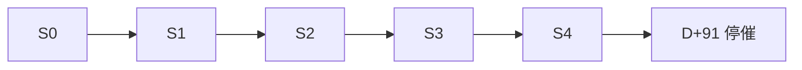

# MOCASA 催收系统升级 — Phase 1 渠道编排规格

> **版本**: V1.6  
> **日期**: 2026-07-24  
> **范围**: 仅覆盖菲律宾市场  
> **模块**: `collection-channel`（策略子层）  
> **关联文档**: [核心引擎规格](../MOCASA催收系统升级_Phase1_核心引擎规格.md)、[架构设计](../MOCASA催收系统升级_Phase1_架构设计文档.md)、[PRD](../MOCASA催收系统升级_Phase1_产品需求文档_PRD.md)、[collection-channel 总规格](./MOCASA催收系统升级_Phase1_collection-channel总规格.md)、[渠道模板清单](./MOCASA催收系统升级_Phase1_渠道模板清单与配置.md)、[HANDOFF.md](../HANDOFF.md)
>
> **V1.6**：前置 **Stage × 渠道一览**；删参考 SQL；精简已决待办。  
> **V1.5**：难催不含 PTP；Offer/F10 → Phase 2；`strategyTone` Phase 1 固定 STANDARD。

---

## 目录

- [方案概述](#方案概述)
- [1. Phase 1 触达一览（Stage × 渠道）](#1-phase-1-触达一览stage--渠道)
- [2. 设计原则与编排范式](#2-设计原则与编排范式)
- [3. 系统形态与人机双轨](#3-系统形态与人机双轨)
- [4. 阶段与生命周期](#4-阶段与生命周期)
- [5. 产品形态与 Max DPD](#5-产品形态与-max-dpd)
- [6. 策略标记（STANDARD / FIRM）](#6-策略标记standard--firm)
- [7. 计划机制与护栏](#7-计划机制与护栏)
- [8. 话术槽位](#8-话术槽位)
- [9. 事件处理](#9-事件处理)
- [10. 两系统一致性](#10-两系统一致性)
- [11. 效果评估](#11-效果评估)
- [12. 开放依赖](#12-开放依赖)
- [13. 引擎/infra 映射](#13-引擎infra-映射)

---

## 方案概述

现网以 SMS BLAST + 人工预测式为主，缺 Push/Email/AI 统一编排；三期 DPD 按 bill 计导致阶段/金额口径不一致；人机无互斥。

Phase 1 新建 **机器轨策略引擎**：在合规护栏内最大化回收，同时保护自营品牌。

| 维度 | Phase 1 主张 |
|------|----------------|
| 编排 | Stage 计划 + 事实标记（难催→FIRM；投诉→冻结）；不做 Persona/ML |
| 阶段 | 仅 S0–S4（D-3~D+90）；**D+91 完全停催** |
| 渠道 | Push + SMS + Email + AI 外呼；无 Viber |
| 人机 | S1–S4 **AI 为主**；人工仅例外（需人工跟进 / 争议 / 客服指定） |
| 不做 | **Offer/F10 减免**；**PTP 策略**；条件 Email / 无互动判定 |

```
D-3~D0   S0  到期前提醒（无语音）
D+1~3    S1  早期逾期 · 全员 STANDARD
D+4~15   S2  中期 · 可 FIRM
D+16~30  S3  中晚期 · 同时间表 + Pay Now 话术（无 Email）
D+31~90  S4  晚期 · D+61 起降为 1 呼/日
D+91+    停催 · 零主动触达
```

---

## 1. Phase 1 触达一览（Stage × 渠道）

> 本节为 **生产编排 SSOT**。目标态多封 Email / 条件 Email 仅作 Phase 2 预留，不写入 plan。

### 1.1 总表：每个 Stage 各渠道做什么

| Stage | DPD | SMS | Push | Email（14:00） | AI 外呼 | Tone | 话术重点 |
|-------|-----|-----|------|----------------|---------|------|----------|
| **S0** | D-3~D0 | 每日 08:00（Push 优先，失败→SMS） | 同左主槽 | **仅 D0** 一封 | ❌ 无 | 仅 STANDARD | 友好提醒；禁 Collections；D-3 防诈骗 |
| **S1** | D+1~3 | 每日 08:00 | 每日 12:00（失败→SMS） | **仅 D+1** | AI **最多 2 次/日**（上午首呼 + 未通则下午补呼） | 仅 STANDARD | 正式逾期通知 + 还款短链 |
| **S2** | D+4~15 | 每日 08:00 | 每日 12:00 | **仅 D+4** | 同 S1（最多 2 次/日） | STANDARD / FIRM | Risk Collection；无减免金额 |
| **S3** | D+16~30 | 每日 08:00 | 每日 12:00 | ❌ **全程不发** | 同 S1（最多 2 次/日） | STANDARD / FIRM | 同 S2 时间表；**Pay Now** 加重 |
| **S4a** | D+31~60 | 每日 08:00 | 每日 12:00 | **D+31** | 同 S1（最多 2 次/日） | STANDARD / FIRM | Remedial / 催告函 |
| **S4b** | D+61~90 | 每日 08:00 | 每日 12:00 | **D+75** | AI **仅 1 次/日**（无下午补呼） | STANDARD / FIRM | 同左；强度下调 |
| **停催** | ≥91 | ❌ | ❌ | ❌ | ❌ | — | 仅客户进线/App 还款 → 人工可回拨 |

### 1.2 日时间表（未还款）

<a id="74-s0--到期前提醒"></a>
<a id="79-email-发送原则s0s4"></a>

**S0（无语音）**

| 时间 | 渠道 | 日块 | scriptSlot（要点） |
|------|------|------|-------------------|
| 08:00 | Push→SMS | D-3 / D-2 | `S0_REMINDER`（D-3 含防诈骗） |
| 08:00 | Push→SMS | D-1 | `S0_REMINDER_URGENT`（明日到期） |
| 08:00 | Push→SMS | D0 | `S0_DUE_TODAY`（今日到期 + Pay Now） |
| 14:00 | Email | D0 | `S0_DUE_TODAY_EMAIL` |

**S1 / S2 / S3 / S4a（标准日骨架）**

| 时间 | 渠道 | 说明 |
|------|------|------|
| 08:00 | SMS | 首触；S2+ 按 Tone 选 `*_STANDARD` / `*_FIRM`；S3 Pay Now 加重 |
| 09:15+ | **AI 第 1 次外呼** | 当日上午主呼；LTH 排队 |
| 12:00 | Push→SMS | 午间；无 token / 投递失败 → 同槽改 SMS（不计第二次触达） |
| 14:00 | Email | **仅**下表里程碑日；其余日无 Email step |
| 14:00+ | **AI 第 2 次外呼（补呼）** | **仅当**第 1 次未接通/忙/失败；若第 1 次已接通 → **取消**补呼 |

**S4b（D+61~90）**：同上，但 **不做第 2 次补呼**（每日最多 1 次 AI）。

> 工程里偶称 Wave-1 / Wave-2，即上表「第 1 次外呼 / 第 2 次补呼」，不是两个渠道。

### 1.3 Phase 1 Email 里程碑（全旅程仅 5 封）

| DPD | Stage | scriptSlot | 内容 |
|-----|-------|------------|------|
| 0 | S0 | `S0_DUE_TODAY_EMAIL` | 到期日友好提醒 + 防诈骗 |
| 1 | S1 | `S1_EMAIL_OVERDUE_NOTICE` | 首次正式逾期通知 |
| 4 | S2 | `S2_EMAIL_ENTRY` | 进 S2；可写「还款窗口收窄」，**不写**减免额 |
| 31 | S4 | `S4_EMAIL_ENTRY` | 进 S4 催告函 |
| 75 | S4 | `S4_EMAIL_PRE_CLOSE` | final review 预告（`assignment_date`=due+91；禁写委外/停催） |

**明确不发**：S1 D+3、S2 D+7/12、S3 全部、S4 D+45/60；全部条件 Email（16:00）。

### 1.4 各渠道职责一句话

| 渠道 | 职责 | Phase 1 注意 |
|------|------|----------------|
| **SMS** | 每日主触达；还款短链 | 通知中心 `contentType=collection` |
| **Push** | 午间轻触达 | 失败/无 token → **同槽 SMS**；一次 `dispatch` |
| **Email** | 里程碑正式通知（非日更） | 仅 5 个 DPD；无邮箱 → Guard `NO_EMAIL` SKIP |
| **AI 外呼** | S1+ 主回收手段 | 引擎只写 `trigger_time`；排队在 LTH；上午已接通则当日不再补呼 |
| **人工** | 例外池 | **不进** plan；无 `HUMAN_CALL` step |

### 1.5 渠道随 Stage 的差异（读表要点）

- **节奏**：S1–S4a 日槽位时间相同；差异主要在 **话术** 与 **Email 是否发**。
- **S0 特殊**：无 AI、无人工池；Push/SMS 友好口径。
- **S3 特殊**：数字渠道照跑，**零 Email**（控频）。
- **S4 特殊**：D+61 起不做下午补呼；D+75 发停催前预告信。
- **Tone**：仅 S2+ 可 FIRM；S0/S1 恒 STANDARD。Phase 1 接入层现 **固定写 STANDARD**（FIRM 口径见 §6，接线后生效）。

---

## 2. 设计原则与编排范式

1. **只对事实差异化**：历史曾 S2+、三期并发逾期、投诉 → 策略；A 卡写入 snapshot 供分析/排队，**不拆 plan**。Phase 1 **不做 PTP** 作策略输入。
2. **错误决策不如不做**：无 gold_window / INTENSIVE / 4-Persona；≈8 套骨架（S0–S4 STANDARD + S2–S4 FIRM）。
3. **能力分期**：Phase 1 = 规则 + 事件；DecisionEngine / Offer / PTP / 条件 Email → Phase 2。
4. **北极星=回收，客诉=护栏**：触线优先砍下午补呼或 S4 晚期外呼。

```
plan = f(Stage, Tone)
Tone ∈ { STANDARD, FIRM }   # FIRM 仅 S2+
投诉/争议 → ExecutionGuard 冻结（非 Tone）
```

---

## 3. 系统形态与人机双轨

| 项 | 方案 |
|----|------|
| 形态 | 机器轨（新系统）+ LTH 人工轨（现网） |
| 机器轨 | Push / SMS / Email / AI |
| 人工轨 | 仅例外外呼；不进 `ContactPlan` |
| 实时转人工 | 不做常规切换；紧急 **Override**（§7.3） |

| Stage | 机器轨 | 人工轨 |
|-------|--------|--------|
| S0 | Push/SMS/Email | 不拨 |
| S1–S4 | AI + SMS/Push/Email | 需人工跟进 / 争议 / 客服指定 |
| D+91+ | 零主动触达 | 客户进线可回拨 |

**不做**：按 DPD/金额批量转人工；按金额拆 cadence。

<a id="35-phase-1-实现范围"></a>

### 3.5 Phase 1 裁剪

| 主题 | Phase 1 | Phase 2 |
|------|---------|---------|
| AI | 可对话；disposition → 推进/中断 | — |
| 条件 Email / 无互动 | **不实现** | 接入后 Guard 判定 |
| Email | 仅 §1.3 五封里程碑 | 扩里程碑 + 条件信 |
| VoiceQueue | 引擎不管；LTH 排队 | 可选 channel 内队列 |
| Offer / PTP | **不做** | F10；`PTP_EXPIRED` |

**步骤完成**：SMS/Push/Email 在 `dispatch` 成功即 `STEP_COMPLETED`；AI 等 `CHANNEL_CALLBACK`。

执行层对接见 [collection-channel 总规格](./MOCASA催收系统升级_Phase1_collection-channel总规格.md)。

---

## 4. 阶段与生命周期

| Stage | Max DPD | 定位 |
|-------|---------|------|
| S0 | D-3~D0 | 到期前提醒（机器轨接管，信贷侧关停同期发送） |
| S1 | D+1~3 | 早期 / FPD |
| S2 | D+4~15 | 中期 Risk Collection |
| S3 | D+16~30 | 中晚期 Pay Now |
| S4 | D+31~90 | 晚期 Remedial |
| — | ≥91 | **无 Stage** → `CASE_CEASED` 完全停催 |

DPD 按 **Loan Max DPD**（各逾期 bill 最大值）。

<a id="42-完全停催d91"></a>

D+91 0:00：cancel 全部 pending；不再 `PlanFactory.create`；案件 `CEASED`（≠ 还清 `COMPLETED`）。非核销；欠款仍在。



| 状态 | 主动触达 |
|------|----------|
| 还款结清 | 停 |
| 主动催收中（DPD -3~90） | S0–S4 |
| 完全停催（91+） | 无 |

---

## 5. 产品形态与 Max DPD

- **一期**：一笔结清；**三期**：3 个 bill；用户仅一笔在贷 → case = loan。
- **应还 `{amount}`**：已到期未结清合计；未到期不计（无加速条款）。
- **还款**：bill-settled 继续计划；全部期结清 → COMPLETED。
- **Max DPD 下降**：Stage 可回退并重建 plan；**难催/FIRM 不回退**（整笔结清后新 loan 重置）。

### 5.3 Offer（Phase 2）

<a id="53-offer-与-bill-维度"></a>

Phase 1 **不交付** F10；snapshot 无 offer 字段；模板不写减免比例/金额。话术变量：`{name}/{amount}/{dpd}/{repaymentUrl}` 等。详见 [PRD](../MOCASA催收系统升级_Phase1_产品需求文档_PRD.md)、[email-templates](../email-templates/README.md)。

---

## 6. 策略标记（STANDARD / FIRM）

<a id="6-策略标记替代-persona-分类"></a>

| 标记 | 触发 | 作用 | 生命周期 |
|------|------|------|----------|
| **难催 → FIRM** | 历史曾 S2+（**不含本笔首次逾期波次**）**或** 三期并发逾期 ≥2 | S2+ 用 FIRM 话术 | 只硬化不回退 |
| **投诉/争议 → 冻结** | 投诉/争议识别 | Guard 暂停机器触达 | 人工解除前 |

**Phase 1 不做**：PTP 履约/到期、连续无互动 → 难催。  
**接线**：接入层现固定 `strategyTone=STANDARD`；下列为 FIRM 接入后 SSOT。渠道已支持 snapshot=`FIRM` 时选 `*_FIRM`。

```
if 投诉 or 争议 → FREEZE
else if hard_to_collect AND stage ∈ {S2,S3,S4} → FIRM
else → STANDARD   # S0/S1 恒 STANDARD
```

```
hard_to_collect =
    ever_reached_s2_overdue
 OR (三期 AND concurrent_overdue_bills >= 2)
```

### 6.1 难催子条件口径（ingestion）

<a id="531-难催子条件计算口径"></a>
<a id="631-难催子条件计算口径ingestion-层"></a>

**Max DPD / bill_dpd**（观察日 `as_of_date`，PHT）：

```text
bill_dpd = DATE_DIFF(as_of_date, due_date, DAY)
  条件：due_date <= as_of_date
    且 (clear_date IS NULL OR clear_date > due_date)
max_dpd = MAX(bill_dpd)；S2+ ⇔ max_dpd >= 4
```

**`ever_reached_s2_overdue`**（TRUE 当其一）：

| | 条件 |
|--|------|
| A | 用户在当前 loan **之前** 任一历史 loan 曾 `max_dpd >= 4` |
| B | 本笔曾 S2+ → 还款使 max_dpd&lt;4 → 再逾且 max_dpd≥4（复发波次） |

FALSE：本笔处于 **首次逾期波次**（从未 S2+→回落）且用户无历史 S2+——即使已滚到 S3/S4 也不因本条件硬化。

实现：维护 `user_ever_reached_s2` + `loan_had_s2_plus_cure`（或等价状态位）。结清开新 loan → B 重置；A 随用户保留。

**`concurrent_overdue_bills`**：观察日已到期且未结清的 bill 数；**仅三期** ≥2 触发。一期不会触发。与 Stage 独立，但 FIRM 话术仅 S2+ 生效。

**场景速查**

| 场景 | ever_s2 | 并发≥2 | Stage | Tone |
|------|---------|--------|-------|------|
| 首次波次 D+4 | F | 0 | S2 | STANDARD |
| 首次波次滚到 D+30 | F | 0 | S3 | STANDARD |
| 老户曾 D+10，新贷 D+4 | T | 0 | S2 | FIRM |
| 本笔曾 D+20 还到 D+2 再逾 D+5 | T | 0 | S2 | FIRM |
| 三期两期同时未还 | — | 2 | S2+ | FIRM |

**默认口径（已采用）**：历史 loan 计已结束笔；仅 S1 逾期（从未 D+4）不计 ever_s2；「不含首次」= **整段首次波次**（非仅 D+4 当日）。

### 6.2 快照契约

计划创建时写入 `context_snapshot`；运行时 SPI **只读**。标记变化 → 重算 snapshot → **cancel plan → 同 Stage 重建**。禁止 Orchestrator 线程内改 tone。还款/冻结由 PreFlight / Guard **实时**读。

---

## 7. 计划机制与护栏

### 7.1 术语（Phase 1 相关）

| 术语 | 含义 |
|------|------|
| 里程碑 Email | 固定 DPD 日 14:00 必发（仅 §1.3 五天） |
| 条件 Email | 16:00 额外信（无互动触发）— **Phase 2** |
| 同时间表 | 槽位时间/渠道相同，话术或 Email 节点不同 |
| Wave-1 / Wave-2 | 工程别名：当日 **第 1 次 AI 外呼** / **第 2 次补呼**；上午已接通则无补呼 |
| 晚进案 | 跳过已过 DPD 日块，**不追溯补发** |
| 执行前检查 | 已还/冻结 → 取消后续；Phase 1 不校验 PTP |

### 7.2 结构

```
PlanTemplate { match:{ stage, tone }, dayBlocks, exhaustion }
DayBlock { dpd_day, slots }     # 0:00 PHT 切日
Slot { time, channel(+fallback), scriptSlot }
```

| 机制 | 方案 |
|------|------|
| 建 plan | **一 Stage 一次** `PlanFactory.create`，展开全部未过期日块 |
| 升阶 | ingestion `STAGE_CHANGED`，非每日穷尽重建 |
| Push fallback | 同槽改 SMS，不计第二次触达 |
| 外呼时间 | `trigger_time` 09:15 / 14:30；并发由 LTH |

### 7.3 人机互斥与 Override

同案同日：常规催收下 **AI 与人工二选一**。紧急 Override：

| 事件 | 引擎 | 人工 |
|------|------|------|
| 争议 | cancel 当日 pending AI；机器触达暂停；`human_dial_override` | 可立刻核实外呼 |
| 需人工跟进 | cancel AI；`human_dial_eligible` + Override | 可立刻外呼 |
| 投诉冻结 | 暂停机器全部触达 | 是否外呼按客服 SOP |
| 客户进线 | 不新增机器外呼 | 可回拨（含停催后） |

| 层级 | 规则 |
|------|------|
| 硬停 | 已还 → 取消当日及后续 |
| 软停 | 投诉/争议冻结 |
| 接通未还 | 取消当日下午补呼；SMS/Push/Email 仍可 |
| 语音上限 | ≤2/案/日（S4b≤1）；Override 核实呼可不计入催收上限（合规 SOP） |

### 7.4 频率与护栏

- 触达窗：**08:00–21:00 PHT**
- S1–S4a：AI ≤2/日；S4b：≤1/日
- 投诉率目标 ≤0.5‰；触线优先砍下午补呼

---

## 8. 话术槽位

<a id="84-各-stage-话术槽拟议"></a>

```
话术 = f(Stage, Tone, Channel, Product)
Language: Phase 1 英文（Tagalog → Phase 2）
品牌: 正文 MOCASA；还款 SKYPAYLOANS
```

| 片段 | 适用 |
|------|------|
| 防诈骗 | S0 起 |
| Pay Now / 深链 | S1+ |
| Collections | S1+；S0 禁用 |
| remedial | S4 |
| 减免 offer | **Phase 2** |

**Phase 1 生产槽（与 §1 对齐）**

| Stage | SMS / Push | Email（发） | AI |
|-------|------------|-------------|-----|
| S0 | `S0_REMINDER` / `_URGENT` / `_DUE_TODAY` | `S0_DUE_TODAY_EMAIL` | — |
| S1 | `S1_SMS_STANDARD` · `S1_PUSH_STANDARD` | `S1_EMAIL_OVERDUE_NOTICE` | `S1_VOICE_PRIMARY` / `_RETRY` |
| S2 | `S2_SMS_STANDARD` / `_FIRM` · `S2_PUSH_STANDARD` | `S2_EMAIL_ENTRY` | `S2_VOICE_*` |
| S3 | `S3_SMS_*`（Pay Now↑）· Push STANDARD | — | `S3_VOICE_*` |
| S4 | `S4_SMS_*` · Push | `S4_EMAIL_ENTRY` · `S4_EMAIL_PRE_CLOSE` | `S4_VOICE_PRIMARY`；`_RETRY` 仅 D+31~60 |

目标态保留但不发的槽（D+3/7/12、S3 Email、条件 Email 等）见 [渠道模板清单](./MOCASA催收系统升级_Phase1_渠道模板清单与配置.md) / email-templates，**PlanFactory 不生成**。

旧 STAGE 1–4 → 新 S1–S4 基底重写；S0/Push/Email/语音新写。FIRM = STANDARD + urgency（无 offer 加宽）。

---

## 9. 事件处理

| 事件 | 处理 | 来源 |
|------|------|------|
| 还款 | 重算 Max DPD；loan 结清 → COMPLETED | 上游/支付 |
| 阶段变更 | `STAGE_CHANGED` → 重建 plan | ingestion |
| 完全停催 | `CASE_CEASED` | ingestion 日切 |
| 渠道/AI 回调 | 推进 / 分支（无 PTP 子流程） | LTH |
| 争议 / 需人工 / 投诉冻结 | 见 §7.3 | App/客服 |
| 客户进线 | 人工可回拨 | App/客服 |
| PTP | **Phase 2**；Phase 1 不记录、不作策略输入 | — |

竞态：`PLAN_STEP_DUE` vs 还款 → `SELECT FOR UPDATE` + 执行前检查。DLQ 重放前须过合规时段。

---

## 10. 两系统一致性

Phase 1 两系统独立运行：

| 子项 | 方案 |
|------|------|
| 触达窗 / 还款停催 / 投诉冻结 | 各读配置/信号，独立执行 |
| 人工 | 仅 `human_dial_eligible` 等标签例外户 |
| case_id | 全局统一 |
| timeline | 各记各的；整合阶段以新系统为准 |

共享频控、统一 timeline → 整合阶段。

---

## 11. 效果评估

| 层 | 指标 |
|----|------|
| 北极星 | Stage Recovery/Cure、Roll-rate |
| 漏斗 | 投递→触达→响应→7 日还款 |
| 护栏 | 投诉率 ≤0.5‰、退订 |
| 实验 | FIRM vs STANDARD（FIRM 接线后） |

上线前须抽 **baseline**；机器/人工归因隔离。投诉上升回退顺序：砍下午补呼 → S4 维持 1 呼 → 缩 dial_window → 停 FIRM 实验。

---

## 12. 开放依赖

仅保留仍影响上线/接线的项：

| # | 事项 | 确认方 |
|---|------|--------|
| 1 | **FIRM 接线**：接入按 §6 写 `strategyTone`（现固定 STANDARD） | 数据接入 / 业务 |
| 2 | S0 **信贷侧关停** 同期发送（防双发） | 信贷 / 研发 |
| 3 | 投诉/冻结 **信号源** → ExecutionGuard | 客服 / 产品 |
| 4 | **Override** 与 LTH/坐席 App 联调 | 研发 / LTH / 催收 |
| 5 | 人工例外池 filter（`human_dial_eligible`） | 催收运营 / 研发 |
| 6 | disposition 枚举与 LTH 对齐 | LTH / 产品 |
| 7 | 上线前 **baseline**；话术英文定稿 | 数据 / 业务 |
| 8 | FIRM vs STANDARD **A/B** 口径（接线后） | 研发 / 数据 |

已决/后移不单列：AI 可对话；Offer/F10；PTP 全链路；VoiceQueue 在 LTH；条件 Email；发薪日/90+ 低频；D+115 预告信。S4 D+61~90 维持 1 呼/日，baseline 后可做子实验。

---

## 13. 引擎/infra 映射

| 本章 | 落点 |
|------|------|
| §1 / §7 计划 | `PlanFactory` → `t_contact_plan_step.trigger_time` |
| §6 Tone | ingestion → snapshot；现固定 STANDARD |
| §7.3 Override | 引擎中断 + LTH 标签；无 `HUMAN_CALL` |
| §4 停催 | `CASE_CEASED` |
| §3.5 渠道执行 | [collection-channel 总规格](./MOCASA催收系统升级_Phase1_collection-channel总规格.md) |
| 触达窗 | `t_compliance_config` + Guard；DLQ 重放同规则 |

---

> Phase 1 Channel Orchestration Spec **v1.6** — 2026-07-24
