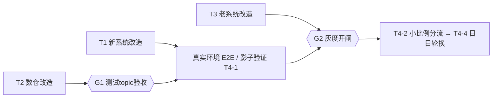

# MOCASA 催收系统升级 Phase 1 — 按日 Owner 路由开发计划

> **状态**：✅ 已确定（分工、依赖与灰度闸门；具体排期数值由各轨道 Owner 评估后补充）  
> **日期**：2026-09-03  
> **技术设计 SSOT**：[按日 Owner 路由改造计划](../MOCASA催收系统升级_Phase1_按日Owner路由改造计划.md)——机制、字段、状态机以其为准，本文只管「谁做什么、依赖谁、什么时候能灰度」  
> **跨团队需求**：[老系统改造需求](../老系统_按日Owner路由改造需求.md)、[数仓改造清单](../数仓_按日Owner路由改造清单.md)

---

## 目录

- [1. 定位与关键判断](#1-定位与关键判断)
- [2. 四轨道工作分解](#2-四轨道工作分解)
- [3. 闸门与依赖](#3-闸门与依赖)
- [4. 已拍板决策](#4-已拍板决策)
- [5. 待拍板项](#5-待拍板项)
- [6. 风险与最长杆](#6-风险与最长杆)
- [修订记录](#修订记录)

## 1. 定位与关键判断

本文是按日 Owner 路由改造的**执行视图**：分工、依赖顺序、灰度闸门。机制设计（缺席对账、归属日、水位门控）与字段/状态机定义分别由改造计划及各 SSOT 承载，本文不重复。

**决定并行度的关键判断**：

> 新系统自身的开发**不被外部依赖阻塞**。L4b / 隔离环境用 mock 的 `owner` 消息即可完整自测缺席对账、迁出取消、重入门控（改造计划 §6.3）。数仓与老系统闸住的是**真实环境验证与灰度开闸**，不是开工。

因此四条轨道立即并行启动，无人等待他人写代码；通往生产的**关键路径 = 老系统改造排期（外部） + 联调灰度**。

## 2. 四轨道工作分解

### T1 新系统（本仓，Owner: 催收系统团队）

| # | 任务 | 内容 | 验收锚点 |
| --- | --- | --- | --- |
| T1-1 | SSOT 收尾 | 基础设施交互规范、管理后台设计文档、测试文档按路由机制更新（改造计划 §6.1 剩余三份） | 文档评审通过 |
| T1-2 | DDL 与 common 契约 | `t_ai_collection` 加 `owner` / `owner_date`；`CancelReason` 加 `ROUTED_TO_LEGACY`；`EventType` 加 `CASE_OWNER_RECONCILED` 及 payload 常量；`owner_reconciled_date` 水位存储；顺带对齐 `db/schema.sql` 与领域模型附录 A 的 `cancel_reason` 注释漂移（schema.sql 多 `CASE_NOT_FOUND`） | 领域模型附录 A 双写一致 |
| T1-3 | 接入层 | `owner` 映射；指纹相同仍刷新归属日；`DpdStageRollHandler` 第一阶段 owner 对账 + 水位持久化 | 数据接入规格 §3 / §4 |
| T1-4 | 服务层 | 投影读写 `owner` / `owner_date`；为引擎提供当日 NEW 归属查询 | 改造计划 §5 服务层行 |
| T1-5 | 引擎 | 路由 `CASE_OWNER_RECONCILED`；迁出取消 / 重入建计划；执行链门控复检（建计划、续建、扫描、PreFlight、dispatch） | 核心引擎规格 §2.1 / §4.4 |
| T1-6 | 调度与管理端 | 到期/超时扫描只拾取当日 NEW；对账空收、迁出残留告警；后台展示归属日与迁出状态 | 改造计划 §5 调度 / 管理后台行 |
| T1-7 | 隔离环境 E2E | mock owner feed 全量跑必测场景 | 改造计划 §7.1 全部场景 |
| T1-8 | 容量预算与压测 | 日日轮换 = 每日对全书 cancel + rebuild；`dailyRoll` 窗口（03:35–05:55 PHT）须在放量前压测 | 全书规模下 06:00 前完成 |

### T2 数仓（Owner: 数仓团队）

改造项与验收详见[数仓改造清单](../数仓_按日Owner路由改造清单.md)。摘要：`owner` 字段、发布范围改为只发 NEW、userId 稳定分桶（比例可配置）、`occurredAt` 归属日语义、迟到/补发规则、每日 Owner 清单发布（老系统 topic）、测试 topic 演练。其中**对比数据集**不闸灰度、只闸效果比较。

### T3 老系统（Owner: 老系统团队，改造由其完成）

需求详见[老系统改造需求](../老系统_按日Owner路由改造需求.md)。摘要：消费日抑制清单（停手）、零收保护、重入重建（不追溯补发）、在途请求不撤回、事实回流。验收核心 = **同 caseId 同日双触达为 0**。

### T4 联调与灰度（Owner: 催收系统团队牵头）

| 步骤 | 内容 | 通过标准 |
| --- | --- | --- |
| T4-1 | 影子验证 | 真实 owner 路由跑通、渠道不触达；对账 / 迁出 / 重入日志与预期一致 |
| T4-2 | 小比例真实分流 | 白名单 ∩ owner=NEW 双门控；双触达 = 0、漏催 = 0 |
| T4-3 | 扩比例 | 观察 ≥3 个完整轮换日；投诉 / 退订无异常；日切窗口按时完成 |
| T4-4 | 日日轮换放开 | 按数仓比例配置常态轮换；删除白名单门控 |

## 3. 闸门与依赖

| 闸门 | 开闸条件 | 被闸住的事 |
| --- | --- | --- |
| **G1** | T2 完成（owner 字段 + 只发 NEW + 分桶 + 清单发布，测试 topic 验收通过） | 真实环境 E2E、影子验证（T4-1） |
| **G2** | T1 全部 + T2 闸门项 + T3 全部 + 频控口径（已拍板，见 §4） | 灰度开闸（T4-2 起的全部真实分流） |

依赖要点：

- T1 对 T2/T3 **无开发期依赖**（隔离环境 mock 自测）；仅 T1-7 之后的真实环境验证依赖 G1。
- T3 需求文档发出即可启动评审，**不等 T1/T2 进度**。
- T2 的清单发布（老系统 topic）与 T3 的清单消费是同一接口的两个端，字段契约以[老系统改造需求 §2](../老系统_按日Owner路由改造需求.md#2-接口每日-owner-抑制清单)为准，双方评审时共同确认。

## 4. 已拍板决策

| 日期 | 决策 | 备注 |
| --- | --- | --- |
| 2026-09-02 | 轮换定位 = **常态日日轮换** | 效果对比的归因混杂为已知接受项，分析按用户日口径并显式声明 |
| 2026-09-02 | Phase 1 **不做**批次完成信号 | 靠 03:00 发完 + 03:35 固定对账 + 零收告警兜底；漏发后再评估 |
| 2026-09-02 | 老系统改造由老系统团队独立完成，本仓只提需求 | 需求文档已备（见头部链接） |
| 2026-09-02 | 批后不得翻案；迟到补发可当日回迁 | 已落数仓契约 / 改造计划 |
| 2026-09-02 | 引擎幂等放宽为「任一时刻仅一个非终态计划」 | 已落核心引擎规格 §4.2 |
| 2026-09-02 | 白名单降级为应急隔离开关（白名单 ∩ owner=NEW），正式分流稳定后删除 | 已落改造计划 §7.2 |
| 2026-09-03 | 跨系统频控 Phase 1 = **已知限制 + 监控** | 日内靠 userId 分桶天然安全（同用户同日单 owner）；跨日/周频控叠加接受为已知限制，上线后监控投诉/退订，Phase 2 基于事实回流补齐 |
| 2026-09-03 | SSOT 先行四份已更新（领域模型 / 核心引擎 / 数据接入 / 数仓契约） | 各文档「变更记录」可查 |

## 5. 待拍板项

| # | 事项 | 推荐默认 |
| --- | --- | --- |
| 1 | 灰度初始 NEW 比例与扩量节奏 | 数仓分桶比例做成配置；初值建议 5%–10%，观察 3–5 个轮换日后扩 |
| 2 | Day-1 失败剧本（新系统对账失败日） | ① 优先修复重跑——owner 对账设计为可重入、可分页，当日修复即当日恢复；② 系统当日不可修复时，走**应急同日清单重发**（数仓以 `batchSeq` 递增重发当日清单，老系统按最新批次全量接管；新系统门控保持关闭）——该通道依赖老系统需求 §2 的 `batchSeq` 机制；③ 均不可行时接受当日 NEW cohort 零触达，次日批次自然恢复 |
| 3 | 两侧告警联动阈值（零收告警、迁出残留、双触达对账） | 上线单中由运维定级，不在本文展开 |

## 6. 风险与最长杆

| 风险 | 说明 | 缓解 |
| --- | --- | --- |
| **老系统排期不可控（最长杆）** | T3 是外部团队交付，直接决定 G2 时间 | 需求本周提交；评审时锁定验收标准（双触达 = 0），避免验收口径后置扯皮 |
| dailyRoll 容量 | 日日轮换把取消/重建变成每日全书动作，03:35–05:55 窗口可能挤爆 | T1-8 压测前置；必要时对账与日切分页参数分开调优 |
| 部分漏发结构性不可见 | 完成信号已决策不做，「2% 消息丢失→静默误迁出→当日漏催」无法从消息流发现 | 数仓 Publisher 侧发布量监控；灰度期每日核对 cohort 触达数 |
| 效果对比归因混杂 | 日日轮换固有：昨日 NEW 触达影响今日 LEGACY 侧回款 | 分析按用户日口径 + 显式声明混杂；如需干净结论，用固定 cohort 辅助视图（改造计划 §8） |
| 回滚日的老系统抑制残留 | 全 LEGACY 日清单为空，若数仓不发空批次 marker，老系统会永久维持昨日抑制 | 数仓清单契约已含**空批次 marker**（数仓清单 #7 / 老系统需求 §2） |

---

## 修订记录

| 日期 | 变更 |
| --- | --- |
| 2026-09-03 | 初版：四轨道工作分解、G1/G2 闸门、已拍板决策 8 项（含当日频控口径）、待拍板 3 项、风险与最长杆。配套产出[老系统改造需求](../老系统_按日Owner路由改造需求.md)、[数仓改造清单](../数仓_按日Owner路由改造清单.md) |
