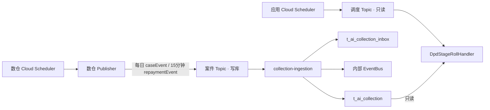

# Phase 1 数仓 Pub/Sub 交付契约

> **版本**: Phase 1 · 菲律宾市场 · 2026-08-17
> **读者**: 数仓 / Publisher 开发、运维、新催收接入  
> **本文是数仓对外唯一 SSOT**（由原「对齐清单」与「Pub/Sub 交付说明」合并）。接入消费、ACK、日切实现 → [数据接入规格](./MOCASA催收系统升级_Phase1_数据接入规格.md)；调度 Topic 部署 → [基础设施 §5](./MOCASA催收系统升级_Phase1_基础设施交互规范.md#5-定时调度cloud-scheduler--pubsub--应用订阅)。

---

## 目录

- [1. 封面与边界](#1-封面与边界)
  - [1.1 入站顺序与 Publisher 任务](#11-入站顺序与-publisher-任务)
  - [1.2 两条管道与 GCP 资源](#12-gcp-资源)
- [2. 计算口径与事件契约](#2-计算口径与事件契约)
  - [2.1 两类事实事件](#21-两类事实事件)
  - [2.2 消息字段](#22-消息字段)
  - [2.3 消息样例](#23-消息样例)
- [3. 发布可靠性](#3-发布可靠性)
- [4. 场景矩阵](#4-场景矩阵)
- [5. 日切窗口与批次门控](#5-日切窗口与批次门控)
- [6. 上线验收](#6-上线验收)
- [附录 B：inbox 只读说明](#附录-binbox-只读说明数仓无需实现)

---

## 1. 封面与边界
<a id="1-封面与边界"></a>

数仓只算、只发消息，**不写**催收业务库；接入层是 `t_ai_collection` 的**唯一写入者**，引擎消费接入提交后的内部事件。**案件投影**即 `t_ai_collection`：接入层按消息写入的当前案件行，包含 DPD、阶段、金额、联系人和催收状态；下文「投影」均指此表。

### 1.1 入站顺序与 Publisher 任务
<a id="11-入站顺序与-publisher-任务"></a><a id="入站顺序"></a><a id="11-publisher-任务"></a>

数仓先计算案件快照与还款增量，Publisher 再发布案件消息；接入层校验并写入投影，事务提交后才发布内部事件。

| 环节 | 功能 |
| --- | --- |
| 数仓加工 | 计算案件完整快照和还款增量 |
| 数仓 Publisher | 每日发布完整 `caseEvent`；成功还款发布增量 `repaymentEvent`；不发布阶段变更或停催事件 |
| 接入校验与去重 | 校验字段；隔离毒丸；跳过重复 `eventId` 或相同 `caseVersion` 快照 |
| 接入投影写入 | 同事务写 `t_ai_collection_inbox`，并更新 `t_ai_collection` |
| 内部事件驱动 | 事务提交后发布内部事件；首次入催建计划，已有周期仅刷新投影 |

数仓**不得直连**业务库写 `t_ai_collection`。

**Publisher 任务**

| 任务 | 时区 | 频率 | 输出 | 关键约束 |
| --- | --- | --- | --- | --- |
| 每日案件快照 | `Asia/Manila` | 每日，**03:00 PHT 前发完** | 每案一条 `caseEvent/CASE_INGESTED` | `dpd >= -3` 逐条完整快照；`caseVersion` 为内容指纹（[§3.2](#42-caseversion)）；走 [§1.2](#12-gcp-资源) 案件 Topic；已有周期由接入层按指纹决定刷新或略过 |
| 还款扫描 | `Asia/Manila` | 每 15 分钟 | 每案一条 `repaymentEvent/REPAYMENT` | 仅成功正向还款的**增量**；账务结清状态落库后至少等待 **360 秒**；同样走案件 Topic |

每条消息独立 publish。消息体使用单案 `{dataType, data}` envelope；`data` 只承载一个案件或还款事实，不得包装多案。Publisher 可在单次任务中连续/并发发多条。

### 1.2 两条管道与 GCP 资源
<a id="12-gcp-资源"></a><a id="60-gcp-资源"></a><a id="两条管道"></a>

[§1.1](#11-入站顺序与-publisher-任务) 的每日快照与还款扫描只发到**案件 Topic**。日切不走这条管道：应用 Scheduler 打**调度 Topic**，只读已写入的 `t_ai_collection`。



| 管道 | 谁触发 | 写 `t_ai_collection` 吗 | 产出 |
| --- | --- | --- | --- |
| 案件 Topic | GCP：数仓 Cloud Scheduler → Publisher → 本 Topic | 是。接入层按 `caseVersion` 指纹写入 | 内部 `CASE_INGESTED` / `REPAYMENT_RECEIVED` / `CASE_BALANCE_UPDATED` |
| 调度 Topic | GCP：应用 Cloud Scheduler → 本 Topic（只发 `job=dailyRoll` tick，不含案件快照） | **否**。日切只读 `t_ai_collection` | 应用比对后再发内部事件；不是读到就发。有变化才 `STAGE_CHANGED` / `CASE_CEASED` |

- 两套 Topic / Scheduler / IAM / 告警**必须物理分离**。
- 生产上都是 Cloud Scheduler 在 GCP 往各自 Topic 发 Pub/Sub。
- Cloud Scheduler 只往调度 Topic 打一个 `job=dailyRoll` 的 tick，里面没有案件快照；应用收到后分页读 `t_ai_collection`，与活跃计划比对：
  - 已结清 → 跳过
  - `dpd≥91` 且有活跃计划 → `CASE_CEASED`
  - 阶段变了（含回退）→ `STAGE_CHANGED`
  - 无变化 → 不发

**案件 Topic 资源（落地上表「案件 Topic」行）**

| 环境 | Project | 案件 Topic | 案件 Subscription |
| --- | --- | --- | --- |
| 生产 / Pilot | `fintech-all` | `intelligent-collection-cases-v1` | `intelligent-collection-cases-v1-sub` |

与旧 `collection-cases` **完全分离**。Topic 须开启消息保留与 DLQ；保留期、最大投递次数、DLQ subscription 名称由运维在上线单填写并验收。

**调度 Topic 资源（落地上表「调度 Topic」行；产品已确认命名）**

| 环境 | Project | 调度 Topic | 调度 Subscription |
| --- | --- | --- | --- |
| 生产 / Pilot | `fintech-all` | `intelligent-collection-schedule-v1` | `intelligent-collection-schedule-v1-sub` |
| L4b | — | 不走调度 Topic；`POST /mock/daily-roll` | — |

调度 Topic 由**应用** Cloud Scheduler 发布，数仓不往该 Topic 发消息。部署与 IAM 见 [基础设施 §5](./MOCASA催收系统升级_Phase1_基础设施交互规范.md#5-定时调度cloud-scheduler--pubsub--应用订阅)。

## 2. 计算口径与事件契约
<a id="2-计算口径与事件契约"></a><a id="2-数仓要算什么"></a><a id="3-数仓要发什么"></a><a id="6-pubsub-交付契约"></a>

### 2.1 两类事实事件
<a id="21-两类事实事件"></a><a id="31-两类事件"></a><a id="61-attribute"></a>

外部 Topic **只允许**两类事实事件。阶段变更、D+91 停催由新系统日切读投影后**独占**产出。接入层收到外部 `CASE_STAGE_CHANGED` / `CASE_CEASED` 按毒丸 ack 并告警。
每条 Pub/Sub message 的 body 固定为 `{dataType, data}`；`dataType` 位于 body 顶层，`data` 是单案业务 payload。可额外携带同值的 Pub/Sub attribute，接入不依赖该 attribute。

| body `dataType` | `data.eventType` | 发布条件 |
| --- | --- | --- |
| `caseEvent` | 可省略；有值时仅允许 `CASE_INGESTED` | 每日完整快照（`dpd >= -3` 逐案） |
| `repaymentEvent` | `REPAYMENT` | 成功正向还款增量，延迟 360 秒 |

`caseEvent` 是完整案件快照，含身份、产品、DPD、stage、金额、下一期提醒和联系人设备信息。`repaymentEvent` 是增量：**不得**携带 `caseVersion`、`product`、`borrower`、`device` 或 `collectionStatus`；它必须携带还款后的 `dpd`、`stage`、金额和下一期提醒字段。接入在已有投影上合并这些运行态字段；`stage` 不直接改变计划，阶段事件仍由日切独占产生。

### 2.2 消息字段
<a id="22-消息字段"></a><a id="22-dpd金额与催收状态"></a><a id="23-信封字段对照与样例"></a><a id="32-公共信封"></a><a id="62-公共信封"></a><a id="24-投影字段对照"></a><a id="4-t_ai_collection-当前案件表"></a>

两类事件都有 body envelope。`caseEvent` 的 `data` 带完整快照；`repaymentEvent` 的 `data` 只带本次还款和可更新运行态的增量字段。`eventId` / `caseVersion` 见 [§3](#3-发布可靠性)。`t_ai_collection` 由接入层按消息写入，数仓不写该表。

#### Body envelope

| 字段 | 必填 | 取值 |
| --- | --- | --- |
| `dataType` | 是 | `caseEvent` 或 `repaymentEvent`；用于路由 |
| `data` | 是 | 单案业务 payload object；不得含多案数组 |

#### `caseEvent` 字段
`dataType=caseEvent`。每日对 `dpd >= -3` 逐案发一条；以下字段均位于 `data`。

| 消息字段 | `t_ai_collection` 列名 | 口径 |
| --- | --- | --- |
| `eventId` | — | publish 前 UUID；复用见 [§3.1](#41-eventid) |
| `eventType` | — | 可省略；有值时固定 `CASE_INGESTED` |
| `occurredAt` | `updated_at` | `yyyy-MM-dd HH:mm:ss`，按 `Asia/Manila` 解释 |
| `caseId` | `case_id` | `loan_id`，可转 `Long`；非法进隔离/告警，不得静默跳过 |
| `userId` | `user_id` | 用户标识 |
| `caseVersion` | `case_version` | 内容指纹（hex 字符串）；公式见 [§3.2](#42-caseversion) |
| `product` | `product` | `t_loan.product_id` 的数字字符串；`3`、`4` 表示 3 期产品 |
| `dpd` | `dpd` | 见下方 [DPD 与 stage](#21-dpd-与阶段映射) |
| `stage` | `stage` | 由 `dpd` 映射；`dpd >= 91` 可空 |
| `collectionStatus` | — | 数仓展示字段；接入不依赖它，仍按 `dpd` / `isFullCleared` 派生落库状态 |
| `overduePrincipal` | — | 已到期未结清本金；金额拆分对账字段 |
| `overdueInterest` | — | 已到期未结清利息；金额拆分对账字段 |
| `overdueAmount` | `overdue_amount`、`total_outstanding` | 已到期未结清金额，**已含罚息**；映射为对客 `totalOutstanding` |
| `overduePenaltyAmount` | `penalty_amount` | 已到期未结清罚息；映射为 `penaltyAmount` |
| `upcomingAmount` | `upcoming_amount` | 仅三期产品、下一期 D-3～D0 的该期金额；只用于提醒 |
| `nextDueDate` | `next_due_date` | `0` 或 `null` 表示无下一期提醒；其他值为 `yyyy-MM-dd`，不能替代历史 `dueDate` |
| `borrower.name` | `borrower_name` | 借款人姓名 |
| `borrower.phone` | `borrower_phone` | 可传菲律宾本地 10 位手机号；接入规范化为 E.164 |
| `borrower.email` | `borrower_email` | 空不阻断案件，Email 渠道跳过 |
| `borrower.language` | `borrower_language` | Phase 1 固定 `en` |
| `device.pushToken` | `push_token` | 空则 Push→SMS |
| — | `synced_at` | 接入层落库时间，数仓不写 |

#### `repaymentEvent` 字段
`dataType=repaymentEvent`，`data.eventType=REPAYMENT`。仅成功正向还款；这是**增量 payload**，不得复制 `caseEvent` 快照字段。

| 消息字段 | `t_ai_collection` 列名 | 口径 |
| --- | --- | --- |
| `eventId` | — | 本次还款事实的 UUID；重试/重投复用 |
| `eventType` | — | 固定 `REPAYMENT` |
| `occurredAt` | `updated_at` | ISO-8601，带 `+08:00`；兼容 `yyyy-MM-dd HH:mm:ss`（按 `Asia/Manila`）；接入拒绝较早增量覆盖新投影 |
| `caseId` | `case_id` | 关联已存在的完整 `caseEvent` 投影 |
| `userId` | `user_id` | 用户标识 |
| `repayTime` | — | 还款发生时间，ISO-8601，带 `+08:00` |
| `paidAmount` | — | 本笔成功还款金额 |
| `dpd` | `dpd` | 还款后的最大逾期天数 |
| `stage` | `stage` | 还款后的阶段；D+91 可空，不直接产生 `STAGE_CHANGED` |
| `overdueAmount` | `overdue_amount`、`total_outstanding` | 已到期未结清金额，已含罚息 |
| `overduePenaltyAmount` | `penalty_amount` | 已到期未结清罚息，包含在 `overdueAmount` 内 |
| `upcomingAmount` | `upcoming_amount` | 三期产品下一期 D-3～D0 的该期金额；仅提醒 |
| `nextDueDate` | `next_due_date` | `0` 或 `null` 表示无下一期提醒；仅提醒 |
| `isFullCleared` | `collection_status`（派生） | loan 级全部结清为 `true` |

整笔结清时 `isFullCleared=true` 且 `overdueAmount=0`；接入派生 `SETTLED`。发布延迟见 [§3.3](#43-还款延迟)。

#### DPD 与 stage
<a id="21-dpd-与阶段映射"></a><a id="41-dpd-与阶段映射"></a>

数仓按内部口径计算 loan 级最大 `dpd`；已结清期不参与。接入不重算，只消费消息中的 `dpd` 与 `stage`。

| DPD | stage | 说明 |
| --- | --- | --- |
| D-3 ～ D0 | S0 | 到期前提醒；`dpd >= -3` 才允许入案 |
| D+1 ～ D+3 | S1 | 早期催收 |
| D+4 ～ D+15 | S2 | 中期催收 |
| D+16 ～ D+30 | S3 | 晚期催收 |
| D+31 ～ D+90 | S4 | 主动催收末段 |
| D+91 及以上 | 无 stage（可空） | 接入派生 `CEASED`，完全停催 |

`dpd <= -4` 不入案、**不发布** `caseEvent`。

#### 映射与派生逻辑
<a id="22-金额计算"></a>

数仓负责按其内部口径计算金额和结清标志；不在本契约公开计算 SQL。接入映射与派生如下：
<a id="23-collection_status-推导"></a><a id="43-collection_status-推导"></a>

| 输入字段 | 接入映射或派生 |
| --- | --- |
| `overdueAmount` | 已到期未结清、含罚息；写入 `overdue_amount` 与 `total_outstanding`。不得包含未到期期数。 |
| `overduePenaltyAmount` | 已到期未结清罚息，包含在 `overdueAmount` 内；写入 `penaltyAmount`。 |
| `upcomingAmount` / `nextDueDate` | 仅三期产品下一期且该期处于 D-3～D0 时下发；`nextDueDate=0` / `null` 表示无提醒；写入对应提醒列，不替代历史 `dueDate`，不改变逾期金额。 |
| `isFullCleared` | `repaymentEvent` 必填的 loan 级结清标志；用于派生 `collectionStatus`。 |
| `collectionStatus` | `caseEvent` 可带展示值；接入不使用它落库，仍自行派生状态。 |

`caseEvent` 可下发 `collectionStatus` 供数仓展示；`repaymentEvent` 不下发。接入不依赖该字段，按写入后的事件状态自行派生并落 `t_ai_collection.collection_status`；判定自上而下，先命中为准：

| 取值 | 条件 |
| --- | --- |
| `SETTLED` | `isFullCleared=true` |
| `CEASED` | 非结清且 `dpd >= 91`；`stage` 可为空 |
| `IN_COLLECTION` | 其他情况 |

- 部分还款仅更新运行态金额 / 下一期提醒 / 结清标志；不发布阶段事件。
- `stage` 变化仍仅由 `dailyRoll` 比对投影后产生 `STAGE_CHANGED`。

### 2.3 消息样例
<a id="23-消息样例"></a>

#### `caseEvent`
<a id="33-caseevent"></a><a id="63-caseevent"></a>

```json
{
  "dataType": "caseEvent",
  "data": {
    "eventId": "d1908ba2-2dba-456f-ab26-5d5c3adbc801",
    "caseVersion": "a48911a34fecdd3074f1acc8634d5043",
    "caseId": 483877,
    "userId": 3780028,
    "product": "3",
    "dpd": 70,
    "occurredAt": "2026-08-17 10:40:12",
    "stage": "S4",
    "collectionStatus": "IN_COLLECTION",
    "overduePenaltyAmount": 390.5,
    "overduePrincipal": 4300.0,
    "overdueInterest": 1384.7,
    "overdueAmount": 6075.2,
    "upcomingAmount": 0.0,
    "nextDueDate": 0,
    "borrower": {
      "email": "audreygenica@gmail.com",
      "language": "en",
      "name": "GENICA AUDREY MORTE RESMA",
      "phone": "9654453072"
    },
    "device": {
      "pushToken": "141fe1da9ffd752596f"
    }
  }
}
```

#### `repaymentEvent`
<a id="34-repaymentevent"></a><a id="64-repaymentevent"></a>

```json
{
  "dataType": "repaymentEvent",
  "data": {
    "eventId": "9805c2a5-a056-471c-a9c2-7a4d0c4c9ef6",
    "eventType": "REPAYMENT",
    "occurredAt": "2026-08-11T10:06:00+08:00",
    "caseId": "525441",
    "userId": "2145521",
    "repayTime": "2026-08-11T10:00:00+08:00",
    "paidAmount": 3000.0,
    "overdueAmount": 6061.14,
    "overduePenaltyAmount": 0.0,
    "dpd": 34,
    "stage": "S4",
    "upcomingAmount": null,
    "nextDueDate": null,
    "isFullCleared": false
  }
}
```

---

## 3. 发布可靠性
<a id="3-发布可靠性"></a><a id="3-eventidcaseversion-与重放"></a><a id="4-怎么发才可靠"></a>

取消业务库 Outbox 后，投递可靠性由数仓 Publisher + Topic 保留/重放承担。

### 3.1 `eventId`
<a id="41-eventid"></a><a id="32-eventid-与重试"></a>

- publish **前**生成 UUID，全局唯一。
- 同一事实无论发布重试、Pub/Sub 重投还是保留期内重放，均复用同一 `eventId` 与 payload；`caseEvent` 同时复用其 `caseVersion`，`repaymentEvent` 不携带版本。
- 发布失败必须重试并告警，不能只记日志。

### 3.2 `caseVersion`
<a id="42-caseversion"></a><a id="31-caseversion"></a>

`caseVersion` 是数仓为 `caseEvent` 按当日完整快照算出的**内容指纹**，不是单调整数，也不是 Pub/Sub `messageId`。`repaymentEvent` 是无版本增量，接入以 `eventId` 去重、以 `occurredAt` 拒绝旧增量覆盖新投影。

数仓计算公式（SSOT）：

```sql
o_hex(md5(concat(a.loan_id, a.maxDpd, a.overdueAmount, a.upcomingAmount, coalesce(a.nextDueDate, ''), a.isFullCleared))) AS caseVersion
```

| 哈希输入 | 含义 |
| --- | --- |
| `loan_id` | 消息 `caseId` |
| `maxDpd` | 与当日 `dpd` 同值（数仓计算列名） |
| `overdueAmount` | 已到期未结清金额，已含罚息 |
| `upcomingAmount` | 三期产品下一期 D-3～D0 的该期金额；其他情况为空 |
| `nextDueDate` | 与 `upcomingAmount` 成对的下一期到期日；空则 `''` |
| `isFullCleared` | loan 级结清状态，避免仅结清状态变化被指纹忽略 |

接入层**不重算**指纹，只与已入库 `case_version` 比是否相同：

| 项 | 强制规则 |
| --- | --- |
| 有变化 | 指纹与库中不同 → 覆盖投影 |
| 无变化 | 指纹与库中相同 → 略过消息，不覆盖投影 |
| 复用 | 同一事实的重试 / 重投 / 重放复用原 `eventId` 与原指纹 |
| 乱序 | 当前不作为设计前提；`eventId` 仍吸收重试与重投 |

未纳入哈希的字段（如联系人）单独变化时，指纹不变，接入层会略过该消息。需要这些字段生效时，须同时变化哈希输入，或由数仓纳入公式后另行通知。

### 3.3 还款延迟 360 秒
<a id="43-还款延迟"></a>

成功还款须等账务 `is_loan_clear` 落库后计算，约定**落库后 +360 秒**再 publish。360 秒后仍无法取得一致结清状态时记录失败原因、重试并告警。

### 3.4 保留与重放
<a id="44-保留与重放"></a><a id="34-持久化与重放"></a>

- Topic 开启 retention，支持按时间点重放；保留期与 DR 目标由运维确认。
- 重放不改变 `eventId` / `caseVersion`，接入层幂等吸收，不会重复建计划。
- 接入消费失败会 nack 由 Pub/Sub 重投；超过投递上限进 DLQ，数仓与运维共同排查。

接入层处置（数仓需知情；实现 SSOT → [数据接入 §2.2](./MOCASA催收系统升级_Phase1_数据接入规格.md#22-消费结果重试与死信处置)）：

| 情况 | 接入处理 |
| --- | --- |
| 契约错误（缺必填、非法 `eventType`） | poison 记录后 ack，不重投 |
| 投影写入或内部事件发布失败 | nack，Pub/Sub 重投 |
| 成功 / 重复 `eventId` / 相同 `caseVersion` 指纹 | ack |

### 3.5 每日 `caseEvent` 刷新
<a id="45-每日刷新"></a><a id="33-每日-caseevent-投影刷新"></a>

`repaymentEvent` 负责还款时效；每日 `caseEvent` 负责完整性（历史修正、漏发、上游回补）。

| 项 | 约定 |
| --- | --- |
| 内容 | 当日全部在催与当日发生过状态变化的案件的**完整快照** |
| 语义 | 首次入催触发建计划；已有周期只刷新投影，**不**重复入催、不发阶段/停催 |
| 覆盖 | 逐案发消息；禁止全表覆盖、清空重建或旁路 SQL |
| 时间 | 日切窗口（[§5](#5-日切窗口与批次门控)）开始前完成发布 |

稳定运行并连续对账无差异后，可将每日写入刷新降级为每日对账 + 按需修复；本期先保留写入刷新。完成信号见 [§5](#5-日切窗口与批次门控)。

---

## 4. 场景矩阵
<a id="4-场景矩阵"></a><a id="5-场景矩阵"></a><a id="7-写入与事件触发矩阵"></a>

| 场景 | 数仓发布 | 投影 | 新系统后续 |
| --- | --- | --- | --- |
| 首次进入 D-3 范围 | `caseEvent / CASE_INGESTED` | upsert，接入派生 `IN_COLLECTION` | 内部 `CASE_INGESTED` → 创建触达计划 |
| 成功部分还款 | 增量 `repaymentEvent`，延迟 360s | 合并运行态（`dpd`/`stage`/金额/下一期提醒）；接入派生 `IN_COLLECTION` | 内部 `CASE_BALANCE_UPDATED` → 刷新活跃计划运行态；不产生 `STAGE_CHANGED` |
| 成功整笔结清 | 增量 `repaymentEvent`，`isFullCleared=true`，延迟 360s | 接入派生 `SETTLED`，余额归零 | 内部 `REPAYMENT_RECEIVED` → 取消全部活跃计划 |
| 日切阶段升/降 | **不发布**阶段/停催事件 | 当日 `caseEvent` 已写入新 `dpd`/`stage`；日切只读比对 | 有变化 → 内部 `STAGE_CHANGED`，取消旧计划并建新计划 |
| D+91 停催 | 仍发每日 `caseEvent`；**不发布**停催/阶段事件 | 接入派生 `CEASED`（`dpd>=91`） | 日切读投影，仍有活跃 plan → 内部 `CASE_CEASED` |
| 历史修正 / 漏发补齐 | 每日 `caseEvent` | 指纹不同则刷新；已有周期不重复入催 | 下一次日切据新投影推进 |
| D-4 及更早 | 不发布 | 不写入 | 不触达 |

---

## 5. 日切窗口与批次门控
<a id="5-日切窗口与批次门控"></a><a id="6-日切门控"></a><a id="8-日切与数据可用时间"></a>

应用侧 `dailyRoll` 经**独立调度 Topic**触发，03:35–05:55 PHT 每 5 分钟执行一页。日切只读 `t_ai_collection`，独占产出 `STAGE_CHANGED` / `CASE_CEASED`。

| 项 | 约定 |
| --- | --- |
| 时区 | `Asia/Manila` |
| 数仓当日 `caseEvent` 批次 | 约 **03:00 PHT** 发完 |
| 新系统日切窗口 | **03:35–05:55 PHT，每 5 分钟** |
| 扫描 | MySQL keyset 分页；Redis 存当日游标与完成标记 |
| 完成 | **06:00 PHT** 前跑完；未完成必须告警 |

「数据齐了」指当日 `caseEvent` 批次**已被接入消费完毕**，不是时钟到点。Phase 1 当前仍按固定时间窗触发日切（接入规格 C-D-06 / C-X-05）；批次完成信号与显式门控待运维确认后接入。

运维协同：

1. 数仓在每日案件快照 publish 完成后发出**可审计的批次完成信号**（形式待定）。
2. 接入侧以 inbox / 投影消费进度确认批次就绪；批次迟到则推迟日切并告警，不得基于不完整投影产出阶段/停催事件（目标门控）。
3. **06:00 PHT** 前未完成日切，按 Runbook 排查 Publisher、案件订阅、投影消费与 Redis 游标。

---

## 6. 上线验收
<a id="6-上线验收"></a><a id="7-验收清单"></a>

上线前按行签字。证据同时服务数仓发布审计与接入消费指标对账。

| # | 验收项 | 通过标准 | 责任方 |
| --- | --- | --- | --- |
| 1 | 消息契约 | `dataType`、两类 body 字段、完整/增量边界、独立 message 及联系方式均与 [§2.2](#22-消息字段) 一致；正常与拒绝样例均通过接入校验 | 数仓 + 接入 |
| 2 | 案件与 DPD | `caseId` 非空、唯一、规范数字；已结清期不参与 DPD；仅 `dpd >= -3` 发 `caseEvent`，stage 映射正确 | 数仓 |
| 3 | 快照指纹 | `caseVersion` 按 [§3.2](#42-caseversion) 生成；输入变化则指纹变化、相同则略过；重试/重放复用原值 | 数仓 + 接入 |
| 4 | 金额、提醒与状态 | `overdueAmount` 含罚息且不含未到期；`overduePenaltyAmount` 为其中罚息；三期提醒字段符合 D-3～D0 定义；接入正确派生 `SETTLED` / `CEASED` / `IN_COLLECTION` | 数仓 + 接入 |
| 5 | 还款发布 | 仅成功正向还款；账务结清状态落库至少 360 秒后发布增量 `repaymentEvent` | 数仓 |
| 6 | Publisher 可靠性 | 发布失败重试并告警；重试/重放复用 `eventId`；保留期内可按时间点重放 | 数仓 + 运维 |
| 7 | 每日批次 | 当日快照在日切窗口前完成发布，并提供可审计的批次完成信号；已有周期只刷新投影、不重复建计划 | 数仓 + 运维 + 接入 |
| 8 | 数据库写入边界 | 数仓 SA 无业务库写权限；接入层为 `t_ai_collection` 唯一写入者 | 数仓 + 运维 + 接入 |
| 9 | 日切分工与时限 | 阶段变化 / D+91 仅由 `dailyRoll` 产生；日切在 **06:00 PHT** 前完成，否则告警 | 接入 + 运维 |
| 10 | Topic、DLQ 与 IAM | 案件 / 调度 Topic 物理分离；案件 Topic 已配置 retention 与 DLQ；Publisher / Consumer / Scheduler 权限按环境验收 | 运维 + 数仓 + 接入 |
| 11 | 发布消费对账 | 按日、`dataType` 对账发布、ack / nack / poison / dedup 与 inbox；异常可定位到 Publisher、订阅、DLQ 或投影 | 数仓 + 接入 + 运维 |
| 12 | 接入处置 | 契约错误记录 poison 后 ack；投影写入或内部事件发布失败 nack 重投；重复消息与未更新投影的消息 ack | 接入 |

---

## 附录 B：inbox 只读说明（数仓无需实现）

<a id="附录-binbox-只读说明数仓无需实现"></a>
<a id="5-t_ai_collection_inbox"></a>

`t_ai_collection_inbox` 是接入侧幂等与可靠性记录，替代原 `t_ai_collection_outbox`。数仓不读写本表。

投影写 MySQL、内部事件走 Redis Stream，两者无法原子提交。接入在同一事务内写收件箱并更新投影，提交后才发领域事件：

| 场景 | 收件箱状态 | 消息重投后 |
| --- | --- | --- |
| 正常处理完成 | `PUBLISHED` | 整条跳过 |
| 投影已写入但事件未发出 | `PENDING` | 不重复写投影，只补发领域事件 |
| `caseEvent` 指纹与投影相同，或 `repaymentEvent.occurredAt` 早于投影 | `SKIPPED` | 跳过 |

原 `t_ai_collection_outbox` 已废弃。既有环境在确认数仓发布器下线、无待投递记录后删除。

---

## 参考实现

- DDL：[db/schema.sql](../db/schema.sql)
- 接入入口：[AiCaseIngestionProcessor.java](../collection-ingestion/src/main/java/com/collection/ingestion/pubsub/AiCaseIngestionProcessor.java)
- 投影持久化：[AiCaseProjectionRepository.java](../collection-service/src/main/java/com/collection/service/repository/AiCaseProjectionRepository.java)
- 运行态 CaseService：[AiCollectionCaseService.java](../collection-service/src/main/java/com/collection/service/impl/AiCollectionCaseService.java)
- 开发索引（非字段 SSOT）：[contracts/README_t_ai_collection_PubSub契约.md](./contracts/README_t_ai_collection_PubSub契约.md)
