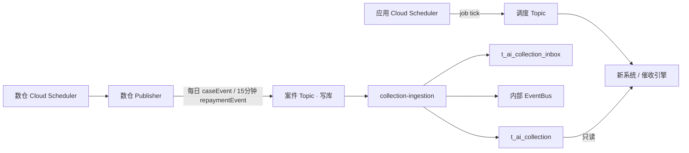

# Phase 1 数仓 Pub/Sub 交付契约

> **版本**: Phase 1 · 菲律宾市场 · 2026-09-03  
> **状态**: ✅ 已确定（数仓对外消息 SSOT）  
> **读者**: 数仓 / Publisher 开发、运维、新催收接入  
> **本文是数仓对外唯一 SSOT**（由原「对齐清单」与「Pub/Sub 交付说明」合并）。接入消费、ACK、日切实现 → [数据接入规格](./MOCASA催收系统升级_Phase1_数据接入规格.md)；调度 Topic 部署 → [基础设施 §5](./MOCASA催收系统升级_Phase1_基础设施交互规范.md#5-定时调度cloud-scheduler--pubsub--应用订阅)。

---

## 目录

- [1. 封面与边界](#1-封面与边界)
  - [1.1 入站顺序与 Publisher 任务](#11-入站顺序与-publisher-任务)
  - [1.2 两条管道与 GCP 资源](#12-两条管道与-gcp-资源)
- [2. 计算口径与事件契约](#2-计算口径与事件契约)
  - [2.1 两类事实事件](#21-两类事实事件)
  - [2.2 消息字段](#22-消息字段)
    - [完整字段清单](#完整字段清单)
  - [2.3 消息样例](#23-消息样例)
- [3. 发布可靠性](#3-发布可靠性)
  - [3.1 eventId](#31-eventid)
  - [3.2 caseVersion](#32-caseversion)
- [4. 场景矩阵](#4-场景矩阵)
- [5. 日切窗口与批次门控](#5-日切窗口与批次门控)
- [6. 上线验收](#6-上线验收)
- [附录 A：历史编号占位](#附录-a历史编号占位)
- [附录 B：inbox 只读说明](#附录-binbox-只读说明数仓无需实现)
- [参考实现](#参考实现)
- [变更记录](#变更记录)

---

## 1. 封面与边界
<a id="1-封面与边界"></a>

数仓只算、只发消息，**不写**催收业务库；接入层是 `t_ai_collection` 的**唯一写入者**，引擎消费接入提交后的内部事件。**案件投影**即 `t_ai_collection`：接入层按消息写入的当前案件行，包含 DPD、阶段、金额、联系人和催收状态；下文「投影」均指此表。

### 1.1 入站顺序与 Publisher 任务
<a id="11-入站顺序与-publisher-任务"></a><a id="入站顺序"></a><a id="11-publisher-任务"></a>

数仓先计算案件快照与还款增量，Publisher 再发布案件消息；接入层校验并写入投影，事务提交后才发布内部事件。

| 环节 | 功能 |
| --- | --- |
| 数仓加工 | 计算案件完整快照和还款增量 |
| 数仓 Publisher | 每日只向新系统发布当天 `owner=NEW` 的完整 `caseEvent`；成功还款只对当日 NEW 名单发增量 `repaymentEvent`；不发布阶段变更或停催事件 |
| 接入校验与去重 | 校验字段；隔离毒丸；跳过重复 `eventId`；相同 `caseVersion` 仍须刷新归属日 |
| 接入投影写入 | 同事务写 `t_ai_collection_inbox`，并更新 `t_ai_collection`（含 `owner` / `owner_date`） |
| 内部事件驱动 | 事务提交后：还款增量可发内部事件；`caseEvent` **不**在到达时建计划，等 03:35 owner 对账 |

数仓**不得直连**业务库写 `t_ai_collection`。

**Publisher 任务**

| 任务 | 时区 | 频率 | 输出 | 关键约束 |
| --- | --- | --- | --- | --- |
| 每日案件快照 | `Asia/Manila` | 每日，**03:00 PHT 前发完** | 当天 `owner=NEW` 的每案**一条**完整 `caseEvent` | 同一 `caseId` 每个 PHT 自然日只发一条（重试/重放复用原 `eventId`）；只发新系统负责的在催案；`owner` 固定 `NEW`；`occurredAt` 的 PHT 日历日 = 本次归属日；`caseVersion` 为内容指纹且**不含** `owner`（[§3.2](#32-caseversion)）；指纹未变也必须再发，供接入刷新归属日 |
| 还款扫描 | `Asia/Manila` | 每 15 分钟 | 当日 NEW 名单内每案一条 `repaymentEvent/REPAYMENT` | 仅成功正向还款的**增量**；账务结清状态落库后至少等待 **360 秒**；案件不在当日 NEW 名单则**不发**；同样走案件 Topic |

每条消息独立 publish。消息体使用单案 `{dataType, data}` envelope；`data` 只承载一个案件或还款事实，不得包装多案。Publisher 可在单次任务中连续/并发发多条。

### 1.2 两条管道与 GCP 资源
<a id="12-两条管道与-gcp-资源"></a><a id="12-gcp-资源"></a><a id="60-gcp-资源"></a><a id="两条管道"></a>

系统有两条物理隔离的 Pub/Sub 管道：

- **案件 Topic**：数仓 Publisher 发布案件事实；接入层写入投影并发布内部事件。
- **调度 Topic**：应用 Cloud Scheduler 发布时钟 tick；新系统消费 tick 后执行扫描、比对和内部事件发布。



| 管道 | 发布方与消息 | 业务处理 |
| --- | --- | --- |
| 案件 Topic | 数仓 Cloud Scheduler → Publisher → `caseEvent` / `repaymentEvent` | 接入层按 `caseVersion` 写 `t_ai_collection`，并发布内部事件 |
| 调度 Topic | 应用 Cloud Scheduler → 三类 `job` tick | 引擎消费 tick 后处理；Scheduler 不读业务库、不写案件表 |

两套 Topic、Scheduler、IAM 和告警必须物理分离：数仓只向案件 Topic 发布，应用 Scheduler 只向调度 Topic 发布。

**调度 Tick 合约**

**仅以 Pub/Sub attribute `job` 路由**；body 为任意非空字符串（纯文本或 JSON 均可），应用**完全不解析 body**。tick 不含案件快照或扫描条件，且数仓不发布此类消息。

> **配置红线**：`job` 必须落在消息 **attribute** 上。把 `job` 只写进 body（例如 `{"type":"scheduled-tick","job":"planStepDue"}` 而不带 `--attributes`）会让每条 tick 被判为 `UNKNOWN_JOB`、记 WARN 后 ack 丢弃——**整条触达链路静默停摆**，表现为 `collection.schedule.triggered` 恒为 0 且 `skipped{reason=UNKNOWN_JOB}` 持续增长（告警见[基础设施规范 §7.4](./MOCASA催收系统升级_Phase1_基础设施交互规范.md#74-告警最低要求)）。body 里额外带 JSON 不影响路由，但不构成路由依据。

| `job` | 发布频率（PHT） | 消费方 |
| --- | --- | --- |
| `planStepDue` | 每分钟 | 催收引擎 |
| `callbackTimeout` | 每分钟 | 催收引擎 |
| `dailyRoll` | 03:35–05:55，每 5 分钟 | 催收引擎 |

三类 tick 各为一个独立 Pub/Sub 消息。下面直接给命令形式，**不再给「body / attributes」的示意块**——那种写法会被当成消息内容原样发出（本节末尾有实际事故记录）：

```bash
# 正式入口：Cloud Scheduler Job（四条规则见基础设施规范 §5.2）
gcloud scheduler jobs create pubsub collection-plan-step-due \
  --schedule="* * * * *" --time-zone="Asia/Manila" \
  --topic=<SCHEDULE_TOPIC> \
  --message-body="scheduled-tick" \
  --attributes="job=planStepDue"      # ← 路由只看这里

# 排障用：一次性手工触发
gcloud pubsub topics publish <SCHEDULE_TOPIC> \
  --message="scheduled-tick" \
  --attribute="job=callbackTimeout"
```

`job` 取值只有 `planStepDue` / `callbackTimeout` / `dailyRoll` 三个，逐字小驼峰。`--message` / `--message-body` 的内容不参与路由，写什么都行但不能为空。

> **已发生的实际事故（2026-08-21 观测确证）**：调度 Topic 上存在**第二个发布者**，每分钟在 `:01` 前后发两条消息，attributes 为**空**，而 body 是本节旧版示意块的原文（`body: scheduled-tick\nattributes:\n  job: callbackTimeout`）。即对方把「示意」当成了消息体逐字发布。这类 tick 到达应用后会被判 `UNKNOWN_JOB`、记 WARN 后 ack 丢弃，**不会触发任何扫描**——若正式入口只有这个发布者，触达链路会全程静默停摆。**已处置**：这三条 Job 在 `asia-southeast1`（`intelligent-collection-schedule-{planStepDue,callbackTimeout,dailyRoll}`），2026-08-21 已 `PAUSED`；正式入口是 `asia-northeast1` 的四条 Job。**同一 `job` 不得有两个发布者**，否则每分钟双发 tick，虽有单飞兜底但会持续制造 `IN_FLIGHT` 噪音。

引擎侧处理定义见[基础设施规范 §5](./MOCASA催收系统升级_Phase1_基础设施交互规范.md#5-定时调度cloud-scheduler--pubsub--应用订阅)；`dailyRoll` 的日切判断见 [§5](#5-日切窗口与批次门控)。

**案件 Topic 资源（落地上表「案件 Topic」行）**

| 环境 | Project | 案件 Topic | 案件 Subscription |
| --- | --- | --- | --- |
| 生产 / Pilot | `fintech-all` | `intelligent-collection-cases-v1` | `intelligent-collection-cases-v1-sub` |

与旧 `collection-cases` **完全分离**。Topic 须开启消息保留与 DLQ；保留期、最大投递次数、DLQ subscription 名称由运维在上线单填写并验收。

**调度 Topic 资源（落地上表「调度 Topic」行；产品已确认命名）**

| 环境 | Project | 调度 Topic | 调度 Subscription |
| --- | --- | --- | --- |
| 生产 / Pilot | `fintech-all` | `intelligent-collection-schedule-v1` | `intelligent-collection-schedule-v1-sub` |
| L4b | — | 不走调度 Topic；`POST /mock/daily-roll` | — |

调度 Topic 由**应用** Cloud Scheduler 发布，数仓不往该 Topic 发消息。部署与 IAM 见 [基础设施 §5](./MOCASA催收系统升级_Phase1_基础设施交互规范.md#5-定时调度cloud-scheduler--pubsub--应用订阅)。

## 2. 计算口径与事件契约
<a id="2-计算口径与事件契约"></a><a id="2-数仓要算什么"></a><a id="3-数仓要发什么"></a><a id="6-pubsub-交付契约"></a>

### 2.1 两类事实事件
<a id="21-两类事实事件"></a><a id="31-两类事件"></a><a id="61-attribute"></a>

外部 Topic **只允许**两类事实事件。阶段变更、D+91 停催由新系统日切读投影后**独占**产出。接入层收到外部 `CASE_STAGE_CHANGED` / `CASE_CEASED` 按毒丸 ack 并告警。
每条 Pub/Sub message 的 body 固定为 `{dataType, data}`；`dataType` 位于 body 顶层，`data` 是单案业务 payload。可额外携带同值的 Pub/Sub attribute，接入不依赖该 attribute。

| body `dataType` | `data.eventType` | 发布条件 |
| --- | --- | --- |
| `caseEvent` | 可省略；有值时仅允许 `CASE_INGESTED` | 当天 `owner=NEW` 的完整快照 |
| `repaymentEvent` | `REPAYMENT` | 当日 NEW 名单内的成功正向还款增量，延迟 360 秒 |

`caseEvent` 是完整案件快照，含身份、产品、DPD、stage、金额、下一期提醒和联系人设备信息。`repaymentEvent` 是增量：**不得**携带 `caseVersion`、`product`、`borrower`、`device` 或 `collectionStatus`；它必须携带还款后的 `dpd`、金额和下一期提醒字段，可兼容携带 `stage`。接入在已有投影上合并允许更新的运行态字段；`repaymentEvent.stage` 不解析、不校验、不持久化，也不触发阶段变更。阶段事件仍由日切独占产生。

### 2.2 消息字段
<a id="22-消息字段"></a><a id="22-dpd金额与催收状态"></a><a id="23-信封字段对照与样例"></a><a id="32-公共信封"></a><a id="62-公共信封"></a><a id="24-投影字段对照"></a><a id="4-t_ai_collection-当前案件表"></a>

两类事件都有 body envelope。`caseEvent` 的 `data` 带完整快照；`repaymentEvent` 的 `data` 只带本次还款和可更新运行态的增量字段。`eventId` / `caseVersion` 见 [§3](#3-发布可靠性)。`t_ai_collection` 由接入层按消息写入，数仓不写该表。

**现行字段集以本节「完整字段清单」+ 对照表为准**；冻结样例见 [§2.3](#23-消息样例) 与 [`contracts/caseEvent.sample.json`](./contracts/caseEvent.sample.json)。附录 A 不再另开字段表。

#### Body envelope

| 字段 | 必填 | 取值 |
| --- | --- | --- |
| `dataType` | 是 | `caseEvent` 或 `repaymentEvent`；用于路由 |
| `data` | 是 | 单案业务 payload object；不得含多案数组 |

#### 完整字段清单
<a id="完整字段清单"></a>
<a id="22-完整字段清单"></a>

Publisher 组 `data` 只使用下表字段名。口径、列映射与别名见后续对照表。

**`caseEvent.data`（2026-09-03）**

| 必填 | 可选 | 禁止 |
| --- | --- | --- |
| `eventId`、`owner`（固定 `NEW`）、`occurredAt`、`caseId`、`userId`、`caseVersion`、`product`、`dpd`、`overdueAmount`、`overduePenaltyAmount`、`isFullCleared` | `eventType`、`stage`、`collectionStatus`、`overduePrincipal`、`overdueInterest`、`upcomingAmount`、`nextDueDate`、`dueDate`、`borrower.name` / `.phone` / `.email` / `.language`、`device.pushToken` | `repayTime`、`paidAmount`；不得发 `owner=LEGACY` |

兼容别名（择一即可，不要当新字段重复语义）：`totalOutstanding` = `overdueAmount`；`penaltyAmount` = `overduePenaltyAmount`；`remainingAmount` 缺省等于 `overdueAmount`。缺 `owner` 时接入按 `NEW` 兼容；非 `NEW` 为毒丸。

**`repaymentEvent.data`**

| 必填 | 可选 | 禁止 |
| --- | --- | --- |
| `eventId`、`eventType`（`REPAYMENT`）、`occurredAt`、`caseId`、`userId`、`repayTime`、`paidAmount`、`dpd`、`overdueAmount`、`overduePenaltyAmount`、`isFullCleared` | `stage`（接入忽略）、`upcomingAmount`、`nextDueDate` | `caseVersion`、`product`、`borrower`、`device`、`collectionStatus`、`owner` |

#### `caseEvent` 字段
`dataType=caseEvent`。每日只对当天由新系统负责（`owner=NEW`）且 `dpd >= -3` 的案件逐发一条；未出现在该批次的在催案由旧系统负责，新系统不接收其 `caseEvent`。以下字段均位于 `data`。

| 消息字段 | 必填 | `t_ai_collection` 列名 | 口径 |
| --- | --- | --- | --- |
| `eventId` | 是 | — | publish 前 UUID；复用见 [§3.1](#31-eventid) |
| `eventType` | 否 | — | 可省略；有值时固定 `CASE_INGESTED` |
| `owner` | 是 | `owner` | 发给新系统时固定 `NEW`。数仓是路由权威；新系统不重算、不覆盖。缺省接入按 `NEW`；非 `NEW` 毒丸 |
| `occurredAt` | 是 | `updated_at`；`owner_date = date(occurredAt)` | `yyyy-MM-dd HH:mm:ss`，按 `Asia/Manila` 解释。**PHT 日历日 = 本次 NEW 归属日** |
| `caseId` | 是 | `case_id` | `loan_id`，可转 `Long`；非法进隔离/告警，不得静默跳过 |
| `userId` | 是 | `user_id` | 用户标识 |
| `caseVersion` | 是 | `case_version` | 内容指纹（hex 字符串）；公式见 [§3.2](#32-caseversion)；**不纳入** `owner` |
| `product` | 是 | `product` | `t_loan.product_id` 的数字字符串；`3`、`4` 表示 3 期产品 |
| `dpd` | 是 | `dpd` | 见下方 [DPD 与 stage](#21-dpd-与阶段映射) |
| `stage` | 否 | `stage` | 由 `dpd` 映射；`dpd >= 91` 可空 |
| `collectionStatus` | 否 | — | 数仓展示字段；接入不依赖它，仍按 `dpd` / `isFullCleared` 派生落库状态 |
| `overduePrincipal` | 否 | — | 已到期未结清本金；金额拆分对账字段 |
| `overdueInterest` | 否 | — | 已到期未结清利息；金额拆分对账字段 |
| `overdueAmount` | 是 | `overdue_amount`、`total_outstanding` | 已到期未结清金额，**已含罚息**；映射为对客 `totalOutstanding` |
| `overduePenaltyAmount` | 是 | `penalty_amount` | 已到期未结清罚息；映射为 `penaltyAmount` |
| `isFullCleared` | 是 | `collection_status`（派生） | loan 级全部结清为 `true`。缺省时接入按未结清派生（兼容旧消息），数仓仍须下发 |
| `upcomingAmount` | 否 | `upcoming_amount` | 仅三期产品、下一期 D-3～D0 的该期金额；只用于提醒 |
| `nextDueDate` | 否 | `next_due_date` | `0` 或 `null` 表示无下一期提醒；其他值为 `yyyy-MM-dd`，不能替代历史 `dueDate` |
| `dueDate` | 否 | `due_date` | 历史到期日锚点，`yyyy-MM-dd`。缺则接入用 `occurredAt` 日历日减 `dpd` 反推排期；有则以上游为准 |
| `borrower.name` | 否 | `borrower_name` | 借款人姓名 |
| `borrower.phone` | 否 | `borrower_phone` | 可传菲律宾本地 10 位手机号；接入规范化为 E.164 |
| `borrower.email` | 否 | `borrower_email` | 空不阻断案件，Email 渠道跳过 |
| `borrower.language` | 否 | `borrower_language` | Phase 1 固定 `en` |
| `device.pushToken` | 否 | `push_token` | 空则 Push→SMS |
| — | — | `synced_at` | 接入层落库时间，数仓不写 |

#### `repaymentEvent` 字段
`dataType=repaymentEvent`，`data.eventType=REPAYMENT`。仅成功正向还款；这是**增量 payload**，不得复制 `caseEvent` 快照字段。只对**当日 NEW 名单**内的案件发布；昨日 NEW、当日未再出现的案件停发，迁出后再入时由下一次完整 `caseEvent` 补齐金额与结清标志。`occurredAt` 是还款时刻，**不得**当作 owner 归属日。若仍错发到已迁出或从未入 NEW 的案件，接入侧按 [数据接入 §3.3](./MOCASA催收系统升级_Phase1_数据接入规格.md#33-按消息类型的处理矩阵) 处理（有基线则合并且不回拨归属日；无基线则 poison），不把错发当成合法路由。

| 消息字段 | 必填 | `t_ai_collection` 列名 | 口径 |
| --- | --- | --- | --- |
| `eventId` | 是 | — | 本次还款事实的 UUID；重试/重投复用 |
| `eventType` | 是 | — | 固定 `REPAYMENT` |
| `occurredAt` | 是 | `updated_at` | ISO-8601，带 `+08:00`；兼容 `yyyy-MM-dd HH:mm:ss`（按 `Asia/Manila`）；接入拒绝较早增量覆盖新投影 |
| `caseId` | 是 | `case_id` | 关联已存在的完整 `caseEvent` 投影 |
| `userId` | 是 | `user_id` | 用户标识 |
| `repayTime` | 是 | — | 还款发生时间，ISO-8601，带 `+08:00` |
| `paidAmount` | 是 | — | 本笔成功还款金额 |
| `dpd` | 是 | `dpd` | 还款后的最大逾期天数 |
| `stage` | 否 | — | 可兼容携带的上游字段；接入忽略，不解析、校验或持久化，D+91 可空 |
| `overdueAmount` | 是 | `overdue_amount`、`total_outstanding` | 已到期未结清金额，已含罚息 |
| `overduePenaltyAmount` | 是 | `penalty_amount` | 已到期未结清罚息，包含在 `overdueAmount` 内 |
| `upcomingAmount` | 否 | `upcoming_amount` | 三期产品下一期 D-3～D0 的该期金额；仅提醒 |
| `nextDueDate` | 否 | `next_due_date` | `0` 或 `null` 表示无下一期提醒；仅提醒 |
| `isFullCleared` | 是 | `collection_status`（派生） | loan 级全部结清为 `true` |

整笔结清时 `isFullCleared=true` 且 `overdueAmount=0`；接入派生 `SETTLED`。发布延迟见 [§3.3](#43-还款延迟)。

#### DPD 与 stage
<a id="21-dpd-与阶段映射"></a><a id="41-dpd-与阶段映射"></a>

数仓按内部口径计算 loan 级最大 `dpd`；已结清期不参与。接入不重算 `caseEvent` 中的 `dpd` 与 `stage`；`repaymentEvent.stage` 即使存在也一律忽略。

| DPD | stage | 说明 |
| --- | --- | --- |
| D-3 ～ D0 | S0 | 到期前提醒；`dpd >= -3` 才允许入案 |
| D+1 ～ D+3 | S1 | 早期催收 |
| D+4 ～ D+15 | S2 | 中期催收 |
| D+16 ～ D+30 | S3 | 晚期催收 |
| D+31 ～ D+90 | S4 | 主动催收末段 |
| D+91 及以上 | 无 stage（可空） | 接入派生 `CEASED`，完全停催 |

`dpd <= -4` 不入案、**不发布** `caseEvent`。

#### 映射与派生逻辑
<a id="22-金额计算"></a>

数仓负责按其内部口径计算金额和结清标志；不在本契约公开计算 SQL。接入映射与派生如下：
<a id="23-collection_status-推导"></a><a id="43-collection_status-推导"></a>

| 输入字段 | 接入映射或派生 |
| --- | --- |
| `overdueAmount` | 已到期未结清、含罚息；写入 `overdue_amount` 与 `total_outstanding`。不得包含未到期期数。 |
| `overduePenaltyAmount` | 已到期未结清罚息，包含在 `overdueAmount` 内；写入 `penaltyAmount`。 |
| `upcomingAmount` / `nextDueDate` | 仅三期产品下一期且该期处于 D-3～D0 时下发；`nextDueDate=0` / `null` 表示无提醒；写入对应提醒列，不替代历史 `dueDate`，不改变逾期金额。 |
| `isFullCleared` | `caseEvent` / `repaymentEvent` 均须下发的 loan 级结清标志；用于派生 `collectionStatus`。 |
| `collectionStatus` | `caseEvent` 可带展示值；接入不使用它落库，仍自行派生状态。 |

`caseEvent` 可下发 `collectionStatus` 供数仓展示；`repaymentEvent` 不下发。接入不依赖该字段，按写入后的事件状态自行派生并落 `t_ai_collection.collection_status`；判定自上而下，先命中为准：

| 取值 | 条件 |
| --- | --- |
| `SETTLED` | `isFullCleared=true` |
| `CEASED` | 非结清且 `dpd >= 91`；`stage` 可为空 |
| `IN_COLLECTION` | 其他情况 |

- 部分还款仅更新运行态金额 / 下一期提醒 / 结清标志；不发布阶段事件。
- `stage` 变化仍仅由 `dailyRoll` 比对投影后产生 `STAGE_CHANGED`。

### 2.3 消息样例
<a id="23-消息样例"></a>

#### `caseEvent`
<a id="33-caseevent"></a><a id="63-caseevent"></a>

```json
{
  "dataType": "caseEvent",
  "data": {
    "eventId": "d1908ba2-2dba-456f-ab26-5d5c3adbc801",
    "caseVersion": "a48911a34fecdd3074f1acc8634d5043",
    "caseId": 483877,
    "userId": 3780028,
    "product": "3",
    "dpd": 70,
    "occurredAt": "2026-08-17 10:40:12",
    "owner": "NEW",
    "isFullCleared": false,
    "stage": "S4",
    "collectionStatus": "IN_COLLECTION",
    "overduePenaltyAmount": 390.5,
    "overduePrincipal": 4300.0,
    "overdueInterest": 1384.7,
    "overdueAmount": 6075.2,
    "upcomingAmount": 0.0,
    "nextDueDate": 0,
    "borrower": {
      "email": "audreygenica@gmail.com",
      "language": "en",
      "name": "GENICA AUDREY MORTE RESMA",
      "phone": "9654453072"
    },
    "device": {
      "pushToken": "141fe1da9ffd752596f"
    }
  }
}
```

#### `repaymentEvent`
<a id="34-repaymentevent"></a><a id="64-repaymentevent"></a>

```json
{
  "dataType": "repaymentEvent",
  "data": {
    "eventId": "9805c2a5-a056-471c-a9c2-7a4d0c4c9ef6",
    "eventType": "REPAYMENT",
    "occurredAt": "2026-08-11T10:06:00+08:00",
    "caseId": "525441",
    "userId": "2145521",
    "repayTime": "2026-08-11T10:00:00+08:00",
    "paidAmount": 3000.0,
    "overdueAmount": 6061.14,
    "overduePenaltyAmount": 0.0,
    "dpd": 34,
    "stage": "S4",
    "upcomingAmount": null,
    "nextDueDate": null,
    "isFullCleared": false
  }
}
```

---

## 3. 发布可靠性
<a id="3-发布可靠性"></a><a id="3-eventidcaseversion-与重放"></a><a id="4-怎么发才可靠"></a>

取消业务库 Outbox 后，投递可靠性由数仓 Publisher + Topic 保留/重放承担。

### 3.1 `eventId`
<a id="31-eventid"></a>
<a id="41-eventid"></a><a id="32-eventid-与重试"></a>

- publish **前**生成 UUID，全局唯一。
- 同一事实无论发布重试、Pub/Sub 重投还是保留期内重放，均复用同一 `eventId` 与 payload；`caseEvent` 同时复用其 `caseVersion`，`repaymentEvent` 不携带版本。
- 发布失败必须重试并告警，不能只记日志。

### 3.2 `caseVersion`
<a id="32-caseversion"></a>
<a id="42-caseversion"></a><a id="31-caseversion"></a>

`caseVersion` 是数仓为 `caseEvent` 按当日完整快照算出的**内容指纹**，不是单调整数，也不是 Pub/Sub `messageId`，也**不是**路由版本：`owner` 不参与哈希。`repaymentEvent` 是无版本增量，接入以 `eventId` 去重、以 `occurredAt` 拒绝旧增量覆盖新投影。

数仓计算公式（SSOT）：

```sql
o_hex(md5(concat(a.loan_id, a.maxDpd, a.overdueAmount, a.upcomingAmount, coalesce(a.nextDueDate, ''), a.isFullCleared))) AS caseVersion
```

| 哈希输入 | 含义 |
| --- | --- |
| `loan_id` | 消息 `caseId` |
| `maxDpd` | 与当日 `dpd` 同值（数仓计算列名） |
| `overdueAmount` | 已到期未结清金额，已含罚息 |
| `upcomingAmount` | 三期产品下一期 D-3～D0 的该期金额；其他情况为空 |
| `nextDueDate` | 与 `upcomingAmount` 成对的下一期到期日；空则 `''` |
| `isFullCleared` | loan 级结清状态，避免仅结清状态变化被指纹忽略 |

接入层**不重算**指纹，只与已入库 `case_version` 比是否相同：

| 项 | 强制规则 |
| --- | --- |
| 有变化 | 指纹与库中不同 → 覆盖投影业务列，并以 `date(occurredAt)` 刷新 `owner_date` |
| 无变化 | 指纹与库中相同 → **仍须刷新** `owner_date`；业务列不覆盖。不得因指纹相同而整条丢弃 |
| 归属日乱序 | `date(occurredAt)` 早于已落库 `owner_date` → 拒绝该 `caseEvent`，不回拨归属日 |
| 复用 | 同一事实的重试 / 重投 / 重放复用原 `eventId`、原指纹与原 `occurredAt` |
| 乱序 | 当前不作为设计前提；`eventId` 仍吸收重试与重投 |

未纳入哈希的字段（如联系人、`owner`）单独变化时，指纹不变。`owner` 靠每日再发同一指纹的 NEW `caseEvent` 刷新归属日，不要求改哈希公式。联系人等仍须同时变化哈希输入，或由数仓纳入公式后另行通知。

### 3.3 还款延迟 360 秒
<a id="43-还款延迟"></a>

成功还款须等账务 `is_loan_clear` 落库后计算，约定**落库后 +360 秒**再 publish。360 秒后仍无法取得一致结清状态时记录失败原因、重试并告警。

### 3.4 保留与重放
<a id="44-保留与重放"></a><a id="34-持久化与重放"></a>

- Topic 开启 retention，支持按时间点重放；保留期与 DR 目标由运维确认。
- 重放不改变 `eventId` / `caseVersion`，接入层幂等吸收，不会重复建计划。
- 接入消费失败会 nack 由 Pub/Sub 重投；超过投递上限进 DLQ，数仓与运维共同排查。

接入层处置（数仓需知情；实现 SSOT → [数据接入 §2.2](./MOCASA催收系统升级_Phase1_数据接入规格.md#22-消费结果重试与死信处置)）：

| 情况 | 接入处理 |
| --- | --- |
| 契约错误（缺必填、非法 `eventType`） | poison 记录后 ack，不重投 |
| 投影写入或内部事件发布失败 | nack，Pub/Sub 重投 |
| 成功 / 重复 `eventId` | ack |
| 成功 / 相同 `caseVersion` 但已刷新归属日 | ack |

### 3.5 每日 `caseEvent` 刷新
<a id="45-每日刷新"></a><a id="33-每日-caseevent-投影刷新"></a>

`repaymentEvent` 负责还款时效；每日 NEW `caseEvent` 负责完整性（历史修正、漏发、上游回补）以及**当日归属刷新**。

| 项 | 约定 |
| --- | --- |
| 内容 | 当天 `owner=NEW` 的在催案件**完整快照**；不发 LEGACY 变更 |
| 语义 | 到达时只写投影与归属日，**不**建计划；03:35 owner 对账后才建/留/迁出，见 [数据接入 §4](./MOCASA催收系统升级_Phase1_数据接入规格.md#4-dpd-日切) |
| 覆盖 | 逐案发消息；禁止全表覆盖、清空重建或旁路 SQL |
| 时间 | **03:00 PHT** 前发完；应用 03:35 起对账。Phase 1 **不**要数仓完成信号 |

稳定运行并连续对账无差异后，可将每日写入刷新降级为每日对账 + 按需修复；本期先保留写入刷新。

---

## 4. 场景矩阵
<a id="4-场景矩阵"></a><a id="5-场景矩阵"></a><a id="7-写入与事件触发矩阵"></a>

| 场景 | 数仓发布 | 投影 | 新系统后续 |
| --- | --- | --- | --- |
| 当日 NEW 首次进入 | `caseEvent`，`owner=NEW` | upsert，归属日 = `date(occurredAt)` | 03:35 对账后内部 `CASE_INGESTED` → 创建触达计划 |
| 连续第 N 日仍为 NEW | 即使指纹不变也再发完整 `caseEvent` | 刷新 `owner_date`；指纹变化才改业务列 | 对账见归属日已是当日 → **保留**非终态计划 |
| NEW → 当日未出现 | **不发**该案 `caseEvent` / `repaymentEvent` | 归属日停留在昨日 | 03:35 对账取消活跃计划，`ROUTED_TO_LEGACY` |
| 迁出后再入 NEW | 再发完整 `caseEvent` | 刷新归属日与业务列 | 无活跃计划则对账后按首次入催再建 |
| 成功部分还款（当日 NEW） | 增量 `repaymentEvent`，延迟 360s | 合并运行态；接入派生 `IN_COLLECTION` | 内部 `CASE_BALANCE_UPDATED`；不产生 `STAGE_CHANGED` |
| 成功整笔结清（当日 NEW） | 增量 `repaymentEvent`，`isFullCleared=true`，延迟 360s | 接入派生 `SETTLED` | 内部 `REPAYMENT_RECEIVED` → 取消全部活跃计划 |
| 日切阶段升/降 | **不发布**阶段/停催事件 | 当日 NEW `caseEvent` 已写入新 `dpd`/`stage` | owner 对账成功后，日切有变化 → 内部 `STAGE_CHANGED` |
| D+91 停催（当日 NEW） | 仍发当日 NEW `caseEvent`；**不发布**停催/阶段事件 | 接入派生 `CEASED` | 对账成功后的日切：仍有活跃 plan → 内部 `CASE_CEASED` |
| 历史修正 / 漏发补齐 | 每日 NEW `caseEvent` | 指纹不同则刷新业务列；归属日按 `occurredAt` | 对账与下一次日切据新投影推进 |
| 非 NEW / D-4 及更早 | 不向新系统发布 | 不写入 | 不触达 |

---

## 5. 日切窗口与批次门控
<a id="5-日切窗口与批次门控"></a><a id="6-日切门控"></a><a id="8-日切与数据可用时间"></a>

应用侧 `dailyRoll` 经**独立调度 Topic**触发，03:35–05:55 PHT 每 5 分钟执行一页。**第一阶段**是 owner 对账（迁出 / 首次与再入建计划），水位写成当日后才进入既有 DPD 日切。日切只读 `t_ai_collection`，独占产出 `STAGE_CHANGED` / `CASE_CEASED`。

| 项 | 约定 |
| --- | --- |
| 时区 | `Asia/Manila` |
| 数仓当日 NEW `caseEvent` 批次 | 约 **03:00 PHT** 发完 |
| 新系统对账与日切窗口 | **03:35–05:55 PHT，每 5 分钟** |
| 完成信号 | Phase 1 **不**要数仓完成信号。零 NEW 案与 Publisher 故障无法从消息流区分：当日无任何案件刷新归属日（投影 `owner_date = 当日` 计数为零）则推迟对账并告警，不得把空收当成「今天零案」 |
| 扫描 | MySQL keyset 分页；Redis 存对账/日切游标与完成标记 |
| 完成 | **06:00 PHT** 前跑完；未完成必须告警 |

运维协同：

1. 数仓只保证 03:00 前发完当天 NEW 批次；迟到则新系统推迟对账并告警。
2. 接入侧以投影 `owner_date = 当日 PHT` 的案件计数确认非空收（时区口径与投影写入一致，走索引），不以 inbox `created_at` 为准，也不对 inbox payload 做字符串日期解析。

> 🔄 **2026-09-03 修订**：空收检测原表述为「以 inbox 中 `date(occurredAt)=当日 PHT` 的 NEW `caseEvent` 计数确认非空收」；现改为投影 `owner_date` 计数——每条 `caseEvent` 无论指纹是否相同都会刷新归属日，两种计数语义等价，但后者走 `idx_ai_collection_owner_date` 索引、且时区口径与投影写入一致（inbox 字符串前缀解析在 UTC 时间戳下会与 PHT 日历日分叉）。实现见 [数据接入规格 §4.1](./MOCASA催收系统升级_Phase1_数据接入规格.md#41-owner-对账)。
3. **06:00 PHT** 前未完成对账或日切，按 Runbook 排查 Publisher、案件订阅、投影消费与 Redis 游标。

---

## 6. 上线验收
<a id="6-上线验收"></a><a id="7-验收清单"></a>

上线前按行签字。证据同时服务数仓发布审计与接入消费指标对账。

| # | 验收项 | 通过标准 | 责任方 |
| --- | --- | --- | --- |
| 1 | 消息契约 | `dataType`、两类 body 字段（含 `owner`）、完整/增量边界、独立 message 及联系方式均与 [§2.2](#22-消息字段) 一致；正常与拒绝样例均通过接入校验 | 数仓 + 接入 |
| 2 | 案件与 DPD | `caseId` 非空、唯一、规范数字；已结清期不参与 DPD；仅当天 NEW 且 `dpd >= -3` 发 `caseEvent`，`occurredAt` 日历日等于归属日，stage 映射正确 | 数仓 |
| 3 | 快照指纹 | `caseVersion` 按 [§3.2](#32-caseversion) 生成且不含 `owner`；输入变化则指纹变化；指纹相同也须再发以刷新归属日；重试/重放复用原值 | 数仓 + 接入 |
| 4 | 金额、提醒与状态 | `overdueAmount` 含罚息且不含未到期；`overduePenaltyAmount` 为其中罚息；三期提醒字段符合 D-3～D0 定义；接入正确派生 `SETTLED` / `CEASED` / `IN_COLLECTION` | 数仓 + 接入 |
| 5 | 还款发布 | 仅当日 NEW 名单内的成功正向还款；账务结清状态落库至少 360 秒后发布增量 `repaymentEvent` | 数仓 |
| 6 | Publisher 可靠性 | 发布失败重试并告警；重试/重放复用 `eventId`；保留期内可按时间点重放 | 数仓 + 运维 |
| 7 | 每日批次 | 当日 NEW 快照在 **03:00 PHT** 前发完；Phase 1 不要完成信号；空收由接入告警推迟对账 | 数仓 + 运维 + 接入 |
| 8 | 数据库写入边界 | 数仓 SA 无业务库写权限；接入层为 `t_ai_collection` 唯一写入者 | 数仓 + 运维 + 接入 |
| 9 | 日切分工与时限 | owner 对账先于阶段/停催；阶段变化 / D+91 仅由 `dailyRoll` 第二阶段产生；对账与日切在 **06:00 PHT** 前完成，否则告警 | 接入 + 运维 |
| 10 | Topic、DLQ 与 IAM | 案件 / 调度 Topic 物理分离；案件 Topic 已配置 retention 与 DLQ；Publisher / Consumer / Scheduler 权限按环境验收 | 运维 + 数仓 + 接入 |
| 11 | 发布消费对账 | 按日、`dataType` 对账发布、ack / nack / poison / dedup 与 inbox；异常可定位到 Publisher、订阅、DLQ 或投影 | 数仓 + 接入 + 运维 |
| 12 | 接入处置 | 契约错误记录 poison 后 ack；投影写入或内部事件发布失败 nack 重投；重复 `eventId` ack；相同指纹仍刷新归属日后 ack | 接入 |

---

## 附录 A：历史编号占位
<a id="附录-a历史编号占位"></a>

早期合并前曾用「附录 A」承载字段对照。**现行完整字段集**在 [§2.2 完整字段清单](#完整字段清单) 与对照表，本节省略独立正文。旧锚点仍落在各节 `<a id>` 上。

---

## 附录 B：inbox 只读说明（数仓无需实现）

<a id="附录-binbox-只读说明数仓无需实现"></a>
<a id="5-t_ai_collection_inbox"></a>

`t_ai_collection_inbox` 是接入侧幂等与可靠性记录，替代原 `t_ai_collection_outbox`。数仓不读写本表。

接入在同一事务内写收件箱并更新投影，提交后才发领域事件。收件箱三种状态（`PUBLISHED` / `PENDING` / `SKIPPED`）与重投行为见 [数据接入规格 §3.2](./MOCASA催收系统升级_Phase1_数据接入规格.md#32-投影写入inbox-与幂等)。原 `t_ai_collection_outbox` 已废弃。

---

## 参考实现

- DDL：[db/schema.sql](../db/schema.sql)
- 接入入口：[AiCaseIngestionProcessor.java](../collection-ingestion/src/main/java/com/collection/ingestion/pubsub/AiCaseIngestionProcessor.java)
- 投影持久化：[AiCaseProjectionRepository.java](../collection-service/src/main/java/com/collection/service/repository/AiCaseProjectionRepository.java)
- 运行态 CaseService：[AiCollectionCaseService.java](../collection-service/src/main/java/com/collection/service/impl/AiCollectionCaseService.java)
- 开发索引（非字段 SSOT）：[contracts/README.md](./contracts/README.md)

## 变更记录

| 日期 | 变更 | 影响面 |
| --- | --- | --- |
| 2026-09-03 | 全文重写合并（原「对齐清单」+「Pub/Sub 交付说明」）：`owner` 字段必填、仅当日 NEW 发布范围、`occurredAt` 归属日语义、`isFullCleared` 结清派生、还款事件仅当日 NEW 名单内发布 | 全文 |
| 2026-09-03 | 空收检测口径：§5 完成信号行与运维协同第 2 条改为投影 `owner_date = 当日` 计数（走索引、时区口径与投影写入一致），替代 inbox payload 字符串日期解析 | §5 / 运维协同 |
