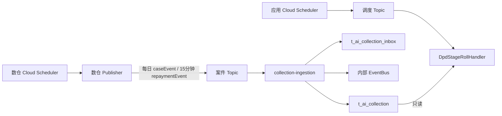

# Phase 1 数仓 Pub/Sub 交付契约

> **版本**: Phase 1 · 菲律宾市场 · 2026-08-13  
> **读者**: 数仓 / Publisher 开发、运维、新催收接入  
> **本文是数仓对外唯一 SSOT**（由原「对齐清单」与「Pub/Sub 交付说明」合并）。接入消费、ACK、日切实现 → [数据接入规格](./MOCASA催收系统升级_Phase1_数据接入规格.md)；调度 Topic 部署 → [基础设施 §5](./MOCASA催收系统升级_Phase1_基础设施交互规范.md#5-定时调度cloud-scheduler--pubsub--应用订阅)。

---

## 目录

- [1. 封面与边界](#1-封面与边界)
- [2. 数仓要算什么](#2-数仓要算什么)
- [3. 数仓要发什么](#3-数仓要发什么)
- [4. 怎么发才可靠](#4-怎么发才可靠)
- [5. 场景矩阵](#5-场景矩阵)
- [6. 日切门控](#6-日切门控)
- [7. 验收清单](#7-验收清单)
- [附录 A：旧约定废弃](#附录-a旧约定废弃)
- [附录 B：inbox 只读说明](#附录-binbox-只读说明数仓无需实现)

---

## 1. 封面与边界

<a id="1-封面与边界"></a>

数仓完成案件计算后，**直接向新系统专用 Pub/Sub 发布完整单案快照**；`collection-ingestion` 消费后按 `caseVersion` 写入 `t_ai_collection`，再发内部领域事件。`t_ai_collection` 的**唯一写入者是接入层**；数仓**不得直连业务库写该表**，否则 `case_version` 会倒退。新系统运行时只读投影，**不再读旧 `t_collection`**。



- 案件 Topic 与应用调度 Topic **必须物理分离**；两套 Cloud Scheduler 的服务账号、IAM、告警分别配置。
- 每条消息独立 publish，禁止旧系统批量 `data` envelope。Publisher 可在单次任务中连续/并发发多条。

### 1.1 Publisher 任务

| 任务 | 时区 | 频率 | 输出 | 关键约束 |
| --- | --- | --- | --- | --- |
| 每日案件快照 | `Asia/Manila` | 每日，**03:00 PHT 前发完** | 每案一条 `caseEvent/CASE_INGESTED` | 完整快照；当前 `caseVersion`；已有周期由接入层静默刷新投影 |
| 还款扫描 | `Asia/Manila` | 每 15 分钟 | 每案一条 `repaymentEvent/REPAYMENT` | 仅成功正向还款；账务结清状态落库后至少等待 **360 秒** |

### 1.2 GCP 资源

<a id="12-gcp-资源"></a>
<a id="60-gcp-资源"></a>

| 环境 | Project | 案件 Topic | 案件 Subscription | 权限 |
| --- | --- | --- | --- | --- |
| 生产 / Pilot | `fintech-all` | `collection-ai-events-v1` | `collection-ai-events-v1-sub` | 数仓 SA: `pubsub.publisher`；应用 SA: `pubsub.subscriber` |
| 联调 / 测试 | `fintech-all` | `collection-ai-events-test1` | `collection-ai-events-test1-sub` | 同上，使用测试 SA / 权限范围 |

与旧 `collection-cases` **完全分离**。Topic 须开启消息保留与 DLQ；保留期、最大投递次数、DLQ subscription 名称由运维在上线单填写并验收。应用调度 Topic / 订阅见 [基础设施 §5](./MOCASA催收系统升级_Phase1_基础设施交互规范.md#5-定时调度cloud-scheduler--pubsub--应用订阅)。

### 1.3 三方责任

<a id="13-三方责任"></a>

| 模块 | 负责 | 不负责 |
| --- | --- | --- |
| 数仓加工 | 从明细计算 DPD、余额、结清状态、产品、联系人等完整快照 | 不调引擎、不用旧 Pub/Sub schema |
| 数仓 Publisher | Cloud Scheduler 触发；维护每案 `caseVersion`、生成稳定 `eventId`、每日 `caseEvent`、15 分钟 `repaymentEvent`、失败重试、可重放 | **不写业务库任何表**；不决定引擎内部事件名 |
| 运维 | Topic / Subscription / DLQ / 保留、双向 IAM、应用调度 Topic、06:00 告警、回收数仓业务库写权限 | 不改字段口径 |
| 新系统接入 | 消费、`eventId` 幂等、`caseVersion` 防乱序、写投影、publish 内部事件 | 不重算 DPD / 金额 |
| 新系统日切 | 只读投影：阶段升/降、D+91 停催、结清反转复活 | 不改数仓计算结果、不写投影 |
| 引擎 / 渠道 | 建/取消计划、合规与零金额拦截 | 不计算金融字段 |

---

## 2. 数仓要算什么

<a id="2-数仓要算什么"></a>

接入层**原样落投影，不重算**。口径错误会直接进对客文案与日切。

### 2.1 DPD 与阶段

<a id="21-dpd-与阶段映射"></a>
<a id="41-dpd-与阶段映射"></a>

```text
dpd = MAX(overdue_days) WHERE is_loan_clear != 0
```

已结清期不能抬高 DPD。`as_of` = `CURRENT_DATE('Asia/Manila')`。

| DPD | stage | 说明 |
| --- | --- | --- |
| D-3 ～ D0 | S0 | 到期前提醒；`dpd >= -3` 才允许入案 |
| D+1 ～ D+3 | S1 | 早期催收 |
| D+4 ～ D+15 | S2 | 中期催收 |
| D+16 ～ D+30 | S3 | 晚期催收 |
| D+31 ～ D+90 | S4 | 主动催收末段 |
| D+91 及以上 | 无 stage（可空） | `collectionStatus=CEASED`，完全停催 |

`dpd <= -4` 不入案、**不发布** `caseEvent`。`caseId = loan_id`，须可安全转 Java `Long`；空值、非纯数字、无法映射到唯一 loan 的记录进隔离/告警表，**不得静默跳过**。

### 2.2 金额

<a id="22-金额计算"></a>

单期残值：

```text
若 is_loan_clear = 2（部分结清）：
  residual = principal + interest + penalty_interest
             - paid_principal - paid_interest - paid_penalty_interest

其他未结清期：
  residual = principal + interest + penalty_interest
```

```text
totalOutstanding = SUM(residual)
                   WHERE is_loan_clear != 0 AND due_date <= as_of

remainingAmount  = SUM(residual)
                   WHERE is_loan_clear != 0
```

禁止把未到期期数计入 `totalOutstanding`，否则 SMS / Push / Email 会向客户报高金额。`remainingAmount` 仅对账，不进文案。

`isFullCleared = MAX(is_loan_clear) = 0`（loan 下全部 bill 已结清）。

### 2.3 `collectionStatus`

<a id="23-collection_status-推导"></a>
<a id="43-collection_status-推导"></a>

数仓在 Publisher 侧计算，写入每条快照的 `collectionStatus`；接入原样落 `t_ai_collection.collection_status`。

**判定顺序**（自上而下，先命中者为准）：

| 取值 | 数仓 / BQ 可实现条件 | 典型消息 |
| --- | --- | --- |
| `CEASED` | 按 §2.1 算得 `dpd >= 91` | 每日 `caseEvent`；`stage` 可为空 |
| `SETTLED` | loan 下**全部** bill `is_loan_clear = 0` | `repaymentEvent` 须 `isFullCleared=true`；`totalOutstanding` / `remainingAmount` / `penaltyAmount` 均为 `0` |
| `IN_COLLECTION` | `dpd >= -3` 且存在未结清 bill（`is_loan_clear != 0`）；且 `dpd <= 90` | 每日 `caseEvent`、部分还款后的 `repaymentEvent` |

- **部分还款**：仍有未结清 bill → 保持 `IN_COLLECTION`；`isFullCleared=false`。
- **退款 / 冲正**：不发 `repaymentEvent`；随下一次每日 `caseEvent` 刷新；再次未结清则回到 `IN_COLLECTION`（§5）。
- **互斥**：同一快照不得出现 `SETTLED` 且 `totalOutstanding > 0`，或 `CEASED` 且 `dpd < 91`。

### 2.4 投影字段对照

<a id="24-投影字段对照"></a>
<a id="4-t_ai_collection-当前案件表"></a>

`t_ai_collection` 由接入层写入。数仓保证**消息字段口径**正确，不负责该表写入。

| 投影列 | 类型 | 必填 | 消息字段 / 口径 |
| --- | --- | --- | --- |
| `case_id` | BIGINT | 是 | `caseId` = `loan_id`，规范数字 |
| `user_id` | BIGINT | 是 | `userId` |
| `case_version` | BIGINT | 是 | `caseVersion`，同案单调递增 |
| `dpd` | INT | 是 | §2.1 |
| `stage` | VARCHAR(16) | 条件 | `S0`–`S4`；`dpd >= 91` 可空 |
| `collection_status` | VARCHAR(32) | 是 | `collectionStatus`，§2.3 |
| `product` | VARCHAR(64) | 是 | `t_loan.product_id` 的数字字符串；`3`、`4` 表示 3 期产品 |
| `total_outstanding` | DECIMAL(18,2) | 是 | §2.2，对客唯一金额 |
| `penalty_amount` | DECIMAL(18,2) | 是 | 已到期未结清期剩余罚息 |
| `remaining_amount` | DECIMAL(18,2) | 是 | 全部未结清残值（含未到期），仅对账 |
| `due_date` | DATE | 条件 | 最早未结清期 `MIN(due_date)`；非结清案件必填 |
| `borrower_name` | VARCHAR(256) | 是 | `borrower.name` |
| `borrower_phone` | VARCHAR(64) | 是 | `borrower.phone`，E.164 |
| `borrower_email` | VARCHAR(256) | 否 | 空不阻断案件，Email 渠道跳过 |
| `borrower_language` | VARCHAR(16) | 是 | Phase 1 固定 `en` |
| `push_token` | VARCHAR(512) | 否 | `device.pushToken`；空则 Push→SMS |
| `updated_at` | DATETIME | 是 | 消息 `occurredAt` |
| `synced_at` | DATETIME | 是 | 接入层落库时间，数仓不写 |

---

## 3. 数仓要发什么

<a id="3-数仓要发什么"></a>
<a id="6-pubsub-交付契约"></a>

外部 Topic **只允许**两类事实事件。阶段变更、D+91 停催、结清反转复活由新系统日切读投影后**独占**产出；数仓若也发，计划会被反复取消重建。接入层收到外部 `CASE_STAGE_CHANGED` / `CASE_CEASED` 按毒丸 ack 并告警。

### 3.1 两类事件

<a id="31-两类事件"></a>
<a id="61-attribute"></a>

Pub/Sub attribute `dataType` 只能是 `caseEvent` 或 `repaymentEvent`。禁止 `case_push`、`repayment_push_and_load`、`calibrationEvent`。

| `dataType` | body `eventType` | 何时发 | 接入层后续 |
| --- | --- | --- | --- |
| `caseEvent` | `CASE_INGESTED` | 每日完整快照（`dpd >= -3` 逐案） | 首次/复活 → 内部 `CASE_INGESTED`；已有周期 → **只刷新投影** |
| `repaymentEvent` | `REPAYMENT` | 成功正向还款，延迟 360 秒 | `isFullCleared=true` → `REPAYMENT_RECEIVED`；否则 `CASE_BALANCE_UPDATED` |

全部消息必须带**完整案件快照**（含 `collectionStatus`、`borrower`、`device`）；非结清案件必须带 `dueDate`。

### 3.2 公共信封

<a id="32-公共信封"></a>
<a id="62-公共信封"></a>

| 字段 | 规则 |
| --- | --- |
| `eventId` | 数仓 **publish 前**生成的 UUID；重试 / 重投 / 重放必须复用。Pub/Sub 原生 `messageId` 仅日志，不是业务幂等键 |
| `caseId` | 规范数字 loan 标识，可安全转 `Long` |
| `caseVersion` | 同案单调递增；≤ 已入库版本则接入 ack 跳过，投影不回退 |
| `occurredAt` | ISO-8601，带 `+08:00`；表示事实发生时间，写入投影 `updated_at` |

```json
{
  "eventId": "4e4ba8d8-8a30-4cc5-9ef0-0e1c19b6c8ca",
  "occurredAt": "2026-08-11T03:35:00+08:00",
  "caseId": "525441",
  "caseVersion": 12
}
```

### 3.3 `caseEvent`

<a id="33-caseevent"></a>
<a id="63-caseevent"></a>

只允许 `eventType=CASE_INGESTED`。每日对 `dpd >= -3` 的候选案件逐案发布完整快照。

```json
{
  "eventId": "4e4ba8d8-8a30-4cc5-9ef0-0e1c19b6c8ca",
  "eventType": "CASE_INGESTED",
  "occurredAt": "2026-08-11T03:35:00+08:00",
  "caseId": "525441",
  "userId": "2145521",
  "caseVersion": 12,
  "product": "3",
  "stage": "S1",
  "dpd": 2,
  "maxDpd": 2,
  "collectionStatus": "IN_COLLECTION",
  "totalOutstanding": 3000.00,
  "penaltyAmount": 0.00,
  "remainingAmount": 9000.00,
  "dueDate": "2026-08-11",
  "borrower": {
    "name": "CORA PAULINE AQUINO HIZON",
    "phone": "+639563093217",
    "email": "hizon@example.com",
    "language": "en"
  },
  "device": {
    "pushToken": "161a3797c92cf7eaea6"
  }
}
```

### 3.4 `repaymentEvent`

<a id="34-repaymentevent"></a>
<a id="64-repaymentevent"></a>

仅成功正向还款；退款/冲正不发本事件，随下一次每日 `caseEvent` 刷新。须带与入案同结构的完整快照，外加 `repayTime` / `paidAmount` / `isFullCleared`。

```json
{
  "eventId": "9805c2a5-a056-471c-a9c2-7a4d0c4c9ef6",
  "eventType": "REPAYMENT",
  "occurredAt": "2026-08-11T10:06:00+08:00",
  "caseId": "525441",
  "userId": "2145521",
  "caseVersion": 13,
  "repayTime": "2026-08-11T10:00:00+08:00",
  "paidAmount": 3000.00,
  "isFullCleared": false,
  "totalPeriods": 3,
  "remainingPeriods": 2,
  "product": "3",
  "stage": "S0",
  "dpd": -3,
  "collectionStatus": "IN_COLLECTION",
  "totalOutstanding": 0.00,
  "penaltyAmount": 0.00,
  "remainingAmount": 6000.00,
  "dueDate": "2026-09-11",
  "borrower": {
    "name": "CORA PAULINE AQUINO HIZON",
    "phone": "+639563093217",
    "email": "hizon@example.com",
    "language": "en"
  },
  "device": {
    "pushToken": "161a3797c92cf7eaea6"
  }
}
```

整笔结清：`isFullCleared=true`、`collectionStatus=SETTLED`、全部余额为零。

---

## 4. 怎么发才可靠

<a id="4-怎么发才可靠"></a>

取消业务库 Outbox 后，投递可靠性由数仓 Publisher + Topic 保留/重放承担。

### 4.1 `eventId`

<a id="41-eventid"></a>
<a id="32-eventid-与重试"></a>

- publish **前**生成 UUID，全局唯一。
- 同一事实无论发布重试、Pub/Sub 重投还是保留期内重放，均复用同一 `eventId`、`caseVersion` 与 payload。
- 发布失败必须重试并告警，不能只记日志。

### 4.2 `caseVersion`

<a id="42-caseversion"></a>
<a id="31-caseversion"></a>

以 `caseId` 为维度的单调递增状态版本，不是全局自增，也不是 Pub/Sub `messageId`。

| 项 | 强制规则 |
| --- | --- |
| 递增 | 同 `case_id` 从 1 起单调递增；每次影响催收决策的快照变化 +1；**不得重置** |
| 复用 | 同一事实的重试 / 重投 / 重放复用原版本 |
| 每日刷新 | 每日 `caseEvent` 带该案**当前**版本；快照未变化不额外抬高 |
| 乱序 | 接入只接受高于已入库版本；同版本或更低一律跳过，不覆盖投影 |

没有 `caseVersion` 时，至少一次投递、乱序到达、以及每日批与还款并发，都可能把较新余额覆盖成旧值。

### 4.3 还款延迟 360 秒

<a id="43-还款延迟"></a>

成功还款须等账务 `is_loan_clear` 落库后计算，约定**落库后 +360 秒**再 publish。360 秒后仍无法取得一致结清状态时记录失败原因、重试并告警。

### 4.4 保留与重放

<a id="44-保留与重放"></a>
<a id="34-持久化与重放"></a>

- Topic 开启 retention，支持按时间点重放；保留期与 DR 目标由运维确认。
- 重放不改变 `eventId` / `caseVersion`，接入层幂等吸收，不会重复建计划。
- 接入消费失败会 nack 由 Pub/Sub 重投；超过投递上限进 DLQ，数仓与运维共同排查。

接入层处置（数仓需知情；实现 SSOT → [数据接入 §2.3](./MOCASA催收系统升级_Phase1_数据接入规格.md#23-消费可靠性)）：

| 情况 | 接入处理 |
| --- | --- |
| 契约错误（缺必填、非法 `eventType`） | poison 记录后 ack，不重投 |
| 投影写入或内部事件发布失败 | nack，Pub/Sub 重投 |
| 成功 / 重复 `eventId` / 陈旧 `caseVersion` | ack |

### 4.5 每日 `caseEvent` 刷新

<a id="45-每日刷新"></a>
<a id="33-每日-caseevent-投影刷新"></a>

`repaymentEvent` 负责还款时效；每日 `caseEvent` 负责完整性（历史修正、漏发、上游回补）。

| 项 | 约定 |
| --- | --- |
| 内容 | 当日全部在催与当日发生过状态变化的案件的**完整快照** |
| 语义 | 首次或复活触发入催；已有周期只刷新投影，**不**重复入催、不发阶段/停催 |
| 覆盖 | 逐案发消息；禁止全表覆盖、清空重建或旁路 SQL |
| 时间 | 日切窗口（§6）开始前完成发布 |

稳定运行并连续对账无差异后，可将每日写入刷新降级为每日对账 + 按需修复；本期先保留写入刷新。完成信号见 §6。

---

## 5. 场景矩阵

<a id="5-场景矩阵"></a>
<a id="7-写入与事件触发矩阵"></a>

| 场景 | 数仓发布 | 投影 | 新系统后续 |
| --- | --- | --- | --- |
| 首次进入 D-3 范围 | `caseEvent / CASE_INGESTED` | upsert，`IN_COLLECTION` | 创建触达计划 |
| 成功部分还款 | `repaymentEvent`，延迟 360s | 更新余额、DPD、stage、dueDate、版本 | 刷新余额；零到期余额不触达 |
| 成功整笔结清 | `repaymentEvent`，`isFullCleared=true`，延迟 360s | `SETTLED`，余额归零 | 取消全部活跃计划 |
| 日切阶段升/降 | **不发布** | 日切只读 | 内部 `STAGE_CHANGED`，取消旧计划并建新计划 |
| D+91 | **不发布** | 日切只读 | 内部 `CASE_CEASED` |
| 退款/冲正再次未结清 | 随下一次每日 `caseEvent` | 刷回 `IN_COLLECTION`，版本递增 | 日切发现「无活跃计划 + 有到期余额」后重新入案 |
| 历史修正 / 漏发补齐 | 每日 `caseEvent` | 按版本刷新；已有周期不重复入催 | 下一次日切据新投影推进 |
| D-4 及更早 | 不发布 | 不写入 | 不触达 |

---

## 6. 日切门控

<a id="6-日切门控"></a>
<a id="8-日切与数据可用时间"></a>

应用侧 `dailyRoll` 使用**独立调度 Topic**，03:35–05:55 PHT 每 5 分钟触发。日切只读 `t_ai_collection`，独占产生阶段变化、D+91 停催与复活。

| 项 | 约定 |
| --- | --- |
| 时区 | `Asia/Manila` |
| 数仓当日 `caseEvent` 批次发完 | 约 **03:00 PHT** |
| 新系统日切窗口 | **03:35–05:55 PHT，每 5 分钟** |
| 扫描 | Redis keyset 分页续跑，不允许一次性全表加载 |
| 完成 | **06:00 PHT** 前跑完；未完成必须告警 |

「数据齐了」的判据是批次**已消费完毕**，不是时钟到点。

数仓 / 运维交付：

1. 每日案件快照发布完成后，发出**可审计的批次完成信号**。
2. 新系统确认该批消息已消费后，才允许日切推进；批次迟到则推迟日切并告警，不得基于不完整投影产出阶段/停催事件。
3. 06:00 前未完成日切，运维按 Runbook 排查 Publisher、案件订阅、投影消费和 Redis 游标。

当前实现仍按固定时间窗触发（接入规格 C-D-06 / C-X-05）；完成信号形式待与运维确认。

---

## 7. 验收清单

<a id="7-验收清单"></a>

上线前按行签字。证据同时服务数仓发布审计与接入消费指标对账。

| # | 验收项 | 通过标准 | 责任方 |
| --- | --- | --- | --- |
| 1 | 消息契约 | `caseEvent` / `repaymentEvent` 字段与 §3 一致；样例通过接入校验 | 数仓 + 接入 |
| 2 | 主键质量 | `caseId` 非空、唯一、规范数字；非法记录有隔离与告警 | 数仓 |
| 3 | 版本 | 同 `caseId` 每次业务快照变化 `caseVersion` 严格递增且不重置 | 数仓 |
| 4 | DPD / stage | 已结清期不参与 Max DPD；S0 可生成 D-3～D0 | 数仓 |
| 5 | `collectionStatus` | 与 §2.3 一致；三值互斥且可验收 | 数仓 |
| 6 | 金额 | `totalOutstanding` 不含未到期；部分结清期已扣 `paid_*` | 数仓 |
| 7 | 不写业务库 | 数仓 SA 无业务库写权限；旧 `t_ai_collection_outbox` 无生产者/消费者 | 数仓 + 运维 |
| 8 | 幂等 | 重试与重放不新建 `eventId`，不改原 payload / `caseVersion`；较低版本不覆盖投影 | 数仓 + 接入 |
| 9 | 还款 | `is_loan_clear` 落库后延迟 360 秒；仅成功正向还款 | 数仓 |
| 10 | 联系方式 | phone 为 E.164；email/token 可空但格式正确 | 数仓 |
| 11 | 每日刷新 | 日切窗口前完成批次发布并通知完成；已入催案只更新投影、不重复建计划 | 数仓 + 运维 |
| 12 | 日切分工 | 阶段变化 / D+91 / 复活仅由 `dailyRoll` 产生 | 数仓 + 接入 |
| 13 | 保留与重放 | Topic 已开保留；按时间点重放可复现同一 `eventId` 序列 | 运维 + 数仓 |
| 14 | 发布审计 | 每日 publish 条数按 `dataType` 可查，与 ingestion `ack` / `nack` / `poison` / `dedup` 及 inbox 对账 | 数仓 + 接入 |
| 15 | ACK 语义 | 瞬态失败 nack 重投；毒丸有 poison 记录与告警 | 接入 |
| 16 | IAM / 拓扑 | 案件 Topic 与调度 Topic 分离；双向 IAM 验收 | 运维 |

---

## 附录 A：旧约定废弃

<a id="附录-a旧约定废弃"></a>

| 旧约定 | 新约定 |
| --- | --- |
| 旧表 `t_collection` 供新系统运行时查询 | 运行时只读 `t_ai_collection` |
| `case_push` / `repayment_push_and_load` | `caseEvent` / `repaymentEvent` |
| `loanID` / `loanId` / `userID` / `STATUS` / `currentAmmount` | 统一 camelCase |
| 业务 `messageId` / Pub/Sub 原生 ID 去重 | 数仓生成的 UUID `eventId` |
| 时间戳比较防乱序 | 单案 `caseVersion` |
| 全部未结清金额对客展示 | `totalOutstanding` 仅已到期未结清 |
| 引擎回读旧库补快照 | 事件携带完整快照 |
| 数仓直写 `t_ai_collection` + `t_ai_collection_outbox` | 数仓直发 Pub/Sub，接入层为投影唯一写入者 |
| Outbox 发布器 + `available_at` 延迟投递 | Publisher 直接延迟发布，Topic 保留支持重放 |

---

## 附录 B：inbox 只读说明（数仓无需实现）

<a id="附录-binbox-只读说明数仓无需实现"></a>
<a id="5-t_ai_collection_inbox"></a>

`t_ai_collection_inbox` 是接入侧幂等与可靠性记录，替代原 `t_ai_collection_outbox`。数仓不读写本表。

投影写 MySQL、内部事件走 Redis Stream，两者无法原子提交。接入在同一事务内写收件箱并更新投影，提交后才发领域事件：

| 场景 | 收件箱状态 | 消息重投后 |
| --- | --- | --- |
| 正常处理完成 | `PUBLISHED` | 整条跳过 |
| 投影已写入但事件未发出 | `PENDING` | 不重复写投影，只补发领域事件 |
| 版本低于已入库 / 每日已有周期刷新 | `SKIPPED` | 跳过 |

原 `t_ai_collection_outbox` 已废弃。既有环境在确认数仓发布器下线、无待投递记录后删除。

---

## 参考实现

- DDL：`db/schema.sql`
- 接入实现：`collection-ingestion`（`AiCaseIngestionProcessor` 为投影单写者入口）
- 投影持久化：`collection-service/.../AiCaseProjectionRepository.java`
- 运行态 CaseService：`collection-service/.../AiCollectionCaseService.java`
- 开发索引（非字段 SSOT）：[contracts/README_t_ai_collection_PubSub契约.md](./contracts/README_t_ai_collection_PubSub契约.md)
